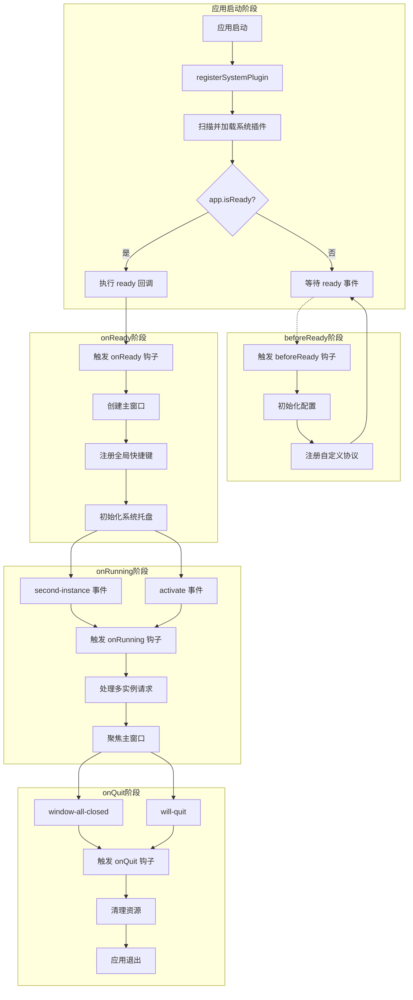
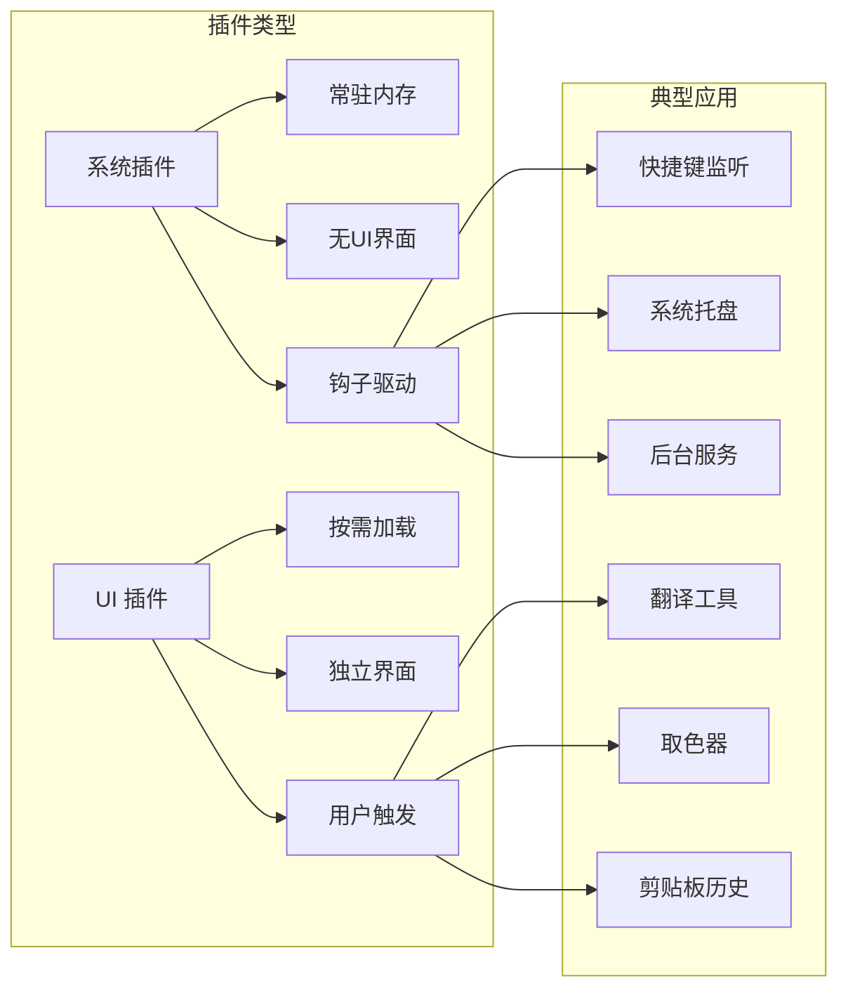

# 系统插件加载与取色器实战

> 本文档介绍 Rubick 插件系统的核心概念，包括系统插件和 UI 插件的开发规范、生命周期管理，并通过取色器插件实战演示完整的开发流程。

插件主要分为两大类：

- **UI 类插件**：这类插件通过 `BrowserView` 加载，通常拥有独立的图形用户界面（GUI）。它们在需要时被唤起，使用完毕后销毁，不会常驻内存
- **系统类插件**：这类插件是常驻在 `Rubick` 运行时的 JavaScript 代码片段。它们通过监听 `Rubick` 的特定运行状态钩子来执行，适合实现一些需要在后台持续运行或与系统底层交互的功能

## 系统插件详解

一个最基础的系统类插件目录结构非常简洁：

```bash
plugin
|-- index.js       # 插件入口文件
└── package.json   # 插件配置文件
```

与 UI 类插件相比，系统类插件的 `package.json` 文件需要额外指定 `pluginType` 和 `entry` 两个字段：

- `pluginType`: 必须设置为 `"system"`，以表明这是一个系统类插件
- `entry`: 指定插件的入口 JavaScript 文件

```json
{
  "pluginType": "system",
  "entry": "index.js"
}
```

### 入口文件与生命周期钩子

系统插件的能力是通过在入口文件中导出一个函数，并返回一个包含特定生命周期钩子的对象来实现的。这些钩子函数会在 `Rubick` 运行的不同阶段被调用，从而实现代码注入。

```javascript
// index.js
module.exports = () => {
  return {
    /**
     * 在 Electron App 启动前的准备阶段执行
     */
    beforeReady() {
      // ...
    },
    /**
     * 在 Electron App 'ready' 事件触发后执行
     */
    onReady(ctx) {
      // ...
    },
    /**
     * 在 Rubick 处于运行状态时执行
     */
    onRunning(ctx) {
      // ...
    },
    /**
     * 在 Rubick 即将退出时执行
     */
    onQuit() {
      // ...
    }
  }
}
```

## 系统插件的加载机制

### Electron App 生命周期与插件钩子

为了让系统插件能够精准地在应用生命周期的特定阶段执行代码，`Rubick` 将 Electron 的 `app` 模块生命周期事件与插件的钩子函数进行了映射。

#### 生命周期流程图



#### 钩子函数执行时序

| 阶段 | Electron 事件 | 插件钩子 | 典型用途 |
|-----|--------------|---------|---------|
| 初始化前 | - | `beforeReady()` | 注册协议、初始化配置 |
| 就绪 | `app.on('ready')` | `onReady(ctx)` | 创建窗口、注册快捷键 |
| 运行中 | `second-instance`, `activate` | `onRunning(ctx)` | 处理激活、多实例 |
| 退出 | `window-all-closed`, `will-quit` | `onQuit()` | 保存状态、清理资源 |

#### 详细说明

1.  **`beforeReady`**: 在 Electron 的 `app.on('ready')` 事件触发前执行。此阶段 `Rubick` 会加载并执行所有系统插件的 `beforeReady` 钩子
2.  **`onReady`**: 在 `app.on('ready')` 事件触发后执行。此阶段 `Rubick` 会进行更新检测、创建系统菜单和主窗口等操作，并执行所有系统插件的 `onReady` 钩子
3.  **`onRunning`**: 在处理 `app.on('second-instance')`（尝试启动第二个应用实例）和 `app.on('activate')`（应用被激活）事件时执行。此阶段会触发系统插件的 `onRunning` 钩子
4.  **`onQuit`**: 在处理 `app.on('window-all-closed')`（所有窗口关闭）和 `app.on('will-quit')`（应用即将退出）事件时执行。此阶段会触发系统插件的 `onQuit` 钩子

### 主进程改造 (`main/index.js`)

为了实现上述机制，需要对 `Rubick` 的主进程入口文件 `main/index.js` 进行改造，引入一个 `App` 类来统一管理应用的生命周期和插件加载

```javascript
import electron, { app, protocol } from "electron"
import { registerSystemPlugin } from "./registerSystemPlugin" // 假设插件注册逻辑在此文件

class App {
  constructor() {
    // 注册自定义协议
    protocol.registerSchemesAsPrivileged([
      { scheme: "app", privileges: { secure: true, standard: true } }
    ])

    // 实现单例应用
    const gotTheLock = app.requestSingleInstanceLock()
    if (!gotTheLock) {
      app.quit()
    } else {
      // 1. 注册系统插件
      this.systemPlugins = registerSystemPlugin()
      // 2. 注册生命周期
      this.beforeReady()
      this.onReady()
      this.onRunning()
      this.onQuit()
    }
  }

  beforeReady() {
    // ... 其他准备工作
    // 触发 beforeReady 钩子
    this.systemPlugins.triggerBeforeReadyHooks()
  }

  createWindow() {
    this.windowCreator.init()
  }

  onReady() {
    const readyFunction = async () => {
      // ... 其他 onReady 操作
      // 触发 onReady 钩子
      this.systemPlugins.triggerReadyHooks()
    }
    if (!app.isReady()) {
      app.on("ready", readyFunction)
    } else {
      readyFunction()
    }
  }

  onRunning() {
    app.on("second-instance", (event, commandLine, workingDirectory) => {
      // ... 处理第二个实例的逻辑
    })
    app.on("activate", () => {
      // ... 处理应用激活的逻辑
    })
    // 触发 onRunning 钩子
    this.systemPlugins.triggerOnRunningHooks()
  }

  onQuit() {
    app.on("window-all-closed", () => {
      if (process.platform !== "darwin") {
        app.quit()
      }
    })

    app.on("will-quit", () => {
      // ... 其他退出前操作
      // 触发 onQuit 钩子
      this.systemPlugins.triggerOnQuitHooks()
    })
  }
}

export default new App()
```

**核心逻辑**：

1.  在 `App` 类的构造函数中，首先调用 `registerSystemPlugin()` 来扫描、注册所有已安装的系统插件
2.  随后在 `App` 的各个生命周期方法（`beforeReady`、`onReady` 等）中，调用 `this.systemPlugins` 暴露出的触发器方法（如 `triggerReadyHooks`），来执行所有插件对应的钩子函数

### 插件注册与钩子触发 (`registerSystemPlugin.js`)

`registerSystemPlugin.js` 文件负责扫描插件、收集钩子函数，并提供触发这些钩子的方法。下面以 `onReady` 钩子为例说明其实现：

```javascript
// registerSystemPlugin.js
import path from "path"
import fs from "fs"
import { PLUGIN_INSTALL_DIR } from "@/common/constants/main" // 插件安装目录

const registerSystemPlugin = () => {
  // 1. 从所有插件中筛选出系统插件
  const totalPlugins = getAllInstalledPlugins() // 假设此函数返回所有插件信息
  let systemPlugins = totalPlugins.filter((plugin) => plugin.pluginType === "system")

  // 2. 将插件的相对入口路径转换为绝对路径
  systemPlugins = systemPlugins
    .map((plugin) => {
      try {
        const pluginPath = path.resolve(
          PLUGIN_INSTALL_DIR,
          "node_modules",
          plugin.name
        )
        return {
          ...plugin,
          indexPath: path.join(pluginPath, "./", plugin.entry)
        }
      } catch (e) {
        console.error(`Failed to resolve path for plugin: ${plugin.name}`, e)
        return false
      }
    })
    .filter(Boolean)

  // 3. 定义钩子函数收集器
  const hooks = {
    onReady: []
    // ... 其他钩子
  }

  // 4. 动态加载插件并收集 onReady 钩子
  systemPlugins.forEach((plugin) => {
    if (fs.existsSync(plugin.indexPath)) {
      try {
        const pluginModule = __non_webpack_require__(plugin.indexPath)()
        if (pluginModule && typeof pluginModule.onReady === "function") {
          hooks.onReady.push(pluginModule.onReady)
        }
      } catch (e) {
        console.error(`Failed to load plugin: ${plugin.name}`, e)
      }
    }
  })

  // 5. 定义 onReady 钩子触发器
  const triggerReadyHooks = (ctx) => {
    hooks.onReady.forEach((hook) => {
      try {
        hook(ctx)
      } catch (e) {
        console.error("Error executing onReady hook:", e)
      }
    })
  }

  // 6. 返回所有钩子触发器
  return {
    triggerReadyHooks
    // ... 其他触发器
  }
}
```

### `__non_webpack_require__` 的作用

在 Webpack 环境中，`require` 函数会被 Webpack 重写，用于处理模块依赖打包。然而，`Rubick` 的插件是在运行时动态加载的，它们是标准的 Node.js 模块，并未被 Webpack 打包。

为了在 Webpack 打包的主进程代码中能够正确加载这些外部的、未打包的 Node.js 模块，需要使用 `__non_webpack_require__`。这个 Webpack 提供的特殊变量可以绕过其模块加载机制，直接使用 Node.js 原生的 `require` 函数

## UI 插件开发实战：桌面取色器

### 系统插件与 UI 插件对比

在开始开发之前，先了解两种插件类型的关键区别：

| 特性 | 系统插件 | UI 插件 |
|-----|---------|--------|
| **运行方式** | 常驻主进程 | 按需加载销毁 |
| **界面** | 无独立界面 | 有独立界面 |
| **加载容器** | 直接在主进程执行 | BrowserView |
| **适用场景** | 后台服务、快捷键监听 | 工具类、信息展示 |
| **生命周期** | 随应用启动和退出 | 用户触发时创建 |
| **资源占用** | 持续占用 | 临时占用 |



本节将以 `Vue 3 + Ant Design Vue` 为技术栈，从零开始开发一个桌面取色器插件，来完整演示 UI 插件的开发流程。

```shell
vue create rubick-plugin-colorpicker
```

### 适配插件规范

创建好的 Vue 项目需要进行一些调整，以符合 `Rubick` UI 插件的规范

#### `public` 目录调整

`vue-cli-service build` 命令会将 `public` 目录下的所有文件直接复制到最终的 `dist` 目录。因此将 `Rubick` 插件所需的 `package.json` 和 `preload.js` 文件直接放在 `public` 目录下。调整后的 `public` 目录结构：

```
public
├── favicon.ico
├── index.html
├── package.json   # 插件配置文件
└── preload.js     # 预加载脚本
```

#### `package.json` 配置

在 `public/package.json` 中需要定义插件的元信息：

```json
{
  "name": "rubick-plugin-colorpicker",
  "pluginName": "取色器",
  "version": "1.0.0",
  "description": "一个简单的桌面屏幕取色器",
  "main": "index.html",
  "preload": "preload.js",
  "logo": "https://pic1.zhimg.com/80/v2-5f1810a71af6eefcd77edbbf07ea1cc7_720w.png",
  "pluginType": "ui",
  "features": [
    {
      "code": "colorpicker",
      "explain": "取色器",
      "cmds": ["colorpicker", "qs", "取色"]
    }
  ],
  "development": "http://localhost:8080"
}
```

- **`main`**: UI 入口文件，指向 `index.html`
- **`preload`**: 预加载脚本，用于在渲染器进程中注入 Node.js API
- **`features`**: 定义插件的功能和唤起关键词。`cmds` 数组中的关键词都可以用来搜索和启动该插件
- **`development`**: **开发环境**下 UI 界面的访问地址。设置此字段后，`Rubick` 在开发模式下会直接加载此 URL，从而实现热更新

#### `vue.config.js` 调整

由于 `Rubick` 插件是通过 `file://` 协议加载本地资源的，需要将 Vue 的 `publicPath` 在生产环境下设置为空字符串，以确保资源路径是相对路径

```javascript
// vue.config.js
const { defineConfig } = require("@vue/cli-service")
module.exports = defineConfig({
  // ...
  publicPath: process.env.NODE_ENV === "production" ? "" : "/"
})
```

完成以上配置后，运行构建命令：

```bash
npm run build
```

生成的 `dist` 目录就是一个可以直接在 `Rubick` 中安装和运行的插件包

### 插件调试

#### `npm link` 本地调试

为了方便调试可以使用 `npm link` 将本地的插件包链接到全局，然后在 `Rubick` 中进行安装

1.  在 `dist` 目录下执行：
    ```bash
    $ npm link
    ```
2.  在 `Rubick` 中通过“本地安装”的方式安装该插件。这本质上是执行 `npm link rubick-plugin-colorpicker`

安装完成后，就可以通过关键词（如“取色”）唤起插件了

#### 热更新配置

每次修改代码后都需要重新 `build` 和 `link` 非常低效。通过在 `public/package.json` 中配置 `development` 字段，可以实现开发环境下的热更新。

1.  启动 Vue 开发服务器：
    ```bash
    $ npm run serve
    ```
2.  在 `Rubick` 中重新加载插件（或重启 `Rubick`）

此时 `Rubick` 会直接加载 `http://localhost:8080`，在本地对代码的任何修改都会实时反映在插件界面上

### 功能实现：屏幕取色

#### 引入 `electron-color-picker`

将使用 [electron-color-picker](https://github.com/mockingbot/electron-color-picker) 这个开源库来实现核心的屏幕取色功能。

在 `public` 目录下安装依赖：

```shell
$ npm install electron-color-picker
```

> **注意**：此依赖应该安装在 `public` 目录下，因为它是在 `preload.js` 中被 `require` 的，而 `preload.js` 最终会位于 `dist` 目录的根路径

#### `preload.js` 注入核心功能

`preload.js` 是连接 `Rubick` 主进程能力和插件渲染器进程的桥梁。将在这里封装取色功能，并将其挂载到 `window` 对象上，供前端页面调用

```javascript
// public/preload.js
const {
  getColorHexRGB,
  darwinGetScreenPermissionGranted,
  darwinRequestScreenPermissionPopup
} = require("electron-color-picker")
const os = require("os")

const isDarwin = os.platform() === "darwin"

// 将取色功能封装并挂载到 window 对象
window.colorpicker = async () => {
  try {
    // 1. 取色前先隐藏主窗口
    window.rubick.hideMainWindow()

    // 2. 在 macOS 上，需要检查并请求屏幕录制权限
    if (isDarwin) {
      const permission = await darwinGetScreenPermissionGranted()
      if (!permission) {
        // 如果没有权限，则弹出请求权限的对话框
        return darwinRequestScreenPermissionPopup()
      }
    }

    // 3. 调用核心库进行取色
    const result = await getColorHexRGB()

    // 4. 取色成功后，将颜色值复制到剪贴板并显示系统通知
    if (result) {
      window.rubick.copyText(result)
      window.rubick.showNotification(`${result}, 取色成功！已复制到剪贴板`)
    }
  } catch (e) {
    console.error("Color picker error:", e)
  } finally {
    // 无论成功与否，操作结束后都显示主窗口
    window.rubick.showMainWindow()
  }
}
```

- `window.rubick.*`: 这是 `Rubick` 注入到 `preload` 环境的 API，提供了隐藏/显示主窗口、复制文本、显示通知等能力

#### 前端页面调用

在 Vue 组件中可以像调用普通函数一样调用挂载在 `window` 上的 `colorpicker` 方法

```html
<!-- src/App.vue -->
<template>
  <div class="color-picker-container">
    <button @click="pickColor">开始取色</button>
  </div>
</template>

<script>
  export default {
    methods: {
      pickColor() {
        if (window.colorpicker) {
          window.colorpicker()
        } else {
          console.error("colorpicker function not found on window object.")
        }
      }
    }
  }
</script>
```

点击按钮后，取色器就会被激活

## 插件调试与发布

### 插件发布

当插件开发和测试完成后，就可以将其发布到 npm 上，供其他用户下载使用

1. 确保 `package.json` 中的 `name`、`version` 等信息正确无误

2. 在 `dist` 目录下执行发布命令：

   ```shell
   $ npm publish
   ```

通过桌面取色器的实战案例，掌握从项目初始化、适配 `Rubick` 规范、开发调试到最终发布的全过程。希望这能为你开发自己的 `Rubick` 插件提供清晰的指引。

### 开发流程总结


### 常见问题排查

| 问题 | 可能原因 | 解决方案 |
|-----|---------|---------|
| 插件无法加载 | `package.json` 格式错误 | 检查 JSON 语法，确保必填字段完整 |
| 热更新不生效 | `development` 配置错误 | 确认开发服务器地址正确，检查端口占用 |
| preload 脚本失效 | 路径配置错误 | 确认 `preload` 字段与实际文件路径一致 |
| 功能无法调用 | API 未正确注入 | 检查 `window.rubick` 是否存在，查看控制台错误 |
| 发布失败 | npm 登录或权限问题 | 执行 `npm login`，检查包名是否重复 |

> [取色插件完整代码参考](https://gitee.com/rubick-center/rubick-system-color-picker)
