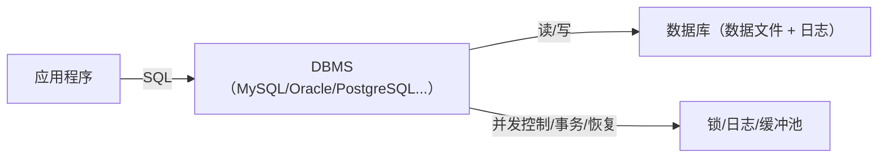
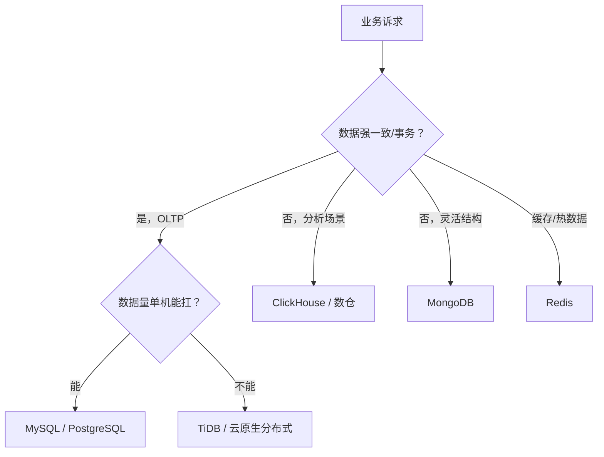
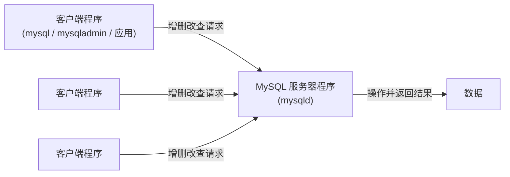
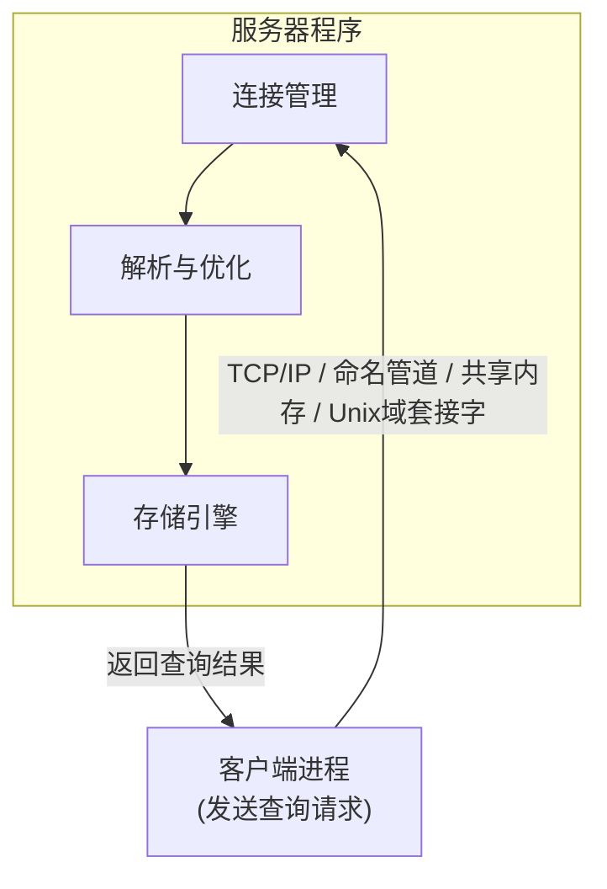
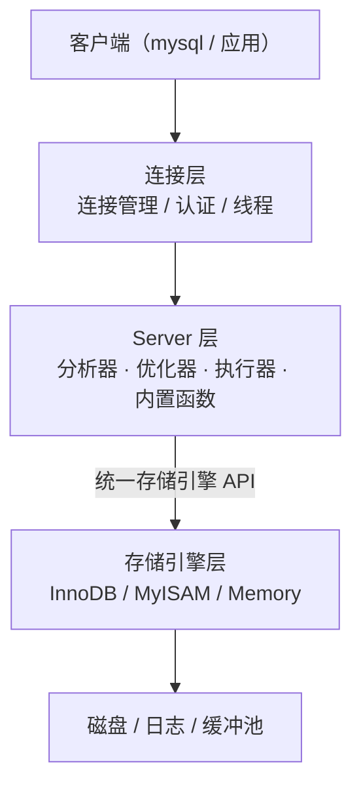
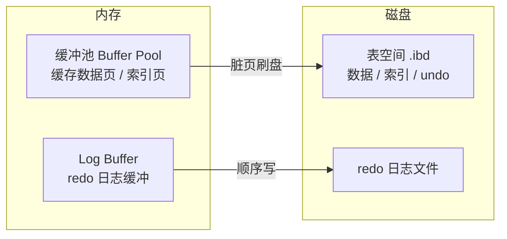

# MySQL入门与体系概览

## MySQL在数据库生态中的地位

"数据库"是软件工程中最基础也最重要的概念。MySQL 是数据库的一种。根据数据库的类型、功能或发展方向，可以把数据库大致分成关系型数据库和非关系型数据库（SQL 和 NoSQL），关系型数据库又可以分为传统的关系型数据库和 NewSQL。在整个数据库图谱中，MySQL 占有非常重要的地位：据 Gartner 数据，已有超过 63% 的用户已经部署或将部署 MySQL。目前国内大部分互联网公司（腾讯、阿里、百度、美团、滴滴等）都选择 MySQL 数据库来支撑自己的业务。

MySQL 之所以成为互联网事实标准，主要因为它具有 8 大优点：体积小、速度快；开源免费、工具生态完善；简单易用、维护成本低；兼容性好、支持多种操作系统；提供多种 API 接口；支持多种开发语言；社区及用户活跃；最重要的，支持事务、MVCC、4 种隔离级别，同时易扩展、集群、高可用。MySQL 8.0 已补齐窗口函数、CTE、JSON 原生支持、原子 DDL、不可见索引等，功能上不输商业数据库。

## 数据库与DBMS

- **数据库（Database）**：按特定结构组织、存储和管理的数据集合。数据不再是散落的文件，而是有结构、有约束、可高效查询的集合。
- **数据库管理系统（DBMS）**：管理数据库的软件系统，负责数据的存储、检索、并发控制、安全与恢复。**我们日常说的"MySQL""Oracle"都是 DBMS 而非数据库本身**。



DBMS 的核心职责：

| 职责 | 说明 |
|------|------|
| 数据存储 | 组织文件、索引，高效读写 |
| 并发控制 | 多用户同时访问时的隔离与锁 |
| 事务管理 | ACID 保证 |
| 安全管理 | 认证、授权、审计 |
| 恢复机制 | 崩溃后数据不丢失（redo/undo/备份） |

## 关系型数据库与SQL

- **关系模型**：数据组织为二维表（关系），表由行（记录）与列（字段）构成，表间通过键建立关联；
- **SQL（Structured Query Language）**：操作关系型数据库的标准语言，分四类：
  - DDL（定义）：`CREATE/ALTER/DROP`；
  - DML（操作）：`INSERT/UPDATE/DELETE`；
  - DQL（查询）：`SELECT`；
  - DCL（控制）：`GRANT/REVOKE`。

**关系型数据库为什么长盛不衰**：强约束（完整性）、事务（ACID）、标准 SQL、生态成熟。代价是扩展性受限于单机（→ 分库分表/NewSQL）。

## 主流数据库产品与选型

| 产品 | 类型 | 特点 | 适用 |
|------|------|------|------|
| **MySQL** | 关系型（开源） | 生态最广、互联网事实标准、8.0 功能完善 | 通用 OLTP，绝大多数业务 |
| PostgreSQL | 关系型（开源） | 功能最全（丰富类型/窗口函数/扩展）、严谨 | 复杂查询、GIS、金融级严谨场景 |
| Oracle | 关系型（商业） | 企业级功能与支持最强、成本高 | 传统大企业、金融核心 |
| SQL Server | 关系型（商业） | Windows/.NET 生态集成好 | 微软技术栈企业 |
| SQLite | 嵌入式关系型 | 零配置、单文件 | 移动端、客户端本地存储 |
| MongoDB | 文档型 NoSQL | 灵活 schema、水平扩展 | 非结构化/快速迭代 |
| Redis | KV NoSQL | 内存级性能 | 缓存/计数器/队列 |
| ClickHouse | 列式 OLAP | 分析查询极快 | 日志分析、BI 报表 |
| TiDB | 分布式 NewSQL | MySQL 兼容 + 透明扩展 | 海量数据 OLTP |

**选型决策树**：



## MySQL的客户端／服务器架构

以微信为例，它由客户端程序与服务器程序两部分组成。`MySQL` 的使用过程与此类似：它的服务器程序直接和存储的数据打交道，可以有多个客户端程序连接到服务器，发送增删改查请求，服务器响应这些请求并操作它维护的数据。每个客户端都需要提供用户名密码登录。



日常使用 `MySQL` 的情景一般是：

1. 启动 `MySQL` 服务器程序；
2. 启动 `MySQL` 客户端程序并连接到服务器程序；
3. 在客户端程序输入命令语句作为请求发送到服务器程序，服务器程序根据请求内容操作具体数据，并向客户端返回操作结果。

一台计算机上可以同时运行多个程序，每一个运行着的程序也被称为一个 `进程`。`MySQL` 服务器进程的默认名称为 `mysqld`，常用的 `MySQL` 客户端进程的默认名称为 `mysql`。

## MySQL的安装

`MySQL` 的安装目录下有一个重要的 `bin` 目录，其中存放着许多可执行文件。`MySQL` 可以运行在多种操作系统上，以 `macOS`（类 UNIX）和 `Windows` 操作系统为例，两者的安装目录分别是：

- `macOS` 操作系统上的安装目录：`/usr/local/mysql/`
- `Windows` 操作系统上的安装目录：`C:\Program Files\MySQL\MySQL Server 8.0`

`MySQL` 安装目录下的 `bin` 目录存放着服务器程序和客户端程序的可执行文件。可以使用可执行文件的相对/绝对路径，也可以将该 `bin` 目录的路径加入到环境变量 `PATH` 中，从而直接输入可执行文件名启动。

## 启动MySQL服务器程序

### UNIX里启动服务器程序

- `mysqld`：代表 `MySQL` 服务器程序，运行这个可执行文件可以直接启动一个服务器进程；
- `mysqld_safe`：一个启动脚本，它会间接调用 `mysqld`，并顺便启动一个监控进程，在服务器进程挂掉时可以帮助重启它；还会把服务器程序的出错信息和诊断信息重定向到出错日志文件；
- `mysql.server`：也是一个启动脚本，它会间接调用 `mysqld_safe`。调用 `mysql.server` 时在后面指定 `start` 参数即可启动服务器程序，指定 `stop` 参数即可关闭服务器程序；
- `mysqld_multi`：可以对多个服务器进程的启动或停止进行监控。

### Windows里启动服务器程序

- `mysqld`：在 `bin` 目录下运行 `mysqld` 即可启动服务器程序；
- 以服务的方式运行：把 `mysqld` 注册为一个 `Windows 服务`，之后用 `net start MySQL` 启动、`net stop MySQL` 停止。

## 启动MySQL客户端程序

启动 `MySQL` 客户端程序时一般需要一些参数，格式如下：

```bash
mysql -h主机名  -u用户名 -p密码
```

各个参数的意义如下：

| 参数名 | 含义 |
|:--|:--|
| `-h` | 表示服务器进程所在计算机的域名或 IP 地址；如果服务器进程运行在本机，可以省略该参数，或填 `localhost`、`127.0.0.1` |
| `-u` | 表示用户名 |
| `-p` | 表示密码 |

### 连接注意事项

- 最好不要在一行命令中输入密码，执行 `mysql -hlocalhost -uroot -p` 后回车，会提示输入密码，此时输入的密码不会被显示出来；
- 如果非要在命令行显式输出密码，那么 `-p` 和密码值之间不能有空白字符；
- `mysql` 的各个参数摆放顺序没有硬性规定；
- 如果服务器和客户端安装在同一台机器上，`-h` 参数可以省略；
- 如果使用类 `UNIX` 系统并省略 `-u` 参数，会把登录操作系统的用户名当作 `MySQL` 的用户名处理。

## 客户端与服务器连接的过程

运行着的服务器程序和客户端程序本质上都是计算机上的一个进程，因此客户端进程向服务器进程发送请求并得到回复的过程，本质上是一个进程间通信的过程。`MySQL` 支持下面三种客户端进程和服务器进程的通信方式：

### TCP/IP

`MySQL` 采用 `TCP` 作为服务器和客户端之间的网络通信协议。`MySQL` 服务器启动时会默认申请 `3306` 端口号，之后在这个端口号上等待客户端进程连接。如果 `3306` 端口号已被其他进程占用，可以在启动服务器程序的命令行里添加 `-P` 参数来指定端口号。

### 命名管道和共享内存

如果是 `Windows` 用户，客户端进程和服务器进程之间可以考虑使用 `命名管道` 或 `共享内存` 通信。使用 `命名管道` 需要在启动服务器程序的命令中加上 `--enable-named-pipe` 参数；使用 `共享内存` 需要在启动服务器程序的命令中加上 `--shared-memory` 参数。

### Unix域套接字文件

如果服务器进程和客户端进程都运行在同一台类 `Unix` 操作系统机器上，可以使用 `Unix域套接字文件` 进行进程间通信。如果启动客户端程序时指定的主机名为 `localhost`，服务器程序和客户端程序之间就会通过 `Unix` 域套接字文件通信。`MySQL` 服务器程序默认监听的 `Unix` 域套接字文件路径为 `/tmp/mysql.sock`。

## 服务器处理客户端请求

客户端进程向服务器进程发送一段文本（MySQL 语句），服务器进程处理后再向客户端进程返回一段文本（处理结果）。服务器程序处理来自客户端的查询请求大致经过三个部分：`连接管理`、`解析与优化`、`存储引擎`。



### 连接管理

每当有客户端进程连接服务器进程时，服务器进程都会创建一个线程专门处理与该客户端的交互；当该客户端退出断开连接时，服务器并不会立即销毁该线程，而是把它缓存起来，在新的客户端连接时把缓存线程分配给新客户端。这样就避免了频繁创建和销毁线程，节省开销。

### 解析与优化

`MySQL` 服务器接收到的请求只是一个文本消息，该文本消息还要经过几个重要处理阶段：`查询缓存`、`语法解析` 和 `查询优化`。

- **查询缓存**：把刚刚处理过的查询请求和结果缓存起来，如果下一次有完全相同的请求，直接从缓存中查找结果。但缓存有严格的匹配条件（任何字符不同都不命中），且表结构或数据被修改时缓存会失效。需要注意，**查询缓存在 MySQL 8.0 中已被彻底移除**（5.7.20 起废弃、8.0.3 正式移除），5.7 时代"相同 SQL 直接返回缓存结果"的优化在写多读少、缓存失效频繁的场景下弊大于利。
- **语法解析**：`MySQL` 服务器首先要对文本做分析，判断请求语法是否正确，然后将要查询的表、各种查询条件提取出来，放到内部使用的数据结构中。
- **查询优化**：`MySQL` 的优化程序会对语句做优化，如外连接转换为内连接、表达式简化、子查询转为连接等。优化的结果是生成一个执行计划，它表明应该使用哪些索引查询、表之间的连接顺序等。可以使用 `EXPLAIN` 语句查看某个语句的执行计划。

### 存储引擎

`MySQL` 服务器把数据的存储和提取操作封装到了一个叫 `存储引擎` 的模块里。`表` 由一行一行的记录组成，但这只是逻辑概念；物理上如何表示记录、怎么从表中读取数据、怎么把数据写入具体的物理存储器，都是 `存储引擎` 负责的事情。为了管理方便，把 `连接管理`、`查询缓存`、`语法解析`、`查询优化` 这些不涉及真实数据存储的功能划分为 `MySQL server` 的功能，把真实存取数据的功能划分为 `存储引擎` 的功能。各种存储引擎向上面的 `MySQL server` 层提供统一的调用接口（即存储引擎 API）。

## 常用存储引擎

`MySQL` 支持非常多种存储引擎，实际最常用的是 `InnoDB` 和 `MyISAM`：

| 存储引擎 | 描述 |
|:--|:--|
| `InnoDB` | 具备外键支持功能的事务存储引擎（MySQL 默认） |
| `MyISAM` | 主要的非事务处理存储引擎 |
| `MEMORY` | 置于内存的表 |
| `ARCHIVE` | 用于数据存档（行被插入后不能再修改） |
| `CSV` | 存储数据时以逗号分隔各个数据项 |

不同存储引擎支持不同功能（如事务、外键、行锁/表锁、MVCC 等），可以用 `SHOW ENGINES;` 查看当前服务器程序支持的存储引擎。可以在创建表时通过 `ENGINE = 存储引擎名称` 指定表的存储引擎，或用 `ALTER TABLE 表名 ENGINE = 存储引擎名称` 修改表的存储引擎。

最常用的 `InnoDB` 与 `MyISAM` 详细对比：

| 特性 | InnoDB | MyISAM |
|:---|:---|:---|
| 事务支持 | ✅ 支持 | ❌ 不支持 |
| 锁粒度 | 行级锁 | 表级锁 |
| 外键约束 | ✅ 支持 | ❌ 不支持 |
| 全文索引 | MySQL 5.6+ 支持 | ✅ 支持 |
| 崩溃恢复 | ✅ 自动恢复 | ❌ 需手动修复 |
| 存储限制 | 64TB | 256TB |
| 适用场景 | 大部分应用（推荐） | 只读应用、全文检索 |

::: tip 小贴士
InnoDB 是 MySQL 默认的存储引擎，本书后续章节将深入分析这个存储引擎的各种功能（记录结构、页结构、表空间、Buffer Pool、事务、日志、锁等）。
:::

## 体系结构：Server 层与存储引擎层

上一节提到"存储引擎"只负责存取，真实的数据处理由 `MySQL server` 层调度。本节展开 MySQL 的整体体系结构。

### 逻辑分层

MySQL 的体系结构自上而下可以分成三层：

1. **连接层**（客户端/服务器通信）
   - 处理客户端连接、身份认证、权限校验、线程/连接池管理；
   - 支持 TCP/IP、命名管道与共享内存、Unix 域套接字三种通信方式（详见前文"客户端与服务器连接的过程"）。
2. **Server 层**（核心服务层，所有存储引擎共享）
   - 连接器、查询缓存（8.0 已移除）、分析器（语法/词法解析）、优化器（生成执行计划）、执行器；
   - 内置函数、视图、触发器、存储过程等跨引擎能力；
   - 所有跨存储引擎的功能都在此层实现，与底层引擎解耦。
3. **存储引擎层**（插件式，真正负责数据存取）
   - InnoDB、MyISAM、Memory 等以插件形式存在；
   - 向上提供统一的存储引擎 API，Server 层不关心底层细节；
   - 同一实例的不同表可使用不同存储引擎。



### 插件式存储引擎

MySQL 的存储引擎是**可插拔**的：Server 层通过统一的 Handler 接口调用引擎，引擎各自实现记录的读取、写入、索引扫描、事务与锁。可用 `SHOW ENGINES;` 查看当前支持的引擎，建表时用 `ENGINE = 引擎名` 指定。

### InnoDB 存储引擎架构

`InnoDB` 是 MySQL 默认的、也是最重要的存储引擎，其架构围绕"内存结构 + 磁盘结构"展开：



- **内存结构**：
  - **缓冲池 Buffer Pool**：缓存数据页和索引页，是 InnoDB 性能的核心；读请求先查缓冲池，未命中才读磁盘并缓存；写请求先改缓冲池中的页，标记脏页后由后台线程刷盘（WAL 思路）。
  - **Log Buffer**：redo 日志的缓冲区，`redo` 先写缓冲再按策略刷到磁盘文件。
  - 后台线程包括 **Master Thread**（核心后台线程，调度刷脏、合并插入缓冲等）、**IO Thread**（处理异步 AIO 读写）、**Purge Thread**（回收 undo 页）、**Page Cleaner Thread**（刷脏页）。
- **磁盘结构**：
  - **表空间**：InnoDB 数据存于表空间，包含系统表空间、独立表空间（每表一个 `.ibd`）、通用表空间、临时表空间、undo 表空间；
  - **redo 日志文件**：保证崩溃后可恢复；
  - **双写缓冲 Doublewrite Buffer**：防止页部分写失效——脏页刷盘时先写双写缓冲区，再写真正数据文件，崩溃恢复时以双写缓冲为准。

### 各存储引擎对比

| 存储引擎 | 事务 | 锁粒度 | 外键 | 适用场景 |
|:--|:--|:--|:--|:--|
| InnoDB | ✅ | 行级 | ✅ | 绝大多数 OLTP（默认） |
| MyISAM | ❌ | 表级 | ❌ | 只读、全文检索 |
| Memory | ❌ | 表级 | ❌ | 临时数据、缓存 |
| Archive | ❌ | 行级 | ❌ | 归档、日志 |
| CSV | ❌ | 表级 | ❌ | 数据交换 |

:::: tip 小贴士
本节把"存储引擎"一节的概览与体系结构打通：Server 层负责通用逻辑，InnoDB 负责数据存取，二者通过 Handler 接口解耦。后续章节将分别深入记录结构、页结构、表空间、Buffer Pool、事务、锁与日志。
::::

## 小结

- 数据库是结构化数据集合，DBMS 是管理它的软件，日常所说的"MySQL"指 DBMS；
- 关系模型 + SQL 是关系型数据库的核心，ACID 与约束是其价值所在；
- 选型看业务：OLTP 用 MySQL/PostgreSQL，海量数据用 NewSQL，分析用列式，缓存用 Redis；
- MySQL 采用客户端/服务器架构，一条 SQL 经过连接管理、解析与优化、存储引擎三大部分处理；
- 理解 MySQL 体系结构（Server 层 + 存储引擎层）、SQL 执行链路，是掌握索引、事务、锁、高可用等一切后续主题的前提。
