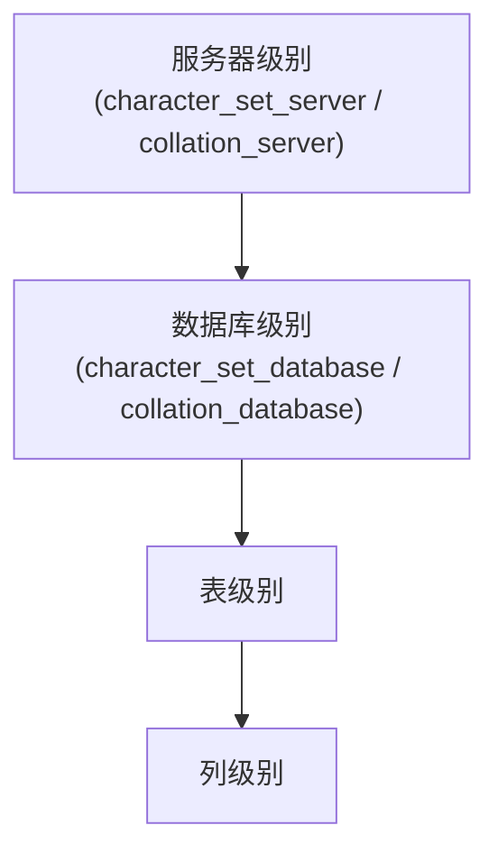

# 字符集和比较规则

## 字符集和比较规则简介

### 字符集简介

计算机中只能存储二进制数据，要存储字符串，就需要建立字符与二进制数据的映射关系。建立这个关系至少要搞清楚两件事：

1. 要把哪些字符映射成二进制数据？——即界定清楚字符范围；
2. 怎么映射？——将一个字符映射成二进制数据的过程叫 `编码`，将一个二进制数据映射成字符的过程叫 `解码`。

人们抽象出 `字符集` 的概念来描述某个字符范围的编码规则。例如自定义一个名为 `xiaohaizi` 的字符集，它包含的字符范围和编码规则如下：

- 包含字符 `'a'`、`'b'`、`'A'`、`'B'`；
- 编码规则：采用 1 个字节编码一个字符，字符和字节的映射关系如下：

```text
'a' -> 00000001 (十六进制：0x01)
'b' -> 00000010 (十六进制：0x02)
'A' -> 00000011 (十六进制：0x03)
'B' -> 00000100 (十六进制：0x04)
```

有了 `xiaohaizi` 字符集，就可以用二进制形式表示一些字符串。下面是几个字符串用 `xiaohaizi` 字符集编码后的二进制表示：

```text
'bA' -> 0000001000000011  (十六进制：0x0203)
'baB' -> 000000100000000100000100  (十六进制：0x020104)
'cd' -> 无法表示，字符集 xiaohaizi 不包含字符 'c' 和 'd'
```

### 比较规则简介

确定了 `xiaohaizi` 字符集表示字符的范围和编码规则后，怎么比较两个字符的大小？最直接的方法是比较两个字符对应的二进制编码大小。例如字符 `'a'` 的编码为 `0x01`，字符 `'b'` 的编码为 `0x02`，所以 `'a'` 小于 `'b'`。这种简单的比较规则称为二进制比较规则，英文名为 `binary collation`。

二进制比较规则虽然简单，但有时不符合现实需求。例如在很多场合对英文字符不区分大小写，`'a'` 和 `'A'` 视为相等，此时不能直接用二进制比较规则，可以这样指定比较规则：

1. 将两个大小写不同的字符全部转为大写或小写；
2. 再比较这两个字符对应的二进制数据。

这是一种稍复杂的比较规则。实际生活中的字符不止英文字符，例如汉字有几万几十万之多。对某一种字符集来说，比较两个字符大小的规则可以制定出很多种，即**同一种字符集可以有多种比较规则**。下面介绍现实生活中的各种字符集以及它们的一些比较规则。

### 一些重要的字符集

不同的人制定出了多种 `字符集`，它们表示的字符范围和编码规则可能都不一样。下面看一些常用字符集的情况：

- `ASCII` 字符集：共收录 128 个字符，包括空格、标点符号、数字、大小写字母和一些不可见字符。由于总共才 128 个字符，可用 1 个字节编码，例如：

```text
'L' ->  01001100（十六进制：0x4C，十进制：76）
'M' ->  01001101（十六进制：0x4D，十进制：77）
```

- `ISO 8859-1` 字符集：共收录 256 个字符，在 `ASCII` 字符集基础上扩充了 128 个西欧常用字符（包括德法两国的字母），可用 1 个字节编码。该字符集也有一个别名 `latin1`。

- `GB2312` 字符集：收录了汉字以及拉丁字母、希腊字母、日文平假名及片假名字母、俄语西里尔字母。其中收录汉字 6763 个、其他文字符号 682 个。它兼容 `ASCII` 字符集，所以编码方式比较特殊：
  - 如果该字符在 `ASCII` 字符集中，则采用 1 字节编码；
  - 否则采用 2 字节编码。

  这种表示一个字符所需字节数可能不同的编码方式称为 `变长编码方式`。例如字符串 `'爱u'`，`'爱'` 需要 2 个字节编码（十六进制为 `0xCED2`），`'u'` 需要 1 个字节编码（十六进制为 `0x75`），拼合起来就是 `0xCED275`。

  ::: tip 小贴士
  如何区分某个字节代表一个单独的字符还是某个字符的一部分？ASCII 字符集只收录 128 个字符，用 0～127 即可表示全部字符。所以如果某个字节在 0～127 之内，就表示一个字节代表一个单独字符；否则是两个字节代表一个单独字符。
  :::

- `GBK` 字符集：只是在收录字符范围上对 `GB2312` 字符集作了扩充，编码方式上兼容 `GB2312`。

- `utf8` 字符集：收录地球上能想到的所有字符，且还在不断扩充。它兼容 `ASCII` 字符集，采用变长编码方式，编码一个字符需要 1～4 个字节，例如：

```text
'L' ->  01001100（十六进制：0x4C）
'啊' ->  111001011001010110001010（十六进制：0xE5958A）
```

::: tip 小贴士
严格来说，utf8 只是 Unicode 字符集的一种编码方案。Unicode 字符集可以采用 utf8、utf16、utf32 几种编码方案：utf8 用 1～4 个字节编码一个字符，utf16 用 2 个或 4 个字节编码一个字符，utf32 用 4 个字节编码一个字符。更详细的 Unicode 和编码方案知识不是本文重点。

MySQL 中并不区分字符集和编码方案的概念，所以后文把 utf8、utf16、utf32 都当作一种字符集对待。
:::

对于同一个字符，不同字符集可能有不同的编码方式。例如汉字 `'我'`：`ASCII` 字符集根本没有收录这个字符；`utf8` 和 `gb2312` 字符集对它的编码方式如下：

```text
utf8编码：111001101000100010010001 (3个字节，十六进制表示是：0xE68891)
gb2312编码：1100111011010010 (2个字节，十六进制表示是：0xCED2)
```

## MySQL中支持的字符集和比较规则

### MySQL中的utf8和utf8mb4

前面提到 `utf8` 字符集表示一个字符需要 1～4 个字节，但常用字符用 1～3 个字节即可表示。在 `MySQL` 中，字符集表示一个字符所用的最大字节长度在某些方面会影响系统的存储和性能，所以设计者定义了两个概念：

- `utf8mb3`：阉割过的 `utf8` 字符集，只使用 1～3 个字节表示字符；
- `utf8mb4`：完整的 `utf8` 字符集，使用 1～4 个字节表示字符。

需要特别注意：在 `MySQL` 中 `utf8` 是 `utf8mb3` 的别名。所以之后在 `MySQL` 中提到 `utf8` 就意味着使用 1～3 个字节表示一个字符。如果有使用 4 字节编码一个字符的情况（例如存储 emoji 表情），请使用 `utf8mb4`。

### 字符集的查看

`MySQL` 支持非常多种字符集，查看当前 `MySQL` 支持的字符集用下面的语句：

```sql
SHOW (CHARACTER SET|CHARSET) [LIKE 匹配的模式];
```

其中 `CHARACTER SET` 和 `CHARSET` 是同义词，用任意一个都可以。查询一下（支持的字符集较多，这里省略部分）：

```text
mysql> SHOW CHARSET;
+----------+---------------------------------+---------------------+--------+
| Charset  | Description                     | Default collation   | Maxlen |
+----------+---------------------------------+---------------------+--------+
| big5     | Big5 Traditional Chinese        | big5_chinese_ci     |      2 |
...
| latin1   | cp1252 West European            | latin1_swedish_ci   |      1 |
| latin2   | ISO 8859-2 Central European     | latin2_general_ci   |      1 |
...
| ascii    | US ASCII                        | ascii_general_ci    |      1 |
...
| gb2312   | GB2312 Simplified Chinese       | gb2312_chinese_ci   |      2 |
...
| gbk      | GBK Simplified Chinese          | gbk_chinese_ci      |      2 |
| latin5   | ISO 8859-9 Turkish              | latin5_turkish_ci   |      1 |
...
| utf8mb3  | UTF-8 Unicode                   | utf8mb3_general_ci  |      3 |
| ucs2     | UCS-2 Unicode                   | ucs2_general_ci     |      2 |
...
| latin7   | ISO 8859-13 Baltic              | latin7_general_ci   |      1 |
| utf8mb4  | UTF-8 Unicode                   | utf8mb4_0900_ai_ci  |      4 |
| utf16    | UTF-16 Unicode                  | utf16_general_ci    |      4 |
| utf16le  | UTF-16LE Unicode                | utf16le_general_ci  |      4 |
...
| utf32    | UTF-32 Unicode                  | utf32_general_ci    |      4 |
| binary   | Binary pseudo charset           | binary              |      1 |
...
| gb18030  | China National Standard GB18030 | gb18030_chinese_ci  |      4 |
+----------+---------------------------------+---------------------+--------+
41 rows in set (0.01 sec)
```

可以看到，这个 `MySQL` 版本一共支持 `41` 种字符集，其中 `Default collation` 列表示该字符集中一种默认的 `比较规则`。注意：MySQL 8.0.30 起，字符集列表中以 `utf8mb3` 呈现，`utf8` 不再单独列出，仅作为 `utf8mb3` 的别名存在（官方计划在未来版本把 `utf8` 改为 `utf8mb4` 的别名，建议写全称）。返回结果最后一列 `Maxlen` 代表该字符集表示一个字符最多需要几个字节。下面把几个常用字符集的 `Maxlen` 列摘出来：

| 字符集名称 | Maxlen |
|:--:|:--:|
| `ascii` | `1` |
| `latin1` | `1` |
| `gb2312` | `2` |
| `gbk` | `2` |
| `utf8mb3`（`utf8` 的别名） | `3` |
| `utf8mb4` | `4` |

### 比较规则的查看

查看 `MySQL` 支持的比较规则：

```sql
SHOW COLLATION [LIKE 匹配的模式];
```

一种字符集可能对应若干种比较规则，`MySQL` 支持的字符集非常多，所以比较规则更多。先只查看 `utf8mb3` 字符集下的比较规则（`utf8` 是它的别名；MySQL 8.0.30 起，比较规则名称中的 `utf8_` 前缀已统一更名为 `utf8mb3_`，如 `utf8_general_ci` 更名为 `utf8mb3_general_ci`）：

```text
mysql> SHOW COLLATION LIKE 'utf8mb3\_%';
+-----------------------------+---------+-----+---------+----------+---------+---------------+
| Collation                   | Charset |  Id | Default | Compiled | Sortlen | Pad_attribute |
+-----------------------------+---------+-----+---------+----------+---------+---------------+
| utf8mb3_bin                 | utf8mb3 |  83 |         | Yes      |       1 | PAD SPACE     |
| utf8mb3_croatian_ci         | utf8mb3 | 213 |         | Yes      |       8 | PAD SPACE     |
| utf8mb3_czech_ci            | utf8mb3 | 202 |         | Yes      |       8 | PAD SPACE     |
| utf8mb3_danish_ci           | utf8mb3 | 203 |         | Yes      |       8 | PAD SPACE     |
| utf8mb3_esperanto_ci        | utf8mb3 | 209 |         | Yes      |       8 | PAD SPACE     |
| utf8mb3_estonian_ci         | utf8mb3 | 198 |         | Yes      |       8 | PAD SPACE     |
| utf8mb3_general_ci          | utf8mb3 |  33 | Yes     | Yes      |       1 | PAD SPACE     |
| utf8mb3_general_mysql500_ci | utf8mb3 | 223 |         | Yes      |       1 | PAD SPACE     |
| utf8mb3_german2_ci          | utf8mb3 | 212 |         | Yes      |       8 | PAD SPACE     |
| utf8mb3_hungarian_ci        | utf8mb3 | 210 |         | Yes      |       8 | PAD SPACE     |
| utf8mb3_icelandic_ci        | utf8mb3 | 193 |         | Yes      |       8 | PAD SPACE     |
| utf8mb3_latvian_ci          | utf8mb3 | 194 |         | Yes      |       8 | PAD SPACE     |
| utf8mb3_lithuanian_ci       | utf8mb3 | 204 |         | Yes      |       8 | PAD SPACE     |
| utf8mb3_persian_ci          | utf8mb3 | 208 |         | Yes      |       8 | PAD SPACE     |
| utf8mb3_polish_ci           | utf8mb3 | 197 |         | Yes      |       8 | PAD SPACE     |
| utf8mb3_romanian_ci         | utf8mb3 | 195 |         | Yes      |       8 | PAD SPACE     |
| utf8mb3_roman_ci            | utf8mb3 | 207 |         | Yes      |       8 | PAD SPACE     |
| utf8mb3_sinhala_ci          | utf8mb3 | 211 |         | Yes      |       8 | PAD SPACE     |
| utf8mb3_slovak_ci           | utf8mb3 | 205 |         | Yes      |       8 | PAD SPACE     |
| utf8mb3_slovenian_ci        | utf8mb3 | 196 |         | Yes      |       8 | PAD SPACE     |
| utf8mb3_spanish2_ci         | utf8mb3 | 206 |         | Yes      |       8 | PAD SPACE     |
| utf8mb3_spanish_ci          | utf8mb3 | 199 |         | Yes      |       8 | PAD SPACE     |
| utf8mb3_swedish_ci          | utf8mb3 | 200 |         | Yes      |       8 | PAD SPACE     |
| utf8mb3_tolower_ci          | utf8mb3 |  76 |         | Yes      |       1 | PAD SPACE     |
| utf8mb3_turkish_ci          | utf8mb3 | 201 |         | Yes      |       8 | PAD SPACE     |
| utf8mb3_unicode_520_ci      | utf8mb3 | 214 |         | Yes      |       8 | PAD SPACE     |
| utf8mb3_unicode_ci          | utf8mb3 | 192 |         | Yes      |       8 | PAD SPACE     |
| utf8mb3_vietnamese_ci       | utf8mb3 | 215 |         | Yes      |       8 | PAD SPACE     |
+-----------------------------+---------+-----+---------+----------+---------+---------------+
28 rows in set (0.00 sec)
```

这些比较规则的命名有规律，具体如下：

- 比较规则名称以与之关联的字符集名称开头，如上图查询结果的比较规则名称都以 `utf8mb3` 开头；
- 后边紧跟着该比较规则主要作用于哪种语言，例如 `utf8mb3_polish_ci` 表示按波兰语的规则比较，`utf8mb3_spanish_ci` 按西班牙语的规则比较，`utf8mb3_general_ci` 是一种通用比较规则；
- 名称后缀表示该比较规则是否区分语言中的重音、大小写等，具体可用值如下：

| 后缀 | 英文释义 | 描述 |
|:--:|:--:|:--:|
| `_ai` | `accent insensitive` | 不区分重音 |
| `_as` | `accent sensitive` | 区分重音 |
| `_ci` | `case insensitive` | 不区分大小写 |
| `_cs` | `case sensitive` | 区分大小写 |
| `_bin` | `binary` | 以二进制方式比较 |

例如 `utf8mb3_general_ci` 以 `ci` 结尾，说明不区分大小写。

每种字符集对应若干种比较规则，每种字符集都有一种默认的比较规则。`SHOW COLLATION` 返回结果中 `Default` 列的值为 `YES` 的就是该字符集的默认比较规则，例如 `utf8mb3` 字符集默认比较规则是 `utf8mb3_general_ci`。

## 字符集和比较规则的应用

### 各级别的字符集和比较规则

`MySQL` 有 4 个级别的字符集和比较规则：

- 服务器级别
- 数据库级别
- 表级别
- 列级别

下面详细介绍这几个级别的字符集和比较规则的设置与查看。

#### 服务器级别

`MySQL` 提供两个系统变量表示服务器级别的字符集和比较规则：

| 系统变量 | 描述 |
|:--:|:--:|
| `character_set_server` | 服务器级别的字符集 |
| `collation_server` | 服务器级别的比较规则 |

查看这两个系统变量的值：

```text
mysql> SHOW VARIABLES LIKE 'character_set_server';
+----------------------+---------+
| Variable_name        | Value   |
+----------------------+---------+
| character_set_server | utf8mb4 |
+----------------------+---------+
1 row in set (0.00 sec)

mysql> SHOW VARIABLES LIKE 'collation_server';
+------------------+---------------------+
| Variable_name    | Value               |
+------------------+---------------------+
| collation_server | utf8mb4_0900_ai_ci  |
+------------------+---------------------+
1 row in set (0.00 sec)
```

MySQL 8.0 起，服务器级别默认的字符集是 `utf8mb4`，默认比较规则是 `utf8mb4_0900_ai_ci`（8.0.46 实测；5.7 及更早版本默认值因平台与安装方式而异，常见为 `latin1`）。

可以在启动服务器程序时通过启动选项，或在服务器程序运行过程中用 `SET` 语句修改这两个变量的值。例如在配置文件中这样写：

```ini
[server]
character_set_server=gbk
collation_server=gbk_chinese_ci
```

服务器启动读取该配置文件后，这两个系统变量的值便修改了。

#### 数据库级别

创建和修改数据库时可以指定该数据库的字符集和比较规则，语法如下：

```sql
CREATE DATABASE 数据库名
    [[DEFAULT] CHARACTER SET 字符集名称]
    [[DEFAULT] COLLATE 比较规则名称];

ALTER DATABASE 数据库名
    [[DEFAULT] CHARACTER SET 字符集名称]
    [[DEFAULT] COLLATE 比较规则名称];
```

其中 `DEFAULT` 可以省略，不影响语句语义。例如创建一个名为 `charset_demo_db` 的数据库，指定字符集为 `gb2312`、比较规则为 `gb2312_chinese_ci`：

```text
mysql> CREATE DATABASE charset_demo_db
    -> CHARACTER SET gb2312
    -> COLLATE gb2312_chinese_ci;
Query OK, 1 row affected (0.01 sec)
```

想查看当前数据库使用的字符集和比较规则，可以查看下面两个系统变量的值（前提是使用 `USE` 语句选择当前默认数据库；如果没有默认数据库，则变量与相应的服务器级系统变量具有相同的值）：

| 系统变量 | 描述 |
|:--:|:--:|
| `character_set_database` | 当前数据库的字符集 |
| `collation_database` | 当前数据库的比较规则 |

查看刚创建的 `charset_demo_db` 数据库的字符集和比较规则：

```text
mysql> USE charset_demo_db;
Database changed

mysql> SHOW VARIABLES LIKE 'character_set_database';
+------------------------+--------+
| Variable_name          | Value  |
+------------------------+--------+
| character_set_database | gb2312 |
+------------------------+--------+
1 row in set (0.00 sec)

mysql> SHOW VARIABLES LIKE 'collation_database';
+--------------------+-------------------+
| Variable_name      | Value             |
+--------------------+-------------------+
| collation_database | gb2312_chinese_ci |
+--------------------+-------------------+
1 row in set (0.00 sec)

mysql>
```

可以看到 `charset_demo_db` 数据库的字符集和比较规则正是创建语句中指定的。需要注意：`character_set_database` 和 `collation_database` 这两个系统变量是只读的，不能通过修改这两个变量的值来改变当前数据库的字符集和比较规则。

数据库创建语句中也可以不指定字符集和比较规则：

```sql
CREATE DATABASE 数据库名;
```

此时将使用服务器级别的字符集和比较规则作为数据库的字符集和比较规则。

#### 表级别

创建和修改表时可以指定表的字符集和比较规则，语法如下：

```sql
CREATE TABLE 表名 (列的信息)
    [[DEFAULT] CHARACTER SET 字符集名称]
    [COLLATE 比较规则名称]

ALTER TABLE 表名
    [[DEFAULT] CHARACTER SET 字符集名称]
    [COLLATE 比较规则名称]
```

例如在 `charset_demo_db` 数据库中创建一张名为 `t` 的表，并指定字符集和比较规则：

```text
mysql> CREATE TABLE t(
    ->     col VARCHAR(10)
    -> ) CHARACTER SET utf8 COLLATE utf8_general_ci;
Query OK, 0 rows affected (0.03 sec)
```

如果创建和修改表的语句中没有指明字符集和比较规则，将使用该表所在数据库的字符集和比较规则作为该表的字符集和比较规则。假设建表语句是这样写的：

```sql
CREATE TABLE t(
    col VARCHAR(10)
);
```

因为建表语句没有明确指定字符集和比较规则，则表 `t` 将继承所在数据库 `charset_demo_db` 的字符集和比较规则，即 `gb2312` 和 `gb2312_chinese_ci`。

#### 列级别

对于存储字符串的列，同一个表中的不同列也可以有不同的字符集和比较规则。创建和修改列定义时可以指定该列的字符集和比较规则，语法如下：

```sql
CREATE TABLE 表名(
    列名 字符串类型 [CHARACTER SET 字符集名称] [COLLATE 比较规则名称],
    其他列...
);

ALTER TABLE 表名 MODIFY 列名 字符串类型 [CHARACTER SET 字符集名称] [COLLATE 比较规则名称];
```

例如修改表 `t` 中列 `col` 的字符集和比较规则：

```text
mysql> ALTER TABLE t MODIFY col VARCHAR(10) CHARACTER SET gbk COLLATE gbk_chinese_ci;
Query OK, 0 rows affected (0.04 sec)
Records: 0  Duplicates: 0  Warnings: 0

mysql>
```

对于某个列，如果在创建和修改语句中没有指明字符集和比较规则，将使用该列所在表的字符集和比较规则作为该列的字符集和比较规则。例如表 `t` 的字符集是 `utf8`、比较规则是 `utf8_general_ci`，修改列 `col` 的语句是：

```sql
ALTER TABLE t MODIFY col VARCHAR(10);
```

则列 `col` 将使用表 `t` 的字符集和比较规则，即 `utf8` 和 `utf8_general_ci`。

::: warning 注意
在转换列的字符集时需要注意，如果转换前列中存储的数据不能用转换后的字符集表示，会发生错误。例如原先列使用 `utf8` 字符集、存储了一些汉字，现在把列的字符集转换为 `ascii` 就会出错，因为 `ascii` 字符集不能表示汉字。
:::

#### 仅修改字符集或仅修改比较规则

字符集和比较规则相互联系：只修改字符集，比较规则会跟着变化；只修改比较规则，字符集也会跟着变化。具体规则如下：

- 只修改字符集，则比较规则变为修改后的字符集默认的比较规则；
- 只修改比较规则，则字符集变为修改后的比较规则对应的字符集。

不论哪个级别的字符集和比较规则，这两条规则都适用。以服务器级别为例来看详细过程：

- 只修改字符集，则比较规则变为修改后的字符集默认的比较规则：

```text
mysql> SET character_set_server = gb2312;
Query OK, 0 rows affected (0.00 sec)

mysql> SHOW VARIABLES LIKE 'character_set_server';
+----------------------+--------+
| Variable_name        | Value  |
+----------------------+--------+
| character_set_server | gb2312 |
+----------------------+--------+
1 row in set (0.00 sec)

mysql> SHOW VARIABLES LIKE 'collation_server';
+------------------+-------------------+
| Variable_name    | Value             |
+------------------+-------------------+
| collation_server | gb2312_chinese_ci |
+------------------+-------------------+
1 row in set (0.00 sec)
```

只修改了 `character_set_server` 为 `gb2312`，`collation_server` 自动变为 `gb2312_chinese_ci`。

- 只修改比较规则，则字符集变为修改后的比较规则对应的字符集：

```text
mysql> SET collation_server = utf8mb3_general_ci;
Query OK, 0 rows affected (0.00 sec)

mysql> SHOW VARIABLES LIKE 'character_set_server';
+----------------------+---------+
| Variable_name        | Value   |
+----------------------+---------+
| character_set_server | utf8mb3 |
+----------------------+---------+
1 row in set (0.00 sec)

mysql> SHOW VARIABLES LIKE 'collation_server';
+------------------+---------------------+
| Variable_name    | Value               |
+------------------+---------------------+
| collation_server | utf8mb3_general_ci  |
+------------------+---------------------+
1 row in set (0.00 sec)

mysql>
```

只修改了 `collation_server` 为 `utf8mb3_general_ci`，`character_set_server` 自动变为 `utf8mb3`。

#### 各级别字符集和比较规则小结

这 4 个级别字符集和比较规则的联系如下：

- 创建或修改列时没有显式指定字符集和比较规则，则该列默认用表的字符集和比较规则；
- 创建或修改表时没有显式指定字符集和比较规则，则该表默认用数据库的字符集和比较规则；
- 创建或修改数据库时没有显式指定字符集和比较规则，则该数据库默认用服务器的字符集和比较规则。



知道这些规则后，对于给定的表，应该知道它各个列的字符集和比较规则，从而根据列的类型确定存储数据时每个列实际占用的存储空间大小。例如向表 `t` 插入一条记录：

```text
mysql> INSERT INTO t(col) VALUES('我我');
Query OK, 1 row affected (0.00 sec)

mysql> SELECT * FROM t;
+--------+
| col    |
+--------+
| 我我   |
+--------+
1 row in set (0.00 sec)
```

列 `col` 使用的字符集是 `gbk`，字符 `'我'` 在 `gbk` 中的编码为 `0xCED2`，占用 2 个字节，两个字符的实际数据占用 4 个字节。如果把该列字符集修改为 `utf8`，这两个字符就实际占用 6 个字节。

### 客户端和服务器通信中的字符集

#### 编码和解码使用的字符集不一致的后果

字符串在计算机上就是一个字节串，如果使用不同字符集去解码这个字节串，最后得到的结果可能大相径庭。

字符 `'我'` 在 `utf8` 字符集编码下的字节串是 `0xE68891`。如果一个程序把这个字节串发送到另一个程序，另一个程序用不同的字符集解码，假设使用 `gbk` 字符集来解释，解码过程如下：

1. 首先看第一个字节 `0xE6`，其值大于 `0x7F`（十进制 127），说明是两字节编码，继续读一字节后是 `0xE688`，然后从 `gbk` 编码表查找字节 `0xE688` 对应的字符，发现是 `'鎴'`；
2. 继续读一个字节 `0x91`，其值也大于 `0x7F`，再往后读一个字节发现没有了，所以这是半个字符；
3. 因为 `0xE68891` 被 `gbk` 字符集解释成一个字符 `'鎴'` 和半个字符。

假设用 `iso-8859-1`（即 `latin1` 字符集）去解释这串字节，解码过程如下：

1. 先读第一个字节 `0xE6`，它对应的 `latin1` 字符为 `æ`；
2. 再读第二个字节 `0x88`，它对应的 `latin1` 字符为 `ˆ`；
3. 再读第三个字节 `0x91`，它对应的 `latin1` 字符为 `‘`；
4. 所以整串字节 `0xE68891` 被 `latin1` 字符集解释后的字符串就是 `'我'`。

可见，如果对同一个字符串编码和解码使用的字符集不一样，会产生意想不到的结果，看起来就像是产生了乱码。

#### 字符集转换的概念

如果接收 `0xE68891` 这个字节串的程序按 `utf8` 字符集解码，然后又按 `gbk` 字符集编码，最后得到的字节串就是 `0xCED2`。这个过程称为 `字符集的转换`，即字符串 `'我'` 从 `utf8` 字符集转换为 `gbk` 字符集。

#### MySQL中字符集的转换

从客户端发往服务器的请求本质上是一个字符串，服务器向客户端返回的结果本质上也是一个字符串，而字符串是使用某种字符集编码的二进制数据。这个字符串并不是只使用一种字符集编码一条道走到黑，从发送请求到返回结果的过程中伴随着多次字符集转换，会用到 3 个系统变量：

| 系统变量 | 描述 |
|:--:|:--:|
| `character_set_client` | 服务器解码请求时使用的字符集 |
| `character_set_connection` | 服务器运行过程中使用的字符集 |
| `character_set_results` | 服务器向客户端返回数据时使用的字符集 |

这几个系统变量在某台计算机上的默认值如下（不同操作系统的默认值可能不同）：

```text
mysql> SHOW VARIABLES LIKE 'character_set_client';
+----------------------+---------+
| Variable_name        | Value   |
+----------------------+---------+
| character_set_client | utf8mb4 |
+----------------------+---------+
1 row in set (0.00 sec)

mysql> SHOW VARIABLES LIKE 'character_set_connection';
+--------------------------+---------+
| Variable_name            | Value   |
+--------------------------+---------+
| character_set_connection | utf8mb4 |
+--------------------------+---------+
1 row in set (0.01 sec)

mysql> SHOW VARIABLES LIKE 'character_set_results';
+-----------------------+---------+
| Variable_name         | Value   |
+-----------------------+---------+
| character_set_results | utf8mb4 |
+-----------------------+---------+
1 row in set (0.00 sec)
```

这几个系统变量的值都是 `utf8mb4`（MySQL 8.0 起的默认值；5.7 及更早版本常见为 `utf8`/`latin1`，随平台与安装方式而异）。为了体现字符集在请求处理过程中的变化，这里特意修改一个系统变量的值：

```text
mysql> SET character_set_connection = gbk;
Query OK, 0 rows affected (0.00 sec)
```

现在 `character_set_client` 和 `character_set_results` 的值还是 `utf8mb4`，而 `character_set_connection` 的值为 `gbk`。假设客户端发送的请求是下面的字符串：

```sql
SELECT * FROM t WHERE s = '我';
```

为方便理解，只分析字符 `'我'` 在请求处理过程中的字符集转换。从请求发送到结果返回过程中字符集的变化如下：

1. 客户端发送请求所使用的字符集

   一般情况下客户端所使用的字符集与当前操作系统一致，不同操作系统使用的字符集可能不一样：

   - 类 `Unix` 系统使用 `utf8`；
   - `Windows` 使用 `gbk`。

   例如使用 `macOS` 操作系统时，客户端使用的是 UTF-8 编码，与 `character_set_client` 的默认值 `utf8mb4` 一致。所以字符 `'我'` 在发送给服务器的请求中的字节形式就是 `0xE68891`（`我` 在 `utf8` 与 `utf8mb4` 中编码相同）。

2. 服务器接收到客户端发来的请求其实是一串字节，它会认为这串字节采用的字符集是 `character_set_client`，然后把这串字节转换为 `character_set_connection` 字符集编码的字节。

   由于 `character_set_client` 的值是 `utf8mb4`，`character_set_connection` 的值是 `gbk`，所以字符串 `'我'` 将从 `utf8mb4` 字符集转换为 `gbk` 字符集，最后得到的字节是 `0xCED2`。

3. 因为表 `t` 的列 `col` 采用 `gbk` 字符集，与 `character_set_connection` 一致，所以直接到列中找字节值为 `0xCED2` 的记录，最终找到一条。

4. 服务器会将查找到的结果集包装成一个字符串，需要将这个字符串从 `character_set_connection` 字符集转换成 `character_set_results` 字符集，然后把转换后的字节串返回给客户端。

   服务器生成的结果集中含有字符 `'我'`。由于 `character_set_connection` 的值是 `gbk`，结果集中的 `'我'` 对应的字节串是 `0xCED2`；而 `character_set_results` 的值是 `utf8mb4`，所以需要将 `'我'` 从 `gbk` 转换到 `utf8mb4`，转换后的字节串是 `0xE68891`。

5. 客户端使用的字符集是 `utf8mb4`，可以顺利地把 `0xE68891` 解释成字符 `我`，从而显示出来。

整体流程如下图所示：


从这个分析中可以得出几点需要注意：

- 服务器认为客户端发送过来的请求是用 `character_set_client` 编码的。假设客户端采用的字符集与 `character_set_client` 不一致，就会出现意想不到的情况。例如客户端使用 `utf8mb4` 字符集，而把系统变量 `character_set_client` 设置为 `gbk`，服务器将无法理解发送的请求，更无法处理。
- 服务器将把得到的结果集用 `character_set_results` 编码后发送给客户端。假设客户端采用的字符集与 `character_set_results` 不一致，会出现客户端无法解码结果集的情况，结果就是在屏幕上出现乱码。例如客户端使用 `utf8mb4` 字符集，而把 `character_set_results` 设置为 `gbk`，会产生乱码。
- `character_set_connection` 只是服务器处理请求时使用的字符集，它是什么其实不太重要。但一定要注意，该字符集包含的字符范围必须涵盖请求以及结果集中的字符，否则会出现无法把请求中的字符编码成 `character_set_connection` 字符集，或无法编码结果集中的字符的情况。

知道了 `MySQL` 中从发送请求到返回结果过程中发生的各种字符集转换，为什么还要转来转去呢？

答：确实繁琐，所以通常把 `character_set_client`、`character_set_connection`、`character_set_results` 这三个系统变量设置成与客户端使用的字符集一致，这样可以减少很多无谓的字符集转换。为方便设置，`MySQL` 提供了非常简便的语句：

```sql
SET NAMES 字符集名;
```

这一条语句的效果与执行下面 3 条相同：

```sql
SET character_set_client = 字符集名;
SET character_set_connection = 字符集名;
SET character_set_results = 字符集名;
```

例如客户端使用 `utf8mb4` 字符集，需要把这几个系统变量的值都设置为 `utf8mb4`：

```text
mysql> SET NAMES utf8mb4;
Query OK, 0 rows affected (0.00 sec)

mysql> SHOW VARIABLES LIKE 'character_set_client';
+----------------------+---------+
| Variable_name        | Value   |
+----------------------+---------+
| character_set_client | utf8mb4 |
+----------------------+---------+
1 row in set (0.00 sec)

mysql> SHOW VARIABLES LIKE 'character_set_connection';
+--------------------------+---------+
| Variable_name            | Value   |
+--------------------------+---------+
| character_set_connection | utf8mb4 |
+--------------------------+---------+
1 row in set (0.00 sec)

mysql> SHOW VARIABLES LIKE 'character_set_results';
+-----------------------+---------+
| Variable_name         | Value   |
+-----------------------+---------+
| character_set_results | utf8mb4 |
+-----------------------+---------+
1 row in set (0.00 sec)

mysql>
```

::: tip 小贴士
如果使用 Windows 系统，应设置为 gbk。
:::

另外，如果希望在启动客户端时就把 `character_set_client`、`character_set_connection`、`character_set_results` 这三个系统变量的值设置成一样，可以在启动客户端时指定一个叫 `default-character-set` 的启动选项，例如在配置文件里这样写：

```ini
[client]
default-character-set=utf8mb4
```

它起到的效果与执行一遍 `SET NAMES utf8mb4` 相同，都会把这三个系统变量的值设置成 `utf8mb4`。

### 比较规则的应用

`比较规则` 的作用通常体现在比较字符串大小的表达式以及对某个字符串列进行排序中，所以有时也称为 `排序规则`。例如表 `t` 的列 `col` 使用的字符集是 `gbk`、比较规则是 `gbk_chinese_ci`，向里面插入几条记录：

```text
mysql> INSERT INTO t(col) VALUES('a'), ('b'), ('A'), ('B');
Query OK, 4 rows affected (0.00 sec)
Records: 4  Duplicates: 0  Warnings: 0

mysql>
```

按 `col` 列排序查询：

```text
mysql> SELECT * FROM t ORDER BY col;
+--------+
| col    |
+--------+
| a      |
| A      |
| b      |
| B      |
| 我我   |
+--------+
5 rows in set (0.00 sec)
```

可以看到在默认比较规则 `gbk_chinese_ci` 中不区分大小写。现在把列 `col` 的比较规则修改为 `gbk_bin`：

```text
mysql> ALTER TABLE t MODIFY col VARCHAR(10) COLLATE gbk_bin;
Query OK, 5 rows affected (0.02 sec)
Records: 5  Duplicates: 0  Warnings: 0
```

由于 `gbk_bin` 是直接比较字符编码（不区分大小写只是顺带的字符排序结果），再看一下排序后的查询结果：

```text
mysql> SELECT * FROM t ORDER BY col;
+--------+
| col    |
+--------+
| A      |
| B      |
| a      |
| b      |
| 我我   |
+--------+
5 rows in set (0.00 sec)

mysql>
```

所以如果对字符串做比较或对某个字符串列做排序时没有得到预想结果，需要检查是不是 `比较规则` 的问题。

::: tip 小贴士
列 `col` 中各字符使用 gbk 字符集编码后对应的数字如下：

```
'A' -> 65 （十进制）
'B' -> 66 （十进制）
'a' -> 97 （十进制）
'b' -> 98 （十进制）
'我' -> 25105 （十进制）
```
:::

## 总结

1. `字符集` 是某个字符范围的编码规则。
2. `比较规则` 是针对某个字符集中的字符比较大小的一种规则。
3. 在 `MySQL` 中，一个字符集可以有若干种比较规则，其中有一个默认比较规则；一个比较规则必须对应一个字符集。
4. 查看 `MySQL` 支持的字符集和比较规则的语句如下：

```sql
SHOW (CHARACTER SET|CHARSET) [LIKE 匹配的模式];
SHOW COLLATION [LIKE 匹配的模式];
```

5. MySQL 有四个级别的字符集和比较规则：

- 服务器级别：`character_set_server` 表示服务器级别的字符集，`collation_server` 表示服务器级别的比较规则；
- 数据库级别：创建和修改数据库时可以指定字符集和比较规则：

```sql
CREATE DATABASE 数据库名
    [[DEFAULT] CHARACTER SET 字符集名称]
    [[DEFAULT] COLLATE 比较规则名称];

ALTER DATABASE 数据库名
    [[DEFAULT] CHARACTER SET 字符集名称]
    [[DEFAULT] COLLATE 比较规则名称];
```

  `character_set_database` 表示当前数据库的字符集，`collation_database` 表示当前默认数据库的比较规则，这两个系统变量是只读的、不能修改。如果没有指定当前默认数据库，则变量与相应的服务器级系统变量具有相同的值。

- 表级别：创建和修改表时可以指定表的字符集和比较规则：

```sql
CREATE TABLE 表名 (列的信息)
    [[DEFAULT] CHARACTER SET 字符集名称]
    [COLLATE 比较规则名称]

ALTER TABLE 表名
    [[DEFAULT] CHARACTER SET 字符集名称]
    [COLLATE 比较规则名称]
```

- 列级别：创建和修改列定义时可以指定该列的字符集和比较规则：

```sql
CREATE TABLE 表名(
    列名 字符串类型 [CHARACTER SET 字符集名称] [COLLATE 比较规则名称],
    其他列...
);

ALTER TABLE 表名 MODIFY 列名 字符串类型 [CHARACTER SET 字符集名称] [COLLATE 比较规则名称];
```

6. 从发送请求到接收结果过程中发生的字符集转换：

   - 客户端使用操作系统的字符集编码请求字符串；
   - 服务器将客户端发来的字符串的字符集从 `character_set_client` 转换为 `character_set_connection`；
   - 使用 `character_set_connection` 进行服务器操作；
   - 将结果集字符串的字符集从 `character_set_connection` 转换为 `character_set_results` 发送给客户端；
   - 客户端使用操作系统的字符集解析收到的结果集字符串。

   在这个过程中各系统变量的含义如下：

   | 系统变量 | 描述 |
   |:--:|:--:|
   | `character_set_client` | 服务器解码请求时使用的字符集 |
   | `character_set_connection` | 服务器运行过程中使用的字符集 |
   | `character_set_results` | 服务器向客户端返回数据时使用的字符集 |

   一般情况下要尽量让这三个变量的值与客户端使用的字符集保持一致。

7. 比较规则的作用通常体现在比较字符串大小的表达式以及对某个字符串列进行排序中。
