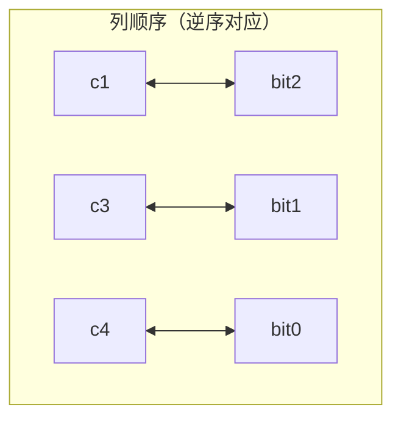
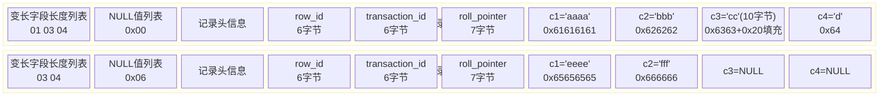

# InnoDB记录结构

## 准备工作

到目前为止，`MySQL` 对我们来说还是一个黑盒：我们只负责用客户端发送请求并等待服务器返回结果，但表中的数据到底存到哪里、以什么格式存放、`MySQL` 以什么方式访问这些数据，这些都还不清楚。

前面介绍请求处理过程时提到，`MySQL` 服务器上负责对表中数据读取和写入的部分是 `存储引擎`。服务器支持不同类型的存储引擎（如 `InnoDB`、`MyISAM`、`Memory`），不同的存储引擎为实现不同的特性而开发，真实数据在不同存储引擎中存放的格式一般也不同。甚至有的存储引擎（如 `Memory`）不用磁盘存储数据，关闭服务器后表中的数据就消失了。由于 `InnoDB` 是 `MySQL` 默认的存储引擎，也是最常用的，本文聚焦 `InnoDB` 作为存储引擎的数据存储结构。了解一个存储引擎的数据存储结构之后，其他存储引擎的原理类似。

## InnoDB页简介

`InnoDB` 是将表中的数据存储到磁盘上的存储引擎，因此即使关机重启数据仍然存在。而真正处理数据的过程发生在内存中，所以需要把磁盘中的数据加载到内存；处理写入或修改请求时，还需要把内存中的内容刷新到磁盘。读写磁盘的速度比内存读写慢几个数量级，所以当想从表中获取某些记录时，`InnoDB` 不会一条一条地把记录从磁盘读出来，而是采取这样的方式：将数据划分为若干个页，以页作为磁盘和内存之间交互的基本单位。`InnoDB` 中页的大小一般为 16 KB。即一般情况下，一次最少从磁盘读取 16KB 内容到内存，一次最少把内存中 16KB 内容刷新到磁盘。

## InnoDB行格式

平时是以记录为单位向表中插入数据的，这些记录在磁盘上的存放方式被称为 `行格式` 或 `记录格式`。`InnoDB` 存储引擎至今设计了 4 种不同的 `行格式`：`Compact`、`Redundant`、`Dynamic` 和 `Compressed`。随着时间推移可能设计出更多行格式，但原理大体相同。

### 指定行格式的语法

可以在创建或修改表的语句中指定 `行格式`：

```sql
CREATE TABLE 表名 (列的信息) ROW_FORMAT=行格式名称

ALTER TABLE 表名 ROW_FORMAT=行格式名称
```

例如在 `xiaohaizi` 数据库里创建一张演示表 `record_format_demo`，指定它的 `行格式`：

```text
mysql> USE xiaohaizi;
Database changed

mysql> CREATE TABLE record_format_demo (
    ->     c1 VARCHAR(10),
    ->     c2 VARCHAR(10) NOT NULL,
    ->     c3 CHAR(10),
    ->     c4 VARCHAR(10)
    -> ) CHARSET=ascii ROW_FORMAT=COMPACT;
Query OK, 0 rows affected (0.03 sec)
```

这张表的 `行格式` 是 `Compact`，并显式指定了字符集为 `ascii`（`ascii` 字符集只包括空格、标点符号、数字、大小写字母和不可见字符，所以汉字不能存到这张表里）。现在向表中插入两条记录：

```text
mysql> INSERT INTO record_format_demo(c1, c2, c3, c4) VALUES('aaaa', 'bbb', 'cc', 'd'), ('eeee', 'fff', NULL, NULL);
Query OK, 2 rows affected (0.02 sec)
Records: 2  Duplicates: 0  Warnings: 0
```

现在表中的记录如下：

```text
mysql> SELECT * FROM record_format_demo;
+------+-----+------+------+
| c1   | c2  | c3   | c4   |
+------+-----+------+------+
| aaaa | bbb | cc   | d    |
| eeee | fff | NULL | NULL |
+------+-----+------+------+
2 rows in set (0.00 sec)

mysql>
```

演示表内容填充完成，下面看各行格式下的存储方式。

### COMPACT行格式

一条完整的记录可以分为 `记录的额外信息` 和 `记录的真实数据` 两大部分：


下面详细看这两部分。

#### 记录的额外信息

这部分信息是服务器为了描述这条记录而额外添加的信息，分为 3 类：`变长字段长度列表`、`NULL值列表` 和 `记录头信息`。

##### 变长字段长度列表

`MySQL` 支持一些变长的数据类型，如 `VARCHAR(M)`、`VARBINARY(M)`、各种 `TEXT` 类型、各种 `BLOB` 类型。拥有这些数据类型的列可称为 `变长字段`。变长字段中存储多少字节的数据不固定，所以在存储真实数据时需要顺便把这些数据占用的字节数也存起来，因此变长字段占用的存储空间分为两部分：

1. 真正的数据内容；
2. 占用的字节数。

在 `Compact` 行格式中，把所有变长字段的真实数据占用的字节长度都存放在记录的开头部位，形成 `变长字段长度列表`，各变长字段数据占用的字节数按列的顺序**逆序**存放。这一点要特别注意——是**逆序**存放。

以 `record_format_demo` 表的第一条记录为例。由于 `c1`、`c2`、`c4` 列都是 `VARCHAR(10)` 类型（变长数据类型），这三个列的值长度都需要保存在记录开头。因为各列都使用 `ascii` 字符集，每个字符只需 1 个字节编码。看第一条记录各变长字段内容的长度：

| 列名 | 存储内容 | 内容长度（十进制） | 内容长度（十六进制） |
|:--:|:--:|:--:|:--:|
| `c1` | `'aaaa'` | `4` | `0x04` |
| `c2` | `'bbb'` | `3` | `0x03` |
| `c4` | `'d'` | `1` | `0x01` |

因为这些长度值需要按列的**逆序**存放，所以 `变长字段长度列表` 的字节串用十六进制表示就是（各字节之间实际没有空格，空格只是方便理解）：

```text
01 03 04
```

填入示意图后的效果：

```mermaid
block-beta
    columns 7
    block:len["变长字段长度列表<br/>01 03 04<br/>(c4)(c2)(c1) 逆序"]
    block:null["NULL值列表"]
    block:head["记录头信息"]
    block:c1["c1='aaaa'"]
    block:c2["c2='bbb'"]
    block:c3["c3='cc'"]
    block:c4["c4='d'"]
```

第一条记录中 `c1`、`c2`、`c4` 列的内容都较短，占用字节数较小，用 1 个字节即可表示。但如果变长列的内容占用字节数较多，可能需要 2 个字节表示。具体用 1 个还是 2 个字节表示真实数据占用的字节数，`InnoDB` 有一套规则。先声明 `W`、`M` 和 `L` 的含义：

1. 假设某个字符集中表示一个字符最多需要 `W` 个字节，即 `SHOW CHARSET` 结果中的 `Maxlen` 列。例如 `utf8` 的 `W` 是 `3`，`gbk` 的 `W` 是 `2`，`ascii` 的 `W` 是 `1`。
2. 对于变长类型 `VARCHAR(M)`，这种类型最多能存储 `M` 个字符（注意是字符不是字节），所以能表示的字符串最多占用 `M×W` 个字节。
3. 假设它实际存储的字符串占用 `L` 个字节。

确定使用 1 个字节还是 2 个字节表示真正字符串占用字节数的规则：

- 如果 `M×W <= 255`，使用 1 个字节表示真正字符串占用的字节数。

  ::: tip 说明
  也就是说 InnoDB 在读记录的变长字段长度列表时先查看表结构，如果某个变长字段允许存储的最大字节数不大于 255，就认为只需 1 个字节来表示真正字符串占用的字节数。
  :::

- 如果 `M×W > 255`，分两种情况：
  - 如果 `L <= 127`，用 1 个字节表示真正字符串占用的字节数；
  - 如果 `L > 127`，用 2 个字节表示真正字符串占用的字节数。

  ::: tip 说明
  如果某个变长字段允许存储的最大字节数大于 255，如何区分正在读的某个字节是单独的字段长度还是半个字段长度？InnoDB 使用该字节的第一个二进制位作为标志位：如果该字节第一位为 0，则该字节就是一个单独的字段长度（用 1 字节表示不大于 127 的二进制首位都为 0）；如果第一位为 1，则该字节是半个字段长度。

  对于一些占用字节数非常多的字段（如字段长度大于 16KB），如果该记录在单个页面中无法存储，InnoDB 会把一部分数据存放到溢出页（后文介绍），在变长字段长度列表处只存储留在本页面中的长度，所以用 2 个字节也可以存放下来。
  :::

总结：如果该可变字段允许存储的最大字节数（`M×W`）超过 255 字节且真实存储的字节数（`L`）超过 127 字节，则用 2 个字节，否则用 1 个字节。

另外需要注意：变长字段长度列表中只存储值为**非 NULL** 的列内容占用的长度，值为 **NULL** 的列长度不存储。所以对第二条记录来说，因为 `c4` 列值为 `NULL`，第二条记录的 `变长字段长度列表` 只需存储 `c1` 和 `c2` 列的长度。其中 `c1` 存储 `'eeee'` 占用 4 字节，`c2` 存储 `'fff'` 占用 3 字节，所以 `变长字段长度列表` 需 2 个字节。

::: tip 小贴士
并不是所有记录都有 `变长字段长度列表` 部分，如果表中所有列都不是变长的数据类型，这一部分就不需要。
:::

##### NULL值列表

表中的某些列可能存储 `NULL` 值，如果把这些 `NULL` 值都放到 `记录的真实数据` 中存储会很占地方，所以 `Compact` 行格式把这些值为 `NULL` 的列统一管理起来，存储到 `NULL值列表` 中。处理过程如下：

1. 首先统计表中允许存储 `NULL` 的列有哪些。

   主键列、被 `NOT NULL` 修饰的列都不可以存储 `NULL` 值，统计时不会把这些列算进去。例如表 `record_format_demo` 的 `c1`、`c3`、`c4` 列都允许存储 `NULL` 值，而 `c2` 被 `NOT NULL` 修饰，不允许存储 `NULL` 值。

2. 如果表中没有允许存储 **NULL** 的列，则 `NULL值列表` 也不存在。否则将每个允许存储 `NULL` 的列对应一个二进制位，二进制位按列的顺序**逆序**排列。二进制位的意义如下：
   - 值为 `1` 时，代表该列的值为 `NULL`；
   - 值为 `0` 时，代表该列的值不为 `NULL`。

   因为表 `record_format_demo` 有 3 个允许为 `NULL` 的列，所以这 3 个列与二进制位的对应关系如下（再次强调，二进制位按列的顺序**逆序**排列，第一个列 `c1` 与最后一个二进制位对应）：



3. `MySQL` 规定 `NULL值列表` 必须用整数个字节的位表示，如果使用的二进制位个数不是整数个字节，则在字节的高位补 `0`。

   表 `record_format_demo` 只有 3 个允许为 `NULL` 的列，对应 3 个二进制位，不足一个字节，所以在字节的高位补 `0`。如果一个表有 9 个允许为 `NULL` 的列，则该记录的 `NULL值列表` 需要 2 个字节。

知道了规则后，再看 `record_format_demo` 中两条记录的 `NULL值列表`。因为只有 `c1`、`c3`、`c4` 允许存储 `NULL` 值，所以所有记录的 `NULL值列表` 只需一个字节。

- 第一条记录：`c1`、`c3`、`c4` 的值都不为 `NULL`，对应的二进制位都是 `0`：

```text
位: 0 0 0   → 0x00
```

  所以第一条记录的 `NULL值列表` 十六进制表示为 `0x00`。

- 第二条记录：`c1`、`c3`、`c4` 中 `c3` 和 `c4` 的值都为 `NULL`，对应二进制位情况：

```text
c4=NULL → bit0=1
c3=NULL → bit1=1
c1≠NULL → bit2=0
组合(高位补0): 0 0 0 0 0 1 1 0 → 0x06
```

  所以第二条记录的 `NULL值列表` 十六进制表示为 `0x06`。

两条记录填充 `NULL值列表` 后的示意：


##### 记录头信息

除了 `变长字段长度列表`、`NULL值列表` 之外，还有一个用于描述记录的 `记录头信息`，它由固定的 `5` 个字节组成。`5` 个字节即 `40` 个二进制位，不同的位代表不同的意思：


这些二进制位代表的详细信息如下表：

| 名称 | 大小（bit） | 描述 |
|:--:|:--:|:--:|
| `预留位1` | `1` | 没有使用 |
| `预留位2` | `1` | 没有使用 |
| `delete_mask` | `1` | 标记该记录是否被删除 |
| `min_rec_mask` | `1` | B+ 树每层非叶子节点中的最小记录都会添加该标记 |
| `n_owned` | `4` | 表示当前记录拥有的记录数 |
| `heap_no` | `13` | 表示当前记录在记录堆的位置信息 |
| `record_type` | `3` | 表示当前记录类型，`0` 普通记录，`1` B+ 树非叶子节点记录，`2` 最小记录，`3` 最大记录 |
| `next_record` | `16` | 表示下一条记录的相对位置 |

这里列全这些位只是为保持内容完整性，现在不必记住它们的意思。由于暂时不清楚这些属性的详细用法，这里不分析各属性值怎么产生，之后遇到会详细介绍。

::: tip 小贴士
再次强调，如果看不懂记录头信息里各位代表的概念不必纠结，后面会详细介绍。
:::

#### 记录的真实数据

对于 `record_format_demo` 表来说，`记录的真实数据` 除了 `c1`、`c2`、`c3`、`c4` 这几个自定义列的数据外，`MySQL` 会为每条记录默认添加一些列（也称 `隐藏列`），具体如下：

| 列名 | 是否必须 | 占用空间 | 描述 |
|:--:|:--:|:--:|:--:|
| `row_id` | 否 | `6` 字节 | 行 ID，唯一标识一条记录 |
| `transaction_id` | 是 | `6` 字节 | 事务 ID |
| `roll_pointer` | 是 | `7` 字节 | 回滚指针 |

::: tip 小贴士
这几个列的真正名称是 DB_ROW_ID、DB_TRX_ID、DB_ROLL_PTR，这里为美观写成了 row_id、transaction_id 和 roll_pointer。
:::

需要提一下 `InnoDB` 表对主键的生成策略：优先使用用户自定义主键作为主键；如果用户没有定义主键，则选取一个 `Unique` 键作为主键；如果连 `Unique` 键都没有定义，则 `InnoDB` 会为表默认添加一个名为 `row_id` 的隐藏列作为主键。所以从上表可以看出：`InnoDB` 存储引擎会为每条记录都添加 `transaction_id` 和 `roll_pointer` 两个列，但 `row_id` 是可选的（只有没有自定义主键和 Unique 键时才添加该列）。这些隐藏列的值不用操心，`InnoDB` 存储引擎会自动生成。

因为表 `record_format_demo` 没有定义主键，所以服务器会为每条记录增加上述 3 个列。加上 `记录的真实数据` 后两条记录示意如下：



看这个图时需要注意几点：

1. 表 `record_format_demo` 使用 `ascii` 字符集，所以 `0x61616161` 表示字符串 `'aaaa'`，`0x626262` 表示 `'bbb'`，以此类推。
2. 注意第一条记录中 `c3` 列的值，它是 `CHAR(10)` 类型，实际存储的字符串是 `'cc'`，`ascii` 中的字节表示是 `0x6363`。虽然表示这个字符串只占 2 个字节，但整个 `c3` 列仍占 10 个字节空间，除真实数据以外的 8 个字节都用**空格字符**填充，空格字符在 `ascii` 字符集的表示是 `0x20`。
3. 注意第二条记录中 `c3` 和 `c4` 列的值都为 `NULL`，它们被存储在 `NULL值列表` 处，记录的真实数据处不再冗余存储，从而节省存储空间。

#### CHAR(M)列的存储格式

`record_format_demo` 表的 `c1`、`c2`、`c4` 列类型是 `VARCHAR(10)`，`c3` 列类型是 `CHAR(10)`。在 `Compact` 行格式下，只会把变长类型列的长度**逆序**存到 `变长字段长度列表` 中。但这是因为 `record_format_demo` 表采用 `ascii` 字符集——一个定长字符集（表示一个字符固定用一个字节）。如果采用变长字符集（表示一个字符所需字节数不确定，如 `gbk` 表示一个字符要 1~2 字节、`utf8` 要 1~3 字节），`c3` 列的长度也会被存储到 `变长字段长度列表` 中。例如修改 `record_format_demo` 表字符集：

```text
mysql> ALTER TABLE record_format_demo MODIFY COLUMN c3 CHAR(10) CHARACTER SET utf8;
Query OK, 2 rows affected (0.02 sec)
Records: 2  Duplicates: 0  Warnings: 0
```

修改该列字符集后记录的 `变长字段长度列表` 也发生了变化：`c3` 是 `CHAR(10)`，用 `utf8` 编码最多 30 字节，会作为一个变长字段，其长度也会进入长度列表。

这就意味着：对于 **CHAR(M)** 类型的列，当列采用定长字符集时，该列占用的字节数不会被加到变长字段长度列表；而当采用变长字符集时，该列占用的字节数也会被加到变长字段长度列表。

另外还需要注意：变长字符集的 `CHAR(M)` 类型列要求至少占用 `M` 个字节，而 `VARCHAR(M)` 没有这个要求。例如使用 `utf8` 字符集的 `CHAR(10)` 列，存储的数据字节长度范围是 10~30 字节。即使向该列存储一个空字符串也占用 `10` 个字节，这是为了防止将来更新该列值的字节长度大于原有值的字节长度而小于 10 个字节时，可以在该记录处直接更新，而不必在存储空间中重新分配一个新的记录空间，导致原有记录空间变成碎片。

### Redundant行格式

知道了 `Compact` 行格式后，其他行格式原理类似。`Redundant` 行格式是 `MySQL 5.0` 之前用的一种行格式，已经很老了，但出于知识完整性仍作介绍。

`Redundant` 行格式的全貌：


把 `record_format_demo` 表行格式修改为 `Redundant`：

```text
mysql> ALTER TABLE record_format_demo ROW_FORMAT=Redundant;
Query OK, 0 rows affected (0.05 sec)
Records: 0  Duplicates: 0  Warnings: 0
```

为便于理解并节省篇幅，直接给出 `record_format_demo` 在 `Redundant` 行格式下两条记录的真实存储数据，之后着重分析两种行格式的不同（下例假设已把上节修改过字符集的 `c3` 列改回 `ascii`，以便观察 `Redundant` 行格式本身的存储方式）。

从各方面看 `Redundant` 行格式的不同之处：

- 字段长度偏移列表

  注意 `Compact` 行格式开头是 `变长字段长度列表`，而 `Redundant` 行格式开头是 `字段长度偏移列表`。与 `变长字段长度列表` 有两处不同：

  - 少了**变长**两个字，意味着 `Redundant` 行格式会把该条记录中**所有列**（包括 `隐藏列`）的长度信息都按**逆序**存储到 `字段长度偏移列表`；
  - 多了**偏移**两个字，意味着计算列值长度的方式不像 `Compact` 行格式那么直观，它用两个相邻数值的**差值**计算各列值长度。

  例如第一条记录的 `字段长度偏移列表` 是：

```text
25 24 1A 17 13 0C 06
```

  因为它是逆序排放的，按列的顺序排列就是：

```text
06 0C 13 17 1A 24 25
```

  按两个相邻数值的**差值**计算各列值长度：

```text
第一列(row_id)的长度就是 0x06 个字节，即 6 个字节。
第二列(transaction_id)的长度就是 (0x0C - 0x06) 个字节，即 6 个字节。
第三列(roll_pointer)的长度就是 (0x13 - 0x0C) 个字节，即 7 个字节。
第四列(c1)的长度就是 (0x17 - 0x13) 个字节，即 4 个字节。
第五列(c2)的长度就是 (0x1A - 0x17) 个字节，即 3 个字节。
第六列(c3)的长度就是 (0x24 - 0x1A) 个字节，即 10 个字节。
第七列(c4)的长度就是 (0x25 - 0x24) 个字节，即 1 个字节。
```

- 记录头信息

  `Redundant` 行格式的记录头信息占用 `6` 字节、`48` 个二进制位，这些位代表的意思如下：

| 名称 | 大小（bit） | 描述 |
|:--:|:--:|:--:|
| `预留位1` | `1` | 没有使用 |
| `预留位2` | `1` | 没有使用 |
| `delete_mask` | `1` | 标记该记录是否被删除 |
| `min_rec_mask` | `1` | B+ 树每层非叶子节点中的最小记录都会添加该标记 |
| `n_owned` | `4` | 表示当前记录拥有的记录数 |
| `heap_no` | `13` | 表示当前记录在页面堆的位置信息 |
| `n_field` | `10` | 表示记录中列的数量 |
| `1byte_offs_flag` | `1` | 标记字段长度偏移列表中的偏移量是使用 1 字节还是 2 字节表示 |
| `next_record` | `16` | 表示下一条记录的相对位置 |

  第一条记录的头信息是：

```text
00 00 10 0F 00 BC
```

  根据这六个字节可以计算出各个属性的值：

```text
预留位1: 0x00
预留位2: 0x00
delete_mask: 0x00
min_rec_mask: 0x00
n_owned: 0x00
heap_no: 0x02
n_field: 0x07
1byte_offs_flag: 0x01
next_record: 0xBC
```

  与 `Compact` 行格式的记录头信息对比，有两处不同：
  - `Redundant` 行格式多了 `n_field` 和 `1byte_offs_flag` 这两个属性；
  - `Redundant` 行格式没有 `record_type` 这个属性。

- `Redundant` 行格式中 `NULL` 值的处理

  因为 `Redundant` 行格式没有 `NULL值列表`，需要别的方式存储字段的 `NULL` 值，具体策略如下：

  - 如果存储 `NULL` 值的字段是变长数据类型，则在字段长度偏移列表中记录即可，不占用记录的真实数据部分。

    例如 `record_format_demo` 表的 `c4` 列是 `VARCHAR(10)` 类型，第二条记录的 `c4` 列存储的是 `NULL` 值。第二条记录的 `字段长度偏移列表` 如下：

```text
A4 A4 1A 17 13 0C 06
```

    按列的顺序排放就是：

```text
06 0C 13 17 1A A4 A4
```

    可以看到第二条记录 `c4` 列的偏移长度和 `c3` 列相同都是 `A4`，意味着 `c4` 列的长度为 0，即存储的是 `NULL` 值。

  - 如果存储 `NULL` 值的字段是 `CHAR(M)` 数据类型，则将占用记录的真实数据部分，并把该字段对应的数据用 `0x00` 字节填充。

    第二条记录的 `c3` 列值为 `NULL`，`c3` 列类型是 `CHAR(10)`，占用记录真实数据部分 10 字节，所以在 `Redundant` 行格式中用 `0x00000000000000000000` 表示 `NULL` 值。

除了以上几点，`Redundant` 行格式和 `Compact` 行格式大致相同。

#### CHAR(M)列的存储格式

`Compact` 行格式在 `CHAR(M)` 类型列中存储数据时按变长字符集和定长字符集区分处理。而 `Redundant` 行格式十分干脆：不管该列使用什么字符集，只要是 `CHAR(M)` 类型，占用的真实数据空间就是该字符集表示一个字符最多需要的字节数与 `M` 的乘积。例如使用 `utf8` 字符集的 `CHAR(10)` 类型列占用的真实数据空间始终为 `30` 字节，使用 `gbk` 字符集的 `CHAR(10)` 类型列占用的真实数据空间始终为 `20` 字节。由此可见，使用 `Redundant` 行格式的 `CHAR(M)` 类型列不会产生碎片。

### 行溢出数据

#### VARCHAR(M)最多能存储的数据

`VARCHAR(M)` 类型的列最多可以占用 `65535` 个字节。其中 `M` 代表该类型最多存储的字符数量。如果使用 `ascii` 字符集，一个字符代表一个字节，看看 `VARCHAR(65535)` 是否可用：

```text
mysql> CREATE TABLE varchar_size_demo(
    ->     c VARCHAR(65535)
    -> ) CHARSET=ascii ROW_FORMAT=Compact;
ERROR 1118 (42000): Row size too large. The maximum row size for the used table type, not counting BLOBs, is 65535. This includes storage overhead, check the manual. You have to change some columns to TEXT or BLOBs
mysql>
```

从报错信息可以看出，`MySQL` 对一条记录占用的最大存储空间有限制：除了 `BLOB` 或 `TEXT` 类型列之外，其他所有列（不包括隐藏列和记录头信息）占用的字节长度加起来不能超过 `65535` 个字节。所以服务器建议把存储类型改为 `TEXT` 或 `BLOB`。这个 `65535` 个字节除了列本身的数据外，还包括一些其他数据（`storage overhead`）。为了存储一个 `VARCHAR(M)` 类型列，其实需要占用 3 部分存储空间：

- 真实数据；
- 真实数据占用字节的长度；
- `NULL` 值标识（如果该列有 `NOT NULL` 属性则可以没有这部分存储空间）。

如果该 `VARCHAR` 类型列没有 `NOT NULL` 属性，最多只能存储 `65532` 个字节的数据，因为真实数据的长度可能占用 2 字节，`NULL` 值标识需要占用 1 字节：

```text
mysql> CREATE TABLE varchar_size_demo(
    ->      c VARCHAR(65532)
    -> ) CHARSET=ascii ROW_FORMAT=Compact;
Query OK, 0 rows affected (0.02 sec)
```

如果 `VARCHAR` 类型列有 `NOT NULL` 属性，最多只能存储 `65533` 个字节的数据，因为真实数据的长度可能占用 2 字节、不需要 `NULL` 值标识：

```text
mysql> DROP TABLE varchar_size_demo;
Query OK, 0 rows affected (0.01 sec)

mysql> CREATE TABLE varchar_size_demo(
    ->      c VARCHAR(65533) NOT NULL
    -> ) CHARSET=ascii ROW_FORMAT=Compact;
Query OK, 0 rows affected (0.02 sec)
```

如果 `VARCHAR(M)` 类型列使用的不是 `ascii` 字符集，会怎么样？来看一下：

```text
mysql> DROP TABLE varchar_size_demo;
Query OK, 0 rows affected (0.00 sec)

mysql> CREATE TABLE varchar_size_demo(
    ->       c VARCHAR(65532)
    -> ) CHARSET=gbk ROW_FORMAT=Compact;
ERROR 1074 (42000): Column length too big for column 'c' (max = 32767); use BLOB or TEXT instead

mysql> CREATE TABLE varchar_size_demo(
    ->       c VARCHAR(65532)
    -> ) CHARSET=utf8 ROW_FORMAT=Compact;
ERROR 1074 (42000): Column length too big for column 'c' (max = 21845); use BLOB or TEXT instead
```

从执行结果可以看出，如果 `VARCHAR(M)` 类型列使用的不是 `ascii` 字符集，`M` 的最大取值取决于该字符集表示一个字符最多需要的字节数。在列值允许为 `NULL` 的情况下：`gbk` 字符集表示一个字符最多需要 2 个字节，则 `M` 最大取值为 `32766`（即 `65532/2`），最多能存储 `32766` 个字符；`utf8` 字符集表示一个字符最多需要 3 个字节，则 `M` 最大取值为 `21844`（即 `65532/3`），最多能存储 `21844` 个字符。

::: tip 小贴士
上面所说的"gbk 字符集下 M 最大取值 32766、utf8 字符集下 M 最大取值 21844"都是在列值允许为 NULL 且表中只有一个字段的前提下。一定要记住：一行中所有列（不包括隐藏列和记录头信息）占用的字节长度加起来不能超过 65535 个字节。
:::

#### 记录中的数据太多产生的溢出

以 `ascii` 字符集下的 `varchar_size_demo` 表为例，插入一条记录：

```text
mysql> CREATE TABLE varchar_size_demo(
    ->       c VARCHAR(65532)
    -> ) CHARSET=ascii ROW_FORMAT=Compact;
Query OK, 0 rows affected (0.01 sec)

mysql> INSERT INTO varchar_size_demo(c) VALUES(REPEAT('a', 65532));
Query OK, 1 row affected (0.00 sec)
```

其中 `REPEAT('a', 65532)` 是一个函数调用，生成把字符 `'a'` 重复 `65532` 次的字符串。前面说过，`MySQL` 以 `页` 为基本单位管理存储空间，记录都会被分配到某个 `页` 中存储。而一个页的大小一般是 `16KB`（`16384` 字节），一个 `VARCHAR(M)` 类型列最多可以存储 `65532` 个字节，这样就可能造成一个页存放不了一条记录的情况。

在 `Compact` 和 `Redundant` 行格式中，对于占用存储空间非常大的列，`记录的真实数据` 处只存储该列的一部分数据，把剩余数据分散存储在几个其他页中，然后在 `记录的真实数据` 处用 20 个字节存储指向这些页的地址（这 20 个字节还包括这些分散在其他页中数据的占用的字节数），从而可以找到剩余数据所在的页。


从图中可以看出，对 `Compact` 和 `Redundant` 行格式来说，如果某一列中的数据非常多，在记录的真实数据处只会存储该列前 `768` 个字节的数据和一个指向其他页的地址，然后把剩下的数据存放到其他页中。这个过程也叫 `行溢出`，存储超出 `768` 字节数据的那些页面也称为 `溢出页`。

最后需要注意：不只是 **VARCHAR(M)** 类型的列，其他的 **TEXT**、**BLOB** 类型列在存储数据非常多时也会发生 `行溢出`。

#### 行溢出的临界点

发生 `行溢出` 的临界点是什么？也就是说列存储多少字节的数据时会发生 `行溢出`？

`MySQL` 规定一个页中至少存放两行记录（原因后文介绍）。以上面的 `varchar_size_demo` 表为例，它只有一个列 `c`，往表中插入两条记录，每条记录最少插入多少字节的数据才会出现 `行溢出`？需要分析页中的空间如何利用：

- 每个页除了存放记录外，也需要存储一些额外信息，林林总总的额外信息加起来需要 `136` 个字节的空间（现在只要知道这个数字即可），其他空间都可以用来存储记录。
- 每条记录需要的额外信息是 `27` 字节。这 27 个字节包括：
  - 2 个字节用于存储真实数据的长度；
  - 1 个字节用于存储列是否是 NULL 值；
  - 5 个字节的头信息；
  - 6 个字节的 `row_id` 列；
  - 6 个字节的 `transaction_id` 列；
  - 7 个字节的 `roll_pointer` 列。

假设一个列中存储的数据字节数为 `n`，那么发生 `行溢出` 时需要满足：

```text
136 + 2×(27 + n) > 16384
```

求解得出：`n > 8097`。也就是说如果一个列中存储的数据不大于 `8097` 字节就不会发生 `行溢出`，否则就会发生 `行溢出`。不过这个 `8097` 字节的结论只针对只有一个列的 `varchar_size_demo` 表；如果表中有多个列，上面的式子和结论都要修改。所以重点是：不用关注这个临界点的具体值，只要知道如果一行中存储很大的数据，可能发生 `行溢出`。

### Dynamic和Compressed行格式

下面介绍另外两个行格式 `Dynamic` 和 `Compressed`。从 MySQL 5.7 起，默认行格式就是 `Dynamic`（MySQL 8.0 亦然）。这两个行格式和 `Compact` 行格式很像，只是在处理 `行溢出` 数据时有分歧：它们不会在记录的真实数据处存储字段真实数据的前 `768` 个字节，而是把所有字节都存储到其他页面中，只在记录的真实数据处存储其他页面的地址。

`Compressed` 行格式和 `Dynamic` 不同的一点是，`Compressed` 行格式会采用压缩算法对页面进行压缩，以节省空间。

### CHAR(M)中的M值过大的情况

`CHAR(M)` 类型列可以存储的最大字节长度等于该列使用的字符集表示一个字符所需的最大字节数与 `M` 的乘积。如果某个列使用 `CHAR(M)` 类型，且它可以存储的最大字节长度超过 `768` 字节，那么不论使用上述 4 种行格式中的哪种，`InnoDB` 都会把该列当成变长字段看待。例如采用 `utf8mb4` 的 `CHAR(255)` 类型列会被当作变长字段看待，因为 `4×255 > 768`。

## 总结

1. 页是 `MySQL` 中磁盘和内存交互的基本单位，也是 `MySQL` 管理存储空间的基本单位。
2. 指定和修改行格式的语法如下：

```sql
CREATE TABLE 表名 (列的信息) ROW_FORMAT=行格式名称

ALTER TABLE 表名 ROW_FORMAT=行格式名称
```

3. `InnoDB` 目前定义了 4 种行格式：

   - COMPACT 行格式：记录分为 `记录的额外信息`（变长字段长度列表、NULL 值列表、记录头信息）和 `记录的真实数据`（隐藏列 + 各列数据）两部分；
   - Redundant 行格式：记录开头是 `字段长度偏移列表`（用相邻偏移差值计算各列长度），记录头信息 6 字节，无 NULL 值列表（变长 NULL 列长度记 0，CHAR(M) NULL 列用 0x00 填充）；
   - Dynamic 和 Compressed 行格式：类似 COMPACT，只是处理行溢出时不在记录真实数据处存储前 768 字节，而是把全部字节存到其他页面，记录真实数据处只存页面地址；Compressed 还会对页面压缩。

4. 一个页一般是 `16KB`，当记录中的数据太多、当前页放不下时，会把多余的数据存储到其他页中，这种现象称为 `行溢出`。
