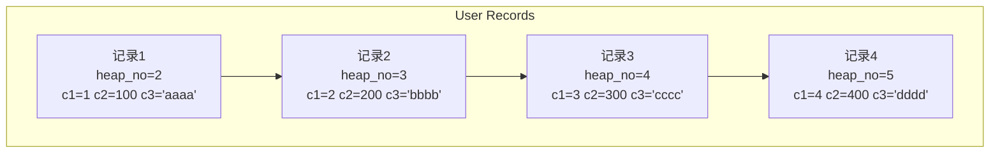
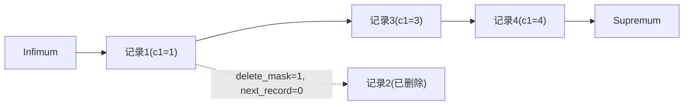
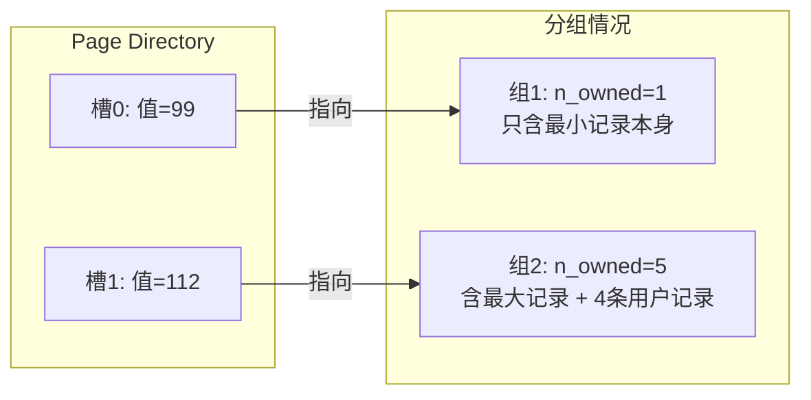
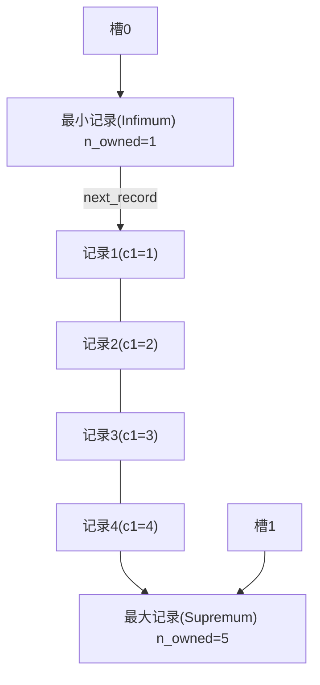

# InnoDB数据页结构

## 不同类型的页简介

前面简单提过 `页` 的概念：它是 `InnoDB` 管理存储空间的基本单位，一个页的大小一般是 `16KB`。`InnoDB` 为不同目的设计了多种不同类型的 `页`，如存放表空间头部信息的页、存放 `Insert Buffer` 信息的页、存放 `INODE` 信息的页、存放 `undo` 日志信息的页等。本文不讨论这些类型，聚焦存放表中记录的那类页，官方称其为索引（`INDEX`）页。由于还没介绍索引，而这些记录就是我们日常所说的 `数据`，所以暂时称这种存放记录的页为 `数据页`。

## 数据页结构的快速浏览

数据页代表的这块 `16KB` 存储空间可以划分为多个部分，不同部分有不同的功能。一个 `InnoDB` 数据页的存储空间大致被划分为 `7` 个部分：


有的部分占用字节数确定，有的部分占用字节数不确定。下面用表格大致描述这 7 个部分：

| 名称 | 中文名 | 占用空间大小 | 简单描述 |
|:--:|:--:|:--:|:--:|
| `File Header` | 文件头部 | `38` 字节 | 页的一些通用信息 |
| `Page Header` | 页面头部 | `56` 字节 | 数据页专有的一些信息 |
| `Infimum + Supremum` | 最小记录和最大记录 | `26` 字节 | 两个虚拟的行记录 |
| `User Records` | 用户记录 | 不确定 | 实际存储的行记录内容 |
| `Free Space` | 空闲空间 | 不确定 | 页中尚未使用的空间 |
| `Page Directory` | 页面目录 | 不确定 | 页中的某些记录的相对位置 |
| `File Trailer` | 文件尾部 | `8` 字节 | 校验页是否完整 |

::: tip 说明
本文不按页中各个部分的出现顺序依次介绍，因为各部分会出现许多当前还不理解的概念。先建立整体认知，后文会详细介绍。
:::

## 记录在页中的存储

在页的 7 个组成部分中，我们存储的记录会按指定的 `行格式` 存储到 `User Records` 部分。但一开始生成页时并没有 `User Records` 部分。每插入一条记录，都会从 `Free Space` 部分（尚未使用的存储空间）申请一个记录大小的空间，划分到 `User Records` 部分。当 `Free Space` 部分的空间全部被 `User Records` 替代后，这个页就使用完了；还有新记录插入的话，需要申请新的页。


为了管理 `User Records` 中的记录，`InnoDB` 花了不少功夫，这与记录行格式的 `记录头信息` 密切相关。

### 记录头信息的秘密

先创建一张表：

```text
mysql> CREATE TABLE page_demo(
    ->     c1 INT,
    ->     c2 INT,
    ->     c3 VARCHAR(10000),
    ->     PRIMARY KEY (c1)
    -> ) CHARSET=ascii ROW_FORMAT=Compact;
Query OK, 0 rows affected (0.03 sec)
```

`page_demo` 表有 3 个列，`c1` 和 `c2` 存储整数，`c3` 存储字符串。注意，我们把 `c1` 列指定为主键，所以在具体的行格式中 `InnoDB` 没必要再创建 `row_id` 隐藏列。同时指定了 `ascii` 字符集和 `Compact` 行格式，所以记录的行格式示意如下：


我们特意标出 `记录头信息` 的 5 个字节，说明它很重要。先把 `记录头信息` 各属性的大体意思浏览一下（用 `Compact` 行格式演示）：

| 名称 | 大小（bit） | 描述 |
|:--:|:--:|:--:|
| `预留位1` | `1` | 没有使用 |
| `预留位2` | `1` | 没有使用 |
| `delete_mask` | `1` | 标记该记录是否被删除 |
| `min_rec_mask` | `1` | B+ 树每层非叶子节点中的最小记录都会添加该标记 |
| `n_owned` | `4` | 表示当前记录拥有的记录数 |
| `heap_no` | `13` | 表示当前记录在记录堆的位置信息 |
| `record_type` | `3` | `0` 普通记录，`1` B+ 树非叶节点记录，`2` 最小记录，`3` 最大记录 |
| `next_record` | `16` | 表示下一条记录的相对位置 |

由于这里主要关注 `记录头信息` 的作用，为了理解方便，只画出相关的头信息属性以及 `c1`、`c2`、`c3` 列的信息（其他信息不是不存在，只是为理解方便省略了）。

向 `page_demo` 表中插入几条记录：

```text
mysql> INSERT INTO page_demo VALUES(1, 100, 'aaaa'), (2, 200, 'bbbb'), (3, 300, 'cccc'), (4, 400, 'dddd');
Query OK, 4 rows affected (0.00 sec)
Records: 4  Duplicates: 0  Warnings: 0
```

为方便分析这些记录在 `User Records` 部分中的表示，把记录中头信息和实际列数据都用十进制表示：



注意，各条记录在 `User Records` 中存储时并没有空隙，这里为观看方便才把每条记录单独画在一行。对照这个图看记录头信息各属性的含义：

- `delete_mask`

  该属性标记当前记录是否被删除，占用 1 个二进制位，值为 `0` 代表记录未被删除，为 `1` 代表记录被删除。

  被删除的记录还在 `页` 中吗？是的，它还在真实的磁盘上。这些被删除的记录之所以不立即从磁盘移除，是因为移除后要把其他记录在磁盘上重新排列，需要性能消耗，所以只是打一个删除标记。所有被删除的记录会组成一个 `垃圾链表`，在这个链表中的记录占用的空间称为 `可重用空间`，之后如果有新记录插入，可能把这些被删除记录占用的存储空间覆盖掉。

  ::: tip 小贴士
  将 delete_mask 位设置为 1 和将被删除的记录加入垃圾链表其实是两个阶段，在介绍事务时会详细介绍删除操作的详细过程。
  :::

- `min_rec_mask`

  B+ 树的每层非叶子节点中的最小记录都会添加该标记。我们插入的四条记录的 `min_rec_mask` 值都是 `0`，说明它们都不是 B+ 树非叶子节点中的最小记录。

- `n_owned`

  这个属性暂时保密，稍后它是主角。

- `heap_no`

  该属性表示当前记录在本 `页` 中的位置。从图中可以看出，插入的 4 条记录在本 `页` 中的位置分别是 `2`、`3`、`4`、`5`。怎么不见 `heap_no` 值为 `0` 和 `1` 的记录呢？

  这是 `InnoDB` 设计者的巧妙安排：他们自动给每个页加了两条记录，由于这两条记录不是我们自己插入的，所以有时也称为 `伪记录` 或 `虚拟记录`。这两个伪记录一个代表 `最小记录`，一个代表 `最大记录`。记录可以比大小吗？

  是的，记录也可以比大小。对于一条完整的记录来说，比较记录的大小就是比较 `主键` 的大小。例如插入的 4 行记录主键值分别是 `1`、`2`、`3`、`4`，即这 4 条记录的大小从小到大依次递增。

  ::: tip 小贴士
  注意"一条完整的记录"这个限定：对完整的记录来说，比较记录大小相当于比主键大小。后文还会介绍只存储一条记录部分列的情况。
  :::

  不管向 `页` 中插入多少记录，设计者都规定两条伪记录分别为最小记录与最大记录。这两条记录的构造很简单，都是由 5 字节的 `记录头信息` 和 8 字节的一个固定部分组成。由于这两条记录不是我们自己定义的，所以它们不存放在 `页` 的 `User Records` 部分，而是单独放在一个称为 `Infimum + Supremum` 的部分。最小记录和最大记录的 `heap_no` 值分别是 `0` 和 `1`，即它们的位置最靠前。

- `record_type`

  该属性表示当前记录的类型，共有 4 种：`0` 普通记录，`1` B+ 树非叶节点记录，`2` 最小记录，`3` 最大记录。我们自己插入的记录是普通记录，`record_type` 值都是 `0`，而最小记录和最大记录的 `record_type` 值分别为 `2` 和 `3`。至于 `record_type` 为 `1` 的情况，介绍索引时会重点强调。

- `next_record`

  这个属性非常重要，它表示从当前记录的真实数据到下一条记录的真实数据的**地址偏移量**。例如第一条记录的 `next_record` 值为 `32`，意味着从第一条记录真实数据的地址向后找 `32` 个字节便是下一条记录的真实数据。从数据结构角度看，这其实是一个 `链表`，可以通过一条记录找到它的下一条记录。但需要注意：`下一条记录` 并不是按插入顺序的下一条，而是按**主键值由小到大的顺序**的下一条记录。而且规定 `Infimum` 记录（最小记录）的下一条记录是本页中主键值最小的用户记录，本页中主键值最大的用户记录的下一条记录就是 `Supremum` 记录（最大记录）。用箭头替代 `next_record` 中的地址偏移量：


  从图中可以看出，记录按主键从小到大的顺序形成一个单链表。`最大记录` 的 `next_record` 值为 `0`，说明最大记录没有下一条记录，它是这个单链表中的最后一个节点。如果从中删除一条记录，链表也会跟着变化。例如删除第 2 条记录：

```text
mysql> DELETE FROM page_demo WHERE c1 = 2;
Query OK, 1 row affected (0.02 sec)
```

  删除第 2 条记录后：



  删除第 2 条记录前后主要发生了这些变化：

  - 第 2 条记录并没有从存储空间中移除，而是把该条记录的 `delete_mask` 值设置为 `1`；
  - 第 2 条记录的 `next_record` 值变为了 `0`，意味着该记录没有下一条记录；
  - 第 1 条记录的 `next_record` 指向了第 3 条记录；
  - 还有一点可能被忽略：`最大记录` 的 `n_owned` 值从 `5` 变成了 `4`，这一点稍后会详细说明。

  所以，不论怎么对页中的记录做增删改操作，`InnoDB` 始终维护一条记录的单链表，链表中的各个节点按主键值由小到大的顺序连接。

  ::: tip 小贴士
  为什么 next_record 指针要指向记录头信息和真实数据之间的位置，而不是整条记录的开头位置？

  因为这个位置刚刚好：向左读取是记录头信息，向右读取是真实数据。而且 next_record 指针始终从该位置向左读取第一个属性，这样可以非常有效地读取页面中的所有记录，而无需解析变长字段长度列表、NULL 值列表之类的可变长度部分。另外，由于从 next_record 指针处向左读是记录的额外信息部分，之前说变长字段长度列表、NULL 值列表中的信息是逆序存放，就更容易理解了。
  :::

再来看一个有意思的现象：因为主键值为 `2` 的记录被删掉了，但存储空间没有回收。如果再次把这条记录插入表中，会发生什么？

```text
mysql> INSERT INTO page_demo VALUES(2, 200, 'bbbb');
Query OK, 1 row affected (0.00 sec)
```

可以看到，`InnoDB` 并没有因为新记录的插入而申请新的存储空间，而是直接复用了原来被删除记录的存储空间。

::: tip 小贴士
当数据页中存在多条被删除的记录时，这些记录的 next_record 属性会把它们组成一个垃圾链表，以备之后重用这部分存储空间。
:::

## Page Directory（页目录）

记录在页中按主键值由小到大顺序串联成单链表，那如何根据主键值查找页中的某条记录？例如：

```sql
SELECT * FROM page_demo WHERE c1 = 3;
```

最笨的办法：从 `Infimum` 记录开始，沿链表一直往后找。查找时还能取巧：因为链表中各记录的值按从小到大排列，所以当链表的某个节点代表的主键值大于要查找的主键值时就可以停止查找，因为该节点后边的记录主键值依次递增。

这个方法在页中记录数量少时没太大问题。但如果一个页中存储了非常多的记录，这种遍历查找对性能仍有损耗，所以这是 `笨` 办法。设计者从书的目录中找到灵感：我们想从一本书中查找某个内容时，一般先看目录，找到页码，再翻到对应页码。设计者为记录制作了类似的目录，制作过程如下：

1. 将所有正常记录（包括最大和最小记录，不包括标记为已删除的记录）划分为几个组；
2. 每个组的最后一条记录（组内最大那条）的头信息中的 `n_owned` 属性表示该组共有几条记录；
3. 将每个组的最后一条记录的地址偏移量单独提取出来，按顺序存储到靠近 `页` 尾部的地方，这个地方就是 `Page Directory`（`页目录`）。页面目录中的这些地址偏移量被称为 `槽`（`Slot`），所以页面目录由 `槽` 组成。

现在 `page_demo` 表中正常的记录共有 6 条，`InnoDB` 会把它们分成两组：第一组只有最小记录，第二组是剩余的 5 条记录。



从这个图中需要注意几点：

- 现在 `页目录` 部分中有两个槽，意味着记录被分成两组。`槽0` 中的值是 `99`，代表最小记录的地址偏移量（从页的 0 字节开始数 99 个字节）；`槽1` 中的值是 `112`，代表最大记录的地址偏移量。注意：槽在 `Page Directory` 中的**物理存储是逆序的**——主键值越大的记录，其槽所在的存储地址越小（8.0.46 实测：单行记录表的页目录两个槽，低地址处存放 `112`（最大记录），高地址处存放 `99`（最小记录））。
- 注意最小和最大记录头信息中的 `n_owned` 属性：
  - 最小记录的 `n_owned` 值为 `1`，代表以最小记录结尾的分组中只有 `1` 条记录，即最小记录本身；
  - 最大记录的 `n_owned` 值为 `5`，代表以最大记录结尾的分组中有 `5` 条记录，包括最大记录本身和 4 条用户记录。

`99` 和 `112` 这样的地址偏移量不直观，用箭头指向替代数字更易理解。从逻辑上看记录和页目录的关系：



为什么最小记录的 `n_owned` 值为 1，最大记录为 `5`？设计者对每个分组中的记录条数有规定：最小记录所在的分组只能有 **1** 条记录；最大记录所在的分组记录条数在 **1~8** 之间；剩下的分组记录条数在 **4~8** 之间。所以分组按下述步骤进行：

- 初始情况下一个数据页里只有最小记录和最大记录两条记录，分属两个分组；
- 之后每插入一条记录，都从 `页目录` 中找到主键值比本记录主键值大且差值最小的槽，把该槽对应记录的 `n_owned` 值加 1，表示本组内又添加一条记录，直到该组记录数等于 8；
- 一个组记录数等于 8 后再插入一条记录时，把组中的记录拆分成两个组（一个 4 条、一个 5 条）。这个过程会在 `页目录` 中新增一个 `槽`，记录新增分组中最大那条记录的偏移量。

由于现在 `page_demo` 表记录太少，无法演示加了 `页目录` 后加快查找的过程，再添加一些记录：

```text
mysql> INSERT INTO page_demo VALUES(5, 500, 'eeee'), (6, 600, 'ffff'), (7, 700, 'gggg'), (8, 800, 'hhhh'), (9, 900, 'iiii'), (10, 1000, 'jjjj'), (11, 1100, 'kkkk'), (12, 1200, 'llll'), (13, 1300, 'mmmm'), (14, 1400, 'nnnn'), (15, 1500, 'oooo'), (16, 1600, 'pppp');
Query OK, 12 rows affected (0.00 sec)
Records: 12  Duplicates: 0  Warnings: 0
```

一口气又添加了 12 条记录，现在共有 16 条用户记录，加上最小和最大记录共 18 条正常记录，被分成 5 个组。因为把 16 条记录的全部信息画在一张图里太占地方，只保留用户记录头信息中的 `n_owned` 和 `next_record` 属性，也省略各记录之间的箭头。现在看怎么从 `页目录` 中查找记录。因为各槽代表的记录主键值从小到大排序，可以用 `二分法` 快速查找。5 个槽编号分别是 `0`、`1`、`2`、`3`、`4`，初始最低的槽 `low=0`，最高槽 `high=4`。例如找主键值为 `5` 的记录：

1. 计算中间槽位置：`(0+4)/2=2`，查看 `槽2` 对应记录的主键值为 `8`。因为 `8 > 5`，设置 `high=2`，`low` 不变；
2. 重新计算中间槽位置：`(0+2)/2=1`，查看 `槽1` 对应的主键值为 `4`，设置 `low=1`，`high` 不变；
3. 因为 `high - low` 的值为 1，确定主键值为 `5` 的记录在 `槽2` 对应的组中。接下来遍历 `槽2` 对应组的链表查找。由于一个组包含的记录条数只能是 1~8 条，遍历一个组的代价很小。

所以在一个数据页中查找指定主键值的记录分两步：

1. 通过二分法确定该记录所在的槽；
2. 通过记录的 `next_record` 属性遍历该槽所在组中的各个记录。

::: tip 小贴士
如果还不清楚二分法是什么，找本基础算法书看看。
:::

## Page Header（页面头部）

为了得到数据页中存储记录的状态信息（如本页已存储多少条记录、第一条记录地址、页目录中存储多少槽等），设计者在页中定义了一个叫 `Page Header` 的部分。它是 `页` 结构的第二部分，占用固定的 `56` 个字节，专门存储各种状态信息：

| 名称 | 占用空间大小 | 描述 |
|:--:|:--:|:--:|
| `PAGE_N_DIR_SLOTS` | `2` 字节 | 页目录中的槽数量 |
| `PAGE_HEAP_TOP` | `2` 字节 | 还未使用的空间最小地址，该地址之后就是 `Free Space` |
| `PAGE_N_HEAP` | `2` 字节 | 本页中的记录数量（包括最小和最大记录以及标记为删除的记录） |
| `PAGE_FREE` | `2` 字节 | 第一个已标记为删除的记录地址（各已删除记录通过 `next_record` 组成单链表，可被重新利用） |
| `PAGE_GARBAGE` | `2` 字节 | 已删除记录占用的字节数 |
| `PAGE_LAST_INSERT` | `2` 字节 | 最后插入记录的位置 |
| `PAGE_DIRECTION` | `2` 字节 | 记录插入的方向 |
| `PAGE_N_DIRECTION` | `2` 字节 | 一个方向连续插入的记录数量 |
| `PAGE_N_RECS` | `2` 字节 | 该页中记录的数量（不包括最小和最大记录以及被标记为删除的记录） |
| `PAGE_MAX_TRX_ID` | `8` 字节 | 修改当前页的最大事务 ID，该值仅在二级索引中定义 |
| `PAGE_LEVEL` | `2` 字节 | 当前页在 B+ 树中所处的层级 |
| `PAGE_INDEX_ID` | `8` 字节 | 索引 ID，表示当前页属于哪个索引 |
| `PAGE_BTR_SEG_LEAF` | `10` 字节 | B+ 树叶子段的头部信息，仅在 B+ 树的 Root 页定义 |
| `PAGE_BTR_SEG_TOP` | `10` 字节 | B+ 树非叶子段的头部信息，仅在 B+ 树的 Root 页定义 |

从 `PAGE_N_DIR_SLOTS` 到 `PAGE_LAST_INSERT` 以及 `PAGE_N_RECS` 的意思应该能从前文理解。这里先说明 `PAGE_DIRECTION` 和 `PAGE_N_DIRECTION`：

- `PAGE_DIRECTION`：假如新插入的记录主键值比上一条记录主键值大，则这条记录的插入方向是右边，反之是左边。用来表示最后一条记录插入方向的状态就是 `PAGE_DIRECTION`。
- `PAGE_N_DIRECTION`：假设连续几次插入新记录的方向一致，`InnoDB` 会把沿同一方向插入记录的条数记下来，这个条数用 `PAGE_N_DIRECTION` 表示。如果最后一条记录的插入方向改变，这个状态会被清零重新统计。

## File Header（文件头部）

`Page Header` 是专门针对 `数据页` 记录的状态信息（页里有多少记录、多少槽等）。而 `File Header` 针对各种类型的页都通用，不同类型的页都会以 `File Header` 作为第一个组成部分。它描述针对各种页都通用的一些信息，如这个页的编号、它的上一个页、下一个页是谁等。这个部分占用固定的 `38` 个字节，由下面这些内容组成：

| 名称 | 占用空间大小 | 描述 |
|:--:|:--:|:--:|
| `FIL_PAGE_SPACE_OR_CHKSUM` | `4` 字节 | 页的校验和（checksum 值） |
| `FIL_PAGE_OFFSET` | `4` 字节 | 页号 |
| `FIL_PAGE_PREV` | `4` 字节 | 上一个页的页号 |
| `FIL_PAGE_NEXT` | `4` 字节 | 下一个页的页号 |
| `FIL_PAGE_LSN` | `8` 字节 | 页面被最后修改时对应的日志序列位置（Log Sequence Number） |
| `FIL_PAGE_TYPE` | `2` 字节 | 该页的类型 |
| `FIL_PAGE_FILE_FLUSH_LSN` | `8` 字节 | 仅在系统表空间的一个页中定义，代表文件至少被刷新到了对应的 LSN 值 |
| `FIL_PAGE_ARCH_LOG_NO_OR_SPACE_ID` | `4` 字节 | 页属于哪个表空间 |

对照表格看几个目前比较重要的部分：

- `FIL_PAGE_SPACE_OR_CHKSUM`

  代表当前页面的校验和（checksum）。什么是校验和？对于一个很长的字节串，通过某种算法计算一个较短的值来代表它，这个较短的值就是 `校验和`。比较两个长字节串之前先比较校验和，如果校验和不同，两个长字节串肯定不同，省去直接比较长字节串的时间损耗。

- `FIL_PAGE_OFFSET`

  每个 `页` 都有一个单独的页号，就像身份证号码，`InnoDB` 通过页号唯一定位一个 `页`。

- `FIL_PAGE_TYPE`

  代表当前 `页` 的类型。`InnoDB` 为不同目的把页分为不同类型，前面介绍的都是存储记录的 `数据页`，其实还有很多其他类型的页：

  | 类型名称 | 十六进制 | 描述 |
  |:--:|:--:|:--:|
  | `FIL_PAGE_TYPE_ALLOCATED` | 0x0000 | 最新分配，还没使用 |
  | `FIL_PAGE_UNDO_LOG` | 0x0002 | Undo 日志页 |
  | `FIL_PAGE_INODE` | 0x0003 | 段信息节点 |
  | `FIL_PAGE_IBUF_FREE_LIST` | 0x0004 | Insert Buffer 空闲列表 |
  | `FIL_PAGE_IBUF_BITMAP` | 0x0005 | Insert Buffer 位图 |
  | `FIL_PAGE_TYPE_SYS` | 0x0006 | 系统页 |
  | `FIL_PAGE_TYPE_TRX_SYS` | 0x0007 | 事务系统数据 |
  | `FIL_PAGE_TYPE_FSP_HDR` | 0x0008 | 表空间头部信息 |
  | `FIL_PAGE_TYPE_XDES` | 0x0009 | 扩展描述页 |
  | `FIL_PAGE_TYPE_BLOB` | 0x000A | BLOB 页 |
  | `FIL_PAGE_INDEX` | 0x45BF | 索引页，也就是所说的 `数据页` |

  存放记录的数据页类型其实是 `FIL_PAGE_INDEX`，即所谓的 `索引页`。至于什么是索引，后文会介绍。

- `FIL_PAGE_PREV` 和 `FIL_PAGE_NEXT`

  前面强调过，`InnoDB` 以页为单位存放数据。有时存放某种类型的数据占用的空间非常大（例如一张表可以有成千上万条记录），`InnoDB` 可能无法一次性为这么多数据分配一个非常大的存储空间，如果分散到多个不连续的页中存储，需要把这些页关联起来。`FIL_PAGE_PREV` 和 `FIL_PAGE_NEXT` 分别代表本页的上一个和下一个页的页号。这样通过建立双向链表把许多页串联起来，而无需这些页在物理上真正相连。注意，并不是所有类型的页都有上一个和下一个页的属性，但本文介绍的 `数据页`（类型为 `FIL_PAGE_INDEX` 的页）有这两个属性，所以所有数据页其实是一个双链表：


## File Trailer

`InnoDB` 存储引擎把数据存储到磁盘上，但磁盘速度慢，需要以 `页` 为单位把数据加载到内存处理。如果页中的数据在内存中被修改，那么在修改后的某个时间需要把数据同步到磁盘。但在同步了一半的时候断电怎么办？为了检测一个页是否完整（即同步时有没有发生只同步一半的情况），设计者在每个页的尾部都加了一个 `File Trailer` 部分。这个部分由 `8` 个字节组成，可以分成 2 个小部分：

- 前 4 个字节代表页的校验和

  这个部分与 `File Header` 中的校验和对应。每当一个页面在内存中修改了，在同步之前要算出它的校验和。因为 `File Header` 在页面的前边，所以校验和会被首先同步到磁盘；当完全写完时，校验和也会被写到页的尾部。如果完全同步成功，页的首部和尾部的校验和应该一致。如果写了一半断电，`File Header` 中的校验和代表已修改过的页，而 `File Trailer` 中的校验和代表原先的页，二者不同则说明同步中间出了错。

- 后 4 个字节代表页面被最后修改时对应的日志序列位置（LSN）

  这个部分也是校验页的完整性，只是目前还没介绍 `LSN` 的含义，可以先不用管。

这个 `File Trailer` 与 `File Header` 类似，都是所有类型的页通用。

## 总结

1. InnoDB 为不同目的设计了不同类型的页，把用于存放记录的页叫做 `数据页`。
2. 一个数据页可以被大致划分为 7 个部分：
   - `File Header`，表示页的一些通用信息，占固定 38 字节；
   - `Page Header`，表示数据页专有的一些信息，占固定 56 字节；
   - `Infimum + Supremum`，两个虚拟的伪记录，分别表示页中的最小和最大记录，占固定 `26` 字节；
   - `User Records`：真实存储我们插入的记录的部分，大小不固定；
   - `Free Space`：页中尚未使用的部分，大小不确定；
   - `Page Directory`：页中某些记录的相对位置（各槽在页面中的地址偏移量），大小不固定，插入的记录越多占用的空间越多；
   - `File Trailer`：用于检验页是否完整的部分，占用固定 8 字节。
3. 每条记录的头信息中都有一个 `next_record` 属性，使页中的所有记录串联成一个 `单链表`。
4. `InnoDB` 会把页中的记录划分为若干个组，每个组的最后一条记录的地址偏移量作为一个 `槽`，存放在 `Page Directory` 中。所以在页中根据主键查找记录非常快，分两步：
   - 通过二分法确定该记录所在的槽；
   - 通过 next_record 属性遍历该槽所在的组中的各个记录。
5. 每个数据页的 `File Header` 部分都有上一个和下一个页的编号，所以所有数据页组成一个 `双链表`。
6. 为保证从内存同步到磁盘的页的完整性，在页的首部和尾部都会存储页中数据的校验和及页面最后修改时对应的 `LSN` 值。如果首尾的校验和和 `LSN` 值校验不成功，说明同步过程出现了问题。
