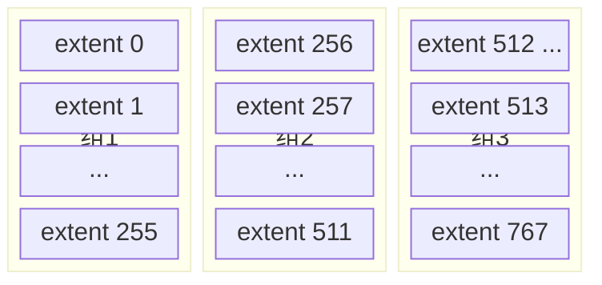

# InnoDB的表空间

通过前文可以知道，`表空间` 是一个抽象的概念：对于系统表空间来说，它对应着文件系统中一个或多个实际文件；对于每个独立表空间来说，它对应着文件系统中一个名为 `表名.ibd` 的实际文件。可以把表空间想象成被切分为许多 `页` 的池子，当想为某个表插入一条记录时，就从池子中捞出一个对应的页把数据写进去。本章深入表空间的各个细节。本章涉及的概念较多，虽然都不难但相互依赖，建议按顺序阅读，不要跳着看。

## 回忆一些旧知识

### 页面类型

`InnoDB` 以页为单位管理存储空间，聚簇索引（即完整的表数据）和其他的二级索引都以 `B+` 树的形式保存到表空间中，而 `B+` 树的节点就是数据页。存放索引数据的页面类型名是 `FIL_PAGE_INDEX`。除了这种页面类型之外，`InnoDB` 也为不同目的设计了若干种不同类型的页面，常用的页面类型如下：

| 类型名称 | 十六进制 | 描述 |
|:--:|:--:|:--:|
| `FIL_PAGE_TYPE_ALLOCATED` | 0x0000 | 最新分配，还没使用 |
| `FIL_PAGE_UNDO_LOG` | 0x0002 | Undo 日志页 |
| `FIL_PAGE_INODE` | 0x0003 | 段信息节点 |
| `FIL_PAGE_IBUF_FREE_LIST` | 0x0004 | Insert Buffer 空闲列表 |
| `FIL_PAGE_IBUF_BITMAP` | 0x0005 | Insert Buffer 位图 |
| `FIL_PAGE_TYPE_SYS` | 0x0006 | 系统页 |
| `FIL_PAGE_TYPE_TRX_SYS` | 0x0007 | 事务系统数据 |
| `FIL_PAGE_TYPE_FSP_HDR` | 0x0008 | 表空间头部信息 |
| `FIL_PAGE_TYPE_XDES` | 0x0009 | 扩展描述页 |
| `FIL_PAGE_TYPE_BLOB` | 0x000A | BLOB 页 |
| `FIL_PAGE_INDEX` | 0x45BF | 索引页，也就是所说的 `数据页` |

由于页面类型前面都有 `FIL_PAGE` 或 `FIL_PAGE_TYPE` 前缀，为简便起见，后文提及页面类型时省略这些前缀。例如 `FIL_PAGE_TYPE_ALLOCATED` 类型称为 `ALLOCATED` 类型，`FIL_PAGE_INDEX` 类型称为 `INDEX` 类型。

### 页面通用部分

数据页（`INDEX` 类型的页）由 7 个部分组成，其中两个部分是所有类型的页面都通用的。任何类型的页面都有下面这种通用结构：


任何类型的页都会包含两个部分：

- `File Header`：记录页面的一些通用信息；
- `File Trailer`：校验页是否完整，保证从内存到磁盘刷新时内容的一致性。

`File Header` 的各个组成部分如下：

| 名称 | 占用空间大小 | 描述 |
|:--:|:--:|:--:|
| `FIL_PAGE_SPACE_OR_CHKSUM` | `4` 字节 | 页的校验和（checksum 值） |
| `FIL_PAGE_OFFSET` | `4` 字节 | 页号 |
| `FIL_PAGE_PREV` | `4` 字节 | 上一个页的页号 |
| `FIL_PAGE_NEXT` | `4` 字节 | 下一个页的页号 |
| `FIL_PAGE_LSN` | `8` 字节 | 页面被最后修改时对应的日志序列位置（Log Sequence Number） |
| `FIL_PAGE_TYPE` | `2` 字节 | 该页的类型 |
| `FIL_PAGE_FILE_FLUSH_LSN` | `8` 字节 | 仅在系统表空间的一个页中定义，代表文件至少被刷新到了对应的 LSN 值 |
| `FIL_PAGE_ARCH_LOG_NO_OR_SPACE_ID` | `4` 字节 | 页属于哪个表空间 |

除名称里带 `LSN` 的两个字段外，其他字段都容易理解。还需要强调几点：

- 表空间中的每一个页都对应着一个页号，即 `FIL_PAGE_OFFSET`，这个页号由 4 个字节（32 个比特位）组成，所以一个表空间最多可以拥有 2³² 个页。按页的默认大小 16KB 计算，一个表空间最多支持 64TB 的数据。表空间的第一个页的页号为 0，之后的页号分别是 1、2、3... 依此类推。
- 某些类型的页可以组成链表，链表中的页可以不按照物理顺序存储，而是根据 `FIL_PAGE_PREV` 和 `FIL_PAGE_NEXT` 存储上一个页和下一个页的页号。需要注意，这两个字段主要是为 `INDEX` 类型的页（即之前一直说的数据页）建立 `B+` 树后为每层节点建立双向链表用的，一般类型的页不使用这两个字段。
- 每个页的类型由 `FIL_PAGE_TYPE` 表示，比如数据页的该字段值就是 `0x45BF`。不同类型的页在该字段上的值不同。

## 独立表空间结构

`InnoDB` 支持许多种类型的表空间，本章重点关注独立表空间和系统表空间的结构。它们的结构比较相似，但系统表空间额外包含了一些关于整个系统的信息，所以先介绍较简单的独立表空间，稍后再介绍系统表空间的结构。

### 区（extent）的概念

表空间中的页非常多，为了更好管理这些页面，设计者提出了 `区`（英文名 `extent`）的概念。对于 16KB 的页来说，连续的 64 个页就是一个 `区`，一个区默认占用 1MB 空间大小。不论是系统表空间还是独立表空间，都可以看成是由若干个区组成的，每 256 个区被划分成一组：



其中 `extent 0` ~ `extent 255` 这 256 个区是第一个组，`extent 256` ~ `extent 511` 是第二个组，`extent 512` ~ `extent 767` 是第三个组，依此类推可以划分更多组。这些组的头几个页面的类型都是类似的：


从图中可以得到如下信息：

- 第一个组最开始的 3 个页面类型是固定的，即 `extent 0` 这个区最开始的 3 个页面的类型固定，分别是：
  - `FSP_HDR` 类型：用来登记整个表空间的一些整体属性以及本组所有的 `区`（`extent 0` ~ `extent 255` 这 256 个区）的属性。整个表空间只有一个 `FSP_HDR` 类型的页面。
  - `IBUF_BITMAP` 类型：存储本组所有区的所有页面关于 `INSERT BUFFER`（现称 `Change Buffer`，更改缓冲）的信息。这里不需要知道它的细节，后文会详细介绍。
  - `INODE` 类型：存储许多称为 `INODE` 的数据结构，后文会详细介绍。
- 其余各组最开始的 2 个页面的类型固定，即 `extent 256`、`extent 512` 这些区最开始的 2 个页面类型固定，分别是：
  - `XDES` 类型：全称 `extent descriptor`，用来登记本组 256 个区的属性。对于 `extent 256` 区中的该类型页面，存储的是 `extent 256` ~ `extent 511` 这些区的属性；对于 `extent 512` 区中的该类型页面，存储的是 `extent 512` ~ `extent 767` 这些区的属性。上面介绍的 `FSP_HDR` 类型页面与 `XDES` 类型页面的作用类似，只是 `FSP_HDR` 类型页面还会额外存储一些表空间的属性。
  - `IBUF_BITMAP` 类型：上面已介绍。

这里不需要记住这些名词，只需要大致记住：表空间被划分为许多连续的 `区`，每个区默认由 64 个页组成，每 256 个区划分为一组，每个组最开始的几个页面类型是固定的。

### 段（segment）的概念

为什么好端端提出一个 `区`（`extent`）的概念？以前的思路是：表中的记录存储到页里，页作为节点组成 `B+` 树，`B+` 树就是索引。这种思路本身没有问题。

如果表中数据量很少，比如只有几十条、几百条数据，确实用不到 `区` 的概念，几个简单的页就能把数据存储起来。但当表里的记录越来越多时，问题就出现了。

表里的记录多了又怎样？`B+` 树的每一层中的页都会形成一个双向链表，`File Header` 中的 `FIL_PAGE_PREV` 和 `FIL_PAGE_NEXT` 字段不就是为了形成双向链表设置的么？

从理论上说，不引入 `区` 的概念、只使用 `页` 的概念对存储引擎的运行没有影响。但考虑下面这个场景：

- 每向表中插入一条记录，本质上就是向该表的聚簇索引以及所有二级索引代表的 `B+` 树的节点中插入数据。`B+` 树的每一层中的页都会形成一个双向链表，如果以 `页` 为单位分配存储空间，双向链表相邻的两个页之间的物理位置可能离得非常远。介绍 `B+` 树索引适用场景时特别提到，范围查询只需要定位到最左边的记录和最右边的记录，然后沿着双向链表一直扫描。而如果链表中相邻的两个页物理位置离得非常远，就是所谓的 `随机I/O`。磁盘的速度和内存的速度差好几个数量级，`随机I/O` 非常慢，所以应该尽量让链表中相邻的页的物理位置也相邻，这样进行范围查询时才可以使用 `顺序I/O`。

所以引入了 `区`（`extent`）的概念，一个区就是在物理位置上连续的 64 个页。表中数据量大的时候，为某个索引分配空间时不再按页为单位分配，而是按 `区` 为单位分配，甚至在数据非常多的时候可以一次性分配多个连续的区。虽然可能造成一点点空间浪费（数据不足以填充满整个区），但从性能角度看，可以消除很多随机 `I/O`。

但事情到这里并没有结束。范围查询其实是对 `B+` 树叶子节点中的记录进行顺序扫描，而如果不区分叶子节点和非叶子节点、统统把节点代表的页面放到申请到的区中，范围扫描的效果就大打折扣。所以设计者对 `B+` 树的叶子节点和非叶子节点区别对待：叶子节点有自己独有的 `区`，非叶子节点也有自己独有的 `区`。存放叶子节点的区的集合就是一个 `段`（`segment`），存放非叶子节点的区的集合也是一个 `段`。也就是说一个索引会生成 2 个段：一个叶子节点段，一个非叶子节点段。

默认情况下一个使用 `InnoDB` 存储引擎的表只有一个聚簇索引，一个索引生成 2 个段，而段是以区为单位申请存储空间的，一个区默认占用 1M 存储空间。所以默认情况下一个只存了几条记录的小表也需要 2M 存储空间？以后每次添加一个索引都要多申请 2M 存储空间？这对存储记录较少的表是巨大的浪费。

问题症结在于到目前为止介绍的区都非常 `纯粹`：一个区被整个分配给某个段，区中的所有页面都是为了存储同一个段的数据而存在，即使段的数据填不满区中所有页面，余下的页面也不能挪作他用。为了照顾数据量较小的表，设计者提出了一个碎片（fragment）区的概念：在碎片区中，并不是所有页都是为了存储同一个段的数据而存在，碎片区中的页可以用于不同目的，比如有些页用于段 A、有些页用于段 B、有些页哪个段都不属于。碎片区直属于表空间，并不属于任何一个段。此后为某个段分配存储空间的策略是：

- 刚开始向表中插入数据时，段从某个碎片区以单个页面为单位分配存储空间；
- 当某个段已经占用了 32 个碎片区页面之后，就以完整的区为单位分配存储空间。

所以段不能仅定义为某些区的集合，更精确地说是某些零散的页面以及一些完整的区的集合。除了索引的叶子节点段和非叶子节点段之外，`InnoDB` 中还有为存储一些特殊数据而定义的段，比如回滚段。现在只需要知道段是一些零散的页面以及一些完整的区的集合即可。

### 区的分类

通过上面的介绍，表空间由若干个区组成，这些区大体上可以分为 4 种类型：

- 空闲的区：现在还没有用到这个区中的任何页面；
- 有剩余空间的碎片区：碎片区中还有可用的页面；
- 没有剩余空间的碎片区：碎片区中的所有页面都被使用，没有空闲页面；
- 附属于某个段的区：每一个索引都可以分为叶子节点段和非叶子节点段，除此之外 `InnoDB` 还会另外定义一些特殊作用的段，这些段中数据量很大时将使用区作为基本分配单位。

这 4 种类型的区也可以称为区的 4 种状态（`State`），设计者为这 4 种状态的区定义了特定名称：

| 状态名 | 含义 |
|:--:|:--:|
| `FREE` | 空闲的区 |
| `FREE_FRAG` | 有剩余空间的碎片区 |
| `FULL_FRAG` | 没有剩余空间的碎片区 |
| `FSEG` | 附属于某个段的区 |

需要再次强调：处于 `FREE`、`FREE_FRAG`、`FULL_FRAG` 这三种状态的区都是独立的，直属于表空间；而处于 `FSEG` 状态的区附属于某个段。

::: tip 小贴士
如果把表空间比作一个集团军，段就相当于师，区就相当于团。一般的团都隶属于某个师，就像处于 `FSEG` 的区全部隶属于某个段；而处于 `FREE`、`FREE_FRAG`、`FULL_FRAG` 这三种状态的区直接隶属于表空间，就像独立团直接听命于军部。
:::

为了方便管理这些区，设计者设计了一个称为 `XDES Entry` 的结构（全称 Extent Descriptor Entry），每一个区都对应着一个 `XDES Entry` 结构，这个结构记录了对应区的一些属性：


`XDES Entry` 是一个 40 字节的结构，大致分为 4 个部分：

- `Segment ID`（8 字节）

  每一个段都有一个唯一的编号，用 ID 表示，此处的 `Segment ID` 字段表示该区所在的段。前提是该区已经被分配给某个段，否则该字段的值没有意义。

- `List Node`（12 字节）

  这个部分可以把若干个 `XDES Entry` 结构串联成一个链表。`List Node` 的结构如下：


  如果想定位表空间内的某一个位置，只需指定页号以及该位置在指定页号中的页内偏移量即可。所以：
  - `Pre Node Page Number` 和 `Pre Node Offset` 的组合是指向前一个 `XDES Entry` 的指针；
  - `Next Node Page Number` 和 `Next Node Offset` 的组合是指向后一个 `XDES Entry` 的指针。

  把一些 `XDES Entry` 结构连成一个链表有什么用？稍后介绍 `XDES Entry` 结构组成的链表问题。

- `State`（4 字节）

  这个字段表明区的状态，可选值就是前面说过的 4 个：`FREE`、`FREE_FRAG`、`FULL_FRAG` 和 `FSEG`。

- `Page State Bitmap`（16 字节）

  这个部分共占用 16 个字节，即 128 个比特位。一个区默认有 64 个页，这 128 个比特位被划分为 64 个部分，每个部分 2 个比特位，对应区中的一个页。比如 `Page State Bitmap` 部分的第 1 和第 2 个比特位对应区中的第 1 个页面，第 3 和第 4 个比特位对应区中的第 2 个页面，依此类推，第 127 和 128 个比特位对应区中的第 64 个页面。这两个比特位的第一位表示对应的页是否是空闲的，第二个比特位还没有用。

#### XDES Entry链表

前面提出了各种概念：区、段、碎片区、附属于段的区、`XDES Entry` 结构等。做这些事情的初心只是提高向表插入数据的效率，又不让数据量少的表浪费空间。现在知道向表中插入数据本质上就是向表中各个索引的叶子节点段、非叶子节点段插入数据，也知道了不同的区有不同的状态。回到最初，梳理向某个段中插入数据的过程：

- 当段中数据较少时，首先查看表空间中是否有状态为 `FREE_FRAG` 的区（即还有空闲空间的碎片区）。如果找到了，从该区中取一些零碎的页把数据插进去；否则到表空间下申请一个状态为 `FREE` 的空闲区，把该区的状态变为 `FREE_FRAG`，然后从新申请的区中取一些零碎的页把数据插进去。之后不同的段使用零碎页时都会从该区中取，直到该区没有空闲空间，然后该区的状态变成 `FULL_FRAG`。

  现在的问题是：怎么知道表空间里哪些区是 `FREE` 的、哪些是 `FREE_FRAG` 的、哪些是 `FULL_FRAG` 的？表空间的大小可以不断增大，当增长到 GB 级别时，区的数量上千，总不能每次都遍历这些区对应的 `XDES Entry` 结构。这时候就是 `XDES Entry` 中 `List Node` 部分发挥作用的时候。通过 `List Node` 中的指针可以做三件事：

  - 把状态为 `FREE` 的区对应的 `XDES Entry` 结构通过 `List Node` 连接成一个链表，这个链表称为 `FREE` 链表；
  - 把状态为 `FREE_FRAG` 的区对应的 `XDES Entry` 结构连接成一个链表，称为 `FREE_FRAG` 链表；
  - 把状态为 `FULL_FRAG` 的区对应的 `XDES Entry` 结构连接成一个链表，称为 `FULL_FRAG` 链表。

  每当想找一个 `FREE_FRAG` 状态的区时，直接把 `FREE_FRAG` 链表的头节点拿出来，从这个节点中取一些零碎的页插入数据。当这个节点对应的区用完时，修改该节点的 `State` 字段值，然后从 `FREE_FRAG` 链表移到 `FULL_FRAG` 链表。同理，如果 `FREE_FRAG` 链表中一个节点都没有，直接从 `FREE` 链表取一个节点移到 `FREE_FRAG` 链表，修改该节点的 `STATE` 字段值为 `FREE_FRAG`，然后从这个节点对应的区中获取零碎的页。

- 当段中数据已经占满 32 个零散的页后，直接申请完整的区来插入数据。

  还是那个问题：怎么知道哪些区属于哪个段？通过遍历各个 `XDES Entry` 结构？遍历很麻烦，有链表就不用遍历。那把状态为 `FSEG` 的区对应的 `XDES Entry` 结构都加入一个链表？不行，不同的段不能共用一个区，不能把表 a 的聚簇索引叶子节点段和表 b 的聚簇索引叶子节点段都存储到一个区中。所以每个段需要独立的链表，可以根据段号（`Segment ID`）来建立链表。但一个段中可以有好多个区，有的区完全空闲，有的区还有一些页面可用，有的区已经没空闲页面，所以有必要继续细分。设计者为每个段中的区对应的 `XDES Entry` 结构建立了三个链表：

  - `FREE` 链表：同一个段中，所有页面都是空闲的区对应的 `XDES Entry` 结构会被加入这个链表。注意与直属于表空间的 `FREE` 链表区分，此处的 `FREE` 链表是附属于某个段的；
  - `NOT_FULL` 链表：同一个段中，仍有空闲空间的区对应的 `XDES Entry` 结构会被加入这个链表；
  - `FULL` 链表：同一个段中，已经没有空闲空间的区对应的 `XDES Entry` 结构会被加入这个链表。

  再次强调，每一个索引都对应两个段，每个段都会维护上述 3 个链表。例如下面这个表：

```sql
CREATE TABLE t (
    c1 INT NOT NULL AUTO_INCREMENT,
    c2 VARCHAR(100),
    c3 VARCHAR(100),
    PRIMARY KEY (c1),
    KEY idx_c2 (c2)
) ENGINE=InnoDB;
```

  这个表 `t` 共有两个索引（一个聚簇索引、一个二级索引 `idx_c2`），所以有 4 个段，每个段维护上述 3 个链表，这个表共需要维护 12 个链表。段在数据量较大时插入数据，会先获取 `NOT_FULL` 链表的头节点，直接把数据插入这个头节点对应的区；如果该区空间用完，就把该节点移到 `FULL` 链表。

#### 链表基节点

上面介绍了一堆链表，可怎么找到这些链表？或者说怎么找到某个链表的头节点或尾节点在表空间中的位置？设计者设计了一个叫 `List Base Node` 的结构（中文译为链表的基节点），这个结构包含链表的头节点和尾节点的指针以及这个链表中包含多少个节点的信息：


上面介绍的每个链表都对应一个 `List Base Node` 结构，其中：

- `List Length` 表明该链表一共有多少节点；
- `First Node Page Number` 和 `First Node Offset` 表明该链表的头节点在表空间中的位置；
- `Last Node Page Number` 和 `Last Node Offset` 表明该链表的尾节点在表空间中的位置。

一般把某个链表对应的 `List Base Node` 结构放置在表空间中固定的位置，这样定位某个链表就非常方便。

#### 链表小结

综上所述，表空间由若干个区组成，每个区对应一个 `XDES Entry` 结构。直属于表空间的区对应的 `XDES Entry` 结构可以分成 `FREE`、`FREE_FRAG`、`FULL_FRAG` 这 3 个链表；每个段可以附属若干个区，每个段中的区对应的 `XDES Entry` 结构可以分成 `FREE`、`NOT_FULL`、`FULL` 这 3 个链表。每个链表都对应一个 `List Base Node` 结构，这个结构记录了链表的头、尾节点的位置以及该链表中包含的节点数。正是因为这些链表的存在，管理这些区才变得非常方便。

### 段的结构

前面说过，段并不对应表空间中某一个连续的物理区域，而是一个逻辑上的概念，由若干个零散的页面以及一些完整的区组成。像每个区都有对应的 `XDES Entry` 记录这个区的属性一样，设计者为每个段都定义了一个 `INODE Entry` 结构来记录段中的属性：


它的各个部分释义如下：

- `Segment ID`：这个 `INODE Entry` 结构对应的段的编号（ID）；
- `NOT_FULL_N_USED`：`NOT_FULL` 链表各 `XDES Entry` 节点对应的区已经使用了多少页面。一个区有 64 个页面，如果不标记已经使用了多少页面，每次向段中插入数据时都要从第一个页面遍历寻找空闲页面；有了这个字段就可以快速定位空闲页面；
- 3 个 `List Base Node`：分别为段的 `FREE` 链表、`NOT_FULL` 链表、`FULL` 链表定义 `List Base Node`，这样想查找某个段的某个链表的头节点和尾节点时，可以直接到这个部分找到对应链表的 `List Base Node`；
- `Magic Number`：用来标记这个 `INODE Entry` 是否已经被初始化（即把各个字段的值都填进去了）。如果这个数字是 `97937874`，表明该 `INODE Entry` 已初始化，否则没有初始化；
- `Fragment Array Entry`：前面反复强调段是零散页面和一些完整区的集合，每个 `Fragment Array Entry` 结构对应着一个零散的页面，这个结构一共 4 个字节，表示一个零散页面的页号。一个 `INODE Entry` 中有 32 个 `Fragment Array Entry`。

结合这个 `INODE Entry` 结构，可以更深刻理解"段是一些零散页面和一些完整的区的集合"。

### 各类型页面详细情况

至此已经大概清楚表空间、段、区、`XDES Entry`、`INODE Entry`、各种以 `XDES Entry` 为节点的链表的基本概念。但还有几个问题：每个区对应的 `XDES Entry` 结构存储在表空间的什么地方？直属于表空间的 `FREE`、`FREE_FRAG`、`FULL_FRAG` 链表的基节点存储在表空间的什么地方？每个段对应的 `INODE Entry` 结构存在表空间的什么地方？前面介绍了每 256 个连续的区算是一个组，解决这些疑问要从每个组开头的一些类型相同的页面说起。

#### FSP_HDR类型

首先看第一个组的第一个页面，也是表空间的第一个页面，页号为 `0`。这个页面的类型是 `FSP_HDR`，它存储了表空间的一些整体属性以及第一个组内 256 个区对应的 `XDES Entry` 结构。一个完整的 `FSP_HDR` 类型页面大致由 5 个部分组成：

| 名称 | 中文名 | 占用空间大小 | 简单描述 |
|:--:|:--:|:--:|:--:|
| `File Header` | 文件头部 | `38` 字节 | 页的一些通用信息 |
| `File Space Header` | 表空间头部 | `112` 字节 | 表空间的一些整体属性信息 |
| `XDES Entry` | 区描述信息 | `10240` 字节 | 存储本组 256 个区对应的属性信息 |
| `Empty Space` | 尚未使用空间 | `5986` 字节 | 用于页结构的填充 |
| `File Trailer` | 文件尾部 | `8` 字节 | 校验页是否完整 |

`File Header` 和 `File Trailer` 不再强调。`Empty Space` 是尚未使用的空间。重点看 `File Space Header` 和 `XDES Entry` 两个部分。

##### File Space Header部分

`File Space Header` 用来存储表空间的一些整体属性，各个属性如下：

| 名称 | 占用空间大小 | 描述 |
|:--:|:--:|:--:|
| `Space ID` | `4` 字节 | 表空间的 ID |
| `Not Used` | `4` 字节 | 这 4 个字节未被使用，可忽略 |
| `Size` | `4` 字节 | 当前表空间占有的页面数 |
| `FREE Limit` | `4` 字节 | 尚未被初始化的最小页号，大于或等于这个页号的区对应的 XDES Entry 结构都没有被加入 FREE 链表 |
| `Space Flags` | `4` 字节 | 表空间的一些占用存储空间比较小的属性 |
| `FRAG_N_USED` | `4` 字节 | FREE_FRAG 链表中已使用的页面数量 |
| `List Base Node for FREE List` | `16` 字节 | FREE 链表的基节点 |
| `List Base Node for FREE_FRAG List` | `16` 字节 | FREE_FRAG 链表的基节点 |
| `List Base Node for FULL_FRAG List` | `16` 字节 | FULL_FRAG 链表的基节点 |
| `Next Unused Segment ID` | `8` 字节 | 当前表空间中下一个未使用的 Segment ID |
| `List Base Node for SEG_INODES_FULL List` | `16` 字节 | SEG_INODES_FULL 链表的基节点 |
| `List Base Node for SEG_INODES_FREE List` | `16` 字节 | SEG_INODES_FREE 链表的基节点 |

`Space ID`、`Not Used`、`Size` 这三个字段一看就懂。其他字段详细说明如下：

- `List Base Node for FREE List`、`List Base Node for FREE_FRAG List`、`List Base Node for FULL_FRAG List`

  这三个分别是直属于表空间的 `FREE` 链表的基节点、`FREE_FRAG` 链表的基节点、`FULL_FRAG` 链表的基节点。这三个链表的基节点在表空间的位置是固定的，即在表空间的第一个页面（`FSP_HDR` 类型页面）的 `File Space Header` 部分，所以定位这几个链表很方便。

- `FRAG_N_USED`

  表明 `FREE_FRAG` 链表中已经使用的页面数量，方便之后在链表中查找空闲页面。

- `FREE Limit`

  表空间都对应着具体的磁盘文件，一开始创建表空间时对应的磁盘文件中都没有数据，需要对表空间完成一个初始化操作，包括为表空间中的区建立 `XDES Entry` 结构、为各个段建立 `INODE Entry` 结构、建立各种链表等。可以一开始就为表空间申请一个特别大的空间，但绝大部分区是空闲的，可以把所有空闲区对应的 `XDES Entry` 结构加入 `FREE` 链表，也可以只把一部分空闲区加入 `FREE` 链表，等空闲链表中的 `XDES Entry` 结构对应的区不够用时，再把之前没加入 `FREE` 链表的空闲区对应的 `XDES Entry` 结构加入 `FREE` 链表——什么时候用到什么时候初始化。设计者采用后者，为表空间定义了 `FREE Limit` 字段，该字段表示的页号之前的区都被初始化了，之后的区尚未被初始化。

- `Next Unused Segment ID`

  表中每个索引都对应 2 个段，每个段都有一个唯一 ID。当为某个表新创建一个索引时，意味着要创建两个新段。怎么为新段找一个唯一 ID？遍历表空间中所有段？遍历很麻烦，所以设计者提出 `Next Unused Segment ID` 字段，它表明当前表空间中最大的段 ID 的下一个 ID，创建新段时直接使用这个字段的值即可。

- `Space Flags`

  表空间对一些布尔类型的属性，或者只需要几个比特位搞定的属性都放在 `Space Flags` 中存储。它只有 4 个字节（32 个比特位），却存储了许多表空间属性，详细情况如下：

  | 标志名称 | 占用的空间（单位：bit） | 描述 |
  |:--:|:--:|:--:|
  | `POST_ANTELOPE` | 1 | 表示文件格式是否大于 `ANTELOPE` |
  | `ZIP_SSIZE` | 4 | 表示压缩页面的大小 |
  | `ATOMIC_BLOBS` | 1 | 表示是否自动把值非常长的字段放到 BLOB 页里 |
  | `PAGE_SSIZE` | 4 | 页面大小 |
  | `DATA_DIR` | 1 | 表示表空间是否是从默认的数据目录中获取的 |
  | `SHARED` | 1 | 是否为共享表空间 |
  | `TEMPORARY` | 1 | 是否为临时表空间 |
  | `ENCRYPTION` | 1 | 表空间是否加密 |
  | `UNUSED` | 18 | 没有使用到的比特位 |

  ::: tip 小贴士
  不同 MySQL 版本里 SPACE_FLAGS 代表的属性可能有些差异，这里列举的是 5.7.21 版本。目前不必深究这些含义，一旦展开就需要非常大篇幅。先看重要的内容，把主要表空间结构了解完，SPACE_FLAGS 里属性的细节暂时不深究。
  :::

- `List Base Node for SEG_INODES_FULL List` 和 `List Base Node for SEG_INODES_FREE List`

  每个段对应的 `INODE Entry` 结构会集中存放到一个类型为 `INODE` 的页中。如果表空间中的段特别多，会有多个 `INODE Entry` 结构，可能一个页放不下，这些 `INODE` 类型的页会组成两种列表：

  - `SEG_INODES_FULL` 链表：该链表中的 `INODE` 类型页面已经被 `INODE Entry` 结构填充满，没空闲空间存放额外的 `INODE Entry`；
  - `SEG_INODES_FREE` 链表：该链表中的 `INODE` 类型页面仍有空闲空间存放 `INODE Entry` 结构。

  由于还没有详细介绍 `INODE` 类型页，等介绍完 `INODE` 类型的页之后再回头看这两个链表。

##### XDES Entry部分

紧接着 `File Space Header` 部分的就是 `XDES Entry` 部分，一直提及但没见过真身的 `XDES Entry` 保存在表空间的第一个页面中。一个 `XDES Entry` 结构的大小是 40 字节，一个页面大小有限，只能存放有限个 `XDES Entry` 结构，所以把 256 个区划分成一组，在每组的第一个页面中存放 256 个 `XDES Entry` 结构。`XDES Entry 0` 对应 `extent 0`，`XDES Entry 1` 对应 `extent 1`... 依此类推，`XDES Entry 255` 对应 `extent 255`。

因为每个区对应的 `XDES Entry` 结构的地址固定，所以访问这些结构很方便，具体使用情况已介绍，这里不再赘述。

#### XDES类型

每一个 `XDES Entry` 结构对应表空间的一个区。虽然一个 `XDES Entry` 结构只占用 40 字节，但表空间的区数量多，在区的数量非常多时，一个单独的页可能不够存放足够多的 `XDES Entry` 结构，所以把表空间的区划分为若干个组，每组开头的一个页面记录本组内所有区对应的 `XDES Entry` 结构。由于第一个组的第一个页面也是整个表空间的第一个页面，除了记录本组中的所有区对应的 `XDES Entry` 结构外，还记录着表空间的一些整体属性，这个页面的类型就是刚介绍的 `FSP_HDR` 类型，整个表空间只有一个这种类型的页面。除去第一个分组以外，之后每个分组的第一个页面只需记录本组内所有区对应的 `XDES Entry` 结构，不需要再记录表空间的属性。为和 `FSP_HDR` 类型区分，把之后每个分组的第一个页面的类型定义为 `XDES`，它的结构和 `FSP_HDR` 类型非常相似：


与 `FSP_HDR` 类型的页面相比，除了少了 `File Space Header` 部分（即记录表空间整体属性的部分），其余部分完全一样。

#### IBUF_BITMAP类型

每个分组的第二个页面类型都是 `IBUF_BITMAP`，这种类型的页记录了一些有关 `Change Buffer` 的内容。`Change Buffer` 包含很多概念，为避免在一章中接受过多新概念，`Change Buffer` 的相关知识放到后文介绍。

#### INODE类型

第一个分组的第三个页面类型是 `INODE`。设计者为每个索引定义了两个段，还为某些特殊功能定义了一些特殊的段。为方便管理，为每个段设计了一个 `INODE Entry` 结构，记录关于这个段的相关属性。`INODE` 类型的页就是为了存储 `INODE Entry` 结构而存在的：


一个 `INODE` 类型页面由这几部分构成：

| 名称 | 中文名 | 占用空间大小 | 简单描述 |
|:--:|:--:|:--:|:--:|
| `File Header` | 文件头部 | `38` 字节 | 页的一些通用信息 |
| `List Node for INODE Page List` | 通用链表节点 | `12` 字节 | 存储上一个 INODE 页面和下一个 INODE 页面的指针 |
| `INODE Entry` | 段描述信息 | `16128` 字节 | 存储 INODE Entry 结构 |
| `Empty Space` | 尚未使用空间 | `198` 字节 | 用于页结构的填充（38+12+16128+198+8=16384，核对无误） |
| `File Trailer` | 文件尾部 | `8` 字节 | 校验页是否完整 |

重点看 `List Node for INODE Page List` 和 `INODE Entry` 两个部分。

首先看 `INODE Entry` 部分，前面已详细介绍过这个结构的组成，主要包括对应的段内零散页面的地址以及附属于该段的 `FREE`、`NOT_FULL`、`FULL` 链表的基节点。每个 `INODE Entry` 结构占用 192 字节，一个页面里可以存储 `84` 个这样的结构。

重点看 `List Node for INODE Page List`。一个表空间中可能存在超过 84 个段，可能一个 `INODE` 类型的页面不足以存储所有段对应的 `INODE Entry` 结构，需要额外的 `INODE` 类型页面存储这些结构。为方便管理这些 `INODE` 类型的页面，设计者将这些 `INODE` 类型的页面串联成两个不同的链表：

- `SEG_INODES_FULL` 链表：该链表中的 `INODE` 类型页面已经没有空闲空间存储额外的 `INODE Entry` 结构；
- `SEG_INODES_FREE` 链表：该链表中的 `INODE` 类型页面还有空闲空间存储额外的 `INODE Entry` 结构。

这两个链表的基节点存储在 `File Space Header` 里，位置固定，可以轻松访问。每当新创建一个段（创建索引时就会创建段）时，都会创建一个 `INODE Entry` 结构与之对应，存储 `INODE Entry` 的大致过程：

- 先看 `SEG_INODES_FREE` 链表是否为空：如果不为空，直接从该链表获取一个节点（即一个仍有空闲空间的 `INODE` 类型页面），把该 `INODE Entry` 结构放到该页面中。当该页面无剩余空间时，把该页放到 `SEG_INODES_FULL` 链表中；
- 如果 `SEG_INODES_FREE` 链表为空，需要从表空间的 `FREE_FRAG` 链表申请一个页面，修改该页面类型为 `INODE`，把该页面放到 `SEG_INODES_FREE` 链表中，同时把该 `INODE Entry` 结构放入该页面。

### Segment Header 结构的运用

一个索引会产生两个段：叶子节点段和非叶子节点段。每个段都对应一个 `INODE Entry` 结构，那怎么知道某个段对应哪个 `INODE Entry` 结构？需要找个地方记下这个对应关系。

在介绍数据页（`INDEX` 类型的页）时，`Page Header` 部分有相关字段。`Page Header` 部分相关内容如下：

| 名称 | 占用空间大小 | 描述 |
|:--:|:--:|:--:|
| ... | ... | ... |
| `PAGE_BTR_SEG_LEAF` | `10` 字节 | B+ 树叶子段的头部信息，仅在 B+ 树的根页定义 |
| `PAGE_BTR_SEG_TOP` | `10` 字节 | B+ 树非叶子段的头部信息，仅在 B+ 树的根页定义 |

其中 `PAGE_BTR_SEG_LEAF` 和 `PAGE_BTR_SEG_TOP` 都占用 10 个字节，它们对应一个叫 `Segment Header` 的结构：


各个部分的具体释义：

| 名称 | 占用字节数 | 描述 |
|:--:|:--:|:--:|
| `Space ID of the INODE Entry` | `4` | INODE Entry 结构所在的表空间 ID |
| `Page Number of the INODE Entry` | `4` | INODE Entry 结构所在的页面页号 |
| `Byte Offset of the INODE Entry` | `2` | INODE Entry 结构在该页面中的偏移量 |

这样就很清晰了：`PAGE_BTR_SEG_LEAF` 记录着叶子节点段对应的 `INODE Entry` 结构的地址（哪个表空间的哪个页面的哪个偏移量），`PAGE_BTR_SEG_TOP` 记录着非叶子节点段对应的 `INODE Entry` 结构的地址。这样索引和其对应段的关系就建立起来了。需要注意，因为一个索引只对应两个段，所以只需在索引的根页面中记录这两个结构。

### 真实表空间对应的文件大小

上面介绍了许多概念，不过独立表空间有那么大吗？到数据目录里看，一个新建的表对应的 `.ibd` 文件只占用了 96K，才 6 个页面大小（这是 5.7 时代的大小；MySQL 8.0 起为 7 个页面、共 112KB，8.0.46 实测新建表 `.ibd` 为 114688 字节，多出的页面用于存储表结构等元数据）。

一开始表空间占用的空间自然很小，因为表里没有数据。但这些 `.ibd` 文件是自扩展的，随着表中数据增多，表空间对应的文件逐渐增大。

## 系统表空间

了解完独立表空间的基本结构，系统表空间的结构也就好理解了。系统表空间的结构和独立表空间基本类似，但由于整个 `MySQL` 进程只有一个系统表空间，系统表空间中会额外记录一些有关整个系统信息的页面，所以比独立表空间多出一些记录这些信息的页面。系统表空间相当于表空间之首，在 MySQL 5.7 及更早版本中它的 `表空间 ID`（Space ID）是 `0`（MySQL 8.0 起数据字典与系统表移入 `mysql.ibd`，系统表空间的 Space ID 不再固定为 0，8.0.46 实测为 4294967294）。

### 系统表空间的整体结构

系统表空间与独立表空间一个非常明显的不同之处是，在表空间开头有许多记录整个系统属性的页面：


系统表空间和独立表空间的前三个页面（页号 `0`、`1`、`2`，类型分别是 `FSP_HDR`、`IBUF_BITMAP`、`INODE`）类型一致，页号为 `3` ~ `7` 的页面是系统表空间特有的：

| 页号 | 页面类型 | 英文描述 | 描述 |
|:--:|:--:|:--:|:--|
| `3` | `SYS` | Insert Buffer Header | 存储 Insert Buffer 的头部信息 |
| `4` | `INDEX` | Insert Buffer Root | 存储 Insert Buffer 的根页面 |
| `5` | `TRX_SYS` | Transaction System Header | 事务系统的相关信息 |
| `6` | `SYS` | First Rollback Segment | 第一个回滚段的页面 |
| `7` | `SYS` | Data Dictionary Header | 数据字典头部信息 |

除了这几个记录系统属性的页面之外，在 MySQL 5.7 时代，系统表空间的 `extent 1` 和 `extent 2` 这两个区（即页号从 `64` ~ `127` 这 128 个页面）被用作 `Doublewrite buffer`，也就是双写缓冲区（MySQL 8.0.20 起双写缓冲移出系统表空间，改存于数据目录下独立的 `#ib_16384_N.dblwr` 文件中）。上述大部分知识都涉及事务和多版本控制的问题，会在后文集中介绍，这里只介绍 `InnoDB` 数据字典的知识。

#### InnoDB数据字典

平时使用 `INSERT` 语句向表中插入的那些记录称为用户数据，`MySQL` 作为一个软件为我们保管这些数据，提供方便的增删改查接口。每当向一个表中插入一条记录时，`MySQL` 先要校验插入语句对应的表存不存在、插入的列和表中的列是否符合；如果语法没有问题，还需要知道该表的聚簇索引和所有二级索引对应的根页面是哪个表空间的哪个页面，然后把记录插入对应索引的 `B+` 树中。所以说 `MySQL` 除了保存用户插入的数据之外，还需要保存许多额外信息，例如：

- 某个表属于哪个表空间，表里有多少列；
- 表对应的每一个列的类型是什么；
- 该表有多少索引，每个索引对应哪几个字段，该索引对应的根页面在哪个表空间的哪个页面；
- 该表有哪些外键，外键对应哪个表的哪些列；
- 某个表空间对应文件系统上文件路径是什么；
- 等等，还有很多。

上述这些数据并不是使用 `INSERT` 语句插入的用户数据，而是为了更好管理用户数据而引入的额外数据，这些数据也称为 `元数据`。`InnoDB` 存储引擎特意定义了一些内部系统表（internal system table）来记录这些 `元数据`：

| 表名 | 描述 |
|:--:|:--:|
| `SYS_TABLES` | 整个 InnoDB 存储引擎中所有的表的信息 |
| `SYS_COLUMNS` | 整个 InnoDB 存储引擎中所有的列的信息 |
| `SYS_INDEXES` | 整个 InnoDB 存储引擎中所有的索引的信息 |
| `SYS_FIELDS` | 整个 InnoDB 存储引擎中所有的索引对应的列的信息 |
| `SYS_FOREIGN` | 整个 InnoDB 存储引擎中所有的外键的信息 |
| `SYS_FOREIGN_COLS` | 整个 InnoDB 存储引擎中所有的外键对应列的信息 |
| `SYS_TABLESPACES` | 整个 InnoDB 存储引擎中所有的表空间信息 |
| `SYS_DATAFILES` | 整个 InnoDB 存储引擎中所有的表空间对应文件系统的文件路径信息 |
| `SYS_VIRTUAL` | 整个 InnoDB 存储引擎中所有的虚拟生成列的信息 |

这些系统表也被称为 `数据字典`，它们都以 `B+` 树的形式保存在系统表空间的某些页面中。

> 注：以上是 MySQL 5.7 时代的数据字典实现。**MySQL 8.0 起采用全新的事务型数据字典**：`SYS_*` 内部系统表与页号 7 的 `Data Dictionary Header` 页面被移除，元数据统一存放在 `mysql.ibd` 数据字典表空间中的 `mysql.tables`、`mysql.columns`、`mysql.indexes`、`mysql.foreigns` 等隐藏表中，DDL 由此得以原子化。下文的表结构仅供理解历史设计。其中 `SYS_TABLES`、`SYS_COLUMNS`、`SYS_INDEXES`、`SYS_FIELDS` 这四个表尤其重要，称为基本系统表（basic system tables）。先看这 4 个表的结构。

##### SYS_TABLES表

`SYS_TABLES` 表的列如下：

| 列名 | 描述 |
|:--:|:--:|
| `NAME` | 表的名称 |
| `ID` | InnoDB 存储引擎中每个表都有一个唯一的 ID |
| `N_COLS` | 该表拥有列的个数 |
| `TYPE` | 表的类型，记录了一些文件格式、行格式、压缩等信息 |
| `MIX_ID` | 已过时，忽略 |
| `MIX_LEN` | 表的一些额外的属性 |
| `CLUSTER_ID` | 未使用，忽略 |
| `SPACE` | 该表所属表空间的 ID |

这个 `SYS_TABLES` 表有两个索引：

- 以 `NAME` 列为主键的聚簇索引；
- 以 `ID` 列建立的二级索引。

##### SYS_COLUMNS表

`SYS_COLUMNS` 表的列如下：

| 列名 | 描述 |
|:--:|:--:|
| `TABLE_ID` | 该列所属表对应的 ID |
| `POS` | 该列在表中是第几列 |
| `NAME` | 该列的名称 |
| `MTYPE` | main data type，主数据类型，就是那堆 INT、CHAR、VARCHAR、FLOAT、DOUBLE 之类的类型 |
| `PRTYPE` | precise type，精确数据类型，就是修饰主数据类型的那堆类型，比如是否允许 NULL 值、是否允许负数等 |
| `LEN` | 该列最多占用存储空间的字节数 |
| `PREC` | 该列的精度，这列似乎没有使用，默认值都是 0 |

这个 `SYS_COLUMNS` 表只有一个聚簇索引：以 `(TABLE_ID, POS)` 列为主键的聚簇索引。

##### SYS_INDEXES表

`SYS_INDEXES` 表的列如下：

| 列名 | 描述 |
|:--:|:--:|
| `TABLE_ID` | 该索引所属表对应的 ID |
| `ID` | InnoDB 存储引擎中每个索引都有一个唯一的 ID |
| `NAME` | 该索引的名称 |
| `N_FIELDS` | 该索引包含列的个数 |
| `TYPE` | 该索引的类型，比如聚簇索引、唯一索引、更改缓冲区的索引、全文索引、普通的二级索引等 |
| `SPACE` | 该索引所在表空间的 ID |
| `PAGE_NO` | 该索引的根页面在表空间中的页号 |
| `MERGE_THRESHOLD` | 如果页面中的记录被删除到某个比例，就把该页面和相邻页面合并，这个值就是这个比例 |

这个 `SYS_INDEXES` 表只有一个聚簇索引：以 `(TABLE_ID, ID)` 列为主键的聚簇索引。

##### SYS_FIELDS表

`SYS_FIELDS` 表的列如下：

| 列名 | 描述 |
|:--:|:--:|
| `INDEX_ID` | 该索引列所属的索引的 ID |
| `POS` | 该索引列在某个索引中是第几列 |
| `COL_NAME` | 该索引列的名称 |

这个 `SYS_FIELDS` 表只有一个聚簇索引：以 `(INDEX_ID, POS)` 列为主键的聚簇索引。

##### Data Dictionary Header页面

只要有了上述 4 个基本系统表，就可以获取其他系统表以及用户定义的表的所有元数据。例如想看看 `SYS_TABLESPACES` 这个系统表里存储了哪些表空间及对应属性，可以：

- 到 `SYS_TABLES` 表中根据表名定位到具体记录，获取 `SYS_TABLESPACES` 表的 `TABLE_ID`；
- 使用这个 `TABLE_ID` 到 `SYS_COLUMNS` 表中获取属于该表的所有列的信息；
- 使用这个 `TABLE_ID` 到 `SYS_INDEXES` 表中获取所有索引的信息，索引的信息包括对应的 `INDEX_ID`，还记录着该索引对应的 `B+` 树根页面是哪个表空间的哪个页面；
- 使用 `INDEX_ID` 到 `SYS_FIELDS` 表中获取所有索引列的信息。

也就是说这 4 个表是表中之表。那这 4 个表的元数据从哪里获取？只能把这 4 个表的元数据（有哪些列、哪些索引等信息）硬编码到代码中，然后设计者又拿出一个固定的页面记录这 4 个表的聚簇索引和二级索引对应的 `B+` 树位置，这个页面就是页号为 `7` 的页面，类型为 `SYS`，记录了 `Data Dictionary Header`，即数据字典的头部信息。除了这 4 个表的 5 个索引的根页面信息外，这个页面还记录了整个 `InnoDB` 存储引擎的一些全局属性：


这个页面由下面几个部分组成：

| 名称 | 中文名 | 占用空间大小 | 简单描述 |
|:--:|:--:|:--:|:--:|
| `File Header` | 文件头部 | `38` 字节 | 页的一些通用信息 |
| `Data Dictionary Header` | 数据字典头部信息 | `56` 字节 | 记录一些基本系统表的根页面位置以及 InnoDB 存储引擎的一些全局信息 |
| `Segment Header` | 段头部信息 | `10` 字节 | 记录本页面所在段对应的 INODE Entry 位置信息 |
| `Empty Space` | 尚未使用空间 | `16272` 字节 | 用于页结构的填充 |
| `File Trailer` | 文件尾部 | `8` 字节 | 校验页是否完整 |

这个页面里有 `Segment Header` 部分，意味着设计者把这些有关数据字典的信息当成一个段来分配存储空间，可以称之为 `数据字典段`。由于目前需要记录的数据字典信息非常少（`Data Dictionary Header` 部分仅占用 56 字节），所以该段只有一个碎片页，即页号为 `7` 的这个页。

接下来详细介绍 `Data Dictionary Header` 部分的各个字段：

- `Max Row ID`：如果不显式为表定义主键，且表中也没有 `UNIQUE` 索引，`InnoDB` 存储引擎会默认为我们生成一个名为 `row_id` 的列作为主键。因为它是主键，每条记录的 `row_id` 列的值不能重复。原则上只要一个表中的 `row_id` 列不重复即可，表 a 和表 b 拥有一样的 `row_id` 列也没关系。不过设计者只提供了 `Max Row ID` 字段，不论哪个拥有 `row_id` 列的表插入一条记录时，该记录的 `row_id` 列的值就是 `Max Row ID` 对应的值，然后再把 `Max Row ID` 对应的值加 1，也就是说这个 `Max Row ID` 是全局共享的。
- `Max Table ID`：`InnoDB` 存储引擎中的所有表都对应一个唯一 ID，每次新建一个表时，就把本字段的值作为该表的 ID，然后自增本字段的值。
- `Max Index ID`：`InnoDB` 存储引擎中的所有索引都对应一个唯一 ID，每次新建一个索引时，就把本字段的值作为该索引的 ID，然后自增本字段的值。
- `Max Space ID`：`InnoDB` 存储引擎中的所有表空间都对应一个唯一 ID，每次新建一个表空间时，就把本字段的值作为该表空间的 ID，然后自增本字段的值。
- `Mix ID Low(Unused)`：这个字段没有用，跳过。
- `Root of SYS_TABLES clust index`：代表 `SYS_TABLES` 表聚簇索引的根页面的页号。
- `Root of SYS_TABLE_IDS sec index`：代表 `SYS_TABLES` 表为 `ID` 列建立的二级索引的根页面的页号。
- `Root of SYS_COLUMNS clust index`：代表 `SYS_COLUMNS` 表聚簇索引的根页面的页号。
- `Root of SYS_INDEXES clust index`：代表 `SYS_INDEXES` 表聚簇索引的根页面的页号。
- `Root of SYS_FIELDS clust index`：代表 `SYS_FIELDS` 表聚簇索引的根页面的页号。
- `Unused`：这 4 个字节没用，跳过。

以上就是页号为 `7` 的页面的全部内容，初次看可能有些绕，建议多读几遍。

##### information_schema系统数据库

需要注意，用户不能直接访问 `InnoDB` 的这些内部系统表，除非直接解析系统表空间对应文件系统上的文件。设计者考虑到查看这些表的内容可能有助于分析问题，在系统数据库 `information_schema` 中提供了一些以 `innodb_sys` 开头的表：

```text
mysql> USE information_schema;
Database changed

mysql> SHOW TABLES LIKE 'innodb_tab%';
+--------------------------------------------+
| Tables_in_information_schema (INNODB_TAB%) |
+--------------------------------------------+
| INNODB_TABLES                              |
| INNODB_TABLESPACES                         |
| INNODB_TABLESPACES_BRIEF                   |
| INNODB_TABLESTATS                          |
+--------------------------------------------+
4 rows in set (0.00 sec)
```

`information_schema` 数据库中提供这些视图的目的是让用户免于直接解析表空间文件。在 MySQL 5.7 中它们以 `INNODB_SYS_*` 命名（如 `INNODB_SYS_TABLES`）；**MySQL 8.0.30 起统一更名为 `INNODB_*`**（8.0.46 实测）：`INNODB_TABLES`、`INNODB_COLUMNS`、`INNODB_INDEXES`、`INNODB_FIELDS`、`INNODB_TABLESPACES`、`INNODB_DATAFILES`、`INNODB_FOREIGN`、`INNODB_FOREIGN_COLS`、`INNODB_VIRTUAL`、`INNODB_TABLESTATS` 等。这些视图读取的是 8.0 数据字典中的信息，字段与上文的 `SYS_*` 内部系统表不完全一样，但供参考已经足够。这些表很多，可以自行查看这些表中的数据。
