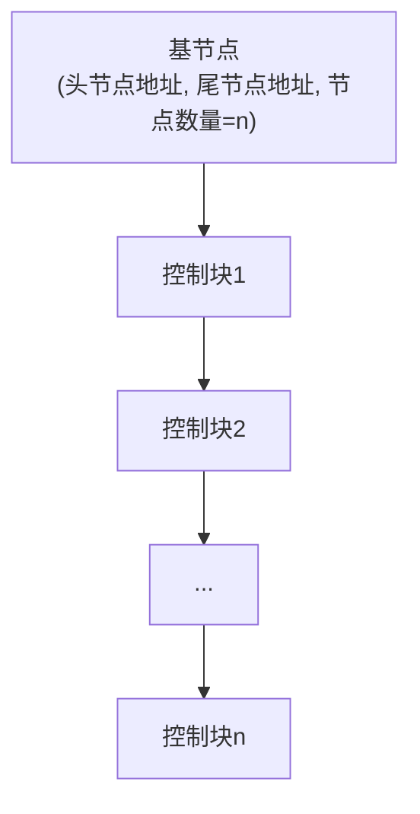
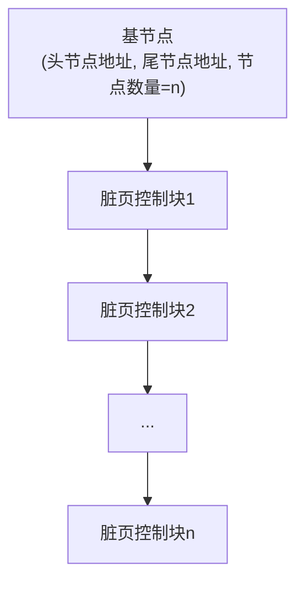

# InnoDB的Buffer Pool

## 缓存的重要性

对于使用 `InnoDB` 作为存储引擎的表来说，不管是用于存储用户数据的索引（包括聚簇索引和二级索引），还是各种系统数据，都是以 `页` 的形式存放在 `表空间` 中的。所谓的 `表空间` 只不过是 `InnoDB` 对文件系统上一个或几个实际文件的抽象，也就是说数据最终还是存储在磁盘上的。而磁盘的速度远低于 `CPU`，所以 `InnoDB` 存储引擎在处理客户端的请求时，当需要访问某个页的数据，就会把完整的页的数据全部加载到内存中。也就是说**即使只需要访问一个页的一条记录，也需要先把整个页的数据加载到内存中**。将整个页加载到内存中后就可以进行读写访问了。在进行完读写访问之后并不着急把该页对应的内存空间释放掉，而是将其 `缓存` 起来，这样将来有请求再次访问该页面时，就可以省去磁盘 `IO` 的开销了。

## 什么是Buffer Pool

设计 `InnoDB` 的工程师为了缓存磁盘中的页，在 `MySQL` 服务器启动时向操作系统申请了一片连续的内存，命名为 `Buffer Pool`（中文名 `缓冲池`）。它的大小取决于机器配置，默认情况下 `Buffer Pool` 只有 `128M` 大小。如果觉得这个 `128M` 太大或者太小，可以在启动服务器时配置 `innodb_buffer_pool_size` 参数的值，它表示 `Buffer Pool` 的大小，就像这样：

```ini
[server]
innodb_buffer_pool_size = 268435456
```

其中 `268435456` 的单位是字节，也就是把 `Buffer Pool` 的大小指定为 `256M`。需要注意的是，`Buffer Pool` 不能太小，最小值为 `5M`（当小于该值时会自动设置为 `5M`）。

## Buffer Pool内部组成

`Buffer Pool` 中默认的缓存页大小和在磁盘上默认的页大小一样，都是 `16KB`。为了更好地管理这些在 `Buffer Pool` 中的缓存页，设计 `InnoDB` 的工程师为每一个缓存页都创建了一些 `控制信息`，这些控制信息包括该页所属的表空间编号、页号、缓存页在 `Buffer Pool` 中的地址、链表节点信息、一些锁信息以及 `LSN` 信息。

每个缓存页对应的控制信息占用的内存大小是相同的，把每个页对应的控制信息占用的一块内存称为一个 `控制块`。**控制块和缓存页是一一对应的，它们都被存放到 Buffer Pool 中，其中控制块被存放到 Buffer Pool 的前边，缓存页被存放到 Buffer Pool 后边**，所以整个 `Buffer Pool` 对应的内存空间看起来是这样的：


`控制块` 和 `缓存页` 之间的 `碎片` 是什么？每一个控制块都对应一个缓存页，在分配足够多的控制块和缓存页后，可能剩余的那点儿空间不够一对控制块和缓存页的大小，自然就用不到了，这个用不到的内存空间就称为 `碎片`。

::: tip 小贴士
每个控制块大约占用缓存页大小的 5%。在 MySQL 5.7.21 这个版本中，每个控制块占用的大小是 808 字节。而我们设置的 innodb_buffer_pool_size 并不包含这部分控制块占用的内存空间大小，也就是说 InnoDB 在为 Buffer Pool 向操作系统申请连续的内存空间时，这片连续的内存空间一般会比 innodb_buffer_pool_size 的值大 5% 左右。
:::

## free链表的管理

最初启动 `MySQL` 服务器时，需要完成对 `Buffer Pool` 的初始化过程：先向操作系统申请 `Buffer Pool` 的内存空间，然后把它划分成若干对控制块和缓存页。但此时并没有真实的磁盘页被缓存到 `Buffer Pool` 中（因为还没有用到），之后随着程序运行，会不断有磁盘上的页被缓存到 `Buffer Pool` 中。那么从磁盘上读取一个页到 `Buffer Pool` 中时该放到哪个缓存页的位置？或者说怎么区分 `Buffer Pool` 中哪些缓存页是空闲的、哪些已经被使用了？**最好在某个地方记录一下 Buffer Pool 中哪些缓存页是可用的**，所以可以**把所有空闲的缓存页对应的控制块作为节点放到一个链表**中，这个链表也被称为 `free链表`（或者说空闲链表）。刚刚完成初始化的 `Buffer Pool` 中所有缓存页都是空闲的，所以每一个缓存页对应的控制块都会被加入到 `free链表` 中。



有了 `free链表` 之后，每当需要从磁盘中加载一个页到 `Buffer Pool` 中时，就从 `free链表` 中取一个空闲的缓存页，并且把该缓存页对应的 `控制块` 的信息填上（即该页所在的表空间、页号之类的信息），然后把该缓存页对应的 `free链表` 节点从链表中移除，表示该缓存页已经被使用了。

## 缓存页的哈希处理

怎么知道该页在不在 `Buffer Pool` 中？用 `表空间号 + 页号` 定位一个页，也就是 `表空间号 + 页号` 是一个 `key`、`缓存页` 是对应的 `value`。通过一个 `key` 快速找一个 `value`，最适合用哈希表。所以可以用 `表空间号 + 页号` 作为 `key`、`缓存页` 作为 `value` 创建一个哈希表。在需要访问某个页的数据时，先从哈希表中根据 `表空间号 + 页号` 看看有没有对应的缓存页：如果有，直接使用该缓存页；如果没有，就从 `free链表` 中选一个空闲的缓存页，然后把磁盘中对应的页加载到该缓存页的位置。

## flush链表的管理

如果修改了 `Buffer Pool` 中某个缓存页的数据，那它就和磁盘上的页**不一致**了，这样的缓存页被称为 `脏页`（英文名 `dirty page`）。每次修改缓存页后，并不着急立即把修改同步到磁盘，而是在未来的某个时间点进行同步。但如果不立即同步到磁盘，之后同步时怎么知道 `Buffer Pool` 中哪些页是 `脏页`、哪些页从来没被修改过？所以不得不再创建一个存储脏页的链表，凡是修改过的缓存页对应的控制块都会作为节点加入到一个链表中。因为这个链表节点对应的缓存页都需要被刷新到磁盘上，所以也叫 `flush链表`。



## LRU链表的管理

### 缓存不够的窘境

`Buffer Pool` 对应的内存大小毕竟是有限的。如果需要缓存的页占用的内存大小超过了 `Buffer Pool` 大小，也就是 `free链表` 中已经没有多余的空闲缓存页时，该咋办？当然是把某些旧的缓存页从 `Buffer Pool` 中移除，再把新的页放进来。那么问题来了：移除哪些缓存页呢？

为了尽量减少和磁盘的 `IO` 交互，最好每次访问某个页时它都已经被缓存到 `Buffer Pool` 中。假设一共访问了 `n` 次页，被访问的页已经在缓存中的次数除以 `n` 就是所谓的 `缓存命中率`，期望是让 `缓存命中率` 越高越好。

### 简单的LRU链表

当 `Buffer Pool` 中不再有空闲的缓存页时，需要淘汰掉部分最近很少使用的缓存页。创建一个链表，由于这个链表是为了 `按照最近最少使用` 的原则淘汰缓存页，所以被称为 `LRU链表`（`LRU` 的英文全称是 `Least Recently Used`）。当需要访问某个页时，可以这样处理 `LRU链表`：

- 如果该页不在 `Buffer Pool` 中，在把该页从磁盘加载到 `Buffer Pool` 中的缓存页时，就把该缓存页对应的 `控制块` 作为节点塞到链表的头部；
- 如果该页已经缓存在 `Buffer Pool` 中，则直接把该页对应的 `控制块` 移动到 `LRU链表` 的头部。

也就是说：**只要使用到某个缓存页，就把该缓存页调整到 `LRU链表` 的头部，这样 `LRU链表` 尾部就是最近最少使用的缓存页**。所以当 `Buffer Pool` 中的空闲缓存页用完时，到 `LRU链表` 的尾部找些缓存页淘汰即可。

### 划分区域的LRU链表

但这个简单的 `LRU链表` 用了一段时间就发现问题了，因为存在两种比较尴尬的情况：

- **情况一：预读**。`InnoDB` 认为执行当前请求之后可能读取某些页面，就预先把它们加载到 `Buffer Pool` 中。`预读` 可以细分为线性预读（顺序访问某个区的页面超过 `innodb_read_ahead_threshold` 触发）和随机预读（`Buffer Pool` 中已缓存某个区的 13 个连续页面触发，由 `innodb_random_read_ahead` 控制，默认关闭）。如果预读到 `Buffer Pool` 中的页被成功使用到，可以极大提高语句执行效率；可如果用不到呢？这些预读的页都会被放到 `LRU` 链表的头部，导致 `LRU链表` 尾部的一些缓存页很快被淘汰掉，**大大降低缓存命中率**。

- **情况二：全表扫描**。扫描全表意味着将访问到该表所在的所有页，这会让 `Buffer Pool` 中的所有页都被换了一次血，其他查询语句在执行时又得执行一次从磁盘加载到 `Buffer Pool` 的操作，**大大降低缓存命中率**。

因为有这两种情况存在，设计 `InnoDB` 的工程师把 `LRU链表` 按照一定比例分成两截：

- 一部分存储使用频率非常高的缓存页，这一部分链表也叫 `热数据`，或称 `young区域`；
- 另一部分存储使用频率不是很高的缓存页，这一部分链表也叫 `冷数据`，或称 `old区域`。


**按照某个比例将 LRU 链表分成两半，并不是某些节点固定属于 young 区域、某些节点固定属于 old 区域**。随着程序运行，某个节点所属的区域也可能发生变化。可以通过查看系统变量 `innodb_old_blocks_pct` 的值来确定 `old` 区域在 `LRU链表` 中所占的比例，默认情况下 `old` 区域占 `LRU链表` 的 `37%`（大约 3/8）。这个比例可以设置。

有了被划分成 `young` 和 `old` 区域的 `LRU` 链表之后，就可以针对上面提到的两种情况优化：

- 针对预读的页面可能不进行后续访问的情况：**当磁盘上的某个页面在初次加载到 Buffer Pool 中的某个缓存页时，该缓存页对应的控制块会被放到 old 区域的头部**。这样针对预读到 `Buffer Pool` 却不进行后续访问的页面，会逐渐从 `old` 区域逐出，而不影响 `young` 区域。

- 针对全表扫描时短时间内访问大量使用频率非常低页面的情况：每次访问页面都要把它放到 `young` 区域头部，仍会把使用频率高的页面顶下去。设计者规定：**在对某个处在 `old` 区域的缓存页进行第一次访问时，在它对应的控制块中记录下这个访问时间；如果后续的访问时间与第一次访问的时间在某个时间间隔内，那么该页面就不会被从 old 区域移动到 young 区域的头部**。上述间隔时间由系统变量 `innodb_old_blocks_time` 控制，默认值 `1000` 毫秒。

### 更进一步优化LRU链表

对于 `young` 区域的缓存页，每次访问一个缓存页就要把它移动到 `LRU链表` 头部，开销太大。可以提出优化策略，比如**只有被访问的缓存页位于 `young` 区域的 `1/4` 的后边，才会被移动到 `LRU链表` 头部**，从而降低调整 `LRU链表` 的频率、提升性能。

::: tip 小贴士
前面介绍随机预读时曾说，如果 Buffer Pool 中有某个区的 13 个连续页面就会触发随机预读。其实还要求这 13 个页面是非常热的页面，即这些页面在整个 young 区域的头 1/4 处。
:::

## 刷新脏页到磁盘

后台有专门的线程每隔一段时间负责把脏页刷新到磁盘，这样可以不影响用户线程处理正常的请求。主要有两种刷新路径：

- 从 `LRU链表` 的冷数据中刷新一部分页面到磁盘（`BUF_FLUSH_LRU`）：后台线程会定时从 `LRU链表` 尾部开始扫描一些页面，扫描的页面数量可以通过系统变量 `innodb_lru_scan_depth` 指定，如果从里边发现脏页，会把它们刷新到磁盘。
- 从 `flush链表` 中刷新一部分页面到磁盘（`BUF_FLUSH_LIST`）：后台线程也会定时从 `flush链表` 中刷新一部分页面到磁盘，刷新的速率取决于当时系统是否繁忙。

有时候后台线程刷新脏页的进度比较慢，导致用户线程在准备加载一个磁盘页到 `Buffer Pool` 时没有可用的缓存页。这时就会尝试看看 `LRU链表` 尾部有没有可以直接释放掉的未修改页面；如果没有，会不得不将 `LRU链表` 尾部的一个脏页同步刷新到磁盘（`BUF_FLUSH_SINGLE_PAGE`）。

## 多个Buffer Pool实例

`Buffer Pool` 本质是 `InnoDB` 向操作系统申请的一块连续的内存空间。在多线程环境下，访问 `Buffer Pool` 中的各种链表都需要加锁处理。在 `Buffer Pool` 特别大且多线程并发访问特别高的情况下，单一的 `Buffer Pool` 可能会影响请求的处理速度。所以在 `Buffer Pool` 特别大的时候，可以把它拆分成若干个小的 `Buffer Pool`，每个 `Buffer Pool` 都称为一个 `实例`，它们都是独立的：独立申请内存空间、独立管理各种链表，从而在多线程并发访问时不会相互影响，提高并发处理能力。可以在服务器启动时通过设置 `innodb_buffer_pool_instances` 的值来修改 `Buffer Pool` 实例的个数。

每个 `Buffer Pool` 实例实际占多少内存空间？用这个公式算出来：

```text
innodb_buffer_pool_size / innodb_buffer_pool_instances
```

设计 `InnoDB` 的工程师规定：**当 innodb_buffer_pool_size 的值小于 1G 时，设置多个实例是无效的，InnoDB 会默认把 innodb_buffer_pool_instances 的值修改为 1**。

## innodb_buffer_pool_chunk_size

在 `MySQL 5.7.5` 之前，`Buffer Pool` 的大小只能在服务器启动时通过配置 `innodb_buffer_pool_size` 启动参数来调整。在 `5.7.5` 以及之后的版本中支持了在服务器运行过程中调整 `Buffer Pool` 大小的功能。设计 `MySQL` 的工程师决定不再一次性为某个 `Buffer Pool` 实例向操作系统申请一大片连续的内存空间，而是以 `chunk` 为单位向操作系统申请空间。也就是说一个 `Buffer Pool` 实例其实由若干个 `chunk` 组成，一个 `chunk` 就代表一片连续的内存空间，里边包含若干缓存页与其对应的控制块。

这个所谓的 `chunk` 的大小是在启动 `MySQL` 服务器时通过 `innodb_buffer_pool_chunk_size` 启动参数指定的，默认值是 `134217728`，也就是 `128M`。不过需要注意，**innodb_buffer_pool_chunk_size 的值只能在服务器启动时指定，在服务器运行过程中不可修改**。

### 配置Buffer Pool时的注意事项

- `innodb_buffer_pool_size` 必须是 `innodb_buffer_pool_chunk_size × innodb_buffer_pool_instances` 的倍数（这主要是为了确保每一个 `Buffer Pool` 实例中包含的 `chunk` 数量相同）。
- 如果在服务器启动时，`innodb_buffer_pool_chunk_size × innodb_buffer_pool_instances` 的值已经大于 `innodb_buffer_pool_size` 的值，那么 `innodb_buffer_pool_chunk_size` 的值会被服务器自动设置为 `innodb_buffer_pool_size / innodb_buffer_pool_instances` 的值。

## Buffer Pool的参数调优（8.0 实战）

在生产环境中，Buffer Pool 是 InnoDB 最大的内存消耗者，也是性能调优的首要对象。核心调优参数：

| 参数 | 默认值 | 调优建议 |
|------|--------|---------|
| `innodb_buffer_pool_size` | 128M | 建议设为物理内存的 60%~75%（专用数据库实例），如 64G 内存设 40G |
| `innodb_buffer_pool_instances` | 1 | 总大小 ≥ 1G 时建议 8 或 16，减少锁竞争 |
| `innodb_buffer_pool_chunk_size` | 128M | 运行期不可改，需配合 size 满足倍数关系 |
| `innodb_old_blocks_pct` | 37 | 全表扫描/批处理多时可调低，保护热数据 |
| `innodb_old_blocks_time` | 1000 | 防止全表扫描污染 young 区域 |

**调优核心指标——缓存命中率**：`Buffer pool hit rate` 应长期维持在 95% 以上（见 `SHOW ENGINE INNODB STATUS`）。若命中率偏低，优先调大 `innodb_buffer_pool_size`；若命中率已高但仍慢，可能是热数据分布不均，考虑调整 `innodb_old_blocks_pct`。

## 查看Buffer Pool的状态信息

设计 `MySQL` 的工程师提供了 `SHOW ENGINE INNODB STATUS` 语句来查看 `InnoDB` 存储引擎运行过程中的一些状态信息，其中就包括 `Buffer Pool` 的一些信息（为突出重点，只把输出中关于 `Buffer Pool` 的部分提取出来）：

```sql
mysql> SHOW ENGINE INNODB STATUS\G

(...省略前边的许多状态)
----------------------
BUFFER POOL AND MEMORY
----------------------
Total memory allocated 13218349056;
Dictionary memory allocated 4014231
Buffer pool size   786432
Free buffers       8174
Database pages     710576
Old database pages 262143
Modified db pages  124941
Pending reads 0
Pending writes: LRU 0, flush list 0, single page 0
Pages made young 6195930012, not young 78247510485
108.18 youngs/s, 226.15 non-youngs/s
Pages read 2748866728, created 29217873, written 4845680877
160.77 reads/s, 3.80 creates/s, 190.16 writes/s
Buffer pool hit rate 956 / 1000, young-making rate 30 / 1000 not 605 / 1000
Pages read ahead 0.00/s, evicted without access 0.00/s, Random read ahead 0.00/s
LRU len: 710576, unzip_LRU len: 118
I/O sum[134264]:cur[144], unzip sum[16]:cur[0]
--------------
(...省略后边的许多状态)

mysql>
```

详细看这里边每个值的含义：

- `Total memory allocated`：代表 `Buffer Pool` 向操作系统申请的连续内存空间大小，包括全部控制块、缓存页以及碎片的大小；
- `Buffer pool size`：代表该 `Buffer Pool` 可以容纳多少缓存 `页`，注意单位是 `页`；
- `Free buffers`：代表当前 `Buffer Pool` 还有多少空闲缓存页，也就是 `free链表` 中还有多少个节点；
- `Database pages`：代表 `LRU` 链表中的页的数量，包含 `young` 和 `old` 两个区域的节点数量；
- `Old database pages`：代表 `LRU` 链表 `old` 区域的节点数量；
- `Modified db pages`：代表脏页数量，也就是 `flush链表` 中节点的数量；
- `Pages made young`：代表 `LRU` 链表中曾经从 `old` 区域移动到 `young` 区域头部的节点数量；
- `youngs/s`：代表每秒从 `old` 区域被移动到 `young` 区域头部的节点数量；
- `Buffer pool hit rate`：表示在过去某段时间，平均访问 1000 次页面，有多少次该页面已经被缓存到 `Buffer Pool` 了；
- `young-making rate`：表示在过去某段时间，平均访问 1000 次页面，有多少次访问使页面移动到 `young` 区域的头部了。

## 总结

1. 磁盘太慢，用内存作为缓存很有必要。
2. `Buffer Pool` 本质上是 `InnoDB` 向操作系统申请的一段连续的内存空间，可以通过 `innodb_buffer_pool_size` 调整它的大小。
3. `Buffer Pool` 向操作系统申请的连续内存由控制块和缓存页组成，每个控制块和缓存页都是一一对应的。
4. `InnoDB` 使用了许多 `链表` 来管理 `Buffer Pool`：`free链表` 管理空闲缓存页，哈希表快速定位页面，`flush链表` 管理脏页。
5. `LRU链表` 分为 `young` 和 `old` 两个区域，可以通过 `innodb_old_blocks_pct` 调节 `old` 区域所占比例，通过 `innodb_old_blocks_time` 防止全表扫描污染热数据。
6. 可以通过指定 `innodb_buffer_pool_instances` 控制 `Buffer Pool` 实例的个数。
7. Buffer Pool 是性能调优首要对象，命中率应维持 95% 以上，核心调优参数为 `innodb_buffer_pool_size`、`innodb_buffer_pool_instances`。
8. 可以用 `SHOW ENGINE INNODB STATUS\G` 查看 `Buffer Pool` 的状态信息。
