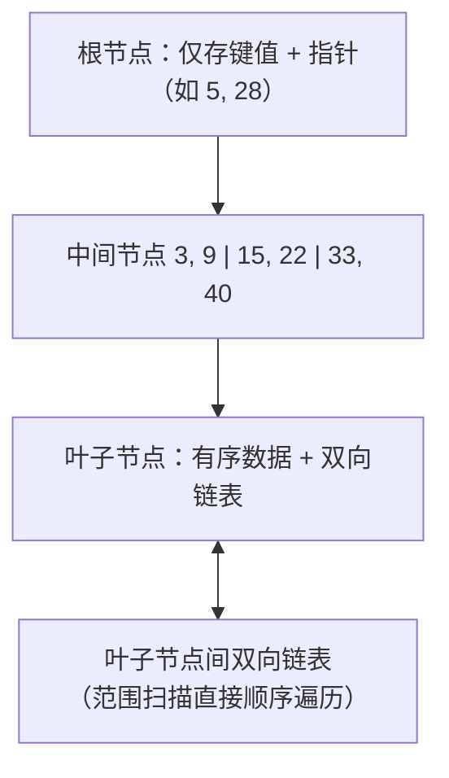
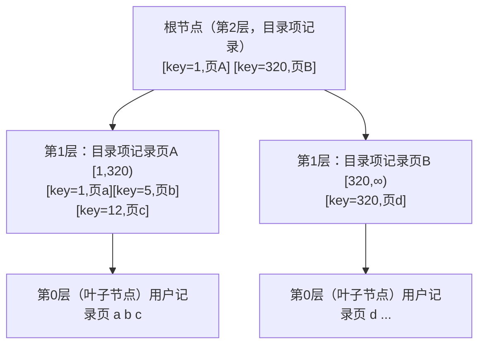
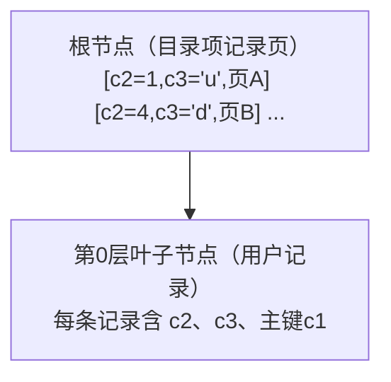
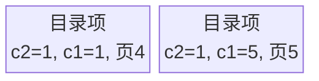
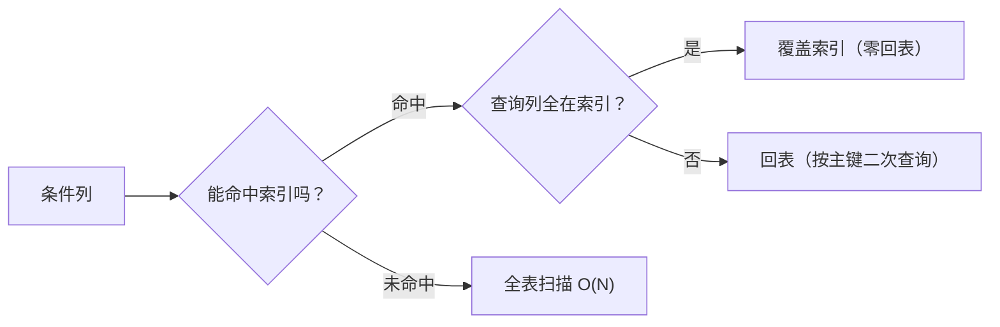

# B+树索引：原理与设计

索引是数据库性能的第一杠杆：**一条 SQL 走不走索引，性能差距可达千倍**。本文分两部分：先讲**原理**——从数据结构选型说起，到 InnoDB 聚簇索引与二级索引的实现，再到 B+ 树的形成与维护细节；再讲**设计**——掌握最左前缀、覆盖索引、索引下推等匹配规则，理解回表代价，才能设计出"小而准"的索引，避免索引失效。

## 第一部分：索引原理

### 索引数据结构选型

#### 从二分查找说起

索引的本质是"有序 + 可快速定位"。二分查找要求数据有序且支持随机访问——数组满足但**插入删除代价 O(N)**，链表插入快但**无法二分**。数据库需要"插入快 + 查找快"的结构，于是有了树。

#### Hash 索引

对索引列计算哈希值（如 CRC32），哈希表定位到槽位：

| 优点 | 缺点 |
|------|------|
| 等值查询 O(1)，极快 | 不支持范围查询（>、<、BETWEEN） |
| | 不支持排序 ORDER BY |
| | 不支持部分列匹配（联合索引必须整键哈希） |
| | 哈希冲突需链表处理，退化风险 |

MySQL 的 **Memory 引擎**支持显式 HASH 索引；**InnoDB 的"自适应哈希索引（AHI）"**是 InnoDB 内部对高频等值访问的热点页自动建立的 Hash 加速（`innodb_adaptive_hash_index`，默认开启），对用户透明。

#### B+Tree 索引（InnoDB 核心）



B+Tree 相比 B-Tree 的关键设计：

1. **非叶子节点只存键值不存数据** → 单节点可容纳更多分支（扇出大），树更矮（3-4 层可支撑千万级数据）；
2. **叶子节点存全量数据且有序连接** → 范围查询（>、BETWEEN）只需定位起点后顺序遍历链表；
3. **所有查询都走根到叶**，路径长度恒定 → 查询时间稳定（没有"有时快有时慢"）。

一个 16KB 数据页约可容纳 1000+ 个键值指针，3 层 B+Tree 可支撑约 10 亿条记录，且每次查询只需 3 次磁盘 IO（根节点常驻内存）。

##### B 树 vs B+ 树

在理解 B+ 树之前，先对比它的前身 B 树。B 树是一种平衡的多路搜索树：每个节点存储多个关键字，非叶子节点同时存储关键字和数据指针，叶子节点在同一层。而 B+ 树是 B 树的改进，两者的核心差异：

| 特性 | B 树 | B+ 树（InnoDB 采用） |
|:---|:---|:---|
| 非叶子节点 | 存储关键字和数据 | 只存储关键字 |
| 叶子节点 | 不包含所有关键字 | 包含所有关键字 |
| 叶子节点连接 | 独立 | 链表连接 |
| 树的高度 | 较高 | 较低（更矮胖） |
| 单点查询 | 可能在非叶子节点命中（更快但不稳定） | 必须到叶子节点（路径恒定、稳定） |
| 范围查询 | 需要中序遍历 | 叶子节点链表顺序访问 |
| 磁盘 I/O | 较多 | 较少 |

B+ 树的四大优势：

1. **查询效率更稳定**：所有查询都到叶子节点，路径长度相同；B 树可能在中途命中，也可能到叶子节点，时间不稳定；
2. **范围查询更高效**：B+ 树找到起点后沿叶子节点链表顺序访问（如 `WHERE id BETWEEN 10 AND 100`），B 树需中序遍历；
3. **磁盘 I/O 更少**：B+ 树非叶子节点不存数据，同样大小的磁盘页可容纳更多关键字，树更矮、I/O 更少；
4. **全表扫描更快**：B+ 树只需遍历叶子节点链表，B 树需遍历整棵树。

**高度计算**（以 MySQL 为参考）：磁盘页 16KB，主键 BIGINT 8 字节 + 指针 6 字节，每个节点约可存储 `16KB / (8+6) ≈ 1170` 个关键字。3 层 B+ 树可存储约 `1170 × 1170 × 1170 ≈ 16 亿` 条记录，查询最多 3 次磁盘 I/O；4 层可支撑千亿级，查询最多 4 次 I/O。这也是为什么千万级数据的索引查询依然很快。注意：上述估算假设叶子页也能存约 1170 条记录（即行宽极小）；按更典型的行宽（每个叶子页存几十行）估算，3 层 B+ 树一般可支撑 2000 万 ~ 2 亿行，真实容量因行大小而异。

### InnoDB的索引方案

回顾前面介绍过的 `InnoDB` 数据页：各数据页可以组成 `双向链表`，每个数据页中的记录按主键值从小到大组成 `单向链表`，每个数据页都会为其中的记录生成 `页目录`，在通过主键查找某条记录时可以在 `页目录` 中用二分法快速定位到对应的槽，再遍历该槽对应分组中的记录即可快速找到指定记录。

页和记录的关系示意如下：


其中 `页a`、`页b`、`页c` ... `页n` 这些页在物理结构上不必相连，只要通过双向链表相关联即可。

#### 没有索引的查找

##### 在一个页中的查找

- **以主键为搜索条件**：可以在 `页目录` 中用二分法快速定位到对应的槽，再遍历该槽对应分组中的记录即可快速找到指定记录。
- **以其他列作为搜索条件**：对非主键列的查找，因为数据页中没有对非主键列建立 `页目录`，无法通过二分法快速定位相应的 `槽`，只能从 `最小记录` 开始依次遍历单链表中的每条记录，对比每条记录是否符合搜索条件。这种查找效率非常低。

##### 在很多页中查找

在没有索引的情况下，不论根据主键列还是其他列的值查找，由于不能快速定位记录所在的页，只能从第一个页沿双向链表一直往下找，在每个页中按前面的查找方式去查找指定记录。因为要遍历所有数据页，这种方式非常耗时。

#### 一个简单的索引方案

在根据某个搜索条件查找记录时，为什么需要遍历所有的数据页？因为各个页中的记录没有规律，不知道搜索条件匹配哪些页中的记录，所以**不得不**依次遍历所有数据页。如果想快速定位需要查找的记录在哪些数据页，可以参考为根据主键值快速定位记录在页中的位置而设立的 `页目录`，为快速定位记录所在的数据页建立另一个目录。建立这个目录必须完成下面这些事：

- 下一个数据页中用户记录的主键值必须大于上一个页中用户记录的主键值。在对页中的记录进行增删改操作时，必须通过一些诸如记录移动的操作，始终保证这个状态成立。这个过程也称为 `页分裂`。
- 给所有的页建立一个目录项，每个页对应一个目录项，每个目录项包括两部分：页的用户记录中最小的主键值（`key`）和页号（`page_no`）。只需把几个目录项在物理存储器上连续存储（比如放到一个数组里），就能实现根据主键值快速查找某条记录。

这个 `目录` 有一个别名，称为 `索引`。

#### InnoDB中的索引方案

上面称为简易索引方案，是因为为了在根据主键值查找时用二分法快速定位具体目录项，假设所有目录项都可以在物理存储器上连续存储。但这样做有几个问题：

- `InnoDB` 使用页作为管理存储空间的基本单位，最多能保证 `16KB` 的连续存储空间。随着表中记录数量增多，需要非常大的连续存储空间才能放下所有目录项。
- 时常会对记录进行增删，如果某个页的记录被删除，对应的目录项也就没有存在的必要，需要把后面的目录项都向前移动。这种牵一发而动全身的设计不好。

所以设计者需要一种能灵活管理所有 `目录项` 的方式。他们发现这些 `目录项` 其实长得跟用户记录差不多，只不过 `目录项` 中的两个列是 `主键` 和 `页号`，于是**复用了之前存储用户记录的数据页来存储目录项**。为和用户记录区分，把表示目录项的记录称为 `目录项记录`。记录头信息里的 `record_type` 属性用于区分：

- `0`：普通的用户记录
- `1`：目录项记录
- `2`：最小记录
- `3`：最大记录

目录项记录和普通用户记录的不同点：

- `目录项记录` 的 `record_type` 值是 1，普通用户记录是 0；
- `目录项记录` 只有主键值和页的编号两个列，普通用户记录的列由用户自己定义；
- 记录头信息中的 `min_rec_mask` 属性：只有存储 `目录项记录` 的页中主键值最小的 `目录项记录` 的 `min_rec_mask` 值为 `1`。

除了上述几点，这两者没差别：它们用一样的数据页，页的组成结构一样，都会为主键值生成 `Page Directory`，从而在按主键值查找时可用二分法加快查询。

随着表中数据增多，存储目录项记录的页也不止一个，就需要为这些存储目录项记录的页再生成一个更高级的目录，就像多级目录一样。随着记录增加，这个目录的层级会继续增加。简化后可用下图描述：



这像不像一棵倒过来的 `树`？上头是树根，下头是树叶！这是一种组织数据的形式，或者说一种数据结构，名称是 `B+` 树。

实际用户记录都存放在 `B+` 树最底层的节点上，这些节点也称为 `叶子节点` 或 `叶节点`；其余存放 `目录项` 的节点称为 `非叶子节点` 或 `内节点`，其中 `B+` 树最上边的节点称为 `根节点`。一个 `B+` 树的节点可以分很多层，最下边存放用户记录的那层为第 `0` 层，之后依次往上加。一般情况下，用到的 `B+` 树不会超过 4 层。通过主键值查找某条记录最多只需做 4 个页面内的查找，又因为在每个页面内有 `Page Directory`，页面内也可以通过二分法快速定位记录，非常高效。

##### 聚簇索引

上面介绍的 `B+` 树本身就是一个目录，或者说本身就是一个索引。它有两个特点：

1. 使用记录主键值的大小进行记录和页的排序，包括三方面含义：页内的记录按主键大小顺序排成单向链表；各存放用户记录的页根据页中用户记录的主键大小顺序排成双向链表；存放目录项记录的页分不同层次，同一层次中的页根据页中目录项记录的主键大小顺序排成双向链表。
2. `B+` 树的叶子节点存储的是完整的用户记录。

把具有这两种特性的 `B+` 树称为 `聚簇索引`，所有完整的用户记录都存放在这个 `聚簇索引` 的叶子节点处。这种 `聚簇索引` 不需要在 `MySQL` 语句中显式使用 `INDEX` 语句创建，`InnoDB` 存储引擎会自动创建。在 `InnoDB` 存储引擎中，`聚簇索引` 就是数据的存储方式（所有用户记录都存储在 `叶子节点`），即**索引即数据，数据即索引**。InnoDB 是**索引组织表（IOT）**：数据按主键顺序物理组织。表只有一个聚簇索引：显式主键 → 第一个非空唯一索引 → 隐藏 rowid。

聚簇索引特点：主键查询快（一次定位即得数据）；但**主键值无序插入会引发页分裂**（页分裂是性能杀手）。

##### 二级索引

前面的 `聚簇索引` 只能在搜索条件是主键值时发挥作用，因为 `B+` 树中的数据都按主键排序。如果想以别的列作为搜索条件，可以多建几棵 `B+` 树，不同的 `B+` 树用不同排序规则。以 `c2` 列的大小作为数据页、页中记录的排序规则，再建一棵 `B+` 树。

这个 `B+` 树与聚簇索引有几处不同：

- 使用记录 `c2` 列的大小进行记录和页的排序；
- `B+` 树的叶子节点存储的并不是完整的用户记录，而只是 `c2列+主键` 这两个列的值；
- 目录项记录中不再是 `主键+页号` 的搭配，而变成了 `c2列+页号` 的搭配。

二级索引叶子节点存 **索引列 + 主键值**（不是数据行指针——为了主键变更时无需更新二级索引）。通过二级索引查询数据需要**回表**：先查二级索引得主键，再按主键查聚簇索引。8.0 中主键为二级索引的"行指针"，因此**主键越短，二级索引越小**（每棵二级索引都冗余一份主键）。

```text
二级索引 idx_name: [name, 主键id, ...]
查询 WHERE name='张三'：
  ① 走 idx_name 找到主键 id=1024
  ② 回表：按 id=1024 查聚簇索引，取完整行
```

如果把完整用户记录放到二级索引 `叶子节点` 可以不用 `回表`，但太占地方了——相当于每建立一棵 `B+` 树都要把所有用户记录再拷贝一遍，太浪费存储空间。因为这种按 `非主键列` 建立的 `B+` 树需要一次 `回表` 操作才能定位完整的用户记录，所以这种 `B+` 树也称为 `二级索引`（`secondary index`），或 `辅助索引`。

###### 联合索引

也可以同时以多个列的大小作为排序规则，即同时为多个列建立索引。例如想让 `B+` 树按 `c2` 和 `c3` 列的大小排序，包含两层含义：先把各记录和页按 `c2` 列排序；在记录 `c2` 列相同的情况下，用 `c3` 列排序。



需要注意：以 `c2` 和 `c3` 列大小为排序规则建立的 `B+` 树称为 `联合索引`，它的含义与分别为 `c2` 和 `c3` 列建立索引是不同的：建立 `联合索引` 只会建立 1 棵 `B+` 树；为 `c2` 和 `c3` 列分别建立索引，会分别建立 2 棵 `B+` 树。

#### InnoDB的B+树索引的注意事项

##### 根页面万年不动窝

`B+` 树的形成过程是这样的：每当为某个表创建一个 `B+` 树索引时，都会为这个索引创建一个 `根节点` 页面。最开始表中没有数据时，每个 `B+` 树索引对应的 `根节点` 中既没有用户记录，也没有目录项记录。随后向表中插入用户记录时，先把用户记录存储到这个 `根节点` 中。当 `根节点` 中的可用空间用完时继续插入记录，此时会把 `根节点` 中的所有记录复制到一个新分配的页（如 `页a`），然后对这个新页进行 `页分裂`，得到另一个新页（如 `页b`）。这时新插入的记录根据键值大小被分配到 `页a` 或 `页b`，而 `根节点` 便升级为存储目录项记录的页。

**一个 B+ 树索引的根节点自诞生之日起便不会再移动**。只要对某个表建立一个索引，它的 `根节点` 页号就会被记录到某个地方，凡是 `InnoDB` 存储引擎需要用到这个索引时，都从那个固定地方取出 `根节点` 的页号，从而访问这个索引。

##### 内节点中目录项记录的唯一性

`B+` 树索引的内节点中目录项记录的内容是 `索引列 + 页号` 的搭配，但这个搭配对二级索引来说有点不严谨。为了让新插入记录能找到自己在哪个页，需要保证 `B+` 树同一层内节点的目录项记录除 `页号` 字段外是唯一的。所以对二级索引的内节点的目录项记录，内容实际上由三个部分构成：索引列的值、主键值、页号。也就是把 `主键值` 也添加到二级索引内节点的目录项记录中。



##### 一个页面最少存储2条记录

一个 `B+` 树本质上是一个大的多层级目录，每经过一个目录都会过滤掉许多无效子目录，直到最后访问存储真实数据的目录。那如果一个大的目录中只存放一个子目录是什么效果？目录层级会非常非常多，而且最后存放真实数据的目录只能存放一条记录。所以 `InnoDB` 的一个数据页至少可以存放两条记录。

#### MyISAM中的索引方案简单介绍

`InnoDB` 中索引即数据，即聚簇索引那棵 `B+` 树的叶子节点已经包含所有完整用户记录；而 `MyISAM` 的索引方案虽然也使用树形结构，但将索引和数据分开存储：

- 将表中的记录按插入顺序单独存储在一个文件中，称为 `数据文件`。这个文件不划分为若干数据页，有多少记录就往这个文件塞多少记录。可以通过行号快速访问一条记录。
- 使用 `MyISAM` 存储引擎的表会把索引信息另外存储到一个称为 `索引文件` 的文件中。`MyISAM` 会单独为表的主键创建一个索引，只不过在索引的叶子节点中存储的不是完整用户记录，而是 `主键值 + 行号` 的组合。也就是先通过索引找到对应行号，再通过行号去找对应记录。这意味着 `MyISAM` 中建立的索引相当于全部都是 `二级索引`。

所以 `InnoDB` 中"索引即数据、数据即索引"，而 `MyISAM` 中"索引是索引、数据是数据"。

#### MySQL中创建和删除索引的语句

`InnoDB` 和 `MyISAM` 会**自动**为主键或声明为 `UNIQUE` 的列自动建立 `B+` 树索引，但如果想为其他列建立索引，需要显式指明。每建立一个索引都会建立一棵 `B+` 树，每插入一条记录都要维护各个记录、数据页的排序关系，这很费性能和存储空间。

可以在创建表时指定需要建立索引的单个列，或建立联合索引的多个列：

```sql
CREATE TABLE 表名 (
    各种列的信息 ··· ,
    [KEY|INDEX] 索引名 (需要被索引的单个列或多个列)
)
```

其中 `KEY` 和 `INDEX` 是同义词，任选一个。也可以在修改表结构时添加索引：

```sql
ALTER TABLE 表名 ADD [INDEX|KEY] 索引名 (需要被索引的单个列或多个列);
```

也可以在修改表结构时删除索引：

```sql
ALTER TABLE 表名 DROP [INDEX|KEY] 索引名;
```

## 第二部分：索引设计

理解了 B+ 树的数据结构与聚簇/二级索引原理，本节聚焦**怎么用、怎么设计**：掌握最左前缀、覆盖索引、索引下推等匹配规则，理解回表代价，才能设计出"小而准"的索引，避免索引失效。

### 索引的代价

`B+` 树索引虽然高效，但也不能随意建立。使用索引在空间和时间上都会产生开销：

- **空间上的代价**：每建立一个索引都要为它建立一棵 `B+` 树，每一棵 `B+` 树的每一个节点都是一个数据页，一个页默认占用 `16KB` 的存储空间。一棵很大的 `B+` 树会占用很大的存储空间。

- **时间上的代价**：每次对表中的数据进行增、删、改操作时，都需要修改各个 `B+` 树索引。`B+` 树每层节点都按照索引列的值从小到大的顺序排序组成双向链表，增、删、改操作可能破坏节点和记录的排序，存储引擎需要额外的时间进行记录移位、页面分裂、页面回收等操作来维护节点和记录的排序。如果建立了很多索引，每个索引对应的 `B+` 树都要进行相关维护操作，会给性能带来明显损耗。

所以，一个表上索引建得越多，占用的存储空间越多，增删改记录时的性能越差。

### B+树索引适用的条件

为了便于说明，先创建一张存储人员基本信息的表：

```sql
CREATE TABLE person_info(
    id INT NOT NULL auto_increment,
    name VARCHAR(100) NOT NULL,
    birthday DATE NOT NULL,
    phone_number CHAR(11) NOT NULL,
    country varchar(100) NOT NULL,
    PRIMARY KEY (id),
    KEY idx_name_birthday_phone_number (name, birthday, phone_number)
);
```

`person_info` 表有两个索引：聚簇索引（主键 `id`）和联合索引 `idx_name_birthday_phone_number`（`name`、`birthday`、`phone_number`）。该联合索引对应的 `B+` 树中页面和记录的排序方式是：先按照 `name` 列的值进行排序；如果 `name` 列的值相同，则按照 `birthday` 列的值进行排序；如果 `birthday` 列的值也相同，则按照 `phone_number` 的值排序。

这个排序方式**十分重要**，因为**只要页面和记录是排好序的，就可以通过二分法快速定位查找**。下面基于这个排序规律介绍各种使用场景。

#### 全值匹配

如果搜索条件中的列和索引列一致，这种情况称为全值匹配。例如：

```sql
SELECT * FROM person_info WHERE name = 'Ashburn' AND birthday = '1990-09-27' AND phone_number = '15123983239';
```

建立的 `idx_name_birthday_phone_number` 索引包含的 3 个列在查询语句中都出现了，联合索引中的三个列都可能被用到。

有人会问：`WHERE` 子句中几个搜索条件的顺序对查询结果有影响吗？答案是**没有影响**。`MySQL` 的查询优化器会分析这些搜索条件，并按可以使用的索引中列的顺序决定先使用哪个搜索条件、后使用哪个搜索条件。

#### 匹配左边的列

搜索语句中可以不用包含全部联合索引中的列，只包含左边的列即可。例如：

```sql
SELECT * FROM person_info WHERE name = 'Ashburn';
```

**如果想使用联合索引中尽可能多的列，搜索条件中的各个列必须是联合索引中从最左边连续的列**。例如联合索引 `idx_name_birthday_phone_number` 中列的定义顺序是 `name`、`birthday`、`phone_number`。如果搜索条件中只有 `name` 和 `phone_number`，而没有中间的 `birthday`，例如：

```sql
SELECT * FROM person_info WHERE name = 'Ashburn' AND phone_number = '15123983239';
```

这样只能用到 `name` 列的索引，`birthday` 和 `phone_number` 的索引用不上。

#### 匹配列前缀

为某个列建立索引，意思其实是在对应的 `B+` 树的记录中使用该列的值排序。一个排好序的字符串列有这样的特点：先按照字符串的第一个字符排序；如果第一个字符相同，再按照第二个字符排序；如果第二个字符也相同，继续按照第三个字符排序，依此类推。也就是说，这些字符串的前 n 个字符（即前缀）都是排好序的，所以对字符串类型的索引列，只匹配它的前缀也可以快速定位记录。例如想查询名字以 `'As'` 开头的记录：

```sql
SELECT * FROM person_info WHERE name LIKE 'As%';
```

但需要注意，如果只给出后缀或中间的某个字符串，例如 `name LIKE '%As%'`，`MySQL` 无法快速定位记录位置，只能全表扫描。

有时会有匹配字符串后缀的需求。例如某个表的 `url` 列存储了许多 URL，想查询以 `com` 为后缀的网址，可以写 `WHERE url LIKE '%com'`，但这样无法使用 `url` 列的索引。为了在查询时用到索引而不全表扫描，可以把后缀查询改写成前缀查询，但需要把表中的数据全部逆序存储。例如把 `url` 列数据倒序存储，这样再查找以 `com` 为后缀的网址时，搜索条件可以写成 `WHERE url LIKE 'moc%'`，从而用到索引。

#### 匹配范围值

`B+` 树中的所有记录都按照索引列的值从小到大的顺序排好序，这极大方便了查找索引列值在某个范围内的记录。例如：

```sql
SELECT * FROM person_info WHERE name > 'Asa' AND name < 'Barlow';
```

由于 `B+` 树中的数据页和记录先按 `name` 列排序，可以找到 `name` 值为 `Asa` 和 `Barlow` 的记录，它们之间的记录由链表连接，可以很容易取出来，然后回表查找完整记录。

不过，使用联合索引进行范围查找时需要注意：**如果对多个列同时进行范围查找，只有对索引最左边的列进行范围查找时才能用到 `B+` 树索引**。例如：

```sql
SELECT * FROM person_info WHERE name > 'Asa' AND name < 'Barlow' AND birthday > '1980-01-01';
```

只能用到 `name` 列的部分，`birthday` 列的部分用不上。因为只有 `name` 值相同的情况下才能用 `birthday` 列的值排序，而这个查询中**通过 `name` 进行范围查找的记录可能并不是按照 `birthday` 列排序的**。

#### 精确匹配某一列并范围匹配另外一列

对于同一个联合索引，虽然对多个列都进行范围查找时只能用到最左边的索引列，但如果左边的列是精确查找，右边的列可以进行范围查找。例如：

```sql
SELECT * FROM person_info WHERE name = 'Ashburn' AND birthday > '1980-01-01' AND birthday < '2000-12-31' AND phone_number > '15100000000';
```

这个查询的条件分为 3 个部分：`name = 'Ashburn'` 对 `name` 列进行精确查找，可以使用 `B+` 树索引；`birthday > ... AND birthday < ...` 由于 `name` 列是精确查找，得到的记录的 `name` 值都相同，它们会再按照 `birthday` 的值排序，所以对 `birthday` 列进行范围查找可以用到 `B+` 树索引；`phone_number > ...` 通过 `birthday` 的范围查找得到的记录的 `birthday` 值可能不同，这个条件无法再利用 `B+` 树索引。

#### 用于排序

写查询语句时经常需要对查询出来的记录通过 `ORDER BY` 子句按某种规则排序。一般情况下，只能把记录加载到内存中，用排序算法在内存中排序；有时查询结果集太大，可能还要借助磁盘空间。在 `MySQL` 中，把这种在内存中或磁盘上进行排序的方式统称为文件排序（英文名 `filesort`）。一旦涉及文件，这些排序操作往往很慢。

但如果 `ORDER BY` 子句用到索引列，就可能省去在内存或文件中排序的步骤。例如：

```sql
SELECT * FROM person_info ORDER BY name, birthday, phone_number LIMIT 10;
```

这个查询的结果集需要先按照 `name` 值排序；如果记录的 `name` 值相同，再按照 `birthday` 排序；如果 `birthday` 的值相同，再按照 `phone_number` 排序。这个 `B+` 树索引本身就是按照上述规则排好序的，所以可以直接从索引中提取数据。

##### 使用联合索引进行排序注意事项

- `ORDER BY` 子句后的列的顺序也必须按照索引列的顺序给出。如果给出 `ORDER BY phone_number, birthday, name` 的顺序，就用不了 `B+` 树索引。
- 当联合索引左边列的值为常量，也可以使用后边的列进行排序，例如 `WHERE name = 'A' ORDER BY birthday, phone_number`。

##### 不可以使用索引进行排序的几种情况

1. **ASC、DESC 混用**：对于使用联合索引进行排序的场景，要求各个排序列的排序顺序一致，即要么都是 `ASC`，要么都是 `DESC`。如 `ORDER BY name, birthday DESC` 不能高效使用索引。
2. **WHERE 子句中出现非排序使用到的索引列**：如 `WHERE country = 'China' ORDER BY name`，只能先把符合搜索条件的记录提取出来再排序，使用不到索引。
3. **排序列包含非同一个索引的列**：如 `ORDER BY name, country`，`name` 和 `country` 不属于一个联合索引中的列，无法使用索引排序。
4. **排序列使用了复杂的表达式**：要想使用索引进行排序操作，必须保证索引列是以单独列的形式出现，而不是修饰过的形式。如 `ORDER BY UPPER(name)` 无法使用索引排序。

#### 用于分组

有时为了统计表中的信息，会把表中的记录按照某些列分组。如果有了索引，分组顺序又和 `B+` 树索引列的顺序一致，而 `B+` 树索引又是按索引列排好序的，所以可以直接使用 `B+` 树索引进行分组。分组列的顺序也需要和索引列的顺序一致。

### 索引匹配规则与失效场景

#### 最左前缀匹配

联合索引 `(a, b, c)` 的匹配规则：

| 查询条件 | 是否走索引 | 用到的列 |
|----------|:----------:|---------|
| `WHERE a=1` | ✅ | a |
| `WHERE a=1 AND b=2` | ✅ | a, b |
| `WHERE a=1 AND b=2 AND c=3` | ✅ | a, b, c |
| `WHERE b=2` | ❌（8.0 前）/ 索引跳跃扫描 | 无法用最左前缀 |
| `WHERE a=1 AND c=3` | ⚠️ | a（c 被跳过，无法用索引过滤） |
| `WHERE a>1 AND b=2` | ⚠️ | a（范围后失效） |

**排序也遵循最左前缀**：`ORDER BY a, b` 可以用索引避免 filesort；`ORDER BY b, a` 不行。

> **8.0 的索引跳跃扫描（Skip Scan）**：`WHERE b=2` 在 `(a,b)` 联合索引下，8.0.13+ 优化器可自动"跳过 a 的每个值"进行扫描（`SKIP SCAN`），但仅在 a 的基数小时有效，不能作为常规依赖。

#### 覆盖索引（Covering Index）

若查询所需列**全部在索引中**，则无需回表——直接从索引树取数据：

```sql
-- idx(a, b)：查询只取 a、b 两列
SELECT a, b FROM t WHERE a = 1;   -- ✅ 覆盖索引，不回表
SELECT * FROM t WHERE a = 1;      -- ❌ 需要回表取其他列
```

**设计启示**：高频查询的"查询列"可刻意纳入联合索引，用空间换回表次数。

#### 索引下推（ICP，Index Condition Pushdown）

```sql
-- 联合索引 (zipcode, lastname)，查询：
SELECT * FROM people WHERE zipcode='95054' AND lastname LIKE '%etrunko%';
```

5.6 之前：先按 zipcode 从索引取主键 → 回表 → 再过滤 lastname。5.6+ 的 **ICP**：在索引遍历时就过滤 lastname 条件，**减少回表次数**。EXPLAIN 的 `Using index condition` 即 ICP 生效。

#### 回表代价与优化顺序



**需要回表的记录越多，使用二级索引的性能就越低**，甚至让某些查询宁愿使用全表扫描也不使用 `二级索引`。一般情况下，限制查询获取较少的记录数会让优化器更倾向于选择 `二级索引 + 回表` 的方式查询。为彻底避免 `回表` 操作带来的性能损耗，建议**在查询列表里只包含索引列**，这种只需要用到索引的查询方式称为 `索引覆盖`。

### 索引设计实战

#### Cardinality（基数）

- Cardinality = 索引列去重后的**不同值数量**；`Cardinality/n` 越接近 1，选择性越好；
- 低基数列（性别、状态）**不适合建单列索引**：走索引还要回表，不如全表扫描；
- 查看：`SHOW INDEX FROM t;` 或 `information_schema.statistics`（8.0 统计信息默认持久化在 `mysql.innodb_index_stats`，`innodb_stats_persistent=ON`）。

#### 联合索引设计三步法

1. **等值条件列放最前**（过滤性最强、且范围列之后失效的坑最小）；
2. **范围条件列放中间偏后**（`>`/`<`/`BETWEEN` 之后的条件无法用索引）；
3. **排序列放最后**（避免 filesort）。

```sql
-- 业务：按 user_id 查订单，按 created_at 排序，分页
-- ❌ KEY (user_id, created_at, status) 或 KEY (created_at, user_id)
-- ✅ 最佳：KEY (user_id, created_at)  —— 等值在前，排序在后，天然覆盖
SELECT * FROM user_order WHERE user_id=1001 ORDER BY created_at DESC LIMIT 20;
```

#### 索引创建规范

- 单表索引数控制：一般 ≤ 5 个（每个索引都是写放大 + 存储开销）；
- 冗余检测：`(a,b)` 已存在时，`(a)` 单列索引冗余（最左前缀已覆盖）；
- 前缀索引：超长字符串（如 url）用 `KEY idx (url(64))` 节省空间，但**无法用于 ORDER BY 与覆盖**；
- 大表建索引：`ALTER TABLE ... ADD INDEX ... ALGORITHM=INPLACE`（在线 DDL，5.6+ 即支持，不阻塞 DML），但建议业务低峰执行；
- 删除无用索引：`performance_schema.schema_unused_indexes`（8.0 记录从未被使用的索引）。

#### 其他设计注意事项

- **只对基数大的列建立索引**，为基数太小的列建立索引效果可能不好。
- **索引列的类型尽量小**：数据类型越小，查询时进行的比较操作越快，索引占用的存储空间越少，一个数据页内可以放下更多记录。对主键来说更加适用，因为所有二级索引的节点处都会存储一份记录的主键值。
- **索引字符串值的前缀**：只对字符串的前几个字符进行索引，既节约空间，又减少字符串比较时间。但使用索引列前缀的方式无法支持使用索引排序。
- **让索引列在比较表达式中单独出现**：如果索引列在比较表达式中不是以单独列的形式出现，而是以某个表达式或函数调用形式出现（如 `my_col * 2 < 4`），是使用不到索引的。改写为 `my_col < 4/2` 才能用索引。
- **主键插入顺序**：如果插入的记录主键值忽大忽小，会导致页面分裂和记录移位，产生性能损耗。建议**让主键具有 `AUTO_INCREMENT` 属性**，让存储引擎自己为表生成主键。
- **冗余和重复索引**：避免创建冗余索引（如已有 `(a,b)` 再建 `(a)`）和重复索引（同一列既是主键又建唯一索引/普通索引）。

### MySQL 8.0 索引新特性

| 特性 | 语法 | 价值 |
|------|------|------|
| **降序索引** | `KEY idx (a ASC, b DESC)` | 8.0 前反向扫描 b；现在可正向使用索引避免 filesort |
| **函数索引**（表达式索引） | `KEY idx ((LOWER(email)))` | 8.0.13+，`WHERE LOWER(email)=...` 也能走索引 |
| **不可见索引** | `CREATE INDEX ... INVISIBLE` | 先建后"试运行"：`optimizer_switch` 开启 `use_invisible_indexes` 测试，确认无副作用再 VISIBLE |
| **多值索引** | `CAST(json_col AS CHAR ARRAY)` | 8.0.17+，JSON 数组字段建索引（配合 `MEMBER OF`、`JSON_CONTAINS` 等查询） |
| **索引跳跃扫描** | 自动 | 8.0.13+，部分场景跳过最左列 |

```sql
-- 函数索引实战：邮箱登录查询
ALTER TABLE user ADD INDEX idx_email_lower ((LOWER(email)));
SELECT * FROM user WHERE LOWER(email) = 'admin@example.com';  -- 走 idx_email_lower
```

### 常见误区

1. **索引越多越好**：每个索引都拖慢 INSERT/UPDATE（写放大），且占内存；
2. **在低基数列建单列索引**：性别/状态列索引等于没建；
3. **对索引列使用函数/运算**：`WHERE DATE(created_at)='2026-01-01'` 无法走索引（用范围条件 `created_at >= ... AND < ...` 或函数索引）；
4. **隐式类型转换**：`WHERE phone = 13800138000`（字符串列 vs 数字）导致索引失效，必须 `WHERE phone = '13800138000'`；
5. **`LIKE '%xxx'` 前导通配符**：无法用索引（`LIKE 'xxx%'` 可以）；
6. **`!=`/`NOT IN`/`OR` 的索引失效**：优化器可能全表扫描，用 `UNION ALL` 或改等值。

## 小结

1. 索引的本质是"有序 + 可快速定位"，InnoDB 一律采用 B+Tree（Hash 只适合 Memory 引擎等值场景），3 层树支撑亿级数据。
2. 对 `InnoDB` 存储引擎来说，在单个页中查找某条记录分两种情况：以主键为搜索条件可以使用 `Page Directory` 通过二分法快速定位；以其他列为搜索条件需要遍历单链表。
3. 没有索引时，不论以主键还是其他列作为搜索条件，只能沿页的双链表从左到右依次遍历各个页。
4. `InnoDB` 存储引擎的索引是一棵 `B+` 树，完整的用户记录都存储在 `B+` 树第 `0` 层的叶子节点，其他层次节点存储 `目录项记录`。`InnoDB` 的索引分两大类：
   - 聚簇索引：以主键值大小为页和记录的排序规则，叶子节点处存储的记录包含表中所有列；
   - 二级索引：以自定义列大小为页和记录的排序规则，叶子节点处存储的记录内容是 `列 + 主键`，需回表取整行。
5. `MyISAM` 存储引擎的数据和索引分开存储，这种存储引擎的索引全部都是 `二级索引`，在叶子节点处存储的是 `列 + 页号`。
6. 设计层面：最左前缀 + 覆盖索引 + 索引下推，是 EXPLAIN 优化的三大抓手；等值列在前、范围列居中、排序列最后，控制索引数量与冗余；8.0 的降序/函数/不可见/多值索引为历史"不可能走索引"的 SQL 提供了新解法。
