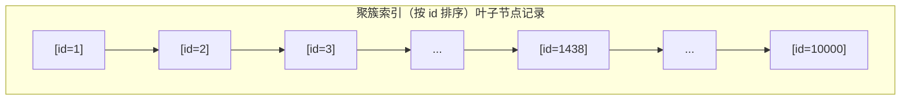
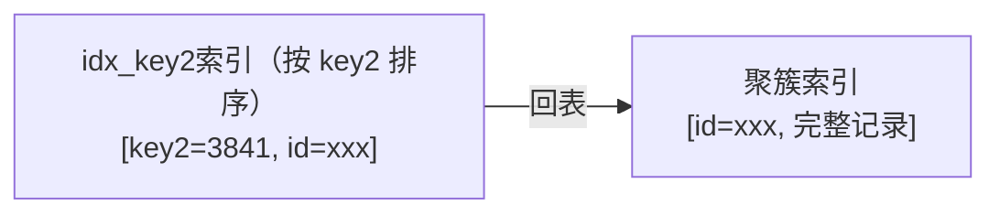
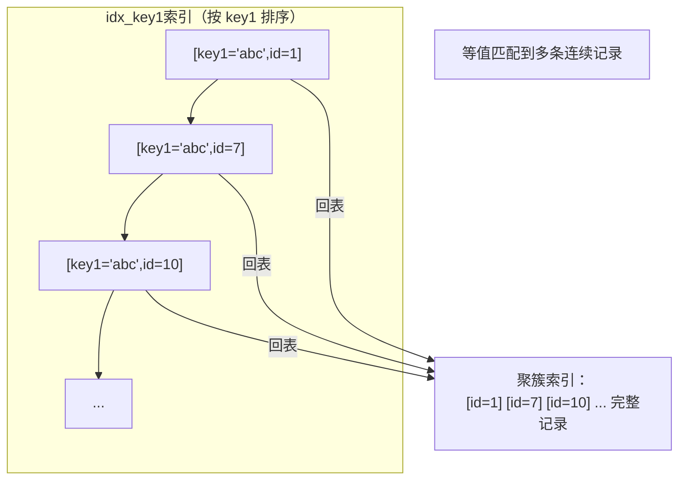
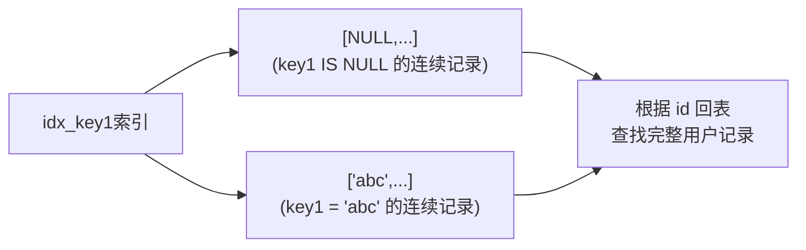

# 单表访问方法

对于 `MySQL` 使用者来说，`MySQL` 只是一个软件，平时用得最多的是查询功能。当 DBA 丢来一些慢查询语句让优化时，如果连查询是怎么执行的都不清楚，就无从优化。前面提到，`MySQL Server` 有一个称为 `查询优化器` 的模块，一条查询语句进行语法解析之后会被交给查询优化器优化，优化的结果就是生成一个 `执行计划`。执行计划表明应该使用哪些索引查询、表之间的连接顺序是什么，最后会按照执行计划中的步骤调用存储引擎提供的方法真正执行查询，并把查询结果返回给用户。

查询优化这个主题比较大，先学习 `MySQL` 怎么执行单表查询（即 `FROM` 子句后边只有一个表的最简单查询）。学习本章前需要先掌握记录结构、数据页结构以及索引的知识。

为了便于说明，先创建一张表：

```sql
CREATE TABLE single_table (
    id INT NOT NULL AUTO_INCREMENT,
    key1 VARCHAR(100),
    key2 INT,
    key3 VARCHAR(100),
    key_part1 VARCHAR(100),
    key_part2 VARCHAR(100),
    key_part3 VARCHAR(100),
    common_field VARCHAR(100),
    PRIMARY KEY (id),
    KEY idx_key1 (key1),
    UNIQUE KEY idx_key2 (key2),
    KEY idx_key3 (key3),
    KEY idx_key_part(key_part1, key_part2, key_part3)
) Engine=InnoDB CHARSET=utf8;
```

为 `single_table` 表建立了 1 个聚簇索引和 4 个二级索引：

- 为 `id` 列建立的聚簇索引；
- 为 `key1` 列建立的 `idx_key1` 二级索引；
- 为 `key2` 列建立的 `idx_key2` 二级索引，该索引是唯一二级索引；
- 为 `key3` 列建立的 `idx_key3` 二级索引；
- 为 `key_part1`、`key_part2`、`key_part3` 列建立的 `idx_key_part` 二级索引，这也是一个联合索引。

需要为这个表插入 10000 行记录，除 `id` 列外其余列插入随机值即可（`id` 列是自增主键列，不需要手动插入）。

## 访问方法（access method）的概念

用地图软件搜索某地到某地的路线时，地图软件会给出多种路线供选择。回到 `MySQL` 中，平时所写的查询语句本质上是一种声明式的语法，只告诉 `MySQL` 要获取的数据符合哪些规则，至于 `MySQL` 背地里怎么把查询结果搞出来，那是 `MySQL` 自己的事。对于单个表的查询来说，查询的执行方式大致分为两种：

- 使用全表扫描进行查询

  这种执行方式很好理解，就是把表的每一行记录都扫一遍，把符合搜索条件的记录加入结果集。不管什么查询都可以用这种方式执行，这是最笨的执行方式。

- 使用索引进行查询

  直接使用全表扫描要遍历很多记录，代价可能太大。如果查询语句中的搜索条件可以使用某个索引，直接使用索引来执行查询可能加快查询执行时间。使用索引执行查询的方式五花八门，又细分为许多种类：
  - 针对主键或唯一二级索引的等值查询；
  - 针对普通二级索引的等值查询；
  - 针对索引列的范围查询；
  - 直接扫描整个索引。

设计者把 `MySQL` 执行查询语句的方式称为 `访问方法` 或 `访问类型`。同一个查询语句可能可以使用多种不同的访问方法来执行，虽然最后查询结果一样，但执行时间可能差得很远。下面详细介绍各种 `访问方法`。

## const

有时可以通过主键列定位一条记录，例如这个查询：

```sql
SELECT * FROM single_table WHERE id = 1438;
```

`MySQL` 会直接利用主键值在聚簇索引中定位对应的用户记录。把聚簇索引对应的复杂 `B+` 树结构简化（忽略 `页` 的结构，直接把所有叶子节点的记录放在一起展示，记录中只展示关心的索引列，对 `single_table` 表的聚簇索引来说展示的是 `id` 列）：



重点是：`B+` 树叶子节点中的记录按照索引列排序，聚簇索引对应的 `B+` 树叶子节点中的记录按 `id` 列排序。`B+` 树是一个矮胖结构，所以根据主键值定位一条记录非常快。类似的，根据唯一二级索引列定位一条记录也很快，例如：

```sql
SELECT * FROM single_table WHERE key2 = 3841;
```

这个查询的执行过程分两步：第一步先从 `idx_key2` 对应的 `B+` 树索引中根据 `key2` 列与常数的等值比较条件定位到一条二级索引记录，然后根据该记录的 `id` 值到聚簇索引中获取完整用户记录。



设计者认为，通过主键或唯一二级索引列与常数的等值比较定位一条记录非常快，所以把这种访问方法定义为 `const`，意思是常数级别的，代价可以忽略不计。不过 `const` 访问方法只能在主键列或唯一二级索引列与一个常数进行等值比较时才有效。如果主键或唯一二级索引由多个列构成，索引中的每一个列都需要与常数进行等值比较，`const` 访问方法才有效（因为只有该索引中全部列都采用等值比较，才可以定位唯一一条记录）。

对于唯一二级索引，查询该列为 `NULL` 值的情况比较特殊：

```sql
SELECT * FROM single_table WHERE key2 IS NULL;
```

因为唯一二级索引列并不限制 `NULL` 值的数量，上述语句可能访问到多条记录，所以不可以使用 `const` 访问方法执行。

## ref

有时对某个普通二级索引列与常数进行等值比较：

```sql
SELECT * FROM single_table WHERE key1 = 'abc';
```

对这个查询，可以选择全表扫描逐一对比搜索条件，也可以先使用二级索引找到对应记录的 `id` 值，然后回表到聚簇索引查找完整用户记录。由于普通二级索引不限制索引列值的唯一性，可能找到多条对应记录，所以使用二级索引执行查询的代价取决于等值匹配到的二级索引记录条数。如果匹配的记录较少，回表的代价比较低，`MySQL` 可能选择使用索引而不是全表扫描。设计者把这种搜索条件为"二级索引列与常数等值比较、采用二级索引执行查询"的访问方法称为 `ref`。



对于普通二级索引，通过索引列进行等值比较后可能匹配到多条连续的记录，而不像主键或唯一二级索引那样最多只能匹配 1 条记录，所以 `ref` 访问方法比 `const` 稍差，但在二级索引等值比较匹配的记录数较少时效率仍很高（如果匹配的二级索引记录太多，回表成本太大）。需要注意两种情况：

- 二级索引列值为 `NULL` 的情况

  不论是普通二级索引还是唯一二级索引，索引列对包含 `NULL` 值的数量不限制，所以采用 `key IS NULL` 这种形式的搜索条件最多只能使用 `ref` 访问方法，而不是 `const`。

- 对于某个包含多个索引列的二级索引，只要最左边的连续索引列与常数等值比较，就可能采用 `ref` 访问方法，例如下面几个查询：

```sql
SELECT * FROM single_table WHERE key_part1 = 'god like';

SELECT * FROM single_table WHERE key_part1 = 'god like' AND key_part2 = 'legendary';

SELECT * FROM single_table WHERE key_part1 = 'god like' AND key_part2 = 'legendary' AND key_part3 = 'penta kill';
```

  但如果最左边的连续索引列并不全部是等值比较，访问方法就不能称为 `ref`，例如：

```sql
SELECT * FROM single_table WHERE key_part1 = 'god like' AND key_part2 > 'legendary';
```

## ref_or_null

有时不仅想找出某个二级索引列的值等于某个常数的记录，还想把该列值为 `NULL` 的记录也找出来，例如：

```sql
SELECT * FROM single_table WHERE key1 = 'abc' OR key1 IS NULL;
```

当使用二级索引而不是全表扫描执行该查询时，这种查询使用的访问方法称为 `ref_or_null`，执行过程如下：



上面的查询相当于先分别从 `idx_key1` 索引对应的 `B+` 树中找出 `key1 IS NULL` 和 `key1 = 'abc'` 的两个连续的记录范围，然后根据这些二级索引记录中的 `id` 值再回表查找完整用户记录。

## range

前面介绍的几种访问方法都是在对索引列与某个常数进行等值比较时才可能使用（`ref_or_null` 比较特殊，还考虑了值为 `NULL` 的情况）。但有时面对的搜索条件更复杂，例如：

```sql
SELECT * FROM single_table WHERE key2 IN (1438, 6328) OR (key2 >= 38 AND key2 <= 79);
```

可以用全表扫描执行这个查询，也可以用 `二级索引 + 回表` 的方式执行。如果采用 `二级索引 + 回表` 方式，此时的搜索条件就不只是要求索引列与常数等值匹配，而是索引列需要匹配某个或某些范围的值。本查询中 `key2` 列的值只要匹配下面 3 个范围中的任何一个就算匹配成功：

- `key2` 的值是 `1438`；
- `key2` 的值是 `6328`；
- `key2` 的值在 `38` 和 `79` 之间。

设计者把这种利用索引进行范围匹配的访问方法称为 `range`。

::: tip 小贴士
此处所说的使用索引进行范围匹配中的 `索引`，可以是聚簇索引，也可以是二级索引。
:::

如果把这几个 `key2` 列需要满足的 `范围` 在数轴上体现出来：

```text
数轴:
        38    79                           1438       6328
         |====|                              |          |
         [38,79]                           1438        6328
```

从数学角度看，每一个范围都是数轴上的一个 `区间`，3 个范围对应 3 个区间：

- 范围 1：`key2 = 1438`
- 范围 2：`key2 = 6328`
- 范围 3：`key2 ∈ [38, 79]`，注意是闭区间

可以把那种索引列等值匹配的情况称为 `单点区间`，`范围1` 和 `范围2` 都可以称为单点区间，像 `范围3` 这种可以称为连续范围区间。

## index

看下面的查询：

```sql
SELECT key_part1, key_part2, key_part3 FROM single_table WHERE key_part2 = 'abc';
```

由于 `key_part2` 不是联合索引 `idx_key_part` 的最左索引列，无法使用 `ref` 或 `range` 访问方法执行这个语句。但这个查询符合下面两个条件：

- 查询列表只有 3 个列 `key_part1`、`key_part2`、`key_part3`，而索引 `idx_key_part` 包含这三个列；
- 搜索条件中只有 `key_part2` 列，这个列也包含在索引 `idx_key_part` 中。

也就是说可以直接通过遍历 `idx_key_part` 索引叶子节点的记录来比较 `key_part2 = 'abc'` 条件是否成立，把匹配成功的二级索引记录的 `key_part1`、`key_part2`、`key_part3` 列的值直接加到结果集中。由于二级索引记录比聚簇索引记录小得多（聚簇索引记录要存储所有用户定义的列以及隐藏列，二级索引记录只需存放索引列和主键），而且这个过程不用回表，所以直接遍历二级索引比直接遍历聚簇索引成本小很多。设计者把这种采用遍历二级索引记录的执行方式称为 `index`。

## all

最直接的查询执行方式就是全表扫描，对 `InnoDB` 表来说也就是直接扫描聚簇索引。设计者把这种使用全表扫描执行查询的方式称为 `all`。

## 注意事项

### 重温 二级索引 + 回表

**一般情况下**只能利用单个二级索引执行查询，例如下面的查询：

```sql
SELECT * FROM single_table WHERE key1 = 'abc' AND key2 > 1000;
```

查询优化器会识别出这个查询中的两个搜索条件：

- `key1 = 'abc'`
- `key2 > 1000`

优化器一般会根据 `single_table` 表的统计数据判断到底使用哪个条件到对应的二级索引中查询扫描的行数更少，选择扫描行数较少的条件到对应的二级索引查询（比较细节后文介绍）。然后将从该二级索引查询到的结果经回表得到完整用户记录后，再根据其余 `WHERE` 条件过滤记录。一般来说，等值查找比范围查找扫描的行数更少（`ref` 访问方法一般比 `range` 好，但也不总是一定的，也可能采用 `ref` 访问方法的那个索引列的值为特定值的行数特别多）。这里假设优化器决定使用 `idx_key1` 索引查询，整个查询过程分为两个步骤：

- 步骤 1：使用二级索引定位记录的阶段，即根据条件 `key1 = 'abc'` 从 `idx_key1` 索引代表的 `B+` 树中找到对应二级索引记录；
- 步骤 2：回表阶段，即根据上一步找到的记录的主键值进行 `回表` 操作，到聚簇索引中找到对应完整用户记录，再根据条件 `key2 > 1000` 对完整用户记录继续过滤，把最终符合过滤条件的记录返回给用户。

需要特别提醒：**因为二级索引的节点中的记录只包含索引列和主键，所以在步骤 1 中使用 `idx_key1` 索引查询时只会用到与 `key1` 列有关的搜索条件，其余条件（如 `key2 > 1000`）在步骤 1 中是用不到的，只有在步骤 2 完成回表后才能针对完整用户记录继续过滤**。

::: tip 小贴士
一般情况下执行一个查询只会用到单个二级索引，但也有特殊情况，后文会详细介绍。
:::

### 明确range访问方法使用的范围区间

对于 `B+` 树索引，只要索引列和常数使用 `=`、`<=>`、`IN`、`NOT IN`、`IS NULL`、`IS NOT NULL`、`>`、`<`、`>=`、`<=`、`BETWEEN`、`!=`（不等于也可以写成 `<>`）或 `LIKE` 操作符连接起来，就可以产生一个 `区间`。

::: tip 小贴士
LIKE 操作符比较特殊，只有在匹配完整字符串或匹配字符串前缀时才可利用索引，具体原因前文已介绍。

IN 操作符的效果和若干个等值匹配操作符 `=` 之间用 `OR` 连接起来是一样的，会产生多个单点区间。例如下面两个语句效果一样：

```sql
SELECT * FROM single_table WHERE key2 IN (1438, 6328);

SELECT * FROM single_table WHERE key2 = 1438 OR key2 = 6328;
```
:::

日常工作中，一个查询的 `WHERE` 子句可能有很多个小的搜索条件，这些搜索条件需要用 `AND` 或 `OR` 操作符连接起来：

- `cond1 AND cond2`：只有当 `cond1` 和 `cond2` 都为 `TRUE` 时整个表达式才为 `TRUE`；
- `cond1 OR cond2`：只要 `cond1` 或 `cond2` 中有一个为 `TRUE` 整个表达式就为 `TRUE`。

想用 `range` 访问方法执行查询时，重点是找出该查询可用的索引以及这些索引对应的范围区间。下面分两种情况看怎么从由 `AND` 或 `OR` 组成的复杂搜索条件中提取出正确的范围区间。

#### 所有搜索条件都可以使用某个索引的情况

有时每个搜索条件都可以使用某个索引，例如：

```sql
SELECT * FROM single_table WHERE key2 > 100 AND key2 > 200;
```

这个查询中的搜索条件都可以使用 `key2`，即每个搜索条件都对应一个 `idx_key2` 的范围区间。这两个小搜索条件用 `AND` 连接，取两个范围区间的交集：

```text
key2 > 100  →  (100, +∞)
key2 > 200  →  (200, +∞)
交集(AND)   →  (200, +∞)
```

`key2 > 100` 和 `key2 > 200` 的交集是 `key2 > 200`，所以这个查询使用 `idx_key2` 的范围区间是 `(200, +∞)`。再看用 `OR` 将多个搜索条件连接的情况：

```sql
SELECT * FROM single_table WHERE key2 > 100 OR key2 > 200;
```

`OR` 意味着取各个范围区间的并集：

```text
key2 > 100  →  (100, +∞)
key2 > 200  →  (200, +∞)
并集(OR)    →  (100, +∞)
```

所以这个查询使用 `idx_key2` 的范围区间是 `(100, +∞)`。

#### 有的搜索条件无法使用索引的情况

例如下面的查询：

```sql
SELECT * FROM single_table WHERE key2 > 100 AND common_field = 'abc';
```

这个查询能利用的索引只有 `idx_key2` 一个，而 `idx_key2` 二级索引的记录中不包含 `common_field` 字段，所以在使用二级索引 `idx_key2` 定位记录的阶段用不到 `common_field = 'abc'` 这个条件。这个条件是在回表获取完整用户记录后才使用的。而 `范围区间` 是为到索引中取记录而提出的概念，所以在确定 `范围区间` 时不需要考虑 `common_field = 'abc'` 这个条件。为某个索引确定范围区间时，只需把用不到相关索引的搜索条件替换为 `TRUE`。

::: tip 小贴士
之所以把用不到索引的搜索条件替换为 TRUE，是因为不打算使用这些条件在该索引上进行过滤，所以不管索引的记录满不满足这些条件，都把它们选取出来，待到之后回表时再使用它们过滤。
:::

把上面查询中用不到 `idx_key2` 的搜索条件替换后：

```sql
SELECT * FROM single_table WHERE key2 > 100 AND TRUE;
```

化简之后：

```sql
SELECT * FROM single_table WHERE key2 > 100;
```

也就是说最上面那个查询使用 `idx_key2` 的范围区间是 `(100, +∞)`。

再看使用 `OR` 的情况：

```sql
SELECT * FROM single_table WHERE key2 > 100 OR common_field = 'abc';
```

把使用不到 `idx_key2` 索引的搜索条件替换为 `TRUE`：

```sql
SELECT * FROM single_table WHERE key2 > 100 OR TRUE;
```

继续化简：

```sql
SELECT * FROM single_table WHERE TRUE;
```

这也就说明，如果强制使用 `idx_key2` 执行查询，对应的范围区间是 `(-∞, +∞)`，即需要将全部二级索引记录进行回表，这个代价肯定比直接全表扫描都大。也就是说，一个使用到索引的搜索条件和没有使用该索引的搜索条件用 `OR` 连接起来后，无法使用该索引。

#### 复杂搜索条件下找出范围匹配的区间

有的查询的搜索条件可能特别复杂，例如：

```sql
SELECT * FROM single_table WHERE
        (key1 > 'xyz' AND key2 = 748 ) OR
        (key1 < 'abc' AND key1 > 'lmn') OR
        (key1 LIKE '%suf' AND key1 > 'zzz' AND (key2 < 8000 OR common_field = 'abc')) ;
```

这个搜索条件比较复杂，可以按下面这个思路分析：

- 首先查看 `WHERE` 子句中的搜索条件涉及哪些列，哪些列可能使用到索引

  这个查询的搜索条件涉及 `key1`、`key2`、`common_field` 这 3 个列。`key1` 列有普通二级索引 `idx_key1`，`key2` 列有唯一二级索引 `idx_key2`。

- 对那些可能用到的索引，分析它们的范围区间

  - 假设使用 `idx_key1` 执行查询

    - 把用不到该索引的搜索条件暂时移除（直接替换为 `TRUE`）。上面查询中除了 `key2` 和 `common_field` 列不能使用 `idx_key1` 索引外，`key1 LIKE '%suf'` 也用不到索引，所以把这些搜索条件替换为 `TRUE` 后：

```text
(key1 > 'xyz' AND TRUE ) OR
(key1 < 'abc' AND key1 > 'lmn') OR
(TRUE AND key1 > 'zzz' AND (TRUE OR TRUE))
```

    化简后：

```text
(key1 > 'xyz') OR
(key1 < 'abc' AND key1 > 'lmn') OR
(key1 > 'zzz')
```

    - 替换掉永远为 `TRUE` 或 `FALSE` 的条件

      因为符合 `key1 < 'abc' AND key1 > 'lmn'` 永远为 `FALSE`，搜索条件可以写成：

```text
(key1 > 'xyz') OR (key1 > 'zzz')
```

    - 继续化简区间

      `key1 > 'xyz'` 和 `key1 > 'zzz'` 之间用 `OR` 连接，取并集，最终化简得到的区间是 `key1 > xyz`。也就是说：**上面那个有一堆搜索条件的查询如果使用 `idx_key1` 索引执行查询，需要把满足 `key1 > xyz` 的二级索引记录都取出来，然后拿着这些记录的 id 再回表，得到完整用户记录后再用其他搜索条件过滤**。

  - 假设使用 `idx_key2` 执行查询

    - 把用不到该索引的搜索条件暂时用 `TRUE` 替换，其中 `key1` 和 `common_field` 的搜索条件都需要被替换，替换结果是：

```text
(TRUE AND key2 = 748 ) OR
(TRUE AND TRUE) OR
(TRUE AND TRUE AND (key2 < 8000 OR TRUE))
```

      `key2 < 8000 OR TRUE` 的结果肯定是 `TRUE`，化简后的搜索条件是：

```sql
key2 = 748 OR TRUE
```

    进一步化简：

```sql
TRUE
```

    这个结果意味着如果要使用 `idx_key2` 索引执行查询语句，需要扫描 `idx_key2` 二级索引的所有记录再回表，得不偿失，所以这种情况下不会使用 `idx_key2` 索引。

### 索引合并

前面说过 `MySQL` 一般情况下执行一个查询最多只会用到单个二级索引，但也有特殊情况。在这些特殊情况下，一个查询可能使用多个二级索引。设计者把这种使用多个索引完成一次查询的执行方法称为 `index merge`（索引合并）。具体的索引合并算法有下面三种。

#### Intersection合并

`Intersection` 翻译过来的意思是 `交集`。它指某个查询可以使用多个二级索引，将从多个二级索引中查询到的结果取交集。例如：

```sql
SELECT * FROM single_table WHERE key1 = 'a' AND key3 = 'b';
```

假设这个查询使用 `Intersection` 合并的方式执行，过程是这样的：

- 从 `idx_key1` 二级索引对应的 `B+` 树中取出 `key1 = 'a'` 的相关记录；
- 从 `idx_key3` 二级索引对应的 `B+` 树中取出 `key3 = 'b'` 的相关记录；
- 二级索引的记录都由 `索引列 + 主键` 构成，所以可以计算出这两个结果集中 `id` 值的交集；
- 按照上一步生成的 `id` 值列表进行回表操作，从聚簇索引中把指定 `id` 值的完整用户记录取出来，返回给用户。

这里会思考：为什么不直接使用 `idx_key1` 或 `idx_key3`，只根据某个搜索条件读取一个二级索引，然后回表后再过滤另一个搜索条件呢？需要分析两种查询执行方式的成本代价。

只读取一个二级索引的成本：

- 按照某个搜索条件读取一个二级索引；
- 根据从该二级索引得到的主键值回表，再过滤其他搜索条件。

读取多个二级索引后取交集的成本：

- 按照不同搜索条件分别读取不同二级索引；
- 将从多个二级索引得到的主键值取交集，然后回表。

虽然读取多个二级索引比读取一个二级索引消耗性能，但读取二级索引是 `顺序I/O`，回表是 `随机I/O`。如果只读取一个二级索引时需要回表的记录数特别多，而读取多个二级索引后取交集的记录数非常少，当节省的 `回表` 性能损耗比访问多个二级索引带来的性能损耗更高时，读取多个二级索引后取交集比只读取一个二级索引的成本更低。

`MySQL` 在特定情况下才可能使用 `Intersection` 索引合并：

- 情况一：二级索引列是等值匹配的情况。对于联合索引，在联合索引中的每个列都必须等值匹配，不能出现只匹配部分列的情况。

  例如下面这个查询可能用到 `idx_key1` 和 `idx_key_part` 这两个二级索引进行 `Intersection` 索引合并：

```sql
SELECT * FROM single_table WHERE key1 = 'a' AND key_part1 = 'a' AND key_part2 = 'b' AND key_part3 = 'c';
```

  而下面这两个查询不能进行 `Intersection` 索引合并：

```sql
SELECT * FROM single_table WHERE key1 > 'a' AND key_part1 = 'a' AND key_part2 = 'b' AND key_part3 = 'c';

SELECT * FROM single_table WHERE key1 = 'a' AND key_part1 = 'a';
```

  第一个查询因为对 `key1` 进行了范围匹配，第二个查询因为联合索引 `idx_key_part` 中的 `key_part2` 列没有出现在搜索条件中，所以这两个查询不能进行 `Intersection` 索引合并。

- 情况二：主键列可以是范围匹配

  例如下面这个查询可能用到主键和 `idx_key_part` 进行 `Intersection` 索引合并：

```sql
SELECT * FROM single_table WHERE id > 100 AND key1 = 'a';
```

为什么会有这些规定？这要从 `InnoDB` 的索引结构说起。对 `InnoDB` 的二级索引来说，记录先按索引列排序；如果该二级索引是联合索引，会按联合索引中的各个列依次排序。而二级索引的用户记录由 `索引列 + 主键` 构成，二级索引列的值相同的记录可能会有多条，这些索引列的值相同的记录又按 `主键` 的值排序。所以重点在于：**只有在二级索引列都是等值匹配的情况下，根据二级索引查询出的结果集才是按主键值排序的**。

根据二级索引查询出的结果集按主键值排序，对使用 `Intersection` 索引合并有什么好处？`Intersection` 索引合并会把从多个二级索引中查询出的主键值求交集。如果从各个二级索引查询出的结果集本身已经按主键排好序，求交集的过程就很容易。假设某个查询使用 `Intersection` 索引合并从 `idx_key1` 和 `idx_key2` 这两个二级索引中获取到的主键值分别是：

- 从 `idx_key1` 中获取到已排好序的主键值：1、3、5；
- 从 `idx_key2` 中获取到已排好序的主键值：2、3、4。

求交集的过程：逐个取出这两个结果集中最小的主键值，如果两个值相等，则加入最后交集结果；否则丢弃当前较小的主键值，再取该丢弃主键值所在结果集的后一个主键值来比较，直到某个结果集中的主键值用完：

- 先取出两个结果集中较小的主键值比较，因为 `1 < 2`，把 `idx_key1` 的结果集主键值 `1` 丢弃，取出后边的 `3` 来比较；
- 因为 `3 > 2`，把 `idx_key2` 的结果集主键值 `2` 丢弃，取出后边的 `3` 来比较；
- 因为 `3 = 3`，把 `3` 加入最后的交集结果，继续比较两个结果集后边的主键值；
- 后边的主键值不相等，所以最后的交集结果只包含主键值 `3`。

这个过程的时间复杂度是 `O(n)`。但如果从各个二级索引查询出的结果集不是按主键排序的，就要先把结果集中的主键值排序完再做上述过程，比较耗时。

::: tip 小贴士
按照有序的主键值去回表取记录有一个专有名词：Rowid Ordered Retrieval，简称 ROR。
:::

另外，不仅是多个二级索引之间可以采用 `Intersection` 索引合并，索引合并也可以有聚簇索引参加，也就是上面的 `情况二`：在搜索条件中有主键的范围匹配的情况下也可以使用 `Intersection` 索引合并。为什么主键这里可以范围匹配？回到应用场景，比如：

```sql
SELECT * FROM single_table WHERE key1 = 'a' AND id > 100;
```

假设这个查询可以采用 `Intersection` 索引合并，可能会认为会分别按 `id > 100` 条件从聚簇索引中获取一些记录、通过 `key1 = 'a'` 条件从 `idx_key1` 二级索引中获取一些记录，然后再求交集。其实这样把问题复杂化了，没必要从聚簇索引中获取一次记录。二级索引的记录中带主键值，可以在从 `idx_key1` 中获取到的主键值上直接运用条件 `id > 100` 过滤。所以涉及主键的搜索条件只是为了从别的二级索引得到的结果集中过滤记录，是否是等值匹配不重要。

上面的 `情况一` 和 `情况二` 只是发生 `Intersection` 索引合并的必要条件，不是充分条件。即使情况一、情况二成立，也不一定发生 `Intersection` 索引合并，这取决于优化器。优化器在下面两个条件满足时才趋向于使用 `Intersection` 索引合并：

- 单独根据搜索条件从某个二级索引中获取的记录数太多，导致回表开销太大；
- 通过 `Intersection` 索引合并后需要回表的记录数大大减少。

#### Union合并

写查询语句时经常想把既符合某个搜索条件、也符合另外某个搜索条件的记录取出来，这些不同搜索条件之间是 `OR` 关系。有时 `OR` 关系的不同搜索条件会使用到同一个索引，例如：

```sql
SELECT * FROM single_table WHERE key1 = 'a' OR key3 = 'b'
```

`Intersection` 是交集，适用于使用不同索引的搜索条件之间用 `AND` 连接的情况；`Union` 是并集，适用于使用不同索引的搜索条件之间用 `OR` 连接的情况。与 `Intersection` 索引合并类似，`MySQL` 在特定情况下才可能使用 `Union` 索引合并：

- 情况一：二级索引列是等值匹配的情况。对于联合索引，在联合索引中的每个列都必须等值匹配，不能出现只匹配部分列的情况。

  例如下面这个查询可能用到 `idx_key1` 和 `idx_key_part` 这两个二级索引进行 `Union` 索引合并：

```sql
SELECT * FROM single_table WHERE key1 = 'a' OR ( key_part1 = 'a' AND key_part2 = 'b' AND key_part3 = 'c');
```

  而下面这两个查询不能进行 `Union` 索引合并：

```sql
SELECT * FROM single_table WHERE key1 > 'a' OR (key_part1 = 'a' AND key_part2 = 'b' AND key_part3 = 'c');

SELECT * FROM single_table WHERE key1 = 'a' OR key_part1 = 'a';
```

  第一个查询因为对 `key1` 进行了范围匹配，第二个查询因为联合索引 `idx_key_part` 中的 `key_part2` 列没有出现在搜索条件中。

- 情况二：主键列可以是范围匹配；
- 情况三：使用 `Intersection` 索引合并的搜索条件

  这种情况也好理解，就是搜索条件的某些部分使用 `Intersection` 索引合并方式得到的主键集合，和其他方式得到的主键集合取并集。例如：

```sql
SELECT * FROM single_table WHERE key_part1 = 'a' AND key_part2 = 'b' AND key_part3 = 'c' OR (key1 = 'a' AND key3 = 'b');
```

  优化器可能采用这样的方式执行：

  - 先按搜索条件 `key1 = 'a' AND key3 = 'b'`，从索引 `idx_key1` 和 `idx_key3` 中使用 `Intersection` 索引合并得到一个主键集合；
  - 再按搜索条件 `key_part1 = 'a' AND key_part2 = 'b' AND key_part3 = 'c'`，从联合索引 `idx_key_part` 得到另一个主键集合；
  - 采用 `Union` 索引合并把上述两个主键集合取并集，然后回表，将结果返回给用户。

查询条件符合这些情况也不一定采用 `Union` 索引合并，取决于优化器。优化器在下面两个条件满足时才趋向于使用 `Union` 索引合并：

- 单独根据搜索条件从某个二级索引中获取的记录数比较少；
- 通过 `Union` 索引合并后需要回表的记录数大大减少。

#### Sort-Union合并

`Union` 索引合并的使用条件太苛刻，必须保证各个二级索引列在等值匹配条件下才可能被用到。例如下面这个查询无法使用 `Union` 索引合并：

```sql
SELECT * FROM single_table WHERE key1 < 'a' OR key3 > 'z'
```

因为根据 `key1 < 'a'` 从 `idx_key1` 索引中获取的二级索引记录的主键值不是排好序的，根据 `key3 > 'z'` 从 `idx_key3` 索引中获取的二级索引记录的主键值也不是排好序的。但 `key1 < 'a'` 和 `key3 > 'z'` 这两个条件又很诱人，所以可以这样：

- 先根据 `key1 < 'a'` 条件从 `idx_key1` 二级索引获取记录，并按记录的主键值排序；
- 再根据 `key3 > 'z'` 条件从 `idx_key3` 二级索引获取记录，并按记录的主键值排序；
- 因为上述两个二级索引主键值都已排好序，剩下的操作和 `Union` 索引合并方式一样。

把这种"先按二级索引记录的主键值排序，之后按 `Union` 索引合并方式执行"的方式称为 `Sort-Union` 索引合并。显然，`Sort-Union` 索引合并比单纯的 `Union` 索引合并多了一步对二级索引记录的主键值排序的过程。

::: tip 小贴士
为什么有 Sort-Union 索引合并，却没有 Sort-Intersection 索引合并？确实没有 Sort-Intersection 索引合并这么一说。

Sort-Union 的适用场景是单独根据搜索条件从某个二级索引中获取的记录数比较少，这样即使对这些二级索引记录按主键值排序，成本也不会太高。

而 Intersection 索引合并的适用场景是单独根据搜索条件从某个二级索引中获取的记录数太多、导致回表开销太大，合并后可以明显降低回表开销。但如果加入 Sort-Intersection，就需要为大量的二级索引记录按主键值排序，这个成本可能比回表查询还高，所以就没有引入 Sort-Intersection。
:::

#### 索引合并注意事项

#### 联合索引替代Intersection索引合并

```sql
SELECT * FROM single_table WHERE key1 = 'a' AND key3 = 'b';
```

这个查询之所以可能使用 `Intersection` 索引合并，是因为 `idx_key1` 和 `idx_key3` 是两个单独的 `B+` 树索引。如果把这两个列搞成一个联合索引，直接使用联合索引就把事情搞定，没必要用索引合并。就像这样：

```sql
ALTER TABLE single_table DROP INDEX idx_key1, DROP INDEX idx_key3, ADD INDEX idx_key1_key3(key1, key3);
```

这样把没用的 `idx_key1`、`idx_key3` 都干掉，再添加一个联合索引 `idx_key1_key3`。使用这个联合索引查询又快又好，既不用多读一棵 `B+` 树，也不用合并结果。

::: tip 小贴士
不过要小心有单独对 key3 列进行查询的业务场景，这样不得不再把 key3 列的单独索引加上。
:::
