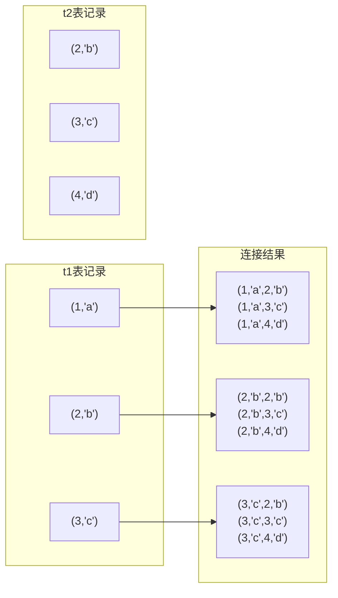
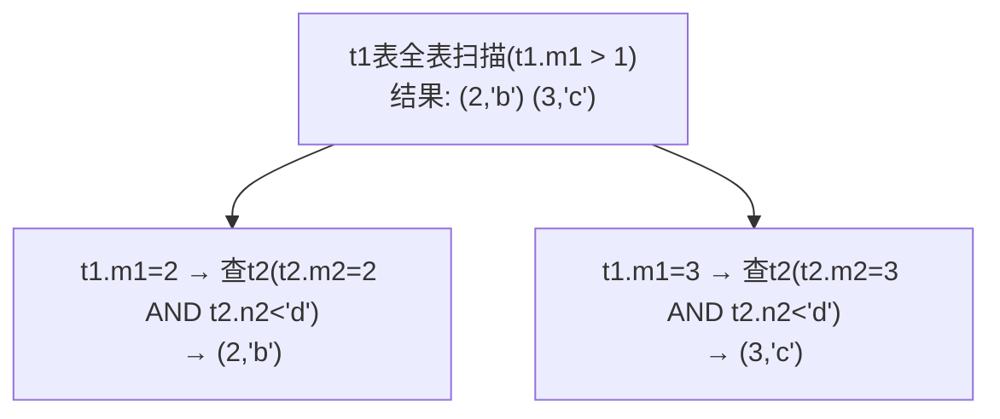
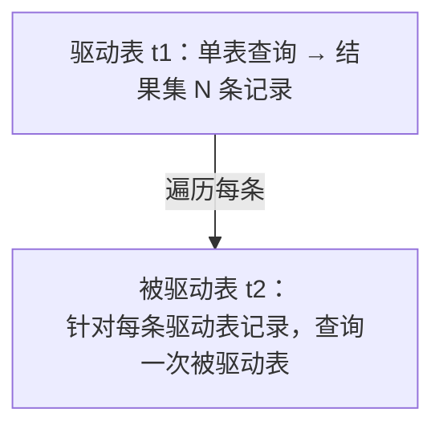
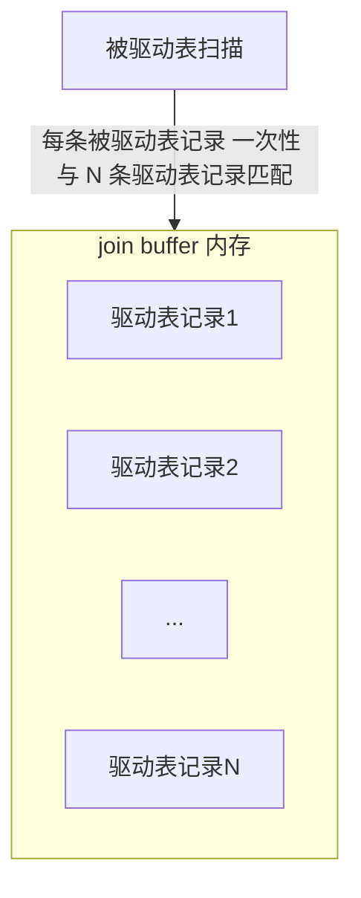

# 连接的原理

搞数据库一个避不开的概念就是 `Join`，翻译成中文是 `连接`。很多人在初学连接时有些困惑，理解了连接的语义后，又可能不明白各个表中的记录到底是怎么连起来的，以致于在使用时常常陷入下面两种误区：

- 误区一：业务至上，不管三七二十一，再复杂的查询也用在一个连接语句中搞定；
- 误区二：敬而远之，上次 DBA 报过来的慢查询就是因为使用了连接导致的，以后再也不敢用了。

本章介绍连接的原理。考虑到一部分人可能忘了连接是什么或者根本不知道，先介绍 `MySQL` 中支持的一些连接语法。

## 连接简介

### 连接的本质

为了便于说明，先建立两个简单的表并填充数据：

```text
mysql> CREATE TABLE t1 (m1 int, n1 char(1));
Query OK, 0 rows affected (0.02 sec)

mysql> CREATE TABLE t2 (m2 int, n2 char(1));
Query OK, 0 rows affected (0.02 sec)

mysql> INSERT INTO t1 VALUES(1, 'a'), (2, 'b'), (3, 'c');
Query OK, 3 rows affected (0.00 sec)
Records: 3  Duplicates: 0  Warnings: 0

mysql> INSERT INTO t2 VALUES(2, 'b'), (3, 'c'), (4, 'd');
Query OK, 3 rows affected (0.00 sec)
Records: 3  Duplicates: 0  Warnings: 0
```

建立了 `t1`、`t2` 两个表，这两个表都有两个列，一个是 `INT` 类型，一个是 `CHAR(1)` 类型。填充好数据后两个表长这样：

```text
mysql> SELECT * FROM t1;
+------+------+
| m1   | n1   |
+------+------+
|    1 | a    |
|    2 | b    |
|    3 | c    |
+------+------+
3 rows in set (0.00 sec)

mysql> SELECT * FROM t2;
+------+------+
| m2   | n2   |
+------+------+
|    2 | b    |
|    3 | c    |
|    4 | d    |
+------+------+
3 rows in set (0.00 sec)
```

`连接` 的本质：把各个连接表中的记录都取出来，依次匹配，把组合加入结果集并返回给用户。把 `t1` 和 `t2` 两个表连接起来的过程：



这个过程看起来就是把 `t1` 表的记录和 `t2` 的记录连起来组成新的更大的记录，所以这个查询过程称为连接查询。连接查询的结果集中包含一个表中的每一条记录与另一个表中的每一条记录相互匹配的组合，像这样的结果集称为 `笛卡尔积`。因为表 `t1` 中有 3 条记录、表 `t2` 中也有 3 条记录，所以这两个表连接之后的笛卡尔积有 `3×3=9` 行记录。

在 `MySQL` 中，连接查询的语法很随意，只要在 `FROM` 语句后边跟多个表名即可。把 `t1` 表和 `t2` 表连接起来的查询语句：

```text
mysql> SELECT * FROM t1, t2;
+------+------+------+------+
| m1   | n1   | m2   | n2   |
+------+------+------+------+
|    1 | a    |    2 | b    |
|    2 | b    |    2 | b    |
|    3 | c    |    2 | b    |
|    1 | a    |    3 | c    |
|    2 | b    |    3 | c    |
|    3 | c    |    3 | c    |
|    1 | a    |    4 | d    |
|    2 | b    |    4 | d    |
|    3 | c    |    4 | d    |
+------+------+------+------+
9 rows in set (0.00 sec)
```

### 连接过程简介

可以连接任意数量的表，但如果没有限制条件，这些表连接起来产生的 `笛卡尔积` 可能非常巨大。例如 3 个 100 行记录的表连接起来的 `笛卡尔积` 有 `100×100×100=1000000` 行数据！所以在连接时过滤掉特定记录组合是有必要的。连接查询中的过滤条件可以分成两种：

- 涉及单表的条件

  这种只涉及单表的过滤条件之前一直称为 `搜索条件`。例如 `t1.m1 > 1` 是只针对 `t1` 表的过滤条件，`t2.n2 < 'd'` 是只针对 `t2` 表的过滤条件。

- 涉及两表的条件

  这种过滤条件之前没见过，例如 `t1.m1 = t2.m2`、`t1.n1 > t2.n2` 等，这些条件中涉及两个表，稍后会分析这种过滤条件如何使用。

下面看携带过滤条件的连接查询的大致执行过程。例如下面的查询语句：

```sql
SELECT * FROM t1, t2 WHERE t1.m1 > 1 AND t1.m1 = t2.m2 AND t2.n2 < 'd';
```

这个查询指明了三个过滤条件：

- `t1.m1 > 1`
- `t1.m1 = t2.m2`
- `t2.n2 < 'd'`

这个连接查询的大致执行过程如下：

1. 首先确定第一个需要查询的表，这个表称为 `驱动表`。在单表中执行查询语句的方式前一章已介绍，只需选取代价最小的访问方法执行单表查询语句（即从 const、ref、ref_or_null、range、index、all 这些执行方法中选取代价最小的去执行查询）。此处假设使用 `t1` 作为驱动表，到 `t1` 表中找满足 `t1.m1 > 1` 的记录。因为表中数据太少，也没在表上建立二级索引，所以查询 `t1` 表的访问方法设为 `all`，即全表扫描执行单表查询。`t1` 表中符合 `t1.m1 > 1` 的记录有两条。

2. 针对上一步骤中从驱动表产生的结果集中的每一条记录，分别到 `t2` 表中查找匹配的记录。所谓 `匹配的记录`，指符合过滤条件的记录。因为是根据 `t1` 表中的记录去找 `t2` 表中的记录，所以 `t2` 表也可以称为 `被驱动表`。上一步骤从驱动表中得到 2 条记录，所以需要查询 2 次 `t2` 表。此时涉及两个表的列的过滤条件 `t1.m1 = t2.m2` 就派上用场了：

   - 当 `t1.m1 = 2` 时，过滤条件 `t1.m1 = t2.m2` 相当于 `t2.m2 = 2`，此时 `t2` 表相当于有了 `t2.m2 = 2`、`t2.n2 < 'd'` 这两个过滤条件，然后到 `t2` 表中执行单表查询；
   - 当 `t1.m1 = 3` 时，过滤条件 `t1.m1 = t2.m2` 相当于 `t2.m2 = 3`，此时 `t2` 表相当于有了 `t2.m2 = 3`、`t2.n2 < 'd'` 这两个过滤条件，然后到 `t2` 表中执行单表查询。

整个连接查询的执行过程：



整个连接查询最后的结果只有两条符合过滤条件的记录：

```text
+------+------+------+------+
| m1   | n1   | m2   | n2   |
+------+------+------+------+
|    2 | b    |    2 | b    |
|    3 | c    |    3 | c    |
+------+------+------+------+
```

从上面两个步骤可以看出，这个两表连接查询共需要查询 1 次 `t1` 表、2 次 `t2` 表。这是在特定过滤条件下的结果。如果去掉 `t1.m1 > 1` 这个条件，从 `t1` 表中查出的记录有 3 条，就需要查询 3 次 `t2` 表。也就是说，在两表连接查询中，驱动表只需要访问一次，被驱动表可能被访问多次。

### 内连接和外连接

为了更好理解后文内容，先创建两个有现实意义的表：

```sql
CREATE TABLE student (
    number INT NOT NULL AUTO_INCREMENT COMMENT '学号',
    name VARCHAR(5) COMMENT '姓名',
    major VARCHAR(30) COMMENT '专业',
    PRIMARY KEY (number)
) Engine=InnoDB CHARSET=utf8 COMMENT '学生信息表';

CREATE TABLE score (
    number INT COMMENT '学号',
    subject VARCHAR(30) COMMENT '科目',
    score TINYINT COMMENT '成绩',
    PRIMARY KEY (number, score)
) Engine=InnoDB CHARSET=utf8 COMMENT '学生成绩表';
```

新建了一个学生信息表和一个学生成绩表，向两个表插入一些数据后，两表中的数据如下：

```text
mysql> SELECT * FROM student;
+----------+-----------+--------------------------+
| number   | name      | major                    |
+----------+-----------+--------------------------+
| 20180101 | 杜子腾    | 软件学院                 |
| 20180102 | 范统      | 计算机科学与工程         |
| 20180103 | 史珍香    | 计算机科学与工程         |
+----------+-----------+--------------------------+
3 rows in set (0.00 sec)

mysql> SELECT * FROM score;
+----------+-----------------------------+-------+
| number   | subject                     | score |
+----------+-----------------------------+-------+
| 20180101 | 母猪的产后护理              |    78 |
| 20180101 | 论萨达姆的战争准备          |    88 |
| 20180102 | 论萨达姆的战争准备          |    98 |
| 20180102 | 母猪的产后护理              |   100 |
+----------+-----------------------------+-------+
4 rows in set (0.00 sec)
```

现在想把每个学生的考试成绩都查询出来，就需要进行两表连接（因为 `score` 中没有姓名信息，不能单纯只查询 `score` 表）。连接过程就是从 `student` 表中取出记录，在 `score` 表中查找 `number` 相同的成绩记录，过滤条件就是 `student.number = score.number`：

```text
mysql> SELECT * FROM student, score WHERE student.number = score.number;
+----------+-----------+--------------------------+----------+-----------------------------+-------+
| number   | name      | major                    | number   | subject                     | score |
+----------+-----------+--------------------------+----------+-----------------------------+-------+
| 20180101 | 杜子腾    | 软件学院                 | 20180101 | 母猪的产后护理              |    78 |
| 20180101 | 杜子腾    | 软件学院                 | 20180101 | 论萨达姆的战争准备          |    88 |
| 20180102 | 范统      | 计算机科学与工程         | 20180102 | 论萨达姆的战争准备          |    98 |
| 20180102 | 范统      | 计算机科学与工程         | 20180102 | 母猪的产后护理              |   100 |
+----------+-----------+--------------------------+----------+-----------------------------+-------+
4 rows in set (0.00 sec)
```

字段有点多，少查询几个字段：

```text
mysql> SELECT s1.number, s1.name, s2.subject, s2.score FROM student AS s1, score AS s2 WHERE s1.number = s2.number;
+----------+-----------+-----------------------------+-------+
| number   | name      | subject                     | score |
+----------+-----------+-----------------------------+-------+
| 20180101 | 杜子腾    | 母猪的产后护理              |    78 |
| 20180101 | 杜子腾    | 论萨达姆的战争准备          |    88 |
| 20180102 | 范统      | 论萨达姆的战争准备          |    98 |
| 20180102 | 范统      | 母猪的产后护理              |   100 |
+----------+-----------+-----------------------------+-------+
4 rows in set (0.00 sec)
```

各个同学对应的各科成绩都被查出来了。但有个问题：`史珍香` 同学（学号 `20180103`）因为某些原因没有参加考试，在 `score` 表中没有对应的成绩记录。如果老师想查看所有同学的考试成绩，即使是缺考的同学也应该展示出来，但到目前为止介绍的 `连接查询` 无法完成这样的需求。这个需求的本质是：**驱动表中的记录即使在被驱动表中没有匹配的记录，也仍然需要加入结果集**。为解决这个问题，就有了 `内连接` 和 `外连接` 的概念：

- 对 `内连接` 的两个表，驱动表中的记录在被驱动表中找不到匹配的记录，该记录不会加入最后的结果集。上面提到的连接都是所谓的 `内连接`。
- 对 `外连接` 的两个表，驱动表中的记录即使在被驱动表中没有匹配的记录，也仍然需要加入结果集。

在 `MySQL` 中，根据选取驱动表的不同，外连接还可以细分为 2 种：

- 左外连接：选取左侧的表为驱动表；
- 右外连接：选取右侧的表为驱动表。

但这样仍然存在问题：即使对外连接，有时也不想把驱动表的全部记录都加入最后结果集。有时匹配失败要加入结果集，有时又不要加入结果集。把过滤条件分为两种就解决了这个问题，放在不同地方的过滤条件有不同的语义：

- `WHERE` 子句中的过滤条件

  `WHERE` 子句中的过滤条件就是平时常见的那种。不论内连接还是外连接，凡是不符合 `WHERE` 子句过滤条件的记录都不会被加入最后结果集。

- `ON` 子句中的过滤条件

  对外连接的驱动表的记录来说，如果无法在被驱动表中找到匹配 `ON` 子句过滤条件的记录，该记录仍会被加入结果集，对应被驱动表记录的各个字段使用 `NULL` 值填充。

  需要注意，`ON` 子句是专门为"外连接驱动表中的记录在被驱动表找不到匹配记录时，是否应该把该记录加入结果集"这个场景提出的。如果把 `ON` 子句放到内连接中，`MySQL` 会把它和 `WHERE` 子句一样对待，即：**内连接中的 WHERE 子句和 ON 子句是等价的**。

一般情况下，都把只涉及单表的过滤条件放到 `WHERE` 子句中，把涉及两表的过滤条件放到 `ON` 子句中，也把放到 `ON` 子句中的过滤条件称为 `连接条件`。

::: tip 小贴士
左外连接和右外连接简称左连接和右连接，所以下面提到的左外连接和右外连接中的 `外` 字都用括号扩起来，以表示这个字可有可无。
:::

#### 左（外）连接的语法

左（外）连接的语法比较简单，把 `t1` 表和 `t2` 表进行左外连接查询可以这样写：

```sql
SELECT * FROM t1 LEFT [OUTER] JOIN t2 ON 连接条件 [WHERE 普通过滤条件];
```

中括号里的 `OUTER` 单词可以省略。对 `LEFT JOIN` 类型的连接，把放在左边的表称为外表或驱动表，右边的表称为内表或被驱动表。所以上述例子中 `t1` 是外表或驱动表，`t2` 是内表或被驱动表。需要注意：**对左（外）连接和右（外）连接，必须使用 `ON` 子句来指出连接条件**。

了解左（外）连接的基本语法后，回到上面的现实问题，看怎样写查询语句才能把所有学生的成绩信息都查询出来，即使是缺考的考生也应该被放到结果集中：

```text
mysql> SELECT s1.number, s1.name, s2.subject, s2.score FROM student AS s1 LEFT JOIN score AS s2 ON s1.number = s2.number;
+----------+-----------+-----------------------------+-------+
| number   | name      | subject                     | score |
+----------+-----------+-----------------------------+-------+
| 20180101 | 杜子腾    | 母猪的产后护理              |    78 |
| 20180101 | 杜子腾    | 论萨达姆的战争准备          |    88 |
| 20180102 | 范统      | 论萨达姆的战争准备          |    98 |
| 20180102 | 范统      | 母猪的产后护理              |   100 |
| 20180103 | 史珍香    | NULL                        |  NULL |
+----------+-----------+-----------------------------+-------+
5 rows in set (0.04 sec)
```

从结果集可以看出，虽然 `史珍香` 没有对应的成绩记录，但由于采用的是连接类型为左（外）连接，所以仍把她放到了结果集中，只是在对应的成绩记录的各列用 `NULL` 值填充。

#### 右（外）连接的语法

右（外）连接和左（外）连接的原理一样，语法只是把 `LEFT` 换成 `RIGHT`：

```sql
SELECT * FROM t1 RIGHT [OUTER] JOIN t2 ON 连接条件 [WHERE 普通过滤条件];
```

只不过驱动表是右边的表，被驱动表是左边的表。

#### 内连接的语法

内连接和外连接的根本区别是：**在驱动表中的记录不符合 `ON` 子句的连接条件时，不会把该记录加入最后结果集**。最开始讨论的连接查询类型都是内连接。不过之前只提到一种最简单的内连接语法，就是把需要连接的多个表都放到 `FROM` 子句后边。针对内连接，`MySQL` 提供了许多不同的语法，以 `t1` 和 `t2` 表为例：

```sql
SELECT * FROM t1 [INNER | CROSS] JOIN t2 [ON 连接条件] [WHERE 普通过滤条件];
```

也就是说在 `MySQL` 中，下面这几种内连接的写法是等价的：

- `SELECT * FROM t1 JOIN t2;`
- `SELECT * FROM t1 INNER JOIN t2;`
- `SELECT * FROM t1 CROSS JOIN t2;`

上面的写法和直接把需要连接的表名放到 `FROM` 语句后、用逗号 `,` 分隔的写法等价：

```sql
SELECT * FROM t1, t2;
```

介绍了很多种 `内连接` 的书写方式，熟悉一种即可，推荐用 `INNER JOIN` 的形式书写内连接（因为 `INNER JOIN` 语义明确，可以和 `LEFT JOIN`、`RIGHT JOIN` 轻松区分）。需要注意：**由于在内连接中 ON 子句和 WHERE 子句等价，所以内连接中不要求强制写明 ON 子句**。

前面说过，连接的本质就是把各个连接表中的记录都取出来依次匹配的组合加入结果集并返回给用户。不论哪个表作为驱动表，两表连接产生的笛卡尔积肯定一样。对内连接来说，凡是不符合 `ON` 子句或 `WHERE` 子句条件的记录都会被过滤掉，相当于从两表连接的笛卡尔积中把不符合过滤条件的记录踢出去，所以**对内连接来说，驱动表和被驱动表可以互换，不影响最后的查询结果**。但对 `外连接` 来说，由于驱动表中的记录即使在被驱动表中找不到符合 `ON` 子句连接条件的记录，所以驱动表和被驱动表的关系很重要，即**左外连接和右外连接的驱动表和被驱动表不能轻易互换**。

#### 小结

上面说了很多，不太直观。把表 `t1` 和 `t2` 的三种连接方式写在一起：

```text
mysql> SELECT * FROM t1 INNER JOIN t2 ON t1.m1 = t2.m2;
+------+------+------+------+
| m1   | n1   | m2   | n2   |
+------+------+------+------+
|    2 | b    |    2 | b    |
|    3 | c    |    3 | c    |
+------+------+------+------+
2 rows in set (0.00 sec)

mysql> SELECT * FROM t1 LEFT JOIN t2 ON t1.m1 = t2.m2;
+------+------+------+------+
| m1   | n1   | m2   | n2   |
+------+------+------+------+
|    2 | b    |    2 | b    |
|    3 | c    |    3 | c    |
|    1 | a    | NULL | NULL |
+------+------+------+------+
3 rows in set (0.00 sec)

mysql> SELECT * FROM t1 RIGHT JOIN t2 ON t1.m1 = t2.m2;
+------+------+------+------+
| m1   | n1   | m2   | n2   |
+------+------+------+------+
|    2 | b    |    2 | b    |
|    3 | c    |    3 | c    |
| NULL | NULL |    4 | d    |
+------+------+------+------+
3 rows in set (0.00 sec)
```

## 连接的原理

上面冗长的介绍只是唤醒对 `连接`、`内连接`、`外连接` 这些概念的记忆，这些基本概念是进入本章主题的铺垫。真正的重点是 `MySQL` 采用什么算法进行表与表之间的连接。了解之后，才能明白为什么有的连接查询快如闪电，有的却慢如蜗牛。

### 嵌套循环连接（Nested-Loop Join）

对两表连接来说，驱动表只会被访问一遍，但被驱动表却要被访问很多遍，具体访问几遍取决于对驱动表执行单表查询后的结果集中的记录条数。对内连接来说，选取哪个表为驱动表都没关系；而外连接的驱动表是固定的，左（外）连接的驱动表就是左边的表，右（外）连接的驱动表就是右边的表。上面已大致介绍过 `t1` 表和 `t2` 表执行内连接查询的大致过程：

- 步骤 1：选取驱动表，使用与驱动表相关的过滤条件，选取代价最低的单表访问方法执行对驱动表的单表查询；
- 步骤 2：对上一步骤中查询驱动表得到的结果集中的每一条记录，都分别到被驱动表中查找匹配的记录。

通用的两表连接过程：



如果有 3 个表进行连接，`步骤2` 中得到的结果集就像是新的驱动表，第三个表成为被驱动表，重复上述过程，即 `步骤2` 中得到的结果集中的每一条记录都需要到 `t3` 表中找有没有匹配的记录。用伪代码表示这个过程：

```text
for each row in t1 {                    # 遍历满足对 t1 单表查询结果集中的每一条记录
    for each row in t2 {                # 对某条 t1 表的记录，遍历满足对 t2 单表查询结果集中的每一条记录
        for each row in t3 {            # 对某条 t1 和 t2 表的记录组合，对 t3 表进行单表查询
            if row satisfies join conditions, send to client
        }
    }
}
```

这个过程就像一个嵌套的循环，所以这种**驱动表只访问一次，但被驱动表可能被多次访问，访问次数取决于对驱动表执行单表查询后的结果集中的记录条数**的连接执行方式称为 `嵌套循环连接`（`Nested-Loop Join`），这是最简单也最笨拙的一种连接查询算法。

### 使用索引加快连接速度

在 `嵌套循环连接` 的 `步骤2` 中可能需要访问多次被驱动表。如果访问被驱动表的方式都是全表扫描，就要扫描很多次。但查询 `t2` 表其实相当于一次单表扫描，可以利用索引加快查询速度。回顾最开始介绍的 `t1` 表和 `t2` 表进行内连接的例子：

```sql
SELECT * FROM t1, t2 WHERE t1.m1 > 1 AND t1.m1 = t2.m2 AND t2.n2 < 'd';
```

使用的是 `嵌套循环连接` 算法执行连接查询。查询驱动表 `t1` 后的结果集中有两条记录，`嵌套循环连接` 算法需要对被驱动表查询 2 次：

- 当 `t1.m1 = 2` 时，查询一遍 `t2` 表，对 `t2` 表的查询语句相当于：

```sql
SELECT * FROM t2 WHERE t2.m2 = 2 AND t2.n2 < 'd';
```

- 当 `t1.m1 = 3` 时，再查询一遍 `t2` 表，对 `t2` 表的查询语句相当于：

```sql
SELECT * FROM t2 WHERE t2.m2 = 3 AND t2.n2 < 'd';
```

可以看到，原来的 `t1.m1 = t2.m2` 这个涉及两个表的过滤条件，在针对 `t2` 表做查询时关于 `t1` 表的条件已经确定，所以只需优化对 `t2` 表的查询。上述两个对 `t2` 表的查询语句中利用到的列是 `m2` 和 `n2` 列，可以：

- 在 `m2` 列上建立索引。对 `m2` 列的条件是等值查找（如 `t2.m2 = 2`、`t2.m2 = 3`），可能使用 `ref` 访问方法。使用 `ref` 访问方法执行对 `t2` 表的查询，需要回表后再判断 `t2.n2 < d` 这个条件是否成立。

  有一个特殊情况：如果 `m2` 列是 `t2` 表的主键或唯一二级索引列，那么使用 `t2.m2 = 常数值` 这样的条件从 `t2` 表中查找记录的过程的代价是常数级别的。单表中使用主键值或唯一二级索引列的值进行等值查找的方式称为 `const`。而设计者把在连接查询中对被驱动表使用主键值或唯一二级索引列的值进行等值查找的查询执行方式称为 `eq_ref`。

- 在 `n2` 列上建立索引。涉及的条件是 `t2.n2 < 'd'`，可能用到 `range` 访问方法。使用 `range` 访问方法对 `t2` 表查询，需要回表后再判断在 `m2` 列上的条件是否成立。

假设 `m2` 和 `n2` 列上都存在索引，需要从这两个里挑一个代价更低的执行对 `t2` 表的查询。当然，建立了索引不一定使用索引，只有在 `二级索引 + 回表` 的代价比全表扫描的代价更低时才会使用索引。

另外，有时连接查询的查询列表和过滤条件中可能只涉及被驱动表的部分列，而这些列都是某个索引的一部分。这种情况下，即使不能使用 `eq_ref`、`ref`、`ref_or_null` 或 `range` 这些访问方法执行对被驱动表的查询，也可以使用索引扫描（`index` 访问方法）查询被驱动表。所以建议在真实工作中不要用 `*` 作为查询列表，最好把真实用到的列作为查询列表。

### 基于块的嵌套循环连接（Block Nested-Loop Join）

扫描一个表的过程，其实是先把这个表从磁盘上加载到内存中，然后从内存中比较匹配条件是否满足。现实中的表可不像 `t1`、`t2` 这样只有 3 条记录，成千上万条记录都是少的，几百万、几千万甚至几亿条记录的表到处都是。内存里可能并不能完全放下表中所有记录，所以在扫描表前边记录时，后边的记录可能还在磁盘上；等扫描到后边记录时可能内存不足，需要把前边的记录从内存中释放掉。采用 `嵌套循环连接` 算法的两表连接过程中，被驱动表要被访问很多次。如果被驱动表中的数据特别多且不能使用索引访问，就相当于要从磁盘上读好几次这个表，`I/O` 代价非常大，所以要：**尽量减少访问被驱动表的次数**。

当被驱动表中的数据非常多时，每次访问被驱动表，被驱动表的记录会被加载到内存中，在内存中的每一条记录只会和驱动表结果集的一条记录做匹配，之后被从内存中清除。然后再从驱动表结果集中拿出另一条记录，再一次把被驱动表的记录加载到内存中一遍。周而复始，驱动表结果集中有多少条记录，就得把被驱动表从磁盘上加载到内存中多少次。

所以可不可以把被驱动表的记录加载到内存时，一次性和多条驱动表中的记录做匹配？这样可以大大减少重复从磁盘上加载被驱动表的代价。设计者提出了一个 `join buffer` 的概念：`join buffer` 就是执行连接查询前申请的一块固定大小的内存，先把若干条驱动表结果集中的记录装在这个 `join buffer` 中，然后开始扫描被驱动表，每一条被驱动表的记录一次性和 `join buffer` 中的多条驱动表记录做匹配。因为匹配过程都在内存中完成，这样可以显著减少被驱动表的 `I/O` 代价：



最好的情况是 `join buffer` 足够大，能容纳驱动表结果集中的所有记录，这样只需访问一次被驱动表就可以完成连接操作。设计者把这种加入了 `join buffer` 的嵌套循环连接算法称为 `基于块的嵌套连接`（Block Nested-Loop Join）算法。

`join buffer` 的大小可以通过启动参数或系统变量 `join_buffer_size` 配置，默认大小为 `262144` 字节（即 `256KB`），最小可以设置为 `128` 字节。对优化被驱动表的查询，最好是为被驱动表加上效率高的索引；如果实在不能使用索引，且机器的内存比较大，可以尝试调大 `join_buffer_size` 的值对连接查询进行优化。

另外需要注意：驱动表的记录并不是所有列都会被放到 `join buffer` 中，只有查询列表中的列和过滤条件中的列才会被放到 `join buffer` 中。所以最好不要把 `*` 作为查询列表，只需把关心的列放到查询列表，这样可以在 `join buffer` 中放置更多记录。

::: warning 版本演进（MySQL 8.0）
以上是 MySQL 8.0.18 之前的连接算法。**MySQL 8.0.18 起，对无索引可用的等值连接改用 hash join**（`optimizer_switch` 中的 `hash_join` 开关，8.0.46 实测默认 `on`）；**8.0.20 起优化器彻底不再使用 BNL**——`block_nested_loop` 开关仅作兼容保留（实测 8.0.46 默认 `on` 但已无实际作用），`join buffer` 转而服务于 hash join 和笛卡尔积等场景。在 8.0 及以后的版本上，被驱动表无索引的等值连接性能问题应通过 hash join 理解，而非 BNL。
:::
