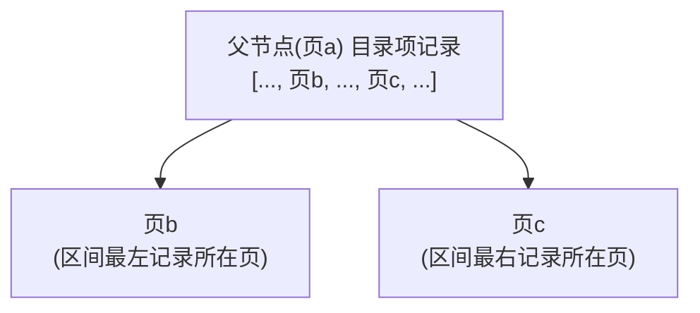

# 基于成本的优化

## 什么是成本

之前常说 `MySQL` 执行一个查询可以有不同执行方案，它会选择成本最低、即代价最低的那种方案真正执行查询。不过之前对 `成本` 的描述很模糊。在 `MySQL` 中，一条查询语句的执行成本由下面两个方面组成：

- `I/O` 成本

  表经常使用的 `MyISAM`、`InnoDB` 存储引擎都把数据和索引存储到磁盘上。当想查询表中的记录时，需要先把数据或索引加载到内存中再操作。这个从磁盘到内存的加载过程损耗的时间称为 `I/O` 成本。

- `CPU` 成本

  读取以及检测记录是否满足对应搜索条件、对结果集进行排序等操作损耗的时间称为 `CPU` 成本。

对 `InnoDB` 存储引擎来说，页是磁盘和内存之间交互的基本单位。设计者规定读取一个页面花费的成本默认是 `1.0`，读取以及检测一条记录是否符合搜索条件的成本默认是 `0.2`。`1.0`、`0.2` 这些数字称为 `成本常数`，这两个成本常数最常用到，其余的成本常数后文再说。

::: tip 小贴士
不管读取记录时需不需要检测是否满足搜索条件，其成本都算是 0.2。
:::

## 单表查询的成本

### 准备工作

把之前用到的 `single_table` 表再抄一遍：

```sql
CREATE TABLE single_table (
    id INT NOT NULL AUTO_INCREMENT,
    key1 VARCHAR(100),
    key2 INT,
    key3 VARCHAR(100),
    key_part1 VARCHAR(100),
    key_part2 VARCHAR(100),
    key_part3 VARCHAR(100),
    common_field VARCHAR(100),
    PRIMARY KEY (id),
    KEY idx_key1 (key1),
    UNIQUE KEY idx_key2 (key2),
    KEY idx_key3 (key3),
    KEY idx_key_part(key_part1, key_part2, key_part3)
) Engine=InnoDB CHARSET=utf8;
```

假设这个表里有 10000 条记录，除 `id` 列外其余列都插入随机值。

### 基于成本的优化步骤

在一条单表查询语句真正执行之前，`MySQL` 的查询优化器会找出执行该语句所有可能使用的方案，对比后找出成本最低的方案，这个成本最低的方案就是所谓的 `执行计划`，之后才调用存储引擎提供的接口真正执行查询。这个过程总结如下：

1. 根据搜索条件，找出所有可能使用的索引；
2. 计算全表扫描的代价；
3. 计算使用不同索引执行查询的代价；
4. 对比各种执行方案的代价，找出成本最低的那一个。

下面以一个实例分析这些步骤。单表查询语句如下：

```sql
SELECT * FROM single_table WHERE
    key1 IN ('a', 'b', 'c') AND
    key2 > 10 AND key2 < 1000 AND
    key3 > key2 AND
    key_part1 LIKE '%hello%' AND
    common_field = '123';
```

#### 1. 根据搜索条件，找出所有可能使用的索引

对于 `B+` 树索引，只要索引列和常数使用 `=`、`<=>`、`IN`、`NOT IN`、`IS NULL`、`IS NOT NULL`、`>`、`<`、`>=`、`<=`、`BETWEEN`、`!=`（不等于也可写成 `<>`）或 `LIKE` 操作符连接起来，就可以产生一个 `范围区间`（`LIKE` 匹配字符串前缀也行），这些搜索条件都可能使用到索引。设计者把一个查询中可能使用到的索引称为 `possible keys`。

分析上面查询中涉及的几个搜索条件：

- `key1 IN ('a', 'b', 'c')`，这个搜索条件可以使用二级索引 `idx_key1`；
- `key2 > 10 AND key2 < 1000`，这个搜索条件可以使用二级索引 `idx_key2`；
- `key3 > key2`，这个搜索条件的索引列没有和常数比较，不能使用到索引；
- `key_part1 LIKE '%hello%'`，`key_part1` 通过 `LIKE` 操作符和以通配符开头的字符串比较，不可以适用索引；
- `common_field = '123'`，该列上没有索引，不会用到索引。

综上所述，上面查询语句可能用到的索引（`possible keys`）只有 `idx_key1` 和 `idx_key2`。

#### 2. 计算全表扫描的代价

对 `InnoDB` 存储引擎来说，全表扫描就是把聚簇索引中的记录依次和给定搜索条件比较，把符合搜索条件的记录加入结果集，所以需要将聚簇索引对应的页面加载到内存中，再检测记录是否符合搜索条件。由于查询成本 = `I/O` 成本 + `CPU` 成本，计算全表扫描的代价需要两个信息：

- 聚簇索引占用的页面数；
- 该表中的记录数。

这两个信息从哪里来？设计者为每个表维护了一系列 `统计信息`，关于这些统计信息如何收集起来后文详细介绍。设计者提供了 `SHOW TABLE STATUS` 语句查看表的统计信息，如果要查看指定表的统计信息，在语句后加对应的 `LIKE` 语句。例如查看 `single_table` 表的统计信息：

```text
mysql> USE xiaohaizi;
Database changed

mysql> SHOW TABLE STATUS LIKE 'single_table'\G
*************************** 1. row ***************************
           Name: single_table
         Engine: InnoDB
        Version: 10
     Row_format: Dynamic
           Rows: 9693
 Avg_row_length: 163
    Data_length: 1589248
Max_data_length: 0
   Index_length: 2752512
      Data_free: 4194304
 Auto_increment: 10001
    Create_time: 2018-12-10 13:37:23
    Update_time: 2018-12-10 13:38:03
     Check_time: NULL
      Collation: utf8_general_ci
       Checksum: NULL
 Create_options:
        Comment:
1 row in set (0.01 sec)
```

出现了很多统计选项，目前只关心两个：

- `Rows`

  本选项表示表中的记录条数。对使用 `MyISAM` 存储引擎的表，该值是准确的；对使用 `InnoDB` 存储引擎的表，该值是一个估计值。从查询结果可以看出，由于 `single_table` 表使用 `InnoDB` 存储引擎，虽然实际上表中有 10000 条记录，但 `SHOW TABLE STATUS` 显示的 `Rows` 值只有 9693 条。

- `Data_length`

  本选项表示表占用的存储空间字节数。对使用 `MyISAM` 存储引擎的表，该值就是数据文件的大小；对使用 `InnoDB` 存储引擎的表，该值相当于聚簇索引占用的存储空间大小，可以这样计算：

```text
Data_length = 聚簇索引的页面数量 × 每个页面的大小
```

  `single_table` 使用默认 `16KB` 的页面大小，查询结果显示 `Data_length` 的值是 `1589248`，所以可以反推 `聚簇索引的页面数量`：

```text
聚簇索引的页面数量 = 1589248 ÷ 16 ÷ 1024 = 97
```

现在已经得到聚簇索引占用的页面数量以及该表记录数的估计值，可以计算全表扫描成本了。但设计者在真实计算成本时会进行一些 `微调`，这些微调值直接硬编码到代码里，值很小，不影响分析，不必纠结。全表扫描成本的计算过程：

- `I/O` 成本

```text
97 x 1.0 + 1.1 = 98.1
```

  `97` 指聚簇索引占用的页面数，`1.0` 指加载一个页面的成本常数，后面的 `1.1` 是微调值。

- `CPU` 成本

```text
9693 x 0.2 + 1.0 = 1939.6
```

  `9693` 指统计数据中表的记录数（对 `InnoDB` 存储引擎是估计值），`0.2` 指访问一条记录所需的成本常数，后面的 `1.0` 是微调值。

- 总成本

```text
98.1 + 1939.6 = 2037.7
```

综上所述，`single_table` 的全表扫描所需总成本是 `2037.7`。

::: tip 小贴士
前面说过表中的记录存储在聚簇索引对应 B+ 树的叶子节点中，只要通过根节点获得最左边的叶子节点，就可以沿叶子节点组成的双向链表把所有记录查看一遍。也就是说全表扫描过程中有的 B+ 树内节点不需要访问。但设计者在计算全表扫描成本时直接使用聚簇索引占用的页面数作为计算 I/O 成本的依据，不区分内节点和叶子节点，有点简单粗暴，注意一下即可。
:::

#### 3. 计算使用不同索引执行查询的代价

从第 1 步分析得到，上述查询可能使用 `idx_key1` 和 `idx_key2` 这两个索引，需要分别分析单独使用这些索引执行查询的成本，最后还要分析是否可能使用索引合并。`MySQL` 查询优化器先分析使用唯一二级索引的成本，再分析使用普通索引的成本，所以先分析 `idx_key2` 的成本，再看使用 `idx_key1` 的成本。

##### 使用idx_key2执行查询的成本分析

`idx_key2` 对应的搜索条件是 `key2 > 10 AND key2 < 1000`，对应的范围区间是 `(10, 1000)`。使用 `idx_key2` 搜索的示意图：

```text
idx_key2 索引(按key2排序):
[..., key2=10, (区间最左记录) key2>10 第一条, ... , key2<1000, ..., key2=1000, ...]
                    |___________ 范围区间 (10,1000) ___________|
```

对使用 `二级索引 + 回表` 方式的查询，计算这种查询的成本依赖两个方面的数据：

- 范围区间数量

  不论某个范围区间的二级索引占用了多少页面，查询优化器粗暴地认为读取索引的一个范围区间的 `I/O` 成本和读取一个页面相同。本例中使用 `idx_key2` 的范围区间只有一个 `(10, 1000)`，所以访问这个范围区间的二级索引付出的 `I/O` 成本是：

```text
1 x 1.0 = 1.0
```

- 需要回表的记录数

  优化器需要计算二级索引的某个范围区间包含多少条记录。对本例，就是要计算 `idx_key2` 在 `(10, 1000)` 范围区间中包含多少二级索引记录，计算过程：

  - 步骤 1：先根据 `key2 > 10` 条件访问 `idx_key2` 对应的 `B+` 树索引，找到满足 `key2 > 10` 的第一条记录，称为 `区间最左记录`。在 `B+` 树中定位一条记录的过程是常数级别的，性能消耗可忽略不计。
  - 步骤 2：再根据 `key2 < 1000` 条件从 `idx_key2` 对应的 `B+` 树索引中找出满足该条件的第一条记录，称为 `区间最右记录`，这个过程的性能消耗也可忽略不计。
  - 步骤 3：如果 `区间最左记录` 和 `区间最右记录` 相隔不太远（在 `MySQL 5.7.21` 版本里，相隔不大于 10 个页面即可），可以精确统计出满足 `key2 > 10 AND key2 < 1000` 条件的二级索引记录条数。否则只沿 `区间最左记录` 向右读 10 个页面，计算平均每个页面包含多少记录，然后用这个平均值乘以 `区间最左记录` 和 `区间最右记录` 之间的页面数量。

    问题是怎么估计 `区间最左记录` 和 `区间最右记录` 之间有多少个页面？回到 `B+` 树索引的结构：



    假设 `区间最左记录` 在 `页b` 中、`区间最右记录` 在 `页c` 中，计算 `区间最左记录` 和 `区间最右记录` 之间的页面数量，就相当于计算 `页b` 和 `页c` 之间有多少页面。而每一条 `目录项记录` 对应一个数据页，所以计算 `页b` 和 `页c` 之间有多少页面，就相当于**计算它们父节点（页a）中对应的目录项记录之间隔着几条记录**。在一个页面中统计两条记录之间有几条记录的成本很低。

    不过还有问题：如果 `页b` 和 `页c` 之间的页面太多，`页b` 和 `页c` 对应的目录项记录不在一个页面中怎么办？继续递归，即再统计 `页b` 和 `页c` 对应的目录项记录所在页之间有多少个页面。之前说过一个 `B+` 树有 4 层高已经很了不得了，所以这个统计过程也不是很耗费性能。

  知道了如何统计二级索引某个范围区间的记录数后，回到现实问题。根据上述算法测得 `idx_key2` 在区间 `(10, 1000)` 之间大约有 `95` 条记录。读取这 `95` 条二级索引记录需要付出的 `CPU` 成本是：

```text
95 x 0.2 + 0.01 = 19.01
```

  其中 `95` 是需要读取的二级索引记录条数，`0.2` 是读取一条记录的成本常数，`0.01` 是微调。

  在通过二级索引获取到记录之后，还需要做两件事：

  - 根据这些记录里的主键值到聚簇索引中做回表操作

    设计者评估回表操作的 `I/O` 成本依旧很豪放：认为每次回表操作都相当于访问一个页面，即二级索引范围区间有多少记录，就需要进行多少次回表操作，也就是多少次页面 `I/O`。使用 `idx_key2` 二级索引执行查询时，预计有 `95` 条二级索引记录需要回表，所以回表操作带来的 `I/O` 成本是：

```text
95 x 1.0 = 95.0
```

    其中 `95` 是预计的二级索引记录数，`1.0` 是一个页面的 `I/O` 成本常数。

  - 回表操作后得到完整用户记录，再检测其他搜索条件是否成立

    回表操作的本质是通过二级索引记录的主键值到聚簇索引中找到完整用户记录，再检测除 `key2 > 10 AND key2 < 1000` 以外的搜索条件是否成立。通过范围区间获取到二级索引记录共 `95` 条，对应聚簇索引中 `95` 条完整用户记录。设计者只计算这个查找过程所需的 `I/O` 成本（即上一步得到的 `95.0`），在内存中定位完整用户记录的成本忽略不计。定位到完整用户记录后，检测其他搜索条件是否成立的 `CPU` 成本是：

```text
95 x 0.2 = 19.0
```

    其中 `95` 是待检测记录的条数，`0.2` 是检测一条记录是否符合给定搜索条件的成本常数。

所以本例中使用 `idx_key2` 执行查询的成本：

- `I/O` 成本：

```text
1.0 + 95 x 1.0 = 96.0 (范围区间的数量 + 预估的二级索引记录条数)
```

- `CPU` 成本：

```text
95 x 0.2 + 0.01 + 95 x 0.2 = 38.01 (读取二级索引记录的成本 + 读取并检测回表后聚簇索引记录的成本)
```

综上所述，使用 `idx_key2` 执行查询的总成本是：

```text
96.0 + 38.01 = 134.01
```

##### 使用idx_key1执行查询的成本分析

`idx_key1` 对应的搜索条件是 `key1 IN ('a', 'b', 'c')`，相当于 3 个单点区间：

- `['a', 'a']`
- `['b', 'b']`
- `['c', 'c']`

使用 `idx_key1` 搜索的示意图：

```text
idx_key1 索引(按key1排序):
['a']区间 → ['b']区间 → ['c']区间
   |          |          |
  35条       44条       39条
```

与使用 `idx_key2` 类似，需要计算使用 `idx_key1` 时需要访问的范围区间数量以及需要回表的记录数：

- 范围区间数量

  使用 `idx_key1` 执行查询时有 3 个单点区间，访问这 3 个范围区间的二级索引付出的 I/O 成本是：

```text
3 x 1.0 = 3.0
```

- 需要回表的记录数

  由于使用 `idx_key1` 时有 3 个单点区间，每个单点区间都需要查找对应的二级索引记录数：

  - 查找单点区间 `['a', 'a']` 对应的二级索引记录数

    计算单点区间对应的二级索引记录数和计算连续范围区间的方法一样，都是先计算 `区间最左记录` 和 `区间最右记录`，再计算它们之间的记录数。最后得到单点区间 `['a', 'a']` 对应的二级索引记录数是 `35`。

  - 查找单点区间 `['b', 'b']` 对应的二级索引记录数

    同理，本单点区间对应记录数是 `44`。

  - 查找单点区间 `['c', 'c']` 对应的二级索引记录数

    同理，本单点区间对应记录数是 `39`。

  所以这三个单点区间总共需要回表的记录数：

```text
35 + 44 + 39 = 118
```

  读取这些二级索引记录的 `CPU` 成本是：

```text
118 x 0.2 + 0.01 = 23.61
```

  得到总共需要回表的记录数之后，要考虑：

  - 根据这些记录里的主键值到聚簇索引中做回表操作，所需的 `I/O` 成本是：

```text
118 x 1.0 = 118.0
```

  - 回表操作后得到完整用户记录，再比较其他搜索条件是否成立，此步骤对应的 `CPU` 成本是：

```text
118 x 0.2 = 23.6
```

所以本例中使用 `idx_key1` 执行查询的成本：

- `I/O` 成本：

```text
3.0 + 118 x 1.0 = 121.0 (范围区间的数量 + 预估的二级索引记录条数)
```

- `CPU` 成本：

```text
118 x 0.2 + 0.01 + 118 x 0.2 = 47.21 (读取二级索引记录的成本 + 读取并检测回表后聚簇索引记录的成本)
```

综上所述，使用 `idx_key1` 执行查询的总成本是：

```text
121.0 + 47.21 = 168.21
```

##### 是否有可能使用索引合并（Index Merge）

本例中有关 `key1` 和 `key2` 的搜索条件是使用 `AND` 连接的，而 `idx_key1` 和 `idx_key2` 都是范围查询，查找到的二级索引记录并不是按主键值排序的，不满足使用 `Intersection` 索引合并的条件，所以不会使用索引合并。

::: tip 小贴士
MySQL 查询优化器计算索引合并成本的算法也比较复杂，这里不展开介绍。
:::

#### 4. 对比各种执行方案的代价，找出成本最低的那一个

把执行本例中查询的各种可执行方案以及对应成本列出来：

- 全表扫描的成本：`2037.7`
- 使用 `idx_key2` 的成本：`134.01`
- 使用 `idx_key1` 的成本：`168.21`

显然，使用 `idx_key2` 的成本最低，所以选择 `idx_key2` 执行查询。

::: tip 小贴士
考虑到阅读体验，为了最大限度减少理解优化器工作原理过程中遇到的困惑，这里对优化器在单表查询中对比各种执行方案代价的方式做了简化。不过大部分同学不需要看 MySQL 源码，把大致精神理解正确即可。
:::

### 基于索引统计数据的成本计算

有时使用索引执行查询时会有许多单点区间，比如使用 `IN` 语句很容易产生非常多的单点区间：

```sql
SELECT * FROM single_table WHERE key1 IN ('aa1', 'aa2', 'aa3', ... , 'zzz');
```

显然，这个查询可能使用到的索引是 `idx_key1`。由于这个索引不是唯一二级索引，不能确定一个单点区间对应的二级索引记录条数，需要计算。计算方式前面已介绍：先获取索引对应的 `B+` 树的 `区间最左记录` 和 `区间最右记录`，再计算这两条记录之间有多少记录（记录条数少时可以精确计算，多时只能估算）。设计者把这种通过直接访问索引对应的 `B+` 树来计算某个范围区间对应的索引记录条数的方式称为 `index dive`。

::: tip 小贴士
dive 直译为中文是跳水、俯冲的意思。要理解 index dive 就是直接利用索引对应的 B+ 树来计算某个范围区间对应的记录条数。
:::

有零星几个单点区间时，用 `index dive` 方式计算这些单点区间对应的记录数不是问题。但有的查询 `IN` 语句里塞了很多参数，例如 `IN` 语句里有 20000 个参数，这就意味着查询优化器为了计算这些单点区间对应的索引记录条数要进行 20000 次 `index dive` 操作，性能损耗很大，搞不好计算成本比直接全表扫描还大。设计者当然考虑到了这种情况，提供了一个系统变量 `eq_range_index_dive_limit`。查看在 `MySQL 5.7.21` 中这个系统变量的默认值：

```text
mysql> SHOW VARIABLES LIKE '%dive%';
+---------------------------+-------+
| Variable_name             | Value |
+---------------------------+-------+
| eq_range_index_dive_limit | 200   |
+---------------------------+-------+
1 row in set (0.08 sec)
```

也就是说如果 `IN` 语句中的参数个数小于 200 个，将使用 `index dive` 的方式计算各个单点区间对应的记录条数；如果大于或等于 200 个，就不能使用 `index dive`，要使用所谓的索引统计数据来估算。怎么个估算法？继续往下看。

像为每个表维护一份统计数据一样，`MySQL` 也会为表中的每一个索引维护一份统计数据。查看某个表中索引的统计数据可以使用 `SHOW INDEX FROM 表名` 语法，例如查看 `single_table` 的各个索引的统计数据：

```text
mysql> SHOW INDEX FROM single_table;
+--------------+------------+--------------+--------------+-------------+-----------+-------------+----------+--------+------+------------+---------+---------------+
| Table        | Non_unique | Key_name     | Seq_in_index | Column_name | Collation | Cardinality | Sub_part | Packed | Null | Index_type | Comment | Index_comment |
+--------------+------------+--------------+--------------+-------------+-----------+-------------+----------+--------+------+------------+---------+---------------+
| single_table |          0 | PRIMARY      |            1 | id          | A         |       9693  |     NULL | NULL   |      | BTREE      |         |               |
| single_table |          0 | idx_key2     |            1 | key2        | A         |       9693  |     NULL | NULL   | YES  | BTREE      |         |               |
| single_table |          1 | idx_key1     |            1 | key1        | A         |        968  |     NULL | NULL   | YES  | BTREE      |         |               |
| single_table |          1 | idx_key3     |            1 | key3        | A         |        799  |     NULL | NULL   | YES  | BTREE      |         |               |
| single_table |          1 | idx_key_part |            1 | key_part1   | A         |        9673 |     NULL | NULL   | YES  | BTREE      |         |               |
| single_table |          1 | idx_key_part |            2 | key_part2   | A         |        9999 |     NULL | NULL   | YES  | BTREE      |         |               |
| single_table |          1 | idx_key_part |            3 | key_part3   | A         |       10000 |     NULL | NULL   | YES  | BTREE      |         |               |
+--------------+------------+--------------+--------------+-------------+-----------+-------------+----------+--------+------+------------+---------+---------------+
7 rows in set (0.01 sec)
```

> 注：以上为 5.7 时代的输出。MySQL 8.0 的 `SHOW INDEX` 输出还包含 `Visible`（索引是否可见）与 `Expression`（函数索引的表达式）两列。

竟然有这么多属性，好在这些属性都不难理解，逐一介绍：

| 属性名 | 描述 |
|:--:|--|
| `Table` | 索引所属表的名称 |
| `Non_unique` | 索引列的值是否是唯一的，聚簇索引和唯一二级索引的该列值为 `0`，普通二级索引该列值为 `1` |
| `Key_name` | 索引的名称 |
| `Seq_in_index` | 索引列在索引中的位置，从 1 开始计数。比如对联合索引 `idx_key_part`，`key_part1`、`key_part2`、`key_part3` 对应的位置分别是 1、2、3 |
| `Column_name` | 索引列的名称 |
| `Collation` | 索引列中的值按何种排序方式存放，值为 `A` 代表升序存放，`D` 代表降序存放（8.0 起的降序索引会显示 `D`），`NULL` 代表未按特定顺序存放（如 HASH、全文索引） |
| `Cardinality` | 索引列中不重复值的数量，后文会重点看这个属性 |
| `Sub_part` | 对存储字符串或字节串的列，有时只想对这些串的前 `n` 个字符或字节建立索引，这个属性表示那个 `n` 值。如果对完整列建立索引，该属性的值是 `NULL` |
| `Packed` | 索引列如何被压缩，`NULL` 值表示未被压缩。这个属性可以先忽略 |
| `Null` | 该索引列是否允许存储 `NULL` 值 |
| `Index_type` | 使用索引的类型，最常见的是 `BTREE`，也就是 `B+` 树索引 |
| `Comment` | 索引列注释信息 |
| `Index_comment` | 索引注释信息 |

上述属性除了 `Packed` 可能看不懂以外，其他应该都能理解。现在最在意的是 `Cardinality` 属性。`Cardinality` 直译过来是 `基数`，表示索引列中不重复值的个数。对一个一万行记录的表来说，某个索引列的 `Cardinality` 属性是 `10000`，意味着该列中没有重复值；如果 `Cardinality` 属性是 `1`，意味着该列的值全部重复。需要注意：**对 InnoDB 存储引擎来说，使用 SHOW INDEX 语句展示出来的某个索引列的 Cardinality 属性是一个估计值，并不精确**。关于 `Cardinality` 属性的值如何计算后文再说，先看它的用途。

前面说过，当 `IN` 语句中的参数个数大于或等于系统变量 `eq_range_index_dive_limit` 的值时，不会使用 `index dive` 方式计算各个单点区间对应的索引记录条数，而是使用索引统计数据。这里所指的 `索引统计数据` 指的是两个值：

- 使用 `SHOW TABLE STATUS` 展示出的 `Rows` 值，即一个表中有多少条记录。这个统计数据前面讲全表扫描成本时说过多次。
- 使用 `SHOW INDEX` 语句展示出的 `Cardinality` 属性。

结合 `Rows` 统计数据，可以针对索引列计算平均一个值重复多少次：

```text
一个值的重复次数 ≈ Rows ÷ Cardinality
```

以 `single_table` 表的 `idx_key1` 索引为例，它的 `Rows` 值是 `9693`，对应索引列 `key1` 的 `Cardinality` 值是 `968`，所以 `key1` 列平均单个值的重复次数是：

```text
9693 ÷ 968 ≈ 10（条）
```

此时再看上面那条查询语句：

```sql
SELECT * FROM single_table WHERE key1 IN ('aa1', 'aa2', 'aa3', ... , 'zzz');
```

假设 `IN` 语句中有 20000 个参数，就直接使用统计数据估算这些参数需要单点区间对应的记录条数。每个参数大约对应 `10` 条记录，所以总共需要回表的记录数是：

```text
20000 x 10 = 200000
```

使用统计数据计算单点区间对应的索引记录条数比 `index dive` 简单多了，但它的致命弱点是：**不精确！** 使用统计数据算出来的查询成本与实际所需成本可能相差非常大。

::: tip 小贴士
注意，在 MySQL 5.7.3 及之前的版本中，eq_range_index_dive_limit 的默认值为 10，之后的版本默认值为 200。如果采用 5.7.3 及之前的版本，很容易采用索引统计数据而不是 index dive 的方式计算查询成本。当查询中使用 IN 查询但实际没有用到索引时，应该考虑是不是由于 eq_range_index_dive_limit 值太小导致的。
:::

## 连接查询的成本

### 准备工作

连接查询至少要有两个表，只有一个 `single_table` 表不够。为了便于说明，直接构造一个和 `single_table` 表一模一样的 `single_table2` 表。为简便起见，把 `single_table` 表称为 `s1` 表，把 `single_table2` 表称为 `s2` 表。

### Condition filtering介绍

`MySQL` 中连接查询采用嵌套循环连接算法，驱动表会被访问一次，被驱动表可能被访问多次。对两表连接查询，查询成本由下面两个部分构成：

- 单次查询驱动表的成本；
- 多次查询被驱动表的成本（**具体查询多少次取决于对驱动表查询的结果集中有多少条记录**）。

把对驱动表查询后得到的记录条数称为驱动表的 `扇出`（英文名 `fanout`）。显然，驱动表的扇出值越小，对被驱动表的查询次数越少，连接查询的总成本越低。当查询优化器想计算整个连接查询的成本时，需要计算驱动表的扇出值。有时扇出值的计算很容易，比如下面两个查询：

- 查询一：

```sql
SELECT * FROM single_table AS s1 INNER JOIN single_table2 AS s2;
```

  假设使用 `s1` 表作为驱动表，对驱动表的单表查询只能使用全表扫描执行，驱动表的扇出值也很明确：驱动表中有多少记录，扇出值就是多少。前面说过，统计数据中 `s1` 表的记录行数是 `9693`，优化器直接会把 `9693` 当作 `s1` 表的扇出值。

- 查询二：

```sql
SELECT * FROM single_table AS s1 INNER JOIN single_table2 AS s2
WHERE s1.key2 >10 AND s1.key2 < 1000;
```

  仍然假设 `s1` 表是驱动表，对驱动表的单表查询可以使用 `idx_key2` 索引执行。此时 `idx_key2` 的范围区间 `(10, 1000)` 中有多少条记录，扇出值就是多少。前面计算过，满足 `idx_key2` 的范围区间 `(10, 1000)` 的记录数是 95 条，所以本查询中优化器会把 `95` 当作驱动表 `s1` 的扇出值。

事情当然不会总是一帆风顺。有时扇出值的计算很棘手，例如下面几个查询：

- 查询三：

```sql
SELECT * FROM single_table AS s1 INNER JOIN single_table2 AS s2
    WHERE s1.common_field > 'xyz';
```

  本查询和 `查询一` 类似，只不过对驱动表 `s1` 多了一个 `common_field > 'xyz'` 的搜索条件。查询优化器不会真正执行查询，只能"猜"这 `9693` 条记录里有多少条满足 `common_field > 'xyz'` 条件。

- 查询四：

```sql
SELECT * FROM single_table AS s1 INNER JOIN single_table2 AS s2
    WHERE s1.key2 > 10 AND s1.key2 < 1000 AND
          s1.common_field > 'xyz';
```

  本查询和 `查询二` 类似，只不过对驱动表 `s1` 多了一个 `common_field > 'xyz'` 搜索条件。因为本查询可以使用 `idx_key2` 索引，只需从符合二级索引范围区间的记录中猜有多少条符合 `common_field > 'xyz'` 条件，即只需猜在 `95` 条记录中有多少符合 `common_field > 'xyz'` 条件。

- 查询五：

```sql
SELECT * FROM single_table AS s1 INNER JOIN single_table2 AS s2
    WHERE s1.key2 > 10 AND s1.key2 < 1000 AND
          s1.key1 IN ('a', 'b', 'c') AND
          s1.common_field > 'xyz';
```

  本查询和 `查询二` 类似，不过在驱动表 `s1` 选取 `idx_key2` 索引执行查询后，优化器需要从符合二级索引范围区间的记录中猜有多少条符合下面两个条件：

  - `key1 IN ('a', 'b', 'c')`
  - `common_field > 'xyz'`

  即优化器需要猜在 `95` 条记录中有多少符合上述两个条件。

说了这么多，其实是想表达在这两种情况下计算驱动表扇出值时需要靠"猜"：

- 如果使用全表扫描的方式执行单表查询，计算驱动表扇出时需要猜满足搜索条件的记录有多少条；
- 如果使用索引执行单表扫描，计算驱动表扇出时需要猜满足除使用到对应索引的搜索条件外的其他搜索条件的记录有多少条。

设计者把这个"猜"的过程称为 `condition filtering`。这个过程可能会使用索引，也可能使用统计数据，也可能就是设计者"瞎猜"，整个评估过程挺复杂，这里不再展开。

::: tip 小贴士
在 MySQL 5.7 之前的版本中，查询优化器计算驱动表扇出时，如果使用全表扫描，就直接使用表中记录的数量作为扇出值；如果使用索引，就直接使用满足范围条件的索引记录条数作为扇出值。在 MySQL 5.7 中，设计者引入了 condition filtering 功能，还要猜一猜剩余的搜索条件能把驱动表中的记录再过滤多少条，本质上是为了让成本估算更精确。

我们所说的"纯粹瞎猜"其实很不严谨，设计者称之为启发式规则（heuristic）。
:::

### 两表连接的成本分析

连接查询的成本计算公式：

```text
连接查询总成本 = 单次访问驱动表的成本 + 驱动表扇出数 × 单次访问被驱动表的成本
```

对左（外）连接和右（外）连接查询，驱动表是固定的，想得到最优查询方案只需：

- 分别为驱动表和被驱动表选择成本最低的访问方法。

可是对内连接来说，驱动表和被驱动表的位置可以互换，需要考虑两个方面的问题：

- 不同的表作为驱动表最终的查询成本可能不同，即需要考虑最优的表连接顺序；
- 然后分别为驱动表和被驱动表选择成本最低的访问方法。

显然，计算内连接查询成本的方式更麻烦。以内连接为例看看如何计算最优的连接查询方案。

::: tip 小贴士
左（外）连接和右（外）连接查询在某些特殊情况下可以被优化为内连接查询，后文会详细介绍。
:::

例如对下面这个查询：

```sql
SELECT * FROM single_table AS s1 INNER JOIN single_table2 AS s2
    ON s1.key1 = s2.common_field
    WHERE s1.key2 > 10 AND s1.key2 < 1000 AND
          s2.key2 > 1000 AND s2.key2 < 2000;
```

可以选择的连接顺序有两种：

- `s1` 连接 `s2`，即 `s1` 作为驱动表，`s2` 作为被驱动表；
- `s2` 连接 `s1`，即 `s2` 作为驱动表，`s1` 作为被驱动表。

查询优化器需要**分别考虑这两种情况下的最优查询成本，然后选取成本更低的连接顺序以及该连接顺序下各个表的最优访问方法作为最终的查询计划**。分别看一下（定性分析，不像单表查询那样定量分析）：

- 使用 `s1` 作为驱动表的情况

  - 分析对驱动表成本最低的执行方案

    首先看涉及 `s1` 表单表的搜索条件：

    - `s1.key2 > 10 AND s1.key2 < 1000`

    所以这个查询可能使用 `idx_key2` 索引。从全表扫描和使用 `idx_key2` 两个方案中选出成本最低的，显然使用 `idx_key2` 执行查询的成本更低。

  - 分析对被驱动表成本最低的执行方案

    此时涉及被驱动表 `s2` 的搜索条件是：

    - `s2.common_field = 常数`（因为对驱动表 `s1` 结果集中的每一条记录，都需要进行一次被驱动表 `s2` 的访问，此时那些涉及两表的条件相当于只涉及被驱动表 `s2` 了）
    - `s2.key2 > 1000 AND s2.key2 < 2000`

    显然，第一个条件由于 `common_field` 没有用到索引，没什么作用。此时访问 `single_table2` 表时可用的方案也是全表扫描和使用 `idx_key2` 两种，显然使用 `idx_key2` 的成本更小。

  所以此时使用 `single_table` 作为驱动表时的总成本是（暂时不考虑使用 `join buffer` 对成本的影响）：

```text
使用idx_key2访问s1的成本 + s1的扇出 × 使用idx_key2访问s2的成本
```

- 使用 `s2` 作为驱动表的情况

  - 分析对驱动表成本最低的执行方案

    首先看涉及 `s2` 表单表的搜索条件：

    - `s2.key2 > 10 AND s2.key2 < 1000`

    所以这个查询可能使用 `idx_key2` 索引。从全表扫描和使用 `idx_key2` 两个方案中选出成本最低的，显然使用 `idx_key2` 执行查询的成本更低。

  - 分析对被驱动表成本最低的执行方案

    此时涉及被驱动表 `s1` 的搜索条件是：

    - `s1.key1 = 常数`
    - `s1.key2 > 1000 AND s1.key2 < 2000`

    这时就很有趣了：使用 `idx_key1` 可以进行 `ref` 方式访问，使用 `idx_key2` 可以使用 `range` 方式访问。优化器需要从全表扫描、使用 `idx_key1`、使用 `idx_key2` 几个方案中选出一个成本最低的方案。这里有个问题：因为 `idx_key2` 的范围区间是确定的 `(10, 1000)`，怎么计算使用 `idx_key2` 的成本前面已说过；可是在没有真正执行查询前，`s1.key1 = 常数` 中的 `常数` 值是不知道的，怎么衡量使用 `idx_key1` 执行查询的成本？其实很简单，直接使用索引统计数据（即索引列平均一个值重复多少次）。一般情况下，`ref` 的访问方式要比 `range` 成本低，这里假设使用 `idx_key1` 进行对 `s1` 的访问。

  所以此时使用 `single_table2` 作为驱动表时的总成本是：

```text
使用idx_key2访问s2的成本 + s2的扇出 × 使用idx_key1访问s1的成本
```

最后优化器会比较这两种方式的最优访问成本，选取成本更低的连接顺序真正执行查询。从计算过程也可以看出，连接查询成本占大头的是 `驱动表扇出数 × 单次访问被驱动表的成本`，所以优化重点其实是下面两个部分：

- 尽量减少驱动表的扇出；
- 对被驱动表的访问成本尽量低。

  这一点对实际书写连接查询语句十分有用：需要**尽量在被驱动表的连接列上建立索引**，这样就可以使用 `ref` 访问方法降低访问被驱动表的成本。如果可以，被驱动表的连接列最好是该表的主键或唯一二级索引列，这样可以把访问被驱动表的成本降得更低。

### 多表连接的成本分析

首先考虑多表连接时可能产生多少种连接顺序：

- 对两表连接（表 A 和表 B 连接），只有 AB、BA 两种连接顺序，相当于 `2 × 1 = 2` 种；
- 对三表连接（表 A、表 B、表 C 连接），有 ABC、ACB、BAC、BCA、CAB、CBA 6 种连接顺序，相当于 `3 × 2 × 1 = 6` 种；
- 对四表连接，有 `4 × 3 × 2 × 1 = 24` 种连接顺序；
- 对 `n` 表连接，有 `n × (n-1) × (n-2) × ... × 1` 种连接顺序，即 n 的阶乘（`n!`）。

有 `n` 个表进行连接，`MySQL` 查询优化器要每一种连接顺序的成本都计算一遍吗？那可是 `n!` 种连接顺序。其实真的是要都算一遍，不过设计者想了很多办法减少计算非常多种连接顺序的成本：

- 提前结束某种顺序的成本评估

  `MySQL` 在计算各种连接顺序的成本之前，会维护一个全局变量，表示当前最小的连接查询成本。如果在分析某个连接顺序的成本时，该成本已经超过当前最小的连接查询成本，就不再对该连接顺序继续往下分析。例如 A、B、C 三个表连接，已经得到连接顺序 `ABC` 是当前最小连接成本（比如 `10.0`），在计算连接顺序 `BCA` 时，发现 `B` 和 `C` 的连接成本已经大于 `10.0`，就不再继续分析 `BCA` 这个连接顺序的成本了。

- 系统变量 `optimizer_search_depth`

  为防止无穷无尽地分析各种连接顺序的成本，设计者提出了 `optimizer_search_depth` 系统变量。如果连接表的个数小于该值，继续穷举分析每一种连接顺序的成本；否则只对与 `optimizer_search_depth` 值相同数量的表进行穷举分析。显然，该值越大，成本分析越精确，越容易得到好的执行计划，但消耗时间越长；否则得到不是很好的执行计划，但省掉很多分析连接成本的时间。

- 根据某些规则压根儿就不考虑某些连接顺序

  即使有上面两条规则的限制，分析多个表不同连接顺序成本花费的时间还是会很长，所以设计者干脆提出了一些 `启发式规则`（根据以往经验指定的规则），凡是不满足这些规则的连接顺序压根儿不分析，这样可以极大减少需要分析的连接顺序数量，但也可能错失最优执行计划。他们提供了一个系统变量 `optimizer_prune_level` 控制到底是否使用这些启发式规则。

## 调节成本常数

前面只介绍了两个 `成本常数`：

- 读取一个页面花费的成本默认是 `1.0`；
- 检测一条记录是否符合搜索条件的成本默认是 `0.2`。

其实除了这两个成本常数，`MySQL` 还支持很多，它们被存储到了 `mysql` 数据库（系统数据库）的两个表中：

```text
mysql> SHOW TABLES FROM mysql LIKE '%cost%';
+--------------------------+
| Tables_in_mysql (%cost%) |
+--------------------------+
| engine_cost              |
| server_cost              |
+--------------------------+
2 rows in set (0.00 sec)
```

前面说过，一条语句的执行其实分为两层：

- `server` 层；
- 存储引擎层。

`server` 层进行连接管理、语法解析、查询优化等操作（查询缓存在 8.0 中已移除），存储引擎层执行具体的数据存取操作。一条语句在 `server` 层中执行的成本与它操作的表使用的存储引擎无关，所以这些操作对应的 `成本常数` 存储在 `server_cost` 表中；依赖存储引擎的一些操作对应的 `成本常数` 存储在 `engine_cost` 表中。

### mysql.server_cost表

`server_cost` 表存放 `server` 层进行的一些操作对应的 `成本常数`，具体内容：

```text
mysql> SELECT * FROM mysql.server_cost;
+------------------------------+------------+---------------------+---------+
| cost_name                    | cost_value | last_update         | comment |
+------------------------------+------------+---------------------+---------+
| disk_temptable_create_cost   |       NULL | 2018-01-20 12:03:21 | NULL    |
| disk_temptable_row_cost      |       NULL | 2018-01-20 12:03:21 | NULL    |
| key_compare_cost             |       NULL | 2018-01-20 12:03:21 | NULL    |
| memory_temptable_create_cost |       NULL | 2018-01-20 12:03:21 | NULL    |
| memory_temptable_row_cost    |       NULL | 2018-01-20 12:03:21 | NULL    |
| row_evaluate_cost            |       NULL | 2018-01-20 12:03:21 | NULL    |
+------------------------------+------------+---------------------+---------+
6 rows in set (0.05 sec)
```

先看 `server_cost` 各个列的意思：

- `cost_name`：成本常数的名称；
- `cost_value`：成本常数对应的值。如果该列的值为 `NULL`，意味着对应的成本常数会采用默认值；
- `last_update`：最后更新记录的时间；
- `comment`：注释。

从 `server_cost` 中的内容可以看出，目前在 `server` 层的一些操作对应的 `成本常数` 有以下几种：

| 成本常数名称 | 默认值 | 描述 |
|:--:|:--:|:--|
| `disk_temptable_create_cost` | `40.0` | 创建基于磁盘的临时表的成本，增大这个值会让优化器尽量少创建基于磁盘的临时表 |
| `disk_temptable_row_cost` | `1.0` | 向基于磁盘的临时表写入或读取一条记录的成本，增大这个值会让优化器尽量少创建基于磁盘的临时表 |
| `key_compare_cost` | `0.1` | 两条记录做比较操作的成本，多用在排序操作上，增大这个值会提升 `filesort` 的成本，让优化器可能更倾向于用索引完成排序而不是 `filesort` |
| `memory_temptable_create_cost` | `2.0` | 创建基于内存的临时表的成本，增大这个值会让优化器尽量少创建基于内存的临时表 |
| `memory_temptable_row_cost` | `0.2` | 向基于内存的临时表写入或读取一条记录的成本，增大这个值会让优化器尽量少创建基于内存的临时表 |
| `row_evaluate_cost` | `0.2` | 之前一直使用的检测一条记录是否符合搜索条件的成本，增大这个值可能让优化器更倾向于用索引而不是直接全表扫描 |

::: tip 小贴士
MySQL 在执行诸如 DISTINCT 查询、分组查询、Union 查询以及某些特殊条件下的排序查询，都可能先在内部创建一个临时表来辅助完成查询（比如对 DISTINCT 查询可以建一个带 UNIQUE 索引的临时表，直接把需要去重的记录插入到这个临时表中，插入完成后的记录就是结果集）。在数据量大的情况下可能创建基于磁盘的临时表（为该临时表使用 MyISAM、InnoDB 等存储引擎），在数据量不大时可能创建基于内存的临时表（使用 Memory 存储引擎）。临时表的细节不展开介绍，只需知道创建临时表和对临时表进行写入、读取操作的代价很高。
:::

这些成本常数在 `server_cost` 中的初始值都是 `NULL`，意味着优化器会使用它们的默认值计算某个操作的成本。如果想修改某个成本常数的值，需要做两个步骤：

- 对我们感兴趣的成本常数做更新操作

  例如想把检测一条记录是否符合搜索条件的成本增大到 `0.4`，可以写更新语句：

```sql
UPDATE mysql.server_cost
    SET cost_value = 0.4
    WHERE cost_name = 'row_evaluate_cost';
```

- 让系统重新加载这个表的值，使用下面语句：

```sql
FLUSH OPTIMIZER_COSTS;
```

修改完某个成本常数后想把它们改回默认值，可以直接把 `cost_value` 的值设置为 `NULL`，再使用 `FLUSH OPTIMIZER_COSTS` 语句让系统重新加载。

### mysql.engine_cost表

`engine_cost` 表存放存储引擎层进行的一些操作对应的 `成本常数`，具体内容：

```text
mysql> SELECT * FROM mysql.engine_cost;
+-------------+-------------+------------------------+------------+---------------------+---------+
| engine_name | device_type | cost_name              | cost_value | last_update         | comment |
+-------------+-------------+------------------------+------------+---------------------+---------+
| default     |           0 | io_block_read_cost     |       NULL | 2018-01-20 12:03:21 | NULL    |
| default     |           0 | memory_block_read_cost |       NULL | 2018-01-20 12:03:21 | NULL    |
+-------------+-------------+------------------------+------------+---------------------+---------+
2 rows in set (0.05 sec)
```

与 `server_cost` 相比，`engine_cost` 多了两个列：

- `engine_name` 列：指成本常数适用的存储引擎名称。如果该值为 `default`，意味着对应的成本常数适用于所有存储引擎；
- `device_type` 列：指存储引擎使用的设备类型，主要是为区分常规机械硬盘和固态硬盘。不过在 `MySQL 5.7.21` 版本中并没有对机械硬盘和固态硬盘的成本作区分，所以该值默认是 `0`。

从 `engine_cost` 表中的内容可以看出，目前支持的存储引擎成本常数只有两个：

| 成本常数名称 | 默认值 | 描述 |
|:--:|:--:|:--|
| `io_block_read_cost` | `1.0` | 从磁盘上读取一个块对应的成本。注意是 `块` 而不是 `页`。对 `InnoDB` 存储引擎来说，一个 `页` 就是一个块；对 `MyISAM` 存储引擎来说，默认以 `4096` 字节作为一个块。增大这个值会加重 `I/O` 成本，可能让优化器更倾向于选择用索引执行查询而不是全表扫描 |
| `memory_block_read_cost` | `1.0` | 与上一个参数类似，只不过衡量的是从内存中读取一个块对应的成本 |

看完这两个成本常数的默认值可能有些疑惑：怎么从内存中和从磁盘上读取一个块的默认成本一样？这主要是因为 `MySQL` 目前的实现中并不能准确预测某个查询需要访问的块中，哪些块已经加载到内存、哪些块还停留在磁盘上，所以设计者很粗暴地认为不管这个块有没有加载到内存中，使用的成本都是 `1.0`。随着 `MySQL` 发展，等能准确预测哪些块在磁盘上、哪些块在内存中时，这两个成本常数的默认值可能会改。

与更新 `server_cost` 表一样，也可以通过更新 `engine_cost` 表中的记录更改存储引擎的成本常数，也可以为 `engine_cost` 表插入新记录来添加只针对某种存储引擎的成本常数：

- 插入针对某个存储引擎的成本常数

  例如想增大 `InnoDB` 存储引擎页面 `I/O` 的成本，书写正常的插入语句：

```sql
INSERT INTO mysql.engine_cost
    VALUES ('InnoDB', 0, 'io_block_read_cost', 2.0,
    CURRENT_TIMESTAMP, 'increase Innodb I/O cost');
```

- 让系统重新加载这个表的值，使用下面语句：

```sql
FLUSH OPTIMIZER_COSTS;
```
