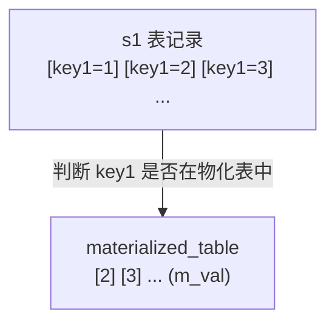
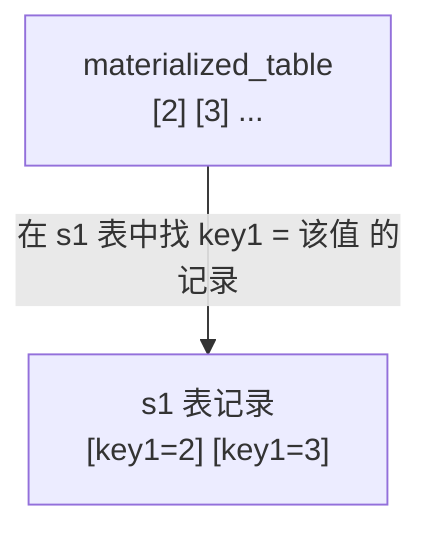
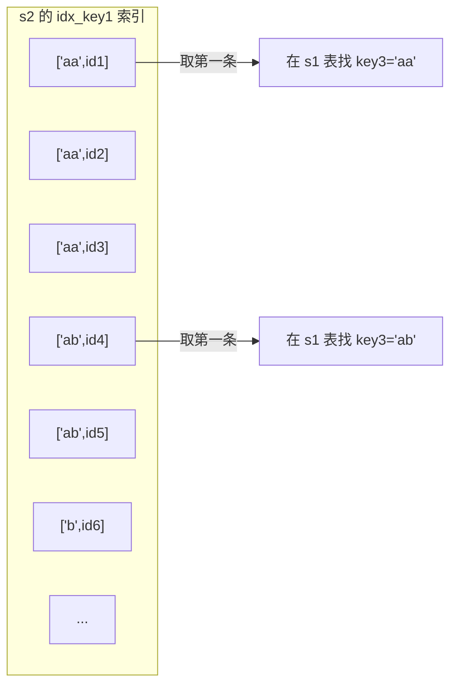

# 基于规则的优化与子查询优化

`MySQL` 本质上是一个软件，设计者不能要求使用这个软件的人都是数据库高手。也就是说无法避免某些同学写一些执行起来十分耗费性能的语句。即使是这样，设计者还是依据一些规则，尽力把这个很糟糕的语句转换成可以比较高效执行的形式，这个过程也可以称为 `查询重写`（即觉得你写的语句不好，自己再重写一遍）。本章详细介绍一些比较重要的重写规则。

## 条件化简

编写的查询语句的搜索条件本质上是一个表达式，这些表达式可能比较繁杂，或者不能高效执行，`MySQL` 的查询优化器会简化这些表达式。为方便理解，后面举例子时都用诸如 `a`、`b`、`c` 之类的简单字母代表某个表的列名。

### 移除不必要的括号

有时表达式里有许多无用的括号，比如：

```text
((a = 5 AND b = c) OR ((a > c) AND (c < 5)))
```

优化器会把那些用不到的括号干掉：

```text
(a = 5 and b = c) OR (a > c AND c < 5)
```

### 常量传递（constant_propagation）

有时某个表达式是某个列和某个常量做等值匹配，比如：

```text
a = 5
```

当这个表达式和其他涉及列 `a` 的表达式用 `AND` 连接起来时，可以将其他表达式中的 `a` 的值替换为 `5`。比如：

```text
a = 5 AND b > a
```

可以被转换为：

```text
a = 5 AND b > 5
```

::: tip 小贴士
为什么用 OR 连接起来的表达式就不能进行常量传递？可以自己思考一下。
:::

### 等值传递（equality_propagation）

有时多个列之间存在等值匹配关系，比如：

```text
a = b and b = c and c = 5
```

这个表达式可以简化为：

```text
a = 5 and b = 5 and c = 5
```

### 移除没用的条件（trivial_condition_removal）

对一些明显永远为 `TRUE` 或 `FALSE` 的表达式，优化器会移除它们。比如这个表达式：

```text
(a < 1 and b = b) OR (a = 6 OR 5 != 5)
```

很明显，`b = b` 这个表达式永远为 `TRUE`，`5 != 5` 这个表达式永远为 `FALSE`，简化后：

```text
(a < 1 and TRUE) OR (a = 6 OR FALSE)
```

可以继续简化为：

```text
a < 1 OR a = 6
```

### 表达式计算

在查询开始执行之前，如果表达式中只包含常量，它的值会被先计算出来。比如：

```text
a = 5 + 1
```

因为 `5 + 1` 只包含常量，所以会被化简成：

```text
a = 6
```

但需要注意：如果某个列并不是以单独形式作为表达式的操作数（比如出现在函数中，或出现在某个更复杂表达式中），就像这样：

```text
ABS(a) > 5
```

或者：

```text
-a < -8
```

**优化器不会尝试对这些表达式进行化简**。前面说过，只有搜索条件中索引列和常数使用某些运算符连接起来才可能使用到索引，所以如果可以的话，**最好让索引列以单独的形式出现在表达式中**。

### HAVING子句和WHERE子句的合并

如果查询语句中没有出现诸如 `SUM`、`MAX` 等的聚集函数以及 `GROUP BY` 子句，优化器就把 `HAVING` 子句和 `WHERE` 子句合并起来。

### 常量表检测

设计者觉得下面这两种查询运行得特别快：

- 查询的表中一条记录没有，或者只有一条记录。

  ::: tip 小贴士
  这个其实是依靠统计数据。不过 `InnoDB` 的统计数据不准确，所以这一条不能用于使用 `InnoDB` 作为存储引擎的表，只能适用于使用 `Memory` 或 `MyISAM` 存储引擎的表。
  :::

- 使用主键等值匹配或唯一二级索引列等值匹配作为搜索条件来查询某个表。

设计者觉得这两种查询花费的时间特别少，少到可以忽略，所以把通过这两种方式查询的表称为 `常量表`（英文名 `constant tables`）。优化器在分析一个查询语句时，首先执行常量表查询，然后把查询中涉及该表的条件全部替换成常数，最后再分析其余表的查询成本。例如这个查询语句：

```sql
SELECT * FROM table1 INNER JOIN table2
    ON table1.column1 = table2.column2
    WHERE table1.primary_key = 1;
```

很明显，这个查询可以使用主键和常量值的等值匹配来查询 `table1` 表，即在这个查询中 `table1` 表相当于 `常量表`。在分析对 `table2` 表的查询成本之前，会先执行对 `table1` 表的查询，并把查询中涉及 `table1` 表的条件都替换掉，上面的语句会被转换成这样：

```sql
SELECT table1表记录的各个字段的常量值, table2.* FROM table1 INNER JOIN table2
    ON table1表column1列的常量值 = table2.column2;
```

## 外连接消除

前面说过，`内连接` 的驱动表和被驱动表的位置可以相互转换，而 `左（外）连接` 和 `右（外）连接` 的驱动表和被驱动表是固定的。这就导致 `内连接` 可能通过优化表的连接顺序降低整体查询成本，而 `外连接` 无法优化表的连接顺序。为了便于说明，把之前介绍连接原理时用过的 `t1` 和 `t2` 表请出来，再看一下这两个表的结构：

```sql
CREATE TABLE t1 (
    m1 int,
    n1 char(1)
) Engine=InnoDB, CHARSET=utf8;

CREATE TABLE t2 (
    m2 int,
    n2 char(1)
) Engine=InnoDB, CHARSET=utf8;
```

这两个表中的数据：

```text
mysql> SELECT * FROM t1;
+------+------+
| m1   | n1   |
+------+------+
|    1 | a    |
|    2 | b    |
|    3 | c    |
+------+------+
3 rows in set (0.00 sec)

mysql> SELECT * FROM t2;
+------+------+
| m2   | n2   |
+------+------+
|    2 | b    |
|    3 | c    |
|    4 | d    |
+------+------+
3 rows in set (0.00 sec)
```

前面说过，**外连接和内连接的本质区别是：对外连接的驱动表的记录，如果无法在被驱动表中找到匹配 ON 子句中的过滤条件的记录，该记录仍会被加入结果集，对应的被驱动表记录的各个字段用 NULL 值填充；而内连接的驱动表的记录如果无法在被驱动表中找到匹配 ON 子句中的过滤条件的记录，该记录会被舍弃**。查询效果：

```text
mysql> SELECT * FROM t1 INNER JOIN t2 ON t1.m1 = t2.m2;
+------+------+------+------+
| m1   | n1   | m2   | n2   |
+------+------+------+------+
|    2 | b    |    2 | b    |
|    3 | c    |    3 | c    |
+------+------+------+------+
2 rows in set (0.00 sec)

mysql> SELECT * FROM t1 LEFT JOIN t2 ON t1.m1 = t2.m2;
+------+------+------+------+
| m1   | n1   | m2   | n2   |
+------+------+------+------+
|    2 | b    |    2 | b    |
|    3 | c    |    3 | c    |
|    1 | a    | NULL | NULL |
+------+------+------+------+
3 rows in set (0.00 sec)
```

对于上面例子中的左（外）连接，由于驱动表 `t1` 中 `m1=1, n1='a'` 的记录无法在被驱动表 `t2` 中找到符合 `ON` 子句条件 `t1.m1 = t2.m2` 的记录，所以直接把这条记录加入结果集，对应 `t2` 表的 `m2` 和 `n2` 列的值都设置为 `NULL`。

::: tip 小贴士
右（外）连接和左（外）连接其实只在驱动表的选取方式上不同，其余方面一样，所以优化器会首先把右（外）连接查询转换成左（外）连接查询。后面不再介绍右（外）连接。
:::

`WHERE` 子句的"杀伤力"比较大，**凡是不符合 WHERE 子句中条件的记录都不会参与连接**。只要在搜索条件中指定关于被驱动表相关列的值不为 `NULL`，那么外连接中在被驱动表中找不到符合 `ON` 子句条件的驱动表记录，也就被排除出最后的结果集了。也就是说：**在这种情况下，外连接和内连接也就没有什么区别了**。例如：

```text
mysql> SELECT * FROM t1 LEFT JOIN t2 ON t1.m1 = t2.m2 WHERE t2.n2 IS NOT NULL;
+------+------+------+------+
| m1   | n1   | m2   | n2   |
+------+------+------+------+
|    2 | b    |    2 | b    |
|    3 | c    |    3 | c    |
+------+------+------+------+
2 rows in set (0.01 sec)
```

由于指定了被驱动表 `t2` 的 `n2` 列不允许为 `NULL`，上面的 `t1` 和 `t2` 表的左（外）连接查询和内连接查询一样。当然，也可以不显式指定被驱动表的某个列 `IS NOT NULL`，只要隐含有这个意思就行，例如：

```text
mysql> SELECT * FROM t1 LEFT JOIN t2 ON t1.m1 = t2.m2 WHERE t2.m2 = 2;
+------+------+------+------+
| m1   | n1   | m2   | n2   |
+------+------+------+------+
|    2 | b    |    2 | b    |
+------+------+------+------+
1 row in set (0.00 sec)
```

在这个例子中，在 `WHERE` 子句中指定了被驱动表 `t2` 的 `m2` 列等于 `2`，相当于间接指定了 `m2` 列不为 `NULL` 值，所以上面的左（外）连接查询和下面这个内连接查询等价：

```text
mysql> SELECT * FROM t1 INNER JOIN t2 ON t1.m1 = t2.m2 WHERE t2.m2 = 2;
+------+------+------+------+
| m1   | n1   | m2   | n2   |
+------+------+------+------+
|    2 | b    |    2 | b    |
+------+------+------+------+
1 row in set (0.00 sec)
```

把这种"外连接查询中，指定的 `WHERE` 子句中包含被驱动表中的列不为 `NULL` 值的条件"称为 `空值拒绝`（英文名 `reject-NULL`）。**在被驱动表的 WHERE 子句符合空值拒绝的条件后，外连接和内连接可以相互转换**。这种转换带来的好处是：**查询优化器可以通过评估表的不同连接顺序的成本，选出成本最低的那种连接顺序来执行查询**。

## 子查询优化

主题本来是介绍 `MySQL` 查询优化器如何处理子查询，但很多同学可能连子查询的语法都没掌握全，所以先介绍什么是子查询（不会面面俱到，只说个大概），再介绍子查询优化。

### 子查询语法

在一个查询语句里的某个位置可以有另一个查询语句，这个出现在某个查询语句的某个位置中的查询称为 `子查询`，那个充当"外层"角色的查询称为 `外层查询`。子查询可以在一个外层查询的各种位置出现，比如：

- `SELECT` 子句中

  也就是平时说的查询列表中，比如：

```text
mysql> SELECT (SELECT m1 FROM t1 LIMIT 1);
+-----------------------------+
| (SELECT m1 FROM t1 LIMIT 1) |
+-----------------------------+
|                           1 |
+-----------------------------+
1 row in set (0.00 sec)
```

  其中的 `(SELECT m1 FROM t1 LIMIT 1)` 就是所谓的 `子查询`。

- `FROM` 子句中

  比如：

```text
mysql> SELECT m, n FROM (SELECT m2 + 1 AS m, n2 AS n FROM t2 WHERE m2 > 2) AS t;
+------+------+
| m    | n    |
+------+------+
|    4 | c    |
|    5 | d    |
+------+------+
2 rows in set (0.00 sec)
```

  这个例子中的子查询是 `(SELECT m2 + 1 AS m, n2 AS n FROM t2 WHERE m2 > 2)`，它出现在 `FROM` 子句中。`FROM` 子句存放要查询的表的名称，这里放进来一个子查询？其实可以把子查询的查询结果当作一个表，子查询后边的 `AS t` 表明这个子查询的结果相当于一个名称为 `t` 的表，这个表 `t` 的列就是子查询结果中的列。这个放在 `FROM` 子句中的子查询本质上相当于一个 `表`，但又和平常使用的表有点不一样，设计者把这种由子查询结果集组成的表称为 `派生表`。

- `WHERE` 或 `ON` 子句中

  把子查询放在外层查询的 `WHERE` 子句或 `ON` 子句中是最常用的一种使用子查询的方式，比如：

```text
mysql> SELECT * FROM t1 WHERE m1 IN (SELECT m2 FROM t2);
+------+------+
| m1   | n1   |
+------+------+
|    2 | b    |
|    3 | c    |
+------+------+
2 rows in set (0.00 sec)
```

  这个查询表明想把 `(SELECT m2 FROM t2)` 这个子查询的结果作为外层查询的 `IN` 语句参数，整个查询的意思是找 `t1` 表中某些记录，这些记录的 `m1` 列的值能在 `t2` 表的 `m2` 列找到匹配值。

- `ORDER BY` 子句中：虽然语法支持，但没有意义。
- `GROUP BY` 子句中：同上。

#### 按返回的结果集区分子查询

子查询本身也算是一个查询，可以按照返回的不同结果集类型把子查询分为不同类型：

- 标量子查询

  只返回一个单一值的子查询称为 `标量子查询`，比如：

```sql
SELECT (SELECT m1 FROM t1 LIMIT 1);
```

  或：

```sql
SELECT * FROM t1 WHERE m1 = (SELECT MIN(m2) FROM t2);
```

  这两个查询语句中的子查询都返回一个单一值（一个 `标量`）。这些标量子查询可以作为一个单一值或表达式的一部分出现在查询语句的各个地方。

- 行子查询

  返回一条记录的子查询，不过这条记录需要包含多个列（只包含一个列就成了标量子查询）。比如：

```sql
SELECT * FROM t1 WHERE (m1, n1) = (SELECT m2, n2 FROM t2 LIMIT 1);
```

  其中的 `(SELECT m2, n2 FROM t2 LIMIT 1)` 是一个行子查询，整条语句的含义是要从 `t1` 表中找一些记录，这些记录的 `m1` 和 `n1` 列分别等于子查询结果中的 `m2` 和 `n2` 列。

- 列子查询

  查询出一个列的数据，不过这个列的数据需要包含多条记录（只包含一条记录就成了标量子查询）。比如：

```sql
SELECT * FROM t1 WHERE m1 IN (SELECT m2 FROM t2);
```

  其中的 `(SELECT m2 FROM t2)` 是一个列子查询，查询出 `t2` 表的 `m2` 列的值作为外层查询 `IN` 语句的参数。

- 表子查询

  子查询的结果既包含很多条记录，又包含很多个列，比如：

```sql
SELECT * FROM t1 WHERE (m1, n1) IN (SELECT m2, n2 FROM t2);
```

  其中的 `(SELECT m2, n2 FROM t2)` 是一个表子查询。需要和行子查询对比：行子查询中用 `LIMIT 1` 保证子查询结果只有一条记录，表子查询中不需要这个限制。

#### 按与外层查询关系来区分子查询

- 不相关子查询

  如果子查询可以单独运行出结果，不依赖于外层查询的值，这个子查询称为 `不相关子查询`。前面介绍的那些子查询都可以看作不相关子查询。

- 相关子查询

  如果子查询的执行需要依赖于外层查询的值，这个子查询称为 `相关子查询`。比如：

```sql
SELECT * FROM t1 WHERE m1 IN (SELECT m2 FROM t2 WHERE n1 = n2);
```

  例子中的子查询是 `(SELECT m2 FROM t2 WHERE n1 = n2)`，这个查询中有一个搜索条件是 `n1 = n2`，`n1` 是表 `t1` 的列（外层查询的列），子查询的执行依赖于外层查询的值，所以这个子查询是一个 `相关子查询`。

#### 子查询在布尔表达式中的使用

平时用子查询最多的地方是把它作为布尔表达式的一部分，作为搜索条件用在 `WHERE` 子句或 `ON` 子句里。总结一下子查询在布尔表达式中的使用场景。

- 使用 `=`、`>`、`<`、`>=`、`<=`、`<>`、`!=`、`<=>` 作为布尔表达式的操作符

  把这些操作符称为 `comparison_operator`，子查询组成的布尔表达式长这样：

```sql
操作数 comparison_operator (子查询)
```

  这里的 `操作数` 可以是某个列名、一个常量、一个更复杂的表达式，甚至是另一个子查询。但需要注意：**这里的子查询只能是标量子查询或行子查询，即子查询的结果只能返回一个单一值或一条记录**。比如（标量子查询）：

```sql
SELECT * FROM t1 WHERE m1 < (SELECT MIN(m2) FROM t2);
```

  或（行子查询）：

```sql
SELECT * FROM t1 WHERE (m1, n1) = (SELECT m2, n2 FROM t2 LIMIT 1);
```

- `[NOT] IN/ANY/SOME/ALL` 子查询

  对列子查询和表子查询，结果集中包含很多条记录，相当于一个集合，所以不能单纯和另一个操作数用 `comparison_operator` 组成布尔表达式。`MySQL` 通过下面的语法支持某个操作数和一个集合组成布尔表达式：

  - `IN` 或 `NOT IN`

    语法形式：

```sql
操作数 [NOT] IN (子查询)
```

    这个布尔表达式用来判断某个操作数在不在由子查询结果集组成的集合中。比如下面的查询是找出 `t1` 表中的某些记录，这些记录存在于子查询的结果集中：

```sql
SELECT * FROM t1 WHERE (m1, n1) IN (SELECT m2, n2 FROM t2);
```

  - `ANY/SOME`（`ANY` 和 `SOME` 是同义词）

    语法形式：

```sql
操作数 comparison_operator ANY/SOME(子查询)
```

    这个布尔表达式的意思是：只要子查询结果集中存在某个值，和给定操作数做 `comparison_operator` 比较结果为 `TRUE`，整个表达式结果就为 `TRUE`，否则为 `FALSE`。例如：

```sql
SELECT * FROM t1 WHERE m1 > ANY(SELECT m2 FROM t2);
```

    这个查询的意思是：对 `t1` 表的某条记录的 `m1` 列的值，如果子查询 `(SELECT m2 FROM t2)` 的结果集中存在一个小于 `m1` 列的值，整个布尔表达式的值就是 `TRUE`，否则为 `FALSE`。也就是说只要 `m1` 列的值大于子查询结果集中最小的值，整个表达式结果就是 `TRUE`。所以上面的查询本质上等价于：

```sql
SELECT * FROM t1 WHERE m1 > (SELECT MIN(m2) FROM t2);
```

    另外，**`=ANY` 相当于判断子查询结果集中是否存在某个值和给定操作数相等，它的含义和 IN 相同**。

  - `ALL`

    语法形式：

```sql
操作数 comparison_operator ALL(子查询)
```

    这个布尔表达式的意思是：子查询结果集中所有的值和给定操作数做 `comparison_operator` 比较结果都为 `TRUE`，整个表达式结果才为 `TRUE`，否则为 `FALSE`。例如：

```sql
SELECT * FROM t1 WHERE m1 > ALL(SELECT m2 FROM t2);
```

    这个查询的意思是：对 `t1` 表的某条记录的 `m1` 列的值，如果子查询 `(SELECT m2 FROM t2)` 的结果集中的所有值都小于 `m1` 列的值，整个布尔表达式的值就是 `TRUE`，否则为 `FALSE`。也就是说只要 `m1` 列的值大于子查询结果集中最大的值，整个表达式结果就是 `TRUE`。所以上面的查询本质上等价于：

```sql
SELECT * FROM t1 WHERE m1 > (SELECT MAX(m2) FROM t2);
```

    ::: tip 小贴士
    觉得 ANY 和 ALL 有点晕的同学多看两遍。
    :::

- EXISTS 子查询

  有时仅仅需要判断子查询的结果集中是否有记录，而不在乎具体是什么，可以把 `EXISTS` 或 `NOT EXISTS` 放在子查询语句前边：

```sql
[NOT] EXISTS (子查询)
```

  举一个例子：

```sql
SELECT * FROM t1 WHERE EXISTS (SELECT 1 FROM t2);
```

  对子查询 `(SELECT 1 FROM t2)`，并不关心它最后查询出的结果是什么，查询列表里填 `*`、某个列名或其他什么都无所谓，真正关心的是子查询的结果集中是否存在记录。只要 `(SELECT 1 FROM t2)` 这个查询中有记录，整个 `EXISTS` 表达式的结果就为 `TRUE`。

#### 子查询语法注意事项

- 子查询必须用小括号扩起来。不扩起来是非法的，比如：

```text
mysql> SELECT SELECT m1 FROM t1;

ERROR 1064 (42000): You have an error in your SQL syntax; check the manual that corresponds to your MySQL server version for the right syntax to use near 'SELECT m1 FROM t1' at line 1
```

- 在 `SELECT` 子句中的子查询必须是标量子查询。如果子查询结果集中有多个列或多个行，都不允许放在 `SELECT` 子句中，比如这样是非法的：

```text
mysql> SELECT (SELECT m1, n1 FROM t1);

ERROR 1241 (21000): Operand should contain 1 column(s)
```

- 在想要得到标量子查询或行子查询、但又不能保证子查询的结果集只有一条记录时，应该使用 `LIMIT 1` 语句限制记录数量。
- 对 `[NOT] IN/ANY/SOME/ALL` 子查询，子查询中不允许有 `LIMIT` 语句。比如这样是非法的：

```text
mysql> SELECT * FROM t1 WHERE m1 IN (SELECT * FROM t2 LIMIT 2);

ERROR 1235 (42000): This version of MySQL doesn't yet support 'LIMIT & IN/ALL/ANY/SOME subquery'
```

  正因为 `[NOT] IN/ANY/SOME/ALL` 子查询不支持 `LIMIT` 语句，子查询中的下面这些语句也是多余的：

  - `ORDER BY` 子句

    子查询的结果相当于一个集合，集合里的值排不排序不重要。比如下面语句中的 `ORDER BY` 子句就是画蛇添足：

```sql
SELECT * FROM t1 WHERE m1 IN (SELECT m2 FROM t2 ORDER BY m2);
```

  - `DISTINCT` 语句

    集合里的值去不去重也没意义，比如：

```sql
SELECT * FROM t1 WHERE m1 IN (SELECT DISTINCT m2 FROM t2);
```

  - 没有聚集函数以及 `HAVING` 子句的 `GROUP BY` 子句

    在没有聚集函数以及 `HAVING` 子句时，`GROUP BY` 子句就是个摆设，比如：

```sql
SELECT * FROM t1 WHERE m1 IN (SELECT m2 FROM t2 GROUP BY m2);
```

  对这些冗余语句，**查询优化器在一开始就把它们干掉了**。

- 不允许在一条语句中增删改某个表的记录时，同时对该表进行子查询。比如：

```text
mysql> DELETE FROM t1 WHERE m1 < (SELECT MAX(m1) FROM t1);

ERROR 1093 (HY000): You can't specify target table 't1' for update in FROM clause
```

### 子查询在MySQL中是怎么执行的

基础语法先温习到这里，下面介绍具体某种类型的子查询在 `MySQL` 中是怎么执行的。为了便于说明，继续使用 `single_table` 表：

```sql
CREATE TABLE single_table (
    id INT NOT NULL AUTO_INCREMENT,
    key1 VARCHAR(100),
    key2 INT,
    key3 VARCHAR(100),
    key_part1 VARCHAR(100),
    key_part2 VARCHAR(100),
    key_part3 VARCHAR(100),
    common_field VARCHAR(100),
    PRIMARY KEY (id),
    KEY idx_key1 (key1),
    UNIQUE KEY idx_key2 (key2),
    KEY idx_key3 (key3),
    KEY idx_key_part(key_part1, key_part2, key_part3)
) Engine=InnoDB CHARSET=utf8;
```

为了方便，假设有两个表 `s1`、`s2` 与 `single_table` 表的构造相同，这两个表里有 10000 条记录，除 `id` 列外其余列都插入随机值。

#### 小白们眼中子查询的执行方式

很多人觉得子查询的执行方式是这样的：

- 如果该子查询是不相关子查询，比如下面这个查询：

```sql
SELECT * FROM s1
    WHERE key1 IN (SELECT common_field FROM s2);
```

  很多人觉得这个查询的执行方式是这样的：

  - 先单独执行 `(SELECT common_field FROM s2)` 这个子查询；
  - 然后子查询得到的结果当作外层查询的参数，再执行外层查询 `SELECT * FROM s1 WHERE key1 IN (...)`。

- 如果该子查询是相关子查询，比如下面这个查询：

```sql
SELECT * FROM s1
    WHERE key1 IN (SELECT common_field FROM s2 WHERE s1.key2 = s2.key2);
```

  这个查询中的子查询出现了 `s1.key2 = s2.key2` 这样的条件，意味着子查询的执行依赖外层查询的值，所以很多人觉得执行方式是这样的：

  - 先从外层查询中获取一条记录，本例中先从 `s1` 表中获取一条记录；
  - 从上一步骤获取的记录中找出子查询涉及到的值（本例从 `s1` 表获取的记录中找出 `s1.key2` 列的值），然后执行子查询；
  - 根据子查询的查询结果检测外层查询 `WHERE` 子句的条件是否成立，成立就把外层查询的那条记录加入结果集，否则丢弃；
  - 再次执行第一步，获取第二条外层查询中的记录，依次类推。

其实设计者想了一系列办法优化子查询的执行，大部分情况下这些优化措施挺有效，但也不总是这样。下面详细介绍各种不同类型的子查询具体是怎么执行的。

::: tip 小贴士
下面关于 MySQL 优化子查询执行方式的内容都是基于 MySQL 5.7 版本，以后的版本可能有更新的优化策略。
:::

#### 标量子查询、行子查询的执行方式

经常在下面两个场景中使用标量子查询或行子查询：

- `SELECT` 子句中：前面说过，查询列表中的子查询必须是标量子查询；
- 子查询使用 `=`、`>`、`<`、`>=`、`<=`、`<>`、`!=`、`<=>` 等操作符和某个操作数组成一个布尔表达式，这样的子查询必须是标量子查询或行子查询。

对上述两种场景中的**不相关**标量子查询或行子查询，执行方式简单。例如下面这个查询：

```sql
SELECT * FROM s1
    WHERE key1 = (SELECT common_field FROM s2 WHERE key3 = 'a' LIMIT 1);
```

执行方式：

- 先单独执行 `(SELECT common_field FROM s2 WHERE key3 = 'a' LIMIT 1)` 这个子查询；
- 然后子查询得到的结果当作外层查询的参数，再执行外层查询 `SELECT * FROM s1 WHERE key1 = ...`。

也就是说，**对包含不相关的标量子查询或行子查询的查询语句，MySQL 会分别独立执行外层查询和子查询，当作两个单表查询即可**。

对**相关**的标量子查询或行子查询，比如下面这个查询：

```sql
SELECT * FROM s1 WHERE
    key1 = (SELECT common_field FROM s2 WHERE s1.key3 = s2.key3 LIMIT 1);
```

执行方式：

- 先从外层查询中获取一条记录，本例中先从 `s1` 表中获取一条记录；
- 从上一步骤获取的记录中找出子查询涉及到的值（本例找出 `s1.key3` 列的值），然后执行子查询；
- 根据子查询的查询结果检测外层查询 `WHERE` 子句的条件是否成立，成立就把外层查询的那条记录加入结果集，否则丢弃；
- 再次执行第一步，获取第二条外层查询中的记录，依次类推。

也就是说，对一开始介绍的两种使用标量子查询以及行子查询的场景，`MySQL` 优化器的执行方式并没有特别之处。

#### IN子查询优化

##### 物化表的提出

对不相关的 `IN` 子查询，比如：

```sql
SELECT * FROM s1
    WHERE key1 IN (SELECT common_field FROM s2 WHERE key3 = 'a');
```

最开始的感觉是这种不相关的 `IN` 子查询和不相关的标量子查询或行子查询一样，都把外层查询和子查询当作两个独立的单表查询。但设计者为优化 `IN` 子查询倾注了很多心血（`IN` 子查询是最常用的子查询类型），整个执行过程并不像想象的那么简单。

其实对不相关的 `IN` 子查询，如果子查询的结果集中的记录条数很少，把子查询和外层查询分别看成两个单独的单表查询，效率还是蛮高的。但如果单独执行子查询后的结果集太多，就会导致这些问题：

- 结果集太多，可能内存中都放不下；
- 对外层查询来说，如果子查询的结果集太多，意味着 `IN` 子句中的参数特别多，这会导致：
  - 无法有效使用索引，只能对外层查询进行全表扫描；
  - 对外层查询执行全表扫描时，由于 `IN` 子句中的参数太多，检测一条记录是否符合 `IN` 子句中的参数匹配会花费太长时间。

  比如 `IN` 子句中的参数只有两个：

```sql
SELECT * FROM tbl_name WHERE column IN (a, b);
```

  这样相当于需要对 `tbl_name` 表中的每条记录判断它的 `column` 列是否符合 `column = a OR column = b`。`IN` 子句中的参数比较少时这不是什么问题，如果参数比较多：

```sql
SELECT * FROM tbl_name WHERE column IN (a, b, c ..., ...);
```

  那么每条记录需要判断它的 `column` 列是否符合 `column = a OR column = b OR column = c OR ...`，性能耗费就多了。

于是设计者想了一个办法：**不直接将不相关子查询的结果集当作外层查询的参数，而是将该结果集写入一个临时表里**。写入临时表的过程：

- 该临时表的列就是子查询结果集中的列；
- 写入临时表的记录会被去重。

  `IN` 语句是判断某个操作数在不在某个集合中，集合中的值重不重复对整个 `IN` 语句的结果没有关系，所以将结果集写入临时表时对记录去重，可以让临时表更小、更省地方。

  ::: tip 小贴士
  临时表如何对记录去重？临时表也是个表，只要为表中记录的所有列建立主键或唯一索引就可以了。
  :::

- 一般情况下子查询结果集不会大得离谱，所以会为它建立基于内存的、使用 `Memory` 存储引擎的临时表，并为该表建立哈希索引。

  ::: tip 小贴士
  IN 语句的本质是判断某个操作数在不在某个集合里，如果集合中的数据建立了哈希索引，匹配过程会超级快。

  关于哈希索引，这里不展开，可以自己查阅相关资料。
  :::

  如果子查询的结果集非常大，超过系统变量 `tmp_table_size` 或 `max_heap_table_size`，临时表会转而使用基于磁盘的存储引擎保存结果集中的记录，索引类型也对应转变为 `B+` 树索引。

设计者把这个将子查询结果集中的记录保存到临时表的过程称为 `物化`（英文名 `Materialize`）。为方便，把存储子查询结果集的临时表称为 `物化表`。正因为物化表中的记录都建立了索引（基于内存的物化表有哈希索引，基于磁盘的有 B+ 树索引），通过索引执行 `IN` 语句判断某个操作数在不在子查询结果集中变得非常快，从而提升了子查询语句的性能。

##### 物化表转连接

重新审视最开始的那个查询语句：

```sql
SELECT * FROM s1
    WHERE key1 IN (SELECT common_field FROM s2 WHERE key3 = 'a');
```

把子查询进行物化后，假设子查询物化表的名称为 `materialized_table`，该物化表存储的子查询结果集的列为 `m_val`，那么这个查询可以从下面两种角度来看待：

- 从表 `s1` 的角度看：对 `s1` 表中的每条记录，如果该记录的 `key1` 列的值在子查询对应的物化表中，则该记录被加入最终结果集。



- 从子查询物化表的角度看：对子查询物化表的每个值，如果能在 `s1` 表中找到对应的 `key1` 列的值与该值相等的记录，就把这些记录加入最终结果集。



也就是说，上面的查询其实就相当于表 `s1` 和子查询物化表 `materialized_table` 进行内连接：

```sql
SELECT s1.* FROM s1 INNER JOIN materialized_table ON key1 = m_val;
```

转化成内连接之后就有意思了：查询优化器可以评估不同连接顺序需要的成本，选取成本最低的查询方式执行查询。分析上述查询中使用外层查询的表 `s1` 和物化表 `materialized_table` 进行内连接的成本由哪几部分组成：

- 如果使用 `s1` 表作为驱动表，总查询成本由下面几个部分组成：

  - 物化子查询时需要的成本；
  - 扫描 `s1` 表时的成本；
  - `s1` 表中的记录数量 × 通过 `m_val = xxx` 对 `materialized_table` 表进行单表访问的成本（物化表中的记录不重复，并且为物化表中的列建立了索引，所以这个步骤非常快）。

- 如果使用 `materialized_table` 表作为驱动表，总查询成本由下面几个部分组成：

  - 物化子查询时需要的成本；
  - 扫描物化表时的成本；
  - 物化表中的记录数量 × 通过 `key1 = xxx` 对 `s1` 表进行单表访问的成本（`key1` 列上建立了索引，所以这个步骤非常快）。

`MySQL` 查询优化器会通过运算选择上述成本更低的方案来执行查询。

##### 将子查询转换为semi-join

将子查询物化之后再执行查询，会有建立临时表的成本。但不管怎么说，见识到了将子查询转换为连接的强大作用。设计者继续开脑洞：能不能不进行物化操作，直接把子查询转换为连接？重新审视上面的查询语句：

```sql
SELECT * FROM s1
    WHERE key1 IN (SELECT common_field FROM s2 WHERE key3 = 'a');
```

可以把这个查询理解成：对 `s1` 表中的某条记录，如果能在 `s2` 表（准确说是执行完 `WHERE s2.key3 = 'a'` 之后的结果集）中找到一条或多条记录，这些记录的 `common_field` 的值等于 `s1` 表记录的 `key1` 列的值，那么这条 `s1` 表的记录就被加入最终结果集。这个过程其实和把 `s1`、`s2` 两个表连接起来的效果很像：

```sql
SELECT s1.* FROM s1 INNER JOIN s2
    ON s1.key1 = s2.common_field
    WHERE s2.key3 = 'a';
```

只不过不能保证对 `s1` 表的某条记录，`s2` 表（执行完 `WHERE s2.key3 = 'a'` 之后的结果集）中有多少条记录满足 `s1.key1 = s2.common_field` 这个条件，分三种情况讨论：

- 情况一：对 `s1` 表的某条记录，`s2` 表中**没有**任何记录满足 `s1.key1 = s2.common_field` 这个条件，那么该记录自然也不会加入最后的结果集。
- 情况二：对 `s1` 表的某条记录，`s2` 表中**有且只有**记录满足 `s1.key1 = s2.common_field` 这个条件，那么该记录被加入最终结果集。
- 情况三：对 `s1` 表的某条记录，`s2` 表中**至少有 2 条**记录满足 `s1.key1 = s2.common_field` 这个条件，那么该记录会被**多次**加入最终结果集。

对 `s1` 表的某条记录，我们只关心 `s2` 表中**是否存在**记录满足 `s1.key1 = s2.common_field` 这个条件，**不关心具体有多少条记录与之匹配**。又因为有 `情况三`，上面所说的 `IN` 子查询和两表连接之间并不完全等价。但将子查询转换为连接又真的可以充分发挥优化器的作用，所以设计者在这里提出一个新概念：`半连接`（英文名 `semi-join`）。将 `s1` 表和 `s2` 表进行半连接的意思是：**对 `s1` 表的某条记录，只关心在 `s2` 表中是否存在与之匹配的记录，而不关心具体有多少条记录与之匹配，最终的结果集中只保留 `s1` 表的记录**。假设 `MySQL` 内部是这样改写上面的子查询的：

```sql
SELECT s1.* FROM s1 SEMI JOIN s2
    ON s1.key1 = s2.common_field
    WHERE key3 = 'a';
```

::: tip 小贴士
semi-join 只是在 MySQL 内部采用的一种执行子查询的方式，MySQL 并没有提供面向用户的 semi-join 语法，所以不需要、也不能尝试把上面这个语句放到命令行里运行，这里只是想说明上面的子查询在 MySQL 内部会被转换为类似上面语句的半连接。
:::

概念有了，怎么实现这种所谓的 `半连接`？设计者准备了好几种办法。

- Table pullout（子查询中的表上拉）

  当**子查询的查询列表处只有主键或唯一索引列**时，可以直接把子查询中的表 `上拉` 到外层查询的 `FROM` 子句中，并把子查询中的搜索条件合并到外层查询的搜索条件中。比如：

```sql
SELECT * FROM s1
    WHERE key2 IN (SELECT key2 FROM s2 WHERE key3 = 'a');
```

  由于 `key2` 列是 `s2` 表的唯一二级索引列，可以直接把 `s2` 表上拉到外层查询的 `FROM` 子句中，并把子查询中的搜索条件合并到外层查询的搜索条件中。上拉之后的查询：

```sql
SELECT s1.* FROM s1 INNER JOIN s2
    ON s1.key2 = s2.key2
    WHERE s2.key3 = 'a';
```

  为什么当子查询的查询列表处只有主键或唯一索引列时，可以直接将子查询转换为连接查询？主键或唯一索引列中的数据本身就不重复，所以对同一条 `s1` 表中的记录，不可能找到两条以上符合 `s1.key2 = s2.key2` 的记录。

- DuplicateWeedout execution strategy（重复值消除）

  对下面这个查询：

```sql
SELECT * FROM s1
    WHERE key1 IN (SELECT common_field FROM s2 WHERE key3 = 'a');
```

  转换为半连接查询后，`s1` 表中的某条记录可能在 `s2` 表中有多条匹配记录，所以该条记录可能多次被添加到结果集中。为消除重复，可以建立一个以 `s1` 表主键值为列的临时表：

```sql
CREATE TABLE tmp (
    id INT PRIMARY KEY
);
```

  在执行连接查询的过程中，每当某条 `s1` 表中的记录要加入结果集时，先把这条记录的 `id` 值加入这个临时表。如果添加成功，说明之前这条 `s1` 表的记录没有加入最终结果集，现在把该记录添加到最终结果集；如果添加失败，说明这条记录之前已加入过最终结果集，直接丢弃。这种使用临时表消除 `semi-join` 结果集中的重复值的方式称为 `DuplicateWeedout`。

- LooseScan execution strategy（松散索引扫描）

  看这个查询：

```sql
SELECT * FROM s1
    WHERE key3 IN (SELECT key1 FROM s2 WHERE key1 > 'a' AND key1 < 'b');
```

  在子查询中，对 `s2` 表的访问可以使用 `key1` 列的索引，而恰好子查询的查询列表处就是 `key1` 列。在将该查询转换为半连接查询后，如果将 `s2` 作为驱动表执行查询，执行过程：



  在 `s2` 表的 `idx_key1` 索引中，值为 `'aa'` 的二级索引记录有 3 条，只需取第一条的值到 `s1` 表中查找 `s1.key3 = 'aa'` 的记录，如果能在 `s1` 表中找到对应记录，就把对应记录加入结果集。依此类推，其他值相同的二级索引记录也只取第一条记录的值到 `s1` 表中找匹配记录。这种虽然扫描索引，但只取相同记录的第一条去做匹配操作的方式称为 `松散索引扫描`。

- Semi-join Materialization execution strategy

  前面介绍的先把外层查询的 `IN` 子句中的不相关子查询进行物化，然后再进行外层查询的表和物化表的连接，本质上也算是一种 `semi-join`，只不过物化表中没有重复记录，所以可以直接将子查询转为连接查询。

- FirstMatch execution strategy（首次匹配）

  `FirstMatch` 是一种最原始的半连接执行方式，与"相关子查询的执行方式"一样：先取一条外层查询的记录，然后到子查询的表中寻找符合匹配条件的记录。如果能找到一条，则将该外层查询的记录放入最终结果集并停止查找更多匹配记录；如果找不到，把该外层查询的记录丢弃。然后再开始取下一条外层查询的记录，重复上述过程。

对某些使用 `IN` 语句的**相关**子查询，比如：

```sql
SELECT * FROM s1
    WHERE key1 IN (SELECT common_field FROM s2 WHERE s1.key3 = s2.key3);
```

它也可以很方便地转为半连接，转换后的语句类似：

```sql
SELECT s1.* FROM s1 SEMI JOIN s2
    ON s1.key1 = s2.common_field AND s1.key3 = s2.key3;
```

然后就可以使用上面介绍过的 `DuplicateWeedout`、`LooseScan`、`FirstMatch` 等半连接执行策略来执行查询。当然，如果子查询的查询列表处只有主键或唯一二级索引列，还可以直接使用 `table pullout` 的策略。但需要注意：**由于相关子查询不是一个独立的查询，所以不能转换为物化表来执行查询**。

##### semi-join的适用条件

并不是所有包含 `IN` 子查询的查询语句都可以转换为 `semi-join`，只有形如这样的查询才可以：

```sql
SELECT ... FROM outer_tables
    WHERE expr IN (SELECT ... FROM inner_tables ...) AND ...
```

或者这样的形式也可以：

```sql
SELECT ... FROM outer_tables
    WHERE (oe1, oe2, ...) IN (SELECT ie1, ie2, ... FROM inner_tables ...) AND ...
```

只有符合下面这些条件的子查询才可以被转换为 `semi-join`：

- 该子查询必须是用 `IN` 语句组成的布尔表达式，并且在外层查询的 `WHERE` 或 `ON` 子句中出现；
- 外层查询也可以有其他的搜索条件，只不过和 `IN` 子查询的搜索条件必须用 `AND` 连接起来；
- 该子查询必须是一个单一的查询，不能是由若干查询用 `UNION` 连接起来的形式；
- 该子查询不能包含 `GROUP BY` 或 `HAVING` 语句或聚集函数；
- 还有一些条件比较少见。

##### 不适用于semi-join的情况

对一些不能将子查询转为 `semi-join` 的情况，典型的有下面这几种：

- 外层查询的 WHERE 条件中有其他搜索条件与 IN 子查询组成的布尔表达式用 `OR` 连接起来：

```sql
SELECT * FROM s1
    WHERE key1 IN (SELECT common_field FROM s2 WHERE key3 = 'a')
        OR key2 > 100;
```

- 使用 `NOT IN` 而不是 `IN` 的情况：

```sql
SELECT * FROM s1
    WHERE key1 NOT IN (SELECT common_field FROM s2 WHERE key3 = 'a')
```

- 在 `SELECT` 子句中的 IN 子查询的情况：

```sql
SELECT key1 IN (SELECT common_field FROM s2 WHERE key3 = 'a') FROM s1 ;
```

- 子查询中包含 `GROUP BY`、`HAVING` 或聚集函数的情况：

```sql
SELECT * FROM s1
    WHERE key2 IN (SELECT COUNT(*) FROM s2 GROUP BY key1);
```

- 子查询中包含 `UNION` 的情况：

```sql
SELECT * FROM s1 WHERE key1 IN (
    SELECT common_field FROM s2 WHERE key3 = 'a'
    UNION
    SELECT common_field FROM s2 WHERE key3 = 'b'
);
```

`MySQL` 仍然留了两手绝活来优化不能转为 `semi-join` 查询的子查询：

- 对不相关子查询，可以尝试把它们物化之后再参与查询

  比如上面提到的这个查询：

```sql
SELECT * FROM s1
    WHERE key1 NOT IN (SELECT common_field FROM s2 WHERE key3 = 'a')
```

  先将子查询物化，再判断 `key1` 是否在物化表的结果集中，可以加快查询执行速度。

  ::: tip 小贴士
  请注意，这里将子查询物化之后不能转为和外层查询的表的连接，只能是先扫描 s1 表，然后对 s1 表的某条记录，判断该记录的 key1 值在不在物化表中。
  :::

- 不管子查询是相关的还是不相关的，都可以把 `IN` 子查询尝试转为 `EXISTS` 子查询

  其实对任意一个 IN 子查询，都可以被转为 `EXISTS` 子查询，通用的例子：

```sql
outer_expr IN (SELECT inner_expr FROM ... WHERE subquery_where)
```

  可以被转换为：

```sql
EXISTS (SELECT inner_expr FROM ... WHERE subquery_where AND outer_expr=inner_expr)
```

  这个过程中有一些特殊情况，比如 `outer_expr` 或 `inner_expr` 值为 `NULL` 的情况下比较特殊。因为有 `NULL` 值作为操作数的表达式结果往往是 `NULL`，比方说：

```text
mysql> SELECT NULL IN (1, 2, 3);
+-------------------+
| NULL IN (1, 2, 3) |
+-------------------+
|              NULL |
+-------------------+
1 row in set (0.00 sec)

mysql> SELECT 1 IN (1, 2, 3);
+----------------+
| 1 IN (1, 2, 3) |
+----------------+
|              1 |
+----------------+
1 row in set (0.00 sec)

mysql> SELECT NULL IN (NULL);
+----------------+
| NULL IN (NULL) |
+----------------+
|           NULL |
+----------------+
1 row in set (0.00 sec)
```

  而 `EXISTS` 子查询的结果肯定是 `TRUE` 或 `FALSE`：

```text
mysql> SELECT EXISTS (SELECT 1 FROM s1 WHERE NULL = 1);
+------------------------------------------+
| EXISTS (SELECT 1 FROM s1 WHERE NULL = 1) |
+------------------------------------------+
|                                        0 |
+------------------------------------------+
1 row in set (0.01 sec)

mysql> SELECT EXISTS (SELECT 1 FROM s1 WHERE 1 = NULL);
+------------------------------------------+
| EXISTS (SELECT 1 FROM s1 WHERE 1 = NULL) |
+------------------------------------------+
|                                        0 |
+------------------------------------------+
1 row in set (0.00 sec)

mysql> SELECT EXISTS (SELECT 1 FROM s1 WHERE NULL = NULL);
+---------------------------------------------+
| EXISTS (SELECT 1 FROM s1 WHERE NULL = NULL) |
+---------------------------------------------+
|                                           0 |
+---------------------------------------------+
1 row in set (0.00 sec)
```

  但幸运的是，大部分使用 `IN` 子查询的场景是把它放在 `WHERE` 或 `ON` 子句中，而 `WHERE` 或 `ON` 子句不区分 `NULL` 和 `FALSE`：

```text
mysql> SELECT 1 FROM s1 WHERE NULL;
Empty set (0.00 sec)

mysql> SELECT 1 FROM s1 WHERE FALSE;
Empty set (0.00 sec)
```

  所以只要 `IN` 子查询放在 `WHERE` 或 `ON` 子句中，`IN -> EXISTS` 的转换就没问题。为什么要转换？因为不转换的话可能用不到索引。比如下面这个查询：

```sql
SELECT * FROM s1
    WHERE key1 IN (SELECT key3 FROM s2 where s1.common_field = s2.common_field)
        OR key2 > 1000;
```

  这个查询中的子查询是一个相关子查询，子查询执行时不能使用索引，但将它转为 `EXISTS` 子查询后却可以使用索引：

```sql
SELECT * FROM s1
    WHERE EXISTS (SELECT 1 FROM s2 where s1.common_field = s2.common_field AND s2.key3 = s1.key1)
        OR key2 > 1000;
```

  转为 `EXISTS` 子查询时便可以使用 `s2` 表的 `idx_key3` 索引了。

  需要注意：如果 `IN` 子查询不满足转换为 `semi-join` 的条件，又不能转换为物化表或转换为物化表的成本太大，那么它就会被转换为 `EXISTS` 查询。

  ::: tip 小贴士
  在 MySQL 5.5 及之前的版本没有引进 semi-join 和物化的方式优化子查询时，优化器都会把 IN 子查询转换为 EXISTS 子查询，很多同学会惊呼：明明写的是一个不相关子查询，为什么要按照执行相关子查询的方式来执行？所以当时很多声音都建议大家把子查询转为连接。不过随着 MySQL 的发展，最近的版本引入了非常多的子查询优化策略，可以稍微放心地使用子查询，内部转换工作优化器会自动实现。
  :::

##### 小结一下

- 如果 `IN` 子查询符合转换为 `semi-join` 的条件，查询优化器会优先把该子查询转为 `semi-join`，然后再考虑下面 5 种执行半连接的策略中哪个成本最低：
  - Table pullout
  - DuplicateWeedout
  - LooseScan
  - Materialization
  - FirstMatch

  选择成本最低的那种执行策略来执行子查询。

- 如果 `IN` 子查询不符合转换为 `semi-join` 的条件，查询优化器会从下面两种策略中找出一种成本更低的方式执行子查询：
  - 先将子查询物化之后再执行查询；
  - 执行 `IN to EXISTS` 转换。

#### ANY/ALL子查询优化

如果 ANY/ALL 子查询是不相关子查询，它们在很多场合都能转换成熟悉的方式去执行，比如：

| 原始表达式 | 转换为 |
|:--:|:--:|
| `< ANY (SELECT inner_expr ...)` | `< (SELECT MAX(inner_expr) ...)` |
| `> ANY (SELECT inner_expr ...)` | `> (SELECT MIN(inner_expr) ...)` |
| `< ALL (SELECT inner_expr ...)` | `< (SELECT MIN(inner_expr) ...)` |
| `> ALL (SELECT inner_expr ...)` | `> (SELECT MAX(inner_expr) ...)` |

#### [NOT] EXISTS子查询的执行

如果 `[NOT] EXISTS` 子查询是不相关子查询，可以先执行子查询，得出该 `[NOT] EXISTS` 子查询的结果是 `TRUE` 还是 `FALSE`，并重写原先的查询语句。比如对这个查询：

```sql
SELECT * FROM s1
    WHERE EXISTS (SELECT 1 FROM s2 WHERE key1 = 'a')
        OR key2 > 100;
```

因为这个语句里的子查询是不相关子查询，优化器会首先执行该子查询。假设该 EXISTS 子查询的结果为 `TRUE`，接着优化器会重写查询为：

```sql
SELECT * FROM s1
    WHERE TRUE OR key2 > 100;
```

进一步简化后就变成：

```sql
SELECT * FROM s1
    WHERE TRUE;
```

对相关的 `[NOT] EXISTS` 子查询，比如：

```sql
SELECT * FROM s1
    WHERE EXISTS (SELECT 1 FROM s2 WHERE s1.common_field = s2.common_field);
```

这个查询只能按照"相关子查询"的方式执行。不过如果 `[NOT] EXISTS` 子查询中可以使用索引，查询速度也会加快不少，比如：

```sql
SELECT * FROM s1
    WHERE EXISTS (SELECT 1 FROM s2 WHERE s1.common_field = s2.key1);
```

上面这个 `EXISTS` 子查询中可以使用 `idx_key1` 加快查询速度。

#### 对于派生表的优化

把子查询放在外层查询的 `FROM` 子句后，这个子查询的结果相当于一个 `派生表`。比如下面这个查询：

```sql
SELECT * FROM  (
        SELECT id AS d_id,  key3 AS d_key3 FROM s2 WHERE key1 = 'a'
    ) AS derived_s1 WHERE d_key3 = 'a';
```

子查询 `(SELECT id AS d_id, key3 AS d_key3 FROM s2 WHERE key1 = 'a')` 的结果相当于一个派生表，这个表的名称是 `derived_s1`，该表有两个列 `d_id` 和 `d_key3`。

对含有 `派生表` 的查询，`MySQL` 提供了两种执行策略：

- 最容易想到的就是把派生表物化

  将派生表的结果集写到一个内部的临时表中，然后把这个物化表当作普通表一样参与查询。在对派生表进行物化时，设计者使用了一种称为 `延迟物化` 的策略，也就是在查询中真正用到派生表时才去尝试物化派生表，而不是还没开始执行查询就把派生表物化掉。比如对下面这个含有派生表的查询：

```sql
SELECT * FROM (
        SELECT * FROM s1 WHERE key1 = 'a'
    ) AS derived_s1 INNER JOIN s2
    ON derived_s1.key1 = s2.key1
    WHERE s2.key2 = 1;
```

  如果采用物化派生表的方式执行查询，执行时首先会到 `s1` 表中找出满足 `s1.key1 = 'a'` 的记录。如果压根儿找不到，说明参与连接的 `s1` 表记录是空的，整个查询的结果集就是空的，所以也就没有必要去物化查询中的派生表了。

- 将派生表和外层的表合并，即把查询重写为没有派生表的形式

  来看这个很简单的包含派生表的查询：

```sql
SELECT * FROM (SELECT * FROM s1 WHERE key1 = 'a') AS derived_s1;
```

  这个查询本质上就是想查看 `s1` 表中满足 `key1 = 'a'` 条件的全部记录，所以和下面这个语句等价：

```sql
SELECT * FROM s1 WHERE key1 = 'a';
```

  对一些稍微复杂的包含派生表的语句，比如上面提到的那个：

```sql
SELECT * FROM (
        SELECT * FROM s1 WHERE key1 = 'a'
    ) AS derived_s1 INNER JOIN s2
    ON derived_s1.key1 = s2.key1
    WHERE s2.key2 = 1;
```

  可以将派生表与外层查询的表合并，把派生表中的搜索条件放到外层查询的搜索条件中，就像这样：

```sql
SELECT * FROM s1 INNER JOIN s2
    ON s1.key1 = s2.key1
    WHERE s2.key2 = 1;
```

  这样通过将外层查询和派生表合并的方式成功消除了派生表，意味着没必要再付出创建和访问临时表的成本。但并不是所有带派生表的查询都能成功和外层查询合并。当派生表中有这些语句时，不可以和外层查询合并：

  - 聚集函数，比如 MAX()、MIN()、SUM() 等；
  - DISTINCT；
  - GROUP BY；
  - HAVING；
  - LIMIT；
  - UNION 或 UNION ALL；
  - 派生表对应的子查询的 `SELECT` 子句中含有另一个子查询；
  - 还有一些不常用的情况。

所以 `MySQL` 在执行带派生表的查询时，优先尝试把派生表和外层查询合并掉；如果不行，再把派生表物化掉执行查询。
