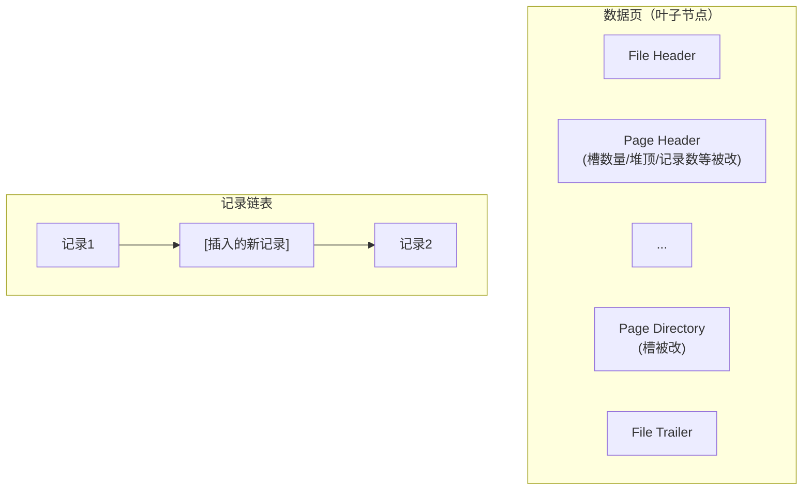

# redo日志（上）

## 事先说明

本文以及接下来的几篇文章会频繁使用前面介绍的 `InnoDB` 记录行格式、页面格式、索引原理、表空间的组成等各种基础知识。如果对这部分内容理解得不透彻，阅读下面的文字可能会有些吃力。为保证阅读体验，请确保已经掌握前面介绍的知识。

## redo日志是个啥

`InnoDB` 存储引擎以页为单位管理存储空间，进行的增删改查操作本质上都是在访问页面（包括读页面、写页面、创建新页面等操作）。前面介绍 `Buffer Pool` 时说过，在真正访问页面之前，需要把磁盘上的页缓存到内存中的 `Buffer Pool` 之后才可以访问。但在介绍事务时强调过一个 `持久性` 特性：对一个已经提交的事务，事务提交后即使系统发生崩溃，这个事务对数据库所做的更改也不能丢失。如果只在内存的 `Buffer Pool` 中修改了页面，在事务提交后突然发生某个故障导致内存数据失效，这个已提交事务对数据库所做的更改也就跟着丢失了，这是无法忍受的（想想 ATM 机已经提示狗哥转账成功，但之后由于服务器出现故障，重启之后猫爷发现自己没收到钱，猫爷就被砍死了）。

那么如何保证 `持久性`？一个很简单的做法是**在事务提交完成之前，把该事务所修改的所有页面都刷新到磁盘**，但这个简单粗暴的做法有些问题：

- 刷新一个完整的数据页太浪费

  有时候仅仅修改了某个页面中的一个字节，但 `InnoDB` 以页为单位进行磁盘 IO，也就是说在事务提交时不得不将一个完整的页面从内存刷新到磁盘。一个页面默认是 16KB 大小，只修改一个字节就要刷新 16KB 数据到磁盘，显然太浪费。

- 随机 IO 刷起来比较慢

  一个事务可能包含很多语句，即使是一条语句也可能修改许多页面。糟糕的是该事务修改的这些页面可能并不相邻，这意味着将某个事务修改的 `Buffer Pool` 中的页面刷新到磁盘时，需要进行很多随机 IO。随机 IO 比顺序 IO 慢，尤其对传统机械硬盘来说。

怎么办？再次回到初心：**只是想让已经提交的事务对数据库中数据所做的修改永久生效，即使后来系统崩溃，在重启后也能把这种修改恢复出来**。所以其实没有必要在每次事务提交时就把该事务在内存中修改过的全部页面刷新到磁盘，只需要**把修改了哪些东西记录一下**就好。比方说某个事务将系统表空间中的第 100 号页面中偏移量为 1000 处的那个字节的值 `1` 改成 `2`，只需要记录一下：

> 将第 0 号表空间的 100 号页面的偏移量为 1000 处的值更新为 `2`。

这样在事务提交时，把上述内容刷新到磁盘中。即使之后系统崩溃了，重启之后只要按照上述内容所记录的步骤重新更新一下数据页，该事务对数据库所做的修改就可以恢复出来，也就满足了 `持久性` 的要求。因为在系统崩溃重启时需要按照上述内容记录的步骤重新更新数据页，所以上述内容也被称为 `重做日志`，英文名为 `redo log`，也可以土洋结合称之为 `redo日志`。与在事务提交时将所有修改过的内存中的页面刷新到磁盘相比，只将该事务执行过程中产生的 `redo` 日志刷新到磁盘的好处如下：

- `redo` 日志占用的空间非常小

  存储表空间 ID、页号、偏移量以及需要更新的值所需的存储空间很小。关于 `redo` 日志的格式稍后会详细介绍，现在只要知道一条 `redo` 日志占用的空间不是很大就好。

- `redo` 日志是顺序写入磁盘的

  在执行事务的过程中，每执行一条语句，就可能产生若干条 `redo` 日志，这些日志按照产生的顺序写入磁盘，也就是使用顺序 IO。

## redo日志格式

通过上面的内容可以知道，`redo` 日志本质上只是**记录了一下事务对数据库做了哪些修改**。设计 `InnoDB` 的工程师针对事务对数据库的不同修改场景定义了多种类型的 `redo` 日志，但绝大部分类型的 `redo` 日志都有下面这种通用的结构：


各个部分的详细释义：

- `type`：该条 `redo` 日志的类型。在 `MySQL 5.7.21` 这个版本中，设计 `InnoDB` 的工程师一共为 `redo` 日志设计了 53 种不同的类型，稍后会详细介绍不同类型的 `redo` 日志；
- `space ID`：表空间 ID；
- `page number`：页号；
- `data`：该条 `redo` 日志的具体内容。

### 简单的redo日志类型

前面介绍 `InnoDB` 的记录行格式时说过，如果没有为某个表显式定义主键，并且表中也没有定义 `Unique` 键，那么 `InnoDB` 会自动为表添加一个称为 `row_id` 的隐藏列作为主键。为这个 `row_id` 隐藏列赋值的方式如下：

- 服务器在内存中维护一个全局变量，每当向某个包含隐藏 `row_id` 列的表中插入一条记录时，就把该变量的值当作新记录的 `row_id` 列的值，并把该变量自增 1；
- 每当这个变量的值为 256 的倍数时，就会将该变量的值刷新到系统表空间页号为 `7` 的页面中一个称为 `Max Row ID` 的属性处（前面介绍表空间结构时详细说过）；
- 当系统启动时，会将上述 `Max Row ID` 属性加载到内存中，将该值加上 256 之后赋值给前面提到的全局变量（因为在上次关机时该全局变量的值可能大于 `Max Row ID` 属性值）。

这个 `Max Row ID` 属性占用的存储空间是 8 个字节。当某个事务向某个包含 `row_id` 隐藏列的表插入一条记录，并且为该记录分配的 `row_id` 值为 256 的倍数时，就会向系统表空间页号为 7 的页面的相应偏移量处写入 8 个字节的值。这个写入实际上是在 `Buffer Pool` 中完成的，需要为这个页面的修改记录一条 `redo` 日志，以便在系统崩溃后能将已经提交的该事务对该页面所做的修改恢复出来。这种情况下对页面的修改极其简单，`redo` 日志中只需要**记录一下在某个页面的某个偏移量处修改了几个字节的值，以及具体被修改的内容是什么**就好。设计 `InnoDB` 的工程师把这种极其简单的 `redo` 日志称为 `物理日志`，并根据在页面中写入数据的多少划分了几种不同的 `redo` 日志类型：

- `MLOG_1BYTE`（`type` 字段对应的十进制数字为 `1`）：表示在页面的某个偏移量处写入 1 个字节的 `redo` 日志类型；
- `MLOG_2BYTE`（`type` 字段对应的十进制数字为 `2`）：表示在页面的某个偏移量处写入 2 个字节的 `redo` 日志类型；
- `MLOG_4BYTE`（`type` 字段对应的十进制数字为 `4`）：表示在页面的某个偏移量处写入 4 个字节的 `redo` 日志类型；
- `MLOG_8BYTE`（`type` 字段对应的十进制数字为 `8`）：表示在页面的某个偏移量处写入 8 个字节的 `redo` 日志类型；
- `MLOG_WRITE_STRING`（`type` 字段对应的十进制数字为 `30`）：表示在页面的某个偏移量处写入一串数据。

上面提到的 `Max Row ID` 属性实际占用 8 个字节的存储空间，所以在修改页面中的该属性时，会记录一条类型为 `MLOG_8BYTE` 的 `redo` 日志。`MLOG_8BYTE` 的 `redo` 日志结构如下：


其余 `MLOG_1BYTE`、`MLOG_2BYTE`、`MLOG_4BYTE` 类型的 `redo` 日志结构和 `MLOG_8BYTE` 类似，只不过具体数据中包含对应个字节的数据罢了。`MLOG_WRITE_STRING` 类型的 `redo` 日志表示写入一串数据，但因为不能确定写入的具体数据占用多少字节，所以需要在日志结构中添加一个 `len` 字段：


::: tip 小贴士
只要将 MLOG_WRITE_STRING 类型的 redo 日志的 len 字段填充上 1、2、4、8 这些数字，就可以分别替代 MLOG_1BYTE、MLOG_2BYTE、MLOG_4BYTE、MLOG_8BYTE 这些类型的 redo 日志。为什么还要多此一举设计这么多类型？还不是为了省空间——能不写 len 字段就不写，省一个字节算一个字节。
:::

### 复杂一些的redo日志类型

有时候执行一条语句会修改非常多的页面，包括系统数据页面和用户数据页面（用户数据指的就是聚簇索引和二级索引对应的 `B+` 树）。以一条 `INSERT` 语句为例，它除了要向 `B+` 树的页面中插入数据，也可能更新系统数据 `Max Row ID` 的值。不过对用户来说，平时更关心的是语句对 `B+` 树所做更新：

- 表中包含多少个索引，一条 `INSERT` 语句就可能更新多少棵 `B+` 树；
- 针对某一棵 `B+` 树来说，既可能更新叶子节点页面，也可能更新内节点页面，也可能创建新的页面（在该记录插入的叶子节点剩余空间比较少、不足以存放该记录时，会进行页面分裂，在内节点页面中添加 `目录项记录`）。

在语句执行过程中，`INSERT` 语句对所有页面的修改都得保存到 `redo` 日志中去。这句话说得轻巧，做起来就比较麻烦。比方说将记录插入到聚簇索引中时，如果定位到的叶子节点剩余空间足够存储该记录，那么只更新该叶子节点页面就好，只记录一条 `MLOG_WRITE_STRING` 类型的 `redo` 日志，表明在页面的某个偏移量处增加了哪些数据就好？那太天真了。别忘了，一个数据页中除了存储实际的记录之外，还有 `File Header`、`Page Header`、`Page Directory` 等部分（介绍数据页的章节有详细讲解）。所以每往叶子节点代表的数据页里插入一条记录时，还有其他很多地方会跟着更新，比如说：

- 可能更新 `Page Directory` 中的槽信息；
- `Page Header` 中的各种页面统计信息，比如 `PAGE_N_DIR_SLOTS` 表示的槽数量可能更改、`PAGE_HEAP_TOP` 代表的还未使用的空间最小地址可能更改、`PAGE_N_HEAP` 代表的本页面记录数量可能更改等；
- 数据页里的记录按照索引列从小到大的顺序组成单向链表，每插入一条记录，还需要更新上一条记录的记录头信息中的 `next_record` 属性来维护这个单向链表；
- 还有别的更新的地方，不一一列举。

画一个简易的示意图（加粗表示被修改的多个位置）：



说了这么多，就是想表达：**把一条记录插入到一个页面时需要更改的地方非常多**。这时如果使用上面介绍的简单物理 `redo` 日志来记录这些修改，有两种解决方案：

- 方案一：在每个修改的地方都记录一条 `redo` 日志

  如上图所示，有多少个加粗的块，就写多少条物理 `redo` 日志。这种记录 `redo` 日志方式的缺点显而易见：被修改的地方太多，可能记录的 `redo` 日志占用的空间比整个页面占用的空间还多。

- 方案二：将整个页面的 `第一个被修改的字节` 到 `最后一个修改的字节` 之间所有数据当成一条物理 `redo` 日志中的具体数据

  从图中可以看出，`第一个被修改的字节` 到 `最后一个修改的字节` 之间仍有许多没有修改过的数据，把这些没修改的数据也加入 `redo` 日志岂不是很浪费。

正因为上述两种使用物理 `redo` 日志来记录某个页面中做了哪些修改的方式比较浪费，设计 `InnoDB` 的工程师本着勤俭节约的初心，提出了一些新的 `redo` 日志类型，比如：

- `MLOG_REC_INSERT`（对应的十进制数字为 `9`）：表示插入一条使用非紧凑行格式的记录时的 `redo` 日志类型；
- `MLOG_COMP_REC_INSERT`（对应的十进制数字为 `38`）：表示插入一条使用紧凑行格式的记录时的 `redo` 日志类型；

::: tip 小贴士
Redundant 是一种比较原始的行格式，它是非紧凑的。而 Compact、Dynamic 以及 Compressed 行格式是较新的行格式，它们是紧凑的（占用更小的存储空间）。
:::

- `MLOG_COMP_PAGE_CREATE`（`type` 字段对应的十进制数字为 `58`）：表示创建一个存储紧凑行格式记录的页面的 `redo` 日志类型；
- `MLOG_COMP_REC_DELETE`（`type` 字段对应的十进制数字为 `42`）：表示删除一条使用紧凑行格式记录的 `redo` 日志类型；
- `MLOG_COMP_LIST_START_DELETE`（`type` 字段对应的十进制数字为 `44`）：表示从某条给定记录开始删除页面中的一系列使用紧凑行格式记录的 `redo` 日志类型；
- `MLOG_COMP_LIST_END_DELETE`（`type` 字段对应的十进制数字为 `43`）：与 `MLOG_COMP_LIST_START_DELETE` 类型的 `redo` 日志呼应，表示删除一系列记录直到 `MLOG_COMP_LIST_END_DELETE` 类型的 `redo` 日志对应的记录为止；

::: tip 小贴士
前面介绍 InnoDB 数据页格式时重点强调过，数据页中的记录按照索引列大小的顺序组成单向链表。有时候会有删除索引列的值在某个区间范围内的所有记录的需求，如果每删除一条记录就写一条 redo 日志，效率可能有点低，所以提出 MLOG_COMP_LIST_START_DELETE 和 MLOG_COMP_LIST_END_DELETE 类型的 redo 日志，可以很大程度上减少 redo 日志的条数。
:::

- `MLOG_ZIP_PAGE_COMPRESS`（`type` 字段对应的十进制数字为 `51`）：表示压缩一个数据页的 `redo` 日志类型；
- ……还有很多很多种类型，这里不一一列举，用到时再说。

这些类型的 `redo` 日志既包含 `物理` 层面的意思，也包含 `逻辑` 层面的意思，具体指：

- 物理层面看，这些日志都指明了对哪个表空间的哪个页进行了修改；
- 逻辑层面看，在系统崩溃重启时，并不能直接根据这些日志里的记载将页面内某个偏移量处恢复成某个数据，而是需要调用一些事先准备好的函数，执行完这些函数后才可以将页面恢复成系统崩溃前的样子。

看到这可能会有些困惑，还是以类型为 `MLOG_COMP_REC_INSERT`（代表插入一条使用紧凑行格式记录的 `redo` 日志）为例来理解 `物理` 层面和 `逻辑` 层面到底是什么。直接看这个类型的 `redo` 日志的结构（由于字段太多，把它们竖着看效果好些）：


这个类型为 `MLOG_COMP_REC_INSERT` 的 `redo` 日志结构有几个地方需要注意：

- 前面介绍索引时说过，在一个数据页里，不论是叶子节点还是非叶子节点，记录都按照索引列从小到大的顺序排序。对二级索引来说，当索引列的值相同时，记录还需要按照主键值排序。图中 `n_uniques` 的值的含义是：在一条记录中，需要几个字段的值才能确保记录的唯一性。这样插入一条记录时，就可以按照记录的前 `n_uniques` 个字段排序。对聚簇索引来说，`n_uniques` 的值为主键的列数；对其他二级索引来说，该值为索引列数 + 主键列数。注意，唯一二级索引的值可能为 `NULL`，所以该值仍为索引列数 + 主键列数；
- `field1_len ~ fieldn_len` 代表该记录若干个字段占用存储空间的大小。注意，这里不管该字段的类型是固定长度大小（比如 `INT`）还是可变长度大小（比如 `VARCHAR(M)`），该字段占用的大小始终要写入 `redo` 日志中；
- `offset` 代表该记录的前一条记录在页面中的地址。为什么要记录前一条记录的地址？因为每向数据页插入一条记录，都需要修改该页面中维护的记录链表。每条记录的 `记录头信息` 中都包含一个称为 `next_record` 的属性，所以在插入新记录时，需要修改前一条记录的 `next_record` 属性；
- 一条记录其实由 `额外信息` 和 `真实数据` 两部分组成，这两部分的总大小就是一条记录占用存储空间的总大小。通过 `end_seg_len` 的值可以间接计算出一条记录占用存储空间的总大小。为什么不直接存储一条记录占用存储空间的总大小？因为写 `redo` 日志是一个非常频繁的操作，设计 `InnoDB` 的工程师想方设法减小 `redo` 日志本身占用的存储空间，所以想了一些巧妙的算法实现这个目标，`end_seg_len` 字段就是为了节省 `redo` 日志存储空间而提出的。至于具体用了什么方法减小 `redo` 日志大小，这里不多介绍，确实有点复杂，说清楚也麻烦，而且明白了也没太大用处；
- `mismatch_index` 的值也是为了节省 `redo` 日志大小而设立的，可以忽略。

很显然，类型为 `MLOG_COMP_REC_INSERT` 的 `redo` 日志并没有记录 `PAGE_N_DIR_SLOTS` 的值修改成了什么、`PAGE_HEAP_TOP` 的值修改成了什么、`PAGE_N_HEAP` 的值修改成了什么等信息，而只是把在本页面中插入一条记录所需的所有必备要素记下来。之后系统崩溃重启时，服务器会调用"向某个页面插入一条记录"的那个函数，而 `redo` 日志中的那些数据就可以被当成调用这个函数所需的参数。调用完该函数后，页面中的 `PAGE_N_DIR_SLOTS`、`PAGE_HEAP_TOP`、`PAGE_N_HEAP` 等值也就都恢复到系统崩溃前的样子了。这就是所谓的 `逻辑` 日志的意思。

### redo日志格式小结

虽然上面说了一大堆关于 `redo` 日志格式的内容，但如果不是为了写一个解析 `redo` 日志的工具或者自己开发一套 `redo` 日志系统，就没必要把 `InnoDB` 中各种类型的 `redo` 日志格式研究透。上面只是象征性介绍了几种类型的 `redo` 日志格式，目的是让大家明白：**redo 日志会把事务在执行过程中对数据库所做的所有修改都记录下来，在之后系统崩溃重启后可以把事务所做的任何修改都恢复出来**。

::: tip 小贴士
为了节省 redo 日志占用的存储空间，设计 InnoDB 的工程师对 redo 日志中的某些数据还可能进行压缩处理，比方说 space ID 和 page number 一般占用 4 个字节存储，但经过压缩后可能使用更小的空间存储。具体压缩算法这里不介绍。
:::

## Mini-Transaction

### 以组的形式写入redo日志

语句在执行过程中可能修改若干个页面。比如前面说的一条 `INSERT` 语句可能修改系统表空间页号为 `7` 的页面的 `Max Row ID` 属性（当然也可能更新别的系统页面），还会更新聚簇索引和二级索引对应 `B+` 树中的页面。由于对这些页面的更改都发生在 `Buffer Pool` 中，所以在修改完页面之后，需要记录相应的 `redo` 日志。在执行语句的过程中产生的 `redo` 日志被设计 `InnoDB` 的工程师人为地划分成若干个不可分割的组，比如：

- 更新 `Max Row ID` 属性时产生的 `redo` 日志是不可分割的；
- 向聚簇索引对应 `B+` 树的页面中插入一条记录时产生的 `redo` 日志是不可分割的；
- 向某个二级索引对应 `B+` 树的页面中插入一条记录时产生的 `redo` 日志是不可分割的；
- 其他一些对页面的访问操作时产生的 `redo` 日志也是不可分割的。

怎么理解 `不可分割` 的意思？以向某个索引对应的 `B+` 树插入一条记录为例。在向 `B+` 树中插入这条记录之前，需要先定位到这条记录应该被插入到哪个叶子节点代表的数据页中。定位到具体的数据页之后，有两种可能的情况：

- 情况一：该数据页的剩余空闲空间充足，足够容纳这一条待插入记录

  事情很简单，直接把记录插入到这个数据页中，记录一条类型为 `MLOG_COMP_REC_INSERT` 的 `redo` 日志就好。把这种情况称为 `乐观插入`。假如某个索引对应的 `B+` 树长这样：


  现在要插入一条键值为 `10` 的记录，显然需要被插入到 `页b` 中。由于 `页b` 现在有足够的空间容纳一条记录，所以直接将该记录插入到 `页b` 中就好：


- 情况二：该数据页剩余的空闲空间不足

  事情就麻烦了。前面说过，遇到这种情况要进行所谓的 `页分裂` 操作：新建一个叶子节点，然后把原先数据页中的一部分记录复制到这个新的数据页中，再把记录插入进去，把这个叶子节点插入到叶子节点链表中，最后还要在内节点中添加一条 `目录项记录` 指向这个新创建的页面。这个过程要对多个页面进行修改，也就意味着会产生多条 `redo` 日志，把这种情况称为 `悲观插入`。假如某个索引对应的 `B+` 树长这样：


  现在要插入一条键值为 `10` 的记录，显然需要被插入到 `页b` 中。但从图中可以看出，此时 `页b` 已经塞满了记录，没有更多空闲空间容纳这条新记录，所以需要进行页面的分裂操作：


  如果作为内节点的 `页a` 的剩余空闲空间也不足以容纳增加一条 `目录项记录`，那需要继续做内节点 `页a` 的分裂操作，也就意味着会修改更多页面，从而产生更多 `redo` 日志。另外，对 `悲观插入` 来说，由于需要新申请数据页，还需要改动一些系统页面，比方说要修改各种段、区的统计信息、各种链表的统计信息（比如 `FREE` 链表、`FSP_FREE_FRAG` 链表等），反正总共需要记录的 `redo` 日志有二、三十条。

::: tip 小贴士
其实不光是悲观插入一条记录会生成许多条 redo 日志，设计 InnoDB 的工程师为了其他一些功能，在乐观插入时也可能产生多条 redo 日志（具体为了什么功能这里不多说，否则篇幅就受不了了）。
:::

设计 `InnoDB` 的工程师认为向某个索引对应的 `B+` 树中插入一条记录的这个过程必须是原子的，不能说插了一半就停止。比方说在悲观插入过程中，新的页面已经分配好了、数据也复制过去了、新的记录也插入到页面中了，可是没有向内节点中插入一条 `目录项记录`，这个插入过程就不完整，会形成一棵不正确的 `B+` 树。`redo` 日志是为了在系统崩溃重启时恢复崩溃前的状态，如果在悲观插入过程中只记录了一部分 `redo` 日志，那么在系统崩溃重启时会将索引对应的 `B+` 树恢复成一种不正确的状态，这是不能忍受的。所以他们规定：在执行这些需要保证原子性的操作时，必须以 `组` 的形式记录 `redo` 日志。在进行系统崩溃重启恢复时，针对某个组中的 `redo` 日志，要么把全部日志都恢复掉，要么一条也不恢复。怎么做到？分情况讨论：

- 有的需要保证原子性的操作会生成多条 `redo` 日志，比如向某个索引对应的 `B+` 树中进行一次悲观插入就需要生成许多条 `redo` 日志

  如何把这些 `redo` 日志划分到一个组里边？设计 `InnoDB` 的工程师做了一个简单的小把戏：在该组中的最后一条 `redo` 日志后边加上一条特殊类型的 `redo` 日志，该类型名称为 `MLOG_MULTI_REC_END`，`type` 字段对应的十进制数字为 `31`。该类型的 `redo` 日志结构很简单，只有一个 `type` 字段：


  所以某个需要保证原子性的操作产生的一系列 `redo` 日志，必须要以一个类型为 `MLOG_MULTI_REC_END` 结尾，就像这样：


  这样在系统崩溃重启进行恢复时，只有当解析到类型为 `MLOG_MULTI_REC_END` 的 `redo` 日志，才认为解析到了一组完整的 `redo` 日志，才会进行恢复；否则直接放弃前边解析到的 `redo` 日志。

- 有的需要保证原子性的操作只生成一条 `redo` 日志，比如更新 `Max Row ID` 属性的操作只会生成一条 `redo` 日志

  其实在一条日志后边跟一个类型为 `MLOG_MULTI_REC_END` 的 `redo` 日志也是可以的，不过设计 `InnoDB` 的工程师比较勤俭节约，不想浪费一个比特位。别忘了 `redo` 日志的类型虽然多，撑死也就几十种，小于 `127` 这个数字，也就是说用 7 个比特位就足以包含所有 `redo` 日志类型。而 `type` 字段实际占用 1 个字节，所以可以省出一个比特位来表示该需要保证原子性的操作只产生单一的一条 `redo` 日志：


  如果 `type` 字段的第一个比特位为 `1`，代表该需要保证原子性的操作只产生了单一的一条 `redo` 日志；否则表示该需要保证原子性的操作产生了一系列 `redo` 日志。

### Mini-Transaction的概念

设计 `MySQL` 的工程师把对底层页面中的一次原子访问的过程称为一个 `Mini-Transaction`，简称 `mtr`。比如上面所说的修改一次 `Max Row ID` 的值算是一个 `Mini-Transaction`，向某个索引对应的 `B+` 树中插入一条记录的过程也算是一个 `Mini-Transaction`。通过上面的叙述可以知道，一个所谓的 `mtr` 可以包含一组 `redo` 日志，在进行崩溃恢复时这一组 `redo` 日志作为一个不可分割的整体。

一个事务可以包含若干条语句，每一条语句由若干个 `mtr` 组成，每一个 `mtr` 又可以包含若干条 `redo` 日志。画个图表示它们的关系：


## redo日志的写入过程

### redo log block

设计 `InnoDB` 的工程师为了更好进行系统崩溃恢复，把通过 `mtr` 生成的 `redo` 日志都放在了大小为 `512字节` 的 `页` 中。为了和前面提到的表空间中的页做区别，这里把用来存储 `redo` 日志的页称为 `block`（心里清楚页和 block 的意思差不多就行）。一个 `redo log block` 的示意图如下：


真正的 `redo` 日志都存储到占用 `496` 字节大小的 `log block body` 中，图中的 `log block header` 和 `log block trailer` 存储的是一些管理信息。看看这些 `管理信息` 都是什么：


其中 `log block header` 的几个属性的意思分别如下：

- `LOG_BLOCK_HDR_NO`：每一个 block 都有一个大于 0 的唯一标号，本属性表示该标号值；
- `LOG_BLOCK_HDR_DATA_LEN`：表示 block 中已经使用了多少字节，初始值为 `12`（因为 `log block body` 从第 12 个字节处开始）。随着往 block 中写入的 redo 日志越来越多，本属性值也跟着增长。如果 `log block body` 已经被全部写满，本属性的值被设置为 `512`；
- `LOG_BLOCK_FIRST_REC_GROUP`：一条 `redo` 日志也可以称为一条 `redo` 日志记录（`redo log record`），一个 `mtr` 会产生多条 `redo` 日志记录，这些 `redo` 日志记录被称为一个 `redo` 日志记录组（`redo log record group`）。`LOG_BLOCK_FIRST_REC_GROUP` 代表该 block 中第一个 `mtr` 生成的 `redo` 日志记录组的偏移量（其实也就是这个 block 里第一个 `mtr` 生成的第一条 `redo` 日志的偏移量）；
- `LOG_BLOCK_CHECKPOINT_NO`：表示所谓的 `checkpoint` 的序号，`checkpoint` 是后续内容的重点，现在先不用清楚它的意思。

`log block trailer` 中属性的意思：

- `LOG_BLOCK_CHECKSUM`：表示 block 的校验值，用于正确性校验，暂时不关心它。

### redo日志缓冲区

前面说过，设计 `InnoDB` 的工程师为了解决磁盘速度过慢的问题引入了 `Buffer Pool`。同理，写入 `redo` 日志时也不能直接写到磁盘上。实际上在服务器启动时就向操作系统申请了一大片称为 `redo log buffer` 的连续内存空间，翻译成中文就是 `redo日志缓冲区`，也可以简称为 `log buffer`。这片内存空间被划分成若干个连续的 `redo log block`，就像这样：


可以通过启动参数 `innodb_log_buffer_size` 指定 `log buffer` 的大小，在 `MySQL 5.7.21` 这个版本中，该启动参数的默认值为 `16MB`。

### redo日志写入log buffer

向 `log buffer` 中写入 `redo` 日志的过程是顺序的：先往前边的 block 中写，当该 block 的空闲空间用完后再往下一个 block 中写。想往 `log buffer` 中写入 `redo` 日志时，第一个遇到的问题就是应该写在哪个 `block` 的哪个偏移量处，所以设计 `InnoDB` 的工程师特意提供了一个称为 `buf_free` 的全局变量，该变量指明后续写入的 `redo` 日志应该写入到 `log buffer` 中的哪个位置：


前面说过，一个 `mtr` 执行过程中可能产生若干条 `redo` 日志，这些 `redo` 日志是一个不可分割的组。所以并不是每生成一条 `redo` 日志就将其插入到 `log buffer` 中，而是每个 `mtr` 运行过程中产生的日志先暂时存到一个地方，当该 `mtr` 结束时，将过程中产生的一组 `redo` 日志再全部复制到 `log buffer` 中。假设有两个名为 `T1`、`T2` 的事务，每个事务都包含 2 个 `mtr`，给这几个 `mtr` 命名：

- 事务 `T1` 的两个 `mtr` 分别称为 `mtr_T1_1` 和 `mtr_T1_2`；
- 事务 `T2` 的两个 `mtr` 分别称为 `mtr_T2_1` 和 `mtr_T2_2`。

每个 `mtr` 都会产生一组 `redo` 日志：

```text
mtr_T1_1 → {redo组1}
mtr_T1_2 → {redo组2}
mtr_T2_1 → {redo组3}
mtr_T2_2 → {redo组4}
```

不同的事务可能是并发执行的，所以 `T1`、`T2` 之间的 `mtr` 可能是交替执行的。每当一个 `mtr` 执行完成时，伴随该 `mtr` 生成的一组 `redo` 日志就需要被复制到 `log buffer` 中，也就是说不同事务的 `mtr` 可能是交替写入 `log buffer` 的（把一个 `mtr` 中产生的所有 `redo` 日志当作一个整体来看）：


从示意图可以看出，不同的 `mtr` 产生的一组 `redo` 日志占用的存储空间可能不一样：有的 `mtr` 产生的 `redo` 日志量很少（比如 `mtr_T1_1`、`mtr_T2_2` 被放到同一个 block 中存储），有的 `mtr` 产生的 `redo` 日志量非常大（比如 `mtr_T1_2` 产生的 `redo` 日志甚至跨了 2 个 block 来存储）。

::: tip 小贴士
对照上图，可以自己分析一下每个 block 的 LOG_BLOCK_HDR_DATA_LEN、LOG_BLOCK_FIRST_REC_GROUP 属性值都是什么。
:::
