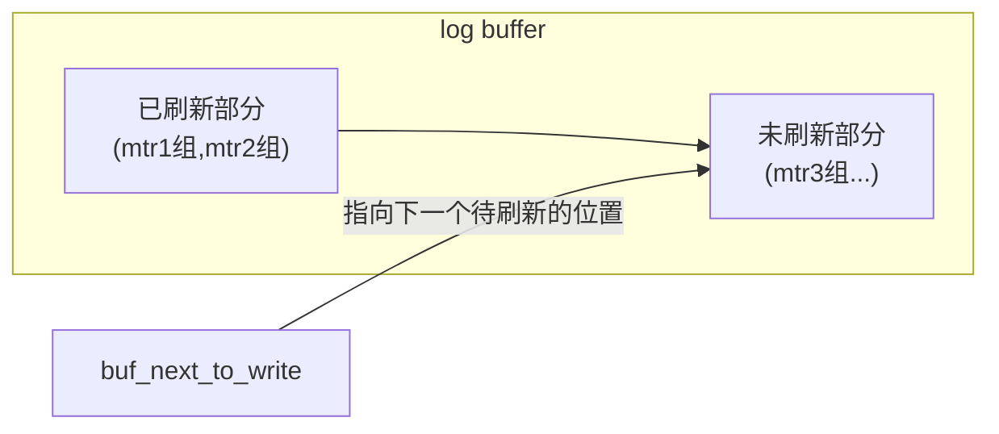
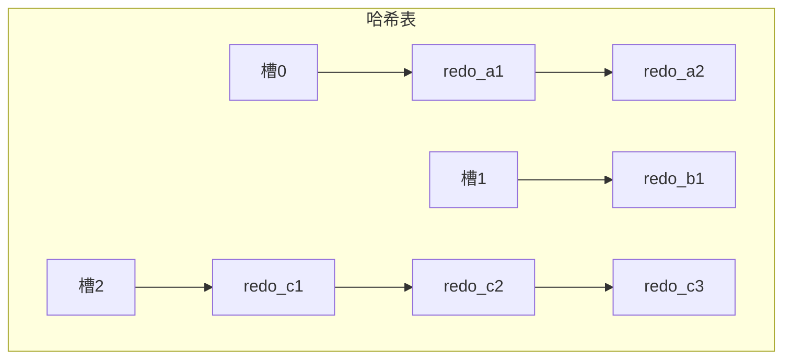

# redo日志（下）

## redo日志文件

### redo日志刷盘时机

前面说过，`mtr` 运行过程中产生的一组 `redo` 日志在 `mtr` 结束时会被复制到 `log buffer` 中。但这些日志总在内存里呆着也不是办法，在一些情况下它们会被刷新到磁盘里，比如：

- `log buffer` 空间不足时

  `log buffer` 的大小是有限的（通过系统变量 `innodb_log_buffer_size` 指定）。如果不停地往这个有限大小的 `log buffer` 里塞入日志，很快它就会被填满。设计 `InnoDB` 的工程师认为，如果当前写入 `log buffer` 的 `redo` 日志量已经占满了 `log buffer` 总容量的大约一半左右，就需要把这些日志刷新到磁盘上。

- 事务提交时

  前面说过，之所以使用 `redo` 日志，主要是因为它占用的空间少、还是顺序写，在事务提交时可以不把修改过的 `Buffer Pool` 页面刷新到磁盘。但为了保证持久性，必须要把修改这些页面对应的 `redo` 日志刷新到磁盘。

  ::: tip 小贴士
  这个过程称为 Force Log at Commit。
  :::

- 后台线程不停地刷新

  后台有一个线程，大约每秒都会刷新一次 `log buffer` 中的 `redo` 日志到磁盘。

- 正常关闭服务器时
- 做所谓的 `checkpoint` 时（现在还没介绍过 `checkpoint` 的概念，稍后会详细介绍）
- 其他的一些情况

### redo日志文件组

`MySQL` 的数据目录（使用 `SHOW VARIABLES LIKE 'datadir'` 查看）下默认有两个名为 `ib_logfile0` 和 `ib_logfile1` 的文件，`log buffer` 中的日志默认情况下就刷新到这两个磁盘文件中。

> 注：以上是 MySQL 5.7～8.0.29 的组织方式。**MySQL 8.0.30 起 redo 日志文件迁到数据目录下的 `#innodb_redo` 子目录中**（如 `#ib_redo10` 等文件，8.0.46 实测数据目录已无 `ib_logfile*`），并用新系统变量 `innodb_redo_log_capacity`（默认 100MB）统一控制 redo 日志总容量；`innodb_log_file_size`（8.0 中默认仍为 48MB）与 `innodb_log_files_in_group`（默认 2）随之被弃用（8.4 中移除）。循环使用、checkpoint 等机制本身不变。

如果对默认的 `redo` 日志文件不满意，可以通过下面几个启动参数来调节：

- `innodb_log_group_home_dir`

  该参数指定了 `redo` 日志文件所在的目录，默认值就是当前的数据目录。

- `innodb_log_file_size`

  该参数指定了每个 `redo` 日志文件的大小，在 `MySQL 5.7.21` 这个版本中的默认值为 `48MB`。

- `innodb_log_files_in_group`

  该参数指定 `redo` 日志文件的个数，默认值为 2，最大值为 100。

从上面的描述可以看到，磁盘上的 `redo` 日志文件不只一个，而是以一个 `日志文件组` 的形式出现。这些文件以 `ib_logfile[数字]`（`数字` 可以是 `0`、`1`、`2`...）的形式命名。在将 `redo` 日志写入 `日志文件组` 时，从 `ib_logfile0` 开始写，如果 `ib_logfile0` 写满了就接着 `ib_logfile1` 写，同理，`ib_logfile1` 写满了就去写 `ib_logfile2`，依此类推。如果写到最后一个文件怎么办？那就重新转到 `ib_logfile0` 继续写，整个过程如下图所示：


总共的 `redo` 日志文件大小就是：`innodb_log_file_size × innodb_log_files_in_group`。

::: tip 小贴士
如果采用循环使用的方式向 redo 日志文件组里写数据，岂不是要追尾，也就是后写入的 redo 日志覆盖掉前边写的 redo 日志？当然可能！所以设计 InnoDB 的工程师提出了 checkpoint 的概念，稍后详细介绍。
:::

### redo日志文件格式

前面说过，`log buffer` 本质上是一片连续的内存空间，被划分成若干个 `512` 字节大小的 `block`。**将 log buffer 中的 redo 日志刷新到磁盘的本质，就是把 block 的镜像写入日志文件中**，所以 `redo` 日志文件其实也是由若干个 `512` 字节大小的 block 组成。

`redo` 日志文件组中的每个文件大小都一样、格式也一样，都由两部分组成：

- 前 2048 个字节，也就是前 4 个 block，用来存储一些管理信息；
- 从第 2048 字节往后，用来存储 `log buffer` 中的 block 镜像。

所以前面所说的 `循环` 使用 redo 日志文件，其实是从每个日志文件的第 2048 个字节开始算，画个示意图：


普通 block 的格式在介绍 `log buffer` 时都说过了，就是 `log block header`、`log block body`、`log block trailer` 三个部分，不重复介绍。这里介绍每个 `redo` 日志文件前 2048 个字节（也就是前 4 个特殊 block）的格式是干什么的：


这 4 个 block 分别是：

- `log file header`：描述该 `redo` 日志文件的一些整体属性，看它的结构：


  各个属性的具体释义：

  | 属性名 | 长度（单位：字节） | 描述 |
  |:--:|:--:|:--|
  | `LOG_HEADER_FORMAT` | `4` | `redo` 日志的版本，在 `MySQL 5.7.21` 中该值永远为 1 |
  | `LOG_HEADER_PAD1` | `4` | 做字节填充用的，没什么实际意义，忽略 |
  | `LOG_HEADER_START_LSN` | `8` | 标记本 `redo` 日志文件开始的 LSN 值，也就是文件偏移量为 2048 字节处对应的 LSN 值（关于什么是 LSN 稍后再看，看不懂的先忽略） |
  | `LOG_HEADER_CREATOR` | `32` | 一个字符串，标记本 `redo` 日志文件的创建者是谁。正常运行时该值为 `MySQL` 的版本号，比如 `"MySQL 5.7.21"`；使用 `mysqlbackup` 命令创建的 `redo` 日志文件该值为 `"ibbackup"` 和创建时间 |
  | `LOG_BLOCK_CHECKSUM` | `4` | 本 block 的校验值，所有 block 都有，不关心 |

  ::: tip 小贴士
  设计 InnoDB 的工程师对 redo 日志的 block 格式做了很多次修改，如果阅读的其他书籍中上述属性和这里有些出入，不要慌，是正常现象。另外，LSN 值后面才会介绍，现在千万别纠结 LSN 是什么。
  :::

- `checkpoint1`：记录关于 `checkpoint` 的一些属性，看它的结构：


  各个属性的具体释义：

  | 属性名 | 长度（单位：字节） | 描述 |
  |:--:|:--:|:--|
  | `LOG_CHECKPOINT_NO` | `8` | 服务器做 `checkpoint` 的编号，每做一次 `checkpoint`，该值就加 1 |
  | `LOG_CHECKPOINT_LSN` | `8` | 服务器做 `checkpoint` 结束时对应的 `LSN` 值，系统崩溃恢复时将从该值开始 |
  | `LOG_CHECKPOINT_OFFSET` | `8` | 上个属性中的 `LSN` 值在 `redo` 日志文件组中的偏移量 |
  | `LOG_CHECKPOINT_LOG_BUF_SIZE` | `8` | 服务器在做 `checkpoint` 操作时对应的 `log buffer` 的大小 |
  | `LOG_BLOCK_CHECKSUM` | `4` | 本 block 的校验值，所有 block 都有，不关心 |

  ::: tip 小贴士
  现在看不懂上面这些关于 checkpoint 和 LSN 的属性的释义很正常，这里先让大家对这些属性混个脸熟，后面会详细介绍。
  :::

- 第三个 block 未使用，忽略。
- `checkpoint2`：结构和 `checkpoint1` 一样。

## Log Sequence Number

自系统开始运行，就不断在修改页面，也就意味着会不断生成 `redo` 日志。`redo` 日志的量在不断增加，就像人的年龄一样，自打出生起就不断递增，永远不会缩减。设计 `InnoDB` 的工程师为记录已经写入的 `redo` 日志量，设计了一个称为 `Log Sequence Number` 的全局变量，翻译过来是 `日志序列号`，简称 `lsn`。不过不像人一出生年龄是 `0` 岁，设计 `InnoDB` 的工程师**规定**初始的 `lsn` 值为 `8704`（也就是一条 `redo` 日志也没写入时，`lsn` 的值为 `8704`）。

在向 `log buffer` 中写入 `redo` 日志时，不是一条一条写入，而是以一个 `mtr` 生成的一组 `redo` 日志为单位进行写入。实际上把日志内容写在 `log block body` 处。但在统计 `lsn` 的增长量时，是按照实际写入的日志量加上占用的 `log block header` 和 `log block trailer` 来计算的。看一个例子：

- 系统第一次启动后初始化 `log buffer` 时，`buf_free`（标记下一条 `redo` 日志应该写入到 `log buffer` 的位置的变量）会指向第一个 `block` 的偏移量为 12 字节（`log block header` 的大小）的地方，`lsn` 值也会跟着增加 12：

```text
初始: lsn = 8704
初始化 log buffer 后: buf_free 指向 block0 偏移 12 处，lsn = 8704 + 12 = 8716
```

- 如果某个 `mtr` 产生的一组 `redo` 日志占用的存储空间比较小，也就是待插入的 block 剩余空闲空间能容纳这个 `mtr` 提交的日志时，`lsn` 增长的量就是该 `mtr` 生成的 `redo` 日志占用的字节数。假设 `mtr_1` 产生的 `redo` 日志量为 200 字节，那么 `lsn` 就在 `8716` 的基础上增加 `200`，变为 `8916`。

- 如果某个 `mtr` 产生的一组 `redo` 日志占用的存储空间比较大，也就是待插入的 block 剩余空闲空间不足以容纳这个 `mtr` 提交的日志时，`lsn` 增长的量就是该 `mtr` 生成的 `redo` 日志占用的字节数加上额外占用的 `log block header` 和 `log block trailer` 的字节数。假设 `mtr_2` 产生的 `redo` 日志量为 1000 字节，为了将 `mtr_2` 产生的 `redo` 日志写入 `log buffer`，不得不额外多分配两个 block，所以 `lsn` 的值需要在 `8916` 的基础上增加 `1000 + 12×2 + 4×2 = 1032`。

::: tip 小贴士
为什么初始的 lsn 值为 8704？这个并不需要深究，是设计者规定的。只要保证随着时间流逝、写入的 redo 日志不断增长即可。
:::

从上面的描述可以看出，**每一组由 mtr 生成的 redo 日志都有一个唯一的 LSN 值与其对应，LSN 值越小，说明 redo 日志产生得越早**。

### flushed_to_disk_lsn

`redo` 日志首先写到 `log buffer` 中，之后才会被刷新到磁盘上的 `redo` 日志文件。所以设计 `InnoDB` 的工程师提出了一个称为 `buf_next_to_write` 的全局变量，标记当前 `log buffer` 中已经有哪些日志被刷新到磁盘中了：



前面说 `lsn` 表示当前系统中写入的 `redo` 日志量，包括写到 `log buffer` 而没有刷新到磁盘的日志。相应地，设计 `InnoDB` 的工程师提出了一个表示刷新到磁盘中的 `redo` 日志量的全局变量，称为 `flushed_to_disk_lsn`。系统第一次启动时，该变量的值和初始的 `lsn` 值相同，都是 `8704`。随着系统运行，`redo` 日志被不断写入 `log buffer`，但不会立即刷新到磁盘，`lsn` 的值就和 `flushed_to_disk_lsn` 的值拉开差距。演示一下：

- 系统第一次启动后，向 `log buffer` 中写入了 `mtr_1`、`mtr_2`、`mtr_3` 这三个 `mtr` 产生的 `redo` 日志。假设这三个 `mtr` 开始和结束时对应的 lsn 值分别是：
  - `mtr_1`：8716 ~ 8916
  - `mtr_2`：8916 ~ 9948
  - `mtr_3`：9948 ~ 10000

  此时 `lsn` 已经增长到 10000，但由于没有刷新操作，此时 `flushed_to_disk_lsn` 的值仍为 `8704`。

- 随后进行将 `log buffer` 中的 block 刷新到 `redo` 日志文件的操作。假设将 `mtr_1` 和 `mtr_2` 的日志刷新到磁盘，那么 `flushed_to_disk_lsn` 就应该增长 `mtr_1` 和 `mtr_2` 写入的日志量，所以 `flushed_to_disk_lsn` 的值增长到了 `9948`。

综上所述，当有新的 `redo` 日志写入到 `log buffer` 时，首先 `lsn` 的值会增长，但 `flushed_to_disk_lsn` 不变；随后随着不断有 `log buffer` 中的日志被刷新到磁盘上，`flushed_to_disk_lsn` 的值也跟着增长。**如果两者的值相同，说明 log buffer 中的所有 redo 日志都已经刷新到磁盘中了**。

::: tip 小贴士
应用程序向磁盘写入文件时其实是先写到操作系统的缓冲区中，如果某个写入操作要等到操作系统确认已经写到磁盘才返回，需要调用操作系统提供的 fsync 函数。其实只有当系统执行了 fsync 函数后，flushed_to_disk_lsn 的值才会增长；当仅仅把 log buffer 中的日志写入到操作系统缓冲区却没有显式刷新到磁盘时，另一个称为 write_lsn 的值会增长。不过为了理解方便，这里把 flushed_to_disk_lsn 和 write_lsn 的概念混在一起讲述。
:::

### lsn值和redo日志文件偏移量的对应关系

`lsn` 的值代表系统写入的 `redo` 日志量的一个总和，一个 `mtr` 中产生多少日志，`lsn` 的值就增加多少（当然有时候要加上 `log block header` 和 `log block trailer` 的大小）。这样 `mtr` 产生的日志写到磁盘中时，很容易计算某一个 `lsn` 值在 `redo` 日志文件组中的偏移量：

```text
初始时: LSN = 8704，对应文件偏移量 2048
之后每个 mtr 向磁盘写入多少字节日志，lsn 的值就增长多少
```

### flush链表中的LSN

一个 `mtr` 代表一次对底层页面的原子访问，在访问过程中可能产生一组不可分割的 `redo` 日志，在 `mtr` 结束时会把这一组 `redo` 日志写入到 `log buffer` 中。除此之外，`mtr` 结束时还有一件非常重要的事情要做：**把在 mtr 执行过程中可能修改过的页面加入到 Buffer Pool 的 flush 链表**。回顾一下 `flush链表`：


当第一次修改某个缓存在 `Buffer Pool` 中的页面时，就会把这个页面对应的控制块插入到 `flush链表` 的头部；之后再修改该页面时，由于它已经在 `flush` 链表中，就不再插入了。也就是说**flush 链表中的脏页是按照页面的第一次修改时间从大到小进行排序的**。在这个过程中会在缓存页对应的控制块中记录两个关于页面何时修改的属性：

- `oldest_modification`：如果某个页面被加载到 `Buffer Pool` 后进行第一次修改，那么就将修改该页面的 `mtr` 开始时对应的 `lsn` 值写入这个属性；
- `newest_modification`：每修改一次页面，都会将修改该页面的 `mtr` 结束时对应的 `lsn` 值写入这个属性。也就是说该属性表示页面最近一次修改后对应的系统 `lsn` 值。

接着上面 `flushed_to_disk_lsn` 的例子看一下：

- 假设 `mtr_1` 执行过程中修改了 `页a`，那么在 `mtr_1` 执行结束时，就会将 `页a` 对应的控制块加入到 `flush链表` 的头部，并且将 `mtr_1` 开始时对应的 `lsn`（也就是 8716）写入 `页a` 对应的控制块的 `oldest_modification` 属性，把 `mtr_1` 结束时对应的 `lsn`（也就是 8916）写入 `页a` 对应的控制块的 `newest_modification` 属性。

- 接着假设 `mtr_2` 执行过程中又修改了 `页b` 和 `页c` 两个页面，那么在 `mtr_2` 执行结束时，就会将 `页b` 和 `页c` 对应的控制块都加入到 `flush链表` 的头部，并且将 `mtr_2` 开始时对应的 `lsn`（也就是 8916）写入 `页b` 和 `页c` 对应的控制块的 `oldest_modification` 属性，把 `mtr_2` 结束时对应的 `lsn`（也就是 9948）写入 `页b` 和 `页c` 对应的控制块的 `newest_modification` 属性。从图中可以看出，每次新插入到 `flush链表` 中的节点都被放在头部，也就是说 `flush链表` 中前边的脏页修改时间比较晚，后边的脏页修改时间比较早。

- 接着假设 `mtr_3` 执行过程中修改了 `页b` 和 `页d`。不过 `页b` 之前已经被修改过了，所以它对应的控制块已经被插入到 `flush` 链表，所以在 `mtr_3` 执行结束时，只需要将 `页d` 对应的控制块加入到 `flush链表` 的头部即可。所以需要将 `mtr_3` 开始时对应的 `lsn`（也就是 9948）写入 `页d` 对应的控制块的 `oldest_modification` 属性，把 `mtr_3` 结束时对应的 `lsn`（也就是 10000）写入 `页d` 对应的控制块的 `newest_modification` 属性。另外，由于 `页b` 在 `mtr_3` 执行过程中又发生了一次修改，所以需要更新 `页b` 对应的控制块中 `newest_modification` 的值为 10000。

总结一下：**flush 链表中的脏页按照修改发生的时间顺序进行排序，也就是按照 oldest_modification 代表的 LSN 值进行排序。被多次更新的页面不会重复插入到 flush 链表中，但会更新 newest_modification 属性的值**。

## checkpoint

有一个不幸的事实是 `redo` 日志文件组容量是有限的，不得不选择循环使用 `redo` 日志文件组中的文件。但这会造成最后写的 `redo` 日志与最开始写的 `redo` 日志 `追尾`。这时应该想到：**redo 日志只是为了系统崩溃后恢复脏页用的，如果对应的脏页已经刷新到了磁盘，也就是说即使现在系统崩溃，重启后也用不着使用 redo 日志恢复该页面了，所以该 redo 日志也就没有存在的必要了，它占用的磁盘空间就可以被后续的 redo 日志重用**。也就是说：**判断某些 redo 日志占用的磁盘空间是否可以覆盖的依据，就是它对应的脏页是否已经刷新到磁盘里**。

看一下前面一直讲的例子。虽然 `mtr_1` 和 `mtr_2` 生成的 `redo` 日志都已经写到了磁盘上，但它们修改的脏页仍然留在 `Buffer Pool` 中，所以它们生成的 `redo` 日志在磁盘上的空间不可以被覆盖。之后随着系统运行，如果 `页a` 被刷新到了磁盘，那么它对应的控制块就会从 `flush链表` 中移除。这样 `mtr_1` 生成的 `redo` 日志就没有用了，它们占用的磁盘空间就可以被覆盖掉了。

设计 `InnoDB` 的工程师提出了一个全局变量 `checkpoint_lsn` 来代表当前系统中可以被覆盖的 `redo` 日志总量是多少，这个变量初始值也是 `8704`。

比方说现在 `页a` 被刷新到了磁盘，`mtr_1` 生成的 `redo` 日志就可以被覆盖了，所以需要进行一个增加 `checkpoint_lsn` 的操作，把这个过程称为做一次 `checkpoint`。做一次 `checkpoint` 分为两个步骤：

- 步骤一：计算一下当前系统中可以被覆盖的 `redo` 日志对应的 `lsn` 值最大是多少

  `redo` 日志可以被覆盖，意味着它对应的脏页被刷到了磁盘。只要计算出当前系统中被最早修改的脏页对应的 `oldest_modification` 值，那**凡是在系统 lsn 值小于该节点的 oldest_modification 值时产生的 redo 日志，都是可以被覆盖掉的**，就把该脏页的 `oldest_modification` 赋值给 `checkpoint_lsn`。

  比方说当前系统中 `页a` 已经被刷新到磁盘，那么 `flush链表` 尾部那个最早修改的脏页（`mtr_2` 期间首次被修改，`oldest_modification` 值为 8916），就是当前系统中最早修改的脏页，就把 8916 赋值给 `checkpoint_lsn`（也就是说在 redo 日志对应的 lsn 值小于 8916 时就可以被覆盖掉）。

- 步骤二：将 `checkpoint_lsn` 和对应的 `redo` 日志文件组偏移量以及此次 `checkpoint` 的编号写到日志文件的管理信息（就是 `checkpoint1` 或 `checkpoint2`）中

  设计 `InnoDB` 的工程师维护了一个"目前系统做了多少次 `checkpoint`"的变量 `checkpoint_no`，每做一次 `checkpoint`，该变量的值就加 1。前面说过，计算一个 `lsn` 值对应的 `redo` 日志文件组偏移量很容易，所以可以计算得到该 `checkpoint_lsn` 在 `redo` 日志文件组中对应的偏移量 `checkpoint_offset`，然后把这三个值都写到 `redo` 日志文件组的管理信息中。

  每一个 `redo` 日志文件都有 2048 个字节的管理信息，但**上述关于 checkpoint 的信息只会被写到日志文件组的第一个日志文件的管理信息中**。不过存储到 `checkpoint1` 还是 `checkpoint2`？设计 `InnoDB` 的工程师规定：当 `checkpoint_no` 的值是偶数时，就写到 `checkpoint1` 中；是奇数时，就写到 `checkpoint2` 中。

记录完 `checkpoint` 的信息之后，`redo` 日志文件组中各个 `lsn` 值的关系：`checkpoint_lsn` 之前的 `redo` 日志可以被覆盖，之后的 `redo` 日志还需要保留用于崩溃恢复。

### 批量从flush链表中刷出脏页

在介绍 `Buffer Pool` 时说过，一般情况下都是后台线程对 `LRU链表` 和 `flush链表` 进行刷脏操作，这主要因为刷脏操作比较慢，不想影响用户线程处理请求。但如果当前系统修改页面的操作十分频繁，会导致写日志操作十分频繁、系统 `lsn` 值增长过快。如果后台的刷脏操作不能将脏页刷出，系统无法及时做 `checkpoint`，可能就需要用户线程同步地从 `flush链表` 中把那些最早修改的脏页（`oldest_modification` 最小的脏页）刷新到磁盘。这样这些脏页对应的 `redo` 日志就没用了，然后就可以去做 `checkpoint` 了。

### 查看系统中的各种LSN值

可以使用 `SHOW ENGINE INNODB STATUS` 命令查看当前 `InnoDB` 存储引擎中的各种 `LSN` 值的情况，比如：

```sql
mysql> SHOW ENGINE INNODB STATUS\G

(...省略前边的许多状态)
LOG
---
Log sequence number 124476971
Log flushed up to   124099769
Pages flushed up to 124052503
Last checkpoint at  124052494
0 pending log flushes, 0 pending chkp writes
24 log i/o's done, 2.00 log i/o's/second
----------------------
(...省略后边的许多状态)
```

其中：

- `Log sequence number`：代表系统中的 `lsn` 值，也就是当前系统已经写入的 `redo` 日志量，包括写入 `log buffer` 中的日志；
- `Log flushed up to`：代表 `flushed_to_disk_lsn` 的值，也就是当前系统已经写入磁盘的 `redo` 日志量；
- `Pages flushed up to`：代表 `flush链表` 中被最早修改的那个页面对应的 `oldest_modification` 属性值；
- `Last checkpoint at`：当前系统的 `checkpoint_lsn` 值。

## innodb_flush_log_at_trx_commit的用法

前面说过，为了保证事务的 `持久性`，用户线程在事务提交时需要将该事务执行过程中产生的所有 `redo` 日志都刷新到磁盘上。这一条要求很严苛，会明显降低数据库性能。如果对事务 `持久性` 要求不是那么强烈，可以选择修改一个称为 `innodb_flush_log_at_trx_commit` 的系统变量的值，该变量有 3 个可选的值：

- `0`：当该系统变量值为 0 时，表示在事务提交时不立即向磁盘同步 `redo` 日志，这个任务交给后台线程做。这样会明显加快请求处理速度，但如果事务提交后服务器挂了、后台线程没有及时将 `redo` 日志刷新到磁盘，那么该事务对页面的修改会丢失。

- `1`：当该系统变量值为 1 时，表示在事务提交时需要将 `redo` 日志同步到磁盘，可以保证事务的 `持久性`。`1` 也是 `innodb_flush_log_at_trx_commit` 的默认值。

- `2`：当该系统变量值为 2 时，表示在事务提交时需要将 `redo` 日志写到操作系统的缓冲区中，但并不需要保证将日志真正刷新到磁盘。这种情况下如果数据库挂了、操作系统没挂，事务的 `持久性` 还是可以保证的；但操作系统也挂了的话，就不能保证 `持久性` 了。

## 崩溃恢复

在服务器不挂的情况下，`redo` 日志简直就是个大累赘，不仅没用，反而让性能变差。但万一数据库挂了，`redo` 日志就派上大用场了：可以在重启时根据 `redo` 日志中的记录将页面恢复到系统崩溃前的状态。下面大致看一下恢复过程是什么样。

### 确定恢复的起点

前面说过，`checkpoint_lsn` 之前的 `redo` 日志都可以被覆盖，也就是说这些 `redo` 日志对应的脏页都已经被刷新到磁盘中了。既然它们已经被刷盘，就没必要恢复它们。对于 `checkpoint_lsn` 之后的 `redo` 日志，它们对应的脏页可能没被刷盘、也可能被刷盘了，我们不能确定，所以需要从 `checkpoint_lsn` 开始读取 `redo` 日志来恢复页面。

当然，`redo` 日志文件组的第一个文件的管理信息中有两个 block 都存储了 `checkpoint_lsn` 的信息，要选取**最近发生的那次 checkpoint 的信息**。衡量 `checkpoint` 发生时间早晚的信息就是 `checkpoint_no`。把 `checkpoint1` 和 `checkpoint2` 这两个 block 中的 `checkpoint_no` 值读出来比较大小，哪个的 `checkpoint_no` 值更大，说明哪个 block 存储的就是最近的一次 `checkpoint` 信息。这样就能拿到最近发生的 `checkpoint` 对应的 `checkpoint_lsn` 值以及它在 `redo` 日志文件组中的偏移量 `checkpoint_offset`。

### 确定恢复的终点

`redo` 日志恢复的起点确定了，那终点是哪个？这个得从 block 的结构说起。在写 `redo` 日志时都是顺序写，写满了一个 block 之后会再往下一个 block 中写。普通 block 的 `log block header` 部分有一个称为 `LOG_BLOCK_HDR_DATA_LEN` 的属性，该属性值记录了当前 block 里使用了多少字节的空间。对于被填满的 block，该值永远为 `512`；如果该属性的值不为 `512`，那么就是它了，它就是此次崩溃恢复中需要扫描的最后一个 block。

### 怎么恢复

确定了需要扫描哪些 `redo` 日志进行崩溃恢复之后，接下来就是怎么进行恢复。假设现在的 `redo` 日志文件中有 5 条 `redo` 日志：


由于 `redo0` 在 `checkpoint_lsn` 后边（指之前的日志），恢复时可以不管它。现在可以按照 `redo` 日志的顺序依次扫描 `checkpoint_lsn` 之后的各条 redo 日志，按照日志中记载的内容将对应的页面恢复出来。这样没什么问题，不过设计 `InnoDB` 的工程师还是想了一些办法加快恢复过程：

- 使用哈希表

  根据 `redo` 日志的 `space ID` 和 `page number` 属性计算出散列值，把 `space ID` 和 `page number` 相同的 `redo` 日志放到哈希表的同一个槽里。如果有多个 `space ID` 和 `page number` 都相同的 `redo` 日志，那么它们之间使用链表连接起来，按照生成的先后顺序链接：



  之后就可以遍历哈希表。因为对同一个页面进行修改的 `redo` 日志都放在了一个槽里，所以可以一次性将一个页面修复好（避免了很多读取页面的随机 IO），从而加快恢复速度。另外需要注意：同一个页面的 `redo` 日志是按照生成时间顺序排序的，所以恢复时也按照这个顺序进行恢复。如果不按照生成时间顺序排序，可能出现错误。比如原先的修改操作是先插入一条记录、再删除该条记录，如果恢复时不按照这个顺序，就可能变成先删除一条记录、再插入一条记录，这显然是错误的。

- 跳过已经刷新到磁盘的页面

  前面说过，`checkpoint_lsn` 之前的 `redo` 日志对应的脏页确定都已经刷到磁盘了，但 `checkpoint_lsn` 之后的 `redo` 日志不能确定是否已经刷到磁盘，主要是因为最近做的一次 `checkpoint` 后，后台线程可能又不断从 `LRU链表` 和 `flush链表` 中将一些脏页刷出 `Buffer Pool`。这些在 `checkpoint_lsn` 之后的 `redo` 日志，如果它们对应的脏页在崩溃发生时已经刷新到磁盘，那在恢复时也就没有必要根据 `redo` 日志的内容修改该页面了。

  那在恢复时怎么知道某个 `redo` 日志对应的脏页是否在崩溃发生时已经刷新到磁盘？这还得从页面的结构说起。前面说过，每个页面都有一个 `File Header` 部分，在 `File Header` 里有一个称为 `FIL_PAGE_LSN` 的属性，该属性记载了最近一次修改页面时对应的 `lsn` 值（其实就是页面控制块中的 `newest_modification` 值）。如果在做了某次 `checkpoint` 之后有脏页被刷新到磁盘中，那么该页对应的 `FIL_PAGE_LSN` 代表的 `lsn` 值肯定大于 `checkpoint_lsn` 的值。凡是符合这种情况的页面就不需要做恢复操作了，所以更进一步提升了崩溃恢复的速度。

## 遗漏的问题：LOG_BLOCK_HDR_NO是如何计算的

前面说过，对于实际存储 `redo` 日志的普通 `log block`，在 `log block header` 处有一个称为 `LOG_BLOCK_HDR_NO` 的属性（忘记了的话回头看看），这个属性代表一个唯一的标号。这个属性是初次使用该 block 时分配的，跟当时的系统 `lsn` 值有关，使用下面的公式计算该 block 的 `LOG_BLOCK_HDR_NO` 值：

```text
((lsn / 512) & 0x3FFFFFFFUL) + 1
```

这个公式里的 `0x3FFFFFFFUL` 可能让人有点困惑，其实它的二进制表示更亲切：

```text
0x3FFFFFFFUL 的二进制(32位):
0 0 1 1 1 1 ... 1 1 1 1
↑ ↑   (后30位全为1)
前2位为0
```

从图中可以看出，`0x3FFFFFFFUL` 对应的二进制数的前 2 位为 0、后 30 位的值都为 `1`。刚开始学计算机时就知道：一个二进制位与 0 做与运算（`&`）的结果肯定是 0，与 1 做与运算（`&`）的结果就是原值。让一个数和 `0x3FFFFFFFUL` 做与运算，意思就是要将该值的前 2 个比特位的值置为 0，这样该值肯定小于或等于 `0x3FFFFFFFUL`。这也就说明了，不论 lsn 多大，`((lsn / 512) & 0x3FFFFFFFUL)` 的值肯定在 `0` ~ `0x3FFFFFFFUL` 之间，再加 1 的话肯定在 `1` ~ `0x40000000UL` 之间。而 `0x40000000UL` 这个值大家应该很熟悉，代表 `1GB`。也就是说系统最多能产生不重复的 `LOG_BLOCK_HDR_NO` 值只有 `1GB` 个。设计 InnoDB 的工程师规定 `redo` 日志文件组中包含的所有文件大小总和不得超过 512GB，一个 block 大小是 512 字节，也就是说 redo 日志文件组中包含的 block 块最多为 1GB 个，所以有 1GB 个不重复的编号值也就够用了。

另外，`LOG_BLOCK_HDR_NO` 值的第一个比特位比较特殊，称为 `flush bit`。如果该值为 1，代表本 block 是在某次将 `log buffer` 中的 block 刷新到磁盘的操作中的第一个被刷入的 block。
