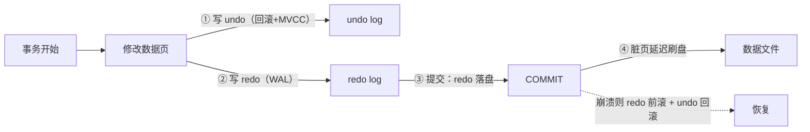
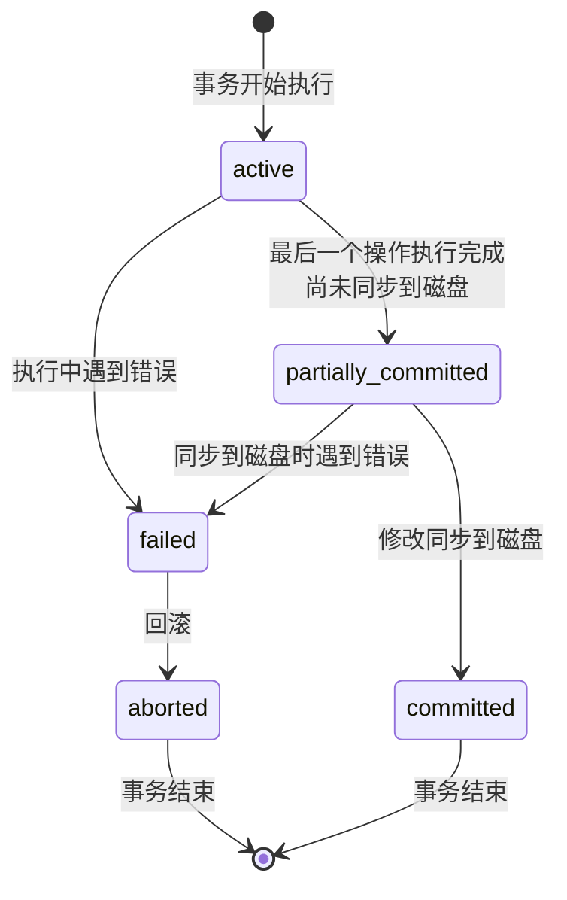
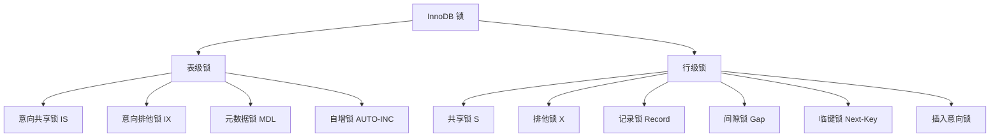
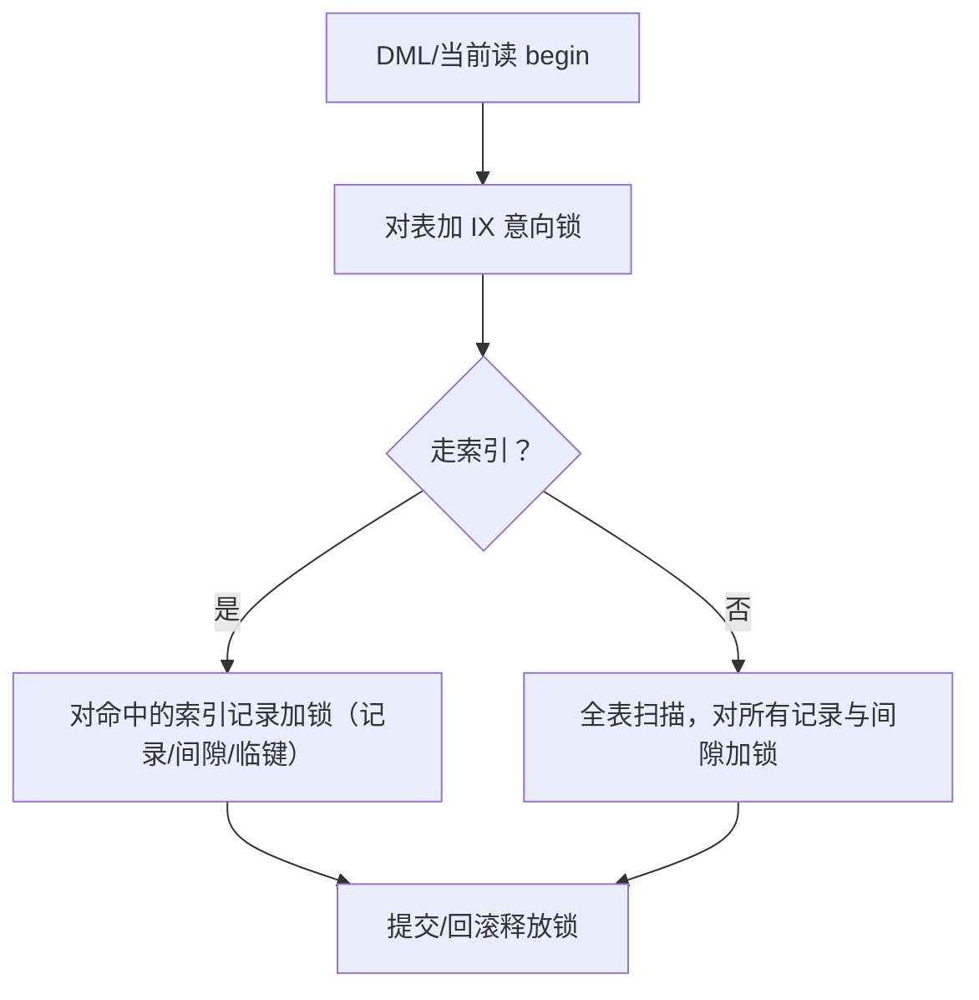
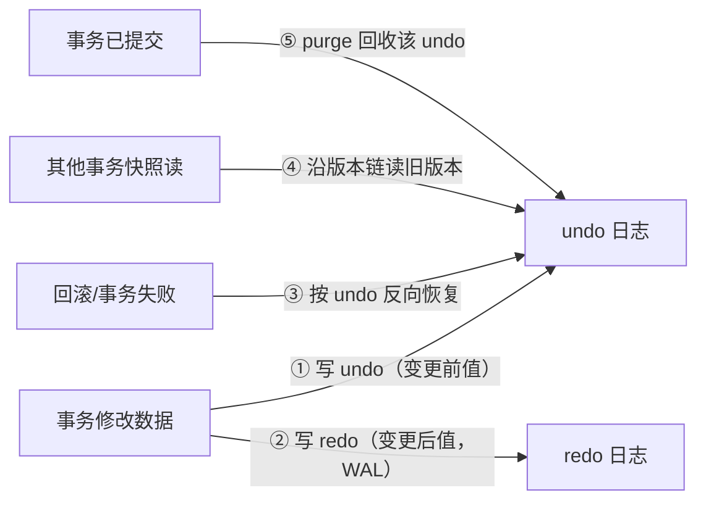

# 事务、锁、MVCC与undo日志

事务与锁是关系型数据库最核心也最复杂的机制。**事务**回答"并发操作如何保证正确性"，**锁与 MVCC** 回答"如何在保证正确性的前提下最大化并发度"，而 **undo 日志** 是 MVCC 多版本读的数据来源与事务回滚的依据。本文以 MySQL 8.0 InnoDB 为基准，从事务与隔离级别，到锁体系与加锁行为，再到 MVCC 一致性读与 undo 日志，建立完整体系。

## 第一部分：事务与隔离级别

### 事务的起源

对于大部分程序员来说，他们的任务就是把现实世界的业务场景映射到数据库世界。比如银行为了存储人们的账户信息会建立一个 `account` 表。现实世界中一些看似很简单的状态转换（如转账），映射到数据库世界却不是那么容易的。比方说狗哥要给猫爷转 10 块钱，需要执行下面这两条语句：

```sql
UPDATE account SET balance = balance - 10 WHERE id = 1;
UPDATE account SET balance = balance + 10 WHERE id = 2;
```

但这里头有个问题：上述两条语句只执行了一条时忽然服务器断电了怎么办？把狗哥的钱扣了，但没给猫爷转过去。为了保证数据库操作符合现实世界中状态转换的规则，设计数据库的工程师提出了 `事务` 的概念。

### 事务的 ACID 特性

`MySQL` 中事务的 `原子性`（`Atomicity`）、`隔离性`（`Isolation`）、`一致性`（`Consistency`）和 `持久性`（`Durability`）四个特性，取英文单词首字母即 `ACID`。

| 特性 | 含义 | InnoDB 的实现 |
|------|------|---------------|
| **原子性** Atomicity | 事务内操作要么全部成功、要么全部回滚 | **undo log**：记录变更前数据，回滚时反向执行 |
| **一致性** Consistency | 事务执行前后数据满足约束（完整性约束/业务规则） | 应用层保证 + 数据库约束 + 原子性/隔离性/持久性协同 |
| **隔离性** Isolation | 并发事务互不干扰 | **锁 + MVCC** |
| **持久性** Durability | 事务提交后数据不丢失 | **redo log**（WAL：先写日志后写数据） |



**关键认知**：提交 ≠ 数据页已落盘，而是 **redo 已落盘**。这就是持久性与性能能兼得的原因——顺序写 redo 日志远比随机写数据页快。

#### 原子性（Atomicity）

现实世界中的转账操作是一个不可分割的操作，要么压根儿没转，要么转账成功，不能存在转了一半的中间状态。这种要么全做、要么全不做的规则称为 `原子性`。为了保证在数据库世界中某些操作的原子性，设计工程师需要保证：如果在执行操作的过程中发生了错误，把已经做了的操作恢复成没执行之前的样子。

#### 隔离性（Isolation）

现实世界中的两次状态转换应该是互不影响的。但真实的数据库中多个事务的操作可能交替执行，如果不加以控制，可能导致错误的结果（如两个转账操作并发执行时账户余额出错）。所以需要采取一些措施，让访问相同数据的不同状态转换对应的数据库操作的执行顺序有一定规律，这个规则被称为 `隔离性`。

#### 一致性（Consistency）

数据库中的数据应该全部符合现实世界中的约束。如何保证一致性？一方面数据库本身可以保证一部分一致性需求（主键、唯一索引、外键、`NOT NULL`），另一方面更多复杂的一致性需求需要靠业务端程序员自己保证（如通过业务代码判断余额不能为负）。前面介绍的 `原子性` 和 `隔离性` 都会对 `一致性` 产生影响，所以**数据库某些操作的原子性和隔离性都是保证一致性的一种手段**。

#### 持久性（Durability）

当现实世界的一个状态转换完成后，这个转换的结果将永久保留，这个规则称为 `持久性`。对数据库来说，`持久性` 意味着该转换对应的数据库操作所修改的数据都应该在磁盘上保留下来，不论之后发生什么事故，本次转换造成的影响都不应该丢失。

### 事务的状态与语法

设计工程师根据事务操作所执行的不同阶段，把 `事务` 大致划分成几个状态：活动的（active）、部分提交的（partially committed）、失败的（failed）、中止的（aborted）和提交的（committed）。一个基本的状态转换图如下：



**只有当事务处于提交的或者中止的状态时，一个事务的生命周期才算结束**。

#### 开启事务

可以使用下面两种语句之一来开启一个事务：

```sql
BEGIN [WORK];
START TRANSACTION;
```

`START TRANSACTION` 语句比 `BEGIN` 语句多一点儿功能：可以在后边跟随几个 `修饰符`：`READ ONLY`（只读事务）、`READ WRITE`（读写事务）、`WITH CONSISTENT SNAPSHOT`（启动一致性读）。

#### 提交与中止事务

```sql
COMMIT [WORK];    -- 提交事务
ROLLBACK [WORK];  -- 中止并回滚事务
```

:::: tip 小贴士
ROLLBACK 语句是程序员手动回滚事务时才使用的。如果事务在执行过程中遇到某些错误而无法继续执行，事务自身会自动回滚。
::::

`MySQL` 中并不是所有存储引擎都支持事务的功能，目前只有 `InnoDB` 和 `NDB` 存储引擎支持。如果某个事务中包含了修改使用不支持事务的存储引擎的表，那么对该表所做的修改将无法回滚。

#### 自动提交与隐式提交

`MySQL` 中有一个系统变量 `autocommit`，默认值为 `ON`。默认情况下，如果不显式使用 `START TRANSACTION` 或 `BEGIN` 语句开启一个事务，那么每一条语句都算是一个独立的事务，这种特性称为事务的 `自动提交`。

当使用 `START TRANSACTION` 或 `BEGIN` 语句开启一个事务，或者把系统变量 `autocommit` 的值设置为 `OFF` 时，事务就不会进行 `自动提交`。但如果输入了某些语句，事务就会 `悄悄` 提交掉，这种因特殊语句导致事务提交的情况称为 `隐式提交`。导致隐式提交的语句包括：定义或修改数据库对象的 `DDL` 语句、隐式使用或修改 `mysql` 数据库中的表、事务控制或关于锁定的语句、加载数据的 `LOAD DATA` 语句等。

#### 保存点

如果开启了一个事务，并且已经敲了很多语句，忽然发现上一条语句有点问题，只好使用 `ROLLBACK` 语句让数据库状态恢复到事务执行之前的样子。设计工程师提出了一个 `保存点` 的概念：在事务对应的数据库语句中打几个点，调用 `ROLLBACK` 语句时可以指定回滚到哪个点。

```sql
SAVEPOINT 保存点名称;                          -- 定义保存点
ROLLBACK [WORK] TO [SAVEPOINT] 保存点名称;      -- 回滚到保存点
RELEASE SAVEPOINT 保存点名称;                   -- 删除保存点
```

### 隔离级别与并发问题

#### 三种并发异常

| 异常 | 现象 | 产生条件 |
|------|------|---------|
| **脏读** | 读到其他事务**未提交**的修改 | 隔离级别 < Read Committed |
| **不可重复读** | 同一事务内两次读取同一行，结果不同（行被其他事务 UPDATE/删除） | 隔离级别 < Repeatable Read |
| **幻读** | 同一事务内两次范围查询，结果行数不同（其他事务 INSERT 新行） | 隔离级别 < Serializable |

#### 四种隔离级别（SQL 标准 vs InnoDB）

| 隔离级别 | 脏读 | 不可重复读 | 幻读 | InnoDB 默认 |
|----------|:----:|:----------:|:----:|:-----------:|
| READ UNCOMMITTED | 可能 | 可能 | 可能 | ❌ |
| READ COMMITTED | 不可能 | 可能 | 可能 | ❌（RC，MySQL 5.6+ binlog 可配） |
| **REPEATABLE READ** | 不可能 | 不可能 | **不可能**（MVCC + 临键锁） | ✅ |
| SERIALIZABLE | 不可能 | 不可能 | 不可能 | ❌（全表加锁） |

> **MySQL 与标准的差异**：SQL 标准认为 RR 不能防幻读，但 InnoDB 通过 **MVCC 快照读 + next-key lock（临键锁）当前读** 在 RR 级别就消除了幻读。因此 **MySQL 默认 RR 即可达到接近 Serializable 的正确性，同时保持高并发**。

#### 快照读与当前读

- **快照读（Snapshot Read）**：普通 `SELECT`（无 `FOR UPDATE`/`LOCK IN SHARE MODE`），读 **undo 版本链**中的快照，**不加锁**；
- **当前读（Current Read）**：`SELECT ... FOR UPDATE`、`SELECT ... LOCK IN SHARE MODE`、`UPDATE`、`DELETE`、`INSERT`，**读取最新版本并加锁**。

```sql
-- 快照读：不加锁，走 MVCC
SELECT * FROM account WHERE id = 1;
-- 当前读：加行锁（FOR UPDATE = 排他锁）
SELECT * FROM account WHERE id = 1 FOR UPDATE;
```

### MVCC 实现原理（概述）

本部分先建立 MVCC 的直观认识，第二部分"MVCC 一致性读"会展开 undo 版本链与 ReadView 的完整机制。

- **undo 版本链**：InnoDB 每行记录隐藏两个字段：`trx_id`（最后修改该行的事务 ID）与 `roll_pointer`（指向 undo 日志，形成版本链）。每次 UPDATE 并不覆盖旧值，而是生成新版本并串入版本链：

```text
记录行（最新版，trx_id=20） ← roll_pointer ← 版本2（trx_id=18） ← 版本1（trx_id=15）
```

- **ReadView（读视图）**：快照读时，InnoDB 生成 ReadView，记录"当前活跃事务 ID 集合"（`m_ids`、`min_trx_id`、`max_trx_id`、`creator_trx_id`）。**可见性判断**（沿版本链从最新版本开始回溯，对每个版本的 `trx_id` 依次判断）：
  - `trx_id = creator_trx_id`：是自己修改的版本 → **可见**；
  - `trx_id < min_trx_id`：生成 ReadView 前已提交 → **可见**；
  - `trx_id >= max_trx_id`：生成 ReadView 后才开启的事务 → **不可见**；
  - `min_trx_id <= trx_id < max_trx_id`：若 `trx_id ∈ m_ids` → 生成 ReadView 时仍未提交，**不可见**；若不在 `m_ids` 中 → 已提交，**可见**。
  - 不可见就沿 `roll_pointer` 找更早的版本，直到找到可见版本为止。
  - **RC 级别**：每次快照读都生成新 ReadView（能看到其他事务新提交的数据 → 不可重复读）；
  - **RR 级别**：**第一次快照读生成 ReadView 后整个事务复用**（→ 可重复读）。这就是 RR 消除不可重复读的原理。
- **当前读与幻读的消除**：当前读不走版本链，而是**加锁**。RR 级别下，InnoDB 对范围查询使用 **next-key lock（临键锁）= 记录锁 + 间隙锁**，锁住扫描区间内所有记录及记录之间的"间隙"，其他事务无法在间隙内 INSERT，从而消除幻读。

### 第一部分小结：事务与隔离级别

- ACID 四个特性分别由 undo（原子性）、锁+MVCC（隔离性）、redo（持久性）支撑，一致性由三者协同保证；
- MySQL 默认 RR 级别即防幻读：快照读走 MVCC 版本链，当前读走 next-key lock；
- ReadView 的复用时机（首次快照读 vs 每次快照读）是 RR 与 RC 的本质差异；
- 事务语法：`START TRANSACTION`/`BEGIN` 开启、`COMMIT` 提交、`ROLLBACK` 回滚、`SAVEPOINT` 保存点。

## 第二部分：锁机制与 MVCC

前文（事务与隔离级别部分）中 MVCC（快照读）与 next-key lock（当前读）是 InnoDB 消除幻读的两大武器。本节聚焦**锁的完整机制**与 **MVCC 的一致性读**：从 S/X 锁的兼容矩阵，到间隙锁/临键锁的区间语义，再到死锁的检测与排查，以及加锁行为分析（面试高频）。

### 锁粒度与类型总览



锁类型一览：

| 锁 | 粒度 | 说明 |
|----|------|------|
| 共享锁 S | 行 | 读读兼容，`LOCK IN SHARE MODE` / `FOR SHARE` |
| 排他锁 X | 行 | 读写/写写互斥，`FOR UPDATE`/DML |
| 意向锁 IS/IX | 表 | 表级"意图"标记，避免逐行检查表锁冲突 |
| 记录锁 Record Lock | 行 | 锁定单条索引记录 |
| 间隙锁 Gap Lock | 区间 | 锁定记录之间的间隙，防插入（RC 级别关闭） |
| **临键锁 Next-Key Lock** | 区间 | 记录锁 + 间隙锁，默认 RR 下范围查询使用 |
| 插入意向锁 | 区间 | 插入前的意向声明，多个可共存（互不阻塞） |
| 自增锁 AUTO-INC Lock | 表 | 自增计数器并发控制 |
| 元数据锁 MDL | 表 | DDL 与 DML 互斥，等待超时由 `lock_wait_timeout` 控制 |

### 行级锁：S/X 与兼容矩阵

| | S（共享） | X（排他） |
|------|:---:|:---:|
| **S** | ✅ 兼容（读读可并发） | ❌ 冲突 |
| **X** | ❌ 冲突 | ❌ 冲突 |

- **S 锁**：`SELECT ... LOCK IN SHARE MODE`（8.0 也可用 `SELECT ... FOR SHARE`）；
- **X 锁**：`SELECT ... FOR UPDATE`、`UPDATE`、`DELETE`、`INSERT`；
- 行锁基于**索引记录**加锁：没有索引的 WHERE 条件会退化为锁全表（所有记录 + 间隙）。

### 三种区间锁（面试核心）

以索引记录 `10, 11, 13, 20` 为例：

| 锁 | 锁定范围 | 目的 | 使用场景 |
|----|---------|------|---------|
| **记录锁** | 单个索引记录（如 11） | 行级互斥 | 主键/唯一键等值查询 |
| **间隙锁** | 记录之间的开放区间（如 (11,13)），**不含记录本身** | 阻止间隙内插入 | 等值查询但记录不存在；范围查询 |
| **临键锁** | 记录 + 前一个间隙（如 (11,13]） | 防幻读（阻止插入到区间） | RR 级别范围查询/扫描 |

**关键规则**：

1. **临键锁 = 记录锁 + 间隙锁**，是 RR 级别默认的"范围锁"；
2. **间隙锁之间不冲突**：两个事务可以同时持有同一间隙的间隙锁（它们的冲突对象是"插入者"）；
3. **RC 级别**（`binlog_format=ROW` 时）**关闭间隙锁**，只保留记录锁——牺牲防幻读换并发；
4. **唯一键等值查询**：记录存在 → 只加记录锁（临键锁退化为记录锁，因为唯一确定）；记录不存在 → 加间隙锁。

```sql
-- 例 1：主键等值且记录存在 → 仅记录锁
SELECT * FROM t WHERE id = 11 FOR UPDATE;
-- 例 2：主键等值但记录不存在 → 间隙锁（id=15 不存在，锁 (13,20) 间隙）
SELECT * FROM t WHERE id = 15 FOR UPDATE;
-- 例 3：范围查询 → 临键锁 (10,11] (11,13] (13,20] (20,∞)
SELECT * FROM t WHERE id > 10 FOR UPDATE;
```

### 意向锁与表级锁

- **意向锁（IS/IX）**：事务想对表内行加锁前，先对表加意向锁——**表级"意图声明"**，让表锁判断无需逐行检查；
- 兼容性：IS 与 IX 互相兼容（行锁互不阻塞），但**与表级 S/X 冲突**（`LOCK TABLES` 场景）；
- **元数据锁（MDL）**：DML 自动持有 MDL 共享锁，DDL 需要 MDL 排他锁 → **长事务阻塞 DDL** 的根源（`Waiting for table metadata lock`）；
- **自增锁（AUTO-INC）**：`innodb_autoinc_lock_mode=2`（8.0 默认交错模式）——只保证单语句内自增值连续，statement 格式 binlog 下主从自增值可能不一致（→ 8.0 建议 `binlog_format=ROW`）。

### 加锁流程与一致读



- **两阶段锁（2PL）**：锁在事务中"随用随加"，**统一在提交/回滚时释放**——因此事务内最后一条语句加锁后尽快提交，能缩短持锁时间；
- **快照读不加锁**（普通 SELECT 走 MVCC），只有当前读（FOR UPDATE/LOCK IN SHARE MODE/DML）才加锁。

#### MVCC 一致性读

MVCC 使快照读不加锁即可看到一致的快照：每行记录隐藏 `trx_id` 与 `roll_pointer` 形成 undo 版本链，快照读生成 ReadView 判断可见性。RR 级别下第一次快照读后复用 ReadView，实现可重复读。

#### undo 日志：版本链与回收

undo 记录的是**变更前的数据**，是 MVCC 多版本读的数据来源，也是事务回滚的依据（原子性）。redo 保证"提交了不丢"，undo 保证"没提交能悔棋"——两者都先于数据页落盘（WAL）。



同一行的多次修改形成**版本链**：最新版在聚簇索引记录中，历史版本通过 `roll_pointer` 串在 undo 日志上。快照读时沿版本链回溯，找到第一个对自身 ReadView 可见的版本：

```
聚簇索引记录（最新，trx_id=30）
   └─ roll_pointer → undo 版本3（trx_id=26）
        └─ roll_pointer → undo 版本2（trx_id=21）
             └─ roll_pointer → undo 版本1（trx_id=15，初始 INSERT）
```

undo 分两类：`insert undo`（记录插入行的主键，提交后立即可被 purge）与 `update undo`（记录变更前旧值，需等无事务快照引用才能 purge）。**purge 线程**（`innodb_purge_threads`，8.0 默认 4 个）负责回收已提交且不再被任何快照引用的 undo 页，并顺带清理"删除标记行"的物理空间。

> **History list length 过大**：说明有**长事务**长期持有快照，undo 无法 purge，导致 undo 表空间暴涨、版本链过长拖慢查询——"长事务是万恶之源"的又一佐证。

8.0 中 undo 已从系统表空间独立管理：`innodb_undo_tablespaces`（默认 2 个）、`innodb_max_undo_log_size`（默认 1GB，超阈值自动截断）、`innodb_undo_log_truncate`（默认 ON）。可动态管理：

```sql
-- 8.0 动态创建/删除 undo 表空间
CREATE UNDO TABLESPACE undo_003 ADD DATAFILE 'undo_003.ibu';
DROP UNDO TABLESPACE undo_003;
-- 查看未 purge 的 undo 数量（History list length）
SHOW ENGINE INNODB STATUS\G
```

### 加锁行为分析（面试高频）

| 场景 | 隔离级别 | 加锁行为 |
|------|---------|---------|
| `SELECT ... WHERE id=1`（主键） | RR | 不加锁（快照读） |
| `SELECT ... WHERE id=1 FOR UPDATE` | RR | 主键等值：仅记录锁；**记录不存在**：间隙锁 |
| `SELECT ... WHERE name='x' FOR UPDATE` | RR | 非唯一索引等值：记录锁 + 相邻间隙锁 |
| `UPDATE WHERE age>100` | RR | 全区间 next-key lock（防幻读） |
| 无索引条件 UPDATE | RR | **锁全表所有记录与间隙**（退化为表级锁效果） |
| RC + binlog=ROW | RC | 仅记录锁（间隙锁关闭，幻读不防但可接受） |

> **黄金法则**：UPDATE/DELETE 必须走索引，否则 InnoDB 会锁住全表记录——这是生产事故的高发点。

### 死锁

#### 成因与检测

死锁 = 两个及以上事务互相持有对方需要的锁且都不释放。InnoDB 通过**等待图（wait-for graph）**检测，发现后**回滚代价最小的事务**（`Deadlock found when trying to get lock`），并返回 `1213` 错误码。


#### 常见死锁场景

1. **交叉加锁**：事务 1 先 A 后 B，事务 2 先 B 后 A（按固定顺序加锁可避免）；
2. **间隙锁冲突**：两个事务同时插入相邻区间，插入意向锁互相等待；
3. **唯一键冲突**：插入唯一键冲突时先加 S 锁再升级 X 锁，两个插入互相等待；
4. **范围与点查交错**：全表扫描与点查锁定范围重叠。

#### 排查与规避

```sql
-- 查看最近一次死锁的完整信息（事务、持锁/等锁、SQL）
SHOW ENGINE INNODB STATUS\G
-- 8.0 性能表：实时锁等待
SELECT * FROM performance_schema.data_lock_waits\G
SELECT * FROM performance_schema.data_locks\G
-- 阻塞关系查询（配合 sys 库）
SELECT * FROM sys.innodb_lock_waits\G
```

**排查步骤**：

1. `sys.innodb_lock_waits` 找到阻塞者与等待者（及各自的 SQL）；
2. `SHOW PROCESSLIST` 确认事务状态（`trx_query` 显示当前 SQL）；
3. 对阻塞者：`KILL <trx_mysql_thread_id>` 或等待其提交；
4. 根治：优化 SQL（走索引）、缩短事务、统一加锁顺序。

**规避策略**：

- 业务侧：所有事务按**同一顺序**访问资源；事务尽量短小；
- SQL 侧：`UPDATE/DELETE` 走索引；避免大范围无索引更新；
- 架构侧：高并发下用 **RC 隔离级别 + binlog=ROW**（阿里等互联网大厂标配），减少间隙锁冲突；
- 兜底：应用捕获 `1213` 错误码自动重试。

### 面试高频问答题

**Q1：RR 级别下 `SELECT ... FOR UPDATE` 一定加临键锁吗？**
不一定。主键/唯一键等值且记录存在 → 退化为记录锁；记录不存在 → 间隙锁；范围/全表扫描 → 临键锁。

**Q2：间隙锁冲突吗？**
间隙锁之间互相兼容，间隙锁与插入意向锁冲突（间隙被锁时无法插入）。

**Q3：为什么 RC 级别下 binlog 要 ROW 格式？**
RC 关闭间隙锁 → 可能幻读 → statement 格式 binlog 回放结果与主库不一致；ROW 格式记录行变更，与隔离级别无关。

**Q4：如何避免死锁？**
统一加锁顺序、短事务、走索引、RC 级别、捕获 1213 重试。

## 小结

- 事务的 ACID 由 undo（原子性）、锁+MVCC（隔离性）、redo（持久性）协同支撑；MySQL 默认 RR 即防幻读（快照读 MVCC + 当前读 next-key lock）；
- 锁体系两条线：**行级（S/X + 记录/间隙/临键）** 与 **表级（意向锁/MDL/自增锁）**；
- 临键锁是 RR 防幻读的武器，RC 关闭间隙锁换并发（必须 ROW binlog）；
- 加锁路径依赖索引：**无索引 UPDATE = 全表锁**，生产大忌；
- MVCC 快照读不加锁，靠 undo 版本链 + ReadView 可见性判断；undo 由 purge 线程回收，长事务会撑大 History list length；
- 死锁由等待图检测并回滚 victim，生产上以"顺序加锁 + 短事务 + RC 兜底重试"组合规避；
- 排查用 8.0 的 `performance_schema.data_locks` / `sys.innodb_lock_waits`，定位阻塞后 KILL 或等提交。
