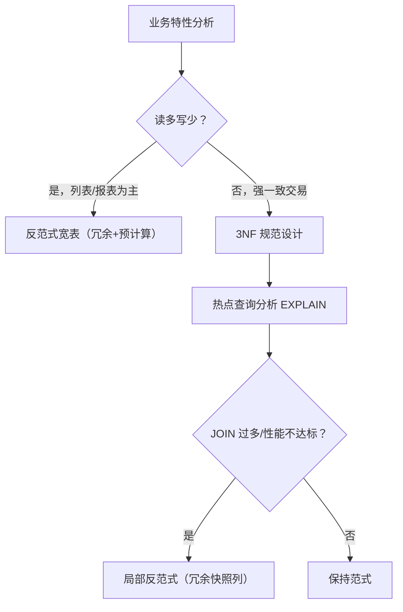
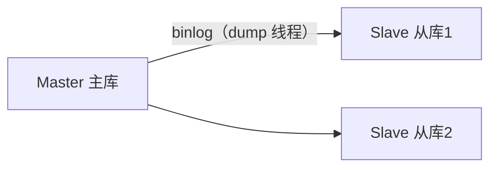
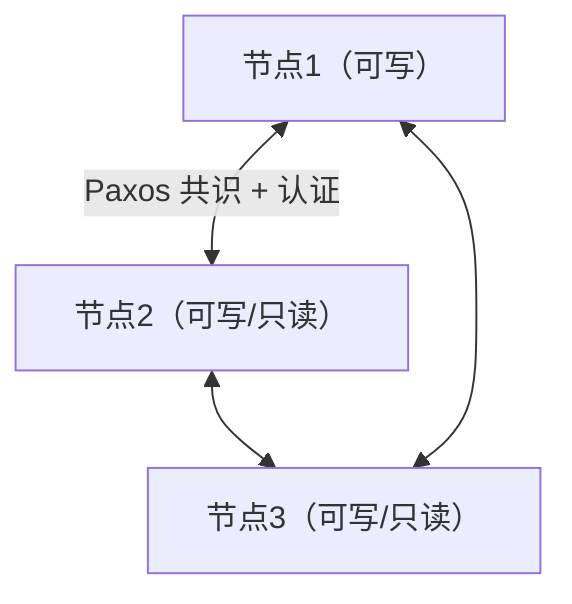
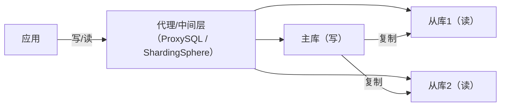

# 数据库表设计与性能瓶颈

表设计决定了数据库 80% 的性能上限——索引可以优化查询，但**糟糕的 schema 无法靠索引救回来**；而单机性能天花板则由 **硬件 → 参数 → 架构** 三层决定。本文把"怎么建表"与"怎么突破性能瓶颈"放在一篇，从范式与数据类型选型，到硬件/参数/复制架构，给出从设计到落地的完整路径。

## 第一部分：数据库表设计

### 范式与反范式

#### 范式理论

| 范式 | 要求 | 通俗解释 |
|------|------|---------|
| 1NF | 属性不可再分 | 每列原子：一个字段不存多个值（如"张三,李四"） |
| 2NF | 满足 1NF + 非主属性完全依赖主键 | 消除部分依赖：联合主键下，非主键列不能只依赖主键的一部分 |
| 3NF | 满足 2NF + 非主属性不传递依赖主键 | 消除传递依赖：如"订单表存用户部门"（用户→部门 传递依赖） |
| BCNF | 每个决定因素都是候选键 | 3NF 的加强版，主属性内部的传递依赖也消除 |

**范式的好处**：数据冗余少、更新一致性好、节省存储。**代价**：查询需要多表 JOIN，关联变多、性能下降。

#### 反范式：何时主动打破

| 场景 | 反范式做法 | 理由 |
|------|-----------|------|
| 订单列表页 | 订单表冗余"用户名/手机号"快照 | 避免高频列表查询 JOIN 用户表；用户改名不影响历史订单 |
| 统计计数 | 冗余计数列（如文章表冗余评论数） | 避免每次 COUNT(*) 聚合 |
| 宽表数仓 | 多表合并为宽表 | OLAP 场景查询即取，JOIN 代价不可接受 |

**取舍原则**：OLTP 在线交易以 3NF 为主、适度冗余（冗余字段必须有同步机制）；OLAP 分析以反范式宽表为主；**冗余字段要有明确的同步机制**（事务内更新/异步任务补偿），否则必然产生脏数据。



### 数据类型选型（8.0 视角）

#### 数值类型

| 类型 | 存储 | 场景 |
|------|------|------|
| TINYINT | 1 字节 | 状态码、开关（-128~127） |
| SMALLINT | 2 字节 | 小范围枚举 |
| INT | 4 字节 | 常规 ID、计数（-21 亿~21 亿） |
| BIGINT | 8 字节 | 大 ID、雪花 ID、时间戳毫秒 |
| DECIMAL(p,s) | 变长 | **金额必须用 DECIMAL**（精确十进制） |
| FLOAT/DOUBLE | 4/8 字节 | 近似值，仅科学计算/经纬度等精度可容忍场景 |

> **int(3)/int(5) 的真相**：`int(3)` 不是"3 位整数"，括号内只是**显示宽度**（配合 ZEROFILL 补零），存储与取值范围完全不变。8.0.17+ 起显示宽度已废弃。设计时不需要写 `int(n)`。

#### 字符串类型

| 类型 | 特点 | 建议 |
|------|------|------|
| CHAR(n) | 定长，不足补空格，0-255 | 定长码值：MD5、固定编码 |
| VARCHAR(n) | 变长，1-65535 字节 | 绝大多数文本字段 |
| TEXT/BLOB | 大文本/二进制，独立存储（溢出页） | 尽量少用：无法默认索引、排序开销大 |

**CHAR vs VARCHAR**：长度固定且短（MD5、固定编码）→ CHAR；长度可变（用户名、地址）→ VARCHAR；**手机号/身份证**虽长度固定，作为索引列 VARCHAR 更省，生产多用 VARCHAR(11)/VARCHAR(18)。

#### 日期时间类型

| 类型 | 范围 | 存储 | 特点 |
|------|------|------|------|
| DATE | 1000-01-01 ~ 9999-12-31 | 3 字节 | 仅日期 |
| TIME | -838:59:59 ~ 838:59:59 | 3 字节 | 时间段 |
| DATETIME | 同 DATE | 8 字节（5.6.4 起支持小数秒） | 无时区，存啥显示啥 |
| TIMESTAMP | 1970-01-01 ~ 2038-01-19 | 4 字节 | **自动按会话时区转换** |

**TIMESTAMP 的坑**：2038 年问题（4 字节上限）；时区自动转换导致多机房读出不同值；8.0 中 DATETIME 也支持自动初始化/更新。**建议**：新系统统一用 **DATETIME(3)**（毫秒精度）或 BIGINT 毫秒时间戳。

#### 其他类型

| 类型 | 说明 |
|------|------|
| JSON | 8.0 原生：`->`/`->>` 提取、`JSON_TABLE()` 展开、多值索引（8.0.17+）、`CHECK (json_valid(col))`（CHECK 约束自 8.0.16 起强制生效）。适合灵活配置 |
| ENUM | 紧凑但**修改枚举需 DDL**、排序按定义顺序，新项目建议 TINYINT + 字典表 |
| 生成列/GENERATED | 配合函数索引、不可见索引（详见索引篇） |
| 布尔 | 无原生 BOOLEAN，用 TINYINT(1) |

### 字段设计规范

#### 通用规范

1. **主键**：8.0 推荐 `BIGINT UNSIGNED AUTO_INCREMENT` 或雪花/分布式 ID；**不建议 UUID 直接做主键**（无序、聚簇索引页分裂严重）；
2. **NOT NULL + DEFAULT**：所有字段尽量 `NOT NULL`（NULL 使索引统计与比较复杂化），业务无值用空串/0/默认值；
3. **大字段独立**：TEXT/BLOB/超长 VARCHAR 拆出主表，避免行溢出拖慢主键查询；
4. **预留字段是反模式**：`reserve1/reserve2` 会让语义脱节，8.0 的 `ALTER TABLE ... ADD COLUMN` 是 INSTANT 操作（秒级），需要时再加。

#### 命名与 InnoDB 注意事项

- 表名/字段名：全小写下划线，动词+名词（`is_deleted`、`created_at`）；
- 索引：`idx_`（普通）、`uk_`（唯一）、`fk_`（外键）；
- **必须显式指定主键**：否则 InnoDB 用第一个非空唯一索引或隐式生成 6 字节 rowid；
- **字符集统一 utf8mb4**（8.0 默认，支持 emoji），排序规则 `utf8mb4_0900_ai_ci`；
- **行格式**：8.0 默认 `DYNAMIC`，勿手动指定 COMPACT；
- 分区表谨慎（唯一键必须含分区键），优先分表/归档。

### 实战案例

#### IP 地址存储

```sql
-- ❌ VARCHAR(15) 浪费 3 倍空间且无法范围查询优化
-- ✅ INT UNSIGNED 4 字节，配合 INET_ATON/INET_NTOA
ip INT UNSIGNED
SELECT INET_ATON('192.168.1.1');   -- 3232235777
-- 8.0 还支持 INET6_ATON/INET6_NTOA（BINARY(16)，存 IPv6）
```

#### 一张规范的订单表

```sql
CREATE TABLE user_order (
  id BIGINT UNSIGNED NOT NULL AUTO_INCREMENT,
  order_no VARCHAR(32) NOT NULL COMMENT '业务订单号（唯一）',
  user_id BIGINT UNSIGNED NOT NULL,
  amount DECIMAL(12,2) NOT NULL COMMENT '金额，分转元',
  status TINYINT NOT NULL DEFAULT 0 COMMENT '0待支付 1已支付 2已取消',
  pay_time DATETIME(3) NULL,
  created_at DATETIME(3) NOT NULL DEFAULT CURRENT_TIMESTAMP(3),
  updated_at DATETIME(3) NOT NULL DEFAULT CURRENT_TIMESTAMP(3) ON UPDATE CURRENT_TIMESTAMP(3),
  PRIMARY KEY (id),
  UNIQUE KEY uk_order_no (order_no),
  KEY idx_user_id (user_id, created_at)
) ENGINE=InnoDB DEFAULT CHARSET=utf8mb4 COLLATE=utf8mb4_0900_ai_ci COMMENT='用户订单表';
```

#### 表大小分层

| 级别 | 数据量 | 设计策略 |
|------|--------|---------|
| 小表 | < 100 万行 | 常规设计，索引适度 |
| 中表 | 100 万 ~ 1000 万行 | 索引精细化、冷热分离 |
| 大表 | > 1000 万行 | 归档、读写分离、按时间分表 |
| 超大表 | > 1 亿行 | 分库分表（见第二部分与高可用章节） |

## 第二部分：性能瓶颈与复制架构

单机 MySQL 的性能天花板取决于 **硬件（CPU/内存/磁盘）→ 参数（InnoDB 配置）→ 架构（复制拓扑）** 三层。前三层大约能榨出单机 10 万级 QPS，再往上必须引入读写分离与分库分表。

### 硬件选型

- **CPU**：瓶颈通常先 IO 后 CPU；高频小事务场景**主频优先**（4-8 核优于低频 32 核），复杂分析场景核数优先；
- **内存**：Buffer Pool 是第一优先级，目标装下热点数据页；单机单实例用 60%~80% 物理内存；8.0 可动态调 `innodb_buffer_pool_size`；
- **磁盘**：SSD 是底线（NVMe 更好），redo 日志与数据文件**分盘放置**；8.0 支持 `innodb_directories` 多目录。

### 核心参数调优（8.0）

#### 内存类

| 参数 | 建议 | 说明 |
|------|------|------|
| `innodb_buffer_pool_size` | 物理内存 60%~80% | 最大内存消耗项 |
| `innodb_buffer_pool_instances` | 按 128MB 分片 | 减少并发访问锁竞争 |
| `innodb_log_buffer_size` | 16~64MB | redo 缓冲，大事务批量提交受益 |
| `sort_buffer_size`/`join_buffer_size` | 2~8MB（**会话级**） | 每连接一份，勿全局过大 |
| `tmp_table_size`/`max_heap_table_size` | 16~64MB | 内存临时表上限 |

#### 日志与刷盘类

| 参数 | 建议 | 说明 |
|------|------|------|
| `innodb_redo_log_capacity` | 8.0.30+，写入密集 2~8GB | 动态容量，替代旧 `innodb_log_file_size` |
| `innodb_flush_log_at_trx_commit` | 1（最安全）；性能优先可 2 | 1=每次提交刷盘；2=每秒刷盘 |
| `sync_binlog` | 1（配合双一） | 1=每次提交刷 binlog |
| `innodb_flush_method` | Linux 用 `O_DIRECT`（8.0 默认） | 绕过 OS 缓存，减少刷盘抖动 |
| `innodb_io_capacity`/`max` | SSD：2000/4000+ | 后台刷脏页速率 |
| `innodb_max_dirty_pages_pct` | 75~90 | 脏页占比阈值 |

> **"双 1"配置**（`innodb_flush_log_at_trx_commit=1` + `sync_binlog=1`）：最安全但最慢，金融场景必须；一般业务可折中。

#### 并发与连接类

| 参数 | 建议 | 说明 |
|------|------|------|
| `max_connections` | 按压测（1000~5000） | 过小拒绝连接，过大连接风暴 |
| `innodb_thread_concurrency` | 0（8.0 默认不限制） | 并发控制 |
| `innodb_purge_threads` | 4（默认） | undo 回收并行度 |
| `innodb_page_cleaners` | 等于 buffer pool 实例数 | 刷脏页并行度 |

### 复制架构：从单点走向集群

#### 经典主从复制（异步）



- 复制链路：主库写 binlog → 从库 IO 线程拉取写 relay log → SQL 线程回放；
- **异步复制风险**：主库宕机时未同步事务**可能丢失**；
- 用途：读写分离、容灾、从库备份。

**复制拓扑变体**：

| 拓扑 | 结构 | 适用 |
|------|------|------|
| 一主一从/一主多从 | 星型 | 读写分离入门 |
| 级联复制（树形） | Master → 中转 → 多个从 | 从库多、减负主库 dump |
| 环形复制 | A→B→C→A | 历史遗留，**不推荐** |
| 双主复制 | A↔B 互为主从 | 主备切换（配合 VIP），写入单侧 |

#### GTID 复制（8.0 推荐）

每个事务有全局唯一 ID（`source_id:transaction_id`），从库按 GTID 自动定位，取代"binlog 文件名 + 位点"：

```sql
gtid_mode = ON
enforce_gtid_consistency = ON
CHANGE REPLICATION SOURCE TO
  SOURCE_HOST='...', SOURCE_USER='repl', SOURCE_PASSWORD='...',
  SOURCE_AUTO_POSITION = 1;
START REPLICA;
SHOW REPLICA STATUS\G
```

**优势**：故障切换无需人工找位点；复制一致性校验（`gtid_executed`）方便。

#### 半同步复制（Semisync）

主库提交前**至少等待一个从库确认收到 binlog**（收到 ≠ 已回放）：

- **8.0.26 起半同步插件内置于服务器**，无需再 `INSTALL PLUGIN`（此前为需单独安装的插件）；变量名为 `rpl_semi_sync_source_enabled`（旧名 `rpl_semi_sync_master_enabled` 保留为兼容别名，8.4 中移除）；
- `rpl_semi_sync_source_wait_point`（旧名 `rpl_semi_sync_master_wait_point`，`AFTER_SYNC` 为默认）；
- `rpl_semi_sync_source_wait_for_replica_count`（旧名 `rpl_semi_sync_master_wait_for_slave_count`）：等待几个从库确认（1 即可）；
- **超时降级**：等待超时自动退回异步，保证可用性优先；
- 代价：每次提交多 1-5ms 网络往返。

#### Group Replication 组复制（MGR）



- **MGR = 分布式共识 + 组内复制**：事务经类 Paxos 达成一致，**多数派确认才算提交** → 真正高可用基础；
- 8.0 中 MGR 是 **InnoDB Cluster** 的底座（MySQL Shell + MySQL Router + MGR）；
- 单主模式（单写点，故障自动切换）/ 多主模式（多写点，容忍冲突回滚）；
- 适用：RPO=0、节点 3-9 个的中型集群。

### 读写分离架构落地



**关键设计**：

1. **路由策略**：写 + 强一致读走主库；容忍延迟的读走从库（业务打标 `/*master*/`）；
2. **延迟监控**：`Seconds_Behind_Source` 不精确，用心跳表对比更可靠；
3. **一致性兜底**：写后立即读（如支付结果）强制走主库；
4. **扩容**：从库可水平加（读扩展），主库仍是写单点——写瓶颈需分库分表；
5. **切换**：主库故障提升从库（MGR 自动，传统主从用 MHA/Orchestrator）。

**复制监控（8.0）**：

```sql
SHOW REPLICA STATUS\G   -- Replica_IO_Running / Replica_SQL_Running / Seconds_Behind_Source
SHOW BINARY LOGS; SHOW MASTER STATUS;
```

> 8.0.22+ 将 `SHOW SLAVE STATUS` 改为 `SHOW REPLICA STATUS`，`Seconds_Behind_Master` → `Seconds_Behind_Source`，`START SLAVE` → `START REPLICA`（旧语法兼容但废弃）。

延迟主因：网络传输 + 从库 SQL 线程串行回放。**写后读不一致**两种思路：强制读主库（注解路由）/ 延迟检测（轮询对比时间戳，超时兜底读主）。

### 经典架构选型

| 业务规模 | 架构 | 说明 |
|----------|------|------|
| 起步（单机） | 单实例 + 从库备份 | 从库只做容灾 |
| 读多写少 | 一主多从 + 读写分离 | 读 QPS 至 10 万级 |
| 高可用要求 | 半同步 + 故障自动切换 | RPO≈0 |
| 自动化运维 | InnoDB Cluster（MGR + Shell + Router） | 官方一体化 |
| 写超单机 | 分库分表 | 见分库分表章节 |

## 小结

- 表设计是性能的地基：OLTP 以 3NF 为主、局部反范式；数据类型是隐藏杠杆（金额必 DECIMAL、时间戳 DATETIME(3)/BIGINT、显式主键、NOT NULL、utf8mb4）；
- 硬件三件套：CPU 主频优先、内存装下热点（Buffer Pool 60-80%）、NVMe SSD + redo 分盘；
- 参数调优：redo 容量（8.0.30+ 动态）、双 1 取舍、O_DIRECT、刷盘并发；
- 复制演进：异步 → 半同步 → MGR（Paxos 共识），GTID 让复制与切换不再依赖人工位点；
- 读写分离解决读扩展，写扩展必须分库分表。
