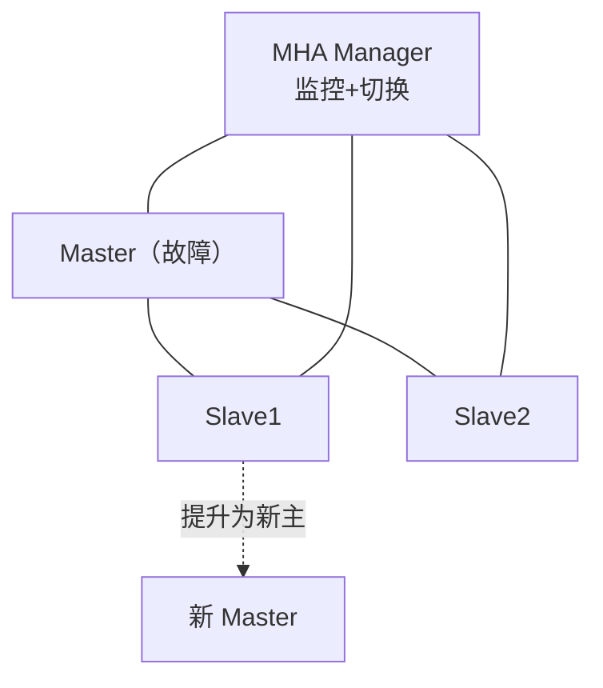
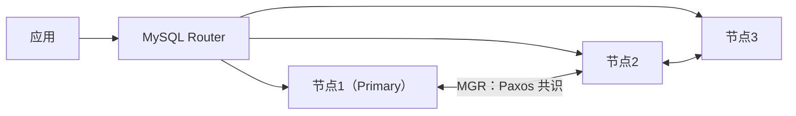

# 高可用、扩展性与运维体系

数据库宕机 = 业务停摆，数据无界增长 = 架构重写。本文把"高可用与扩展"（架构目标）和"运维体系"（日常保障）放在一篇：**先建立可用性指标与高可用方案谱系、故障转移标准流程，再讲垂直/水平扩展与分布式库应对海量数据，最后落到监控、SQL 审核、备份恢复与自动化平台这条运维生命线。**

## 第一部分：高可用与扩展性

### 可用性指标体系

#### SLA 与可用性等级

| 可用性 | 年停机时间 | 俗称 |
|--------|-----------|------|
| 99%（2 个 9） | 87.6 小时 | 一般业务 |
| 99.9% | 8.76 小时 | 常规在线业务 |
| 99.99% | 52.6 分钟 | 核心业务 |
| 99.999% | 5.26 分钟 | 金融/电信级 |

#### MTBF 与 MTTR

- **MTBF（平均故障间隔）**：系统连续正常运行时长——反映**稳定性**；
- **MTTR（平均恢复时间）**：故障发生后恢复时长——反映**恢复能力**；
- 可用性 ≈ `MTBF / (MTBF + MTTR)`：**降低 MTTR 是性价比最高的路径**（MTBF 靠硬件/架构投入，MTTR 靠自动化）。

**降低 MTTR 的手段**：监控告警前置（主从延迟/复制中断/连接数/磁盘水位 5 分钟内告警）；切换自动化（MHA/MGR 秒级切换）；预案演练（拔网线、kill 主库、磁盘写满）；快速恢复套件（备份可验证、binlog 完整、只读降级）。

### 避免单点失效

- **基础软硬件层**：双电源/双网卡、跨机柜/跨可用区部署；主备异构；本地 RAID 或分布式存储 + 异地备份；守护进程（systemd）自动拉起。
- **共享存储方案**：数据放共享存储（SAN/DRBD/云盘），主库挂掉后新主直接挂载同一份数据：

| 方案 | 原理 | 优点 | 缺点 |
|------|------|------|------|
| SAN 共享存储 | 多机挂载同一存储 | 切换快、无丢失 | 存储成本高、本身成单点 |
| DRBD | 块设备实时镜像 | 成本低 | 脑裂风险、性能损耗 |
| 云盘（ESSD） | 云分布式存储 | 高可用托管 | 绑定云厂商 |

> 共享存储 RPO≈0，但**主备脑裂**（split-brain）是最大风险，必须配合 STONITH（隔离故障节点）。

### 高可用方案谱系

#### MMM（历史方案）

双主 + monitor，VIP 漂移切换；依赖虚假 IP、脑裂风险高，**新项目已弃用**。

#### MHA（经典方案）



- 原理：MHA Manager 监控主库；故障时"选最新从库 → 补拉缺失 binlog → 提升新主 → 其余从库 re-point"；
- 优点：成熟稳定、切换秒级、RPO 极小；缺点：依赖 SSH、对网络分区敏感、非官方工具；
- 现状：传统主从仍常用，官方建议迁移 MGR/InnoDB Cluster。

#### Group Replication / InnoDB Cluster（官方现代方案）



- **MGR**：组内事务多数派确认才提交（Paxos 类共识），**无脑裂**；
- **InnoDB Cluster** = MGR + MySQL Shell（部署管理）+ MySQL Router（路由/故障感知）；
- **InnoDB ReplicaSet**：无 MGR 轻量版（传统主从 + Shell），适合不需多写；
- 切换秒级（Router 感知 Primary 变化），RPO=0、RTO≈30s；要求所有表 InnoDB、有主键、3 节点起步。

#### 方案对比

| 方案 | RPO | RTO | 脑裂风险 | 维护方 | 适用 |
|------|-----|-----|:--------:|--------|------|
| MMM | 低 | 分钟级 | 高 | 社区 | ❌ 历史遗留 |
| MHA | ≈0（尽力） | 秒级~10s | 中 | 社区 | 存量主从 |
| 半同步+自研切换 | 0 | 秒级 | 中 | 自研 | 定制化 |
| **MGR/InnoDB Cluster** | **0** | **秒级** | **低** | 官方 | ✅ 新项目首选 |
| 云 RDS 高可用 | 0 | 秒级 | 低 | 云厂商 | ✅ 上云首选 |

### 故障转移与恢复

#### 故障转移（Failover）标准流程

```text
1. 监控发现主库不可用（心跳超时/复制中断）
2. 确认故障：排除网络抖动（多次探测 + 仲裁）
3. 隔离故障节点（STONITH/摘除 VIP），防脑裂
4. 选择新主：数据最新（GTID/位点对比）优先
5. 提升新主 + 补齐缺失事务（GTID 自动对齐）
6. 其余从库重新指向新主（CHANGE REPLICATION SOURCE）
7. 应用流量切换（Router/VIP/客户端感知）
8. 通知 + 复盘（根因分析、预案修订）
```

#### 故障恢复（Failback）

原主库修复后**作为从库**挂回集群（不要直接夺回主身份——数据可能已落后）；GTID 对齐后再评估回切；回切时机：业务低峰 + 演练过回切流程。

#### 高可用守护系统

自建高可用需：监控（Prometheus + mysqld_exporter）→ 告警（阈值 + 抑制）→ 自动切换（脚本/工具）→ 操作审计（切换/演练记录），形成闭环。

#### 故障演练清单

| 演练项 | 验证点 |
|--------|--------|
| kill 主库进程 | 切换是否自动、RTO 是否达标、数据是否丢失 |
| 主从网络隔离 | 半同步是否降级、切换是否触发 |
| 磁盘写满 | 只读保护是否生效、告警是否及时 |
| 从库延迟拉大 | 延迟告警、读流量是否剔除 |
| 备份恢复 | 备份可用性（RPO 验证） |
| DDL 误操作 | 闪回/binlog 恢复预案 |

### 扩展性与海量数据应对

垂直扩展（Scale-Up）有物理天花板；水平扩展（Scale-Out）加机器分摊，理论无限。

| 维度 | Scale-Up（垂直） | Scale-Out（水平） |
|------|------------------|-------------------|
| 手段 | 加 CPU/内存、换 NVMe、参数调优 | 加机器：主从、分片、集群 |
| 天花板 | 单机物理上限 | 理论无上限 |
| 复杂度 | 低 | 高（分片键、跨片查询） |
| 适用 | 中等规模、短期扩容 | 海量数据、长期规划 |

#### 垂直扩展（Scale-Up）

硬件（CPU/内存/NVMe）、参数（redo 容量、连接数）、架构优化（去无索引查询、热点行拆分）、分区表（大表优先分表）。

#### 水平扩展（Scale-Out）

1. **主从 + 读写分离**：读 QPS 线性增长，写仍是单点；
2. **数据分片（分库分表）**：分片键选访问最频繁维度（用户/订单 ID），算法用哈希/范围/一致性哈希；代价是跨片 JOIN、分布式事务、全局 ID、跨片分页；
3. **中间件**：ShardingSphere（Java 生态事实标准）、MyCat（老牌代理）、ProxySQL（读写分离/连接池）；
4. **集群**：MGR/InnoDB Cluster、云 RDS 只读实例。

#### 分布式数据库（NewSQL）

当分库分表管理成本超过收益时，用原生分布式库：**TiDB**（MySQL 协议兼容、自动分片、水平扩展透明）、OceanBase、PolarDB-X。适合 10TB+ 且需强一致、保留 MySQL 习惯的场景。

#### 万亿级数据应对

冷热分层（热数据 MySQL/TiDB、冷数据归档 OLAP）、时间维度分表 + 定期归档、预聚合（Flink + 结果表）、缓存兜底（热点读走 Redis）、8.0 透明页压缩。

## 第二部分：MySQL 运维体系

本部分梳理 MySQL 运维的核心链路：监控告警、SQL 审核、备份恢复，以及将它们串起来的自动化管理平台。先补充 8.0 相对 5.7 的运维关键变化。

### 8.0 运维要点补充

| 领域 | 8.0 变化 |
|------|---------|
| 备份 | **Clone 插件**（`INSTALL PLUGIN clone`）成为官方推荐物理备份：`CLONE INSTANCE FROM 'user'@'host':3306;` 支持实例/从库克隆与增量；`mysqldump` 仍用于逻辑备份（`--single-transaction`） |
| 监控 | `performance_schema` 大幅增强（`data_locks`、`data_lock_waits`、`schema_unused_indexes`，8.0.30 起新增 `Innodb_redo_log_current_lsn` 等 redo 状态变量）；`sys` 库一键盘查 |
| 审计 | 8.0 内置审计日志插件（`audit_log`） |
| 安全 | 默认 `caching_sha2_password`；`mysql_native_password` 已弃用——8.4 起默认禁用、9.0 中移除；密码策略组件 `validate_password` |
| 管理 | `mysqlsh`（MySQL Shell）统一入口，支持 InnoDB Cluster 一键部署 |

### MySQL 监控要点

#### 监控策略与告警

- **监控策略**：每项的告警阈值（如 `threads_running > 30` 触发）；
- **监控趋势图**：历史数据比对快速发现异常；
- **报警方式**：Email/电话/企业微信按需配置。

#### 服务器监控要点

核心指标来自系统文件：登录用户数（`who | wc -l`）、CPU（`/proc/stat`）、负载（`/proc/loadavg`）、IO（`/proc/diskstats` 的 ioutil/iops）、磁盘（`df -m`）、内存（`/proc/meminfo`）、虚拟内存（`free -m`）、TCP（`/proc/net/tcp`）、网络（`/proc/net/dev`）。

#### MySQL 监控要点

- **QPS**：`SHOW GLOBAL STATUS LIKE 'Questions'` 计算；
- **每秒操作**：`Com_select`/`Com_insert`/`Com_update`/`Com_delete`；
- **IBP 命中率、连接数、慢查询数**：Buffer Pool 与状态变量计算；
- **主从集群**：复制状态、延迟、从库只读；
- **事务与死锁**：解析 `SHOW ENGINE INNODB STATUS`；
- 常用：连接数、QPS/TPS、锁等待、IBP 命中率、redo/replication/semi-sync 状态。

#### 常用监控系统

- **Nagios/Cacti**：功能较弱——Nagios 无趋势图、Cacti 告警弱；
- **Zabbix**：应用广，MySQL 模板少需定制；
- **PMM**（Percona）：聚焦 MySQL/MongoDB，Agent + Grafana，开源首选；
- **自研**：推送 + 拉取结合，数据落配置中心，Grafana 展示。

### SQL 审核执行

#### 人肉审批的问题

传统邮件式审核依赖 DBA 经验，效率低、易出错：语法错误需测试环境验证、语义错误需比对线上结构、规范符合性最耗时、任何环节出问题都需返工。

#### 自动化审核执行

工具（如 Arkit/Inception）保证 100% 兼容 MySQL 语法并自动执行：生成**回滚语句**实现闪回；审核流程可视化（提交→审核→自动执行→异常自动修复）；默认选备份、失败一键回滚；DDL 支持 PT-OSC/GH-OST 在线改表；关键节点对接通知。

#### 开发规范审核（规则示例）

**通用规范**：命名（库/表/字段/主键）、基础（引擎/字符集/NOT NULL/注释）、字段（不用 TEXT/BLOB、INT UNSIGNED 存 IPv4）、索引（个数控制、有主键、无冗余）、SQL（不 SELECT *、不大事务、不隐式转换）。

**自定义规则**：SET/ENUM/BIT/BLOB → 警告；列无注释 → 警告；CHAR 超长 → 建议 VARCHAR；自增列非无符号 → 警告；NOT NULL 但默认 NULL/时间默认值不合法 → 错误；INSERT 未指定列列表 → 错误；UPDATE/DELETE 无 WHERE → 警告；ORDER BY RAND() → 警告。

#### 代码审核

- **静态 SQL**：扫描 MyBatis XML，避免慢 SQL 流入生产；
- **动态 SQL**：测试阶段实时抓取运行时 SQL；
- **版本 SQL**：发版扫描待发布脚本，识别高危变更。

### 备份恢复策略

#### 常见问题

本地存储备份（磁盘 double、安全隐患）；手段多样无集中管理；备份文件不校验（恢复才发现问题）；备份节点未随主从切换动态调整（写库备份影响业务）；备份流量与压缩影响线上。

#### 物理 + 逻辑组合

- **Percona Xtrabackup 物理全备 + mysqldump 逻辑备份**组合；
- 按业务等级分策略（周/月/日备）；流备份远程传输 + 提前 `apply-log` 校验；
- 恢复支持：新建实例、挂载 Slave、指定时间点恢复（PITR）、Flashback；
- 存储：本地无备份，备份机留最近 N 次，历史压缩入备份池。

#### 自动化备份恢复系统

智能备份（易扩展、多通道、主从切换自动选从库、限速压缩）；集中管理（备份转任务）；统一调度（按服务压力分发）；数据安全（加密）；恢复（单实例/Slave/PITR/Flashback）；可扩展（接入 Redis 等数据源）。

### MySQL 自动化管理平台

将监控、审核、备份统一为平台：对开发/测试提供全生命周期资源交付，对运维/DBA 提供统一操作与故障恢复。

#### 六大中心

录入中心（主机录入+Agent）、工单中心（实例/权限申请部署回收）、部署中心（MySQL 及分支自动化部署）、配置中心（参数/信息/告警）、用户中心（注册/群组/权限）、高可用中心（存活监控与故障切换）。

#### 三大管理

主机管理（物理/虚拟/云，巡检）、实例管理（单实例搜索展示）、集群管理（集群维度）、健康巡检（超阈值生成报告）、慢查询（实时分布与趋势+执行计划）、运维工具集（pt-kill/tcpdump/死锁打印）、数据归档/订阅（MySQL 到 Redis/Kafka/Hadoop/ES 异构同步）。

## 小结

- 可用性 = MTBF/(MTBF+MTTR)，**降 MTTR（自动化切换 + 演练）是核心抓手**；
- 高可用演进：MMM（弃用）→ MHA（经典）→ **MGR/InnoDB Cluster（官方现代）**，云上直接用 RDS 高可用；RPO=0 需半同步/MGR/共享存储，防脑裂是底线；
- 扩展性三阶段：**Scale-Up → Scale-Out（分片+中间件）→ NewSQL**，分库分表是"最后武器"，万亿级用分布式库 + 冷热分层 + 预聚合；
- 运维三大支柱：**监控告警**（服务器 + MySQL 指标）、**SQL 审核**（人肉→自动化，规范参数化）、**备份恢复**（物理+逻辑、集中校验）；
- 8.0 让运维更体系化：Clone 插件物理克隆、`performance_schema` 增强、`mysqlsh` 统一管控；自动化平台把三大能力串成闭环，监控与备份都强调"校验"。
