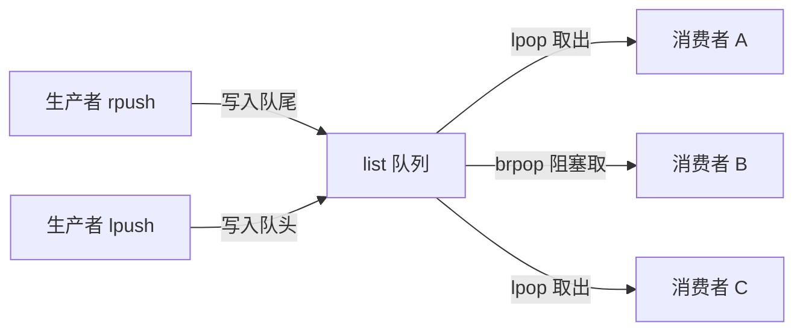
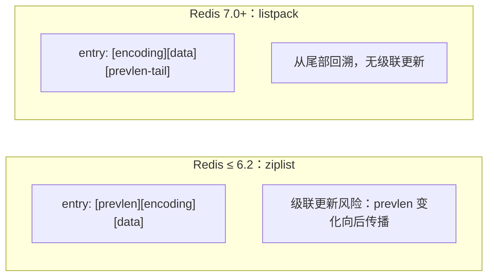

# 基础数据结构与内部编码

## 0. 引言

Redis 之所以被称为"数据结构服务器"（Data Structure Server），而非简单的 KV 缓存，是因为它提供了五种基础数据结构——`string`（字符串）、`list`（列表）、`hash`（字典）、`set`（集合）、`zset`（有序集合），以及基于它们扩展的 `bitmap`、`HyperLogLog`、`GeoHash`、`Stream` 等高级结构。所有上层业务模型都可以用这五种基础结构组合而成。

本文从三个层次展开：**使用层面**（核心命令与典型场景）、**编码层面**（Redis 7.x 的内部编码与演进）、**工程层面**（内存与性能权衡）。理解内部编码是 Redis 调优的基础——同一个 key 在不同编码下占用内存可以相差一个数量级。

## 1. string：动态字符串

### 1.1 基本特性

`string` 是 Redis 最基础的结构，也是唯一能直接承载二进制安全数据的结构。Redis 的 string 是**动态字符串**（SDS，Simple Dynamic String），内部类似 Java 的 `ArrayList`，通过预分配冗余空间减少频繁扩容：

- 字符串长度小于 1MB 时，扩容按 2 倍增长；
- 超过 1MB 后，每次扩容只多分配 1MB；
- 单个 string 最大长度 512MB。

```bash
> set name hello
OK
> get name
"hello"
> strlen name        # 二进制安全，按字节计算
(integer) 5
> append name !      # 追加
(integer) 6
> setrange name 0 h  # 子串覆盖
(integer) 6
```

### 1.2 批量与过期

```bash
> mset name1 boy name2 girl name3 unknown
> mget name1 name2 name3
1) "boy"
2) "girl"
3) "unknown"
> setex token 3600 "abc123"    # set + expire 原子执行
> setnx lock:order 1           # 不存在才写入，分布式锁基础
(integer) 1
> setnx lock:order 2           # 已存在，写入失败
(integer) 0
```

### 1.3 计数语义

当 value 是十进制整数时，string 支持原子自增自减（`INCR`/`INCRBY`/`DECR`/`DECRBY`），整数范围是 signed long（`-9223372036854775808` ～ `9223372036854775807`），溢出返回错误；`INCRBYFLOAT` 则支持浮点运算（key 不存在时从 0 开始）：

```bash
> set counter 100
> incr counter              # 原子自增
(integer) 101
> incrby counter 50
(integer) 151
> set price 100
> incrbyfloat price 3.14
"103.14000000000000057"     # 按 17 位有效数字打印（long double），并非精确的 103.14
> set max 9223372036854775807
> incr max
(error) ERR increment or decrement would overflow
```

计数场景要特别注意：**`incr` 是单线程下天然原子的**，这是它常被用作计数器、限流、ID 生成器的根本原因。

### 1.4 典型场景

| 场景 | 命令组合 | 说明 |
|------|---------|------|
| 缓存 | `SET/GET/EXPIRE` | 最基础的 KV 缓存 |
| 分布式锁 | `SET key val NX PX 30000` | 原子加锁 + 超时释放 |
| 计数器 | `INCR/DECR` | 点赞数、访问量、限流滑动窗口 |
| 位图 | `SETBIT/GETBIT` | 用户签到、在线状态 |
| 会话 | `SETEX` | Token/Session 存储 |

## 2. list：双向链表与快速列表

### 2.1 特性与复杂度

`list` 是**双向链表**（quicklist 实现），插入删除均为 O(1)，但索引定位为 O(N)——这是与数组型结构最大的差异。当列表弹出最后一个元素后，key 自动删除、内存被回收。

```bash
> rpush books python java golang   # 右进
> llen books
(integer) 3
> lpop books                       # 左出（队列）
"python"
> lpush stack redis                # 左进
> lpop stack                       # 左出（栈）
"redis"
```

### 2.2 队列与栈

- **队列**：`rpush` + `lpop`（右边进、左边出，FIFO）；
- **栈**：`lpush` + `lpop`（同侧进出，LIFO）；
- **阻塞队列**：`brpop/blpop` 支持超时阻塞，是异步任务队列的基础：

```bash
> rpush task_queue process_order
> brpop task_queue 5        # 阻塞等待任务，队列非空立即返回
1) "task_queue"
2) "process_order"
```



### 2.3 使用注意

- `lindex`/`lrange` 是 O(N) 操作，大列表上避免频繁使用；
- 7.x 中 list 的底层是 **quicklist**（由多个 listpack 节点组成），兼顾内存与性能；
- 列表不适合存放超大对象（单个元素超过 1GB 会触发错误）。

## 3. hash：字典

### 3.1 特性

`hash` 用于存储对象结构（字段 - 值映射），特别适合表达"对象"语义：对一个对象整体存取、对单个字段单独操作，避免序列化整个对象。

```bash
> hset user:10001 name hello age 30
(integer) 2
> hget user:10001 name
"hello"
> hgetall user:10001
1) "name"
2) "hello"
3) "age"
4) "30"
> hincrby user:10001 age 1     # 字段级原子自增
(integer) 31
> hmset user:10002 name jane city beijing country china
> hlen user:10002
(integer) 3
```

### 3.2 与 string 存对象的对比

| 维度 | string + JSON | hash |
|------|--------------|------|
| 整体读写 | 一次 GET/SET | HGETALL |
| 字段级操作 | 需整体反序列化 | `HGET`/`HSET` 原子单字段 |
| 内存 | JSON 有引号开销 | 字段值分离，更省 |
| 适用 | 快照型数据 | 高频单字段更新的对象 |

**实践建议**：需要不断修改对象中某个字段时用 hash；只做整体读写时两者皆可，视内存而定。

## 4. set：集合

### 4.1 特性

`set` 是无序、去重的字符串集合，支持集合运算（交、并、差），是"标签""关注关系""抽奖去重"等场景的天然选择。

```bash
> sadd myset python
> sadd myset python    # 重复添加返回 0
(integer) 0
> smembers myset
1) "python"
> scard myset          # 元素个数
(integer) 1
> spop myset 2         # 随机弹出（抽奖）
```

集合运算：

```bash
> sadd user:1:tags java python
> sadd user:2:tags java golang
> sinter user:1:tags user:2:tags   # 交集 → 共同点
1) "java"
> sunion user:1:tags user:2:tags   # 并集
1) "java"
2) "python"
3) "golang"
> sdiff user:1:tags user:2:tags    # 差集
1) "python"
```

### 4.2 随机与去重

- `srandmember`：随机取不删除；
- `spop`：随机取出并删除（抽奖、洗牌）；
- 大集合上 `smembers` 是 O(N)，注意使用 `sscan` 渐进式遍历（见后续 Scan 专题）。

## 5. zset：有序集合

### 5.1 特性

`zset` 在 set 基础上为每个元素附加一个 double 型 score，按 score 排序，支持范围查询与排名——"排行榜"的终极答案。

```bash
> zadd ranking 100 python 90 java 80 golang
(integer) 3
> zrange ranking 0 -1                # 升序
1) "golang"
2) "java"
3) "python"
> zrevrange ranking 0 1              # 降序取前 2
1) "python"
2) "java"
> zscore ranking python
"100"
> zincrby ranking 15 python           # 原子加分
"115"
> zrangebyscore ranking 90 115        # 按分数段查询
1) "java"
2) "python"
```

### 5.2 典型场景

| 场景 | 用法 |
|------|------|
| 排行榜 | `zincrby` 更新分数 + `zrevrange` 取榜 |
| 延迟队列 | score 存到期时间，`zrangebyscore` 取到期任务 |
| 滑动窗口限流 | score 存时间戳，`zremrangebyscore` 清理过期窗口 |
| 二级索引 | score 存时间/价格，支持范围查询 |

### 5.3 内部结构提示

zset 底层是 **skiplist（跳跃表）+ dict 的复合结构**：dict 保证 O(1) 按成员查分数，skiplist 保证有序遍历与范围查询。详细源码级分析见本文档《内部实现》系列。

## 6. 内部编码演进：Redis 7.x 视角

### 6.1 什么是内部编码

同一个数据类型，Redis 会根据元素数量、值大小选择不同的底层存储结构，用 `OBJECT ENCODING` 命令可以查看：

```bash
> set tiny 42
> object encoding tiny
"int"                                  # 纯整数 → int 编码
> set small hello
> object encoding small
"embstr"                               # ≤44 字节短串 → embstr
> set big xxxxxxxxxx        # （此处省略：100 个 'x' 的长字符串）
> object encoding big
"raw"                                  # 长串 → raw（SDS）
> rpush list a b c
> object encoding list
"listpack"                             # 7.x：小 list → listpack
> zadd z 1 a 2 b
> object encoding z
"listpack"                             # 7.x：小 zset → listpack
> sadd s 1 2 3
> object encoding s
"intset"                               # 小整数集合 → intset
```

### 6.2 编码对照表（Redis 7.x）

| 类型 | 编码 | 触发条件 | 说明 |
|------|------|---------|------|
| string | `int` | 可解析为整数 | 直接存 long |
| string | `embstr` | ≤44 字节 | 对象头与 SDS 连续内存分配 |
| string | `raw` | >44 字节 | 分开分配 |
| list | `listpack` | 小列表（7.0+） | 连续紧凑内存 |
| list | `quicklist` | 大列表 | listpack 节点组成的链表 |
| hash | `listpack` | 字段少且值小（7.0+） | 取代 ziplist |
| hash | `hashtable` | 超阈值 | dict 实现 |
| set | `intset` | 全是整数且数量少 | 有序整数数组 |
| set | `listpack` | 7.2+ 小非整数集合 | 新编码 |
| set | `hashtable` | 超阈值 | dict 实现 |
| zset | `listpack` | 元素少且值小（7.0+） | 取代 ziplist |
| zset | `skiplist` | 超阈值 | skiplist + dict |
| stream | `stream` | 恒为 | 底层为 rax 基数树 + listpack 节点，编码名固定为 stream |

### 6.3 关键演进：listpack 取代 ziplist

Redis 7.0 完成了一项重要技术债偿还——**用 listpack 全面取代 ziplist**。ziplist 存在一个著名的**级联更新**（cascade update）问题：当某个节点的 prevlen 因扩容而变长，会像多米诺骨牌一样向后传播，导致最坏 O(N²) 的插入复杂度。listpack 改为在每个 entry 末尾保存**自身**长度（backlen），entry 之间不再互相依赖，彻底消除了级联更新。



### 6.4 阈值配置（Redis 7.x）

```text
hash-max-listpack-entries 128        # 原 hash-max-ziplist-entries（Redis 8.0 起默认值调整为 512）
hash-max-listpack-value 64
zset-max-listpack-entries 128
zset-max-listpack-value 64
list-max-listpack-size -2            # 默认 -2（按每节点约 8KB 控制）；正数表示 quicklist 单节点最大元素数
set-max-intset-entries 512
set-max-listpack-entries 128         # 7.2+
set-max-listpack-value 64            # 7.2+
```

> 注意：6.2 及之前版本使用 `*-max-ziplist-*` 系列配置；7.0 起更名为 `*-max-listpack-*`，旧配置仍可识别但已被弃用。以上为 Redis 7.x 默认值，Redis 8.0 对部分默认值做了上调。

## 7. 编码与内存的工程权衡

- **小对象友好**：listpack/intset/embstr 让海量小对象的内存占用大幅下降，这是 Redis 能支撑亿级小 key 的关键；
- **阈值是双刃剑**：调大阈值可压缩内存，但超过阈值后结构升级（如 listpack → hashtable）是一次 O(N) 重写，需评估峰值抖动；
- **监控**：用 `MEMORY USAGE key` 查看单个 key 实际内存，用 `INFO memory` 查看整体，避免大 key 引发内存与网络问题；
- **升级路径**：从 6.x 升级到 7.x 后，已有 ziplist 编码的对象会在下次重写时自动转为 listpack，无需人工干预。

## 8. 小结

| 结构 | 底层核心 | 复杂度特性 | 首选场景 |
|------|---------|-----------|---------|
| string | SDS | O(1) 读写 | 缓存、计数、锁 |
| list | quicklist | 头尾 O(1)、索引 O(N) | 队列、栈、异步任务 |
| hash | listpack/hashtable | O(1) 字段操作 | 对象存储 |
| set | intset/listpack/hashtable | O(1) 成员判断 | 去重、标签、交并差 |
| zset | listpack/skiplist+dict | O(logN) 有序操作 | 排行榜、延迟队列 |

理解内部编码是 Redis 内存优化的入口：**先看 `OBJECT ENCODING`，再决定是否调整阈值**。下一章深入分布式锁的正确实现与 Redlock 的争议。