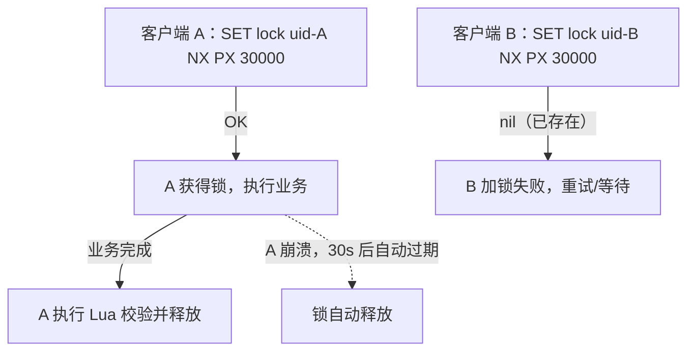
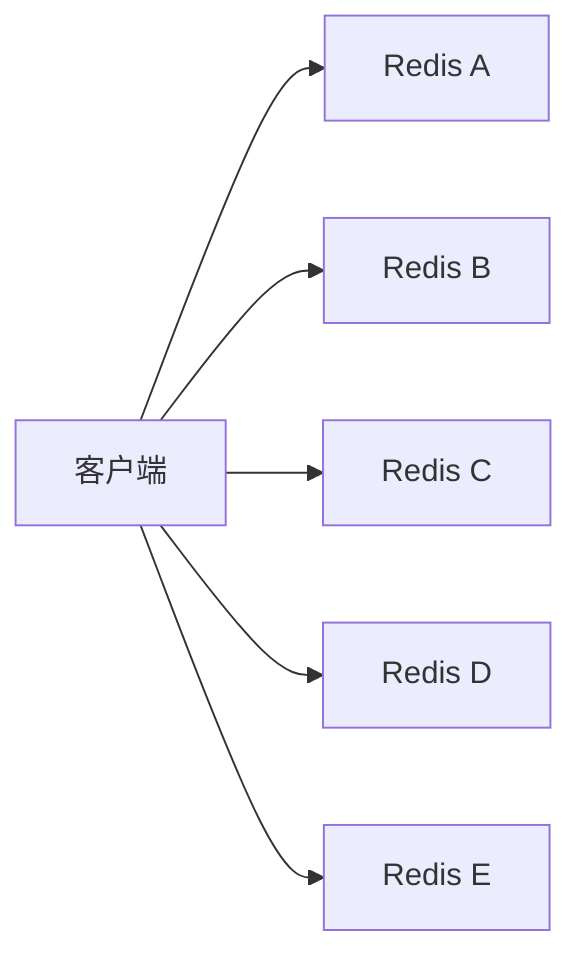

# 分布式锁

## 0. 引言

在单机多线程环境下，`synchronized`/`ReentrantLock` 可以解决互斥问题；但在微服务、多实例部署下，竞争发生在多个进程之间，必须借助外部存储实现**分布式锁**。Redis 凭借 O(1) 原子操作与超时机制，成为分布式锁最流行的实现载体。

本章讨论三个层次：**单机正确用法**（SET NX PX + Lua 释放）、**可靠性增强**（看门狗续期、可重入）、**多节点方案**（Redlock 及其争议），并给出工程决策建议。

## 1. 第一版：错误的实现

最常见的错误写法是"先 SETNX 再 EXPIRE"：

```bash
> setnx lock:order 1       # 加锁
> expire lock:order 30     # 设置过期
```

问题致命：`SETNX` 与 `EXPIRE` 是两条命令，**非原子**。如果加锁后进程崩溃，key 永远不会过期——死锁。这类问题在早期的生产事故中屡见不鲜。

## 2. 正确实现：SET NX PX 原子加锁

Redis 2.6.12 起 `SET` 命令支持扩展参数，血泪教训被官方固化为原子指令：

```bash
SET lock:order <unique-token> NX PX 30000
```

- `NX`：key 不存在才写入（互斥）；
- `PX 30000`：30 秒后自动过期（防死锁）；
- `<unique-token>`：客户端唯一随机值（UUID/随机串），用于安全释放。



### 2.1 为什么必须用唯一随机值

假设没有 token，释放时直接 `DEL key`，会踩中经典陷阱：

1. A 持有锁，业务执行超过 30 秒，锁过期；
2. B 获得锁，开始执行业务；
3. A 业务完成，执行 `DEL lock`——**把 B 的锁删了**；
4. C 趁机获得锁……互斥被彻底破坏。

带 token 后，释放前必须校验"锁还是我的"，且校验与删除必须原子（Lua 脚本）：

```lua
-- 安全释放锁：值匹配才删除
if redis.call("get", KEYS[1]) == ARGV[1] then
    return redis.call("del", KEYS[1])
else
    return 0
end
```

```bash
> eval "if redis.call('get',KEYS[1]) == ARGV[1] then return redis.call('del',KEYS[1]) else return 0 end" 1 lock:order uid-A
(integer) 1
```

## 3. 锁续期：看门狗（Watchdog）

业务执行时间不可控时，固定 TTL 要么太短（业务没做完锁就过期）要么太长（宕机后锁长时间占用）。**看门狗**方案：加锁成功后启动后台任务，每隔 TTL/3 时间检查锁是否仍归自己所有，是则续期。Redisson 的 `lock()` 默认启用看门狗（默认 30s，每 10s 续期一次）。

```java
// Redisson 示例：默认看门狗自动续期
RLock lock = redisson.getLock("lock:order");
lock.lock();                    // 默认 leaseTime=-1，启用看门狗
try {
    // 业务逻辑，无论多长都不会中途丢锁
} finally {
    lock.unlock();              // 手动释放
}
```

工程上也可以手动实现续期：后台线程周期性执行

```lua
-- 续期脚本：仅当值匹配时重置过期时间
if redis.call("get", KEYS[1]) == ARGV[1] then
    return redis.call("pexpire", KEYS[1], ARGV[2])
else
    return 0
end
```

## 4. 可重入锁

同一线程重复加锁场景（如递归、嵌套调用），需要可重入计数。Redis 锁的天然状态只有存在/不存在，可重入需借助 hash 结构记录持有者与计数：

```lua
-- 加锁（可重入）：hash 的 field 存 token，value 存重入次数
if redis.call("exists", KEYS[1]) == 0 or redis.call("hexists", KEYS[1], ARGV[1]) == 1 then
    redis.call("hincrby", KEYS[1], ARGV[1], 1)
    redis.call("pexpire", KEYS[1], ARGV[2])
    return 1
else
    return 0
end
```

```lua
-- 释放（可重入）：计数减到 0 才删除
if redis.call("hexists", KEYS[1], ARGV[1]) == 0 then
    return nil
end
local count = redis.call("hincrby", KEYS[1], ARGV[1], -1)
if count > 0 then
    redis.call("pexpire", KEYS[1], ARGV[2])
    return 0
else
    redis.call("del", KEYS[1])
    return 1
end
```

> 注意：可重入锁要求每次加锁的 token 相同（线程级），跨线程复用存在安全风险；Redisson 提供了标准可重入锁实现，生产环境优先使用成熟库。

## 5. Redlock：多节点锁与它的争议

### 5.1 单点 Redis 锁的局限

单机锁在以下场景不可靠：

- **主从切换**：A 在 master 加锁成功，master 尚未同步到 replica 就宕机，replica 提升为主，B 在"新 master"上加锁成功——**同一时刻两个客户端都持锁**；
- **网络分区**：A 与 Redis 断连但锁未过期，A 认为自己仍持锁。

### 5.2 Redlock 算法

Redlock（Redis 分布式锁算法，antirez 提出）用 N 个独立 Redis 节点（通常 5 个）消除单点故障：



步骤：

1. 获取当前时间 `T1`；
2. 依次向 5 个节点执行 `SET key token NX PX <ttl>`，**每个节点设置一个极短的超时**（如 50ms），避免在故障节点上长时间等待；
3. 计算获取锁消耗的总时间 `elapsed = T2 - T1`；
4. **成功条件**：超过半数节点（≥3）加锁成功，且 `elapsed < ttl`；
5. 释放锁：向所有节点（包括失败的）发送 Lua 释放脚本。

### 5.3 争议：分布式系统专家 vs Redis 作者

2016 年，分布式系统专家 Martin Kleppmann 发表《How to do distributed locking》质疑 Redlock：

| 质疑点 | 说明 |
|--------|------|
| 依赖时钟 | 加锁耗时比较依赖本地时钟，时钟跳跃会破坏判定 |
| 无 fencing token | 没有像 ZooKeeper 那样递增的 fencing token，无法抵御"旧锁持有者仍在写" |
| 5 节点复杂度 | 与单机相比，可用性下降到 5 个节点都要可达（多数派原则） |

antirez 随后发文回应，认为 Redlock 在"正确使用"（短的持锁时间、好的时钟同步）下可接受。**结论：Redlock 并非银弹，但也不是一无是处**。

## 6. 工程决策建议

| 场景 | 推荐方案 |
|------|---------|
| 普通业务互斥（缓存击穿保护、幂等） | 单机 `SET NX PX` + Lua 释放，足够 |
| 需要自动续期/可重入 | Redisson（看门狗开箱即用） |
| 对一致性要求极高（金融、库存扣减） | 优先考虑 ZooKeeper/etcd（带 fencing token），或数据库悲观锁 |
| 锁粒度与性能 | 尽量缩短持锁时间；用 hash tag 把相关 key 分到同一 slot（集群场景） |

**核心原则**：分布式锁保护的临界区，业务代码必须设计为**幂等**——锁可能失效（过期/网络分区），下游必须能容忍重复执行。

## 7. 常见坑清单

1. **SETNX + EXPIRE 两步走**：非原子，崩溃即死锁；
2. **DEL 释放无校验**：删掉别人的锁；
3. **TTL 设置过短**：业务未完成锁已过期，并发进入临界区；
4. **主从切换丢锁**：单机锁在故障转移瞬间失效；
5. **锁内做慢操作**：阻塞 Redis 单线程，全库受影响；
6. **忘记 finally 释放**：异常路径不释放导致死等（配合看门狗可缓解）。

## 8. 小结

- 正确姿势：`SET key token NX PX ttl` + Lua 原子释放 + 看门狗续期；
- Redlock 提供多节点容错，但存在时钟与 fencing 争议，高一致性场景请选 ZooKeeper/etcd；
- 锁是"尽力而为"的互斥，业务幂等才是最终防线。

下一章将介绍基于 list 的异步消息队列与发布订阅（PubSub）的异同与选型。