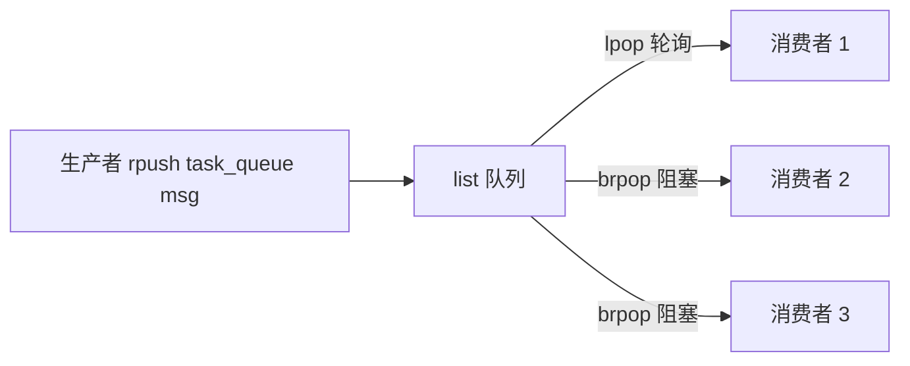
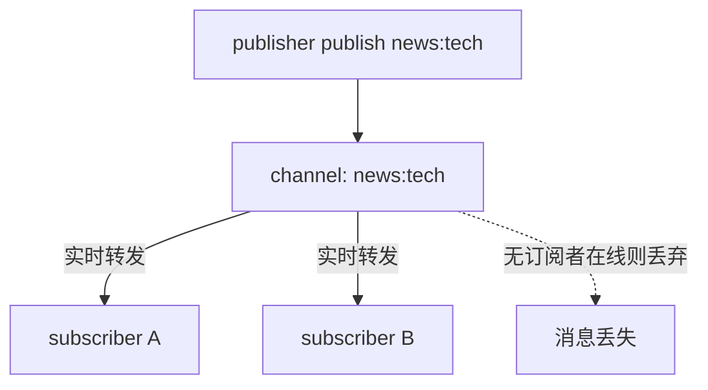
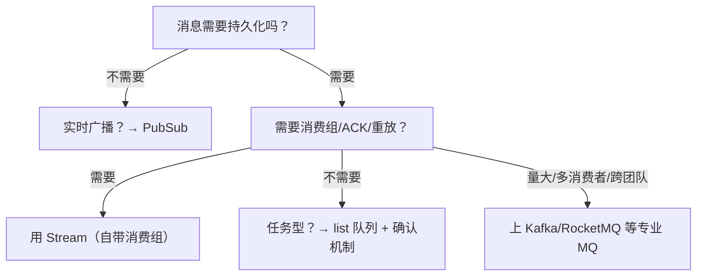

# 延时队列与发布订阅

## 0. 引言

Redis 常被当作轻量级消息中间件使用。本章覆盖两条主线：

- **queue 方向**：基于 `list` 的异步任务队列，基于 `zset` 的延时队列；
- **pubsub 方向**：`publish/subscribe` 发布订阅模型。

它们与专业 MQ（Kafka、RocketMQ）的核心差异在于**可靠性**：Redis 默认不保证消息不丢、不重复、不积压。选型时必须先想清楚"消息丢了能不能接受"。

## 1. 基于 list 的异步消息队列

### 1.1 基本模型



```bash
# 生产者
> rpush task_queue "send_email:10001"
> rpush task_queue "send_sms:10002"

# 消费者（轮询）
> lpop task_queue
"send_email:10001"
```

### 1.2 阻塞读取：brpop/blpop

轮询浪费 CPU，`brpop` 在队列为空时阻塞等待，超时后才返回 nil：

```bash
> brpop task_queue 5
1) "task_queue"
2) "send_sms:10002"
```

多个 list 优先级：`brpop queue1 queue2 0` 按参数顺序优先消费先列出的队列——可用于"高优先级队列优先"。

### 1.3 可靠性缺陷与补救

| 缺陷 | 说明 | 补救 |
|------|------|------|
| 消息丢失 | 消费者取出后崩溃，消息已从队列移除 | 引入"处理中"队列，ACK 后删除 |
| 重复消费 | 处理超时重试导致重复 | 业务幂等（唯一 ID） |
| 积压无界 | 消费慢于生产 | 监控 `llen` 告警 + 业务侧 `LTRIM` 限长，或改用 Stream 的 `MAXLEN` 上限 |

> 注意：`list-max-listpack-size` 只是 quicklist 单节点内部的编码参数，与队列总长度无关，无法用来限制积压。

**可靠版"待确认队列"模式**：

```bash
# 1. 取出并备份到 pending 队列（原子）
> rpoplpush task_queue task_queue:pending
"msg1"
# 2. 业务处理成功后，从 pending 删除
> lrem task_queue:pending 1 "msg1"
# 3. 处理失败/超时：重新入队或转入死信
> rpush task_queue:dead "msg1"
```

> `rpoplpush`/`brpoplpush` 是原子操作，Redis 6.2 起推荐使用语义更清晰的 `LMOVE`/`BLMOVE` 命令。

## 2. 基于 zset 的延时队列

延时任务的经典问题：订单 30 分钟未支付自动关闭、优惠券到期提醒。zset 以**执行时间戳为 score**，到期任务即 score 最小的任务。

### 2.1 实现

```bash
# 生产：score = 期望执行时间戳
> zadd delay_queue 1760000000000 "order:10001"

# 消费：循环取 score 小于当前时间戳的任务
> zrangebyscore delay_queue -inf <now> LIMIT 0 1
1) "order:10001"
> zrem delay_queue "order:10001"   # 取出并删除（注意先取后删的非原子窗口）
```


### 2.2 进阶：可借力的命令增强

Redis 至今没有原生的"到期自动投递"能力，延时语义仍需业务侧轮询实现。可借力的命令增强：6.2 起 `ZADD` 支持 `GT`/`LT`/`NX`/`XX` 选项，避免旧任务覆盖新任务的执行时间；6.2 起的 `XAUTOCLAIM` 可批量接管 Stream 中长时间未 ACK 的消息，配合消费组可实现简单的延迟重试。绝大多数生产环境仍使用 zset 方案，或直接用专业 MQ 的定时消息（如 RocketMQ 定时消息）。

### 2.3 高可用注意

- **取与删的窗口**：`zrangebyscore` 与 `zrem` 之间任务可能被多个消费者取到——用 Lua 脚本原子化，或接受"至少一次"语义；
- **时钟**：依赖本机时钟判定到期，多实例部署需保证时钟同步；
- **任务丢失**：zset 属于内存数据，未持久化时重启即丢，重要任务需配合 RDB/AOF。

## 3. 发布订阅（PubSub）

### 3.1 模型

PubSub 是**广播模型**：发布者向 channel 发消息，所有订阅者都能收到。Redis 的 PubSub 是**不持久化的**——消息发出时没有订阅者在线，消息直接丢失。

```bash
# 订阅者 1
> subscribe news:tech
# 订阅者 2
> subscribe news:tech
# 发布者
> publish news:tech "Redis 7.4 released"
(integer) 2        # 返回收到消息的订阅者数量
```



### 3.2 模式订阅与高级功能

- **模式订阅**：`psubscribe news.*` 通配符订阅，适合动态频道；
- **客户端实现注意**：`subscribe` 后连接进入"订阅模式"，只能执行退订类命令，不能混用其他命令（客户端需单独连接做订阅）；
- **7.x 增强**：7.0 起支持 `SHARDCHANNEL`（切片频道，配合集群 hash slot）与 `SPUBLISH`/`SSUBSCRIBE`。

### 3.3 PubSub 的适用边界

| 维度 | PubSub | list 队列 | Stream |
|------|--------|-----------|--------|
| 消息模型 | 广播（1→N） | 竞争消费（1→1） | 广播 + 消费组 |
| 持久化 | ❌ 不持久 | ✅ 持久（受持久化配置约束） | ✅ 持久 |
| 消息确认 | ❌ | 需自行实现 | ✅ ACK/PEL |
| 积压 | 无（实时丢弃） | 有（无界） | 有（可设上限） |
| 典型场景 | 实时通知、在线状态、配置热更新 | 异步任务 | 要求可靠性的消息场景 |

**结论**：PubSub 只适合"实时性要求高、可容忍丢消息"的场景（如 WebSocket 推送的跨实例广播、实时排行榜更新）。要求不丢消息的订单、支付等场景，必须用 Stream 或专业 MQ。

## 4. 选型决策树



## 5. 小结

- **异步任务队列**：`rpush`/`brpop` 起步，可靠场景加 pending 队列与 ACK；
- **延时队列**：zset + score 时间戳，注意取删原子性与持久化；
- **PubSub**：实时广播利器，但消息不落地，只用于可丢场景；
- **Stream**（详见后文专题）：Redis 中唯一自带消费组、ACK、PEL 的可靠消息结构，是 list 与 PubSub 的进化替代。

下一章进入位图与布隆过滤器的内存优化实战。