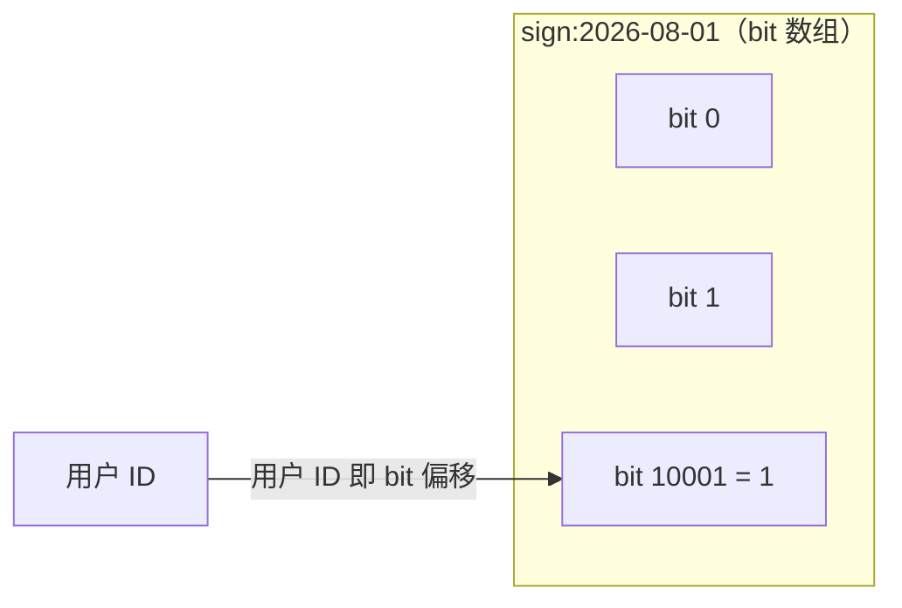
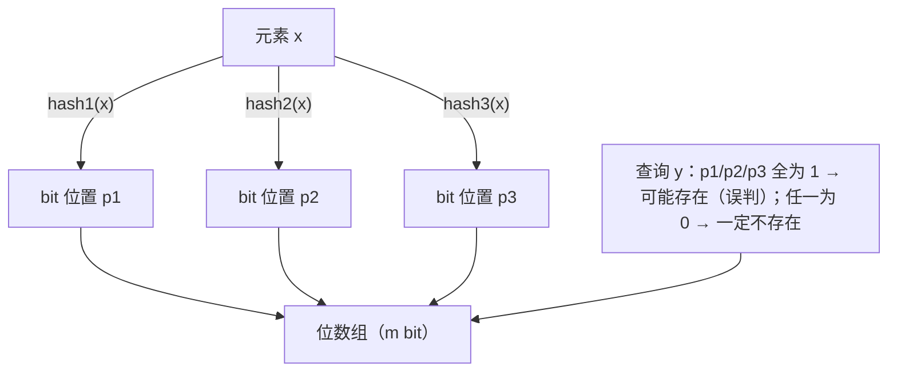
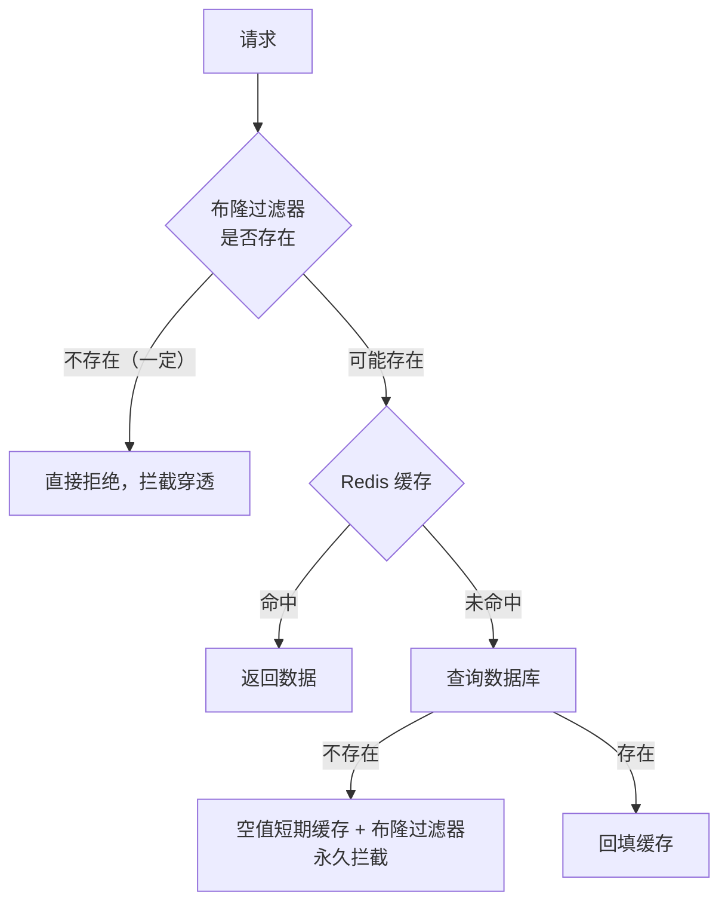

# 位图与布隆过滤器

## 0. 引言

在"亿级用户、每日签到、UV 统计、防穿透"等场景下，传统 KV 存储的每用户一 key 会耗尽内存。**位图（Bitmap）与布隆过滤器（Bloom Filter）**把每个元素压缩到 1 个 bit 或几个 bit，是 Redis 内存优化最重要的两种武器。本章剖析原理、命令、内存公式与误判率工程权衡。

## 1. 位图：bit 级操作

### 1.1 原理

位图是 string 的 bit 级视图：一个 string 可以看作 bit 数组，`SETBIT` 把第 N 位设为 0/1。**8 个 bit 占 1 字节**，1 亿个用户只需 12.5MB 内存。

```bash
> setbit sign:2026-08-01 10001 1    # 用户 10001 签到
(integer) 0
> getbit sign:2026-08-01 10001      # 查询是否签到
(integer) 1
> bitcount sign:2026-08-01          # 当日签到人数
(integer) 1
> bitcount sign:2026-08-01 0 1000   # 字节区间 [0,1000]（前 8008 个用户位）内的签到数；7.0 起可加 BIT 参数按 bit 计
```



### 1.2 位运算：BITOP

`BITOP` 支持 AND/OR/XOR/NOT，可用于"连续签到"统计：

```bash
# 今天与昨天都签到的人（连续签到）
> bitop and sign:both sign:2026-08-01 sign:2026-07-31
(integer) 1251                      # 返回目标 key 的字节长度（= 最长源串，此处由偏移 10001 决定）
> bitcount sign:both
(integer) 1                         # 两天都签到的用户数
```

### 1.3 内存公式与偏移上限

- 内存 = 最大偏移 / 8 字节（偏移越大越耗内存，**稀疏场景慎用**）；
- 偏移上限：string 最大 512MB → 最大偏移 **2³² - 1（约 42.9 亿 bit）**；
- 偏移计算：`SETBIT key 4294967295 1` 会立即分配 512MB，谨慎操作。

### 1.4 典型场景

| 场景 | 实现 |
|------|------|
| 每日签到 | 日期为 key，用户 ID 为偏移 |
| 在线状态 | `SETBIT online 10001 1` + 心跳过期 |
| 布隆过滤器的底层 | 见下节 |
| 用户行为统计 | `BITCOUNT`/`BITPOS` 快速统计 |

## 2. 布隆过滤器：存在性判断的近似解

### 2.1 问题

缓存穿透防护、URL 去重、邮箱黑名单等场景，需要判断"元素是否存在"。精确方案（set）在数据量极大时内存爆炸；布隆过滤器用**多 bit + 多次哈希**换取空间，代价是**误判率**（可能把不存在的判成存在，反之不行）。

### 2.2 原理



- **插入**：元素经 k 个哈希函数映射到 k 个 bit，全部置 1；
- **查询**：k 个 bit 全为 1 → "可能存在"（有误判）；任一为 0 → "一定不存在"（无漏判）；
- **删除**：不支持（bit 可能被其他元素共享）——这是与 Counting Bloom Filter、Cuckoo Filter 的差异点。

### 2.3 误判率公式

给定元素数 n、位数组长度 m、哈希函数个数 k：

\[
p = \left(1 - e^{-\frac{kn}{m}}\right)^k
\]

最优哈希函数个数：

\[
k = \frac{m}{n} \ln 2 \approx 0.693 \frac{m}{n}
\]

工程速查表（n=1000 万）：

| 误判率 p | 位数组 m | 每元素 bit 数 | k | 内存 |
|---------|---------|--------------|---|------|
| 1% | 约 9.6 倍 n | 9.6 | 7 | 约 12MB |
| 0.1% | 约 14.4 倍 n | 14.4 | 10 | 约 18MB |
| 5% | 约 6.2 倍 n | 6.2 | 4 | 约 7.8MB |

### 2.4 Redis 中的布隆过滤器

落地方式有三种（Redis 8.0.2 起官方开源版已原生内置 BF.* 等概率结构，无需单独装模块；本机构建可用 `MODULE LIST` 确认是否编译）：

**方式一：BF 命令（Redis 8.0.2+ 内置；早期版本加载 RedisBloom 模块或使用 Redis Stack）**

```bash
> bf.reserve blacklist 0.01 1000000    # 误判率 1%，预计 100 万元素
OK
> bf.add blacklist "spam@example.com"
(integer) 1
> bf.exists blacklist "spam@example.com"
(integer) 1          # 1 = 可能存在；0 = 一定不存在
> bf.madd blacklist "a@x.com" "b@x.com"
> bf.mexists blacklist "a@x.com" "c@x.com"
```

**方式二：自实现（SETBIT + 多个哈希）**

用 Lua 脚本实现 k 个哈希（如 `crc32` + `md5` 组合），写入同一个 string key 的位图。适合不想引入模块的场景，注意哈希函数独立性与位偏移计算。

**方式三：客户端实现（如 Guava BloomFilter）**

海量数据在客户端构建后分段写入，或直接作为 JVM 本地过滤器 + Redis 兜底。

### 2.5 缓存穿透防护实践



要点：

1. 数据全量预热进布隆过滤器（启动时扫描 DB 或定期同步）；
2. 布隆过滤器判断"不存在"直接拦截，DB 零压力；
3. 判断"可能存在"但缓存未命中 → 查 DB，DB 也不存在时回填空值缓存（防同一 key 反复打库）。

## 3. 位图 vs 布隆过滤器选型

| 维度 | 位图 | 布隆过滤器 |
|------|------|-----------|
| 最小单元 | 1 bit/元素（整数偏移） | 约 6-15 bit/元素 |
| 误判 | 无 | 有（可配置） |
| 删除 | 支持（覆写 bit） | 不支持 |
| 适用数据 | 整数 ID（连续/大偏移均可） | 任意字符串（URL、邮箱、手机号） |
| 典型场景 | 签到、在线、UV 去重 | 穿透防护、黑名单、爬虫去重 |

## 4. 小结

- 位图把"用户 ID ↔ bit 偏移"的映射做到极致，适合**稠密整数 ID**；
- 布隆过滤器用可接受的误判率换取空间，适合**任意字符串的存在性判断**，且"一定不存在"的判断是 100% 准确的，这是防穿透的基石；
- 生产建议：穿透防护 = 布隆过滤器（拦截）+ 空值缓存（兜底）+ 数据预热（保底）。

下一章介绍 HyperLogLog：用 12KB 统计亿级 UV 的基数算法。