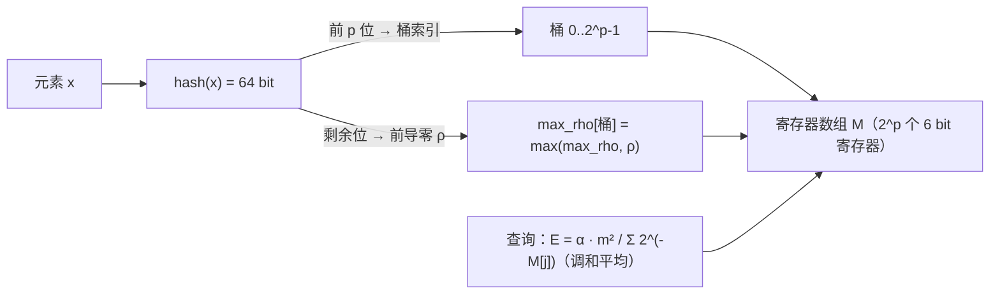

# HyperLogLog 与基数统计

## 0. 引言

统计"今日独立访客 UV（Unique Visitor）"是互联网的经典需求。精确去重需要 set 存储每个用户 ID，亿级 UV 将消耗数十 GB 内存。**HyperLogLog**（下文简称 HLL）用**固定约 12KB** 内存统计任意规模的基数，标准误差 0.81%——用极小误差换 1000 倍以上的内存节省，这是概率算法的胜利。

## 1. 核心思想：从抛硬币谈起

### 1.1 抛硬币问题

想象一个实验：反复抛硬币直到出现正面。记录"第一次出现正面时已抛的次数"。抛 1 次就出正面的概率 1/2，抛 k 次才出正面的概率 2⁻ᵏ。**越稀有的结果（k 越大），说明尝试次数越多**。

反过来：如果有人在 1000 次独立实验中观察到"最大连续反面次数为 10"，我们就能反推实验次数大约为 2¹⁰ = 1024。

### 1.2 从硬币到哈希

HLL 把每个元素通过哈希函数映射为一个**均匀分布的二进制串**，用"**从低位开始连续 0 的个数（或从高位开始的前导零个数）**"ρ 作为"抛硬币次数"：

```text
元素 x → hash(x) = 0100 1101 0000 0000 ...
                    ↑ 前导零个数 ρ = 2
```

单个元素得到的 ρ 波动极大，完全不可靠。HLL 的巧妙之处在于**分桶（寄存器）与调和平均**：

1. 取哈希值的**前 p 位**作为桶索引（共 2ᵖ 个桶）；
2. 剩余位计算 ρ；
3. 每个桶只保留**最大的 ρ**（`max_rho[bucket]`）；
4. 最终估计值 = 调和平均各桶的 2^ρ，再乘以系数 α。



## 2. Redis 实现与使用

### 2.1 命令

```bash
> pfadd uv:2026-08-01 user:10001 user:10002 user:10003
(integer) 1
> pfcount uv:2026-08-01
(integer) 3
> pfadd uv:2026-08-01 user:10002 user:99999
> pfcount uv:2026-08-01
(integer) 4                  # 去重后计数
> pfadd uv:2026-07-31 user:20001 user:20002
> pfmerge uv:week1 uv:2026-08-01 uv:2026-07-31   # 合并多日
OK
> pfcount uv:week1
(integer) 6
```

### 2.2 内存与精度

- 默认精度 p=14 → 2¹⁴ = 16384 个寄存器 × 6 bit = **约 12KB**；
- 标准误差 = 1.04 / √16384 ≈ **0.81%**；
- 支持 `PFADD` 稀疏编码（`dense`/`sparse` 两种内部表示），小数据量时占用更小；
- **误差与数据量无关**：1 万 UV 和 1 亿 UV 都是约 0.81% 误差。

### 2.3 内部编码查看与调参

```bash
> object encoding uv:2026-08-01
raw                          # HLL 底层就是 string（OBJ_ENCODING_RAW）
> memory usage uv:2026-08-01
(integer) 80                 # 稀疏编码起步，仅几十字节；基数增大升级 dense 后固定约 12KB
```

> Redis 的 HLL 不支持自定义精度（固定 2¹⁴ 桶），需要更高精度时用多个 HLL 分段或换精确方案。

### 2.4 set vs HLL 内存对比

以 1000 万独立用户为例：

| 方案 | 内存估算 | 误差 | 命令 |
|------|---------|------|------|
| set（hashtable） | 约 500MB+（sds + dictEntry 开销） | 精确 | SADD/SMEMBERS |
| HLL | 12KB | 0.81% | PFADD/PFCOUNT |

> intset（有序整数数组）只在元素全为整数且数量 ≤ `set-max-intset-entries`（默认 512）时启用，大基数下早已转 hashtable，不适用于本场景。

**结论**：HLL 用 0.81% 的误差换 4 万倍以上的内存节省，且误差不随基数增长——基数越大，HLL 的成本优势越悬殊。

## 3. 内部实现细节

### 3.1 稀疏与稠密表示

- **稀疏表示（sparse）**：寄存器全 0 或极少非 0 时，用 run-length 编码压缩，适合小基数（如 <几百）；
- **稠密表示（dense）**：标准 16384 × 6 bit 连续数组，基数增长后自动升级；
- 底层是 string 编码 HLL（`OBJ_ENCODING_RAW`），`PFADD` 内部会做 `malloc` 与位操作。

### 3.2 小基数修正

当估计值较小时（< 2.5m，m=16384），HLL 使用**线性计数（Linear Counting）**修正：统计全 0 的寄存器数量 V，用公式 \(\hat{E} = m \ln(m/V)\) 修正，避免小基数下的系统性偏差。

### 3.3 为什么是 6 bit 寄存器

单个寄存器的最大 ρ 不会超过 64（64 bit 哈希），但实际只需 6 bit（可表示 0-63）即可覆盖实际范围，且 6 bit × 16384 = 98304 bit = 12KB，正好是官方内存承诺。

### 3.4 PFADD 内部流程

一次 `PFADD key element` 的执行路径：

```text
1. 校验 key 存在性：已有 HLL 则复用，无则创建（稀疏表示起步）
2. 对 element 做 64 bit 哈希（MurmurHash64A）
3. 取前 14 bit 定位寄存器索引，剩余 50 bit 计算前导零 ρ
4. 若 ρ > 寄存器当前值，写入新值（仅此一步可能触发稀疏→稠密升级）
5. 返回 0/1：1 表示 HLL 内部发生了变更（可用于统计写入量）
```

> 注意：`PFADD` 返回 1 表示“内部寄存器有更新”，不等于“新元素”；重复元素不会变更寄存器。

## 4. 工程实践

### 4.1 经典场景

| 场景 | 用法 |
|------|------|
| 日/周/月 UV | 日期为 key，`PFADD` + `PFCOUNT` |
| 漏斗分析 | 各环节分别建 HLL，`PFCOUNT` 求交集近似（无直接交集命令，用 `PFMERGE` + 差值近似） |
| 去重计数 | 注册设备数、浏览去重 |
| 反作弊 | 设备指纹去重统计 |

### 4.2 精度敏感场景的取舍

| 需求 | 方案 |
|------|------|
| 误差 < 0.1% | 精确 set（内存换精度）或抽样统计 |
| 需要精确交集/差集 | 位图（BITOP）或 set |
| 亿级基数、可容忍 0.81% | HLL（首选） |
| 组内去重 + 明细 | HLL 做计数 + 明细落 DB |

### 4.3 注意事项

1. **PFADD 只接受字符串**：数字需转为字符串（客户端自动处理）；
2. **PFCOUNT 多 key 时**：会临时合并计算，性能低于单 key；
3. **持久化**：HLL 是 string 的编码之一，随 RDB/AOF 持久化，重启不丢；
4. **稀疏→稠密升级**：写入高峰时可能触发内存分配抖动，监控大 key。

## 5. 小结

- HLL 用 **12KB 固定内存 + 0.81% 误差** 统计任意规模基数，是 UV 统计的标准答案；
- 原理三要素：哈希分桶、桶内最大前导零、调和平均；
- 注意能力边界：不支持精确计数、不支持删除、误差不可再降（除非换方案）。

下一章介绍 GeoHash 地理位置索引：LBS 场景的经纬度编码与附近的人实现。