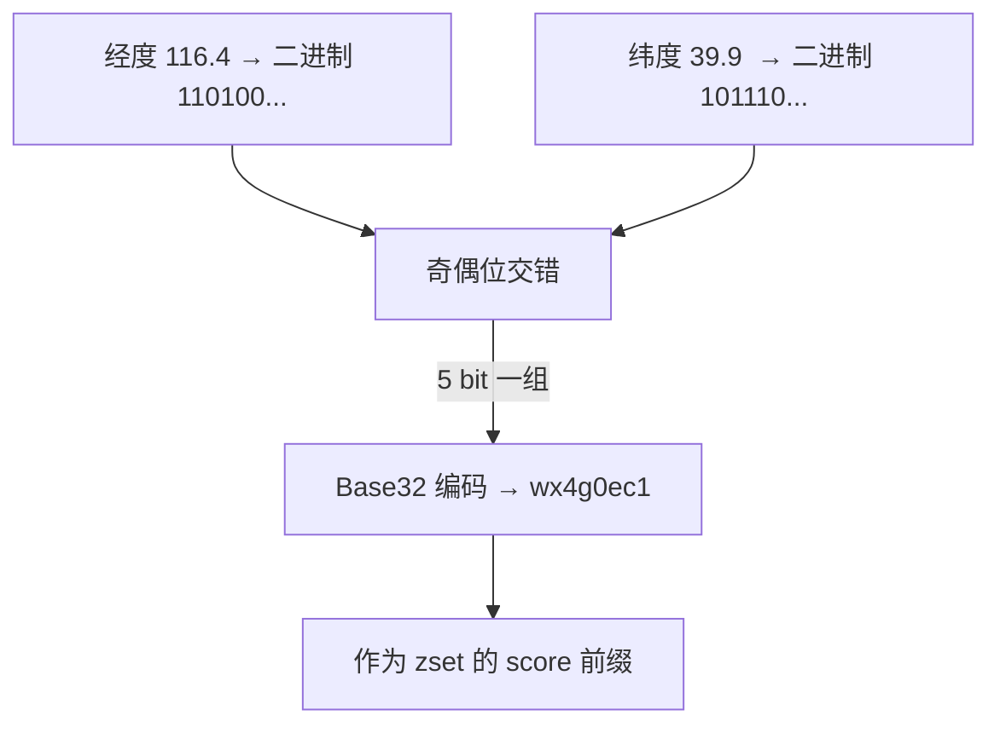
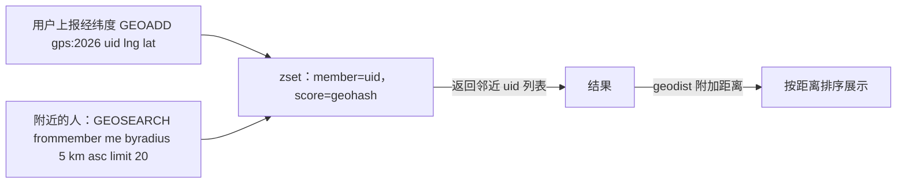

# GeoHash 地理位置索引

## 0. 引言

"附近的人""门店推荐""打车匹配"等 LBS 场景的核心是：**给定经纬度，找到半径 N 公里内的 POI**。朴素实现是计算所有点与目标的球面距离，数据量大时不可行。Redis 的 GEO 系列命令基于 **GeoHash 编码**，把二维经纬度压缩为一维字符串，用 zset 实现 O(logN) 的范围查询。

## 1. GeoHash 原理

### 1.1 二维降一维

地球经度 [-180, 180]、纬度 [-90, 90]。GeoHash 对两个维度**交替二分**：

```text
经度 [-180,180] ├─ 前半 [-180,0) → 0
                └─ 后半 [0,180]  → 1
纬度 [-90,90]   ├─ 前半 [-90,0)  → 0
                └─ 后半 [0,90]   → 1
```

以北京（经度 116.4，纬度 39.9）为例：

```text
经度二分：116.4 ∈ [0,180]   → 1
纬度二分：39.9  ∈ [0,90]    → 1
经度二分：116.4 ∈ [90,180]  → 1
纬度二分：39.9  ∈ [0,45)    → 0   （39.9 < 45）
经度二分：116.4 ∈ [112.5,135] → 1   （116.4 ≥ 112.5）
纬度二分：39.9  ∈ [22.5,45]  → 1   （39.9 ≥ 22.5）
...
交替产生二进制串：1 1 1 0 1 1 ...
```

将经纬度 bit **交错**（偶位=经度，奇位=纬度），再按 5 bit 一组 Base32 编码，就得到形如 `wx4g0ec1` 的 GeoHash 字符串：



### 1.2 关键性质

| 性质 | 说明 |
|------|------|
| **前缀即区域** | 相同前缀的坐标在同一矩形区域内，前缀越长区域越小 |
| **geohash 前缀长度 ↔ 精度** | 每 +1 字符精度约提升 5 个 bit 的细分 |
| **邻近性** | 相邻区域的 geohash 前缀通常相近（但边界处可能突变） |
| **非单调** | 前缀序 ≠ 球面距离序，需用 8 邻域搜索兜底边界点 |

### 1.3 精度对照表

| geohash 长度 | 纬度 bit | 经度 bit | 格宽（经度） | 格高（纬度） |
|-------------|---------|---------|------------|------------|
| 5 | 12 | 13 | 4.9km | 4.9km |
| 6 | 15 | 15 | 1.2km | 0.6km |
| 7 | 17 | 18 | 153m | 152m |
| 8 | 20 | 20 | 38m | 19m |

## 2. Redis GEO 命令族

### 2.1 GEOADD：写入

```bash
> geoadd cities 116.40 39.90 beijing 121.47 31.23 shanghai 114.30 30.59 wuhan
(integer) 3
```

内部实现：经度+纬度编码为 52 bit 整数作为 zset 的 score，member 为地点名。

### 2.2 GEOSEARCH：按半径/矩形搜索（6.2+）

```bash
# 以北京为中心，半径 1100km 内
> geosearch cities frommember beijing byradius 1100 km asc
1) "beijing"
2) "wuhan"
3) "shanghai"

# 返回附带距离
> geosearch cities frommember beijing byradius 1100 km asc withcoord withdist
1) 1) "beijing"
   2) "0.0000"
   3) 1) "116.39999896287918"
      2) "39.90000009167092"
2) 1) "wuhan"
   2) "1052.8450"
   ...
```

6.2 前的旧命令 `GEORADIUS`/`GEORADIUSBYMEMBER` 仍可用但已被标记为弃用方向，新代码请使用 `GEOSEARCH`。

### 2.3 其他命令

```bash
> geopos cities beijing        # 获取坐标（注意返回的是编码精度内的近似值）
> geodist cities beijing shanghai km   # 两点球面距离
"1067.3788"
> geohash cities beijing       # 获取 geohash 字符串（无精度参数时返回 11 字符）
"wx4fbxxfke0"
> zrem cities wuhan            # 删除地点（GEO 底层是 zset，可直接用 zrem）
```

### 2.4 "附近的人"完整实现



要点：

1. **key 按城市/区域分片**（如 `gps:beijing`），避免单 key 过大、缩小搜索范围；
2. `BYRADIUS` 用圆搜索，`BYBOX` 用矩形搜索（适合"区域内的门店"）；
3. 边界点问题：Redis 的 GEO 实现已内置 8 邻域搜索，无需业务侧处理边界；
4. 高频上报场景：用 `ZADD` 批量更新（GEOADD 支持多成员），并考虑过期清理（`ZREMRANGEBYSCORE` 按时间戳窗口）。

## 3. 内部实现与性能

### 3.1 为什么用 zset

- 52 bit 的 geohash 作为 score，天然有序；
- `GEOSEARCH` 内部 = `ZRANGEBYSCORE`（按编码范围）+ 球面距离过滤，复杂度 O(logN + M)；
- 复用 zset 的高效存储（7.x 小集合用 listpack，大集合用 skiplist+dict）。

### 3.2 精度与误差

- 存入的坐标会被**量子化**到 52 bit 编码格内，`GEOPOS` 返回的坐标与原始值有亚米级误差，展示场景无碍；
- 距离计算使用 **Haversine 公式**，球面模型在大尺度（跨洲）下误差可接受。

## 4. 选型对比

| 方案 | 优点 | 缺点 |
|------|------|------|
| Redis GEO | 简单、性能高、无额外组件 | 距离计算在服务端近似；单 key 容量受限 |
| MySQL 空间索引 | 与业务数据一体 | 性能上限低，不适合高频 LBS |
| Elasticsearch geo | 聚合能力强、支持复杂查询 | 组件重、延迟相对高 |
| 自实现 geohash | 可控 | 开发维护成本高 |

**结论**：中等规模（百万级 POI）LBS 场景，Redis GEO 是最优性价比；需要文本/多条件聚合时再考虑 ES。

## 5. 小结

- GeoHash 把经纬度交替二分编码为一维字符串，前缀即区域；
- Redis GEO = geohash(52bit) 作为 score 的 zset，`GEOSEARCH` 是 6.2+ 的推荐命令；
- 工程要点：按区域分片 key、用 `BYRADIUS`/`BYBOX` 控制范围、注意坐标量子化误差。

下一章进入限流：Redis 在流量治理中的四种限流算法实现。