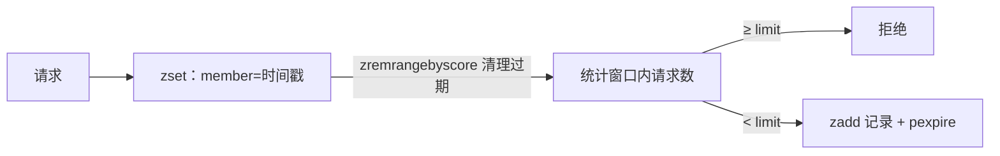
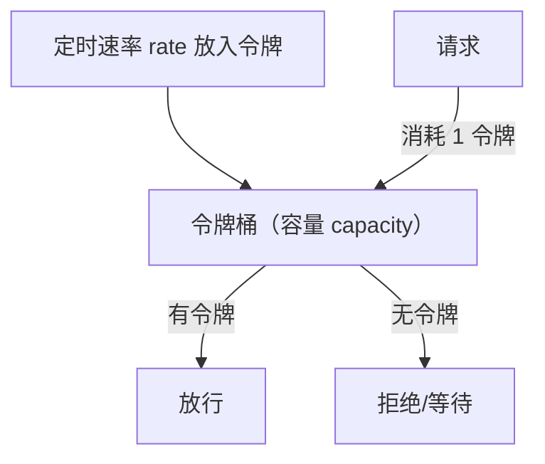
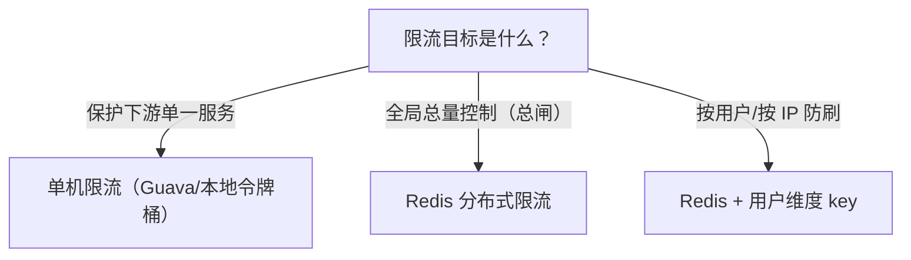

# 限流

## 0. 引言

限流是保护系统不被突发流量击穿的第一道防线：接口限流、登录防刷、秒杀防超卖、爬虫拦截。Redis 凭原子操作与 TTL 成为限流计数器最常用的载体。本章介绍**四种限流算法**的 Redis 实现、Lua 原子化要点与选型决策。

## 1. 固定窗口计数

最简单的实现：以秒/分钟为窗口，窗口内计数 +1，超过阈值拒绝。

```bash
# 每秒最多 10 次
> incr limiter:api:1699999999     # key 带窗口号
(integer) 1
> expire limiter:api:1699999999 2
```

```lua
-- 原子版：固定窗口
local key = KEYS[1]
local limit = tonumber(ARGV[1])
local ttl = tonumber(ARGV[2])
local current = redis.call("INCR", key)
if current == 1 then
    redis.call("EXPIRE", key, ttl)
end
if current > limit then
    return 0    -- 拒绝
end
return 1        -- 放行
```

**缺陷**：窗口边界突变。例如每秒 10 次，第 1 秒最后 0.9s 用掉 10 次、第 2 秒前 0.9s 又用掉 10 次——**2 秒内实际 20 次**，绕过限流。

## 2. 滑动窗口

用 zset 记录每个请求的时间戳，窗口 = 当前时间 - 窗口长度，统计窗口内请求数：

```lua
-- 滑动窗口限流：窗口 window 秒内最多 limit 次
local key = KEYS[1]
local window = tonumber(ARGV[1])
local limit = tonumber(ARGV[2])
local now = redis.call("TIME")
local now_ms = now[1] * 1000 + math.floor(now[2] / 1000)

-- 1. 清理窗口外记录
redis.call("ZREMRANGEBYSCORE", key, 0, now_ms - window * 1000)
-- 2. 统计窗口内数量
local count = redis.call("ZCARD", key)
if count >= limit then
    return 0
end
-- 3. 记录本次请求
redis.call("ZADD", key, now_ms, now_ms .. "-" .. math.random(100000))
-- 4. 设置过期，防止 key 常驻
redis.call("PEXPIRE", key, window * 1000)
return 1
```



**优点**：精确反映任意时刻的窗口流量；**缺点**：每个请求一个 zset 成员，内存开销大（高 QPS 下可用 score 近似 + 定时清理）。

## 3. 漏桶算法

漏桶：请求先进入桶（缓存），以**固定速率**出水（处理）。桶满则拒绝。核心是**平滑输出**——即使突发流量，处理速率也恒定。

```lua
-- 漏桶：容量 capacity，每秒出水 rate
local key = KEYS[1]
local capacity = tonumber(ARGV[1])
local rate = tonumber(ARGV[2])
local now = tonumber(ARGV[3])   -- 秒

local water = tonumber(redis.call("HGET", key, "water") or "0")
local last = tonumber(redis.call("HGET", key, "last") or tostring(now))

-- 1. 按速率漏水
water = math.max(0, water - (now - last) * rate)

if water >= capacity then
    redis.call("HSET", key, "water", water, "last", now)
    return 0    -- 桶满，拒绝
end
-- 2. 请求入桶（水量为浮点，HINCRBY 只支持整数，必须用 HSET 整体写回）
water = water + 1
redis.call("HSET", key, "water", water, "last", now)
redis.call("PEXPIRE", key, 60000)
return 1
```

| 特性 | 说明 |
|------|------|
| 平滑性 | 输出速率严格 ≤ rate，削峰填谷 |
| 突发性 | 桶容量允许短时积压 |
| 适用 | 下游处理能力固定的场景（如消费端、数据库写入） |

## 4. 令牌桶算法

令牌桶：以固定速率往桶中放令牌，请求需消耗一个令牌。桶容量决定了**允许的突发量**——这是与漏桶最大的区别（漏桶不允许突发，令牌桶允许）。

```lua
-- 令牌桶：容量 capacity，生成速率 rate（个/秒）
local key = KEYS[1]
local capacity = tonumber(ARGV[1])
local rate = tonumber(ARGV[2])
local now = tonumber(ARGV[3])

local tokens = tonumber(redis.call("HGET", key, "tokens") or tostring(capacity))
local last = tonumber(redis.call("HGET", key, "last") or tostring(now))

-- 按速率补充令牌（上限 capacity）
tokens = math.min(capacity, tokens + (now - last) * rate)

if tokens < 1 then
    redis.call("HSET", key, "tokens", tokens, "last", now)
    return 0    -- 无令牌，拒绝
end
-- 消耗一个令牌（HINCRBY 只支持整数，浮点需用 HSET 整体写回）
redis.call("HSET", key, "tokens", tokens - 1, "last", now)
redis.call("PEXPIRE", key, 60000)
return 1
```



**典型工程代表**：Guava RateLimiter、Redisson `RRateLimiter` 均基于令牌桶思想。

## 5. 四种算法对比

| 算法 | 允许突发 | 平滑输出 | 实现复杂度 | 适用场景 |
|------|---------|---------|-----------|---------|
| 固定窗口 | 边界双倍 | ❌ | ★ | 简单计数、防刷 |
| 滑动窗口 | 窗口内精确 | ❌ | ★★ | 接口限流、精确统计 |
| 漏桶 | 桶内积压 | ✅ 强 | ★★ | 下游速率固定 |
| 令牌桶 | ✅ 桶容量 | ✅ | ★★ | 通用限流（推荐） |

## 6. 工程实践

### 6.1 Lua 原子化

限流脚本必须**原子执行**（EVAL 单线程内运行），避免并发下竞态。注意：

- 用 `redis.call("TIME")` 取服务器时间，避免客户端时钟不一致；
- 脚本内所有读写用 KEYS/ARGV 传参，禁用字符串拼接 key（集群模式下 key 需在同一 slot）；
- 脚本要设置 key 的过期时间，防止内存泄漏（限流 key 不清理会无限增长）。

### 6.2 分布式限流 vs 单机限流



- **按用户维度**：key = `limiter:{userId}:{api}`，天然分片，也是缓存的常规做法；
- **全局总量**：集群场景下按 redis 实例分片统计会有偏差，可用 hash tag 或独立限流实例；
- **优雅降级**：Redis 不可用时限流失效——可接受"放行"（降低保护）还是"拒绝"（保护下游）？通常选择放行并告警。

### 6.3 生产级组件

- **Redisson RRateLimiter**：客户端令牌桶，开箱即用；
- **Redis-Cell**：提供 `CL.THROTTLE` 命令的限流模块（GCRA 算法，令牌桶变体），项目已基本停止维护，新项目建议 Redisson 或 Lua 自实现；
- **Sentinel/Resilience4j**：更完整的流量治理（限流+熔断+降级）；
- **网关层限流**（Nginx/API Gateway）：在流量入口限流，保护全链路。

## 7. 小结

- 固定窗口最简单但有边界漏洞；滑动窗口精确但内存开销大；
- 漏桶平滑输出、令牌桶允许突发，**令牌桶是通用首选**；
- 所有计数逻辑必须 Lua 原子化，key 必须设置过期；
- 限流是"最后一道闸"，配合熔断、降级、隔离形成完整的流量治理体系。

下一章进入管道（Pipeline）与事务（MULTI/EXEC/WATCH）的机制解析。