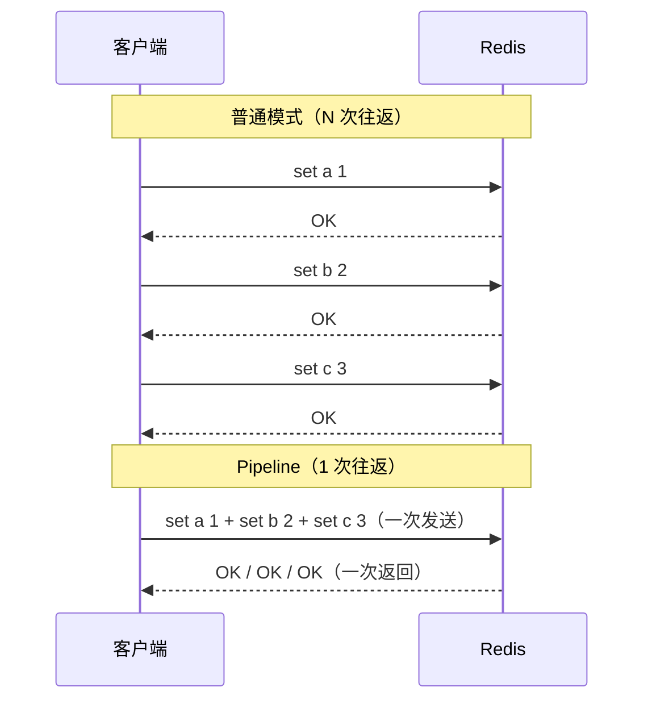
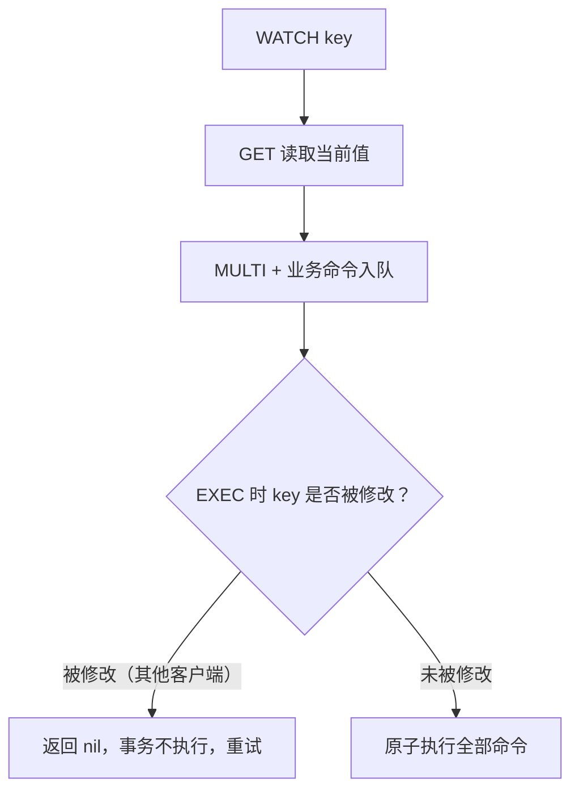

# 管道与事务

## 0. 引言

很多初学者把 Pipeline 与事务混为一谈——它们解决的问题完全不同：

- **Pipeline（管道）**：减少网络 RTT，提升吞吐，**不保证原子性**；
- **MULTI/EXEC（事务）**：保证一批命令的原子执行，**不减少网络开销**（除非客户端配合 pipeline 批量发送）。

本章分别深入两者的机制、局限与 Redis 7.x 的变化，最后给出组合使用姿势。

## 1. Pipeline：用一次 RTT 换 N 次 RTT

### 1.1 问题：RTT 是 Redis 高延迟的隐形杀手

Redis 单命令耗时通常 < 0.1ms，但一次网络往返（RTT）在跨机房时可能高达 1-10ms。执行 N 条命令：

```text
传统模式：N 条命令 × (RTT + 执行时间)
Pipeline：1 次 RTT + N × 执行时间（服务端顺序执行，响应集中返回）
```



### 1.2 使用示例（Java）

```java
// Jedis Pipeline
Jedis jedis = new Jedis("127.0.0.1", 6379);
Pipeline pipeline = jedis.pipelined();
for (int i = 0; i < 1000; i++) {
    pipeline.incr("counter:" + i);
}
List<Object> results = pipeline.syncAndReturnAll();  // 一次 RTT
```

```python
# redis-py Pipeline
import redis
r = redis.Redis()
pipe = r.pipeline(transaction=False)   # 纯管道，不包事务
for i in range(1000):
    pipe.incr(f"counter:{i}")
results = pipe.execute()
```

### 1.3 Pipeline 的边界

| 特性 | 说明 |
|------|------|
| 原子性 | ❌ 不保证。中途某条命令失败不影响其他命令执行 |
| 内存 | 一次性打包太多命令会占满客户端/服务端缓冲，建议分批（如每批 500-1000 条） |
| 适用 | 批量写入、批量读取、批量计数（缓存预热、批量导入） |
| 不适用 | 依赖前一条结果来决定后一条命令的情况（需 Lua 脚本） |

## 2. 事务：MULTI/EXEC/DISCARD/WATCH

### 2.1 基本用法

```bash
> multi
OK
> set book java
QUEUED
> incr book:count
QUEUED
> exec
1) OK
2) (integer) 1
```

- `MULTI` 开启事务，后续命令进入**队列**（返回 QUEUED）；
- `EXEC` 原子执行队列中全部命令；
- `DISCARD` 放弃事务，清空队列。

### 2.2 事务的两个"不一定"

**① 入队错误 vs 执行错误——Redis 事务没有回滚**

```bash
> multi
> set a 1
QUEUED
> incr a b c        # 入队时报参数错误
(error) ERR wrong number of arguments for 'incr' command
> exec
(error) EXECABORT Transaction discarded because of previous errors.
                    # 入队错误 → 整个事务被拒绝执行
```

```bash
> set a hello
> multi
> set b 2
QUEUED
> incr a            # incr 一个非整数字符串值
QUEUED
> exec
1) OK
2) (error) ERR value is not an integer or out of range
                    # 执行错误，其他命令照常执行（set b 已生效）
```

**结论**：Redis 事务**不支持回滚**（设计取舍：保持简单与高性能），执行期错误不影响其他命令。需要"要么全成功要么全失败"必须用 Lua 脚本（脚本内可判断并 `return redis.error_reply()`）。

**② 不是事务型数据库的隔离级别**

EXEC 期间命令是串行执行的（单线程），但**中间状态对别的客户端可见**——没有快照隔离，事务内不能读自己刚写的值：

```bash
> multi
> set k 1
QUEUED
> get k            # 返回不了 1！EXEC 前所有命令只入队不执行
QUEUED
> exec
1) OK
2) "1"             # 此时才执行
```

### 2.3 WATCH：乐观锁

WATCH 在事务执行前监视 key，若事务期间 key 被其他客户端修改，EXEC 返回 nil（不执行）：

```bash
> watch balance
OK
> get balance
"100"
> multi
> decrby balance 50
QUEUED
> exec
(nil)              # 期间 balance 被其他客户端修改 → 事务作废
```



经典应用：库存扣减、余额变更的乐观重试：

```lua
-- WATCH + MULTI 的客户端循环（伪代码）
while true:
    WATCH stock:1001
    stock = GET stock:1001
    if stock < 1: return "库存不足"
    MULTI
    DECR stock:1001
    result = EXEC
    if result: break          # 成功
    # 失败则重试
```

## 3. 与 Lua 脚本的关系：7.x 的推荐姿势

Redis 事务与 Lua 脚本的边界在 7.x 时代更加清晰：

- **MULTI/EXEC** 只能做"无逻辑的批量原子执行"：命令入队时拿不到中间结果、不支持回滚、条件逻辑只能靠 WATCH 模拟；
- **EVAL/FCALL** 在一次服务端调用内完成"读取—判断—写入"，天然原子且省 RTT，7.0 起脚本默认按**效果复制**（effect replication），7.0 还引入了可持久化、可命名管理的 **Redis Functions**；
- 官方文档与社区实践都更推荐把复杂原子逻辑写成脚本/函数，MULTI/EXEC 保留给简单批量场景。

**官方建议**：需要"原子 + 条件逻辑"的场景优先使用 Lua 脚本 / Redis Functions（见后文专题），MULTI/EXEC 退化为"无逻辑的批量原子执行"。

## 4. Pipeline + 事务的组合

```java
// Jedis：事务对象同样走连接缓冲，MULTI/EXEC 间的命令批量发送
Jedis jedis = new Jedis();
Transaction t = jedis.multi();
t.set("a", "1");
t.incr("counter");
t.exec();   // exec() 一次性提交
```

要点：

- **Pipeline 与事务用途不同**：Pipeline 治 RTT，事务治原子性；
- 需要"批量 + 原子 + 少 RTT"时：**Lua 脚本一次搞定**（脚本本身通过一次调用执行，天然省 RTT）；
- 高并发秒杀场景：`WATCH + 重试` 会放大冲突成本，优先 Lua 原子扣减。

## 5. 小结

| 手段 | 解决的问题 | 原子性 | 推荐度 |
|------|-----------|--------|--------|
| Pipeline | 网络 RTT | ❌ | 批量读写首选 |
| MULTI/EXEC | 批量原子执行 | ✅（无回滚） | 简单批量原子 |
| WATCH | 乐观锁并发控制 | ✅ | 读-改-写场景 |
| Lua/Function | 原子 + 逻辑 + 省 RTT | ✅ | **7.x 首选** |

下一章深入 Redis 的线程 IO 模型与 RESP 通信协议，理解"单线程为什么快"。