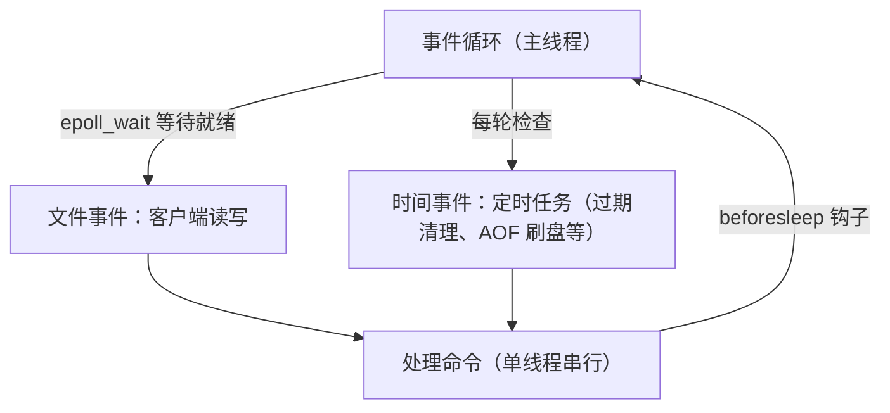
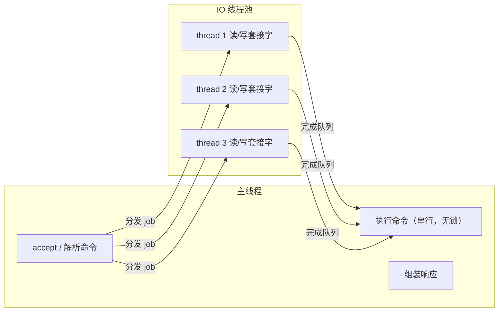
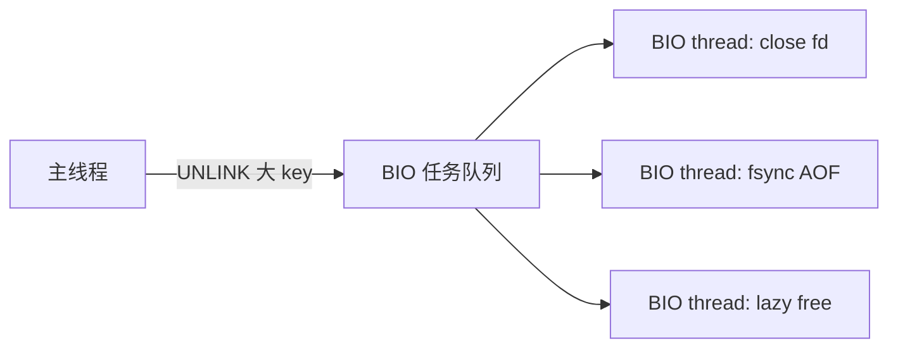

# 线程 IO 模型与通信协议

## 0. 引言

"Redis 是单线程的，为什么还这么快？"——这是面试高频题，也是理解 Redis 设计哲学的关键。真相是：**执行命令的主线程是单线程的，但 IO 读写早已多线程化（Redis 6.0+），后台任务还有专门的线程池**。本章拆解 Redis 的线程架构与 RESP 协议，并给出 7.x 的性能模型。

## 1. 单线程事件循环：aeEventLoop

### 1.1 核心结构

Redis 基于自研的 `ae` 事件库构建**单线程事件循环**（基于 epoll/kqueue/select 多路复用）：

```c
typedef struct aeEventLoop {
    int maxfd;                       /* 最大文件描述符 */
    long long timeEventNextId;       /* 时间事件 ID */
    aeFileEvent events[AE_SETSIZE];  /* 文件事件（套接字读写） */
    aeFiredEvent fired[AE_SETSIZE];  /* 就绪事件 */
    aeTimeEvent *timeEventHead;      /* 时间事件链表（定时任务） */
    int stop;
    void *apidata;                   /* epoll/kqueue 私有数据 */
    aeBeforeSleepProc *beforesleep;  /* 进入阻塞前回调 */
} aeEventLoop;
```



### 1.2 为什么单线程反而快

| 因素 | 说明 |
|------|------|
| 纯内存操作 | 数据在内存，无磁盘 IO 瓶颈（持久化异步化） |
| 避免锁竞争 | 单线程无锁，无上下文切换开销 |
| 多路复用 | epoll 支撑十万级连接，事件驱动不阻塞 |
| 高效数据结构 | SDS、listpack、skiplist 等极致优化 |
| 系统调用少 | 批量读写、延迟写（如 `writev`） |

**代价**：单条命令执行慢（如 `KEYS *`、大 key 的 `DEL`）会阻塞整个实例——这催生了渐进式遍历（SCAN）、惰性删除（UNLINK/BIO）等机制。

## 2. 多线程 IO：io-threads（Redis 6.0+）

### 2.1 瓶颈在哪

Redis 的 CPU 瓶颈很少在执行逻辑，而在**网络读写**：单线程要完成 accept、read、解析、执行、write。Redis 6.0 引入**多线程 IO**，让 read/write 阶段并行，命令执行仍由主线程串行完成（保证无锁与原子性）。



### 2.2 配置

```text
# redis.conf（6.0+）
io-threads 4            # 默认 1（关闭多线程 IO），建议 4-8
io-threads-do-reads yes # 是否并发读（默认 no：只并发写）
```

要点：

- **io-threads 默认 1**（未开启），需显式配置；
- 仅对**网络读写**加速，命令执行仍单线程；
- 4 核以上机器才建议开启；`io-threads-do-reads` 开启后读也并行，但会引入更多竞争，需压测验证；
- 8.x 在 IO 线程上仍有持续优化，但"开启即更快"不成立——是否开启、开几个线程务必以压测结果为准。

### 2.3 BIO 后台线程（Background I/O）

Redis 的耗时型 IO 全部被异步化到 **BIO 线程池**（`bio.c`，默认 3 个线程）：

| BIO 线程 | 职责 |
|---------|------|
| BIO_CLOSE_FILE | 关闭文件描述符（AOF/RDB 文件） |
| BIO_AOF_FSYNC | AOF 落盘（fsync） |
| BIO_LAZY_FREE | 惰性删除（UNLINK/FLUSHALL ASYNC 的大对象回收） |



主线程通过**任务队列 + 互斥锁 + 条件变量**与 BIO 线程通信，主线程只在入队瞬间短暂加锁，不阻塞。

## 3. RESP 协议：RESP2 与 RESP3

### 3.1 RESP2 基础类型

RESP（REdis Serialization Protocol）是文本协议，简单到可以用 `telnet` 手写：

```text
*3\r\n            # 数组，3 个元素
$3\r\n            # 字符串，3 字节
SET\r\n
$3\r\n
foo\r\n
$3\r\n
bar\r\n
```

| 类型 | 前缀 | 示例 |
|------|------|------|
| 简单字符串 | `+` | `+OK\r\n` |
| 错误 | `-` | `-ERR ...\r\n` |
| 整数 | `:` | `:1000\r\n` |
| 批量字符串 | `$` | `$3\r\nfoo\r\n` |
| 数组 | `*` | `*2\r\n...` |

### 3.2 RESP3：Redis 6.0 引入的协议升级

客户端通过 `HELLO 3` 握手切换到 RESP3：

```bash
> hello 3
1# "server" => "redis"
2# "version" => "8.6.2"          # 版本号随实例而异
3# "proto" => (integer) 3
4# "id" => (integer) 83
5# "mode" => "standalone"
6# "role" => "master"
7# "modules" => ...              # 已加载模块
```

RESP3 新增类型解决 RESP2 的"类型坍缩"问题：

| 新类型 | 意义 |
|--------|------|
| Map（`%`） | HGETALL 返回真正的键值对，不再靠数组猜 |
| Set（`~`） | SMEMBERS 返回集合 |
| Double（`,`） | ZSCORE 返回浮点 |
| Boolean（`#`） | 语义化真假 |
| Push（`>`） | **服务端主动推送**（PubSub、客户端缓存失效通知） |
| Verbatim string（`=`） | 带格式的字符串 |
| Big number（`(`） | 大整数 |
| Null（`_`） | 显式空值 |

**客户端缓存（Client-side Caching）**：RESP3 的 Push 消息让 Redis 可以主动通知客户端"key 失效"，实现客户端本地缓存 + 服务端失效广播，大幅降低读延迟——这是 RESP3 最实用的新能力之一。

## 4. 性能模型与调优

### 4.1 延迟的成分

```text
总延迟 = 网络 RTT + 排队 + 命令执行 + 响应序列化
```

### 4.2 常见延迟陷阱

| 陷阱 | 原因 | 对策 |
|------|------|------|
| 大 key 操作 | 单条命令耗时长阻塞 | 拆分、SCAN、UNLINK |
| `KEYS *` / `SMEMBERS` 大集合 | O(N) 全量遍历 | SCAN/SScan |
| 频繁 fork 持久化 | fork 复制页表瞬间阻塞主线程，COW 带来内存膨胀 | 错峰触发、控制单实例内存规模 |
| 慢日志 | 未发现慢命令 | `SLOWLOG GET` 监控 |
| 内存碎片 | 高写入量下碎片率高 | `MEMORY PURGE`/`activedefrag` |

### 4.3 监控命令

```bash
> info commandstats        # 命令级耗时统计
> slowlog get 10           # 最近慢命令
> info stats | grep blocked_clients   # 阻塞客户端数
```

## 5. 小结

- **单线程执行命令**是 Redis 简单与高性能的基石，事件循环 + 多路复用支撑高并发；
- **6.0+ 多线程 IO** 解决网络读写瓶颈，`io-threads` 按需开启；
- **BIO 线程**异步化文件 IO 与惰性删除，主线程永不阻塞于磁盘；
- **RESP3** 带来 Map/Set/Push 等类型与客户端缓存能力，新客户端请优先支持 RESP3。

下一章讲解 SCAN 渐进式遍历：如何在十万 key 中安全遍历而不阻塞。