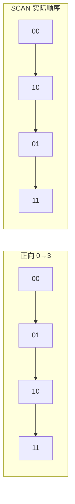

# Scan 渐进式遍历

## 0. 引言

`KEYS pattern` 一次返回所有匹配 key，O(N) 全量扫描会**阻塞 Redis 单线程数秒**——生产环境绝不允许。`SCAN` 命令以**游标分步**迭代，每次只返回一小批 key，把阻塞化整为零。本章剖析 SCAN 的游标机制（这是面试深水区）、四种类型变体与工程实践。

## 1. KEYS 的灾难

```bash
> keys user_*
1) "user_1"
2) "user_2"
...  # 1000 万个 key 时，这里卡住所有客户端
```

KEYS 的问题：

- O(N) 全量扫描，一条命令阻塞主线程；
- 返回数据量巨大，网络与客户端内存双压力；
- 生产环境通常通过 `rename-command KEYS ""` 禁用。

## 2. SCAN 基本用法

### 2.1 游标范式

```bash
> scan 0
1) "17"                       # 下一次使用的游标
2) 1) "user_100"
   2) "order_200"
   ...
> scan 17
1) "29"
2) 1) "product_1"
   ...
> scan 0                     # 游标回到 0，遍历完成
1) "0"
2) (empty array)
```

**规则**：

- 每次调用传入上一次返回的游标，返回新游标 + 一批数据；
- 游标回到 `0` 表示遍历结束；
- `COUNT count` 提示每批返回数量（默认 10，**只是提示**，实际可能更多/更少）；
- `MATCH pattern` 对扫描到的 key 逐一匹配——不会因过滤漏掉遍历期间一直存在的匹配 key，但遍历期间其他客户端的增删会使结果与 `KEYS` 的即时快照有差异。

### 2.2 类型变体

```bash
> sscan set:members 0 count 100           # set 集合遍历
> hscan hash:user 0 count 100             # hash 遍历（返回 field-value 对）
> zscan zset:ranking 0 count 100          # zset 遍历（返回 member-score 对）
```

它们共享同一套游标语义，只是遍历的数据结构不同。

### 2.3 TYPE 过滤（6.0+）

`SCAN` 支持按**数据类型**过滤（`sscan`/`hscan`/`zscan` 不支持）：

```bash
> scan 0 type string count 100    # 只返回 string 类型 key
> scan 0 type zset count 100      # 只返回 zset 类型 key
```

**适用场景**：排查某类大 key（如全部 hash 类型）、清理过期类型的残留数据。`type` 与 `MATCH` 一样是遍历过程中的逐一过滤，不改变"遍历期间一直存在的 key 保证返回"的语义。

## 3. 游标原理：反向二进制迭代

SCAN 的游标为什么"乱序"且"能保证不遗漏"？核心是**反向二进制加一（reverse binary iteration）**：

### 3.1 桶遍历顺序

假设哈希表有 4 个桶（索引 0-3，2 bit），SCAN 的遍历顺序是 `0 → 2 → 1 → 3`，即**二进制位反转**后的顺序：

```text
索引(2bit)  反转      遍历序
00      →  00     →  0
01      →  10     →  2
10      →  01     →  1
11      →  11     →  3
```



### 3.2 为什么反向遍历

反向遍历保证了**扩容/缩容时的不遗漏**：

- 哈希表扩容（4→8 桶）时，桶 i 的元素会分裂到 `i` 和 `i+4`（最高位 +1）；
- 反向遍历从低位递增，遍历到的高位桶**要么已遍历完，要么未开始**，不会有元素被漏掉或重复；
- 这是 SCAN 能"保证返回所有元素（至少一次）"的理论基础。

### 3.3 SCAN 的保证与不保证

| 语义 | 保证 |
|------|------|
| 返回所有元素 | ✅ 遍历期间存在的元素至少返回一次 |
| 重复返回 | ⚠️ 可能（扩容/缩容期间）——客户端需去重 |
| 空游标期间删除的元素 | 不保证返回 |
| 新增元素 | 不保证返回 |
| 与 KEYS 一致 | ❌ （MATCH 是批次内过滤） |

## 4. 与 KEYS/BIGKEY 的工程实践

### 4.1 安全遍历所有 key

```bash
# 脚本化遍历（shell 示例）
cursor=0
while true; do
  reply=$(redis-cli scan "$cursor" match "user:*" count 1000)
  cursor=$(echo "$reply" | head -1)      # 第一行是新游标
  keys=$(echo "$reply" | tail -n +2)     # 其余行是本批 key
  # 处理 keys
  [ "$cursor" = "0" ] && break
done
```

### 4.2 大 key 排查（配合 MEMORY USAGE）

```bash
> scan 0 count 1000
1) "12"
2) (empty array)
> memory usage big:key
(integer) 104857600    # 100MB
```

对大 key 的处理：`UNLINK` 异步删除（BIO 线程回收，不阻塞主线程），或拆分为小 key。

### 4.3 并发安全

- SCAN 可以**多客户端同时遍历**同一个 key 空间，互不干扰（游标独立）；
- 单客户端遍历期间允许其他客户端增删改，结果“尽力而为”；
- 不要在 SCAN 循环内做破坏迭代的操作（如删除当前返回的 key 是安全的，但重命名可能造成重复/遗漏）。

### 4.4 生产环境清理策略

```bash
# 全量扫描 + 按条件删除（安全模式）
redis-cli --scan --pattern "session:*" | xargs -L 100 redis-cli unlink

# 限流删除，避免删除风暴：每批 100 个，间隔 50ms
redis-cli --scan --pattern "temp:*" \
  | xargs -L 100 -I{} sh -c 'redis-cli unlink {}; sleep 0.05'
```

**要点**：

1. **删除用 UNLINK 不用 DEL**：大 key 的 DEL 会阻塞主线程，UNLINK 交给后台 BIO 线程回收；
2. **匹配模式要精确**：`pattern` 越精确扫描开销越小，避免误删；
3. **分批限速**：大量 key 同时删除会引发内存碎片与主线程压力，批次 + 间隔更稳；
4. **业务低峰执行**：扫描本身有 CPU 开销，避开流量高峰。

## 5. 小结

| 维度 | KEYS | SCAN |
|------|------|------|
| 复杂度 | O(N) 全量 | 分批 O(count) |
| 阻塞 | 阻塞整个实例 | 每批毫秒级 |
| 一致性 | 快照（一次性） | 迭代期间变化可见 |
| 生产可用 | ❌ 禁用 | ✅ 首选 |

- SCAN 的游标是**反向二进制迭代**，这是"扩容不遗漏"的数学保证；
- MATCH 过滤是批次内的，排查/清理可用，精确统计请用真实数据；
- 大 key 清理用 `UNLINK` 而非 `DEL`。

下一章进入持久化：RDB 快照与 AOF 日志，以及 Redis 7.0 的 AOF 重构。