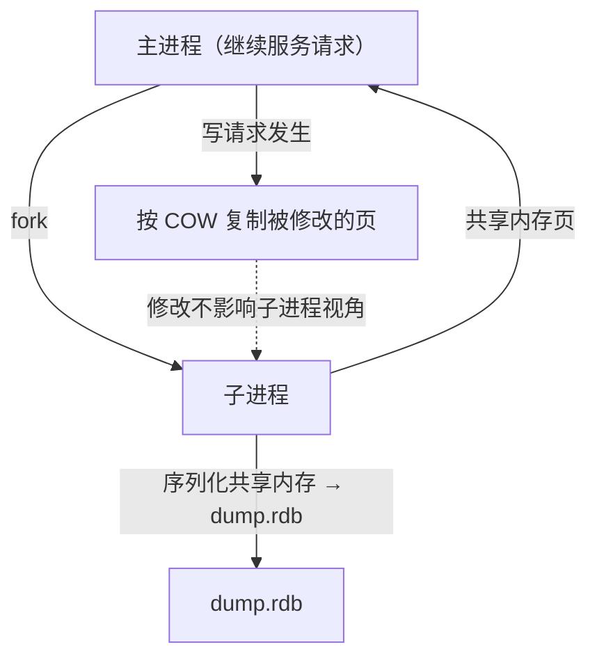
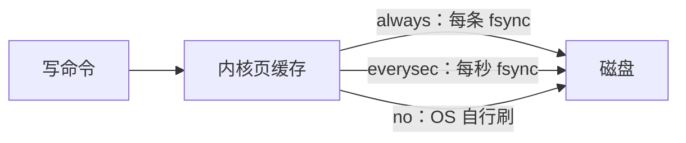
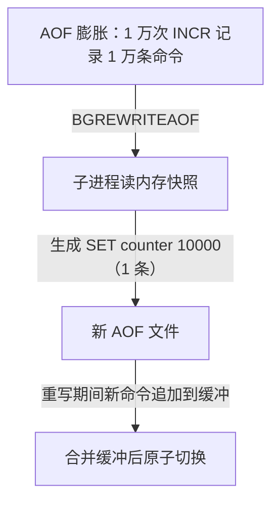
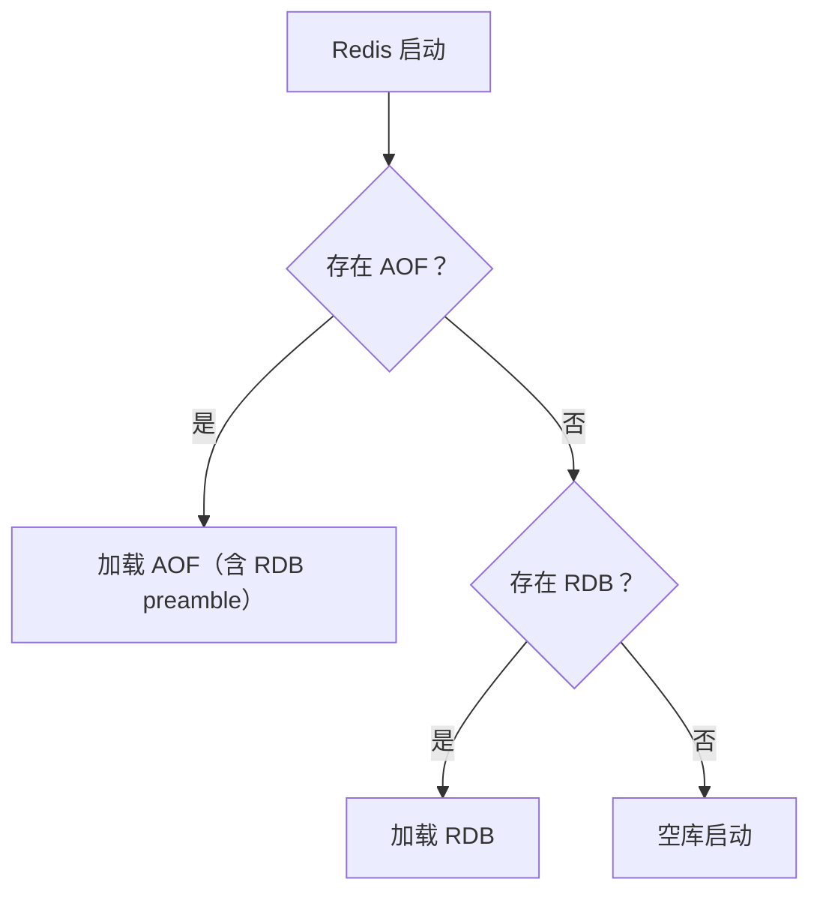

# 持久化 RDB 与 AOF

## 0. 引言

Redis 是内存数据库，进程退出或宕机不持久化就会**全量丢数据**。Redis 提供两条持久化路径：

- **RDB（快照）**：某时刻内存数据的二进制序列化，紧凑、恢复快，但可能丢最后一次快照后的数据；
- **AOF（追加日志）**：记录每次写命令，粒度细、可恢复近实时数据，但文件大、恢复慢。

Redis 7.0 对 AOF 做了重大重构（multi-part AOF），本章以 7.x 视角完整梳理两者的原理、配置与容灾实践。

## 1. RDB 快照

### 1.1 触发方式

```text
# redis.conf
save 900 1        # 900 秒内至少 1 次写 → 快照
save 300 10       # 300 秒内至少 10 次写
save 60 10000     # 60 秒内至少 10000 次写
save ""           # 关闭 RDB
```

手动触发：`SAVE`（阻塞）与 `BGSAVE`（后台子进程，生产只用这个）。

### 1.2 fork + COW 原理

Redis 是单线程，快照期间还要响应请求，如何"边拍照边改"？答案：**fork 子进程 + 写时复制（Copy On Write）**。



- fork 瞬间，子进程与父进程**共享全部内存页**（虚拟内存不复制）；
- 子进程把共享页序列化为 RDB 文件；父进程继续处理请求；
- 父进程**第一次修改某页时**，内核复制该页（COW），父子各持一份——子进程看到的仍是快照时刻的数据；
- **代价**：写入量大的实例，COW 复制会导致内存峰值接近 2 倍，且 fork 本身耗时（大实例可达数百 ms）。

### 1.3 RDB 的优缺点

| 优点 | 缺点 |
|------|------|
| 文件紧凑，适合备份/迁移 | 两次快照之间的数据会丢 |
| 恢复速度最快（直接加载） | 大实例 fork 可能阻塞主线程 |
| 子进程生成，主线程影响小 | 过频快照磁盘压力大 |

## 2. AOF 日志

### 2.1 写命令追加

AOF 记录**修改数据的命令**（读命令不记录），追加到文件：

```bash
> set user:1 hello
```

AOF 文件内容（RESP 格式）：

```text
*3\r\n
$3\r\n
SET\r\n
$6\r\n
user:1\r\n
$5\r\n
hello\r\n
```

### 2.2 fsync 策略

命令写入内核缓冲区后，何时落盘由 `appendfsync` 决定：

| 策略 | 行为 | 数据安全 | 性能 |
|------|------|---------|------|
| `always` | 每条命令 fsync | 最多丢 1 次命令 | 最慢（磁盘瓶颈） |
| `everysec`（默认） | 每秒 fsync | 最多丢 1 秒数据 | 推荐 |
| `no` | 交给操作系统 | 可能丢数秒数据 | 最快 |



### 2.3 AOF 重写（Rewrite）

AOF 长期运行会无限膨胀。**重写**（由 `BGREWRITEAOF` 触发）读取当前内存数据，生成一份**只含最终状态**的紧凑 AOF：



触发条件：`auto-aof-rewrite-percentage 100`（增长 100%）+ `auto-aof-rewrite-min-size 64mb`。

### 2.4 Redis 7.0 重构：multi-part AOF

7.0 之前 AOF 是单文件，重写期间父进程要把重写期间的新写命令持续写入 rewrite buffer——高峰期该 buffer 可能**无限增长**，带来内存峰值与性能抖动。**Redis 7.0 引入 multi-part AOF**：

```text
appenddirname "appendonlydir"
├── appendonly.aof.1.base.rdb      # 基础文件（重写产物，RDB 格式）
├── appendonly.aof.1.incr.aof      # 增量文件（重写后的新命令）
├── appendonly.aof.2.base.rdb
├── appendonly.aof.2.incr.aof
└── appendonly.aof.manifest        # 清单：记录哪些文件属于当前 AOF
```

- 基础文件（base）+ 增量文件（incr）分离，重写不再"原地改单文件"；
- **manifest 清单**记录文件集合，重启按清单加载，原子切换更安全；
- 备份时需复制整个 `appenddirname` 目录（含 manifest），并在备份窗口暂停自动重写，避免 base/incr 在复制过程中发生切换。

```bash
# 7.0+ 查看 AOF 状态
> info persistence
aof_enabled:1
aof_rewrite_in_progress:0
aof_current_size:12345
aof_base_size:23456
```

## 3. 混合持久化（RDB + AOF）

`aof-use-rdb-preamble yes`（4.0 引入、5.0 起默认开启）让 AOF 重写产物以 **RDB 格式存基础文件**：既保留 RDB 的快速加载，又保留 AOF 的增量能力。7.0 的 base 文件就是 `.rdb` 后缀，正是混合持久化的体现。

## 4. 恢复与容灾

### 4.1 启动恢复优先级



### 4.2 备份策略

| 层面 | 做法 |
|------|------|
| 本地备份 | 定时 `BGSAVE` + 复制 dump.rdb / appendonlydir 到备份盘 |
| 异地备份 | 备份文件同步到对象存储（OSS/S3），保留多版本 |
| 演练 | **定期演练恢复**（生产事故中"备份不可恢复"比"没有备份"更可怕） |
| 复制 | 主从复制是另一层保障（见下一章），但不可替代备份 |

### 4.3 AOF 损坏修复

```bash
# AOF 文件损坏时
> redis-check-aof --fix appendonly.aof.1.incr.aof
# RDB 文件损坏时
> redis-check-rdb dump.rdb
```

## 5. 配置模板（生产推荐）

```text
# RDB
save 900 1
save 300 10
save 60 10000
stop-writes-on-bgsave-error yes

# AOF
appendonly yes
appendfilename "appendonly.aof"
appenddirname "appendonlydir"     # 7.0+
appendfsync everysec
auto-aof-rewrite-percentage 100
auto-aof-rewrite-min-size 64mb
aof-use-rdb-preamble yes          # 混合持久化
aof-timestamp-enabled no          # 7.0+，可选时间戳注解
```

## 6. 小结

| 维度 | RDB | AOF | 混合 |
|------|-----|-----|------|
| 粒度 | 快照 | 每命令 | 基快照+增量 |
| 数据丢失窗口 | 秒~分钟 | always/everysec/no | everysec 级 |
| 恢复速度 | 快 | 慢（重放） | 较快 |
| 文件大小 | 小 | 大（可重写） | 中 |
| 生产配置 | 开启 | **开启 everysec** | 默认开启 |

**核心结论**：生产环境**同时开启 RDB + AOF（everysec）**，靠 AOF 保数据、靠 RDB 保快速恢复；Redis 7.0 的 multi-part AOF 让重写与备份更安全；定期做恢复演练才是容灾的最后保障。

下一章讲解主从复制：PSYNC 增量同步与 Redis 7.x 复制体系。