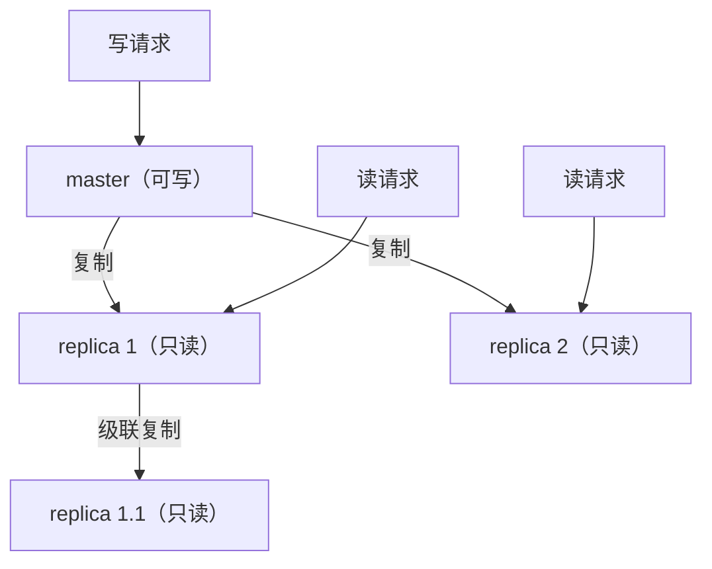
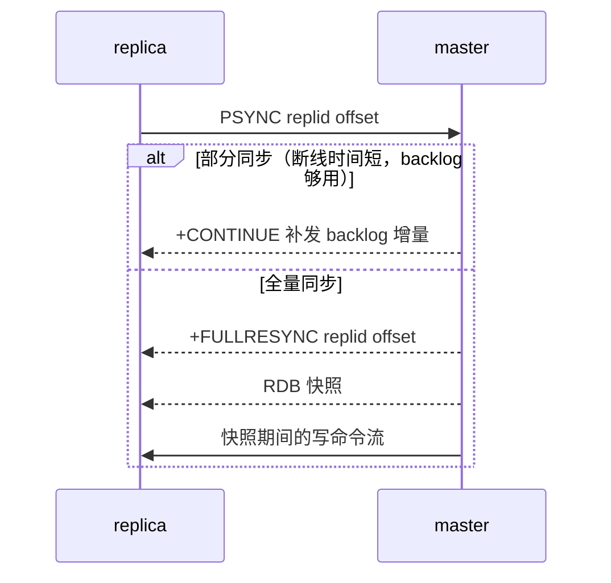
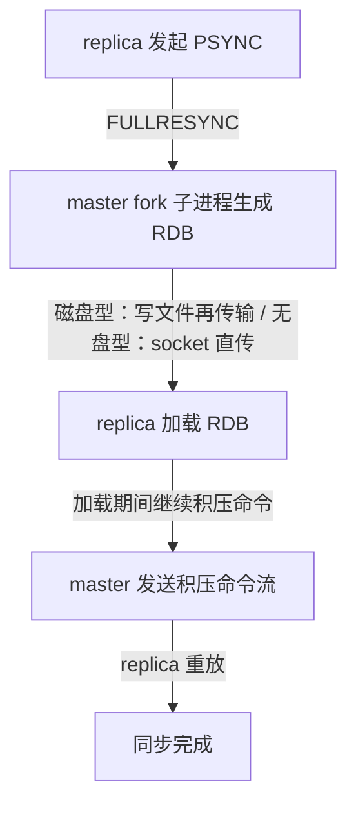

# 主从复制

## 0. 引言

主从复制（Replication）是 Redis 高可用的地基：数据从 master 同步到 replica，实现**读写分离**（读扩展）与**故障转移**（Sentinel/Cluster 的依赖）。本章解析复制协议（PSYNC/PSYNC2）、同步机制与 7.x 下的实践要点。

## 1. 基本架构



- replica 默认只读（`replica-read-only yes`），通过 `REPLICAOF host port` 指定主节点；
- 复制是**异步**的：master 执行写命令后立即返回，复制在后台进行——**主从存在延迟**是常态；
- 拓扑：一主多从、级联复制（replica 也可作为更下游的 master）。

## 2. 同步协议演进：SYNC → PSYNC → PSYNC2

### 2.1 PSYNC（Redis 2.8+）

replica 通过 `PSYNC <replid> <offset>` 向 master 请求同步：

- **全量同步（full resync）**：master 生成 RDB 快照发给 replica，之后把快照期间的写命令发给 replica 重放；
- **部分同步（partial resync）**：replica 断线重连后，若断线期间的命令还在 master 的**复制积压缓冲区（repl_backlog）**内，只需补发增量——避免全量重传。



### 2.2 PSYNC2（Redis 4.0+）

PSYNC2 解决"**主从切换后全量同步风暴**"：

- **replication ID 与 offset**：`replid`（当前数据集血缘）+ `replid2`（上一个 replid，即故障前 master 的 ID）+ `offset` 唯一定位数据集版本；
- 主从切换后，新 master 继承旧 master 的 `replid2`，其余 replica **只需部分同步**（基于旧 replid 的 offset 增量），而不是全量重传；
- 这极大降低了故障转移场景下的带宽与延迟冲击。

### 2.3 复制缓冲与配置

```text
# redis.conf
repl-backlog-size 1mb        # 复制积压缓冲区：越大，部分同步命中率越高
repl-backlog-ttl 3600        # 无 replica 时 backlog 保留时间
repl-diskless-sync yes       # 无盘同步：RDB 直接通过 socket 传输（7.0 起默认 yes）
repl-diskless-sync-delay 0   # 等待更多 replica 汇合的窗口秒数（7.0 起默认 0，旧版为 5）
min-replicas-to-write 1      # 至少 N 个 replica 在线才接受写（防脑裂丢数据）
min-replicas-max-lag 10
```

**建议**：`repl-backlog-size` 按"峰值写速率 × 容忍断线时间"估算（如 10MB/s × 60s = 600MB），部分同步命中率直接影响故障恢复体验。

## 3. 全量同步的细节



- **无盘复制（diskless）**：7.x 默认开启，RDB 不落盘直接走网络，避免磁盘 IO 与双倍磁盘占用；
- 全量同步期间 master 仍可服务，但大实例 fork 有短暂阻塞（同 RDB 章节的 COW 分析）；
- 大 key 过多会明显拖慢全量同步，从库提升前建议先 `BGSAVE` 预热。

## 4. 延迟与一致性

### 4.1 复制延迟来源

| 来源 | 说明 | 对策 |
|------|------|------|
| 网络 RTT | 跨机房明显 | 同机房部署 |
| master 写量大 | 命令流积压 | 分片、降低写放大 |
| replica 慢 | 单线程处理不过来 | 提高实例规格 |
| 大 value | 序列化/传输/重放耗时 | 拆分大 key |

### 4.2 一致性权衡

- **异步复制**：master 返回成功 ≠ replica 已收到，`min-replicas-to-write` 可强制"至少 N 个副本在线才写"，用可用性换一致性；
- **WAIT 命令**（Redis 3.0+）：`WAIT numreplicas timeout` 阻塞等待指定数量 replica 确认，实现**同步复制**的近似（仅保障"已传播"，非分布式事务）；
- **脑裂**：master 与多数派失联但仍接受写 → 切换后数据丢失。配合 `min-replicas-to-write` + Sentinel 的 `quorum` 降低概率。

### 4.3 过期键的复制语义

- 物理删除由 master 决定，master 删除后向 replica 传播 `DEL`；
- replica 侧对 key 同样按**逻辑过期**判定（实测：暂停 master 使 DEL 无法传播，从库对已到期 key 仍返回 nil、TTL 为 -2）——正常的从库读不会读到"已过期但未删"的数据（Redis 6.0 起行为）；
- 注意 `replica-serve-stale-data no` 的作用域是"断线/全量同步期间从库对外供读"的语义，与过期键无关。

## 5. 复制与持久化的关系

- **replica 默认不持久化**也能工作（数据全量来自 master），但重启后需重新全量同步；
- **建议**：replica 开启 AOF，作为 master 持久化失败的兜底；
- 备份时从 **replica** 上 `BGSAVE`（`redis-cli --rdb` 或 `BGSAVE`），避免影响 master 性能。

## 6. 常见坑清单

1. **repl-backlog-size 太小**：频繁断线触发全量同步风暴；
2. **忽略 master 与 replica 版本差异**：官方要求 replica 版本**与 master 相同或更高**（master 须是最低版本，滚动升级应先升从库再升主库）；
3. **读写分离读旧数据**：复制延迟导致读到旧值，业务需容忍或路由敏感读走 master；
4. **主从切换后未处理 `replid` 变化**：客户端主从切换感知（Sentinel/Cluster 已封装）；
5. **大实例首次全量**：预留带宽与磁盘，建议错峰。

## 7. 小结

- 复制 = 命令流 + 部分同步（PSYNC2 的 replid/offset 机制）+ 全量兜底；
- 异步复制是性能与一致性的默认平衡点，关键场景用 `WAIT`/`min-replicas` 收紧；
- 主从复制解决**读扩展与数据冗余**，但**不解决自动故障转移**——那是 Sentinel 的职责（下一章）。

下一章讲解 Sentinel：Redis 高可用的自动故障转移机制。