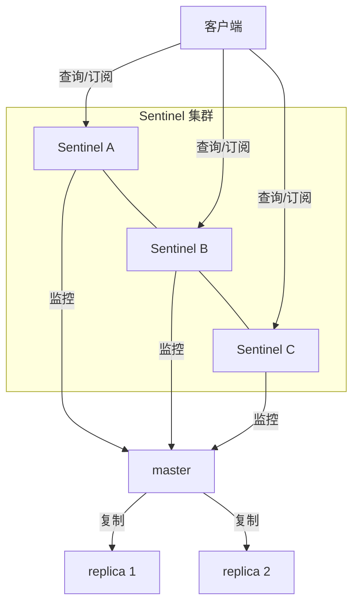
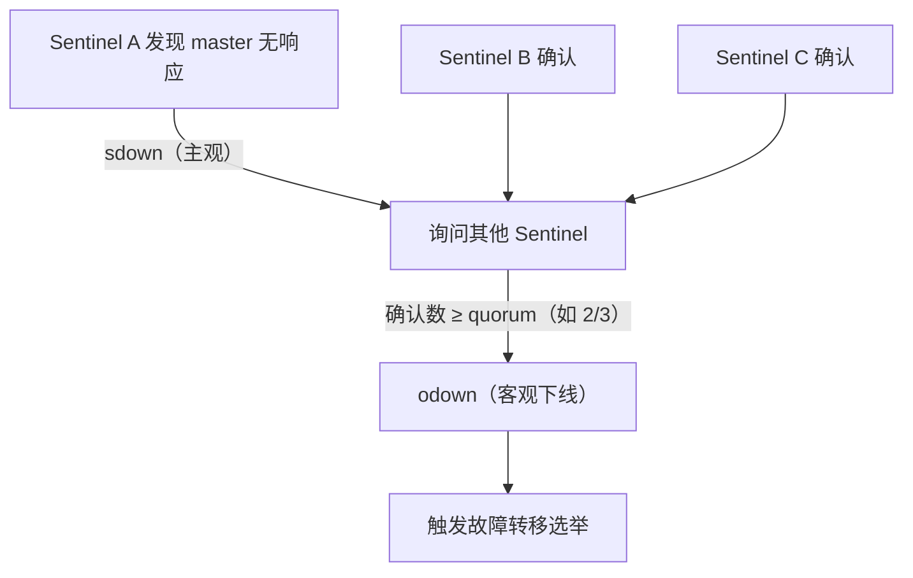
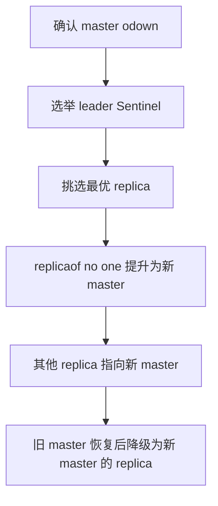

# Sentinel 哨兵

## 0. 引言

主从复制解决了"数据有副本"，但**master 宕机后谁来把某台 replica 提升为新 master**？人工操作需要分钟级，业务不可接受。**Sentinel（哨兵）**是 Redis 官方的高可用组件：监控、通知、自动故障转移。本章解析 Sentinel 的架构、判定机制与 Raft 选举，以及 7.x 场景的部署实践。

## 1. 架构与职责



Sentinel 四大职责：

| 职责 | 说明 |
|------|------|
| 监控（Monitoring） | 周期性 PING 所有 master/replica/sentinel |
| 通知（Notification） | 实例异常时通知管理员/应用 |
| 自动故障转移（Automatic failover） | master 下线时选举 replica 提升为新 master |
| 配置提供（Configuration provider） | 客户端通过 Sentinel 发现当前 master 地址 |

## 2. 主观下线与客观下线

### 2.1 主观下线（sdown）

单个 Sentinel 在 `down-after-milliseconds` 内未收到 PING 回复，标记该实例 **sdown（subjective down）**——只是"我认为它挂了"。

### 2.2 客观下线（odown）

Sentinel 通过 `SENTINEL is-master-down-by-addr` 询问其他 Sentinel 对 master 的看法，**达到 quorum 数量的确认**后标记 **odown（objective down）**，触发故障转移流程。



## 3. 故障转移流程

### 3.1 领导者选举（Raft 风格）

触发故障转移前，Sentinel 集群先选举一个**领导者**负责执行（与 Raft 的 Leader Election 类似）：

- 每个 Sentinel 在"看到 master odown"后，向其他 Sentinel 发送 `SENTINEL is-master-down-by-addr` 请求毛遂自荐；每个 Sentinel 在每个 epoch（纪元）中只有一票；
- 获得**大多数（majority）**投票的 Sentinel 成为 leader；
- 只有 leader 才能执行故障转移，避免多 Sentinel 同时操作的混乱。

### 3.2 选择新 master

Leader 按以下优先级选择 replica（依次比较，先分胜负即停）：

1. **replica-priority 最小**（值越小优先级越高；设为 0 表示该 replica 永不参与选主）；
2. **复制偏移量最大**（数据最新，`slave_repl_offset`）；
3. **runid 最小**（字典序，作为 tie-breaker）。

```bash
# 查看 replica 状态
> sentinel replicas mymaster
1) 1) "name"
   2) "127.0.0.1:6380"
   3) "slave-repl-offset"
   4) "123456"
```

### 3.3 转移步骤



1. 向选中的 replica 发送 `REPLICAOF NO ONE`，使其成为新 master；
2. 其他 replica 执行 `REPLICAOF <new_master>` 重新指向；
3. 原 master 恢复时，Sentinel 将其降级为新 master 的 replica（保留 `replid2` 支持 PSYNC2 部分同步）；
4. 期间所有写操作失败（旧 master 已不可用），客户端需从 Sentinel 获取新 master 重试。

## 4. 配置与部署

### 4.1 sentinel.conf 核心项

```text
sentinel monitor mymaster 127.0.0.1 6379 2
sentinel auth-pass mymaster <password>
sentinel down-after-milliseconds mymaster 5000
sentinel failover-timeout mymaster 60000
sentinel parallel-syncs mymaster 1
```

| 配置 | 含义 |
|------|------|
| `monitor` | 监控的 master 名/地址/端口/**quorum**（判定 odown 所需确认数） |
| `down-after-milliseconds` | 主观下线判定超时 |
| `parallel-syncs` | 故障转移后同时向新 master 全量同步的 replica 数（1 最稳） |
| `failover-timeout` | 故障转移总超时 |

### 4.2 部署铁律

- **至少 3 个 Sentinel 节点**（奇数），保证 quorum 与 majority 不冲突；
- Sentinel 与 Redis 实例**分开部署**（不同机器），避免同机电源/网络故障；
- quorum 与 majority 的关系：quorum 是"判定下线"的门槛，majority 是"选举 leader"的门槛（如 3 节点 quorum=2）；
- Sentinel 通过向 master 的 `__sentinel__:hello` 频道发布/订阅消息**相互发现**，replica 列表则从 master 的 `INFO replication` 获取；配置变更通过 pub/sub 通道同步。

### 4.3 客户端接入

```java
// Jedis Sentinel 客户端：自动发现 master，故障转移后自动切换
Set<String> sentinels = new HashSet<>(Arrays.asList("127.0.0.1:26379", "127.0.0.1:26380", "127.0.0.1:26381"));
JedisSentinelPool pool = new JedisSentinelPool("mymaster", sentinels);
try (Jedis jedis = pool.getResource()) {
    jedis.set("k", "v");   // 透明地读写当前 master
}
```

```bash
# redis-cli 直接问 Sentinel
> sentinel get-master-addr-by-name mymaster
1) "127.0.0.1"
2) "6379"
```

## 5. Sentinel vs Cluster

| 维度 | Sentinel | Redis Cluster |
|------|----------|--------------|
| 分片 | ❌ 单写点 | ✅ 16384 slot 分片 |
| 故障转移 | Sentinel 自动 | 集群节点自动（Gossip） |
| 数据扩展 | 只读扩展 | 读写均可扩展 |
| 复杂度 | 低（3 进程 + 主从） | 高（多节点 + 槽位管理） |
| 适用 | 中小规模、单写多读 | 大规模、需分片 |

**选型建议**：数据量单机可承载、需要高可用 → Sentinel；数据量超出单机、需要横向扩展 → Cluster（下一章详解）。

## 6. 常见坑

1. **quorum 设置过大**：网络分区时无法判定 odown，故障转移不触发；
2. **Sentinel 数量 < 3**：无法形成 majority，选举失败；
3. **忽略 auth-pass**：开启 requirepass 后 Sentinel 需配置认证，否则监控失败；
4. **客户端缓存 master 地址**：故障转移后客户端必须重新从 Sentinel 获取（Jedis SentinelPool 已处理）；
5. **`parallel-syncs` 过大**：多 replica 同时全量同步，可能压垮新 master。

## 7. 小结

- Sentinel = 监控 + 通知 + 自动故障转移 + 配置提供，理论基石是 odown 确认与 Raft 式领导者选举；
- 部署三节点起步、独立物理机、quorum 与 majority 清晰；
- 数据量超单机时，升级到 Redis Cluster 获得分片 + 高可用一体方案。

下一章讲解过期策略：Redis 如何删除过期键（惰性 + 定期），以及内存淘汰 LRU/LFU。