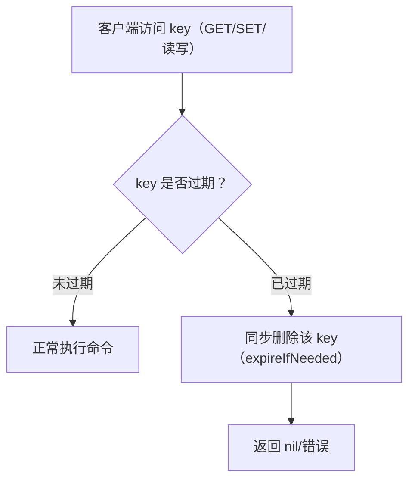
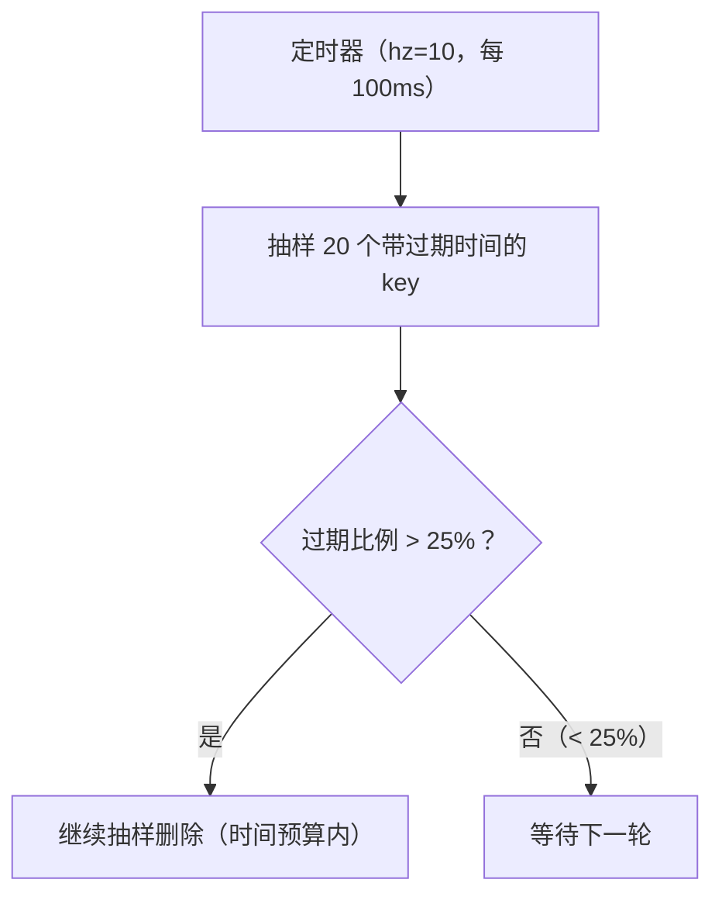

# 过期策略

## 0. 引言

`EXPIRE`/`TTL` 是 Redis 最常用的命令之一，但"过期键到底何时被删除"的机制常被误解。Redis 采用**惰性删除 + 定期删除**的组合策略，兼顾 CPU 与内存。本章解析两种策略的原理、源码级行为（activeExpireCycle）、默认值演进与工程注意点。

## 1. 为什么会话/缓存会"过期"

```bash
> set session:1001 "token" ex 3600
> ttl session:1001
(integer) 3599
> expire order:1001 300
(integer) 1
> pexpireat key <unix-time-ms>     # 指定绝对过期时间
```

- `EX`/`PX`（SET 选项）与 `EXPIRE`/`PEXPIRE`/`EXPIREAT` 设置相对/绝对过期；
- 过期信息以**毫秒时间戳**保存在 key 的元数据中（dict entry 的 expire 字段），不额外占用结构；
- 7.x 中 `SET ... EX` 与 `SETEX` 等价且原子。

## 2. 策略一：惰性删除（lazy expire）

**访问 key 时才检查是否过期**：



- 实现：每次命令执行前调用 `expireIfNeeded()` 检查；
- **优点**：CPU 开销最小（只在访问时检查）；
- **缺点**：过期但长期不被访问的 key 会**常驻内存**——所以必须配合定期删除。

> 注意区分：这里的"惰性删除"是指**过期键的删除时机**（访问时删），与第 16 章"惰性删除（lazy free 异步回收内存）"是两个概念，不要混淆。

## 3. 策略二：定期删除（activeExpireCycle）

### 3.1 工作原理

Redis 主循环的**时间事件**周期性调用 `activeExpireCycle()`，每次抽样删除一批过期键：

```text
每 100ms（hz 10）执行一次 activeExpireCycle：
1. 从过期字典随机抽样 20 个 key（ACTIVE_EXPIRE_CYCLE_KEYS_PER_LOOP）
2. 删除其中已过期的
3. 若过期比例 > 25%，继续抽样删除（循环）
4. 每轮有时间预算（slow 模式约占周期的 25%，fast 模式约 1ms），防止阻塞主线程
```



### 3.2 关键参数

| 参数 | 默认 | 说明 |
|------|------|------|
| `hz` | 10 | 时间事件频率（7.0 起默认 10，动态调整） |
| `ACTIVE_EXPIRE_CYCLE_KEYS_PER_LOOP` | 20 | 每轮抽样数量 |
| 时间预算 | 约 25% 的周期 | 每轮最多耗时，防止拖慢命令处理 |

### 3.3 频率自适应与 7.x 的重构

过期执行分 **slow/fast 两种模式**：slow 模式随 `serverCron` 周期执行，fast 模式在事件循环 beforeSleep 中以约 1ms 预算执行。频率自适应由 `dynamic-hz`（5.0 起默认开启）提供：负载高时自动调高 hz、低时降回默认。Redis 7.0 将过期逻辑重构到独立的 `expire.c`，扫描与删除逻辑更清晰，但"动态频率"并非 7.0 新增，请注意区分。

## 4. 内存淘汰（maxmemory）与过期的关系

**过期 ≠ 淘汰**，两者是完全独立的机制：

| 机制 | 触发 | 目的 |
|------|------|------|
| 过期删除 | key 到达 TTL | 释放业务设定的生命周期 |
| 内存淘汰 | 内存达到 maxmemory | 按策略强制驱逐 key 释放内存 |

只有"过期但未删除"的 key 才可能被淘汰策略（volatile-* 系列）优先选中。详见下一章《内存淘汰 LRU 与 LFU》。

## 5. 过期键的复制语义

- **过期由 master 主导**：master 删除过期键后，向 replica 传播 `DEL` 命令；
- **replica 侧按逻辑过期判定**：key 逻辑到期后，replica 对读请求返回 nil、`TTL` 报 -2（实测：即使 master 的 DEL 因故未到达也是如此），物理内存的释放仍等待 master 的 `DEL`；
- 主从一致性的代价：replica 上可能短暂存在"逻辑已过期"的 key，占用内存直到 master 同步 DEL——这是设计取舍，避免主从删除时机不一致。

## 6. 键空间通知（Keyspace Notifications）

7.x 支持过期事件的订阅通知（需开启）：

```text
# redis.conf
notify-keyspace-events Ex    # 启用过期事件（E=keyspace 事件，x=expired）
```

```bash
# 客户端订阅过期事件
> psubscribe __keyevent@0__:expired
```

**注意**：过期通知是**惰性触发的**——key 真正被删除时（惰性或定期）才发布，**不是 TTL 到达时刻**。高精度延时任务不可依赖此机制（延迟可达秒级）。

## 7. 工程实践

### 7.1 缓存过期设计

- **固定 TTL 的惊群问题**：大量 key 同时过期 → 缓存雪崩。解法：TTL 加随机抖动（`TTL + random(0, 300)`）；
- **热点 key 过期**：加锁回源或"逻辑过期"（过期时间存 value，后台异步刷新）；
- **监控**：`INFO keyspace` 查看 `expires`（带 TTL 的 key 数）与 `expired_keys`（累计删除数），观察删除速率。

### 7.2 常见误区

1. **认为过期的 key 立即消失**：惰性删除下，不被访问的 key 由定期删除兜底，存在窗口期；
2. **用 `TTL` 判断“将要过期”**：`TTL` 返回 -2（不存在）/-1（无过期）需区分；
3. **依赖过期通知做任务调度**：通知有延迟、可能丢失，请用 Stream/延时队列；
4. **一次性写入大量同 TTL key**：触发定期删除洪峰，建议错峰写入。

### 7.3 过期机制监控

```bash
> info keyspace
db0:keys=1000000,expires=500000,avg_ttl=86400000
> info stats | grep -i expired
expired_keys:12345
```

| 指标 | 含义 | 关注点 |
|------|------|--------|
| `keys` | 当前 key 总数 | 与 expires 对比看过期占比 |
| `expires` | 带 TTL 的 key 数 | 突增→大量 key 即将集中过期 |
| `avg_ttl` | 平均剩余 TTL | 持续走低说明缓存命中率在下降 |
| `expired_keys` | 累计删除的过期 key 数 | 单位时间增量过快→过期风暴 |

**实践**：监控 `expired_keys` 的**增速**（而非总量），结合 `INFO stats` 的 `expired_stale_perc`（定期删除中过期键占比）判断定期删除是否打满；若长期偏高，说明过期 key 存量过大，需检查 TTL 策略。

## 8. 小结

- 过期删除 = **惰性（访问时删）+ 定期（抽样批量删）**，兼顾 CPU 与内存；
- 7.x 的动态 activeExpireCycle 让过期洪峰更平滑；
- 复制场景过期由 master 主导，replica 被动同步；
- 缓存 TTL 加随机抖动防雪崩，业务"准实时"任务别依赖过期通知。

下一章讲解内存淘汰：maxmemory 与 LRU/LFU 近似算法的实现。