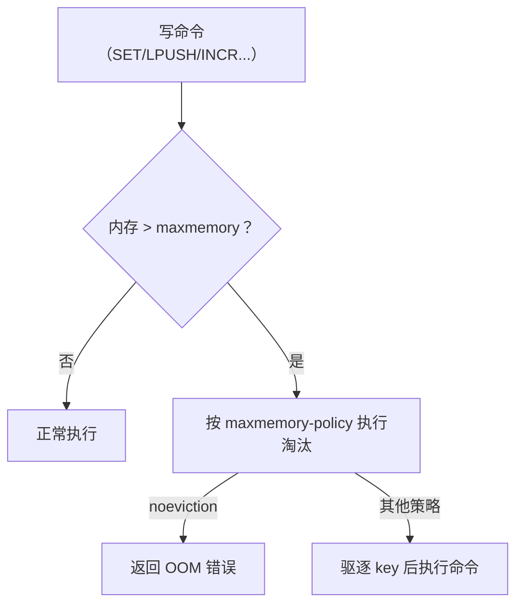
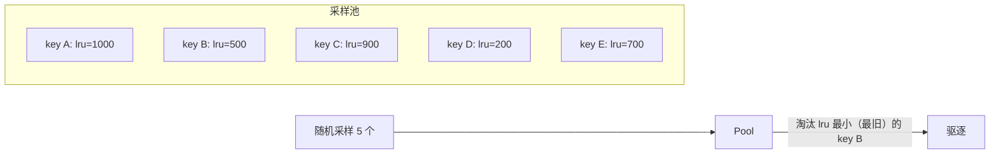
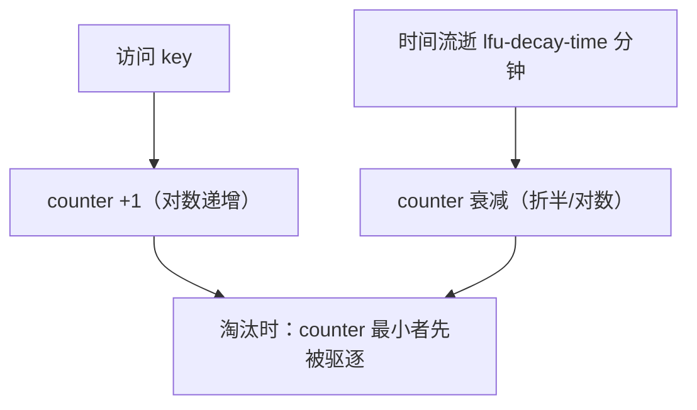
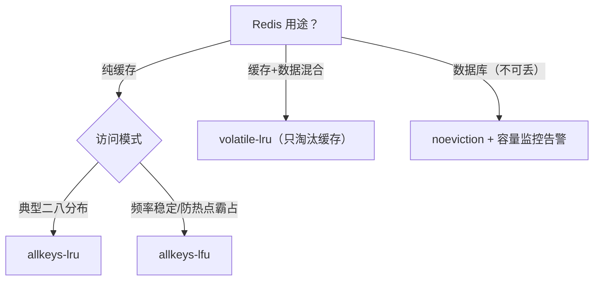

# 内存淘汰 LRU 与 LFU

## 0. 引言

Redis 作为缓存运行时，内存是硬约束。`maxmemory` 设置上限后，写入超限时的行为由 `maxmemory-policy` 决定——这就是**内存淘汰（eviction）**。本章解析 8 种策略、近似 LRU 的实现（为什么不用精确 LRU）、LFU 的频率统计（Redis 4.0+）与生产选型。

## 1. 触发与策略全景

### 1.1 触发时机



- 淘汰在**命令执行前**触发（`performEvictions`）；
- 只读命令不触发淘汰；
- 已设置的 `maxmemory 0` 表示不限制。

### 1.2 8 种策略

| 策略 | 作用域 | 行为 |
|------|--------|------|
| `noeviction`（默认） | - | 写命令直接报 OOM 错误，不淘汰 |
| `allkeys-lru` | 全部 key | 淘汰最久未使用 |
| `allkeys-lfu` | 全部 key | 淘汰最不常使用 |
| `allkeys-random` | 全部 key | 随机淘汰 |
| `volatile-lru` | 有 TTL 的 key | 淘汰最久未使用 |
| `volatile-lfu` | 有 TTL 的 key | 淘汰最不常使用 |
| `volatile-random` | 有 TTL 的 key | 随机淘汰 |
| `volatile-ttl` | 有 TTL 的 key | 淘汰剩余 TTL 最短 |

> 注意：Redis 8.6 起新增 `allkeys-lrm`/`volatile-lrm`（Least Recently Modified，按"最久未修改"淘汰；读取不会刷新其时钟，可防全量扫描污染缓存，8.6.2 实测可用）。8.0–8.4 及更早版本为上述 8 种。

**选型速记**：

- 缓存场景选 `allkeys-lru`（帕累托法则：少部分 key 承载大部分访问）；
- 访问频率分布稳定的选 `allkeys-lfu`（防"一次性热点"霸占 LRU）；
- volatile-* 系列适合"既有缓存又有持久数据混合"的实例（只淘汰可再生的缓存）；
- `noeviction` 适合把 Redis 当数据库用的场景（宁可报错不可丢数据）。

## 2. 近似 LRU：为什么不用精确 LRU

精确 LRU 需要维护双向链表记录全局访问序，代价：

- 每次访问都要移动节点（O(1) 但常数大，且破坏缓存友好性）；
- 内存额外开销（指针域 × 每个 key）。

Redis 采用**近似 LRU**：每个 key 保存一个 24 bit 的 **LRU clock**（`lru` 字段，记录"最近一次访问"的相对时间戳），淘汰时**随机采样** 5 个 key（`maxmemory-samples`，可用 `CONFIG SET` 调整），驱逐其中 LRU clock 最旧的。



误差分析：`maxmemory-samples` 越大，近似越接近精确 LRU，但淘汰计算成本越高。官方文档给出的测试曲线显示：默认采样 5 已能较好逼近精确 LRU，采样 10 更接近——具体差距因数据分布而异，建议结合自身访问模式压测。

## 3. LFU：热点频率统计（Redis 4.0+）

LRU 的缺陷：**冷门 key 被一次性访问后长期霸占**（如双十一大促的爆款商品，活动结束后不再访问，却因"最近用过"而存活）。LFU（Least Frequently Used）按**访问频率**淘汰。

### 3.1 数据结构：24 bit 复用

LFU 复用 `lru` 字段的 24 bit，拆分为两部分：

```text
lru 字段（24 bit）
├── 高 16 bit：LDT（Last Decrement Time，上次衰减时间，分钟级）
└── 低 8 bit：counter（访问频率计数，0-255）
```

### 3.2 计数与衰减

- **计数**：每次访问 counter +1（对数递增：越热增长越慢，防止溢出）；
- **衰减**：基于 `lfu-decay-time`（分钟）线性折算——每经过该时长未访问，counter 减 1（按"距上次衰减的分钟数 / lfu-decay-time"计算，减到 0 为止）——**保证"曾经热"≠"现在热"**；
- counter 的 8 bit 上限 255，足够区分热度梯度。



### 3.3 配置

```text
maxmemory-policy allkeys-lfu
lfu-log-factor 10       # counter 增长因子：越大热 key 增长越慢
lfu-decay-time 1        # 衰减周期（分钟）：越大衰减越慢
```

## 4. 淘汰的工程细节

### 4.1 淘汰量估算

触发淘汰时，Redis 会循环驱逐直到内存降回 `maxmemory` 之下（每轮采样驱逐一批），`INFO stats` 的 `evicted_keys` 累计被驱逐数量——**监控它**：突增说明容量规划不足。

### 4.2 淘汰与主从/Cluster

- 淘汰由**每个 master 独立决策**，replica 不淘汰（数据一致性由 master 的 DEL 传播保证）；
- Cluster 场景各分片独立 maxmemory，数据倾斜时某分片先触发淘汰；
- 淘汰是"尽力而为"的：**大 value 的 key 被驱逐后内存释放明显**，小 key 需多轮驱逐，瞬时可能超过 maxmemory。

### 4.3 常见坑

1. **把 maxmemory 当摆设**：`maxmemory-policy noeviction` 下缓存写满直接报错，业务雪崩；
2. **volatile-\* 但 key 都没 TTL**：退化为 noeviction 行为（无 key 可淘汰）；
3. **用错观测命令**：`OBJECT IDLETIME` 只在 LRU 策略下有意义、`OBJECT FREQ` 只在 LFU 策略下有意义，且二者都不会改动访问时钟（不同于 `TOUCH`）；
4. **淘汰风暴**：大量 key 同时触发淘汰 + 过期，主线程被拖慢，用 `maxmemory-samples` 与监控提前预警。

## 5. 选型决策



## 6. 小结

- 淘汰策略 8 选 1（8.6 起新增 lrm 系列后共 10 种），缓存场景 `allkeys-lru` 是默认最优解；
- 近似 LRU = 24 bit clock + 随机采样（`maxmemory-samples` 权衡精度与成本）；
- LFU 用"计数 + 衰减"建模真实热度，适合频率特征稳定的场景；
- **监控 `evicted_keys` 与 `maxmemory` 使用率**，容量规划永远优于被动淘汰。

下一章讲解懒惰删除（lazy free）：UNLINK 与 BIO 异步回收的内存治理利器。