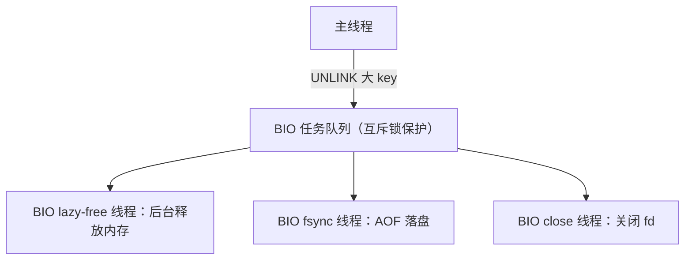
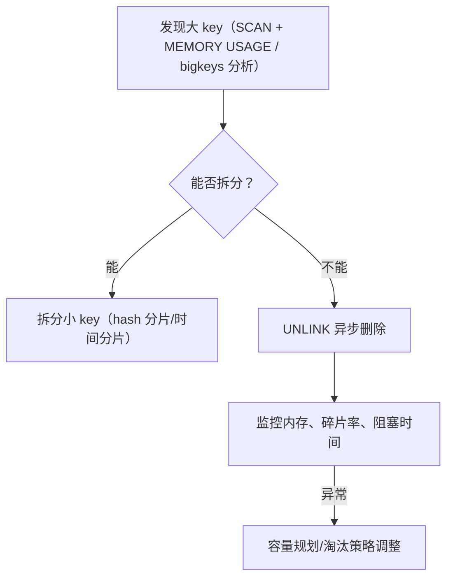

# 懒惰删除

## 0. 引言

删除一个 **1GB 的大 key**，`DEL` 命令会做什么？同步释放全部内存——在 Redis 单线程模型下，**删除耗时与 value 大小成正比**，大 key 的 DEL 会阻塞全库数百毫秒乃至数秒。**懒惰删除（lazy free，Redis 4.0+）**把内存回收移交给后台 BIO 线程，主线程只做"标记删除"，O(1) 完成。本章解析其机制、配置与架构代价。

## 1. 问题：同步删除的阻塞


为什么删除慢：

- 释放一个 value 需要遍历内部结构（hash 的每个 entry、list 的每个节点、zset 的每个成员）；
- 每个对象都要调用 free 并归还内存分配器，**分配器操作本身昂贵**；
- 单线程下，删除期间其他命令全部排队。

## 2. 解决方案：UNLINK 与 BIO

### 2.1 UNLINK 命令

```bash
> unlink big_key          # 立即返回，后台回收
(integer) 1
> del big_key             # 同步删除（对比）
(integer) 1
```

- `UNLINK` 将 key 从字典中摘除（O(1)），返回后主线程继续服务；
- 具体回收逻辑**入队 BIO 的 lazy-free 线程**执行；
- 若 value 很小（如 int 编码 string），UNLINK 与 DEL 等价（同步回收，无感知差异）。

### 2.2 BIO 线程池



- BIO（Background I/O）是 Redis 6.0 前就有的线程池，懒惰删除复用了该设施；
- 主线程只做**入队**（O(1)），后台线程逐步释放，主线程零阻塞；
- 队列压力过大时可能堆积（内存释放有延迟），但仍优于阻塞。

### 2.3 相关命令与配置

| 命令/配置 | 行为 |
|-----------|------|
| `UNLINK key` | 异步删除单个 key |
| `FLUSHDB ASYNC` / `FLUSHALL ASYNC` | 异步清库（清空 10GB 数据库不阻塞） |
| `lazyfree-lazy-eviction yes` | 内存淘汰改为异步释放 |
| `lazyfree-lazy-expire yes` | 过期键删除改为异步释放 |
| `lazyfree-lazy-server-del yes` | 服务端内部删除（如 rename 覆盖）异步化 |
| `lazyfree-lazy-user-del yes` | `DEL` 自动转为异步（客户端无需改代码） |

**推荐配置**（生产，完整默认值见 5.1 节）：`lazyfree-lazy-*` 四项全部设为 `yes`。

## 3. 懒惰删除的架构代价："无共享"的牺牲

### 3.1 为什么不能无脑异步

懒惰删除并非免费的午餐。Redis 之所以能在单线程下高效运行，根基是**所有数据结构无锁共享**。异步回收打破了这个前提：

- 主线程在后台线程释放内存的**同时**，可能仍在访问同一批对象（如命令执行中、AOF 重写子进程读取）；
- 因此 Redis 采用 **free 对象的引用计数 + 延迟释放**策略：只有当对象不再可能被任何执行上下文引用时，才真正释放；
- 实现上，大对象在**后台线程**释放，但小对象的元数据（如 dict entry）仍由主线程释放——**主线程仍承担部分 free 开销**。

### 3.2 "无共享"的代价清单

| 代价 | 说明 |
|------|------|
| 引用计数管理 | 每个对象多一次计数维护 |
| 内存延迟释放 | 后台释放慢于同步，瞬时内存峰值可能升高 |
| 复杂度 | 代码路径显著复杂化（这是 Redis 演进中少见的"大手术"） |
| 碎片化 | 异步释放与分配时机错位，内存碎片率可能上升 |

**权衡结论**：大 key 场景收益巨大（DEL 从秒级降到微秒级），代价在常规场景可忽略——**生产环境全量开启**。

## 4. 内存碎片与治理

### 4.1 碎片来源

- 频繁分配/释放不同大小的对象（jemalloc 内存池特性）；
- 小对象大量过期/淘汰后，页内空洞无法合并；
- 异步释放进一步拉大分配与释放的时序差。

### 4.2 诊断与治理

```bash
> info memory
used_memory: 1073741824
used_memory_rss: 2147483648        # RSS 是 used 的 2 倍 → 碎片率 2.0
mem_fragmentation_ratio: 2.0
```

| 手段 | 说明 |
|------|------|
| `activedefrag yes` | 4.0+ 内置活跃碎片整理（7.0 起在专用后台线程移动对象） |
| `MEMORY PURGE` | 手动触发 jemalloc 归还脏页（开销很小，可低峰期例行执行） |
| 重启 | 大版本/大对象场景下最有效的碎片清理 |
| 合理 TTL | 避免大量 key 同时过期引发碎片高峰 |

## 5. 大 key 治理完整方案



- 定期用 `redis-cli --bigkeys` 扫描大 key 清单；
- 删除大 key 一律 `UNLINK`；
- 大 key 的读写本身就有性能隐患（网络、阻塞），**拆分优于删除**。

### 5.1 UNLINK 与 DEL 的对比

| 维度 | DEL | UNLINK |
|------|-----|--------|
| 删除方式 | 同步回收内存 | 主线程只断链，BIO 线程回收 |
| 阻塞 | 大 key 时阻塞主线程 | 几乎不阻塞（O(1) 返回） |
| 返回值 | 1（删除成功） | 1（删除成功） |
| 适用 | 小 key、需要立即确认 | 大 key、批量清理 |

**相关配置**：

```text
# redis.conf
lazyfree-lazy-expire no          # 过期键删除异步化（默认 no）
lazyfree-lazy-eviction no        # 淘汰删除异步化（默认 no）
lazyfree-lazy-server-del no      # 内部删除命令异步化（默认 no）
lazyfree-lazy-user-del no        # 是否让 DEL 等价于 UNLINK（6.0+，默认 no）
```

> `lazyfree-lazy-user-del`（6.0 起）可让 `DEL` 直接走异步路径，兼顾客户端习惯与主线程安全；7.0 起另有 `lazyfree-lazy-user-flush` 让 `FLUSHALL`/`FLUSHDB` 默认异步。

## 6. 小结

- 懒惰删除把"删除大 key"从**同步阻塞**变为**异步后台回收**，`UNLINK`/`FLUSHALL ASYNC` 是生产标配；
- 配置 `lazyfree-lazy-*` 全开，让淘汰、过期、DEL 全面异步化；
- 代价是引用计数与碎片，监控 `mem_fragmentation_ratio` 并适时 `activedefrag`；
- 大 key 治理优先级：**拆分 > UNLINK > 监控**。

下一章进入集群化方案：先讲 Codis 代理架构，再深入官方 Redis Cluster。