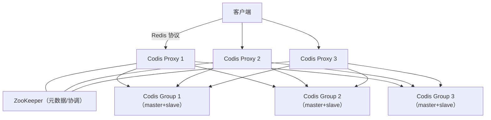

# Codis 代理集群

## 0. 引言

Redis 官方集群（Cluster）直到 3.0 才发布，且客户端需感知槽位。在 2014-2018 年间，**Codis**（豌豆荚开源）以"代理 + 分片"的架构成为国内 Redis 集群化的主流方案（美团、饿了么等大量使用）。理解 Codis，不仅能看懂存量系统的架构，更能深刻理解"代理型分片"与"去中心化分片"的设计取舍。

> 现状提示：Codis 已停止活跃维护（3.2 版本止步于 Redis 3.2 兼容），新系统**不推荐选用**；本文作为架构史与原理参考保留。

## 1. 总体架构



核心组件：

| 组件 | 职责 |
|------|------|
| **Proxy** | 无状态代理：接收客户端请求，按 slot 路由到后端 Group |
| **Codis Server** | 修改过的 Redis（支持 slot 迁移指令），本质是 Redis 3.2 分支 |
| **Codis Dashboard** | 管理端：slot 分配、迁移、拓扑管理 |
| **ZooKeeper/etcd** | 存储元数据（slot 映射、Proxy 列表），协调故障转移 |
| **Codis FE** | Web 管理界面 |

## 2. 分片模型：1024 个 slot

- Codis 将 key 空间划分为 **1024 个 slot**（`crc32(key) % 1024`）；
- slot 与 Group 的映射关系存储在 ZooKeeper，Proxy 启动时拉取并**本地缓存**；
- 客户端**无感知分片**：所有请求都走 Proxy，Proxy 转发——这是与 Redis Cluster 最大的差异（Cluster 要求客户端感知槽位并处理 MOVED 重定向）。


## 3. 数据迁移

### 3.1 迁移过程

Codis 支持**在线迁移 slot**（不影响服务）：

```text
1. 管理员指定 slot 从 Group A 迁到 Group B
2. 源 Group 将 slot 内的 key 逐个迁移（MIGRATE 命令）到目标
3. 迁移期间新读写：Proxy 先查"迁移中"标记 → 双写/转发
4. 迁移完成，更新 slot 映射并广播
```

### 3.2 迁移一致性

- 迁移期间 key 的写入采用**双写**（源 + 目标），保证迁移窗口不丢数据；
- 迁移是异步的，大 slot 迁移耗时长，期间抖动需监控；
- `SLOTSMGRTONE`/`SLOTSMGRTTAGSLOT` 是 Codis Server 的专用迁移指令（原生 Redis 没有）。

## 4. 高可用与故障转移

- 每个 Group 内部是标准主从（master + slave），由 **Sentinel 或 Codis Dashboard 监控**；
- master 故障：Promote slave 为新 master，Proxy 通过 ZooKeeper 感知拓扑变化自动切换；
- Proxy 本身无状态，可水平扩展（多 Proxy 负载均衡），Proxy 挂掉由 LB 摘除；
- **ZooKeeper 是单点依赖**：ZK 集群故障时新拓扑变更无法下发（存量路由仍可用）。

### 4.1 ZooKeeper 在 Codis 中的角色

Codis 重度依赖 ZooKeeper 的**临时节点（ephemeral node）与会话机制**：

| 用途 | 节点 | 说明 |
|------|------|------|
| Proxy 注册 | `/codis3/proxy/...` | 临时节点，Proxy 心跳断开会话失效自动摘除 |
| slot 映射 | `/codis3/slots` | 持久节点，Dashboard 更新后 watch 通知全体 Proxy |
| 故障转移 | `/codis3/fence` | 防脑裂栅栏：同一 master 只允许一个 slave 提升 |
| 配置下发 | `/codis3/config` | 客户端配置、迁移任务状态 |

**关键机制**：Proxy 对 slot 节点注册 **watch**，映射变更时 ZK 推送通知，Proxy 重建本地路由表——这是“迁移中客户端无感知”的底层支撑。

## 5. Codis vs Redis Cluster

| 维度 | Codis | Redis Cluster |
|------|-------|---------------|
| 架构 | 代理（Proxy） | 去中心化（P2P Gossip） |
| 分片 | 1024 slot（crc32） | 16384 slot（CRC16） |
| 客户端 | 无感知，连 Proxy 即可 | 需支持集群协议（MOVED/ASK 重定向） |
| 多 key 操作 | 同 slot 可用（hash tag `{}`） | 同 slot 可用（hash tag `{}`） |
| 组件 | Proxy/Server/Dashboard/ZK 一套 | 仅 Redis 节点 |
| 事务/Lua | 需同 slot（Proxy 校验） | 需同 slot（节点校验） |
| 运维 | 管理面丰富（FE 界面） | CLI 为主（redis-cli --cluster） |
| 维护状态 | 停止维护（Redis 3.2 兼容） | 官方持续演进至 7.x/8.x |
| 新特性 | 停留在 3.2 | 全量跟进（7.0 AOF 重构、Functions 等） |

### 5.1 为什么 Codis 被淘汰

1. **版本滞后**：基于 Redis 3.2 分支改造，无法享受 4.0+ 的 lazy free、5.0 Stream、6.0 多线程 IO、7.0 大重构；
2. **代理瓶颈**：所有流量过 Proxy，Proxy 成为性能与可用性单点（虽可扩展但增加链路）；
3. **生态**：官方 Cluster 成熟 + 客户端全面支持（JedisCluster、Lettuce），维护成本更低。

## 6. 存量系统迁移建议

- 若业务仍运行在 Codis 上：规划迁移到 Redis Cluster（或企业版/云托管版）；
- 迁移策略：**双写 + 校验 + 灰度切流**（数据量大多采用工具同步，如基于 RDB 的同步工具）；
- 迁移期间注意 hash tag 习惯的延续（Codis 与 Cluster 都支持 `{}`，但 slot 算法不同，**同一次迁移中多 key 命令的 key 必须保持同 tag**）。

**推荐迁移步骤**：

```text
1. 环境准备：搭建目标 Redis Cluster（7.x），压测容量与性能基线
2. 全量同步：基于 RDB 的工具同步存量数据，校验 key 数/抽样 value 一致性
3. 增量同步：持续同步增量写入（或双写），追赶偏移
4. 校验：对比 slot 分布、key 数量、大 key 清单
5. 灰度切流：按业务线/比例切换读流量，观察错误率与延迟
6. 收尾：全量切换写流量，下线 Codis，保留数据快照一段时间
```

> 迁移的成功率取决于**校验手段**是否完备：key 数、抽样值、TTL 分布、过期时间四维对比缺一不可。

## 7. 小结

- Codis = Proxy 无感知分片 + ZooKeeper 协调 + 在线迁移，曾是中国互联网 Redis 集群化的功臣；
- 与 Cluster 的本质差异：**路由决策在代理侧 vs 在客户端侧**；
- 新项目一律选 Redis Cluster 或云托管；存量 Codis 规划平滑迁移。

下一章深入官方 Redis Cluster：16384 slot、Gossip 协议与故障转移。