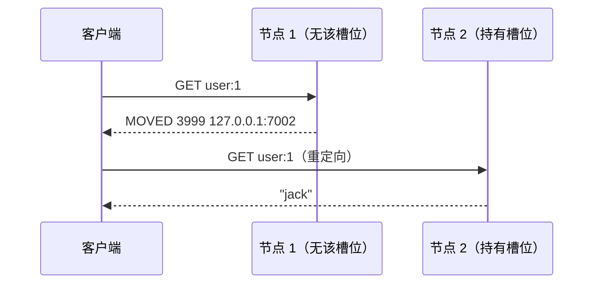
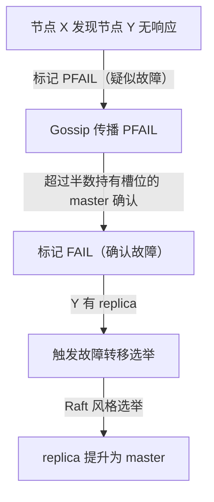
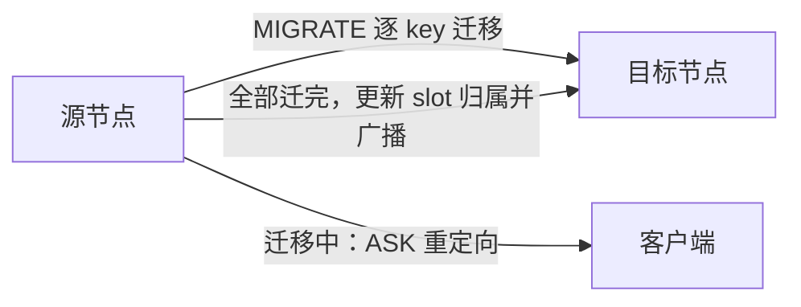

# Redis Cluster 集群

## 0. 引言

当数据量超过单机内存、写吞吐超过单实例上限时，需要**分片**。Redis Cluster（3.0+）是官方的去中心化集群方案：数据自动分片到 16384 个槽位，节点间通过 Gossip 通信，自带故障转移——不需要 Sentinel，不需要代理。本章解析其核心机制与 7.x 实践。

## 1. 数据分片：16384 个 hash slot

### 1.1 槽位计算

```text
slot = CRC16(key) % 16384
```

- 每个 key 通过 CRC16 哈希映射到 0-16383 的槽位；
- 槽位均匀分布在集群各 master 节点上；
- **添加/移除节点 = 迁移槽位**，无需停机。

```bash
> cluster slots
1) 1) (integer) 0
   2) (integer) 5460
   3) 1) "127.0.0.1"
      2) (integer) 7000
   ...
```

### 1.2 多 key 操作与 hash tag

Cluster 只允许**单槽位内的多 key 操作**（MGET/MSET/事务/Lua 脚本）。通过 **hash tag** 强制多个 key 落入同一槽位：

```text
key = user:{10001}:profile    → 只对 {10001} 计算槽位
key = user:{10001}:orders     → 与上面同槽位
```

```bash
> mset user:{10001}:name jack user:{10001}:age 20   # OK，同槽
> mset user:10001:name jack user:10002:name tom     # 报错 CROSSSLOT
(error) CROSSSLOT Keys in request don't hash to the same slot
```

**设计原则**：业务中需要原子操作的相关 key，必须用同一 hash tag；但 tag 过粗会导致数据倾斜（热点集中在少数槽位）。

### 1.3 客户端路由：MOVED 与 ASK



- **MOVED**：槽位已归属其他节点，客户端**缓存槽位映射**后直接访问；
- **ASK**：槽位迁移中的临时重定向（仅当前命令跟随），客户端不缓存 ASK 结果。

客户端要求：JedisCluster、Lettuce、redis-py-cluster 都已内置槽位缓存与重定向处理——这是与单机客户端最大的使用差异。

## 2. 节点通信：Gossip 协议

### 2.1 集群总线

- 每个节点额外开启 **16379（端口+10000）集群总线端口**，用于节点间 Gossip 通信（二进制协议）；
- 每节点每秒与随机节点交换状态（PING/PONG），传播：节点状态、槽位变更、故障信息；
- **去中心化**：无中心节点，任何节点都能响应集群状态查询。

### 2.2 故障检测



- PFAIL（疑似）→ FAIL（确认）：避免单节点误判；
- 故障转移与 Sentinel 类似：选举 + 偏移量最大的 replica 优先；
- 集群**半数以上 master 不可达时集群不可用**（可用性受多数派约束）。

## 3. 槽位迁移（reshard）

### 3.1 在线迁移

```bash
# redis-cli 交互式迁移槽位
redis-cli --cluster reshard 127.0.0.1:7000
# 指定迁移数量、源节点、目标节点
redis-cli --cluster reshard 127.0.0.1:7000 --from <node-id> --to <node-id> --slots 100 --yes
```



1. 源节点逐 key `MIGRATE` 到目标节点；
2. 迁移中的 key 读写通过 ASK 机制保证正确性；
3. 迁移完成广播 `CLUSTER SETSLOT ... NODE`。

### 3.2 迁移注意事项

- 大 key 迁移耗时（MIGRATE 是同步单 key 操作），迁移前先拆分大 key；
- 迁移期间可用 `CLUSTER INFO` 与 `redis-cli --cluster check <host:port>` 观察槽位分布与进度；
- 数据倾斜（hot slot）先定位（`CLUSTER KEYSLOT <key>` 计算槽位归属），再规划迁移。

## 4. 集群高可用

### 4.1 主从模型

- 每个 master 挂 1+ 个 replica，槽位数据在 replica 有完整副本；
- master 故障 → replica 自动提升（选举，约秒级）；
- **槽位覆盖完整性**：部分槽位无 master 时集群拒绝服务（`cluster_state:fail`）。

### 4.2 与 Sentinel 的对比加深

| 维度 | Sentinel | Cluster |
|------|----------|---------|
| 分片 | 无 | 16384 槽 |
| 选举 | Sentinel 集群 | 节点自选举（Raft） |
| 扩展 | 只读扩展 | 读写扩容 |
| 适用规模 | 单机数据量 < 内存 | 数据/吞吐超单机 |

## 5. 7.x 集群新特性与实践

| 特性 | 版本 | 说明 |
|------|------|------|
| `CLUSTER SHARDS` | 7.0 | 更高效的分片拓扑查询（替代 SLOTS 的部分场景） |
| 集群支持 Functions | 7.0 | FCALL 与 EVAL 一样要求所有 key 同槽；函数库不会跨节点自动同步，需在各节点分别加载 |
| 集群 Pub/Sub | 7.0 | `SSUBSCRIBE`/`SPUBLISH` 切片频道：频道映射到槽位，消息只在负责该槽位的分片内转发，避免全网洪泛 |

**生产实践清单**：

```text
# 节点配置
cluster-enabled yes
cluster-config-file nodes.conf
cluster-node-timeout 15000        # 节点超时（影响故障检测速度）
cluster-require-full-coverage no  # 部分槽位不可用时允许继续服务（需业务兜底）
```

1. **至少 3 master + 每 master 1 replica**（共 6 节点起步）；
2. `cluster-require-full-coverage`：默认 yes（严格模式），部分 master 故障时集群拒绝所有读写；业务可降级时设为 no；
3. 客户端连接串配置**所有节点地址**（任一可达即可发现全拓扑）；
4. 监控 `cluster_state`、`cluster_slots_assigned`、`cluster_known_nodes`。

## 6. 常见坑

1. **hash tag 滥用**：所有 key 用同一 tag → 单槽热点，集群退化为单机；
2. **跨槽事务/Lua**：脚本内访问多槽 key 直接报 CROSSSLOT，设计脚本时按 tag 约束；
3. **迁移期间大 key**：MIGRATE 阻塞源节点，先拆 key 再迁移；
4. **客户端未处理 ASK**：老客户端可能在迁移窗口报错，升级客户端版本；
5. **扩容后数据倾斜**：新节点槽位迁移不均衡，用 rebalance 工具修正。

## 7. 小结

- Cluster = **16384 槽分片 + Gossip 去中心化 + 自动故障转移**；
- 客户端必须支持集群协议（MOVED/ASK），多 key 操作依赖 hash tag；
- 迁移在线无停机，但需先治理大 key 与热点；
- 规模选型：单机 → Sentinel → Cluster → 云托管（企业级管控）。

下一章讲解 Stream：Redis 最完整的内置消息队列。