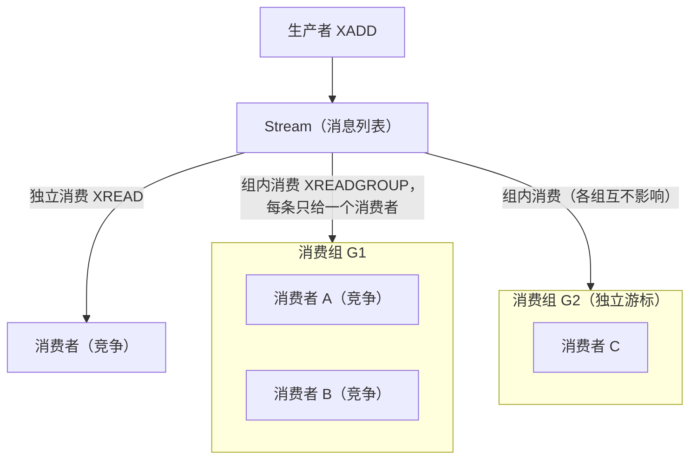
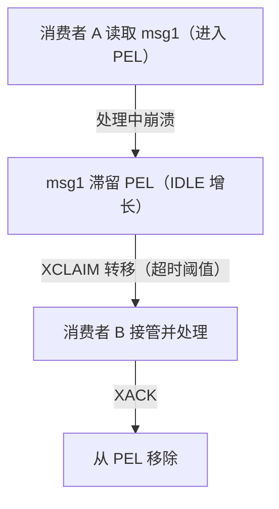

# Stream 消息队列

## 0. 引言

Stream 是 Redis 5.0 引入的**可靠消息队列**数据结构，官方承认借鉴了 Kafka 的设计。它弥补了 list 队列（无 ACK）与 PubSub（不持久）的缺陷，是 Redis 中唯一自带**消费组、消息确认（ACK）、待处理列表（PEL）**的结构。本章从数据结构、消费模型到可靠性机制完整解析。

## 1. 数据结构与消息模型

### 1.1 一条消息长什么样

```bash
> xadd orders * user "10001" amount "99.5"
"1760000000000-0"        # 返回消息 ID：毫秒时间戳-序列号
```

- 消息 ID = `毫秒时间戳-序列号`，单调递增（序列号解决同一毫秒多条）；
- 时钟回拨时，Redis 自动沿用上一条 ID（保证单调性）；
- 消息内容是 field-value 对（类似 hash）；
- 底层存储：**rax（基数树）+ listpack**（见内部实现系列），`XADD` O(logN)。

### 1.2 增删查改

```bash
> xadd orders * user 10001 amount 99.5       # 追加
"1760000000123-0"
> xlen orders                               # 长度
(integer) 1
> xrange orders - +                         # 按 ID 范围读取
1) 1) "1760000000123-0"
   2) 1) "user"
      2) "10001"
      3) "amount"
      4) "99.5"
> xdel orders 1760000000123-0               # 按 ID 删除（标记删除）
(integer) 1
> xtrim orders maxlen 1000                  # 裁剪，控制长度
(integer) 0
```

## 2. 消费组模型

### 2.1 核心概念



| 概念 | 说明 |
|------|------|
| Stream | 消息列表（持久化，可裁剪） |
| Consumer Group | 消费组：独立游标 `last_delivered_id`，组间互不影响 |
| Consumer | 组内消费者：竞争关系，一条消息只被组内一人消费 |
| PEL | Pending Entries List：已读取未 ACK 的消息，保证 at-least-once |
| last_delivered_id | 组游标，标记已消费位置 |

### 2.2 创建与消费

```bash
> xgroup create orders group1 0          # 创建消费组（0 = 从最早消息开始）
OK
# 消费者读取（> 表示只读新消息）
> xreadgroup group group1 consumer-1 count 1 streams orders >
1) 1) "orders"
   2) 1) 1) "1760000000123-0"
         2) 1) "user"
            2) "10001"
```

- 消息进入消费组后，ID 被记入该消费者的 **PEL**；
- `XACK` 确认后从 PEL 移除，"已成功处理"；
- 组内多个消费者：Redis 按游标顺序分配，**不保证均衡**（谁先读谁得）。

### 2.3 检查与确认

```bash
> xpending orders group1              # 查看待确认消息
1) (integer) 1                        # PEL 数量
2) "1760000000123-0"                  # 最早待确认 ID
3) "1760000000123-0"                  # 最晚待确认 ID
4) 1) 1) "consumer-1"
      2) "1"                          # 该消费者待确认数

> xack orders group1 1760000000123-0  # 确认处理完成
(integer) 1
```

## 3. 可靠性机制：PEL 与 XCLAIM

### 3.1 崩溃恢复

消费者处理消息后**未 ACK 就崩溃**，消息留在 PEL。其他消费者通过 `XCLAIM` 转移消息所有权：

```bash
# 将 PEL 中空闲超过 1 分钟的消息转移给自己
> xclaim orders group1 consumer-2 60000 1760000000123-0
```



### 3.2 消费语义

| 语义 | 说明 |
|------|------|
| at-least-once | PEL 保证消息至少被消费一次（可能重复） |
| 幂等 | 业务侧必须幂等（唯一业务 ID），因为重复不可避免 |
| 死信 | 可监控 PEL 中长期滞留的消息（`XPENDING` 按消费者统计），超阈值人工介入 |

### 3.3 与 Kafka 对比

| 维度 | Redis Stream | Kafka |
|------|-------------|-------|
| 存储 | 内存（可持久化） | 磁盘日志 |
| 吞吐 | 单实例受限 | 分区并行，极高 |
| 积压 | 受内存限制（maxlen 裁剪） | 磁盘可长期积压 |
| 消费组 | 有（游标+PEL） | 有（offset+提交） |
| 重放 | 支持（XREAD 任意 ID） | 支持 |
| 适用 | 轻量、中低吞吐、复用 Redis 设施 | 大数据量、跨团队、长期存储 |

## 4. 7.x 实践要点

### 4.1 场景选型

| 场景 | 推荐 |
|------|------|
| 轻量任务队列（发短信/邮件通知） | list 或 Stream |
| 需要 ACK/重试/消费组的可靠消息 | **Stream** |
| 高吞吐海量消息 | Kafka/RocketMQ |
| 实时广播（在线状态） | PubSub（不持久） |

### 4.2 生产配置与坑

```text
# Stream 没有全局"最大长度"配置项，限长在写入/裁剪时按 key 指定：
# XADD orders MAXLEN 1000000 * user 10001   （写入时限长）
# XTRIM orders MAXLEN 1000000               （或定期裁剪）
```

1. **内存管控**：Stream 每条消息都驻留内存，必须 `MAXLEN`/`XTRIM` 限制，或用 `XADD ... MAXLEN ~ 1000`（近似裁剪，性能更好）；
2. **组创建时指定起始位置**：`XGROUP CREATE key group 0`（历史）或 `$`（只新消息），误用 `$` 会漏掉历史消息；
3. **消费者均衡**：组内分配不均时，用 `XCLAIM`/`XAUTOCLAIM`（6.2+）自动转移滞留消息；
4. **监控**：`XINFO GROUPS` 查看各组 pending 数，`XINFO STREAM` 查看长度与首尾 ID；
5. **集群**：Stream 是单 key，Cluster 下由槽位决定归属，跨槽消费组不支持。

### 4.3 XAUTOCLAIM（6.2+）

```bash
> xautoclaim orders group1 consumer-2 60000 0
1) "0-0"                    # 下一个游标
2) 1) 1) "1760000000123-0"  # 转移的消息
3) (empty array)            # 7.0 起新增：已从 Stream 删除的消息 ID
```

自动扫描并转移超时消息，替代手动 `XCLAIM` 循环，是处理滞留消息的首选。

## 5. 小结

- Stream = **持久化消息列表 + 消费组 + PEL 可靠性**，是 Redis 内置 MQ 的完全体；
- 可靠性核心：PEL 记录未确认消息，`XACK` 确认，`XCLAIM`/`XAUTOCLAIM` 转移；
- 威力上限在内存：必须限长；吞吐海量场景换 Kafka；
- 消费语义是 at-least-once，业务幂等是底线。

下一章进入安全专题：ACL、TLS 与 Redis 加固实践。