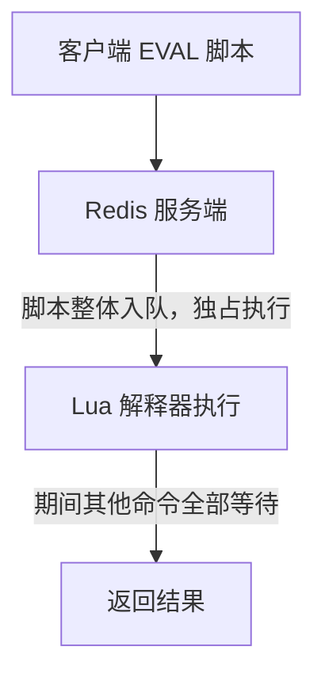

# Lua 脚本与 Redis Functions

## 0. 引言

多条命令的"原子 + 条件逻辑"组合（如"取锁-校验-删除"）是 Redis 编程的高频需求。**Lua 脚本**让一段逻辑在 Redis 服务端**原子执行**；**Redis Functions（7.0+）**则是脚本的工程化升级：库化管理、版本化、复用与权限控制。本章从 EVAL 原理到 Functions 实践完整展开。

## 1. Lua 脚本：为什么是原子的

### 1.1 执行模型



- Redis 使用内置 Lua 5.1 解释器，**脚本执行期间 Redis 不处理任何其他命令**——天然原子；
- 脚本内通过 `redis.call()` / `redis.pcall()` 调用 Redis 命令（pcall 捕获错误不中断脚本）；
- 脚本死循环会阻塞实例：脚本运行超过 `lua-time-limit`（默认 5s）后，Redis 对其他命令统一回复 BUSY 错误，仅接受 `SCRIPT KILL`（脚本尚未执行过写命令时）或 `SHUTDOWN NOSAVE`。

### 1.2 基本用法

```bash
> eval "return redis.call('set', KEYS[1], ARGV[1])" 1 mykey hello
OK
> eval "return {KEYS[1], ARGV[1]}" 1 k v
1) "k"
2) "v"
```

**规则**：

- `KEYS[i]` 传 key（**必须走 KEYS 传参**，不能拼进脚本字符串——集群路由依赖它）；
- `ARGV[i]` 传参数；
- 脚本内访问的 key 必须全部由 KEYS 传入（集群要求同槽）。

### 1.3 经典组合：分布式锁完整实现

```lua
-- 加锁：SET NX PX 的脚本等价（演示条件逻辑）
if redis.call("set", KEYS[1], ARGV[1], "NX", "PX", ARGV[2]) then
    return 1
end
return 0
```

```lua
-- 释放：值与 token 匹配才删除（安全性核心）
if redis.call("get", KEYS[1]) == ARGV[1] then
    return redis.call("del", KEYS[1])
else
    return 0
end
```

```lua
-- 限流：固定窗口原子版
local current = redis.call("incr", KEYS[1])
if current == 1 then
    redis.call("expire", KEYS[1], ARGV[1])
end
if current > tonumber(ARGV[2]) then
    return 0
end
return 1
```

## 2. EVALSHA 与脚本缓存

### 2.1 为什么需要 EVALSHA

每次 `EVAL` 都要传输脚本全文（大脚本浪费带宽）。Redis 对脚本内容做 **SHA1 摘要**并缓存（`SCRIPT LOAD` 显式缓存），之后用 `EVALSHA <sha1>` 执行：

```bash
> script load "return redis.call('get', KEYS[1])"
"e0e1f9fabfc9d4800c877a703b823ac0578ffabe"
> evalsha e0e1f9fabfc9d4800c877a703b823ac0578ffabe 1 mykey
"hello"
```

### 2.2 缓存失效的坑

- `SCRIPT FLUSH`、**重启**会清空脚本缓存——正确姿势是先试 `EVALSHA`，收到 NOSCRIPT 错误后回退 `EVAL`（EVAL 会顺带把脚本缓存住）；
- 官方建议：**7.0 后改用 Redis Functions**，彻底绕开"脚本缓存管理"问题。

## 3. Redis Functions（7.0+）：脚本的库管理

### 3.1 为什么需要 Functions

| 问题 | EVAL 脚本 | Redis Functions |
|------|-----------|----------------|
| 管理与复用 | 脚本散落客户端 | **库（Library）集中管理**，服务端持有 |
| 版本化 | 无 | 库可覆盖（REPLACE），版本演进清晰 |
| 权限 | 无（脚本可执行任意命令） | **按用户 ACL 校验库中命令** |
| 缓存 | 需管理 SHA1 | 免管理（FCALL 按库名+函数名调用） |
| 调试 | 无 | 库内函数可独立调试 |

### 3.2 定义与加载

```lua
-- mylib.lua
#!lua name=mylib
redis.register_function("incr_with_cap", function(keys, args)
    local current = redis.call("incr", keys[1])
    local cap = tonumber(args[1])
    if current > cap then
        redis.call("decr", keys[1])
        return redis.error_reply("over capacity")
    end
    return current
end)
```

```bash
# 加载库（REPLACE 覆盖同名库）
$ redis-cli -x FUNCTION LOAD REPLACE < mylib.lua
mylib

# 调用
> fcall incr_with_cap 1 counter 5
(integer) 1
> fcall incr_with_cap 1 counter 5
(integer) 2
# ……第 6 次调用：incr 后为 6 > 5 → 回退计数并报错
> fcall incr_with_cap 1 counter 5
(error) ERR over capacity
```

### 3.3 库管理命令

```bash
> function list                      # 列出已加载库
> function dump                      # 导出库（备份/迁移）
> function restore <payload>         # 恢复库
> function stats                     # 运行统计
> function flush                     # 清空库（慎用）
```

**7.x 建议**：新脚本一律用 Functions 编写与加载；存量 EVAL 脚本按页迁移（Functions 与 EVAL 可共存）。

## 4. 最佳实践与坑

### 4.1 工程规范

1. **脚本尽量短小**：长脚本阻塞风险高，拆分为多个小函数；
2. **所有 key 走 KEYS 传参**：集群兼容 + 可读性；
3. **错误处理用 `redis.error_reply()`**：返回语义化错误而非让脚本崩溃；
4. **只读脚本用 `EVAL_RO`/`FCALL_RO`**（7.0+）：只读副本上可执行，提升扩展性；
5. **监控**：`INFO commandstats` 的 `cmdstat_eval` 查看脚本耗时，`SLOWLOG` 抓慢脚本。

### 4.2 常见坑

| 坑 | 说明 |
|----|------|
| 脚本内 `random` 等非确定性命令 | 7.0 前按 whole-script 复制时被禁止；7.0 起默认按效果复制（effect replication）已放开，但仍建议少用（主从重放与排障更复杂） |
| 脚本内 `KEYS[1]` 拼字符串访问其他 key | 集群下 CROSSSLOT，且不经过 key 声明 |
| 大循环 | 阻塞全库，先小数据量压测 |
| 依赖外部状态 | 脚本应纯函数（入参 + Redis 数据），不依赖全局变量 |

### 4.3 Lua 与事务选型

| 需求 | 选型 |
|------|------|
| 无条件批量原子执行 | MULTI/EXEC |
| 条件逻辑 + 原子 | **Lua/Functions** |
| 读-改-写并发控制 | WATCH 重试 或 Lua |
| 服务端可复用逻辑 | **Functions（7.0 首选）** |

## 5. 小结

- Lua 脚本在服务端原子执行，是"多命令组合"的标准答案；
- EVALSHA 省带宽但需管理缓存，**Functions 是 7.0 起的官方演进方向**；
- 脚本规范：KEYS 传参、短小、只读用 RO 变体、监控慢脚本；
- 分布式锁、限流、库存扣减等原子场景，脚本/Functions 是最终解法。

下一章讲解命令行工具：redis-cli 的高级用法与调试技巧。