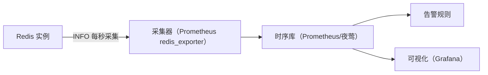

# Info 指令与监控

## 0. 引言

`INFO` 是 Redis 的"体检报告"：几十个维度的运行时指标，覆盖内存、连接、持久化、复制、命令统计。本文逐节解读 INFO 输出（7.x 视角），并给出从指标到监控告警的完整落地方案。

## 1. INFO 基本用法

```bash
> info                      # 全部指标
> info memory               # 指定分节
> info memory,replication   # 多分节
> info everything           # 全部（含模块）
> info server               # 服务器基本信息
```

通过 `redis-cli info memory` 即可在脚本/监控系统中直接消费。

## 2. 核心分节解读

### 2.1 server：版本与运行信息

```text
# Server
redis_version:7.4.0
redis_mode:standalone          # standalone / sentinel / cluster
os:Linux 5.15.0
process_id:12345
uptime_in_seconds:86400
hz:10                          # 时间事件频率
```

### 2.2 clients：连接状态

```text
# Clients
connected_clients:50
blocked_clients:0             # 阻塞客户端数（BRPOP 等）
tracking_clients:0            # 客户端缓存（RESP3）数
maxclients:10000
```

**关注**：`connected_clients` 突增（连接风暴）、`blocked_clients` 过高（队列阻塞）。

### 2.3 memory：内存核心

```text
# Memory
used_memory:1073741824            # 逻辑内存（字节）
used_memory_human:1.00G
used_memory_rss:2147483648        # 实际占用（RSS）
used_memory_peak:2147483648       # 历史峰值
mem_fragmentation_ratio:2.0       # RSS/used，1.0-1.5 健康
used_memory_lua:30720             # Lua 引擎内存
maxmemory:2147483648              # 配置上限
maxmemory_policy:allkeys-lru
```

**关键判断**：

| 指标 | 健康范围 | 异常含义 |
|------|---------|---------|
| `mem_fragmentation_ratio` | 1.0-1.5 | >1.5 碎片高；<1.0 有交换（危险） |
| `used_memory` vs `maxmemory` | < 80% | 接近上限触发淘汰 |
| `used_memory_peak` | 接近 used | 峰值冲击的余量 |

### 2.4 persistence：持久化状态

```text
# Persistence
loading:0
rdb_bgsave_in_progress:0
rdb_last_save_time:1760000000
aof_enabled:1
aof_rewrite_in_progress:0
aof_last_bgrewrite_status:ok
aof_current_size:1048576
aof_base_size:1048576
aof_pending_rewrite:0
```

**关注**：`aof_last_write_status`（AOF 写入失败会降级）、`rdb_last_bgsave_status`、rewrite 是否频繁（磁盘压力信号）。

### 2.5 stats：命令与事件计数

```text
# Stats
total_connections_received:1000
total_commands_processed:12000000
instantaneous_ops_per_sec:8123        # 实时 QPS
rejected_connections:0
expired_keys:12345
evicted_keys:678                      # 被淘汰 key 数（突增=容量告急）
keyspace_hits:11000000
keyspace_misses:1000000
latest_fork_usec:8123                 # 最近 fork 耗时
```

**黄金指标**：`instantaneous_ops_per_sec`（QPS 曲线）、`hit_rate = hits/(hits+misses)`（缓存命中率）、`evicted_keys`（容量）、`latest_fork_usec`（fork 阻塞）。

### 2.6 replication：复制状态

```text
# Replication
role:master
connected_slaves:2
master_replid:xxxx...
master_repl_offset:123456
slave0:ip=10.0.0.2,port=6380,state=online,offset=123450,lag=6
```

```text
# Replica 视角
role:slave
master_host:10.0.0.1
master_link_status:up          # up/down 黄金指标
master_last_io_seconds_ago:6   # 距上次收到主库数据（过大=链路异常）
slave_repl_offset:123450
# 复制延迟无现成字段，用 master_repl_offset - slave_repl_offset 计算
```

**关注**：`master_link_status`、offset 差值（延迟突增=瓶颈）、主库侧 `slave0..n` 的 offset 差异。

### 2.7 cpu：CPU 与阻塞

```text
# CPU
used_cpu_sys:120.5
used_cpu_user:890.2
# Commandstats（命令级耗时）
cmdstat_get:calls=1000000,usec=5000000,usec_per_call=5.00
cmdstat_eval:calls=100,usec=500000,usec_per_call=5000.00
```

**命令级统计**：`cmdstat_*` 的 `usec_per_call` 找出慢命令（如 eval 5000us → Lua 脚本嫌疑）。

## 3. 监控体系落地

### 3.1 指标采集



```yaml
# redis_exporter 示例指标
redis_memory_used_bytes
redis_mem_fragmentation_ratio
redis_connected_clients
redis_evicted_keys_total
redis_slave_master_link_status
redis_instantaneous_ops_per_sec
```

### 3.2 告警规则（建议阈值）

| 指标 | 阈值 | 级别 |
|------|------|------|
| `mem_fragmentation_ratio` | > 1.8 持续 10 分钟 | Warning |
| `used_memory / maxmemory` | > 85% | Warning |
| `used_memory / maxmemory` | > 95% | Critical |
| `evicted_keys` 速率 | > 100/s 持续 5 分钟 | Critical |
| `master_link_status` | down | Critical |
| 复制延迟（offset 差值） | > 10s | Warning |
| `instantaneous_ops_per_sec` 突变 | ±50% vs 基线 | Warning |
| `latest_fork_usec` | > 1s | Warning |
| `aof_last_write_status` | err | Critical |

### 3.3 常用配套命令

```bash
> info commandstats        # 命令分布
> latency doctor           # 7.x 延迟诊断建议
> latency latest           # 最近延迟事件
> config get slowlog-*     # 慢日志配置核查
> client list              # 客户端连接明细（找异常连接）
> client kill type normal # 按 TYPE/ID/ADDR 精确剔除（无 all 通配，慎用）
```

## 4. 典型故障的指标画像

| 故障 | 指标特征 |
|------|---------|
| 内存泄漏/大 key | `used_memory` 持续爬升 + `mem_fragmentation_ratio` 升高 |
| 缓存雪崩 | `keyspace_hits` 骤降 + `commands` 中 get 大量 miss + 下游 DB 压力 |
| 连接风暴 | `connected_clients` 陡增 + `rejected_connections` 出现 |
| 复制中断 | `master_link_status:down` + offset 差值飙升 |
| 阻塞 | `blocked_clients` 高 + `latest_fork_usec` 大 + 命令延迟突增 |
| 淘汰风暴 | `evicted_keys` 高速增长 + `used_memory` 顶格 |

## 5. 小结

- INFO 是 Redis 可观测性的数据源，7.x 分节清晰、指标完备；
- 黄金指标：**内存（used/peak/fragmentation）、QPS、命中率、淘汰数、复制状态、fork 耗时**；
- 落地：redis_exporter + Prometheus + Grafana + 阈值告警，形成"采集→存储→可视化→告警"闭环；
- 排障时 `INFO` 与 `SLOWLOG`/`LATENCY`/`CLIENT LIST` 组合使用，快速定位根因。

至此，Redis 核心原理、高可用、内部实现与运维体系已全部覆盖。下一章进入内部实现系列，从源码级解析 SDS 与字符串编码。