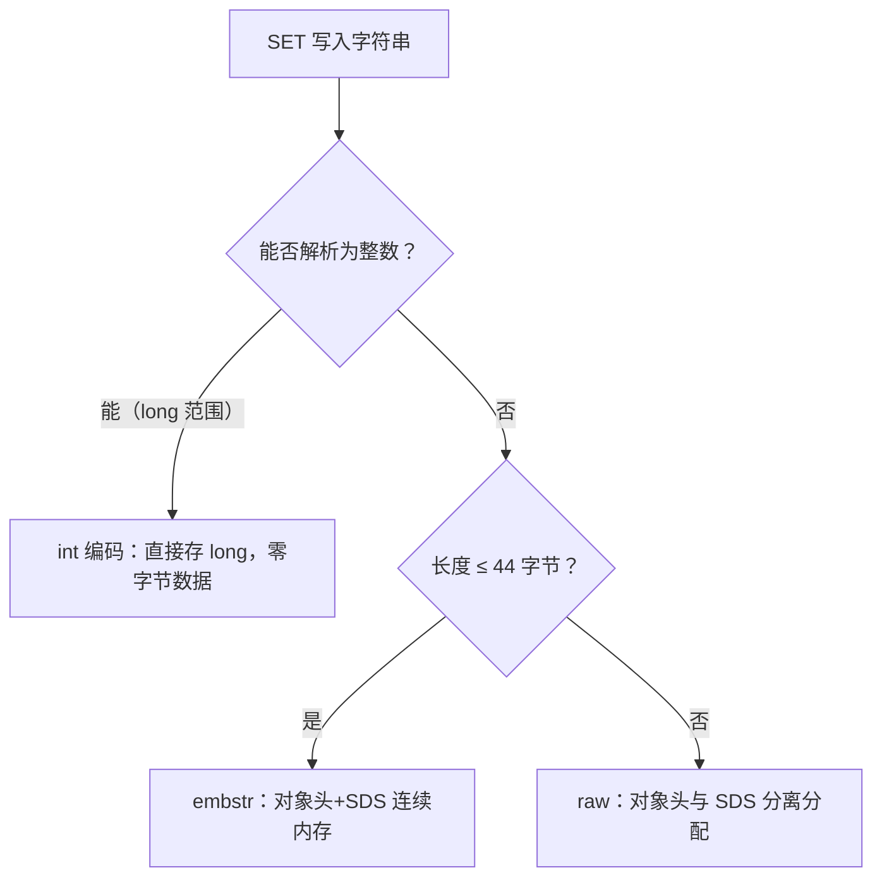
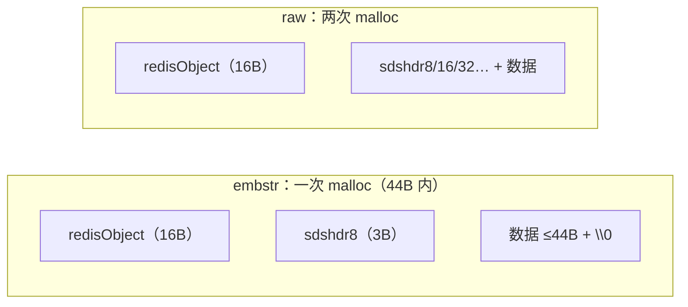

# 内部实现：SDS 与字符串编码

## 0. 引言

Redis 的 string 是最重要的类型，其内部实现（SDS）几乎所有源码分析文章的起点。本文从源码视角回答三个问题：**为什么不用 C 字符串？SDS 的 5 种结构如何省内存？embstr/raw/int 编码的边界与转换规则？**

## 1. 为什么不用 C 字符串

C 字符串（`char*` + `\0` 结尾）存在三个致命问题：

| 问题 | 后果 |
|------|------|
| 获取长度 O(N) | `strlen` 每次遍历 |
| 追加需手动扩容 | 缓冲区溢出风险 |
| `\0` 即结尾 | 无法存储二进制数据 |

Redis 的 **SDS（Simple Dynamic String）** 用"头部元数据 + 变长缓冲区"解决全部问题：

```c
// 早期版本（Redis 3.2 前）的 sdshdr 结构
struct sdshdr {
    long len;      /* buf 已用长度 */
    long free;     /* buf 剩余空间 */
    char buf[];    /* 数据缓冲区（柔性数组） */
};
```

- `len` 记录长度 → O(1) 获取长度、二进制安全；
- 预分配策略（扩容加倍 / 超 1MB 每次 +1MB）→ 减少 realloc 次数；
- `buf` 末尾仍保留 `\0`（兼容 C 函数，但不依赖它判断结尾）。

## 2. 5 种 sdshdr：为内存优化到极致

Redis 3.2 起，SDS 按字符串长度分 5 档，**用最小的头部存储元数据**：

```c
struct __attribute__((__packed__)) sdshdr5 {
    unsigned char flags; /* 低 3 位存类型，高 5 位存长度（≤31） */
    char buf[];
};
struct __attribute__((__packed__)) sdshdr8 {
    uint8_t len;   /* 1 字节 */
    uint8_t alloc; /* 1 字节 */
    unsigned char flags;
    char buf[];
};
struct __attribute__((__packed__)) sdshdr16 {
    uint16_t len; uint16_t alloc; unsigned char flags; char buf[];
};
struct __attribute__((__packed__)) sdshdr32 {
    uint32_t len; uint32_t alloc; unsigned char flags; char buf[];
};
struct __attribute__((__packed__)) sdshdr64 {
    uint64_t len; uint64_t alloc; unsigned char flags; char buf[];
};
```

| 结构 | len 位数 | 最大长度 | 头部开销 |
|------|---------|---------|---------|
| sdshdr5 | 5 bit | 31 字节 | 1 字节 |
| sdshdr8 | 8 bit | 255 | 3 字节 |
| sdshdr16 | 16 bit | 64KB | 5 字节 |
| sdshdr32 | 32 bit | 4GB | 9 字节 |
| sdshdr64 | 64 bit | 极大 | 17 字节 |

**关键点**：

- `__packed__`：禁止编译器对齐填充，头部紧凑排列（否则 1 字节字段会 padding 到 8 字节）；
- 字符串长度增长时**升级结构**（如 sdshdr8 → sdshdr16），不会降级；
- 亿级小字符串场景，每个省 2-6 字节，总量可观——这就是"细节里的性能"。

## 3. 三种编码：int / embstr / raw

### 3.1 编码判定规则



```bash
> set a 12345
> object encoding a
"int"
> set b "hello world"          # 11 字节 ≤ 44
> object encoding b
"embstr"
> set c xxxxxxxxxx        # （此处省略：100 个 'x' 的长字符串）
> object encoding c
"raw"
```

### 3.2 embstr vs raw：为什么是 44 字节

- **embstr**：`redisObject`（16 字节）+ `sdshdr8`（3 字节）+ 数据在**同一块连续内存**分配，一次 malloc，缓存友好；
- **raw**：对象头与 SDS 分开两次分配；
- 44 的来历：Redis 对象头 16B + sdshdr8 头部 3B + `\0` 1B = 20B；jemalloc 常用 64B 分配单元 → 64 - 20 = **44B 数据**刚好不越界。

### 3.3 转换规则

| 操作 | 转换 | 说明 |
|------|------|------|
| `APPEND` | embstr → raw | embstr 不可变，追加即升级 |
| `SETRANGE` | embstr → raw | 同上 |
| `INCR` 非整数 | raw 保持 | 报错 |
| 重写（RDB/AOF 重写） | 不改变编码 | 按当前值重新判定 |

**注意**：`int` 编码的 string 执行 `APPEND` 后转为 raw；`INCR` 溢出时报错不转换。

## 4. 内存布局可视化



## 5. 源码关键函数

```c
/* 创建 SDS：按长度选择结构类型 */
sds sdsnewlen(const void *init, size_t initlen) {
    /* 根据 initlen 选择 sdshdr5/8/16/32/64 */
    if (initlen <= 0x1f)       /* 31 */
        sh = s_malloc(sizeof(struct sdshdr5) + initlen + 1);
    else if (initlen <= 0xff)  /* 255 */
        sh = s_malloc(sizeof(struct sdshdr8) + initlen + 1);
    /* ... */
    sh->len = initlen;
    sh->alloc = initlen;
    if (initlen && init) memcpy(sh->buf, init, initlen);
    sh->buf[initlen] = '\0';   /* 保留 C 兼容结尾 */
    return sh->buf;            /* 返回 buf 指针，头部在 buf 之前 */
}
```

```c
/* 扩容：翻倍或 +1MB，并升级结构 */
sds sdsMakeRoomFor(sds s, size_t addlen) {
    /* 若可用空间足够直接返回 */
    /* 否则按 <1MB 翻倍 / ≥1MB +1MB 重新分配，必要时换更大 sdshdr */
}
```

## 6. 工程启示

1. **小字符串省内存**：`SET` 短值（≤44B）用 embstr，一次 malloc；
2. **别频繁 APPEND**：每次触发 raw 重建，用列表 + `GETRANGE` 或直接拼接好再写；
3. **整数存储**：`INCR`/`DECR` 直接操作 long，无字符串分配——计数器场景天然高效；
4. **监控**：`OBJECT ENCODING` 看编码，`MEMORY USAGE` 看实际字节，排查"strings 类型内存暴涨"时先看是否大量 raw 长串。

## 7. 小结

- SDS 用"头部元数据 + 预分配"解决 C 字符串三大缺陷，5 档头部把元数据开销压到极致；
- 编码三态：int（零数据）、embstr（44B 内一次分配）、raw（长串）；
- 44 字节边界源于"对象头 + sdshdr8 + 64B 分配单元"的数学关系。

下一章讲解字典与渐进式 rehash。