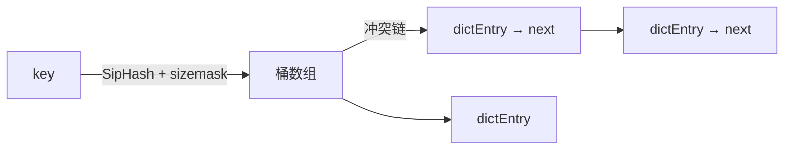
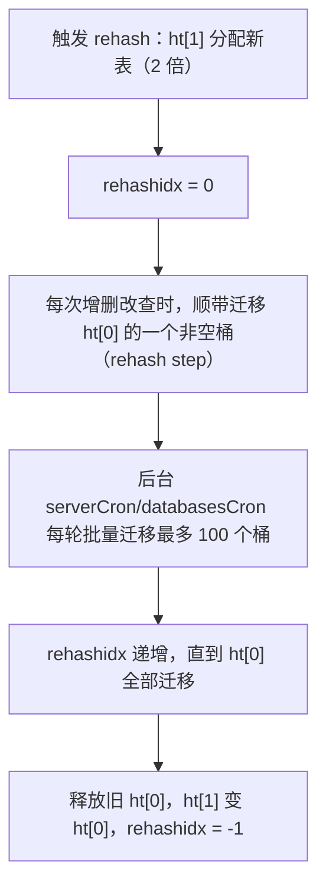

# 内部实现：字典与渐进式 rehash

## 0. 引言

`dict`（字典）是 Redis 的"宇宙基石"：**整个 key 空间**就是一个 dict，hash/set 类型也用它。理解 dict 的哈希表结构、**渐进式 rehash**（为什么扩容不阻塞）、扩容阈值与遍历语义，是读懂 Redis 源码与 SCAN 原理的钥匙。

## 1. 数据结构

```c
/* 哈希表：每个 dict 持有两张表（rehash 时切换） */
typedef struct dictht {
    dictEntry **table;      /* 哈希桶数组 */
    unsigned long size;     /* 桶数量（2 的幂） */
    unsigned long sizemask; /* size - 1，用于取模 */
    unsigned long used;     /* 已用桶位 */
} dictht;

typedef struct dict {
    dictType *type;         /* 哈希函数/键值复制等回调 */
    dictht ht[2];           /* ht[0] 主表，ht[1] rehash 目标表 */
    long rehashidx;         /* rehash 进度；-1 表示未进行 */
    unsigned long iterators; /* 活跃迭代器计数 */
} dict;
```



- 哈希函数：**SipHash**（配合随机种子抗 HashDoS，Redis 5.0 起替代 MurmurHash2）；
- 冲突解决：**链地址法**（单链表）；
- `sizemask` 是 `size-1`，配合 2 的幂 size 用位运算代替取模。

## 2. 渐进式 rehash

### 2.1 为什么需要 rehash

负载因子（`used/size`）过高时链表变长，查找退化；需要**扩容**（默认 2 倍）。若一次性完成（如 1000 万 key 扩容），rehash 期间主线程会阻塞——Redis 把 rehash 拆成**每步一小撮**：

### 2.2 触发条件

| 场景 | 条件 |
|------|------|
| 扩容 | 负载因子 > 1（无子进程）或 > 5（有 BGSAVE/BGREWRITEAOF 子进程） |
| 缩容 | 负载因子 < 0.1（如大量删除后） |

> 子进程存在时提高阈值（5），避免 COW 内存翻倍。

### 2.3 渐进过程



```c
/* 核心：按需迁移，每步 1 个桶（plus 变体可多迁） */
int dictRehash(dict *d, int n) {
    int empty_visits = n * 10;   /* 空桶探测上限，防扫描空桶浪费时间 */
    while (n-- && d->ht[0].used != 0) {
        dictEntry *de, *nextde;
        while (d->ht[0].table[d->rehashidx] == NULL) {
            d->rehashidx++;
            if (--empty_visits == 0) return 1;  /* 全是空桶，提前返回 */
        }
        de = d->ht[0].table[d->rehashidx];
        /* 将桶内整条链迁移到 ht[1] */
        while (de) {
            nextde = de->next;
            /* 计算在新表中的位置并头插 */
            uint64_t h = dictHashKey(d, de->key) & d->ht[1].sizemask;
            de->next = d->ht[1].table[h];
            d->ht[1].table[h] = de;
            d->ht[0].used--;
            d->ht[1].used++;
            de = nextde;
        }
        d->ht[0].table[d->rehashidx] = NULL;
        d->rehashidx++;
    }
    if (d->ht[0].used == 0) {
        /* 迁移完成：释放旧表，ht[1] 换位成 ht[0]，rehashidx = -1（源码此处理） */
        return 0;
    }
    return 1;   /* 1 = 仍有桶待迁移 */
}
```

**rehash 期间的行为**：

- 读/写/删：先查 ht[0] 再查 ht[1]（双表查找）；
- 新增：**只写 ht[1]**（保证 ht[0] 只减不增，迁移必然收敛）；
- 遍历（SCAN）：见下文，特殊处理避免重复/遗漏。

## 3. 遍历语义：dictScan 与 SCAN 的关系

SCAN 命令的底层就是 `dictScan()`。它的核心是**反向二进制迭代**（详见《Scan 渐进式遍历》章节原理）：

```c
unsigned long dictScan(dict *d, unsigned long v, dictScanFunction *fn, void *privdata) {
    /* 在 rehash 进行中时，同时遍历 ht[0] 与 ht[1] */
    /* 游标按表 size 的位数做反转递增，保证扩容/缩容不遗漏 */
    do {
        /* 遍历 ht[0] 的桶 v 的反转递增序列... */
        if (d->rehashidx != -1) {
            /* rehash 中：ht[1] 用同样的 v 遍历 */
        }
        v |= ~m0;      /* 跳到下一个更高位 */
        v = rev(v);    /* 位反转 */
        v++;
    } while (v);
    return v;
}
```

- 游标 v 的迭代顺序 = 桶位索引的**位反转递增**；
- rehash 中同时遍历两张表，且用"高半区优先"策略保证不遗漏不重多数；
- 这正是 SCAN"保证返回遍历开始后存在的所有元素"的数学基础。

## 4. 扩容与缩容的工程视角

```bash
> info stats
# 查看 rehash 状态（7.x 支持）
> info everything | grep -i rehash
```

**工程要点**：

1. **海量 key 写入时扩容瞬间**：虽然渐进，但"分配新表"是 O(N) 的（N=桶数），大实例扩容有短暂内存/CPU 尖峰；
2. **删除大量 key 后缩容**：负载因子 < 0.1 触发，缩容后内存归还分配器有延迟（碎片）；
3. **大 key 的 dict 结构**：hash 类型超阈值（listpack → hashtable）的重写瞬间 O(N)；
4. **监控**：`used_memory` 与 `mem_fragmentation_ratio` 联看，判断是否扩容风暴。

## 5. 与 Java HashMap 的对比

| 维度 | Redis dict | Java HashMap |
|------|-----------|--------------|
| 哈希 | SipHash | 扰动函数 + 二次哈希 |
| 冲突 | 链地址 | 链表→红黑树（>8） |
| 扩容 | 渐进式（分步） | 一次性（rehash 阻塞） |
| 缩容 | 支持（<0.1） | 不支持 |
| 扩容倍数 | ×2 | ×2 |
| 线程模型 | 单线程无并发问题 | 多线程需同步 |

**设计启示**：单线程模型让 dict 无需锁，也让"渐进式 rehash"成为必要——任何 O(N) 操作都必须拆碎，这是 Redis 所有渐进式机制（SCAN、rehash、惰性删除）的统一哲学。

## 6. 小结

- dict = 双哈希表 + 链地址 + SipHash，整个 key 空间建立其上；
- 渐进式 rehash 把 O(N) 扩容摊薄到每次命令，新增只写新表保证收敛；
- `dictScan` 的反向二进制迭代是 SCAN 不遗漏的底层保证；
- 与 HashMap 的对比：单线程无锁、可缩容、扩容不阻塞——Redis 的"渐进式哲学"贯穿始终。

下一章深入 listpack 与 quicklist：列表与紧凑编码的实现。