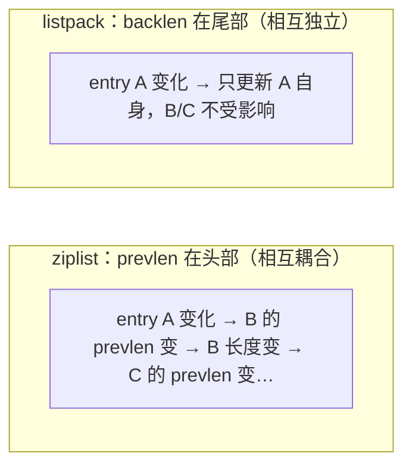

# 内部实现：listpack 与 quicklist

## 0. 引言

list、hash、zset 的小对象在 Redis 7.x 中统一使用 **listpack**（紧凑连续内存）存储，list 更由 **quicklist**（listpack 节点链表）组织。本章从源码视角回答：**ziplist 的级联更新问题是什么？listpack 如何解决？quicklist 的"深度"参数如何权衡内存与性能？**

## 1. ziplist 的遗产：级联更新问题

### 1.1 ziplist 结构（Redis ≤ 6.2）

```text
<zlbytes> <zltail> <zllen> <entry1> <entry2> ... <entryN> <zlend>
```

每个 entry 的头部包含 `prevlen`（前一个 entry 的长度，1 或 5 字节）：

```text
entry = [prevlen(1|5B)][encoding][data]
```

### 1.2 级联更新（cascade update）

**问题**：某 entry 内容变长，其 `prevlen` 需要从 1 字节升为 5 字节 → 自身长度变化 → 下一个 entry 的 `prevlen` 也要升 → 依次传播，最坏 O(N²)：


虽然只有当 entry 长度跨越 254 字节边界（prevlen 在 1 字节 ↔ 5 字节间切换）时才会触发，但一旦发生就是灾难：**大 key 插入极慢、内存反复 realloc**。ziplist 的删除（`ziplistDelete`）同样有传播风险。

## 2. listpack：从源头消除级联更新

### 2.1 设计核心：prevlen 存尾部

Redis 7.0 引入的 **listpack** 把"前一个 entry 长度"从**头部**移到**本 entry 尾部**：

```text
listpack = <total-bytes> <num-elements> [entry1][entry2]... <listpack-end>

entry = [encoding][data][backlen]     # backlen 在尾部！
```

- `backlen` 编码的是**本 entry 的长度**，供反向遍历（从尾到头）使用；
- 修改某 entry 只影响**自身长度**，不会改变前一个 entry 的任何字节——**级联更新从结构上不可能发生**；
- 反向遍历时，从尾部按 `backlen` 逐条回跳，O(1) 定位每一跳。



### 2.2 listpack 编码格式

```text
encoding 类型（用首字节高位区分）：
0xxxxxxx            : 7 bit 无符号整数（0-127）
10xxxxxx            : 6 bit 字符串长度（≤63B）
110xxxxx yyyyyyyy   : 13 bit 有符号整数
1110xxxx yyyyyyyy   : 字符串，12 bit 长度（≤4095B）
11110001            : 16 bit 有符号整数
11110010            : 24 bit 有符号整数
11110011            : 32 bit 有符号整数
11110100            : 64 bit 有符号整数
11110101~11110111   : 24/32/40 bit 长度的字符串
11111111            : listpack 结束字节（LP_EOF）
```

- 小整数（≤127）1 字节编码；小字符串（≤63B）省去长度字段前置位——**紧凑到极致**；
- 与 ziplist 一样，listpack 是"只读友好"结构：插入/删除仍为 O(N)（memmove），但无级联放大。

### 2.3 编码转换阈值（7.x）

```text
hash-max-listpack-entries 128
hash-max-listpack-value 64
zset-max-listpack-entries 128
zset-max-listpack-value 64
set-max-listpack-entries 128      # 7.2+
set-max-listpack-value 64         # 7.2+
```

超过阈值 → 升级为 hashtable（hash/set）或 skiplist（zset）；升级不可逆（除非删空重建）。

## 3. quicklist：list 的最终结构

### 3.1 为什么需要 quicklist

list 的两种极端方案都不行：

- **纯链表**：每个节点 malloc/指针开销大，缓存不友好；
- **单一 ziplist/listpack**：中间插入/删除 O(N)。

**quicklist** = 双向链表 + 每个节点是一个 listpack（7.0 前是 ziplist）：

```c
typedef struct quicklist {
    quicklistNode *head;
    quicklistNode *tail;
    unsigned long count;      /* 全部元素数 */
    unsigned long len;        /* 节点数 */
    int fill;                 /* 节点容量（配置 fill） */
    /* ... */
} quicklist;

typedef struct quicklistNode {
    struct quicklistNode *prev;
    struct quicklistNode *next;
    unsigned char *entry;      /* listpack 数据 */
    unsigned int sz;           /* 本节点字节数 */
    unsigned int count;        /* 本节点元素数 */
    /* ... */
} quicklistNode;
```


### 3.2 fill 参数：内存与性能的旋钮

```text
list-max-listpack-size 128        # 正数：每个节点最多 128 个元素
list-max-listpack-size -2         # 负数：每个节点最多 8KB（-1=4KB, -2=8KB, -3=16KB...）
```

| 方向 | 效果 |
|------|------|
| 节点容量大（如 8KB） | 内存紧凑（listpack 压缩率高），但中间插入 O(N) 增大 |
| 节点容量小 | 插入删除快，但链表指针开销与碎片增加 |

**工程经验**：默认 -2（8KB）适合绝大多数场景；中间频繁插入（如消息列表）时调小；追求极致内存时调大并监控耗时。

### 3.3 LZF 压缩（quicklist 特有）

```text
list-compress-depth 0        # 0 = 不压缩（默认）；1 = 两端各留 1 个节点不压缩
```

- 对中间节点用 **LZF 算法压缩**（内存换 CPU）；
- 适合"只从两端读写"的队列场景（压缩中间节点，省内存）；
- 随机访问（LINDEX）命中压缩节点需要解压，牺牲点性能。

## 4. 7.0 替换影响与迁移

| 影响 | 说明 |
|------|------|
| 配置改名 | `*-max-ziplist-*` → `*-max-listpack-*`（旧名仍兼容） |
| 存量数据 | 已编码的 ziplist 对象在**结构重写**（如插入触发扩展）时自动转 listpack |
| 编码查看 | `OBJECT ENCODING`：7.x 小 list 显示 `listpack`（不再是 ziplist） |
| 性能 | 消除级联更新，最坏插入从 O(N²) 降为 O(N) |

```bash
> rpush mylist a b c
> object encoding mylist
"listpack"                  # 7.x 小列表（8.6.2 实测：整个列表在单个 listpack 内时显示 listpack）
> rpush mylist <连续 2000 个元素>    # 超过单节点容量上限（默认 8KB）后
> object encoding mylist
"quicklist"                 # 多节点链表结构
```

## 5. 源码关键函数

```c
/* listpack 节点长度存储：本 entry 长度编码在尾部 */
static inline unsigned char *lpGetBacklen(unsigned char *p) {
    /* 从尾部向前读取变长整数 */
}

/* quicklist 插入：先尝试合并到已有节点，超 fill 则新建节点 */
void quicklistPushHead(quicklist *quicklist, void *value, size_t sz) {
    if (quicklist->head && quicklist->head->count < quicklist->fill) {
        /* 就地插入 listpack */
    } else {
        /* 新建节点 */
    }
}
```

## 6. 工程启示

1. **小对象别浪费**：几百个字段的 hash 用 listpack 存，内存可以省 60%+；
2. **list 中间插入频繁**：调小 `list-max-listpack-size`（如 32）；
3. **队列型 list**：开 `list-compress-depth 1`，中间节点压缩，如消息列表百万级元素；
4. **升级到 7.x**：ziplist 自动迁移，无需干预，但注意 `OBJECT ENCODING` 输出变化影响监控脚本。

## 7. 小结

- ziplist 的级联更新是 O(N²) 隐患，**listpack 用"尾部 backlen"从结构上消除**；
- listpack 编码对小整数/短字符串极致紧凑，是 7.x 小对象统一编码；
- quicklist = listpack 节点链表，`fill` 与 `compress-depth` 两个旋钮平衡内存/性能。

下一章深入 skiplist 与 rax 基数树。