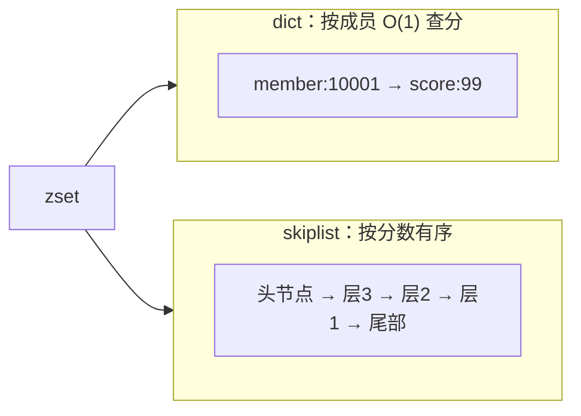
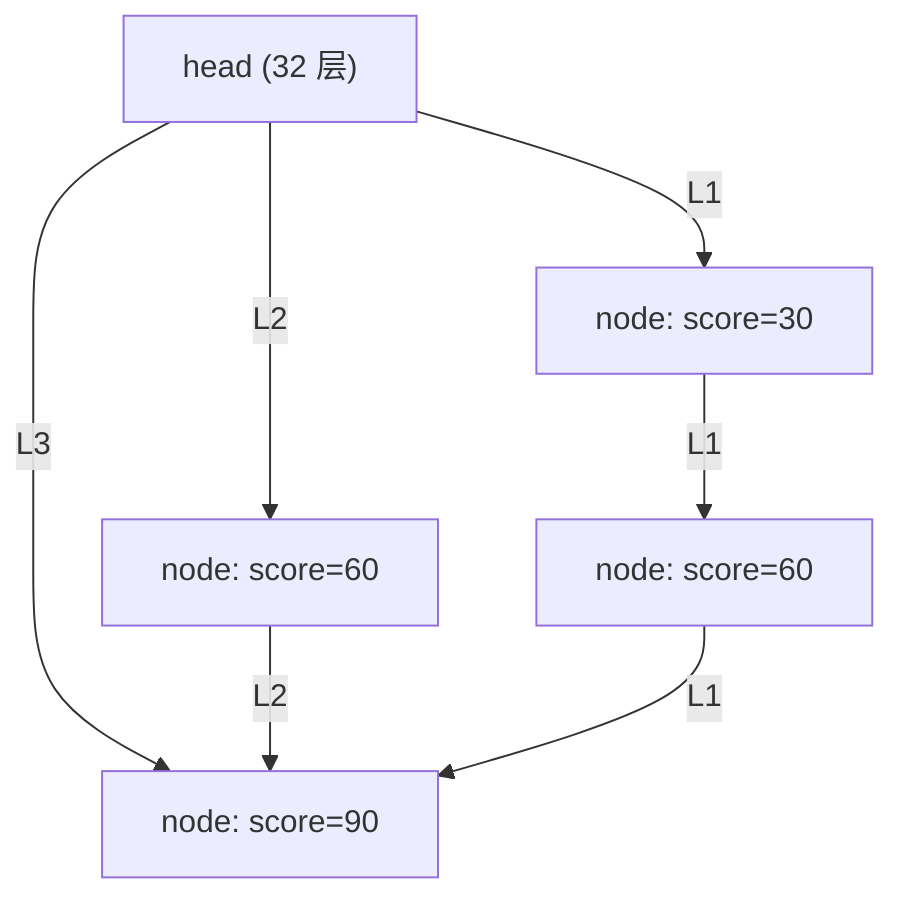
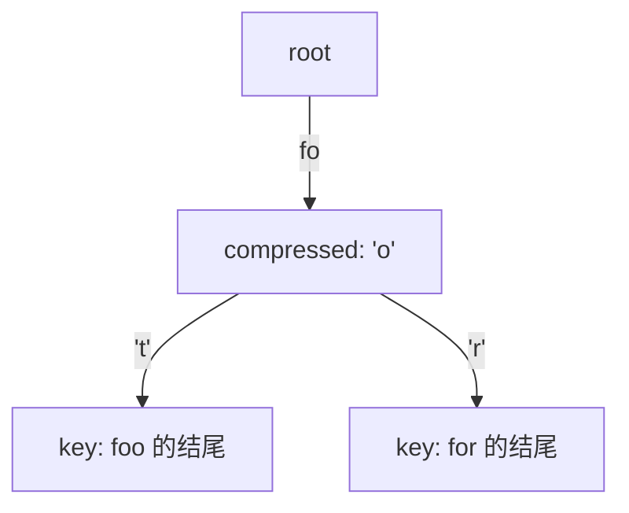

# 内部实现：skiplist 与 rax 基数树

## 0. 引言

zset 的有序性、Stream 的消息 ID 索引、Redis Cluster 的 slot 映射——分别由 **skiplist（跳跃表）** 与 **rax（基数树）** 支撑。本文从源码视角解析：为什么 zset 不用红黑树、skiplist 的随机层级、rax 的压缩节点与 Stream 的底层组织。

## 1. zset：skiplist + dict 复合结构

### 1.1 为什么 zset 需要两个结构

| 需求 | 结构 | 复杂度 |
|------|------|--------|
| 按成员查分数（ZSCORE） | dict | O(1) |
| 按分数范围遍历（ZRANGEBYSCORE） | skiplist | O(logN + M) |
| 按排名取（ZRANK） | skiplist（span 加速） | O(logN) |

```c
typedef struct zset {
    dict *dict;              /* member → score 映射 */
    zskiplist *zsl;          /* score 有序索引 */
} zset;
```



### 1.2 为什么不用红黑树/AVL

- **实现简单**：跳跃表 ~200 行代码，红黑树 ~500 行且旋转/变色易错；
- **范围查询友好**：skiplist 天然有序链表，正向遍历零开销；红黑树需要中序遍历；
- **随机化平衡**：不用维护严格平衡，插入删除只改局部指针；
- 复杂度同为 O(logN)，常数略大但可接受。

## 2. skiplist 结构解析

### 2.1 节点与层级

```c
#define ZSKIPLIST_MAXLEVEL 64    /* 最大 64 层（7.0 起由 32 提升） */
#define ZSKIPLIST_P 0.25         /* 晋升概率 1/4 */

typedef struct zskiplistNode {
    sds ele;                     /* 成员 */
    double score;                /* 分数 */
    struct zskiplistNode *backward;  /* 后退指针（第 1 层） */
    struct zskiplistLevel {
        struct zskiplistNode *forward; /* 前进指针 */
        unsigned long span;            /* 跨过多少节点（用于 ZRANK） */
    } level[];                   /* 柔性数组：每节点 1~64 层 */
} zskiplistNode;
```



### 2.2 随机层级

节点创建时，从第 1 层开始，以 **1/4 概率**逐层晋升，直到 64 层封顶（7.0 前 32 层）：

```c
int zslRandomLevel(void) {
    int level = 1;
    while ((random() & 0xFFFF) < (ZSKIPLIST_P * 0xFFFF))
        level += 1;
    return (level < ZSKIPLIST_MAXLEVEL) ? level : ZSKIPLIST_MAXLEVEL;
}
```

- 期望层级 1/(1-P) = 1.33，绝大多数节点 1-2 层；
- 查找从最高层开始"向右再向下"，期望 O(logN)；
- `span` 字段记录"跨过的节点数"，`ZRANK` 直接累加 span 得到排名，无需从 head 遍历。

### 2.3 与 listpack 的分工

7.x 中小 zset（≤128 元素且值 ≤64B）用 **listpack**（见上一章），超过阈值才升级为 skiplist+dict——小数据用紧凑编码，大数据用高效索引，两级火箭。

## 3. rax：基数树（Radix Tree）

### 3.1 用途

| 用途 | 说明 |
|------|------|
| Stream 消息索引 | 按消息 ID（时间戳-序列号）组织，前缀共享 |
| 客户端缓存失效表 | CLIENT TRACKING 的前缀 → 客户端失效索引（6.0+） |

### 3.2 结构与压缩

基数树是"按 key 前缀共享路径"的树：

```c
typedef struct raxNode {
    uint32_t iskey:1;    /* 该节点是否是一个 key 的结尾 */
    uint32_t isnull:1;   /* value 是否为空 */
    uint32_t iscompr:1;  /* 是否压缩节点 */
    uint32_t size:29;    /* 子节点数（压缩节点=1） */
    unsigned char data[];/* 存储字符 + 子节点指针 */
} raxNode;
```



- **压缩节点**：只有一个子节点时，把公共前缀合并存储（如 `foo`/`for` 共享 `fo`）——内存极致压缩；
- 查找复杂度 O(最长前缀长度)，与树中 key 数量无关；
- 插入/删除可能触发节点的压缩与解压（split/merge）。

### 3.3 Stream 的消息 ID 组织

Stream 内部 = **rax（按 ID 前缀索引）+ 每个节点一个 listpack**（存同前缀段的消息）：

```text
Stream key
└── rax 树（key = 消息 ID 前缀，如 "1760000000123-"）
    └── listpack（存放该前缀下的多条消息）
```

- 消息 ID 的"毫秒-序列号"数值排序天然匹配 rax 的字典序；
- 范围查询（XRANGE）就是 rax 的区间遍历 + listpack 内扫描；
- `XADD` O(logN)（rax 插入）+ O(1)（listpack 追加）。

## 4. 复杂度对照

| 操作 | skiplist | rax | listpack |
|------|----------|-----|----------|
| 单点查找 | O(logN) | O(前缀长) | O(N) |
| 范围查询 | O(logN + M) | O(前缀长 + M) | O(N) |
| 插入 | O(logN) | O(前缀长) | O(N)（memmove） |
| 内存 | 中（指针多） | 小（前缀共享） | 极小 |
| 适用 | zset 大集合 | Stream/前缀索引 | 小集合 |

## 5. 工程启示

1. **zset 大集合性能**：skiplist 保证有序操作 O(logN)，百万级排行榜无压力；
2. **Stream 容量**：rax + listpack 的组合让"百万消息"在内存中相当紧凑，但仍在内存——限长（XTRIM）是铁律；
3. **理解编码监控**：`OBJECT ENCODING` 看到 `skiplist` 表示 zset 已大；`listpack` 表示仍在小对象区；
4. **别用 zset 做无限累积**：有序集合与 Stream 一样，元素数×对象大小直接吃内存，配合淘汰/裁剪策略。

## 6. 小结

- zset = **dict（按成员查分）+ skiplist（按分数有序）**，红黑树被"更简单且范围友好"的跳跃表取代；
- skiplist 的随机层级 + span 字段让查找与排名都是 O(logN)；
- **rax** 用前缀压缩把 Stream 的 ID 索引与集群 slot 映射做到内存极致；
- 至此，Redis 六大内部结构（SDS、dict、listpack、quicklist、skiplist、rax）全部解析完毕——它们共同构成 Redis"高性能 + 低内存"的基石。

## 7. 系列结语

本系列（01-28）从基础数据结构到内部实现，系统覆盖了 Redis 7.x 的核心知识体系：

| 模块 | 篇章 |
|------|------|
| 数据结构 | 01-06（基础结构、锁、队列、位图、HLL、Geo） |
| 核心机制 | 07-11（限流、管道事务、IO 模型、Scan、持久化） |
| 高可用 | 12-18（主从、Sentinel、Codis、Cluster） |
| 可靠消息 | 19（Stream） |
| 安全与运维 | 20-24（ACL/TLS、Java 客户端、命令行、Info 监控） |
| 内部实现 | 25-28（SDS、dict、listpack/quicklist、skiplist/rax） |

结合官方文档（redis.io）与源码阅读，这套体系可作为 Redis 从应用到源码的完整学习路径。