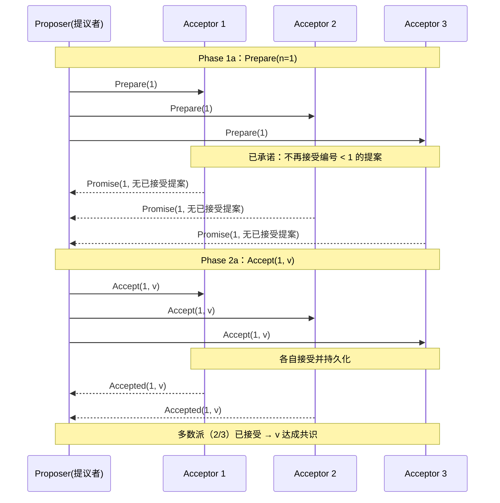
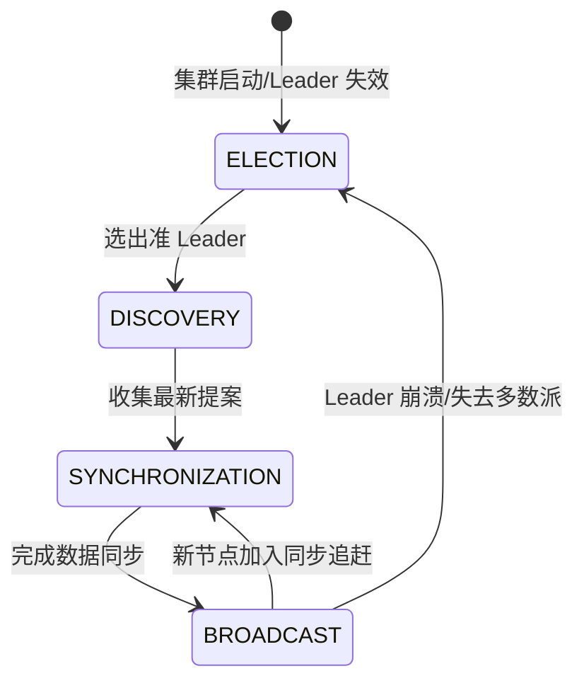
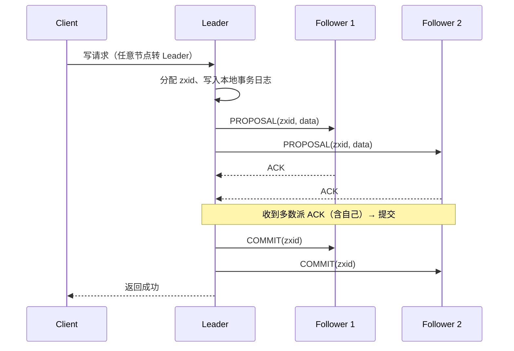

# 一致性算法与共识：Paxos、ZooKeeper 与区块链

本文把分布式系统的**共识（Consensus）算法**整合成一个完整专题，包含三大部分：经典共识算法 Paxos 与工程化产物 Raft；基于 ZAB 协议的 ZooKeeper 一致性保证；以及区块链的共识问题（拜占庭将军、PoW/POS/DPOS）。

## 第一部分 Paxos 算法

### 1. 问题定义与角色

Paxos 是分布式共识算法的"鼻祖"，由 Leslie Lamport 于 1990 年提出（论文《The Part-Time Parliament》）。它解决的问题是：**在可能发生故障、网络分区的节点集合中，如何让所有节点对一个值达成一致**。Raft 是 Paxos 的工程化简化；ZooKeeper 的 ZAB 虽与 Paxos 同以多数派为基石，但它是独立设计的原子广播协议（见第二部分）。

分布式系统需要多个节点对同一件事（选主、日志内容、配置值）达成一致，要求：

- **安全性（Safety）**：已达成一致的值不再改变；不同节点不会得出不同结论；
- **活性（Liveness）**：系统最终能达成一致（不无限阻塞）。

Paxos 的三个角色：

| 角色 | 职责 |
|------|------|
| **Proposer（提议者）** | 提出提案 `(编号 n, 值 v)`，推动共识 |
| **Acceptor（接受者）** | 投票/存储提案，决定是否接受；通常对应存储节点 |
| **Learner（学习者）** | 学习"哪个值被多数派接受"，不参与投票 |

> 实际节点往往一职多兼：比如 5 节点 ZooKeeper 集群中，每个节点既是 Proposer 也是 Acceptor，Leader 是获胜的 Proposer。

### 2. 两阶段的核心流程

Paxos 的核心是**两阶段 + 多数派**：



**Phase 1：Prepare / Promise**

1. Proposer 生成**全局递增编号 n**，向半数以上 Acceptor 发送 `Prepare(n)`；
2. Acceptor 收到后：
   - 若 `n` 大于自己见过的最大编号 `max_n`，则**承诺**不再接受编号小于 `n` 的提案，并回复 `Promise(n, 已接受的最大编号提案)`（若无则返回空）；
   - 否则拒绝（回复 reject）。

**Phase 2：Accept / Accepted**

3. Proposer 收集多数派 Promise 后：
   - 若**没有**任何 Acceptor 返回过已接受提案 → 自由选择自己的值 `v`；
   - 若**有** → 必须采用**编号最大**的那个已接受提案的值（这是安全性的关键：新提案必须延续已达成共识的值）；
4. 向这些 Acceptor 发送 `Accept(n, v)`；
5. Acceptor 若未违反承诺（`n >= max_n`）则接受并持久化，回复 `Accepted(n, v)`。

> **为什么必须选编号最大的已接受值？** 因为那个值可能已经被多数派接受、即将达成共识。若 Proposer 提出新值，会破坏"已达成一致的值不再改变"的安全性。

### 3. 安全性论证与活锁问题

任意两个多数派**必有交集**（如 3 节点中 2/3 与 2/3 至少重叠 1 个节点）。通过"承诺不再接受更小编号"+"新提案继承已接受值"，任何已达成共识的值都会沿着编号链被传递下去，从而保证不会出现两个不同值同时达成共识。

**活锁：Paxos 的阿喀琉斯之踵**。两个 Proposer 交替发起更高编号的 Prepare，导致对方的 Accept 一直被新承诺拒绝：

```text
P1: Prepare(1) → 多数派 Promise
P2: Prepare(2) → 多数派 Promise（覆盖 P1 的承诺）
P1: Accept(1,v1) → 被拒绝（已有承诺 2）
P1: Prepare(3) → 多数派 Promise（覆盖 P2）
P2: Accept(2,v2) → 被拒绝
... 无限循环，永远无法达成共识（活性失败）
```

**解法**：引入**Leader 选举**——同一时刻只有一个 Proposer 在提提案（选举出的 Leader），活锁自然消失。这就是 Multi-Paxos 的出发点。

### 4. Multi-Paxos：工程化的 Paxos

Basic Paxos 每达成一个值都要两轮 RPC，代价高。工程实现（Chubby、ZAB、Raft）普遍采用 **Multi-Paxos**：

1. **选主**：先通过一轮 Paxos 选出 **Leader**（固定 Proposer）；
2. **免 Prepare**：Leader 任期（epoch/term）内**跳过 Phase 1**，直接 Accept（多数派已承诺该任期）；
3. **日志复制**：每个提案对应日志中的一个槽位（instance），Leader 按序提交，Follower 按序应用；
4. **Learner 收敛**：多数派接受即提交，其余节点从 Leader 或已提交节点补日志。

### 5. Paxos vs Raft

| 维度 | Paxos（Multi-Paxos） | Raft |
|------|---------------------|------|
| 提出者 | Lamport（1990） | Ongaro & Ousterhout（2014） |
| 设计目标 | 理论共识算法 | 可理解、可教学的工程协议 |
| 选主 | 未定义（需自行实现） | **明确定义**：任期 term + 心跳超时随机化 |
| 日志复制 | 槽位管理复杂 | **强制日志连续性**：nextIndex 逐条对齐 |
| 成员变更 | 未定义 | 联合共识（joint consensus） |
| 代表实现 | Chubby、ZAB（变体） | etcd、Consul、TiKV、K8s apiserver |

> **Raft 不是新算法**，而是将 Multi-Paxos 的模糊地带（选主、日志对齐、成员变更）全部显式化的工程化产物——这也是"Raft 更容易实现"的原因。

## 第二部分 ZooKeeper 的一致性：ZAB 协议

### 1. ZAB 协议整体视图

ZooKeeper 是分布式协调服务的标杆（配置中心、分布式锁、服务注册、选主），其一致性由 **ZAB（ZooKeeper Atomic Broadcast）协议**保证——这不是 Paxos 的实现，而是一种**独立设计的原子广播协议**，包含"崩溃恢复"与"消息广播"两种模式：**所有写操作由 Leader 串行广播，Follower 按序应用，保证全局顺序一致性**。

ZAB 将节点状态机划分为四个阶段：



| 阶段 | 作用 | 关键点 |
|------|------|--------|
| **ELECTION（选举）** | 选出新 Leader | FastLeaderElection：比较 epoch 与 zxid，得票过半胜出 |
| **DISCOVERY（发现）** | 准 Leader 收集各节点最新提案 | 通过 `NEWLEADER`/`FOLLOWERINFO` 交换已接受的最大 zxid |
| **SYNCHRONIZATION（同步）** | 数据追赶，保证新 Leader 拥有**所有已提交**提案 | 缺少的提案从 Leader 处补齐，对齐后再进入广播 |
| **BROADCAST（广播）** | 正常服务期：写请求按序广播、多数派 ack 即提交 | 与 2PC 类似的 Leader-COHORT 两阶段 |

### 2. 选举阶段：FastLeaderElection

触发条件：集群启动、Leader 崩溃、Leader 失去多数派连接。

1. 每个节点投自己一票 `(myid, zxid, epoch)`，向所有节点广播；
2. 收到他人选票后，**PK 规则**（epoch 大的胜；同 epoch 比 zxid 大的胜；同 zxid 比 myid 大的胜）更新自己的投票并广播；
3. 某节点获得**超过半数**选票 → 广播结果，成为准 Leader；
4. 其余节点收到多数派结果后收敛投票。

> **为什么比 zxid 而不是比数据量？** zxid 是"事务编号"，越大代表数据越新；选 zxid 最大的节点当 Leader，可最小化同步阶段的数据追赶量。**zxid 是 64 位**：高 32 位是 epoch（Leader 任期），低 32 位是事务序号——保证跨任期的全局有序。

### 3. 同步阶段：数据追赶

新 Leader 选出后必须保证自己拥有**所有已提交事务**：

- Follower 上报自己已接受的最大 zxid；
- Leader 找出各 Follower 缺失的提案，将自身事务日志中的提案**补发给** Follower（以及尚未提交的历史提案）；
- Follower 按序应用补齐后 ack，Leader 确认**过半**完成同步后广播 `NEWLEADER` 提交，集群进入 BROADCAST。

> 若新 Leader 自身也缺提案（极端情况），ZAB 会"回退"：丢弃未提交的提案，保证**已提交的绝不少**、**未提交的绝不乱**。

### 4. 广播阶段：写请求的两阶段



- 写请求无论打到哪个节点，最终都转发到 **Leader**；
- Leader 分配**递增 zxid**，先写本地事务日志，再广播 `PROPOSAL`；
- 收到**多数派 ACK** 后发送 `COMMIT` 并返回客户端成功——这是 ZooKeeper 强一致（线性化写）的来源；
- Follower 按 zxid 顺序应用，保证**全局顺序一致性**。

### 5. ZooKeeper 的读一致性与性能折中

| 读方式 | 一致性 | 说明 |
|--------|--------|------|
| 默认读（follower 本地读） | **顺序一致**（可能读到旧值） | 高性能，用于非关键数据（如服务列表快照） |
| `sync` 后读 | 接近线性一致 | 读前先与 Leader 同步追赶 |
| 写读（写后立即读同节点） | 强一致 | 写请求返回即代表多数派已提交 |

> 工程启示：**ZooKeeper 的"一致性"主要指写路径的线性化 + 全序**；默认读是允许旧值的。对读一致性要求极高的场景（如分布式锁校验），使用 `sync` + 读。

### 6. 常见问题

1. **ZAB 与 Paxos 的区别**：ZAB 面向"主备 + 广播"，天然有 Leader 且聚焦**顺序**（zxid 全序）；Paxos 面向"多个值达成共识"，无固定 Leader。ZAB 并非 Paxos 的实现，而是独立的原子广播协议，二者同以"多数派"为安全根基。
2. **写性能瓶颈**：所有写走 Leader 串行广播，写吞吐受 Leader 单点限制（常见为万级 TPS 量级）——读多写少的协调场景够用。
3. **n 个节点最多挂几个**：多数派原则，5 节点可挂 2 个；**奇数节点**部署（避免平票）。
4. **zk 3.8+ 特性**：支持 `follower` 写代理优化、`learning` 节点、选举算法扩展。

## 第三部分 区块链的共识：拜占庭将军与 PoW

### 1. 共识问题与记账权

区块链是分布式系统最广泛的应用之一，起源于中本聪的比特币，是一个**去中心化**、**公开透明**的分布式账本技术。它注重安全和可信度胜过效率——如果说互联网技术解决的是通讯问题，区块链解决的则是**信任问题**。

作为分布式账本，每个参与者都维护了一份数据，核心问题是：**如何确认记账权，最终的账本以谁为准？**

区块链的共识问题实际上来源于分布式系统的一致性问题。**Consistency（一致性）与 Consensus（共识）的区别**：

- **Consistency** 侧重内容在时间顺序上的一致和统一；
- **Consensus** 指由许多参与者对某项内容达成共识，一般把 Consistency 译为"一致性"、Consensus 译为"共识"。

经典的 Paxos 等一致性算法，通过一个主进程（master）协调、由主进程达成一致。而区块链是去中心化系统，**没有 master 角色**，需要某种共识机制来保证系统一致性。

### 2. 拜占庭将军问题

一般在网络通信中，把节点故障、信道不可靠的情况称为"**非拜占庭错误**"；恶意响应、系统被攻击、传递错误消息称为"**拜占庭错误**"。

拜占庭将军问题源自一个故事模型：拜占庭帝国高墙坚固，至少需要十个邻邦中的一半以上同时进攻才能攻破；然而若其中一些邻邦答应一起进攻却中途背叛，入侵者可能被歼灭。由此引申出核心问题：**各邻国如何达成共识去攻打拜占庭帝国？**——军中可能有叛徒（恶意节点），却要保证进攻一致。

拜占庭将军问题（Byzantine Generals Problem）和 Paxos、逻辑时钟一样，由 **Leslie Lamport** 提出，Lamport 因分布式领域的贡献获得 **2013 年图灵奖**。

在记账权归属中，关键是**如何避免恶意共识（错误记账）**，即如何处理拜占庭将军中的"叛徒"。比特币的答案是 **PoW（工作量证明）机制**。

### 3. PoW 工作量证明

PoW 被认为是经过验证最安全的拜占庭解决机制，其原型 Hashcash 最早用于防垃圾邮件——要求发送方完成少量计算以抬高群发邮件的成本，正常发件人可接受，垃圾邮件发送者则无法承受。

**挖矿的由来**：比特币挖矿是将一段时间内发生的交易进行确认、记录在区块链上形成新区块的过程。由于需要竞争记账权，利用计算机计算 Hash 值、随机碰撞解题，这个过程就是挖矿——**系统出一道题，大家抢答最优解，矿工是记账员，区块链是账本**。

**比特币的 PoW 实现**：通过计算猜测一个数值（Nonce）解决规定的 Hash 问题。比特币区块头有个随机数字段（Nonce）。中本聪设置了一道题：不断调节 Nonce 值对区块头计算 Hash（一般用 SHA256），要求找到使 Hash 值满足某个固定值的 Nonce。由于 Hash 不可逆，每个节点只能**穷举尝试**各种字符串。系统会调节难度，约每 10 分钟挖出一个区块。

**共识形成**：若你算力强、很快得到满足条件的 Nonce 值，就把它放进区块通过 P2P 网络广播。其他节点验证合法后，认为你挖矿成功，你会获得比特币奖励和交易手续费；其他节点发现有人已解出，就放弃本次计算，开启下一个区块的题目。

**区块链分叉和 51% 攻击**：谁的算力多，谁最先解决问题的概率就越大。当掌握超过全网一半算力时，就能控制链的走向，这就是 **51% 攻击**的由来。系统中可能出现链的分叉（Fork），最终会有一条成为最长的链。现实中参与方利益博弈，比特币已分裂出 BCH（比特币现金）、BTG（比特币黄金）等分叉币。

**PoW 优缺点**：
- 优点：第一个完全实现去中心化的共识算法；节点自由进出、容易实现；破坏系统成本巨大；
- 缺点：最大的问题是**浪费能源**——巨大算力被浪费在无价值的挖矿计算中，这也说明在去中心化场景下实现信任有多么困难。

### 4. 其他共识方法：POS 与 DPOS

**POS（权益证明）**：类似股东大会机制，拥有股份越多投票权越多，越容易获取记账权。通过保证金对赌一个合法块成为新区块，收益为抵押资本的利息和交易服务费。著名数字货币 ETH（以太坊）在共识算法中采用 POS 机制。

**DPOS（委托权益证明）**：如果说 POS 类似股东大会，DPOS 则类似**公司董事会制度**——选出一定数量的代表来负责生产区块。典型代表是 EOS。

| 共识机制 | 核心 | 类比 | 代表 |
|---------|------|------|------|
| **PoW** | 算力竞赛（工作量证明） | 抢答题 | 比特币 |
| **PoS** | 权益（持币量） | 股东大会 | 以太坊 |
| **DPoS** | 选代表记账 | 董事会 | EOS |

## 总结

- **Paxos**：两阶段（Prepare/Accept）+ 多数派交集，保证已共识的值不变、不会双值共识；新提案必须继承最大编号已接受值；**Leader 化（Multi-Paxos）**解决活锁，是 ZAB、Raft 的共同骨架；
- **ZooKeeper（ZAB）**：选举 → 发现 → 同步 → 广播四阶段状态机，Leader 串行广播 + 多数派提交 + zxid 全序；FastLeaderElection 按 `epoch > zxid > myid` PK 过半胜出；
- **区块链**：去中心化无 master，需要共识机制解决"记账权归谁"；拜占庭将军问题描述**恶意节点**下的共识困难；**PoW（算力）、PoS（权益）、DPoS（委托代表）**是三大主流机制；
- 区分：**Consistency（一致性）** 侧重内容时序统一，**Consensus（共识）** 侧重多方对结果达成一致；
- 经典共识（Paxos/Raft/ZAB）假定"崩溃-恢复"节点（非拜占庭），区块链共识需额外抵御**恶意行为（拜占庭错误）**。

下一章讲解分布式事务解决方案全景：2PC、3PC、TCC、消息事务与 Saga。

---
