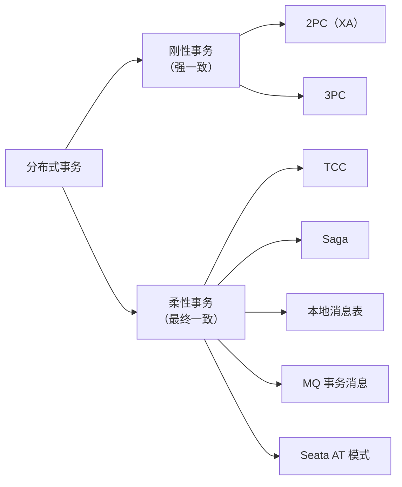
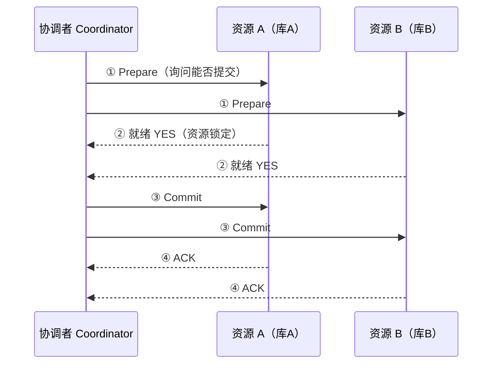

# 分布式事务：解决方案、XA 与 TCC

微服务拆分后，一个业务操作往往跨多个服务、多个数据库，"要么全成功、要么全失败"的本地事务能力失效。分布式事务要解决的就是**跨资源（库/服务）的原子性**。本文整合分布式事务的完整知识：方案全景、刚性事务（2PC/3PC/XA）、MySQL XA 实现、柔性事务（TCC/Saga/消息/Seata AT）、以及选型指南。

## 第一部分 分布式事务方案全景

### 1. 方案分类与对比

业界方案众多：从经典的 2PC/3PC，到柔性事务的 TCC、Saga、本地消息表、MQ 事务消息，再到 Seata 的 AT 模式。



| 方案 | 一致性 | 侵入性 | 性能 | 适用场景 |
|------|--------|--------|------|---------|
| **2PC/XA** | 强一致 | 低（数据库原生支持） | 低（同步阻塞） | 跨库事务、短事务、低并发 |
| **3PC** | 强一致（仍有缺陷） | 中 | 低 | 理论价值大于实践 |
| **TCC** | 最终一致 | **高**（三方法改造） | 中 | 资金类强管控场景（转账、扣款） |
| **Saga** | 最终一致 | 中（补偿逻辑） | 高 | 长流程、异步化（订单全链路） |
| **本地消息表** | 最终一致 | 低 | 高 | 无 MQ 事务能力的场景 |
| **MQ 事务消息** | 最终一致 | 低 | 高 | RocketMQ 用户的最佳选择 |
| **Seata AT** | 最终一致（全局读已提交） | **低**（自动生成回滚镜像） | 中 | 希望低成本接入的 Java 服务 |

## 第二部分 刚性事务：2PC / 3PC

### 2. 两阶段提交（2PC）

引入**事务协调者（Coordinator）**与**资源管理器（RM）**：



- 阶段一 **Prepare**：参与者执行事务但**不提交**，锁定资源，向协调者报告"就绪/中止"；
- 阶段二 **Commit/Rollback**：协调者根据投票结果统一提交或回滚；
- 缺陷：**同步阻塞**（资源锁定期间其他事务被阻塞）、**协调者单点**（挂掉则参与者永久阻塞）、**脑裂**（Commit 消息丢失时参与者不知该提交还是回滚）。

### 3. 2PC 的三大缺陷

| 缺陷 | 表现 | 后果 |
|------|------|------|
| **同步阻塞** | Prepare 后参与者锁定资源，等待协调者全局决策 | 事务吞吐低，长事务拖垮系统；协调者故障时资源锁**无人释放** |
| **协调者单点** | 协调者崩溃 → 参与者不知道全局结果 | 参与者卡在"已就绪"状态，只能等恢复或人工介入 |
| **脑裂（不一致）** | Commit 阶段部分参与者收到提交、部分没收到 | 部分提交部分回滚 → 数据不一致且**无法自动修复** |

### 4. 三阶段提交（3PC）的改进

3PC 在 2PC 前增加 **CanCommit** 询问阶段，并将 Commit 阶段改为**超时自提交**（参与者超时后默认提交）：

| 阶段 | 2PC 对应 | 3PC 设计 |
|------|---------|---------|
| **CanCommit** | 无（新增） | 先问"能否提交"，**不锁资源**；任一无能 → 提前中止，避免无谓的锁开销 |
| **PreCommit** | Prepare | 执行事务、写 undo/redo 日志、锁定资源，回复就绪 |
| **DoCommit** | Commit | 全局提交；**参与者超时未收到指令 → 默认提交**（避免无限阻塞） |

**两个关键改进**：

1. **CanCommit 预询**：把"不可能提交"的情况提前拦截——参与者能力不足/网络不通时，协调者直接中止，**减少资源锁定时间**；
2. **超时自提交**：DoCommit 阶段参与者超时未收到全局指令时，**默认执行提交**（因为进入 DoCommit 意味着所有参与者都 PreCommit 成功，大概率应该提交）——解决了 2PC 中"协调者挂掉 → 参与者永久等待"的阻塞问题。

### 5. 3PC 仍然存在的问题

| 问题 | 说明 |
|------|------|
| **分区时仍不一致** | DoCommit 阶段网络分区：部分参与者超时自提交，另一部分收到协调者的 Abort → **提交与回滚并存**，且 3PC 没有仲裁机制修复 |
| **性能更差** | 多一轮 RPC，正常路径延迟更高 |
| **实现复杂度高** | 超时阈值、状态机转换、故障恢复逻辑更复杂 |
| **阻塞问题未根治** | 协调者崩溃恢复后仍需探测各参与者状态 |

> 结论：3PC 用"更多的 RPC + 更复杂的状态机"换来了"更少的阻塞窗口"，但**无法保证分区下的强一致**，还牺牲了性能——这就是它"理论完善、工程罕见"的原因。业界强一致路线的主流是共识协议（Paxos/Raft/ZAB）与 XA 规范下的 2PC 实现（如 Seata XA 模式）。

### 6. 事务内核：WAL 与并发控制

理解本地事务的 WAL 与并发控制，是理解分布式事务的基础。**预写日志（WAL）**核心原则：**对数据的任何修改，必须先写入日志并落盘，再修改内存中的页**。

```text
写入流程：
1. 将修改记录追加到 WAL，fsync 落盘
2. 在内存中应用修改（脏页）
3. 脏页由后台异步刷盘
```

崩溃后，数据库重放（Replay）WAL 中已提交的事务，撤销（Undo）未提交的事务，从而恢复到一致状态。**检查点（Checkpoint）**定期将脏页刷盘并记录"已持久化到何处"，恢复时只需从最近检查点后的日志重放。

**隔离级别与并发控制**：

| 隔离级别 | 脏读 | 不可重复读 | 幻读 |
|----------|------|------------|------|
| 读未提交（RU） | 可能 | 可能 | 可能 |
| 读已提交（RC） | 否 | 可能 | 可能 |
| 可重复读（RR） | 否 | 否 | 可能 |
| 串行化（Serializable） | 否 | 否 | 否 |

| 机制 | 原理 | 优点 | 缺点 |
|------|------|------|------|
| **两阶段锁（2PL）** | 事务分为加锁与解锁两阶段 | 可实现串行化 | 读写互斥，易死锁 |
| **多版本并发控制（MVCC）** | 每次写生成新版本，读基于快照 | 读不加锁，读多场景性能好 | 需维护多版本与 GC |
| **乐观并发控制（OCC）** | 执行时不加锁，提交时校验冲突 | 低争用下吞吐高 | 高争用下大量回滚 |

### 7. 两条分布式事务路线：Spanner 与 Calvin

**Spanner：TrueTime + 2PC**（Google 全球分布式数据库）：通过 **TrueTime API**（GPS + 原子钟提供带不确定区间的时间戳）保证事务顺序与真实时间一致，2PC + Paxos 在分片间提交。特点：线性一致的跨节点事务，但依赖专用硬件校准时钟。

**Calvin：确定性调度**：**在事务执行前，先通过共识就事务的全局顺序达成一致，再确定性地顺序执行**。所有节点按同一顺序执行事务日志，相同输入 + 相同顺序 → 相同结果，无需执行时协调。优势是避免 2PC 的运行时交互、吞吐高；局限是需预先确定事务，不适合高度交互式负载。

| 维度 | Spanner | Calvin |
|------|---------|--------|
| 顺序来源 | TrueTime 真实时钟 | 共识确定的逻辑顺序 |
| 执行方式 | 并发 + 锁 + 2PC | 确定性顺序执行 |
| 一致性 | 外部一致（线性） | 串行化 |
| 硬件依赖 | 原子钟 / GPS | 无 |
| 适用 | 地理分布、强一致 | 高吞吐、可预测事务 |

## 第三部分 MySQL XA 规范

### 8. XA 规范概述

XA 是 **DTP（Distributed Transaction Processing）模型**中的规范，由 **X/Open 组织**提出，定义跨多个资源管理器的全局事务。XA 规范的目的是解决分布式事务问题，在 **2PC** 协议的基础上，定义了"标准处理模型"。

X/Open DTP 模型定义三个核心组件：

| 组件 | 全称 | 职责 |
|------|------|------|
| **AP** | Application Program（应用程序） | 业务逻辑，定义事务边界 |
| **TM** | Transaction Manager（事务管理器） | 管理全局事务、协调提交与回滚（类似 2PC 的协调者） |
| **RM** | Resource Manager（资源管理器） | 管理具体资源（数据库、MQ），执行本地事务 |

### 9. 事务管理器与资源管理器

- **TM（事务管理器）**：决定全局事务的提交或回滚，向所有 RM 协调；是 DTP 模型的核心协调者角色；
- **RM（资源管理器）**：向外部提供本地资源（数据）的接入能力，把本地事务纳入全局事务。

类比：在 2PC 中，协调者对应 **TM**，参与者（数据库）对应 **RM**。TM 和 RM 都遵循 XA 协议接口。

### 10. MySQL 对 XA 的实现

MySQL 通过 **InnoDB 存储引擎**支持 XA 事务。XA 事务在 MySQL 中的执行分两个阶段：

| 状态 | 操作 | 说明 |
|------|------|------|
| **XA START** | 开始事务 | 开启 XA 事务，指定 xid |
| **XA END** | 结束事务 | 结束 XA 事务（此后不可再执行 SQL） |
| **XA PREPARE** | 准备 | 提交前预备（准备阶段），写日志并锁定资源 |
| **XA COMMIT / ROLLBACK** | 提交/回滚 | 最终提交或回滚（完成阶段） |

**MySQL XA 语法**：

```sql
XA START 'xid';           -- 开启 XA 事务
UPDATE ...;               -- 业务操作
XA END 'xid';             -- 结束事务
XA PREPARE 'xid';         -- 预备（2PC 阶段一）
XA COMMIT 'xid';          -- 提交（2PC 阶段二）
-- 或 XA ROLLBACK 'xid';  -- 回滚
```

**注意**：MySQL 的 XA 一般需结合**事务管理器（TM）**使用，通常由中间件（如 ShardingSphere、Seata XA、应用层框架）来编排，而非应用直接操作 XA 语句。

**XA 的优缺点**：

| 维度 | 说明 |
|------|------|
| 优点 | 数据库原生支持、代码侵入小；保证强一致 |
| 缺点 | **同步阻塞**（2PC 固有）；**性能差**（多轮网络与锁）；协调者单点；不适合高并发场景 |

## 第四部分 柔性事务：TCC

### 11. TCC 核心思想

TCC（Try-Confirm-Cancel）是"业务补偿派"代表：把每个资源操作拆成**预留（Try）、确认（Confirm）、取消（Cancel）**三个业务方法，由事务管理器统一编排。相比 2PC 的"数据库锁资源"，TCC 把资源控制权交给**业务代码**——更灵活、性能更好，但侵入性也最高。

| 方法 | 语义 | 转账示例（账户 A → B 转 100） |
|------|------|------------------------------|
| **Try** | 尝试：**预留资源**，保证 Cancel 或 Confirm 可执行 | A 余额扣减到"冻结"字段；B 增加"预收"字段 |
| **Confirm** | 确认：Try 成功后**真正执行**（幂等） | A 冻结转扣减；B 预收转入账 |
| **Cancel** | 取消：释放 Try 预留的资源（幂等） | A 冻结回余额；B 预收清零 |

> 关键特征：**Try 不真正扣减**，只是"占位"——这样 Confirm/Cancel 都基于 Try 的预留结果执行，全局事务管理器可以安全地决定提交或回滚。

### 12. TCC 完整流程

所有 Try 成功 → 全局 Confirm；任一 Try 失败 → 全局 Cancel。每个方法必须**幂等**（Confirm/Cancel 可能被重试）。事务管理器负责记录全局状态、驱动各分支、处理超时重试。

### 13. TCC 的三大难题

| 难题 | 场景 | 解法 |
|------|------|------|
| **空回滚** | Try 因网络超时未到达，但 Cancel 先到了——Cancel 执行时资源从未被预留 | 用**事务控制表**记录分支状态：Cancel 前检查 Try 是否执行过，未执行则直接返回成功并记录"已空回滚" |
| **幂等** | Confirm/Cancel 因网络重试被**重复执行**——重复扣款/重复入账 | 唯一事务 ID + 状态机：同一分支只执行一次 Confirm/Cancel（幂等表/状态字段） |
| **悬挂** | Try 超时被 Cancel（空回滚），但 Try 请求**延迟到达**并执行了预留——资源被永久冻结 | 事务控制表中记录"已空回滚"，Try 到达时发现已回滚则**拒绝执行**（防悬挂） |

> 三者合起来要求：**Try、Confirm、Cancel 都要访问"事务控制表"做状态校验**——这是 TCC 落地的最大工作量，也是框架（Seata）帮你做的事情之一。

### 14. TCC vs 2PC vs 普通补偿

| 维度 | 2PC/XA | TCC | 普通补偿（Saga） |
|------|--------|-----|-----------------|
| 资源控制 | 数据库锁（资源级） | 业务冻结（业务级） | 无预留，直接执行再回补 |
| 一致性 | 强一致 | 最终一致（Try 后可见中间态） | 最终一致 |
| 侵入性 | 低（SQL 级） | **高**（三方法 + 控制表） | 中（补偿逻辑） |
| 性能 | 低（锁等待） | 中（无长锁，但多轮调用） | 高（异步） |
| 适用 | 低并发跨库 | **资金类强管控** | 长流程可异步 |

### 15. Seata 中的 TCC 落地

```java
@LocalTCC
public interface AccountAction {
    @TwoPhaseBusinessAction(name = "deduct", commitMethod = "confirmDeduct", rollbackMethod = "cancelDeduct")
    boolean tryDeduct(@BusinessActionContextParameter(paramName = "accountId") String accountId,
                      @BusinessActionContextParameter(paramName = "amount") BigDecimal amount);

    boolean confirmDeduct(BusinessActionContext ctx);
    boolean cancelDeduct(BusinessActionContext ctx);
}
```

`@LocalTCC` + `@TwoPhaseBusinessAction` 声明三方法；Confirm/Cancel 由 Seata 在全局事务提交/回滚时自动调用（含重试与幂等）；新版 Seata 还提供事务防护墙（`tcc_fence_log` 表）自动解决空回滚/幂等/悬挂，业务只需关注三方法的业务实现。

## 第五部分 柔性事务：Saga / 消息 / Seata AT

### 16. Saga

长事务拆分为**本地事务序列**，每个本地事务配一个**补偿事务**：

```text
T1(扣库存) → T2(扣余额) → T3(创建订单) → 全部成功 = 完成
失败时反向补偿：C2(还余额) → C1(还库存)
```

- 编排模式：**Choreography（事件驱动）**——各服务监听事件自行执行；**Orchestration（编排器）**——中央 Saga 对象协调；
- 适用：**长流程、异步化**业务（订单、预订、审批流）；不适用于对中间状态敏感的场景（补偿期间数据可见）。

### 17. 本地消息表 + MQ 事务消息

两者思路一致：**"本地事务 + 可靠消息"解耦**，事务与消息同生共死，最终由消费方对账补偿。

- **本地消息表**：业务表与消息表同库同事务；定时任务扫描未发送消息 → 投递 MQ → 消费方处理后标记完成。经典但需自己维护消息表与任务；
- **MQ 事务消息（RocketMQ）**：生产者先发 **half 消息**（消费者不可见）→ 执行本地事务 → 提交/回滚 half 消息；超时未决时由 Broker 回查生产者。**把消息表下沉到 MQ 内部**，业务零侵入。

### 18. Seata AT 模式：低成本柔性事务

- 一阶段：业务 SQL + **自动生成 undo_log**（回滚镜像），同库事务提交；
- 二阶段：全局提交 = 删除 undo_log；全局回滚 = 用 undo_log 反向补偿生成 UPDATE 语句执行；
- 无需业务写 Try/Confirm/Cancel，**Java 注解 `@GlobalTransactional` 即可**；
- 依赖全局锁（写隔离），读已提交隔离级别下对业务方透明。

## 第六部分 如何选型

### 19. 选型决策

```text
跨库且强一致要求高、并发低 → 2PC/XA（或 Seata AT）
资金类强管控、可接受高侵入 → TCC
长流程、异步化、可补偿 → Saga
已有 RocketMQ、最终一致可接受 → 事务消息（首选，侵入最小）
```

> 通用原则：**尽量不用分布式事务**——通过"本地事务 + 消息 + 对账"把强一致降级为最终一致；能将操作收敛到单库单服务就绝不拆分。

### 20. 面试 Q&A

1. **3PC 解决了 2PC 的什么问题？** 减少阻塞（CanCommit 预询不锁资源 + 超时自提交）、降低协调者单点的影响面；
2. **3PC 为什么没被广泛使用？** 分区时仍可能不一致，且性能、复杂度都劣于 2PC；
3. **2PC 与 3PC 的选择？** 实际工程几乎只在"2PC/XA"与"柔性事务"之间选；3PC 主要出现在面试题与教材中；
4. **什么场景下宁可接受 2PC 的阻塞？** 低并发、短事务、容忍资源锁定时长的强一致跨库场景；
5. **MVCC 和 2PL 的区别？** MVCC 读不加锁（基于快照），2PL 读写互斥；读多场景 MVCC 性能好；
6. **WAL 的作用？** 先写日志再改内存，崩溃后重放恢复；是原子性、持久性与复制的基石。

## 总结

- 刚性事务（2PC/3PC/XA）保证强一致但同步阻塞、性能差，仅低并发场景可用；2PC 三缺陷：**同步阻塞、协调者单点、脑裂**；3PC 以 CanCommit 预询 + 超时自提交缓解但分区下仍不一致；
- MySQL 通过 InnoDB 支持 XA（START/END/PREPARE/COMMIT/ROLLBACK），需事务管理器编排，强一致但性能差；
- 柔性事务（TCC/Saga/消息）以"最终一致 + 补偿"换取高性能，是互联网主流；
- **TCC 重侵入**（Try/Confirm/Cancel 三方法 + 控制表解决空回滚/幂等/悬挂）、**Saga 适合长流程**、**事务消息最省事**、**Seata AT 是 Java 生态的折中**；
- 架构上优先"**避免分布式事务**"：本地事务 + 消息 + 对账兜底。

下一章讲解分布式锁的应用场景与实现方案对比：数据库、Redis、ZooKeeper、etcd。

---
