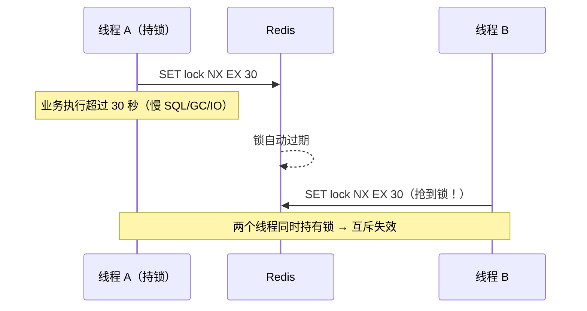

# 分布式锁：场景、实现与正确姿势

在单机多线程中，我们用 `synchronized`/`ReentrantLock` 保证互斥；服务拆成多实例后，锁必须**跨进程、跨机器**生效——这就是分布式锁。它的本质是：**在共享存储（数据库/Redis/ZooKeeper/etcd）上达成一个"谁拿到、谁释放"的互斥约定**。本文先梳理应用场景与四种主流实现方案，再深入讲解 Redis 分布式锁的正确姿势。

## 第一部分 应用场景与四种实现方案

### 1. 应用场景

| 场景 | 问题 | 锁的作用 |
|------|------|---------|
| **秒杀/库存扣减** | 多实例并发扣减库存，超卖 | 同一商品的扣减操作串行化 |
| **定时任务** | 多实例同时执行同一定时任务，重复处理 | 全局只允许一个实例执行 |
| **分布式缓存重建** | 缓存击穿时多实例同时查库重建 | 只允许一个实例回源重建 |
| **资源幂等操作** | 重复支付回调、重复下单 | 同一业务 ID 只处理一次 |
| **分布式组件协调** | 选主、分片分配、全局 ID 生成 | 互斥选出一个执行者 |

> 判断是否真需要分布式锁的标准：**多个进程并发操作同一共享资源，且不允许并发**。若可通过"唯一约束 + 幂等 + 乐观锁"解决，优先用数据库能力，而不是引入锁服务。

### 2. 四种实现方案对比

| 方案 | 实现方式 | 优点 | 缺点 |
|------|---------|------|------|
| **数据库** | `SELECT ... FOR UPDATE` 行锁 / 唯一索引 + 插入记录 | 简单可靠、无额外组件 | 性能差（行锁 + 连接开销）、锁无超时易死锁、DB 压力大 |
| **Redis** | `SET key value NX EX` + Lua 释放 | 性能最高（微秒级）、实现简单 | 锁自动过期有边界问题、主从切换可能丢锁 |
| **ZooKeeper** | **临时顺序节点** + Watch | 可靠（会话级自动释放）、**无死锁**、公平（FIFO） | 性能低于 Redis（毫秒级）、需维护 ZK 集群 |
| **etcd** | **Lease + Revision + Watch**（`concurrency` 包） | 强一致（Raft）、TTL 可续租、SDK 成熟 | 性能低于 Redis、K8s 生态绑定 |

### 3. 数据库方案速览

```sql
-- 方案 A：悲观锁（行锁）
BEGIN;
SELECT * FROM inventory WHERE id = 1 FOR UPDATE;
-- 业务处理...
UPDATE inventory SET stock = stock - 1 WHERE id = 1;
COMMIT;

-- 方案 B：唯一索引 + 插入（乐观）——锁表 lock_table(lock_name 唯一, expire_time)
INSERT INTO lock_table(lock_name, owner, expire_time) VALUES ('order_lock', 'svc-1', ?);
-- 成功 = 加锁；删除 = 释放；更新 expire_time = 续期
```

- 方案 A 简单但锁粒度=行锁，长事务拖垮库；方案 B 无锁但需处理**过期清理**与**重入**；
- 适用：**低并发、无额外中间件**的轻量场景。

### 4. ZooKeeper 方案：临时顺序节点

```text
加锁：在 /locks/order 下创建临时顺序节点 /locks/order/lock_0000000001
判断：自己是序号最小的节点 → 获得锁
等待：不是最小 → 监听自己前一个节点的删除事件（Watch）
释放：删除节点 / 会话断开（临时节点自动删除）
```

- **临时节点 + 会话**：客户端崩溃时 ZK 自动删除节点，**天然防死锁**；
- **顺序节点 + Watch**：天然公平（FIFO），且避免"惊群"（只盯前一个节点）；
- 缺点：加锁/释放各需 1-2 次 RPC，毫秒级延迟；ZK 本身要保证多数派可用。

### 5. etcd 方案：Lease + Revision

```go
// Go 示例（etcd concurrency 包）
lock, err := concurrency.NewMutex(client, "/orders/1001")
lock.Lock(ctx)      // 内部：创建 Lease + Revision 排序 + Watch
defer lock.Unlock() // 释放 Lease
```

- 基于 **Raft 强一致**：锁状态不会因主从切换丢失（对比 Redis 主从场景）；
- **Lease 续租**：业务未结束可续租，避免"锁过期但业务还在跑"；
- K8s/云原生环境首选（etcd 常已存在，零新增组件）。

### 6. 选型建议

```text
性能优先、可容忍极端边界（锁丢失） → Redis（Redisson 封装）
强一致、防死锁、公平锁 → ZooKeeper / etcd
云原生环境、已有 etcd → etcd concurrency
极简场景、无中间件 → 数据库乐观/悲观锁
```

> 高频面试追问：**Redis 锁与 ZK 锁的可靠性差异**——Redis 锁在"主节点宕机、锁数据未同步到从节点"时可能**同时有两个客户端持锁**（边界场景）；ZK/etcd 靠多数派共识无此问题。极端安全场景（扣款、发券）选 ZK/etcd，常规防重场景 Redis 足够。

## 第二部分 Redis 分布式锁的正确姿势

### 7. 演进史：从两条命令到一条命令

**错误写法：SETNX + EXPIRE（非原子）**

```bash
SETNX lock:order:1001 uuid-001   # ① 加锁
EXPIRE lock:order:1001 30        # ② 设置过期（独立命令）
```

**问题**：① 与 ② 之间进程崩溃 → 锁永不过期 → **死锁**。

**正确写法：SET NX EX（原子）**

```bash
SET lock:order:1001 uuid-001 NX EX 30
```

一条命令原子完成"不存在才设置 + 过期时间"，加锁阶段的问题解决。

**释放：Lua 保证"只释放自己的锁"**

```lua
-- 释放锁前先校验 value 是否是自己（防止误删他人锁）
if redis.call("get", KEYS[1]) == ARGV[1] then
    return redis.call("del", KEYS[1])
else
    return 0
end
```

> **为什么必须 Lua？** `GET` 判断与 `DEL` 之间若并发，可能删掉**其他线程刚抢到的锁**（A 的锁过期后 B 拿到锁，A 的 DEL 把 B 的锁删了）。Lua 脚本在 Redis 中原子执行，杜绝竞态。

### 8. 核心问题：锁过期而业务未完成



**解法：看门狗（Watchdog）续期**——持有锁期间**定期延长过期时间**（如每 10 秒续到 30 秒），业务结束显式释放；进程崩溃则续期停止，锁自然过期。

```java
// Redisson 默认行为：看门狗每 10s 续期，锁默认 30s 过期
RLock lock = redisson.getLock("lock:order:1001");
lock.lock(30, TimeUnit.SECONDS);       // 手动指定 leaseTime 时看门狗不生效
try {
    // 业务逻辑
} finally {
    lock.unlock();                      // 显式释放
}
```

### 9. 完整正确姿势清单

| 要点 | 说明 |
|------|------|
| **原子加锁** | `SET key value NX EX`（或 Redisson API） |
| **唯一标识** | value 用 UUID/线程标识，释放时校验，防误删 |
| **原子释放** | Lua 脚本（GET 校验 + DEL） |
| **自动过期** | 防死锁；配合看门狗续期防"业务未完成锁先过期" |
| **可重入** | Redisson 用 Hash 结构 + 计数实现重入 |
| **等待机制** | 未抢到锁时阻塞等待（`tryLock` 支持超时），而非轮询风暴 |
| **时钟回拨** | 依赖 EX 过期时间，服务器时钟大幅回拨会影响锁生命周期（生产需 NTP 守护） |

### 10. 主从切换丢锁与 RedLock 争议

**丢锁场景**：锁写入 **master** 后，master 宕机、数据未同步到 slave → slave 晋升为 master → **锁丢失**，另一个客户端可再次加锁成功 → 互斥失效。

**RedLock 方案与争议**：RedLock（Redisson `RedissonRedLock`）对 **N 个独立 Redis 实例**（如 5 个）逐个加锁，**多数派（≥3）成功且总耗时 < 锁过期时间** 才算加锁成功。（注：新版 Redisson 已将 RedLock 相关 API 标记为废弃，官方建议改用单锁 + 考虑版本校验的方案。）

- **支持者**：分布式系统的多数派思想，抗单点；
- **反对者**（Martin Kleppmann 等）：分布式系统下**没有全局时钟**，无法证明"锁实际过期时间"绝对安全；GC 停顿期间锁可能同时失效；工程上反而引入更多复杂度；
- **官方回应**（Salvatore Sanfilippo）：承认理论边界，但认为实践可用；
- **结论**：生产上**绝大多数场景单主 Redis + 看门狗足够**；要求绝对互斥（如资金扣减）应改用 ZooKeeper/etcd 锁（共识机制无此问题）。

### 11. 应用层兜底：fencing token

即使锁可靠，也要防"**持锁者被 GC 暂停后继续执行过期操作**"——给锁加**单调递增的 token**，写数据时带 token，服务端校验 token 是否最新（旧 token 拒绝）：

```text
加锁成功 → token = 42（Redis INCR 全局计数）
释放后 B 加锁 → token = 43
A（GC 恢复）带着 token=42 提交写操作 → 服务端拒绝
```

> 这是"锁的正确性最终要靠业务幂等/版本号兜底"的经典体现——**分布式锁保证互斥，幂等保证正确**。

### 12. 面试 Q&A

1. **SETNX 和 SET NX EX 的区别？** 后者原子 = NX + 过期；前者需配合 EXPIRE，两步非原子会死锁；
2. **为什么释放锁要用 Lua？** 保证"判断是自己 + 删除"原子执行，防止误删他人锁；
3. **锁过期了业务没执行完怎么办？** 看门狗续期（Redisson 自动），或业务内主动续期；
4. **Redis 锁和 ZK 锁怎么选？** 性能场景 Redis；绝对互斥场景 ZK/etcd（无主从丢锁问题）；
5. **RedLock 可靠吗？** 理论上有争议（无全局时钟），工程上单主 + 看门狗 + 幂等兜底是主流。

## 总结

- 分布式锁解决**跨进程互斥**：秒杀、定时任务、缓存重建、幂等防重；
- 四方案：数据库（最简）、Redis（最快）、ZooKeeper（最可靠防死锁）、etcd（云原生强一致）；选型三维度：**性能、一致性、运维成本**；
- Redis 锁正确姿势：**`SET key uuid NX EX` 原子加锁、Lua 原子释放、唯一标识防误删、看门狗续期、Redisson 可重入**；
- 主从切换可能丢锁 → 极端场景用 RedLock（有争议）或 ZK/etcd；
- 终极防线：**业务幂等 + token 校验**，锁只是第一道闸。

下一章进入服务治理篇：如何理解 RPC 远程服务调用？

---
