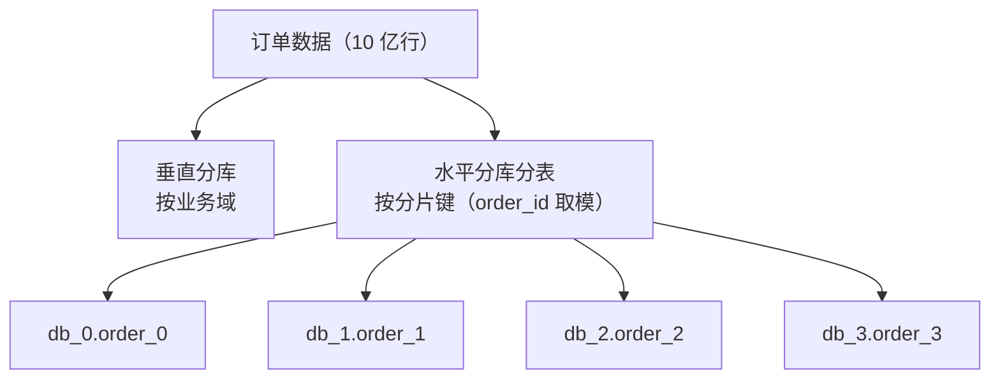

# 数据库扩展：读写分离、分库分表、分布式 ID 与扩容

当单库单表无法支撑业务增长时，数据库扩展遵循一条克制的路径：**先缓存 → 再读写分离 → 再分库分表**。本文整合数据库扩展的完整知识：读写分离与主从复制、分库分表（垂直/水平、分片键、算法、中间件）、拆分后的分布式唯一 ID、以及分库分表后的扩容难题。

## 第一部分 读写分离

### 1. 为什么需要读写分离

绝大多数业务是**读多写少**（读:写可达 10:1 甚至更高）。读写分离的核心思路：**主库承接写，从库承接读**，通过主从复制把写入同步到只读副本，把读压力横向摊开。它是数据库扩展的第一级台阶（比分库分表简单、成本低）。

| 痛点 | 读写分离的收益 |
|------|---------------|
| 单库连接数打满、读 QPS 高 | 读流量分发到 N 个从库，容量线性扩展 |
| 慢查询拖垮写入 | 分析查询（报表/统计）打到从库，主库专注 OLTP |
| 备份/分析任务影响线上 | 从库承担备份导出、数据仓库 ETL |

### 2. 主从复制原理（基于 binlog）


| 版本 | 复制方式 | 说明 |
|------|---------|------|
| 5.6+ | **GTID 复制** | 全局事务 ID，主从切换无需手动找 binlog 位点 |
| 5.7+ | 多源复制 / 并行复制 | 从库多线程回放，缓解延迟；5.7.22+ 支持 WRITESET 依赖追踪 |
| 8.0 | 并行复制增强、`CHANGE REPLICATION SOURCE TO` 新语法 | 语句级/事务级并行，主从延迟大幅下降 |

```sql
-- MySQL 8.0 GTID 复制配置（从库）
CHANGE REPLICATION SOURCE TO
  SOURCE_HOST='10.0.0.1', SOURCE_PORT=3306,
  SOURCE_USER='repl', SOURCE_PASSWORD='xxx',
  SOURCE_AUTO_POSITION=1;
START REPLICA;
```

> 复制异步性根源：主库提交即返回，从库异步回放——**主从延迟（Seconds_Behind_Source）**由此而来，是读写分离必须面对的问题。

### 3. 读写路由的两种落地方式

**应用层路由（代码/框架）**：

```java
// ShardingSphere-JDBC 示例：一主一从
spring.shardingsphere.rules.readwrite-splitting.data-sources.rw.master-data-source-name=ds-master
spring.shardingsphere.rules.readwrite-splitting.data-sources.rw.slave-data-source-names=ds-slave-0,ds-slave-1
spring.shardingsphere.rules.readwrite-splitting.data-sources.rw.load-balancer-name=round_robin
```

- 优点：性能优（直连数据库）、灵活（可编程路由规则）；
- 缺点：侵入应用（引入 SDK）、多语言需各自实现。

**中间件路由（代理层）**：

| 中间件 | 说明 |
|--------|------|
| **ProxySQL** | MySQL 原生代理：读写分离、连接池、故障转移，规则灵活 |
| **ShardingSphere-Proxy** | 兼容 MySQL 协议，读写分离 + 分库分表一体 |
| **MyCat** | 老牌中间件，读写分离 + 分片 |

- 优点：应用零侵入、集中管理、多语言通用；
- 缺点：多一跳代理（延迟 + 运维成本）、要保高可用（代理自身不能单点）。

### 4. 主从延迟：读写分离的头号问题

**问题场景**：用户下单成功（写主库）→ 立即查询订单（路由到从库）→ 复制未完成 → 查不到！

**解决方案**：

| 方案 | 说明 | 适用 |
|------|------|------|
| **关键读走主库** | 订单/支付等强一致读强制路由主库 | 资金、订单类核心链路 |
| **延迟容忍** | 设置读从库延迟阈值，超阈值自动切主库（ShardingSphere hint） | 通用 |
| **半同步复制** | `rpl_semi_sync_source_enabled=ON`：主库等至少一个从库 ack 再提交 | 缩小延迟窗口 |
| **缓存标记** | 写后 1s 内读缓存（Redis 写后置），避开窗口期 | 高并发场景 |
| **并行复制调优** | 8.0 开启 WRITESET 并行，减少从库回放延迟 | 大事务多的系统 |

> 通用原则：**能容忍延迟的读走从库，不能容忍的读走主库**——路由规则要按"数据维度"配置，而不是一刀切。

### 5. 数据复制的模型与协议（内核视角）

**复制三问**：复制什么（逻辑 vs 物理）、向哪里复制（主从/多主/无主）、何时复制（同步 vs 异步）。

**同步 vs 异步**：同步复制等所有副本确认后返回（强一致、不丢数据，但任一副本不可用即阻塞写入）；异步复制本地提交即返回（写入延迟低、可用性强，但可能丢数据）。工程折中：**半同步复制**（等至少一个副本 ack）、**多数派提交**（Quorum，等 W > N/2 确认）。

**复制模型（拓扑）**：主从（读多写少）、多主（多数据中心，有写冲突）、无主（Dynamo 系，需 Quorum 读多写多）。

**复制协议**：基于语句（简单、对非确定性函数敏感）、基于行（稳健，MySQL 8.0 默认）、基于 WAL（精确，耦合存储实现）。

**复制与一致性的关系**：异步复制 → 最终一致；半同步/Quorum → 近似强一致；全同步/多数派 + 线性化读 → 强一致。分布式数据库（TiDB、Spanner、OceanBase）普遍采用 **Raft/Paxos 多数派复制**。

### 6. 落地检查清单

- [ ] 从库只读（`read_only=ON`，防误写造成主从不一致）
- [ ] 监控主从延迟（`SHOW REPLICA STATUS` 的 Seconds_Behind_Source + 延迟告警）
- [ ] 链路保活：从库宕机自动摘除（健康检查）
- [ ] 复制冲突处理：从库唯一索引冲突及时告警
- [ ] 主库 binlog 保留策略（`binlog_expire_logs_seconds`）

## 第二部分 分库分表

### 7. 什么时候需要分库分表

```text
单库连接数/写入 QPS 接近上限（如写 QPS > 5000）
单表数据量过大（如 > 2000 万 ~ 5000 万行，索引 B+ 树层数增加、DDL 锁表时间长）
单表存储空间过大（> 100GB，备份/迁移困难）
```

> 拆分的顺序与克制：**先缓存 → 再读写分离 → 再分库分表**。分库分表是最后手段——它带来的复杂度（事务、Join、聚合、扩容）远超前两者。

### 8. 拆分方式

**垂直拆分（按业务/字段）**：垂直分库（按业务域拆到不同库：用户库、订单库、商品库）；垂直分表（大宽表拆成"常用字段表 + 扩展字段表"）。优点：业务隔离清晰、单库压力下降；缺点：**跨库事务**、跨库 Join 变应用层组装。

**水平拆分（按数据行）**：水平分表（同库内按分片键拆表）、水平分库（数据分布到多库实例）、分库分表（先分库再分表）。



### 9. 分片键与分片算法

**分片键选择（核心决策）**：高频查询条件（查询必须带分片键才能精确定位）、数据分布均匀（避免热点分片）、不可变或极少变（分片键变更 = 数据迁移）。典型：订单表按 `order_id` 或 `user_id` 分片。

**常见分片算法**：

| 算法 | 实现 | 优点 | 缺点 |
|------|------|------|------|
| **取模** | `shard = id % N` | 简单、分布均匀 | 扩容翻倍要全量迁移（N 变化） |
| **范围** | 按 ID/时间区间分片 | 扩容友好（追加新区间） | 数据倾斜（热点集中在新区） |
| **哈希** | `hash(id) % N` | 分布均匀 | 同取模，扩容难 |
| **一致性哈希** | 哈希环 + 虚拟节点 | **扩容只影响少量数据** | 实现复杂 |
| **基因法** | 子表 ID 蕴含分片信息 | 无需额外映射表 | 设计约束多 |

### 10. 中间件选型

| 中间件 | 形态 | 特点 |
|--------|------|------|
| **ShardingSphere-JDBC** | 应用内 SDK | 性能最好、功能全；侵入应用 |
| **ShardingSphere-Proxy** | 独立代理 | 零侵入、多语言；多一跳 |
| **MyCat** | 独立代理 | 老牌、SQL 解析能力强；社区活跃度下降 |
| **Vitess** | K8s 原生（CNCF） | 大规模、云原生（YouTube 出品）；复杂度高 |

### 11. 拆分后的"代价清单"

| 问题 | 影响 | 解法 |
|------|------|------|
| **跨库查询/Join** | 无法单库 SQL 完成 | 冗余字段、应用层组装、宽表/汇总表 |
| **分布式事务** | 跨库写不一致 | 柔性事务（TCC/Seata/消息） |
| **全局唯一主键** | 自增主键冲突 | 雪花算法/号段模式（见下） |
| **聚合查询/排序分页** | 需全分片聚合 | 数据异构到 ES/ClickHouse 分析 |
| **扩容** | 分片数变化需迁移 | 一致性哈希/双写迁移（见下） |
| **分布式 ID 与关联** | 业务键非分片键时定位难 | 索引表/基因法 |

## 第三部分 分布式唯一 ID

### 12. 分布式 ID 的硬性要求

| 要求 | 说明 |
|------|------|
| **全局唯一** | 任何时刻、任何节点生成的 ID 不重复 |
| **趋势递增/单调递增** | 递增 ID 利于 B+ 树索引插入（避免页分裂）与分页排序 |
| **高性能** | 高并发下下发延迟低（本地生成 > 远程获取） |
| **高可用** | 生成服务故障不影响业务 |
| **安全** | 不泄露业务量（如订单量、用户量） |

### 13. 五种方案对比

| 方案 | 唯一性 | 递增 | 性能 | 可用性 | 缺点 |
|------|--------|------|------|--------|------|
| **UUID** | ✅ | ❌ 随机 | 最高（本地） | 最高 | 36 字符、无序（索引页分裂）、无业务含义 |
| **数据库自增/号段** | ✅ | ✅ | 中 | 中（DB 依赖） | DB 单点/性能瓶颈（号段缓解） |
| **Redis INCR** | ✅ | ✅ | 高 | 高（集群） | 依赖 Redis、RDB 持久化可能丢号 |
| **雪花算法** | ✅ | ✅ 趋势 | 最高（本地生成） | 最高 | **时钟回拨风险**、依赖机器号 |
| **号段模式（Leaf）** | ✅ | ✅ | 高 | 高 | 实现复杂、依赖 DB 双机房 |

**UUID**：`UUID.randomUUID().toString()`，本地生成零依赖，但**无序**（聚簇索引频繁页分裂）、36 字符过大、不携带信息——最简单但最不推荐。

**数据库自增与号段模式**：单库自增不可用于分库分表；号段模式一次取一段（如 10001~11000）内存递增分配，用尽再取。**美团 Leaf-segment** 双 buffer 预加载 + 双机房 DB 双写，趋势递增、可用性高。

**Redis INCR**：`INCR order:id:gen` 原子递增。简单、性能高，但**持久化丢号**（RDB 快照间隔期间宕机可能重复）。

### 14. 雪花算法（Snowflake）：工业界标配

```text
64 位 long：
┌──────────────┬────────────┬─────────────┬──────────────┐
│ 1 bit 符号位  │ 41 bit 时间戳 │ 10 bit 机器号 │ 12 bit 序列号 │
│ （固定 0）    │ （毫秒级）   │ （5bit 机房+5bit 机器）│ （同毫秒内自增） │
└──────────────┴────────────┴─────────────┴──────────────┘
```

- 组成：`(当前毫秒 - 起始毫秒) << 22 | 机器号 << 12 | 毫秒内序列号`；
- 单机每秒可生成 **409.6 万**个 ID（12bit 序列号 × 1000）；
- 优点：**本地生成、无网络开销、趋势递增、可反解时间与机器**（排查定位）；
- 缺陷与解法：
  - **时钟回拨**（NTP 校正导致时间倒退）→ 序列号兜底/等待时钟追上/拒绝服务（百度 UidGenerator 用"未来时间"补偿）；
  - 机器号分配 → 手动配置/ZK 注册（Leaf-snowflake 用 ZK 分配机器 ID）。

```java
// 雪花算法核心（简化）
long id = (timestamp - twepoch) << 22
        | (workerId << 12)
        | sequence;
```

**美团 Leaf 综合方案**：Leaf-segment（号段，需要趋势递增的订单号/主键）与 Leaf-snowflake（雪花，需要高性能本地生成）。

### 15. 选型建议

```text
简单场景（单应用、低并发） → 数据库自增/号段
高性能注册中心常有 → Redis INCR（可容忍丢号）或自研雪花
分库分表主键 / 订单号 → 雪花算法（推荐）或 Leaf-segment
需要严格递增且可预测性无所谓 → 号段模式
```

> 补充：**业务 ID 与数据库主键分离**——业务展示用分布式 ID，数据库内部仍可用自增，但分库时必须全局唯一，故主流仍是分布式 ID 直接做主键。

## 第四部分 分库分表后的扩容

### 16. 扩容的难点

扩容（从 N 个分片扩到 2N 个分片）的核心矛盾：**既要迁移数据，又要尽量不影响线上服务**。主要难点：

- **取模分片扩容需数据重分布**：`id % N` 变为 `id % 2N` 后，几乎全部数据映射改变，需要大规模迁移；
- **停机 vs 不停机**：停机迁移简单但影响业务，不停机迁移（双写）复杂但平滑；
- **数据倾斜**：扩容时若分片不均会导致部分节点过载。

### 17. 常见扩容方案

**翻倍扩容（二次取模）**：新库数量是旧库的 2 倍，通过"先按旧库取模、再在新库组内取模"的方式，使**旧数据只需迁移一半**。例如从 4 个库扩到 8 个库，旧 `db_i` 的数据只迁到 `db_i` 或 `db_i+4`，迁移量减半。

**一致性哈希**：节点增删只影响哈希环上相邻的一小段数据，迁移量小；但可能数据倾斜，需虚拟节点缓解（详见「负载均衡」篇的一致性哈希）。

**平滑扩容（双写 + 全量迁移）**：
1. 新集群预建，与旧集群并存；
2. 业务写入**双写**（旧集群 + 新集群）；
3. 对旧数据做**全量迁移**到新集群；
4. 校验一致后，将读流量逐步切换到新集群；
5. 确认无误后下线旧集群。

**中间件辅助**：ShardingSphere 等提供数据迁移工具（ShardingSphere Migration），配合路由规则变更实现平滑扩容。

### 18. 扩容后的校验与收尾

- **数据一致性校验**：对比旧/新集群的 count、hash 摘要（如对分片数据计算整体 hash）确保迁移无丢失；
- **灰度切换**：先切少量读流量，观察延迟与错误率，再逐步放量；
- **回滚预案**：切换失败时能快速回切到旧集群；
- **索引与查询优化**：扩容后确认分片路由命中率，避免出现全分片广播查询。

## 总结

- 数据库扩展路径：**缓存 → 读写分离 → 分库分表**，分库分表是代价最高的最后手段；
- **读写分离**：主库写 + 从库读 + binlog 复制，核心问题是主从延迟（关键读走主库、半同步、并行复制）；
- **分库分表**：垂直拆解决隔离，水平拆解决容量；**分片键决定一切**；拆分带来跨库 Join、分布式事务、全局主键、扩容四大代价；
- **分布式 ID**：五要求（唯一/递增/高性能/高可用/安全）；雪花算法（64 位 = 时间戳+机器号+序列号）是标配，核心风险是**时钟回拨**；号段模式（Leaf）适合趋势递增；
- **扩容**：翻倍扩容（迁移减半）、一致性哈希（迁移量小）、平滑扩容（双写 + 全量迁移 + 灰度切换）是三大思路；
- 核心原则：**拆分前先评估"拆了还能合回去吗"**，尽量用更轻的手段解决。

下一章讲解 NoSQL 数据库的典型应用与 Elasticsearch 的索引原理。

---
