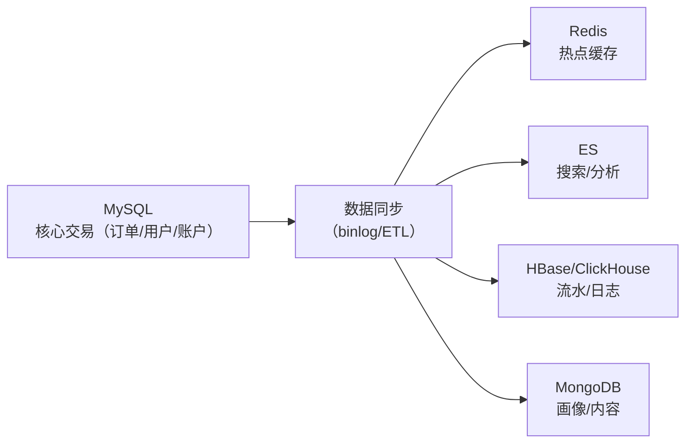
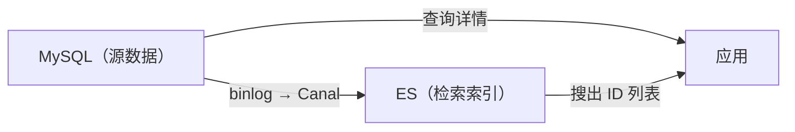

# NoSQL 与 Elasticsearch：存储引擎、倒排索引与选型

关系型数据库（MySQL）擅长**结构化数据 + 事务**，但在海量高并发、弹性扩展、非结构化数据面前力不从心。本文整合非关系型存储的完整知识：NoSQL 四大家族与选型、分布式数据库的演进与分类、Elasticsearch 的倒排索引与近实时机制、以及底层存储引擎（B+树/LSM/列式）原理。

## 第一部分 NoSQL 数据库

### 1. 关系型 vs NoSQL：能力光谱

| 维度 | 关系型（MySQL/PostgreSQL） | NoSQL |
|------|---------------------------|-------|
| 数据模型 | 表 + 行 + 外键 | KV/文档/列族/图（模型多样化） |
| 事务 | ACID 强事务 | 多数弱事务（部分支持 ACID 子集） |
| 扩展 | 垂直为主，分库分表复杂 | **天然水平扩展**（数据分片内置） |
| 一致性 | 强一致（单机）/复制延迟 | 最终一致为主（可配置） |
| 查询 | SQL 强大（Join/聚合） | 按其模型查询，弱 Join |
| 适用 | 核心交易、强一致、复杂查询 | 海量数据、高并发、灵活模型 |

> 不是"替代"而是"互补"：**核心交易数据留 MySQL，海量/高速/灵活数据上 NoSQL**——混合架构是主流实践。

### 2. NoSQL 四大家族

**KV 存储**：

| 代表 | 特点 | 典型应用 |
|------|------|---------|
| **Redis** | 内存级性能、丰富数据结构、过期策略 | 缓存、Session、分布式锁、排行榜、限流计数 |
| **Memcached** | 纯缓存、简单 | 读多场景缓存 |
| **etcd** | Raft 强一致、Watch | 配置、选主、服务发现（K8s） |

**文档型**：

| 代表 | 特点 | 典型应用 |
|------|------|---------|
| **MongoDB** | BSON 文档、schema-less、分片集群、事务（4.0+） | 内容管理、用户画像、日志、产品目录 |
| CouchDB | 离线优先、同步 | 移动端同步场景 |

**列族存储**：

| 代表 | 特点 | 典型应用 |
|------|------|---------|
| **HBase** | 列族组织、海量数据、顺序读写、强一致 | 订单流水、消息存储、时序数据 |
| **Cassandra** | 去中心化（无主）、最终一致、写性能极强 | 物联网、消息、跨机房多活 |
| **ClickHouse** | 列式 + 压缩，分析性能极强 | OLAP 分析、日志分析 |

**图数据库**：

| 代表 | 特点 | 典型应用 |
|------|------|---------|
| **Neo4j** | 属性图模型、Cypher 查询、原生图存储 | 社交关系、推荐、风控关系图谱 |
| JanusGraph | 分布式图 | 超大规模图 |

### 3. 典型业务选型矩阵

| 业务需求 | 推荐选型 | 理由 |
|---------|---------|------|
| 高速缓存/会话/计数 | **Redis** | 内存性能 + 数据结构丰富 |
| 高并发秒杀库存 | Redis + MySQL | 缓存写 + 数据库兜底 |
| 用户画像/产品目录（结构多变） | **MongoDB** | 灵活 schema + 索引 |
| 海量日志/流水（写入为主） | **HBase / ClickHouse** | 列式存储 + 海量扩展 |
| 社交关系/风控图谱 | **Neo4j** | 图查询天然高效 |
| 配置/选主强一致 | **etcd** | Raft 共识 |
| 跨机房多活写 | **Cassandra** | 无主 + 最终一致 |

### 4. 混合架构实践



- **同步链路**：binlog → Canal → 各 NoSQL（近实时同步，秒级）；
- 原则：**以 MySQL 为源，NoSQL 为衍生**，避免多写混乱；
- 一致性：容忍秒级延迟，关键路径读 MySQL。

## 第二部分 分布式数据库

### 5. 分布式数据库的定义与分类

分布式数据库定义为：**由多个独立实体组成、彼此通过网络互联的数据库**。核心差异两点：**数据分片**（突破单机容量、水平扩展）与**数据同步**（多副本/一致性协议恢复"用起来像单库"的一致性）。

**发展脉络**：商业时代（Oracle RAC，共享存储）→ NoSQL 时代（Cassandra/MongoDB）→ NewSQL 时代（Spanner/TiDB）→ 云原生数据库（PolarDB/Aurora）。

| 类型 | 代表产品 | 特点 |
| --- | --- | --- |
| **关系型分布式数据库** | TiDB、OceanBase | 兼容 SQL，支持事务与强一致性 |
| **NoSQL** | Cassandra、MongoDB | 水平扩展能力强，弱化 ACID |
| **NewSQL** | Spanner、CockroachDB | 兼具 SQL 体验与水平扩展能力 |

**与 CAP 的关系**：CP 路线（TiDB、OceanBase，多数派协议，分区时少数派拒绝服务）；AP 路线（Cassandra、DynamoDB，最终一致）。

### 6. 新型数据库概念辨析

| 概念 | 关注点 | 核心特征 | 代表 |
|------|--------|----------|------|
| **云原生数据库** | 部署形态 | 计算存储分离、资源池化、托管运维 | Aurora、TiDB、Snowflake |
| **HTAP** | 负载融合 | 行存服务事务 + 列存服务分析 | TiDB（TiFlash）、PolarDB |
| **图数据库** | 数据模型 | 节点 + 边建模关系 | Neo4j、Nebula Graph |
| **内存数据库** | 存储介质 | 数据主要驻留内存 | Redis、VoltDB、SAP HANA |

> 注意：四个概念**不在同一维度**——云原生是部署形态、HTAP 是负载融合、图是数据模型、内存是存储介质，可同时具备。

**选型五维度**：数据模型、一致性要求、扩展方式、运维能力、生态兼容（是否需兼容 MySQL/PostgreSQL 协议）。

### 7. 典型案例分析

**TiDB（计算存储分离的 HTAP）**：计算层（无状态 SQL 节点）+ 存储层（TiKV，Raft + Range 分片 Region）+ 调度层（PD 管理元数据与 Region 调度）。计算存储独立水平扩展，通过 TiFlash 列存支持 HTAP。

**PolarDB-X（分库分表 + Paxos）**：计算节点（CN 无状态 SQL）+ 存储节点（DN 基于 Paxos/Raft 多副本）+ 元数据（GMS）。强一致、高可用，适合金融级事务。

**Cassandra（无主架构的最终一致）**：无主架构（任意节点读写）、LSM 存储（高写入吞吐）、最终一致（Gossip 与反熵收敛）。适合写多、可容忍最终一致的场景。

### 8. 传统扩展方案与中间件

在原生分布式数据库成熟前，业界用四种方式"扩展"单机数据库：**共享存储**（Oracle RAC，垂直扩展，共享存储是瓶颈）、**读写分离**（主写从读，副本复制延迟）、**分库分表**（ShardingSphere 类，跨库事务/JOIN 复杂）、**分布式缓存前置**（Redis 缓解读压力）。

**数据库中间件**（ShardingSphere、MyCat、Vitess）把分片、路由、读写分离从应用下沉到基础设施，是传统库向分布式过渡的桥梁。局限：跨分片 JOIN、分布式事务能力有限，随原生方案成熟多用于**存量系统迁移过渡**。

**NewSQL**：兼具 SQL 接口 / ACID 事务与水平扩展能力（Spanner 的 TrueTime + Paxos + 2PC、CockroachDB、TiDB、VoltDB）。共性技术：数据分片 + 多副本复制 + 共识（Raft/Paxos）+ 分布式事务。

## 第三部分 Elasticsearch 索引

### 9. 正排 vs 倒排：索引的本质区别

```text
正排索引（MySQL 主键索引）：
  文档 ID → 内容："MySQL 教程"、"Java 并发编程"、"分布式系统"
  查询"编程" → 遍历所有文档 → 逐条匹配 → O(N) 全扫描

倒排索引（ES）：
  词条 → 文档 ID 列表：
    "mysql"   → [doc1]
    "教程"    → [doc1]
    "java"    → [doc2]
    "编程"    → [doc2]
    "分布式"  → [doc3]
  查询"编程" → 直接定位 doc2 → O(1) 命中
```

| 维度 | 正排索引 | 倒排索引 |
|------|---------|---------|
| 结构 | 文档 → 词条 | 词条 → 文档 |
| 查询 | 全文扫描慢 | 词条定位快（毫秒级） |
| 适用 | 精确匹配、范围查询 | 全文检索、模糊匹配 |

> 倒排索引三层结构：**Term Index（FST 结构，常驻内存，把词条快速定位到 Term Dictionary 的 block）→ Term Dictionary（词条字典，分块存盘，按序排列支持二分）→ Posting List（倒排列表，FOR 增量编码，交集场景用 Roaring Bitmap 位图）**；倒排列表还支持**词频/位置**信息用于相关度排序（TF-IDF/BM25）。

### 10. 文档写入：从 JSON 到倒排索引


**分词（Analyzer）**：写入时文本经过 Analyzer 处理：`字符过滤 → 分词器 → Token 过滤器`。**中文分词**用 IK 分词器；不配置时中文被 standard analyzer **逐字切分**（每个汉字成词），检索效果差。检索时**查询词也要走同一 Analyzer**——"分词一致"是检索正确的前提。

**近实时可见（NRT）**：

```text
写入 → 内存 buffer（不可搜索）+ translog（崩溃恢复）
refresh（默认 1s）→ buffer 生成 segment（可搜索）
flush → segment 落盘 + translog 清空
merge → 小段合并大段（控制段数量）
```

ES 是**近实时**（默认 `refresh_interval=1s`，写入后约 1 秒可搜到）；要更强实时性可调小（如 `100ms`，代价是写入吞吐），大批量导入时调大（如 `30s`）可显著提速。深分页注意：`from+size` 默认最大 10000，翻页深时用 `search_after` 或 `scroll`。

### 11. 分布式架构：分片与副本

| 概念 | 说明 |
|------|------|
| **索引（Index）** | 逻辑命名空间，类似数据库的"表" |
| **分片（Shard）** | 索引数据的物理切片，每个分片是独立 Lucene 索引 |
| **副本（Replica）** | 主分片的拷贝：**高可用 + 读扩展** |
| **路由** | `routing = hash(docId) % 分片数`，定位文档所在分片 |

> 规划要点：**分片数创建后不可修改**（修改需重建索引）——按数据量与节点数预算；副本数可动态调整。版本口径：7.0 起新建索引默认 **1 主分片 + 1 副本**；mapping 的 type 概念 7.x 废弃、8.0 移除。

### 12. ES 与 MySQL 的配合



- **双写/同步**：业务写 MySQL（权威数据），通过 binlog 同步（Canal/Logstash）到 ES——**MySQL 管事务，ES 管检索**；
- **查询路径**：ES 搜出文档 ID → 回 MySQL/Redis 查详情；
- 一致性：容忍秒级同步延迟，可配合软删除/版本号。

## 第四部分 存储引擎

### 13. 存储引擎的职责与三大类型

存储引擎是数据库负责数据落盘、读取与组织的底层组件：数据的物理组织、索引维护、写入缓冲与刷盘、崩溃恢复。

| 引擎类型 | 组织方式 | 优点 | 缺点 | 典型代表 |
|----------|----------|------|------|---------------|
| **B+ 树** | 叶子节点有序链表，支持高效范围查询 | 读友好、范围查询强 | 随机写产生大量随机 I/O | MySQL InnoDB、PostgreSQL |
| **LSM-Tree** | 写先入 MemTable，刷成有序 SSTable | 顺序写、写入吞吐高 | 读需合并多层（读放大） | Cassandra、RocksDB |
| **列式** | 按列存储，同列数据连续 | 高压缩比、聚合查询快 | 点查与单行写入效率低 | ClickHouse、HBase 列族 |

### 14. 日志型存储：LSM-Tree

日志型存储将所有写转化为**顺序追加**，充分利用磁盘顺序写带宽。流程：写入先进入内存的 **MemTable**（有序结构）→ 达到阈值刷盘为不可变的 **SSTable** → 读取时从 MemTable 与各层 SSTable 合并最新值 → 后台 **Compaction** 合并多层并回收过期数据。

**三类放大**：

| 放大类型 | 定义 | 缓解策略 |
|----------|------|----------|
| **写放大** | Compaction 时同一份数据反复读写 | 调整分层大小比、合并阈值 |
| **读放大** | 一次读可能要查多层 SSTable | 布隆过滤器、缓存 |
| **空间放大** | 过期数据在 Compaction 前仍占空间 | 及时 Compaction、分层策略 |

> 日志型存储的"日志"思想与预写日志（WAL）一致：**先写日志再改内存**，保证崩溃后可重放恢复。

### 15. 分布式索引与计算存储分离

**分布式索引**：数据分片后如何快速定位目标数据。无索引时需广播所有分片（Scatter-Gather）。**本地索引**仅覆盖本分片；**全局索引**记录每个键到分片的映射，点查可一次定位，但需额外维护、可能有热点。二级索引更新与数据写入不在一个原子操作中，需异步补偿。

**计算存储分离与 HTAP**：现代分布式数据库普遍采用计算与存储分离（TiDB、Snowflake、Aurora），计算节点无状态弹性扩缩、存储层独立扩展；HTAP 让同一引擎同时服务 OLTP 与 OLAP。

### 16. 主流引擎三大系

- **LSM-Tree 系**：RocksDB（嵌入式 LSM，TiDB/CockroachDB 的存储底座）、Bigtable/HBase（分布式列族）、Cassandra（去中心化 LSM，无主架构）；
- **B+ 树系**：InnoDB（MySQL 默认，聚簇索引 + WAL）、PostgreSQL（堆表 + 索引，MVCC）；
- **列式系**：ClickHouse（MPP 列式）、Parquet/ORC（列存文件格式，数据湖）。

## 总结

- NoSQL 四家族：**KV（Redis）、文档（MongoDB）、列族（HBase/Cassandra）、图（Neo4j）**，各解决一类问题；核心价值：**水平扩展、高性能、灵活模型**；
- 主流实践是**混合架构**：MySQL 为源 + NoSQL 衍生，异步同步；
- 分布式数据库：分片 + 同步 + 共识；NewSQL（Spanner/TiDB）兼得 SQL 与扩展，HTAP 一套系统兼顾 OLTP/OLAP，云原生是部署形态变革；
- **ES**：倒排索引（词条 → 文档）实现毫秒级全文检索；写入链路"分析 → 倒排索引 → buffer + translog → refresh 段 → 落盘"；近实时由 refresh 决定；分片 + 副本支撑扩展与高可用；
- **存储引擎**：B+树（读友好）、LSM-Tree（写吞吐高）、列式（分析强）；LSM 三类放大（写/读/空间）与缓解；
- 面试高频：倒排索引实现、ES 近实时原因、B+树/LSM/列式区别、NewSQL vs NoSQL、HTAP 定义。

下一章进入消息队列篇：消息队列的应用场景与选型。

---
