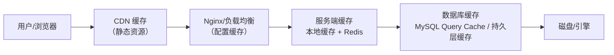

# 分布式缓存：多级体系、穿透击穿雪崩、一致性与高可用

缓存是分布式系统提升性能最直接的手段，也是面试高频考点。本文整合分布式缓存的完整知识：多级缓存体系、缓存穿透/击穿/雪崩（"缓存三兄弟"）、缓存与数据库一致性、缓存过期与淘汰策略、一致性哈希、以及 Redis 高可用方案。

## 第一部分 多级缓存体系

### 1. 缓存的全链路视图

提起缓存，很多人首先想到 Redis、Memcached 等服务端缓存，但分布式系统的缓存远不止于此——从前端页面、浏览器，到网络 CDN，再到服务端和数据库，**每一个环节都有缓存**。

以打开一个电商商品详情页为例，一次请求会经过多级缓存：



逐级命中则直接返回，未命中才继续向下"回源"，实现层层拦截、逐级加速。

### 2. 各层缓存详解

**前端缓存**：页面缓存（首访渲染本地存储）、浏览器本地存储（localStorage/sessionStorage/离线缓存）、浏览器自身缓存（图片视频）、App 端缓存。

**网络传输缓存**：CDN（内容分发 + 就近缓存）、负载均衡层缓存（Nginx 缓存极少修改的配置信息）。

**服务端缓存**（对性能提升最大、业务打交道最多）：
- **本地缓存**（应用内缓存）：Guava Cache、Caffeine 或 Map 结构；随服务重启失效、应用灵活，适合热点数据与配置；
- **外部缓存（分布式缓存）**：Redis、Memcached；对整体性能提升最大，是缓存体系核心。

**数据库缓存**：持久层缓存（MyBatis，易不一致，生产不推荐）、MySQL 查询缓存（更新频繁收益有限，MySQL 8.0 已移除）。

### 3. 多级缓存的协同设计

多级缓存的核心价值是**逐级拦截、分层加速**，同时要注意各层一致性与成本：

| 缓存层 | 特点 | 一致性成本 | 适用 |
|--------|------|-----------|------|
| 前端/浏览器 | 离用户最近、最快 | 高（难以主动失效） | 静态资源、低频数据 |
| CDN | 就近分发、抗压 | 中 | 静态资源、图片视频 |
| 本地缓存 | 无网络开销 | 中（服务内一致） | 热点数据、配置 |
| 分布式缓存 | 共享、容量大 | 低（可集中管理） | 业务数据、高 QPS |
| 数据库缓存 | 接近真实数据 | 高 | 极少用 |

设计要点：**按数据更新频率与一致性要求选择缓存层级**；越靠近用户的缓存越快但越难主动失效，越靠近数据的缓存越易保证一致。

## 第二部分 缓存穿透、击穿与雪崩

### 4. 三大问题的区别与解决方案

设计缓存系统不得不考虑缓存穿透、缓存击穿与失效时的雪崩效应。

| 问题 | 定义 | 触发 | 解决方案 |
|------|------|------|---------|
| **缓存穿透** | 查询**不存在**的数据，缓存无数据，每次都打 DB | 恶意请求/频繁查不存在的 key | 缓存空值、布隆过滤器 |
| **缓存击穿** | 某个**热点 key** 过期瞬间，大量请求打到 DB | 热点 key 失效 | 互斥锁、逻辑过期、热点 key 永不过期 + 后台更新 |
| **缓存雪崩** | **大量 key 同时过期**或缓存集群宕机，DB 被击穿 | 大量 key 同一时间过期 | 过期时间加随机值、集群高可用、多级缓存、限流降级 |

### 5. 缓存穿透

缓存穿透指查询不存在的数据：缓存无数据、数据库也无数据，导致每次请求都穿透到数据库。恶意攻击者常利用不存在的 key 造成数据库压力。

**解决方案**：

- **缓存空值**：查询数据库为 null 时，也缓存一个空值（设置较短过期时间），后续查询直接命中空缓存，避免反复打库；
- **布隆过滤器（Bloom Filter）**：在缓存层之前加布隆过滤器，用多个哈希函数把"可能存在的数据"标记到位数组。查询前先判断 key 是否可能存在，**不存在则直接拒绝**（拦截），减少无效请求打到缓存和数据库。

### 6. 缓存击穿

缓存击穿指某个**热点 key** 在过期瞬间，大量并发请求同时打到数据库。与穿透的区别：穿透是"查询不存在的数据"，击穿是"热点数据过期"。

**解决方案**：

- **互斥锁**：当缓存失效时，只允许一个线程去查询数据库并重建缓存，其他线程等待。用分布式锁（如 Redis SETNX）保证只重建一次；
- **逻辑过期**：给缓存设置逻辑过期时间（存在 value 中），读取时发现"逻辑过期"则异步去更新缓存，请求仍返回旧数据；
- **热点 key 永不过期 + 后台更新**：热点 key 不设置物理过期，由后台定时任务主动更新缓存，避免过期瞬间的击穿。

### 7. 缓存雪崩

缓存雪崩指**大量 key 同时过期**或**缓存集群宕机**，导致大量请求直接打到数据库，数据库被压垮。

**解决方案**：

- **过期时间加随机值**：给 key 的过期时间加一个随机偏差，避免大量 key 在同一时刻过期；
- **缓存集群高可用**：通过 Redis 主从 + 哨兵 / 集群模式，避免缓存节点宕机导致整体失效（详见 Redis 高可用部分）；
- **多级缓存**：本地缓存 + 分布式缓存 + 数据库逐级兜底；
- **限流降级**：缓存异常时通过限流保护数据库，避免请求全部穿透。

## 第三部分 缓存与数据库一致性

### 8. 数据不一致的产生

缓存层和数据库层是独立系统，无法原子性同时更新，可能出现"数据库更新成功、缓存更新失败"等不一致情况。以商品价格为例：商品 A 价格从 1000 更新为 1200，若数据库成功但缓存失败，用户仍看到 1000。

### 9. 更新缓存的三种时序方案

读流程通常固定：**先读缓存，未命中则读数据库并回填缓存**。关键在于**写流程**如何操作缓存。

| 方案 | 操作顺序 | 问题 | 结论 |
|------|---------|------|------|
| 先更新库再更新缓存 | DB → Cache | 更新缓存可能失败 | 不推荐 |
| 先删缓存再更新库 | Cache → DB | 并发回填旧值 | 有竞态 |
| **先更新库再删缓存** | DB → Cache | 删除失败 | **推荐（Cache Aside）** |

**Cache Aside（旁路缓存）**：读先查缓存，未命中读库并回填；写先更新数据库，成功后**删除缓存**。这是经典且推荐的方案。

为什么比"先删缓存"更好？考虑**读写分离 + 并发**场景：线程 A 删缓存 → 更新主库；线程 B 读缓存未命中 → 查**从库**（可能未同步新值）→ 回填旧值缓存；主从同步后缓存仍是旧值。而"先更新库再删缓存"，即使删除时是旧值，删除后下次读会重新从库拉取，最终一致。

### 10. 为什么删除缓存而不是更新缓存

- **更轻量**：删除比更新简单，出错概率小；
- **数据可能来自聚合**：缓存数据常由多张表聚合（商品详情关联商品表、价格表、库存表），更新一个字段要重新聚合查询，代价高；
- **懒加载（Lazy Loading）**：更新后的缓存可能长期闲置，删除缓存、下次命中时再填充，节省计算资源。

### 11. 删除缓存失败怎么办：延迟双删

Cache Aside 中删除缓存可能失败，可用**延迟双删**补偿：

```text
更新数据库 → 删除缓存 → （等待短暂时间）→ 再次删除缓存
```

第二次删除规避"删除期间有并发请求回填旧缓存"，配合 MQ 重试更可靠。

### 12. 进阶方案：Binlog 异步同步

对一致性要求更高的场景，可通过 **Binlog 订阅**异步更新缓存：数据库更新产生 Binlog，Canal 等组件监听并解析变更，异步更新/删除对应缓存（可结合 MQ）。优点：与业务代码解耦，缓存与 DB 最终一致更可靠。

### 13. 多级缓存的更新

多级缓存（应用内缓存 + 外部缓存）数据同步较复杂：常见方案是数据库更新后通过**消息队列通知**失效各级缓存；多级缓存一致性较难保证，一般用于对一致性不敏感的业务，也可通过**版本号/时间戳**控制缓存版本实现最终一致。

## 第四部分 缓存过期与淘汰策略

### 14. 页面置换算法（淘汰策略的起源）

缓存淘汰策略源自操作系统的**页面置换算法**，经典算法有三种：

| 算法 | 全称 | 淘汰依据 |
|------|------|---------|
| **FIFO** | First In First Out | 最早被存储的优先淘汰 |
| **LRU** | Least Recently Used | 最近最少使用的优先淘汰 |
| **LFU** | Least Frequently Used | 一段时间内使用次数最少的优先淘汰 |

### 15. Redis 内存淘汰策略

当 Redis 内存使用达到最大值（`maxmemory`）时，启动内存淘汰策略：

| 策略 | 操作范围 | 淘汰方式 |
|------|---------|---------|
| **noeviction**（默认） | - | 写请求直接返回错误，**不淘汰** |
| allkeys-lru | 所有 key | 按 LRU 淘汰 |
| **allkeys-lfu**（4.0+） | 所有 key | 按 LFU 淘汰 |
| allkeys-random | 所有 key | 随机淘汰 |
| volatile-lru | 设置过期时间的 key | 按 LRU 淘汰 |
| **volatile-lfu**（4.0+） | 设置过期时间的 key | 按 LFU 淘汰 |
| volatile-random | 设置过期时间的 key | 随机淘汰 |
| volatile-ttl | 设置过期时间的 key | 越早过期越优先淘汰 |

> **注意区分**：内存淘汰是**缓存服务层**的操作（内存不足时腾空间）；过期策略定义的是**具体缓存数据何时失效**（key 过期后如何处理）。两者不同。

### 16. Redis 缓存过期策略

- **定时过期**：为每个 key 创建定时器，到点立即清除。优点：立即删除不浪费内存；缺点：大量定时器消耗 CPU。
- **惰性过期**：访问某个 key 时才判断是否过期并删除。优点：节省 CPU；缺点：大量过期但未访问的 key 长期占用内存。
- **定期过期**：维护"即将过期"的 key 字典，每隔一定时间扫描并清除。优点：在 CPU 与内存间平衡。

> Redis 实际采用**定期删除 + 惰性删除**组合。另需关注**缓存雪崩**：大量 key 同时失效会冲击数据库，可通过过期时间**随机打散**规避。

### 17. 手写 LRU 缓存（高频面试题）

实现 LRU 缓存是高频面试题，核心是**在 O(1) 内完成读写并维护"最近使用"顺序**。

**基于 LinkedHashMap（简单版）**：

```java
public class LRUCache extends LinkedHashMap {
    private int cacheSize;
    public LRUCache(int cacheSize) {
        super(16, 0.75f, true);  // accessOrder=true 按访问顺序
        this.cacheSize = cacheSize;
    }
    @Override
    protected boolean removeEldestEntry(Map.Entry eldest) {
        return size() > cacheSize;
    }
}
```

**基于 HashMap + 双向链表（进阶版）**：

```java
public class LRUCache {
    private final int capacity;
    private final HashMap<Integer, Node> map = new HashMap<>();
    private Node head, tail;   // 头尾哨兵

    class Node {
        int key, value;
        Node prev, next;
        Node(int k, int v) { key = k; value = v; }
    }

    public LRUCache(int capacity) { this.capacity = capacity; }

    public int get(int key) {
        Node node = map.get(key);
        if (node == null) return -1;
        moveToHead(node);
        return node.value;
    }

    public void put(int key, int value) {
        Node node = map.get(key);
        if (node != null) { node.value = value; moveToHead(node); return; }
        node = new Node(key, value);
        map.put(key, node);
        moveToHead(node);
        if (map.size() > capacity) removeTail();
    }

    private void moveToHead(Node node) { /* 摘出并插入头部 */ }
    private void removeTail() { /* 移除尾部节点并同步 map */ }
}
```

原理：**头部为最近访问、尾部为最久未访问**；`get`/`put` 命中后移动到头部，容量满时淘汰尾部节点（LeetCode 146）。

## 第五部分 一致性哈希

### 18. 缓存集群与数据分发

缓存从单点扩展到集群后，数据该放哪台节点、从哪台读取，变成负载均衡问题。缓存集群有**数据同步**（全副本）和**数据不同步**（分片）两种方式。数据不同步方案的核心是**路由策略**——如何决定某个 Key 落到哪台节点。

### 19. 取模哈希的路由问题

最常见方式是 Key 哈希后对节点数取模：

```java
public Integer getRoute(String key) {
    int cacheIndex = key.hashCode() % 5; // 假设 5 台缓存服务器
    return cacheIndex;
}
```

取模哈希适合**节点数量固定**的场景，但对**横向扩展极不友好**：若节点从 5 台扩到 10 台，`key % 5` 变 `key % 10`，**几乎所有 Key 路由错误**，缓存全部失效、请求直落数据库（引发缓存雪崩）。同理缩容也导致大量 Key 重新路由。

### 20. 一致性哈希

一致性哈希是一种特殊的哈希算法：**在槽位（节点）数量改变时，平均只需要对 K/n 个关键字重新映射**（K 为关键字总数，n 为槽位数）。

**原理**：通过**哈希环**（0 ~ 2^32-1 的圆环）实现：
1. 将各节点按哈希值映射到环上；
2. 数据 Key 也哈希到环上；
3. 数据归属"**顺时针遇到的第一个节点**"。

**扩容/缩容优势**：节点下线时，原本路由到它的数据只需顺时针迁移到下一个节点，**其他节点数据完全不受影响**。

**数据倾斜问题**：节点分布不均时部分节点承载过多数据；若环上连续多个节点宕机，数据都转移到下一个节点，流量数倍甚至更高，直至被打爆，引发连锁**缓存雪崩**。

**虚拟节点解决倾斜**：对每个物理节点生成多个虚拟节点（如 A → a1/a2/a3）均匀分布在环上，数据分布更均匀，节点故障时数据分散到多个节点。

**工程实现思路**：Java 可用 `TreeMap` 实现——基于红黑树，`tailMap(fromKey)` 方法直接取"顺时针下一个节点"：

```java
public class ConsistentHash {
    private final TreeMap<Integer, String> ring = new TreeMap<>();
    private final int replicas; // 虚拟节点数

    public void addNode(String node) {
        for (int i = 0; i < replicas; i++) {
            ring.put(hash(node + "#" + i), node);
        }
    }

    public String getNode(String key) {
        Integer h = hash(key);
        SortedMap<Integer, String> tail = ring.tailMap(h);
        Integer target = tail.isEmpty() ? ring.firstKey() : tail.firstKey();
        return ring.get(target);
    }
}
```

### 21. 一致性哈希 vs 取模哈希

| 维度 | 取模哈希 | 一致性哈希 |
|------|---------|-----------|
| 节点变化 | 几乎全部 Key 重新映射 | 仅 K/n 个 Key 重新映射 |
| 扩容/缩容 | 缓存大面积失效 | 迁移量小、影响面小 |
| 数据倾斜 | 依赖哈希均匀 | 需虚拟节点缓解 |
| 适用 | 节点固定、简单分发 | 缓存分片、动态扩缩容、会话保持 |

## 第六部分 Redis 高可用

### 22. 缓存高可用的核心手段

缓存（Redis/Memcached）作为内存服务，单点存在**内存有限、进程宕机数据丢失、无法支撑高并发**问题。高可用方案核心目标：**冗余**（数据多副本）与**自动故障转移**（主节点故障自动切换）。

### 23. Redis 主从复制

主从复制将主节点（Master）数据复制到从节点（Slave），通过 `slaveof`（新版 `replicaof`）开启。作用：**数据备份**（主从最终一致）与**读写分离**（主写、从读，缓解并发）。

**局限**：主从复制本身**不提供自动选主**——主节点宕机需人工晋升从节点，因此需要**哨兵（Sentinel）**实现自动故障转移。

### 24. Redis Sentinel（哨兵）

Sentinel 是官方推荐的高可用方案，独立进程，实现：**监控**（持续监控主从状态）、**通知**（故障时通知客户端）、**自动故障转移**（Master 不可用时投票选出新 Master）。

哨兵若单点部署，自身宕机则高可用失效，因此 **Sentinel 必须集群部署**：多个 Sentinel 节点互相监控，发现 Master 不可达时通过投票（Quorum + 多数派）确认下线并触发切换，全程无需人工干预。

> 注意：Sentinel 解决的是**高可用（故障转移）**，不解决**数据分片（容量/并发横向扩展）**。

### 25. Redis Cluster（官方集群）

当单主从无法承载更多写入与容量时，需要**分片**——把数据分散到多个 Master。Redis Cluster 特点：

- **无中心架构**：所有节点对外服务，路由分片、负载信息、节点状态维护都在 Cluster 内实现，不依赖外部代理；
- **Gossip 通信**：节点间通过 Gossip 协议传播槽位与节点状态，易横向扩展；
- **直连高性能**：客户端直接连接目标节点，避免 Proxy 中间一跳；
- **16384 个槽位（Slot）**：数据按 Key 哈希映射到槽位，每个节点负责一部分槽位。

Redis Cluster 中每个槽位可以有副本（Replica），**分片（容量扩展）+ 副本（故障转移）**由 Cluster 统一管理，是同时解决"容量"和"高可用"的完整方案。

### 26. Codis（Proxy 方案）

Codis 采用**中心化 Proxy 结构**：引入 **Codis Proxy**（路由与分片）+ **Codis Manager + ZooKeeper**（维护节点状态与槽位映射）。客户端连接 Proxy 而非直接连接 Redis。

**Redis Cluster vs Codis**：

| 维度 | Redis Cluster | Codis |
|------|--------------|-------|
| 架构 | 无中心，节点直连 | 中心化 Proxy |
| 路由 | 客户端根据槽位直连 | 客户端经 Proxy 转发 |
| 性能 | 高（无中间一跳） | 略低（Proxy 开销） |
| 迁移/监控 | 官方原生 | 迁移、监控更简便 |

两者思路截然不同：Cluster 把路由能力下沉到节点与客户端，Codis 集中到 Proxy。随着 Redis Cluster 成熟（Codis 逐渐停止维护），**新项目普遍采用官方 Redis Cluster**。

### 27. 缓存不可用时的降级策略

- **限流降级**：缓存集群异常时通过限流保护数据库；
- **熔断旁路**：检测缓存不可用，走"降级数据源"（本地缓存、静态兜底数据、DB 降级查询），快速失败而非长时间阻塞；
- **多级缓存**：本地缓存（Caffeine）→ 分布式缓存（Redis）→ DB 逐级兜底；
- **异步刷新**：缓存重建通过异步任务，避免缓存失效瞬间的击穿。

## 总结

- **多级缓存**：前端/CDN/本地/分布式/数据库各层，按数据特性选择层级并权衡一致性成本；
- **缓存三兄弟**：穿透（缓存空值、布隆过滤器）、击穿（互斥锁、逻辑过期、热点永不过期）、雪崩（过期随机值、集群高可用、多级缓存、限流降级）；
- **一致性**：推荐 **Cache Aside**（先更新库再删缓存），删除失败用**延迟双删/MQ 重试**补偿；高一致性场景用 **Binlog（Canal）异步同步**；
- **过期/淘汰**：FIFO/LRU/LFU；Redis 内存淘汰（noeviction/allkeys-lru 等）+ 过期策略（定期 + 惰性）；LRU 实现是高频面试题；
- **一致性哈希**：解决缓存扩容/缩容时的失效问题，虚拟节点缓解数据倾斜；
- **Redis 高可用**：主从复制 + 哨兵（故障转移）+ Cluster（分片 + 副本），缓存不可用时用降级策略兜底。

---
