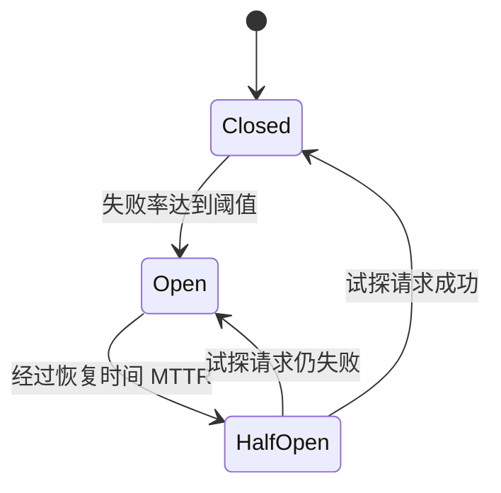

# 高可用保障：限流、熔断降级与负载均衡

高可用是分布式系统的核心目标，围绕**限流、降级、熔断、隔离**四大手段展开。本文整合四部分内容：从电商大促看高可用的整体保障体系、系统限流算法与实现、降级与熔断机制、以及负载均衡策略选型。

## 第一部分 从双十一看高可用保障体系

### 1. 大促的高可用挑战

电商大促（双十一、618、秒杀）是对系统架构的"大考"，核心目标是**稳定性**。大促面临三大业务特点，对应三方面的技术挑战：

| 业务特点 | 表现 | 技术挑战 |
|---------|------|---------|
| **海量用户** | 流量是平时千百倍甚至万倍 | 弹性扩容、容量规划 |
| **流量突增** | 秒杀流量瞬间达峰，曲线陡峭 | 削峰、缓存预热、独立集群 |
| **高并发** | QPS 为平时数百倍以上 | 并发设计、防超卖/丢单、锁冲突 |

- **海量用户 → 弹性扩容与容量规划**：容器化（Docker + K8s）可快速水平扩展实例，是支撑大促扩容的基础设施；
- **流量突增 → 削峰与预热**：独立热点集群、消息队列削峰、商品缓存预热；
- **高并发 → 并发设计与防异常**：避免订单丢失、库存扣减异常、超卖，以及 ThreadLocal 数据错乱、锁冲突死锁。

### 2. 可用性（SLA）的计算

"4 个 9、5 个 9"指 99.99%、99.999%。关键：**链路可用性随依赖服务数量指数级下降**。假设核心链路依赖 10 个服务，每个可用性 99.99%，则整条链路约为 `0.9999^10 ≈ 99.90%`——**直接下降一个数量级**。因此高可用保障必须**全链路**看待，而非单点。

### 3. 高可用保障的核心手段

微服务架构下，某个服务故障可能沿调用链传导，引发**服务雪崩**（一个服务宕机 → 链路上连续失败 → 整体超时 → 系统停止服务）。避免雪崩的四大手段是高可用"8 字箴言"：

| 手段 | 作用 |
|------|------|
| **限流** | 限制进入系统的流量，防止超载 |
| **降级** | 主动牺牲非核心功能，保核心链路 |
| **熔断** | 依赖故障时快速失败，切断故障传导 |
| **隔离** | 故障隔离（线程池/舱壁隔离、独立集群），防止局部故障扩散 |

再加上其他支撑手段：**缓存**（支撑海量读）、**消息队列**（削峰填谷）、**负载均衡**（流量分发 + 故障转移）、**稳定性指标 + 监控 + 日志**（发现与定位问题）、**全链路压测**（大促前验证容量与预案）、**预案演练 + 故障复盘**。

### 4. 业务降级：以"大促限制退款"为例

大促当天往往限制退款等非核心业务，这是典型的**业务降级**：退款并非下单的核心流程，暂停不影响主线成交；活动期间订单量巨大，平台没有足够人力处理退款。降级的原则是**"保核心、舍非核心"**。

## 第二部分 系统限流

### 5. 为什么需要限流

当外部请求接近或达到系统最大承载阈值时，若不加控制，系统会被压垮、引发雪崩。限流就是**通过限制单位时间内的请求量，保护系统不被击穿**。

限流前需先**了解系统吞吐上限**（结合容量规划与压测确定最大水位）。触发限流后，可配合降级策略：**延迟处理**（请求排队）、**拒绝服务**（直接返回失败）、**随机拒绝**（按比例丢弃）。这与 Java 线程池拒绝策略（`AbortPolicy`/`DiscardPolicy`/`DiscardOldestPolicy`）思想一脉相承。

### 6. 常见限流算法

**计数器法（固定窗口）**：统计单位时间内请求数，超过阈值即拒绝。

```java
public class CounterLimiter {
    private long startTime = System.currentTimeMillis();
    private AtomicInteger requestCount = new AtomicInteger(0);
    private final int interval = 10000;
    private final int limit = 100;

    public boolean tryAcquire() {
        long now = System.currentTimeMillis();
        if (now < startTime + interval) {
            return requestCount.incrementAndGet() <= limit;
        }
        startTime = now;
        requestCount.set(0);
        return true;
    }
}
```

优点：实现简单；单点用内存，集群可用 Redis/Memcached 实现**分布式限流**。缺点：**临界流量不友好**——两个窗口交界处可能"两秒内 2 倍流量"。

**滑动窗口**：把时间窗口细分为多个小格子，随请求时间**平滑滑动**，比固定窗口更精确，避免"两倍窗口"问题。代价是实现稍复杂、需更多状态存储。

**漏桶算法**：固定容量、底部小孔的桶，请求流入桶中，以**恒定速率**漏出处理，超过桶容量被丢弃。优点：**出口速率恒定**，请求曲线平滑；缺点：**限流过于严格**，不允许任何突发，浪费系统处理能力。

**令牌桶算法**：固定容量桶装**令牌**，固定速率放令牌（桶满丢弃）。请求到达时**取令牌**，取到放行，桶空拒绝。优点：**允许一定突发流量**（桶中积累令牌），比漏桶更符合真实业务。代表实现：Guava `RateLimiter`。

```java
// 每秒放 100 个令牌
RateLimiter limiter = RateLimiter.create(100);
for (int i = 1; i < 200; i++) {
    if (limiter.tryAcquire(1)) {
        System.out.println("第" + i + "次请求成功");
    } else {
        System.out.println("第" + i + "次请求拒绝");
    }
}
```

### 7. 限流算法对比与选型

| 算法 | 平滑性 | 突发容忍 | 实现复杂度 | 适用 |
|------|--------|---------|-----------|------|
| 计数器（固定窗口） | 差（临界问题） | 否 | 最低 | 简单场景、集群限流 |
| 滑动窗口 | 较好 | 否 | 中 | 需要更精确的控制 |
| 漏桶 | 好（恒定速率） | 否 | 中 | 需要严格匀速处理 |
| **令牌桶** | 好 | **是** | 中 | **应用最广泛** |

**选型结论**：令牌桶兼顾"限流 + 允许合理突发"，是实际项目（尤其秒杀、电商大促）的首选；追求绝对匀速则用漏桶。

### 8. 单机限流与分布式限流

- **单机限流**：每个实例内存维护计数器/令牌桶，实现简单，但**无法做全局总量控制**；
- **分布式限流**：借助 Redis 等共享存储，用 **Lua 脚本**保证"取令牌 + 扣减"的原子性，实现集群整体限流。

### 9. 限流的工程实践

结合**容量规划**先压测定阈值；按**接口/用户/IP/设备**维度分别限流；超限请求走**降级**（排队、兜底、快速失败）；限流触发次数、拒绝率需**可观测**。

## 第三部分 降级与熔断

### 10. 服务降级

**为什么降级**：大促时请求量剧增，而系统资源（服务器）是有限成本。**降级解决"资源不足"与"海量请求"之间的矛盾**：在流量暴增时主动对非核心、非关键业务做有策略的放弃，释放资源保证核心业务。

**降级的对象**：通常是业务闭环中的**次要功能**（如大促时的评论、退款），使用率低、不是核心链路。降级也常以降低某些场景的一致性要求为代价。

**降级的实施要点**：
- **梳理核心流程**：明确哪些业务"可被牺牲"、哪些是核心链路；
- **明确开启时机**：在系统水位达到阈值时开启，非常态开启；
- **开关化配置**：降级做成**开关**（配置项），通过**分布式配置中心**远程打开/关闭，无需发版；
- **兜底响应**：降级后的请求返回统一兜底结果（空数据、提示信息），本质是快速失败。

> 广义上，**限流也是一种降级**（针对部分请求的降级），两者常结合使用。

### 11. 服务熔断

**熔断的目的**：保护业务系统**不被下游系统的异常或大流量拖垮**。当依赖的服务出现大量失败时，若不停重试，会导致请求阻塞、级联失败，最终引发**服务雪崩**。

例：订单服务依赖评论服务，若评论服务部分机器宕机、大量调用失败，无熔断时订单系统会反复重试，导致大量请求阻塞并影响上游。开启熔断后，可在检测到一定比例失败时**主动截断对下游的调用**，保护自身。

**熔断器状态机（FSM）**：

| 状态 | 说明 |
|------|------|
| **Closed（关闭）** | 正常状态，请求正常放行；当失败率达到阈值（如 50%），进入 Open |
| **Open（打开）** | 截断状态，对下游调用直接返回错误；经过**恢复时间（MTTR）**后进入 Half-Open |
| **Half-Open（半开）** | 试探状态，允许少量请求通过；若成功则恢复 Closed，否则回到 Open |



**熔断的流量调节**：熔断不只是"开/关"，还可做**渐进式流量调节**——下游 10% 失败 → 减少 50% 请求；50% 异常 → 减少 80% 请求；恢复后逐步放量。

### 12. 主流组件对比

| 能力 | Sentinel | Hystrix | resilience4j |
|------|----------|---------|--------------|
| **隔离策略** | 信号量隔离（并发线程数限流） | 线程池/信号量隔离 | 信号量隔离 |
| **熔断降级策略** | 响应时间、异常比率、异常数 | 异常比率 | 异常比率、响应时间 |
| **实时统计实现** | 滑动窗口（LeapArray） | 滑动窗口（RxJava） | Ring Bit Buffer |
| **动态规则配置** | 支持多种数据源 | 支持多种数据源 | 有限支持 |
| **扩展性** | 多个扩展点 | 插件形式 | 接口形式 |
| **限流** | 基于 QPS、支持调用关系限流 | 有限支持 | Rate Limiter |
| **流量整形** | 预热、匀速器、预热排队模式 | 不支持 | 简单 Rate Limiter |
| **系统自适应保护** | 支持 | 不支持 | 不支持 |
| **控制台** | 开箱即用，可配规则、秒级监控 | 简单监控查看 | 不提供 |

**选型建议**：**Sentinel**（功能最全面，国内使用广泛）> **resilience4j**（轻量）> **Hystrix**（已停维）。

### 13. 降级 vs 熔断

| 维度 | 降级 | 熔断 |
|------|------|------|
| 目的 | 主动放弃非核心，释放资源保核心 | 被动截断对故障下游的调用，防雪崩 |
| 触发 | 主动、按业务开关（如大促） | 被动、按失败率/响应时间阈值 |
| 对象 | 非核心业务/功能 | 依赖的下游服务调用 |
| 手段 | 返回兜底结果、关闭非核心功能 | 熔断器状态机、流量渐进调节 |

两者常配合使用：**限流控制入口流量，熔断保护依赖调用，降级兜底业务结果**。

## 第四部分 负载均衡

### 14. 常见负载均衡策略

| 策略 | 原理 | 优点 | 局限/适用 |
|------|------|------|----------|
| **轮询（Round Robin）** | 顺序轮流分发 | 简单均匀 | 假设节点同构；节点异构时可能过载 |
| **加权轮询** | 按能力权重分配 | 适配异构节点 | 生产中常用基础策略 |
| **随机** | 随机选择 | 简单 | 请求量小时分布不均 |
| **最小连接数** | 选并发数最小节点 | 实时反映负载 | 处理时长差异大、长连接场景 |
| **最小响应时间** | 选响应时间最短节点 | 引导流量到最快节点 | 延迟敏感场景 |
| **一致性哈希** | 哈希环 + 虚拟节点 | 节点变化只影响少量数据 | 缓存分片、会话保持 |

### 15. 服务端 vs 客户端负载均衡

| 维度 | 服务端负载均衡 | 客户端负载均衡 |
|------|--------------|--------------|
| 列表维护 | 集中在独立负载均衡器（Nginx/LVS） | 客户端各自维护实例列表 |
| 请求路径 | 请求先到 LB，再转发 | 客户端直接选择并调用 |
| 额外组件 | 需要独立 LB 节点 | 无需，客户端内实现 |
| 代表实现 | Nginx、LVS、F5 | Ribbon、Dubbo 内置路由 |

**客户端负载均衡**典型实现：Spring Cloud Ribbon（`RoundRobinRule`、`RandomRule`、`BestAvailableRule`、`WeightedResponseTimeRule`）、Dubbo（随机默认、轮询、最少活跃数、一致性哈希）。

### 16. 如何选择负载均衡策略

| 场景 | 推荐策略 | 原因 |
|------|---------|------|
| 节点同构、无状态、简单分发 | 轮询 | 简单均匀 |
| 节点异构（不同配置） | 加权轮询 | 按能力分配 |
| 请求处理时长差异大 | 最小连接 / 最小响应时间 | 实时感知负载 |
| 缓存、会话保持、有状态服务 | 一致性哈希 | 同 Key 固定节点 |
| 对延迟敏感 | 最小响应时间 | 引导流量到最快节点 |

负载均衡不仅是"分发流量"，更是**高可用的第一道防线**：当某节点故障时，好的策略（最小响应时间 + 健康检查）能自动把流量转移到健康节点，实现故障转移。

## 总结

- 高可用"8 字箴言"：**限流、降级、熔断、隔离**，链路可用性随依赖数量指数下降；
- **限流**：令牌桶（允许突发，最常用）、漏桶（匀速）、滑动窗口（精确）、计数器（简单）；分布式限流用 **Redis + Lua** 保证原子性；
- **降级**：主动牺牲非核心（开关化、兜底结果）；**熔断**：被动截断（Closed/Open/Half-Open 状态机 + 渐进式流量调节）；组件选型 **Sentinel > resilience4j > Hystrix**；
- **负载均衡**：轮询/加权/随机/最小连接/最小响应时间/一致性哈希按场景选择；服务端（Nginx/LVS）与客户端（Ribbon/Dubbo）负载均衡；
- 高可用三件套：**限流 + 熔断 + 降级**，协同保障系统稳定。

下一章讲解可观测性：稳定性指标、监控组件与统一日志。

---
