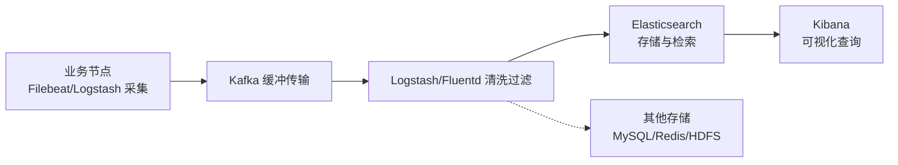

# 可观测性：稳定性指标、监控组件与统一日志

可观测性（Observability）是分布式系统稳定性的基石，围绕**指标（Metrics）、日志（Logs）、链路（Traces）**三大支柱建设。本文整合三部分内容：线上服务的稳定性指标体系、主流监控组件选型、以及分布式统一日志系统的设计与实现，最后给出故障处理的标准流程（SOP）。

## 第一部分 稳定性指标

### 1. 稳定性监控的三个环节

完整的稳定性监控体系包含三部分，缺一不可：

- **监控组件**：采集与展示指标的工具（Prometheus、OpenFalcon 等）；
- **监控指标**：采集什么、关注什么；
- **监控处理**：告警如何响应、故障如何处置（SOP）。

### 2. 稳定性指标的四个层次

稳定性指标可按 **服务器 → 系统运行（JVM）→ 基础组件 → 业务** 四个层次展开，从底层资源到业务效果层层递进。

**服务器监控指标**（宿主环境出问题，服务很难稳定）：

| 监控项 | 指标描述 | 告警关注点 |
|--------|---------|-----------|
| CPU 使用率（user/system） | 用户态/内核态进程占 CPU 比例 | 持续过高可能为死循环或过载 |
| CPU 空闲率 | 除 I/O 等待外的空闲时间比例 | 过低表示 CPU 紧张 |
| CPU iowait | CPU 空闲但仍有未完成 I/O 的时间占比 | 过高说明磁盘 I/O 是瓶颈 |
| load1 / load5 / load15 | 近 1/5/15 分钟运行队列平均进程数 | 与核数对比判断是否过载 |
| 内存利用率 | 已用内存 / 总内存 | 接近打满易引发 OOM |
| 磁盘容量 | 已用/未用容量 | 日志型应用需调低告警阈值 |
| 磁盘 I/O | 读写吞吐与等待 | 高 iowait 的根因排查 |

> 服务器指标需结合**核数与业务特点**配置：日志型应用磁盘需求大，磁盘告警阈值要相应调低。

**系统运行指标（JVM）**（以 Java 为例）：

| 监控项 | 指标描述 | 说明 |
|--------|---------|------|
| JVM 线程数 | 线程总数量 | 关注整体线程运行情况 |
| JVM 累计创建线程数 | 启动以来累计线程数 | 线程应复用，持续新增说明可能有泄漏 |
| JVM 死锁数 | 死锁线程个数 | 死锁不可接受，需及时排查 |
| blocked 线程数 | 阻塞态线程数 | 过多说明存在激烈锁竞争 |
| GC 次数 / GC 时间 | 各代 GC 频率与耗时 | 调优关键指标 |
| 老年代 GC 次数 / 时间 | 老年代 GC 表现 | 过于频繁说明内存紧张或有泄漏 |

**基础组件指标**（以数据库为例）：

| 监控项 | 指标描述 |
|--------|---------|
| 写入 / 查询 QPS | 数据库读写吞吐 |
| 死锁数 | 处理不及时会导致业务大量超时 |
| 慢查询 QPS | 慢查询多说明 SQL 或索引存在问题 |
| 活跃 / 总连接数 | 连接数打满会导致新请求被拒 |
| Buffer Pool 命中率 | 命中率低会引起数据库抖动、业务不稳定 |

**业务运行时指标**：业务指标因场景而异，需结合**上下游链路**与**产品、运营**一起对齐，明确**核心链路**并做**指标分级**。例如评论系统关注评论请求量、成功率、评论耗时、评论分布；电商关注下单转化、支付成功率、购物车等核心链路指标。

### 3. 核心稳定性指标定义

- **可用性（SLA）**：服务正常时间占比，如 99.9%、99.99%。一年 99.99% 约允许不可用 52 分钟，99.9% 约 8.76 小时。
- **RT（响应时间）**：处理请求耗时，重点看 **P95 / P99**（而非平均值），平均值会被极端值掩盖真实体验。
- **QPS / TPS**：每秒请求数 / 事务数，衡量吞吐。
- **错误率**：失败请求 / 总请求，超阈值即告警。
- **容量水位**：CPU、内存、连接数、带宽等资源使用率，用于容量规划与扩容依据。

### 4. 告警设计要点

- **分层分级**：把指标按重要程度分级（P0/P1/P2），不同级别对应不同响应时限与通知渠道，避免"一告警就刷屏"。
- **阈值合理**：阈值需结合历史基线（Baseline）设定，过高漏报、过低误报。
- **避免告警风暴**：对同类指标做聚合与去重，保证"告警即有效、告警即有人处理"。
- **可观测闭环**：指标异常 → 告警 → 定位（日志/链路）→ 处置 → 复盘，形成闭环。

## 第二部分 监控组件

### 5. 可观测性三支柱（Metrics / Logs / Traces）

现代分布式监控体系围绕**指标、日志、链路**三大支柱构建，三者互补：

| 支柱 | 回答的问题 | 典型组件 |
|------|-----------|---------|
| **指标 Metrics** | 系统/服务当前是否健康？趋势如何？ | Prometheus + Grafana |
| **日志 Logs** | 发生了什么？错误的具体内容？ | ELK（Elasticsearch + Logstash + Kibana） |
| **链路 Traces** | 一次请求经过了哪些服务？哪里慢？ | SkyWalking、Jaeger、Zipkin |

这三类数据通过**统一标记**（服务名、实例、TraceID）关联起来，才能在一次故障中"看到指标异常 → 查日志定位 → 看链路定位根因"。

### 6. 主流监控组件

**指标采集：Prometheus**（云原生时代的指标监控标准，CNCF 项目）：

- 采用**拉取（Pull）模型**定期从目标抓取指标：`scrape` 抓取 → TSDB 时序存储 → PromQL 查询 → Alertmanager 告警；
- 配合 **Grafana** 做可视化面板，是当前指标监控的事实标准组合；
- 适合 K8s、微服务、云原生环境，通过 exporter 采集各类系统与应用指标；
- 对比传统的 OpenFalcon/Zabbix（Push 模型、偏向主机/网络监控），Prometheus 更贴合应用层与容器环境。

**链路追踪：SkyWalking / Jaeger**：

- **SkyWalking**：Java 生态友好，无侵入（字节码埋点）、自带 UI 与拓扑分析，是国内微服务链路追踪的主流选择；
- **Jaeger / Zipkin**：分布式追踪标准，语言中立，适合异构系统（OpenTracing/OpenCensus 已合并为 **OpenTelemetry**，CNCF 项目，统一 Trace/Span 数据模型与上下文传播，是当前事实标准）；
- 核心数据模型：Trace（一次请求）/ Span（一个调用片段），通过 TraceID 串联。

**统一日志：ELK / EFK**：

- **Elasticsearch**：分布式检索与存储，支撑海量日志的实时检索；
- **Logstash / Fluentd（Filebeat）**：日志采集与清洗、传输；
- **Kibana**：可视化检索界面；
- 日志经"采集 → 传输（Kafka 缓冲）→ 清洗 → 存储（ES）→ 展示（Kibana）"的链路落地，日志中携带 TraceID 以便与链路关联。

**传统监控组件**（了解即可）：

| 组件 | 特点 | 适用 |
|------|------|------|
| **OpenFalcon** | 小米开源，指标完善，适合国内互联网场景 | 主机/业务指标监控 |
| **Zabbix** | Server-Agent 架构，支持网络设备/服务器监控 | 基础设施、网络设备监控 |
| **Nagios** | 监控设备丰富，告警能力强，但配置复杂 | 偏向运维的监控 |
| **CAT** | 大众点评开源，Java 生态，关注应用层埋点 | 应用层监控、性能分析 |

## 第三部分 统一日志系统

### 7. 传统日志查看方式及其局限

单机排查日志常用命令：`tail -n 10 test.log`、`tail -fn 1000 test.log | grep 'key'`、`head`、`cat`、`more/less`、`sed/awk` 等。这些命令适合**单机、小规模**排查，一旦面对几十上百台机器，逐个登录查看会非常低效。

传统日志收集有四大难题：

- **无法快速搜索**：基于文件检索效率低，难以跨文件聚合与做调用链分析；
- **集中收集存储难**：日志分布在上千节点，不可能逐台登录获取；
- **分析聚合可视化难**：数据分散，难以做全局分析与趋势统计；
- **日志安全问题**：业务日志含用户订单、账户等敏感数据，分散存储增加了泄露风险。

### 8. 统一日志系统的整体架构

分布式统一日志系统遵循 **采集 → 传输 → 存储 → 检索 → 可视化** 的链路：

| 环节 | 组件 | 职责 |
|------|------|------|
| 采集 | Filebeat / Flume / Logstash | 从节点实时采集日志 |
| 传输 | Kafka / Redis | 削峰缓冲，解耦采集与消费 |
| 清洗 | Logstash / Fluentd | 解析、过滤、格式化日志 |
| 存储检索 | Elasticsearch | 倒排索引，海量日志秒级检索 |
| 可视化 | Kibana | 查询、聚合、看板、告警 |

### 9. 主流技术栈：ELK / EFK / Loki

- **ELK（Elasticsearch + Logstash + Kibana）**：最经典组合。ES 基于倒排索引提供高性能检索；Logstash 核心是 `input{} / filter{} / output{}` 三段式配置；Kibana 提供可视化查询与看板。
- **EFK（Filebeat + Fluentd + Kibana）**：针对 Logstash 偏重（JVM、资源占用高）的问题，用更轻量的 Filebeat + Fluentd 替代采集与传输，是 K8s 环境的主流。
- **Loki**：Grafana 推出的日志聚合系统，只对**标签（Label）**建立索引，不建立全文索引，资源消耗远低于 ES，与 Prometheus 标签体系融合，适合云原生。

| 方案 | 优点 | 局限 | 适用 |
|------|------|------|------|
| ELK | 检索能力强、生态成熟 | Logstash 重、存储成本高 | 检索需求强、数据量可控 |
| EFK | 轻量、采集性能好 | 检索能力同 ES | K8s、采集节点多 |
| Loki | 资源占用低、与 Prometheus 结合 | 日志内容检索弱 | 云原生、偏标签查询 |

### 10. 统一日志系统的实践要点

- **链路追踪关联**：日志中携带 **TraceID**，与调用链路（SkyWalking/Jaeger）关联，实现"一次请求完整还原"；
- **日志分级与采样**：区分 DEBUG/INFO/ERROR，高并发下对低级别日志采样，避免日志洪峰打满磁盘；
- **高并发写入问题**：避免日志框架在高并发下阻塞业务线程（异步 appender）、日志丢失（批量刷盘）等问题；
- **日志安全**：对敏感字段（手机号、身份证、账号）脱敏，控制日志访问权限，防止数据泄露；
- **容量治理**：设置日志保留周期、按天分片归档，防止 ES 存储无限增长。

## 第四部分 故障处理 SOP

### 11. 故障处理原则

监控指标与组件只是工具（"术"），如何**及时发现问题并高效止血复盘**才是稳定性的关键（"道"）。线上故障处理通常遵循以下标准流程：

1. **第一时间同步**：发现故障立即同步到业务负责人及上下游链路，让相关方感知；
2. **快速止血**：优先恢复业务（如切流、回滚、限流、降级），而不是先查根因；
3. **协调资源防升级**：及时上报并协调资源，避免故障影响面扩大；
4. **事后复盘**：故障恢复后进行根因分析（RCA）、复盘总结，制定改进措施，避免再次发生。

## 总结

- 稳定性指标分四层：**服务器（CPU/内存/load）、系统（JVM/GC）、基础组件（DB/缓存/MQ）、业务**；核心指标：**可用性（SLA）、RT（重点 P99）、QPS、错误率、容量水位**；
- 可观测性三支柱：**指标（Prometheus + Grafana）、日志（ELK/EFK/Loki）、链路（SkyWalking/Jaeger）**，通过 TraceID 关联；
- 统一日志链路：**采集（Filebeat/Logstash）→ 传输（Kafka）→ 清洗 → 存储检索（ES）→ 可视化（Kibana）**；
- 告警要**分层、定阈值、去风暴**，并形成"监控 → 告警 → 处置 → 复盘"闭环；
- 监控是"术"，**故障处理的 SOP 与复盘制度是"道"**——快速止血、及时同步、事后复盘才能把稳定性工作做好。

---
